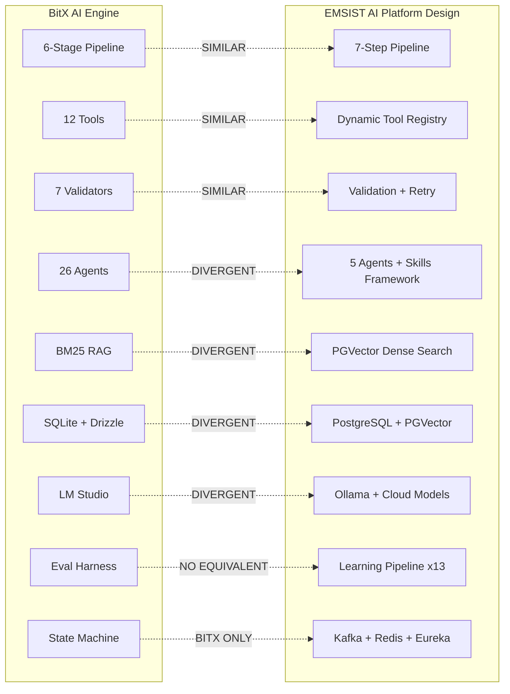

# Application & Infrastructure Architecture Validation

## BitX AI Engine vs EMSIST AI Agent Platform Design

**Date:** 2026-03-06
**Agent:** ARCH
**Principles Version:** ARCH-PRINCIPLES.md v1.1.0
**Scope:** Two-way comparison -- BitX Reference PDFs vs EMSIST Design Documents only (no source code referenced)

**Sources Compared:**

| Side | Documents Read |
|------|---------------|
| **BitX Reference** | `01-AI-ENGINE-ARCHITECTURE.pdf` (11 pages), `06-AGENT-INFRASTRUCTURE.pdf` (20 pages) |
| **EMSIST Design** | `01-PRD-AI-Agent-Platform.md`, `02-Technical-Specification.md`, `04-Git-Structure-and-Claude-Code-Guide.md`, `05-Technical-LLD.md`, `09-Infrastructure-Setup-Guide.md`, `10-Full-Stack-Integration-Spec.md` |

---

## Executive Summary

BitX and EMSIST share the same conceptual DNA -- dual-model local LLM architecture, multi-stage pipeline orchestration, tool-based agent execution, deterministic validation, and multi-tenant isolation. However, they diverge fundamentally in implementation philosophy: BitX is a **lightweight, local-first Node.js monolith** optimized for a single developer workstation, while EMSIST is an **enterprise-grade Spring Cloud microservices platform** designed for multi-tenant Kubernetes deployment with cloud model fallback, a 13-method learning pipeline, and full Spring AI integration.

**Key Findings:**

- **Application Architecture:** High conceptual alignment (both use staged pipelines, dual models, tool registries, validators). EMSIST extends BitX's 6-stage pipeline to 7 steps (adding Explain) and adds a comprehensive Skills framework, learning pipeline, and cloud model fallback -- none of which exist in BitX.
- **Infrastructure Architecture:** Fundamentally divergent. BitX runs on Fastify/SQLite/LM Studio with zero external dependencies. EMSIST specifies Spring Boot/PostgreSQL+pgvector/Ollama/Kafka/Redis/Eureka/Kubernetes with Docker Compose orchestration.
- **Service Architecture:** BitX is a single-process monolith. EMSIST is a distributed microservices system with 20+ planned services across 4 module groups.

**Alignment Score Distribution:**

| Classification | Count | Percentage |
|---------------|-------|------------|
| ALIGNED | 5 | 14% |
| SIMILAR | 12 | 34% |
| DIVERGENT | 9 | 26% |
| BITX-ONLY | 4 | 11% |
| EMSIST-ONLY | 5 | 14% |

---

## 1. Application Architecture Comparison

### 1.1 Pipeline Architecture

| Aspect | BitX (01-AI-ENGINE-ARCHITECTURE.pdf) | EMSIST Design (PRD Section 3.1, Tech Spec Section 3.9) | Alignment |
|--------|------|--------------|-----------|
| **Stage Count** | 6 stages: Intake, Context Gathering, Planning, Tool Loop, Validation, Finalize | 7 steps: Intake, Retrieve, Plan, Execute, Validate, Explain, Record | **SIMILAR** |
| **Intake** | Router or Worker parses request, builds system prompt from profile | Classify request (type, complexity), normalize, security validation | **SIMILAR** |
| **Context/Retrieve** | RAG search (BM25, top 5 results, score >= 0.05); up to 5 tool calls for file exploration | Orchestrator model triggers tenant-safe RAG queries; sources include user stories, process docs, API docs, test history | **SIMILAR** |
| **Planning** | Router model generates plan, saves as `plan` artifact | Orchestrator model selects agent profile/skill, produces execution plan JSON with agent/skill choice, tool sequence, success criteria | **SIMILAR** |
| **Execution** | Tool Loop: Worker or Router, max 15 iterations, max 3 tool calls per iteration, `<done>` signal to exit | Execute: Worker Model runs ReAct loop with configurable max turns, tool calls with timeouts/retries, self-reflection | **SIMILAR** |
| **Validation** | 7 code-enforced validators (allowed_paths, blocked_file_patterns, required_tests, diff_threshold, approval_required, tool_restrictions, output_schema) | Deterministic validation: backend rules engine, test suite execution, approval workflows, path-scope checks; retry loop back to Execute on failure | **SIMILAR** |
| **Finalize vs Explain+Record** | Finalize: Router summarizes, aggregates tokens/duration, transitions to `completed` | Explain: Orchestrator generates dual-audience explanation (business + technical + artifacts). Record: Full trace logged for learning pipeline | **DIVERGENT** |
| **State Machine** | 12 states: queued, intake, inventory, context_gathering, planning, tool_loop, validation, approval, finalizing, completed, failed, cancelled | Not explicitly defined in EMSIST Design as a formal state machine; pipeline is sequential with retry branching | **BITX-ONLY** |
| **Model Assignment per Stage** | Explicit per-stage: Intake=Router/Worker (per profile), Context=Router/Worker, Planning=Router, Tool Loop=Worker/Router, Validation=Engine (code), Finalize=Router | Explicit per-step: Intake/Retrieve/Plan/Explain=Orchestrator model, Execute=Worker model, Validate=deterministic code | **ALIGNED** |

**Analysis:** Both systems implement a multi-stage pipeline with the same logical flow: receive request, gather context, plan, execute with tools, validate, and finalize. The key structural difference is EMSIST's addition of the Explain step (generating business-readable explanations from the orchestrator model) and the Record step (logging everything for the learning pipeline). BitX's Finalize step combines a lightweight summary with run completion -- it does not generate separate business/technical explanations. EMSIST's pipeline is also explicitly designed to feed into a continuous learning system, which BitX does not have.

**Pros/Cons:**

- *BitX advantage:* Formal state machine with 12 states provides clear lifecycle tracking and error recovery. EMSIST Design should adopt a similar explicit state model.
- *EMSIST advantage:* The Explain step provides dual-audience transparency. The Record step enables continuous improvement. BitX has no learning feedback loop.

---

### 1.2 Agent Framework

| Aspect | BitX | EMSIST Design | Alignment |
|--------|------|---------------|-----------|
| **Agent Count** | 26 agents across 5 SDLC phases + Orchestrator | 5 initial agents (Data Analyst, Customer Support, Code Reviewer, Document Processor, Orchestrator) + pluggable architecture | **DIVERGENT** |
| **Agent Definition Format** | JSON profile files with fields: id, name, prefix, phase, modelRole, purpose, systemPrompt, allowedTools, forbiddenTools, allowedPaths, forbiddenPaths, approvalRequired, skills, receives, produces, boundaries | Java BaseAgent abstract class with methods: getAgentType(), getSkillSet(), getMaxTurns(), shouldReflect() | **DIVERGENT** |
| **Agent Organization** | By SDLC phase: Orchestrator (1), Discover (3), Design (4), Build (6), Test (10), Deploy (2) | By domain: Data analysis, customer support, code review, document processing. Orchestrator coordinates | **DIVERGENT** |
| **Model Role per Agent** | Per-profile: PM=Router, Discover/Design phase=Router/Worker, Build=Worker, Test=Router/Worker, Deploy=Router/Worker | Per-task-type: Orchestration tasks (planning/routing/explaining)=Orchestrator model, Execution tasks=Worker model or cloud | **SIMILAR** |
| **Agent Loading** | Dual-source: local profiles from `agents-local/profiles/` + auto-converted Claude agent JSON from `agents/` | Spring beans with dependency injection; agents are Spring Boot microservices extending BaseAgent | **DIVERGENT** |
| **ReAct Loop** | Max 15 iterations, max 3 tool calls per iteration, `<done>` signal to exit | Configurable max turns per agent, no per-iteration tool call limit, no-tool-call = final answer | **SIMILAR** |
| **Self-Reflection** | Not explicitly documented as a separate capability; validation is post-execution | Optional verification pass after generating responses (model-driven critique within Execute step) | **EMSIST-ONLY** |
| **Agent-as-Tool** | Not explicitly documented in architecture PDF | Explicit pattern: one agent invokes another agent as a tool (e.g., orchestrator asks data analyst) | **EMSIST-ONLY** |
| **Agent Handoff Chain** | Defined per phase: Discover -> Design -> Build -> Test -> Deploy; each agent has `receives` and `produces` fields | Orchestrator routes to specialist agents; no explicit inter-phase handoff chain documented | **BITX-ONLY** |

**Analysis:** BitX's 26-agent catalog organized by SDLC phase is highly opinionated and purpose-built for software development workflows. EMSIST takes a more general-purpose approach with fewer initial agents but a pluggable architecture. BitX's JSON profile system enables declarative agent configuration without code changes, while EMSIST's Java BaseAgent requires compilation. The SDLC-phase organization and handoff chains in BitX are a distinctive design choice not present in EMSIST.

**Pros/Cons:**

- *BitX advantage:* 26 pre-built agents with clear SDLC phase mapping and handoff chains provide immediate value for development workflows. JSON-based profiles allow non-developers to modify agent behavior.
- *EMSIST advantage:* BaseAgent abstract class with Spring DI provides type safety, testability, and IDE support. Skills framework (Section 1.3) adds the flexibility that BitX achieves via JSON profiles. Agent-as-tool and self-reflection patterns extend reasoning capabilities.

---

### 1.3 Tool System

| Aspect | BitX | EMSIST Design | Alignment |
|--------|------|---------------|-----------|
| **Tool Count** | 12 built-in tools: search_files, read_file, search_content, write_file, apply_patch, view_diff, search_docs, read_schema, run_tests, read_test_output, validate_paths, validate_diff_size | 7 tool categories: Internal, External, Agent, Knowledge, Computation, Observation, Custom; specific tools defined per agent skill | **DIVERGENT** |
| **Tool Categories** | 4 categories: code (6 tools), docs (2), test (2), validation (2) | 7 categories: Internal, External, Agent Tools, Knowledge, Computation, Observation, Custom | **SIMILAR** |
| **Read-Only Enforcement** | Per-profile: read-only profiles (Discover/Design phase) automatically forbidden from write_file, apply_patch | Not explicitly documented at profile level; validation layer handles path-scope checks | **BITX-ONLY** |
| **Path Safety** | Traversal prevention (reject `..`), forbidden paths per profile (.env, .git/, node_modules/, data/), workspace boundary enforcement | Path-scope checks in validation layer verify file/database operations within approved boundaries | **SIMILAR** |
| **Tool Filtering** | Per-profile allowedTools whitelist + forbiddenTools blacklist | Per-skill toolSet defines available tools; ToolRegistry.resolve() returns only tools matching skill | **SIMILAR** |
| **Dynamic Tools** | Not supported; tools are hardcoded in tool-gateway.ts | REST API for runtime registration, webhook tools, script tools, composite tools (DynamicToolController) | **EMSIST-ONLY** |
| **Tool Call Parsing** | XML tag extraction: `<tool_call>{...}</tool_call>` with parseToolCalls() | Spring AI's native FunctionCallback mechanism; tool calls handled by framework | **DIVERGENT** |
| **Execution Pipeline** | Check allowed -> Check forbidden -> Write operation? -> Validate path -> Execute -> Log + Return | ToolExecutor with CircuitBreaker wrapping, trace logging, timeout handling | **SIMILAR** |
| **Schema Validation** | Zod schema validation on every tool input before execution | Spring AI's @Description annotations + parameter schemas | **SIMILAR** |
| **Tool Versioning** | Not documented | Tools are versioned; agents can pin to specific tool versions (PRD Section 3.4.2) | **EMSIST-ONLY** |
| **Composite Tools** | Not supported | CompositeToolBuilder combines existing tools into higher-level tools (Tech Spec Section 3.6) | **EMSIST-ONLY** |

**Analysis:** BitX's tool system is laser-focused on SDLC file operations (code search, read, write, diff, tests). EMSIST designs a more general-purpose tool framework with 7 categories, dynamic registration, composite tools, and versioning. BitX's per-profile read-only enforcement (Discover/Design phase agents cannot write) is a valuable safety pattern not explicitly replicated in EMSIST's design.

**Pros/Cons:**

- *BitX advantage:* Per-profile read-only enforcement is a strong safety feature. Zod schema validation on every input is rigorous. The 12 tools cover SDLC file operations comprehensively.
- *EMSIST advantage:* Dynamic tool creation, composite tools, and agent-as-tool patterns enable extensibility. Tool versioning prevents breaking changes. However, the tool catalog is more abstract and less concrete than BitX's.

---

### 1.4 Validation Layer

| Aspect | BitX | EMSIST Design | Alignment |
|--------|------|---------------|-----------|
| **Validator Count** | 7 built-in validators | 4 validation components (rules engine, test suites, approval workflows, path-scope checks) | **SIMILAR** |
| **Validators** | allowed_paths (Error), blocked_file_patterns (Error), required_tests (Warning), diff_threshold (Error), approval_required (Warning), tool_restrictions (Error), output_schema (Warning) | Backend rules engine, test suite execution, approval workflows, path-scope checks | **SIMILAR** |
| **Execution Strategy** | 3-tier: (1) Core validators always run, (2) Profile-required run per config, (3) Conditional run based on context | Global rules + task-specific rules merged and evaluated sequentially | **SIMILAR** |
| **Severity Levels** | Error (blocks completion) vs Warning (logged but continues) | Not explicitly differentiated in design; validation result is pass/fail | **BITX-ONLY** |
| **Retry on Failure** | No retry; orchestrator does not retry internally. Retry policy managed at profile level | Validation failures route back to Execute step with corrective feedback; adaptive retry (default 2, max 3) | **DIVERGENT** |
| **Approval Gates** | `approval_required` validator: Always/Risky/Never thresholds per profile. Risky = diff > 50%, migration/schema/config files, > 5 files changed | Approval workflows for high-impact actions (data deletion, system changes, large exports); synchronous or asynchronous | **SIMILAR** |
| **Risk Assessment** | Explicit risk scoring: diff exceeds 50% threshold, file pattern matching (migration, schema, config, security), file count > 5 | Not documented as explicitly in EMSIST design | **BITX-ONLY** |
| **Blocked Patterns** | Regex patterns blocking .env, .git/, .ssh/, .aws/, credentials, secrets, passwords, tokens in outputs | PII detection and redaction mentioned in PRD Section 7.1; specific patterns not enumerated in design docs | **SIMILAR** |

**Analysis:** Both systems implement post-execution deterministic validation, but with different philosophies. BitX treats validation as a strict gate with no retry -- failures are final. EMSIST allows retry loops, routing validation failures back to the Execute step. BitX's Error/Warning severity distinction is more nuanced. BitX's explicit risk assessment criteria (diff percentage, file pattern matching, file count thresholds) are more concrete than EMSIST's design descriptions.

**Pros/Cons:**

- *BitX advantage:* Explicit severity levels (Error vs Warning) and concrete risk assessment criteria provide clear, deterministic behavior. No-retry policy is simpler and avoids infinite loops.
- *EMSIST advantage:* Retry-with-feedback allows self-correction. Approval workflows support async human review. However, the lack of concrete severity definitions and risk thresholds in the design could lead to implementation ambiguity.

---

### 1.5 Memory & Context Management

| Aspect | BitX | EMSIST Design | Alignment |
|--------|------|---------------|-----------|
| **RAG Store** | SQLite-based: `rag_documents` table with TF-IDF embeddings, BM25 search. `rag_search_log` for audit. No external vector DB | PostgreSQL + PGVector via Spring AI; dense vector embeddings; tenant-namespaced collections | **DIVERGENT** |
| **Search Algorithm** | BM25 (TF-IDF), top 5 results, score >= 0.05 threshold | Dense vector similarity search via PGVector; top-K configurable per skill | **DIVERGENT** |
| **Document Ingestion** | Background ingestion of `docs/`, `profiles/`, `agents/`, `schemas/` directories; TF-IDF indexing | Kafka-driven: MaterialIngestionService processes LearningMaterials, chunks documents (512 tokens, 50 overlap), embeds with Spring AI EmbeddingClient | **DIVERGENT** |
| **Conversation Memory** | SQLite `sessions` and `messages` tables; chat history per session | ConversationMemory service; short-term (session) + long-term (vector store) memory | **SIMILAR** |
| **Scratchpad Memory** | Not documented | ScratchpadMemory for persistent working memory across reasoning steps (Tech Spec Section 2) | **EMSIST-ONLY** |
| **Context Window Management** | Router: 16K context, 4096 max output. Worker: 8K context, 8192 max output | Orchestrator: ~4096 context. Worker: ~8192 context. Context windows managed per-tenant to prevent cross-contamination | **SIMILAR** |
| **Tenant Isolation** | `tenantId` column on `rag_documents` and `rag_search_log`; retrieval filtered by tenant | Namespaced vector stores, tenant-scoped skills, context window isolation, per-tenant concurrency controls | **SIMILAR** |
| **Learning Pipeline Integration** | No learning pipeline; RAG is static after ingestion | RAG continuously updated by learning pipeline; user corrections immediately update RAG and queue for fine-tuning | **EMSIST-ONLY** |

**Analysis:** BitX uses a self-contained BM25/TF-IDF approach with SQLite, requiring zero external dependencies. EMSIST specifies dense vector search with PGVector, which provides better semantic matching but requires PostgreSQL infrastructure. The most significant gap is that BitX has no learning pipeline -- its RAG store is static after initial ingestion. EMSIST designs a comprehensive feedback loop where RAG, conversations, and corrections feed into continuous model improvement.

**Pros/Cons:**

- *BitX advantage:* Zero-dependency BM25 search is simpler to deploy and debug. No external vector database required. Suitable for single-machine deployment.
- *EMSIST advantage:* Dense vector search captures semantic similarity better than BM25 keyword matching. Learning pipeline integration means the system improves over time. Scratchpad memory enables complex multi-step reasoning. However, this adds significant infrastructure complexity.

---

## 2. Infrastructure Architecture Comparison

### 2.1 Runtime & Framework

| Aspect | BitX | EMSIST Design | Alignment |
|--------|------|---------------|-----------|
| **Server Runtime** | Node.js 20+, Fastify 5, TypeScript 5.x | Java 21 (LTS), Spring Boot 3.3+, Spring Cloud 2024.x | **DIVERGENT** |
| **Language** | TypeScript (type-safe, single-threaded event loop) | Java (strongly typed, multi-threaded, JVM) | **DIVERGENT** |
| **Framework** | Fastify 5 (lightweight HTTP + WebSocket) | Spring Boot 3.3+ with Spring AI 1.0+ | **DIVERGENT** |
| **ORM/Data Access** | Drizzle ORM 0.45 (SQL query builder, schema management) | Spring Data JPA, Spring Data Neo4j, Flyway migrations | **DIVERGENT** |
| **Build Tool** | Vite 7.3 (frontend), npm (backend) | Maven or Gradle multi-project build | **DIVERGENT** |
| **Frontend** | React 19, Zustand, Tailwind CSS 4.1, React Router 7.x, Axios | Angular 21 (EMSIST platform frontend), with SSE integration for real-time updates | **DIVERGENT** |
| **State Management** | Zustand (lightweight) | Angular signals + RxJS observables | **DIVERGENT** |
| **Testing** | Vitest (110 unit tests), Playwright (E2E) | JUnit 5 + Mockito (backend), Vitest (frontend), Playwright (E2E) | **SIMILAR** |

**Analysis:** This is the most fundamental divergence. BitX is a JavaScript/TypeScript stack optimized for rapid development and single-machine deployment. EMSIST is a Java/Spring enterprise stack optimized for scalability, type safety, and enterprise integration. The choice is architectural -- BitX targets developer workstations, EMSIST targets enterprise server environments.

---

### 2.2 Data Storage

| Aspect | BitX | EMSIST Design | Alignment |
|--------|------|---------------|-----------|
| **Primary Database** | SQLite (better-sqlite3 driver, WAL mode, single file) | PostgreSQL 16 (relational), PGVector extension (vectors) | **DIVERGENT** |
| **Tables (Agent Runtime)** | 15 tables across 2 schemas: 9 core (users, agents, sessions, messages, etc.) + 6 local agent (agent_runs, agent_steps, agent_artifacts, agent_approvals, rag_documents, rag_search_log) | Equivalent tables designed across microservices (Tech Spec Section 3.12, LLD Section 3) | **SIMILAR** |
| **Vector Storage** | TF-IDF vectors stored as BLOB in `rag_documents.embedding` column (SQLite) | PGVector extension for PostgreSQL; dense embeddings via Spring AI EmbeddingClient | **DIVERGENT** |
| **Schema Management** | Drizzle ORM `migrate.ts` creates tables | Flyway versioned migrations (V1__, V2__, etc.) | **DIVERGENT** |
| **Seeding** | `seed.ts` populates 26 agents + admin user | Not explicitly documented in design; Config Server provides agent profiles | **BITX-ONLY** |
| **Connection Management** | Single SQLite file, WAL mode for concurrent reads | Connection pooling (HikariCP), per-service database ownership | **DIVERGENT** |
| **Docker Database Services** | PostgreSQL 15, Neo4j 5 Community, Valkey 7, Meilisearch 1.6 (for legacy Product Hub) | PostgreSQL 16 + PGVector, Redis 7 (cache), Kafka 3.7 (messaging) | **SIMILAR** |

**Analysis:** BitX uses SQLite for zero-configuration simplicity -- the entire database is a single file. EMSIST uses PostgreSQL for enterprise durability, concurrent access, and the PGVector extension for proper vector search. BitX's own production scaling roadmap acknowledges SQLite's limitations and recommends migrating to PostgreSQL (Infrastructure PDF Section 15.1), which aligns with EMSIST's starting point.

---

### 2.3 LLM Integration

| Aspect | BitX | EMSIST Design | Alignment |
|--------|------|---------------|-----------|
| **LLM Runtime** | LM Studio (localhost:1234, OpenAI-compatible API) | Ollama (localhost:11434, Spring AI integration) | **DIVERGENT** |
| **Router Model** | Ministral 8B Instruct 2410, q4_k_m quantization, 4.91 GiB VRAM, 16K context | ~8B model (e.g., Llama 3.1:8b), 0.3 temperature, 4096 context | **SIMILAR** |
| **Worker Model** | Qwen 2.5 Coder 32B Instruct, default quantization, 19.85 GiB VRAM, 8K context | ~24B model (e.g., devstral-small:24b), 0.7 temperature, 8192 context | **SIMILAR** |
| **Model Discovery** | LLM Gateway queries `GET /v1/models` on startup; auto-binds by name pattern (ministral/3b = router, devstral/24b/coder/32b = worker) | Spring AI auto-configuration with `spring.ai.ollama.*` properties | **SIMILAR** |
| **Health Monitoring** | Health check every 60 seconds; status: healthy/degraded; exposed via `GET /local-agent/health` | Spring Boot Actuator health endpoints (PRD Section 6, Infrastructure Guide Section 10) | **SIMILAR** |
| **Cloud Models** | None -- 100% local execution, no external API calls | Anthropic Claude, OpenAI Codex, Google Gemini as teacher/fallback models | **EMSIST-ONLY** |
| **Model Fallback** | Worker falls back to Router on failure; exponential backoff retry | Local -> Cloud escalation based on complexity threshold (cloudThreshold: 0.7) | **DIVERGENT** |
| **API Protocol** | OpenAI Chat Completions API (`/v1/chat/completions`) | Spring AI ChatClient abstraction (supports Ollama, Anthropic, OpenAI, Vertex AI) | **SIMILAR** |
| **Tool Call Parsing** | XML tag extraction (`<tool_call>...</tool_call>`) | Spring AI native function calling via FunctionCallback | **DIVERGENT** |
| **Streaming** | WebSocket real-time progress events to React frontend | SSE (Server-Sent Events) streaming to Angular frontend (Full-Stack Integration Spec Section 1) | **SIMILAR** |

**Analysis:** Both systems use a dual-model architecture with a smaller router/orchestrator and a larger worker model. The specific LLM runtimes differ (LM Studio vs Ollama) but serve the same purpose -- local OpenAI-compatible inference. The major divergence is cloud model integration: BitX is strictly local-only (a core design principle), while EMSIST treats cloud models as teachers and fallbacks. This reflects different threat models -- BitX prioritizes absolute data sovereignty, EMSIST allows cloud augmentation for quality improvement.

---

### 2.4 Messaging & Events

| Aspect | BitX | EMSIST Design | Alignment |
|--------|------|---------------|-----------|
| **Message Broker** | None -- no message queue | Apache Kafka 3.7 with 8 defined topics (Tech Spec Section 6) | **EMSIST-ONLY** |
| **Real-Time Updates** | WebSocket (ws://localhost:4001/ws) with JSON messages: { type, runId, stage, progress, data } | SSE (Server-Sent Events) for pipeline progress; Kafka for inter-service messaging | **DIVERGENT** |
| **Inter-Agent Communication** | Direct function calls within single process | Kafka topics: `agent-tasks` (orchestrator -> agents), `agent-results` (agents -> orchestrator) | **DIVERGENT** |
| **Event Streaming** | Orchestrator callbacks emit progress events at each stage transition | Kafka-based event streaming for traces, feedback signals, knowledge updates, model events | **EMSIST-ONLY** |
| **Trace Collection** | Direct SQLite writes (run-store.ts) | Kafka topic `agent-traces` consumed by TraceCollectorService | **DIVERGENT** |

**Analysis:** BitX's monolithic architecture eliminates the need for a message broker -- all communication is in-process function calls with WebSocket for frontend updates. EMSIST's microservices architecture requires Kafka for asynchronous inter-service communication, trace collection, and event streaming. This is a direct consequence of the monolith vs microservices architectural decision.

---

### 2.5 Caching

| Aspect | BitX | EMSIST Design | Alignment |
|--------|------|---------------|-----------|
| **Cache Technology** | In-memory only (JavaScript Maps, profile cache) | Redis 7 (session memory, conversation context) -- Tech Spec Section 1.4 | **DIVERGENT** |
| **Profile Cache** | All 26 profiles cached in memory at startup | Config Server provides configuration; agents load at startup | **SIMILAR** |
| **Session Cache** | SQLite `sessions` table | Redis for session memory and conversation context | **DIVERGENT** |
| **RAG Cache** | TF-IDF vectors computed once and stored in SQLite `rag_documents.embedding` | PGVector stores embeddings persistently; no explicit caching layer mentioned in design | **SIMILAR** |
| **Valkey/Redis in BitX** | Valkey 7 (Alpine) exists in Docker services but used by legacy Product Hub, not Agents Hub | Redis 7 is primary cache for EMSIST AI platform | **DIVERGENT** |

**Analysis:** BitX avoids external cache dependencies for the agent system (Valkey is used only by the legacy Product Hub). EMSIST specifies Redis for session and conversation caching, which is appropriate for a distributed system where multiple service instances need shared state.

---

### 2.6 Search & Retrieval

| Aspect | BitX | EMSIST Design | Alignment |
|--------|------|---------------|-----------|
| **Primary Search** | BM25 (TF-IDF) in SQLite, no external dependencies | PGVector dense vector search via Spring AI | **DIVERGENT** |
| **Ranking Algorithm** | BM25 with term frequency-inverse document frequency | Cosine similarity on dense embeddings (implied by PGVector) | **DIVERGENT** |
| **Full-Text Search** | Meilisearch 1.6 (for legacy Product Hub) | Not specified as separate service; PGVector handles both vector and text search | **DIVERGENT** |
| **Embedding Model** | TF-IDF computed locally (no external embedding model) | Spring AI EmbeddingClient (model configurable -- could be Ollama, OpenAI, or local) | **DIVERGENT** |
| **Search Parameters** | Top 5 results, score >= 0.05 threshold | Top-K configurable per skill's knowledge scope | **SIMILAR** |
| **Chunk Size** | Not documented | 512-token chunks with 50-token overlap (Git Structure Guide Section 3.3) | **EMSIST-ONLY** |
| **Contrastive Learning** | Not supported | Contrastive learning pipeline to improve embeddings from user feedback (Tech Spec Section 5.4) | **EMSIST-ONLY** |

**Analysis:** BitX uses classical BM25 keyword search, which is simple and effective for code/documentation search. EMSIST specifies dense vector search, which captures semantic meaning better but requires an embedding model and more infrastructure. EMSIST's contrastive learning pipeline is unique -- it improves retrieval quality over time using user feedback signals.

---

### 2.7 Deployment & Operations

| Aspect | BitX | EMSIST Design | Alignment |
|--------|------|---------------|-----------|
| **Development Deployment** | Single machine: LM Studio + Node.js + Docker (PostgreSQL, Neo4j, Valkey, Meilisearch) | Docker Compose with profiles: dev (full stack), ollama (LLM services), infra (databases/messaging) | **SIMILAR** |
| **Production Deployment** | 4-server recommended: App tier, Legacy Platform, GPU Inference, Database Services | Kubernetes 1.28+ with Docker Compose for dev (Infrastructure Guide Section 9) | **DIVERGENT** |
| **Startup Script** | `start.sh`: prerequisites check, npm install, .env setup, Drizzle migrations, Docker services, app services, health verification | Maven build + Docker Compose profiles + Ollama model pull scripts | **SIMILAR** |
| **GPU Requirements** | NVIDIA RTX 3090+ minimum (24 GiB VRAM), RTX 4090/A6000 recommended | GPU: NVIDIA with 24+ GiB VRAM (recommended 48+ GiB for both models) | **ALIGNED** |
| **Hardware: Minimum RAM** | 16 GiB system RAM | 32 GiB system RAM (dev), 64 GiB (production) | **DIVERGENT** |
| **Hardware: Minimum CPU** | 8 cores | 8 cores (dev), 12+ (production) | **ALIGNED** |
| **Container Orchestration** | Docker Compose only (no K8s mentioned) | Docker Compose (dev) + Kubernetes (production) | **DIVERGENT** |
| **Scaling Strategy** | 4-phase: Single Machine -> Separated Services -> Horizontal Scaling -> Enterprise (K8s) | Kubernetes horizontal pod autoscaling, multi-region deployment (Infrastructure Guide Section 9) | **DIVERGENT** |
| **CI/CD** | Not documented | GitHub Actions with build/test/lint/SAST/SCA/deploy stages (Infrastructure Guide Section 8) | **EMSIST-ONLY** |
| **Monitoring** | Console structured logs, health endpoint, SQLite telemetry tables | Micrometer + OpenTelemetry, Prometheus + Grafana, ELK/Loki (Infrastructure Guide Section 10) | **DIVERGENT** |
| **Process Management** | Node.js single process | PM2/systemd (dev), Kubernetes controllers (prod) | **DIVERGENT** |

**Analysis:** BitX is designed for a single-machine developer experience and acknowledges production scaling as a future roadmap item (4 phases). EMSIST designs for enterprise Kubernetes deployment from the start with comprehensive CI/CD, monitoring, and horizontal scaling. The GPU requirements are aligned since both need 24+ GiB VRAM for dual-model local inference.

---

## 3. Service Architecture Comparison

### 3.1 Monolith vs Microservices

| Aspect | BitX | EMSIST Design | Alignment |
|--------|------|---------------|-----------|
| **Architecture Style** | Modular monolith (single Fastify process, 15 modules in `server/src/`) | Distributed microservices (4 module groups: infrastructure, libraries, agents, learning) | **DIVERGENT** |
| **Service Count** | 2 applications: Agents Hub (Fastify) + Product Hub (Spring Boot legacy) | 20+ planned services: 3 infrastructure, 1 library, 5+ agents, 6 learning services, 3 data ingestion | **DIVERGENT** |
| **Module Organization** | Flat module structure in `server/src/`: local-agent/, agents/, sessions/, users/, db/, auth/, etc. | Hierarchical: `infrastructure/` (eureka, config, gateway), `libraries/` (agent-common), `agents/` (per-domain), `learning/` (pipeline) | **SIMILAR** |
| **Shared Code** | Direct imports between modules | `agent-common` library as shared dependency | **SIMILAR** |
| **Inter-Module Communication** | Direct function calls | REST + Kafka | **DIVERGENT** |
| **Data Sharing** | Single SQLite database for all modules | Database-per-service pattern | **DIVERGENT** |
| **Deployment Unit** | Single Node.js process + Docker services | Individual service containers orchestrated by Kubernetes | **DIVERGENT** |

**Analysis:** This is the most fundamental architectural divergence. BitX's monolithic approach provides simplicity -- single deployment, single database, direct function calls, no network latency between modules. EMSIST's microservices approach provides independent scaling, technology heterogeneity, and fault isolation. For a developer-facing local tool, BitX's monolith is appropriate. For an enterprise multi-tenant platform, EMSIST's microservices are justified.

---

### 3.2 Service Discovery & Configuration

| Aspect | BitX | EMSIST Design | Alignment |
|--------|------|---------------|-----------|
| **Service Discovery** | Not needed (single process) | Spring Cloud Netflix Eureka (Tech Spec Section 1.2, Git Structure Section 1) | **EMSIST-ONLY** |
| **Configuration** | Single `.env` file with ~12 variables | Spring Cloud Config Server (Git-backed), per-service YAML files, environment-specific profiles | **DIVERGENT** |
| **Model Configuration** | `llm-gateway.config.ts` with router/worker model IDs and parameters | `application.yml` with `spring.ai.ollama.*` properties + model routing YAML | **SIMILAR** |
| **Profile Configuration** | JSON files loaded from `agents-local/profiles/` at startup | Config Server serves agent configuration; skills stored in database | **DIVERGENT** |
| **Environment Variables** | 12 variables: JWT secrets, database path, server port, CORS, agent paths, LM Studio config | Extensive Spring profiles + Config Server + environment variables for secrets | **DIVERGENT** |
| **Circuit Breaking** | LLM Gateway: exponential backoff, worker-to-router fallback | Spring Cloud Resilience4j circuit breakers on all service calls (Tech Spec Section 1.2) | **SIMILAR** |
| **Load Balancing** | Not applicable (single process) | Spring Cloud LoadBalancer with Eureka integration | **EMSIST-ONLY** |

---

### 3.3 API Gateway

| Aspect | BitX | EMSIST Design | Alignment |
|--------|------|---------------|-----------|
| **Gateway Technology** | Vite dev server proxy (13 path patterns) for development; no production gateway documented | Spring Cloud Gateway (Tech Spec Section 1.2, Full-Stack Spec Section 5) | **DIVERGENT** |
| **Authentication** | JWT HS256 (access token 15min, refresh token 7-day), bcrypt passwords, optional auth on local-agent routes | Spring Security + OAuth2, Keycloak integration (inheriting from EMSIST platform) | **DIVERGENT** |
| **API Surface** | 20+ REST endpoints under `/local-agent/` + `/auth/` + WebSocket `/ws` | Gateway routes to individual microservices; SSE for real-time + REST for CRUD | **SIMILAR** |
| **CORS** | Origin whitelist: CLIENT_URL + trycloudflare.com | Configured per environment in Gateway properties | **SIMILAR** |
| **Rate Limiting** | 1,000 requests/minute per IP (Fastify plugin) | Not explicitly documented in design (likely handled by API Gateway) | **BITX-ONLY** |
| **File Upload** | 10 MB maximum via @fastify/multipart | Not explicitly documented in design for AI service | **BITX-ONLY** |

---

## 4. Deviation Summary

| # | Category | BitX Approach | EMSIST Design Approach | Alignment | Severity | Recommendation |
|---|----------|--------------|----------------------|-----------|----------|----------------|
| 1 | Runtime | Fastify 5 / Node.js / TypeScript | Spring Boot 3.4 / Java 21 / Spring AI | **DIVERGENT** | Architectural | Intentional; EMSIST's enterprise Java stack is appropriate for multi-tenant SaaS. No change needed. |
| 2 | Database | SQLite (single file, zero config) | PostgreSQL + PGVector (enterprise, scalable) | **DIVERGENT** | Architectural | Intentional; EMSIST correctly starts where BitX's scaling roadmap ends. No change needed. |
| 3 | LLM Runtime | LM Studio (local-only) | Ollama + Cloud fallback | **DIVERGENT** | Strategic | Intentional; EMSIST adds cloud augmentation for quality. Consider making cloud models truly optional as BitX does. |
| 4 | Pipeline | 6-stage | 7-step (adds Explain + Record) | **SIMILAR** | Low | EMSIST's extension is additive. Adopt BitX's formal 12-state state machine for run lifecycle tracking. |
| 5 | Agents | 26 SDLC-phase agents (JSON profiles) | 5 domain agents (Java BaseAgent) + Skills | **DIVERGENT** | Medium | EMSIST's Skills framework provides equivalent flexibility. Consider importing BitX's 26 agent profiles as initial skill definitions. |
| 6 | Tool System | 12 hardcoded SDLC tools | Dynamic tool registry + 7 categories | **DIVERGENT** | Low | EMSIST's dynamic system is more extensible. Implement BitX's 12 tools as the initial static tool set. |
| 7 | Validation | 7 validators, no retry | 4 components with retry loop | **SIMILAR** | Low | Add BitX's Error/Warning severity levels and explicit risk scoring criteria to EMSIST's design. |
| 8 | Search | BM25 (TF-IDF, zero dependencies) | PGVector dense vectors | **DIVERGENT** | Medium | PGVector is stronger for semantic search. Consider offering BM25 as a lightweight fallback. |
| 9 | Messaging | None (monolith) | Apache Kafka | **EMSIST-ONLY** | Architectural | Required for microservices. No change needed. |
| 10 | Caching | In-memory only | Redis 7 | **DIVERGENT** | Architectural | Required for distributed state. No change needed. |
| 11 | State Machine | 12 explicit run states | Not formally defined | **BITX-ONLY** | Medium | **Adopt**: Add formal state machine to EMSIST pipeline design with states and transition rules. |
| 12 | Learning Pipeline | None | 13-method continuous learning | **EMSIST-ONLY** | Strategic | EMSIST's core differentiator. No equivalent in BitX. |
| 13 | Cloud Models | None (100% local) | Claude, Codex, Gemini teacher/fallback | **EMSIST-ONLY** | Strategic | EMSIST's value-add. Ensure graceful degradation when cloud unavailable. |
| 14 | Service Architecture | Modular monolith | Microservices + Eureka + K8s | **DIVERGENT** | Architectural | Intentional for enterprise scale. No change needed. |
| 15 | Deployment | Single machine, start.sh | Docker Compose + Kubernetes | **DIVERGENT** | Architectural | EMSIST designs for production from day one. Add developer-friendly single-machine mode. |
| 16 | Read-Only Agent Enforcement | Discover/Design agents cannot use write tools | Not explicitly in design | **BITX-ONLY** | Medium | **Adopt**: Add per-skill read-only enforcement to EMSIST's SkillDefinition. |
| 17 | Eval Harness | 11 cases across 5 categories with weighted scoring | Not documented in design | **BITX-ONLY** | Medium | **Adopt**: Add evaluation harness to EMSIST's design for agent quality benchmarking. |
| 18 | Agent Handoff Chain | Explicit receives/produces per agent | Orchestrator routes; no formal chain | **BITX-ONLY** | Low | Consider: Formalize agent handoff chains for multi-agent workflow orchestration. |
| 19 | Skills Framework | Implicit (systemPrompt + allowedTools in profile) | Explicit: SkillDefinition entity, SkillService, inheritance, stacking, versioning, testing | **EMSIST-ONLY** | Low | EMSIST extends BitX's implicit skills into a formal framework. |
| 20 | Dynamic Tools | Not supported | DynamicToolStore, webhook tools, composite tools | **EMSIST-ONLY** | Low | EMSIST extends BitX's static tools with runtime extensibility. |

---

## 5. Strengths & Weaknesses

### 5.1 BitX Strengths

1. **Zero-dependency local execution.** The entire system runs on a single machine with LM Studio, Node.js, and SQLite. No Docker required for the agent runtime, no external APIs, no cloud dependencies. This is the strongest data sovereignty guarantee possible.

2. **Concrete and implementable.** Every component in the architecture PDF maps to a specific TypeScript file (e.g., `orchestrator.ts`, `tool-gateway.ts`, `validators.ts`, `rag-store.ts`). The design is not aspirational -- it describes a working system with 110 unit tests and 26/26 agents passing.

3. **Formal state machine.** The 12-state run lifecycle (queued -> intake -> inventory -> context_gathering -> planning -> tool_loop -> validation -> approval -> finalizing -> completed/failed/cancelled) provides clear lifecycle tracking, error recovery, and observability.

4. **Per-profile safety controls.** Each of the 26 agent profiles defines allowedTools, forbiddenTools, allowedPaths, forbiddenPaths, approvalRequired, and boundaries. Read-only agents (Discover/Design phase) are physically prevented from using write tools. This is defense-in-depth at the agent level.

5. **Eval harness.** 11 automated benchmark cases across 5 categories (BA, Engineering, Testing, Repair, Adversarial) with weighted scoring (pass >= 70%). This provides quantitative quality measurement absent from EMSIST's design.

6. **Explicit risk assessment.** The `approval_required` validator has concrete thresholds: diff > 50% of limit, file pattern matching (migration/schema/config/security), file count > 5. These are deterministic and auditable.

### 5.2 EMSIST Design Strengths

1. **Enterprise-grade continuous learning.** 13 learning methods across 3 tiers (Core: SFT, DPO, RAG, Knowledge Distillation; Optimization: Active Learning, Curriculum, RLHF, Self-Supervised, Contrastive; Advanced: Semi-Supervised, Few-Shot, Meta-Learning, Federated). No equivalent exists in BitX.

2. **Cloud model augmentation.** Claude, Codex, and Gemini serve as teachers (generating training data, evaluating quality, filling gaps) and fallbacks (handling tasks too complex for local models). This enables quality levels impossible with local-only inference.

3. **Formal Skills framework.** SkillDefinition as a first-class entity with versioning, inheritance, stacking, testing, and tenant scoping. This exceeds BitX's implicit profile-based skill system in flexibility and governance.

4. **Dense vector search with PGVector.** Captures semantic meaning beyond keyword matching. Combined with contrastive learning, retrieval quality improves over time. BitX's BM25 is static and keyword-dependent.

5. **Microservices scalability.** Independent scaling of agent services, learning pipeline, and infrastructure. Kubernetes deployment enables horizontal scaling, rolling updates, and multi-region deployment. BitX is limited to a single machine until Phase 4 of its scaling roadmap.

6. **Multi-tenant architecture.** Namespaced vector stores, tenant-scoped skills, per-tenant concurrency controls, and context window isolation. BitX has basic tenant_id filtering but not the comprehensive isolation EMSIST designs.

7. **Spring AI abstraction.** Unified ChatClient interface supports Ollama, Anthropic, OpenAI, and Vertex AI through a single API. Model switching requires only configuration changes, not code changes.

### 5.3 BitX Weaknesses

1. **No learning pipeline.** The RAG store is static after initial ingestion. There is no feedback loop, no continuous improvement, no training pipeline. Agents do not get better over time from user interactions.

2. **SQLite scalability ceiling.** Single-writer limitation, no concurrent multi-user access, no replication. The production checklist acknowledges this and recommends PostgreSQL migration.

3. **No cloud model integration.** 100% local execution means quality is capped by the local model's capabilities. For tasks requiring frontier model reasoning, there is no fallback.

4. **No Kubernetes / CI/CD.** Production deployment is manual (4-server recommendation). No automated deployment pipeline, no container orchestration, no rolling updates.

5. **BM25 retrieval limitations.** Keyword-based search misses semantic relationships. "How to deploy the application" will not match a document titled "Deployment Guide" unless exact terms overlap.

6. **Single-process bottleneck.** Node.js single-threaded event loop limits CPU-bound processing. Max 2 concurrent agent runs reflects hardware constraints, not architectural choice.

### 5.4 EMSIST Design Weaknesses

1. **Complexity overhead.** 20+ services, Kafka, Redis, PostgreSQL, PGVector, Eureka, Config Server, Kubernetes -- the infrastructure footprint is large. Development environment setup requires significant resources.

2. **Design-only status.** Unlike BitX (which describes a working implementation with tests), EMSIST's AI platform design documents are marked [PLANNED]. There is significant execution risk in implementing this architecture.

3. **No formal state machine.** The pipeline design lacks BitX's explicit 12-state lifecycle. Without clear state definitions and transitions, error recovery and observability will be harder to implement.

4. **No eval harness.** EMSIST's design does not include an equivalent of BitX's automated benchmark system for measuring agent quality. Quality measurement is essential for the learning pipeline to function.

5. **Missing per-skill read-only enforcement.** BitX's profile-level tool restriction (Discover/Design agents cannot write) is not explicitly designed into EMSIST's SkillDefinition.

6. **No explicit rate limiting.** BitX specifies 1,000 req/min per IP. EMSIST's design documents do not specify API rate limiting for the AI platform.

7. **Abstract tool definitions.** BitX defines 12 concrete tools with clear input/output schemas. EMSIST defines 7 tool categories with examples but not a concrete initial tool set.

---

## 6. Recommendations

### 6.1 High Priority -- Adopt from BitX

| # | Recommendation | Source | Impact |
|---|---------------|--------|--------|
| R1 | **Add formal state machine** to EMSIST pipeline design. Define 12+ states (queued, intake, retrieve, plan, execute, validate, explain, record, completed, failed, cancelled, approval) with explicit transition rules and error handling. | BitX Orchestrator Section 2.3 | Enables consistent lifecycle tracking, error recovery, and frontend progress rendering |
| R2 | **Add per-skill read-only enforcement.** Extend SkillDefinition with `readOnly: boolean` that automatically blocks write tools (file write, database write, API mutation). Discover/Design/Analysis skills should default to read-only. | BitX Profile Loader Section 8, Tool Gateway Section 5.4 | Defense-in-depth safety for agent execution |
| R3 | **Design an eval harness.** Create an automated benchmark suite with weighted scoring across categories (accuracy, safety, adversarial). Define pass threshold (e.g., >= 70%). Run before model deployment. | BitX Eval Harness Section 11 | Quality gate for model deployment; critical for learning pipeline confidence |
| R4 | **Define concrete initial tool set.** Specify 12-15 initial tools with clear schemas, modeled on BitX's code/docs/test/validation categories. These become the static foundation for the DynamicToolStore. | BitX Tool Gateway Section 5.1 | Removes implementation ambiguity; provides day-one tool availability |

### 6.2 Medium Priority -- Design Improvements

| # | Recommendation | Rationale |
|---|---------------|-----------|
| R5 | **Add Error/Warning severity to validation.** EMSIST's validation is binary pass/fail. Adding severity levels (Error = blocks, Warning = logs) enables more nuanced quality gates. | BitX's 7 validators differentiate Error vs Warning severity, enabling proportional response |
| R6 | **Add explicit risk scoring criteria.** Define concrete thresholds for approval triggers: diff size percentage, file pattern matching, affected resource count. | BitX's approval_required validator has auditable, deterministic criteria |
| R7 | **Consider BM25 as lightweight RAG fallback.** When PGVector is unavailable or for simple keyword searches, BM25 provides zero-dependency retrieval. | BitX demonstrates effective RAG with BM25/TF-IDF only |
| R8 | **Add developer-friendly single-machine mode.** Provide a `docker-compose.dev.yml` that runs everything on one machine with embedded databases. Lower the barrier to entry. | BitX's start.sh brings up the entire system in one command |
| R9 | **Import BitX's 26 agent profiles as initial skill definitions.** Convert the SDLC-phase agent profiles to EMSIST SkillDefinition format. This provides immediate breadth of agent capabilities. | BitX provides 26 tested, production-quality agent definitions |

### 6.3 Low Priority -- Future Considerations

| # | Recommendation | Rationale |
|---|---------------|-----------|
| R10 | **Formalize agent handoff chains.** Define explicit `receives`/`produces` contracts between skills for multi-agent workflow orchestration. | BitX's agent handoff chain (Discover -> Design -> Build -> Test -> Deploy) provides structured multi-agent coordination |
| R11 | **Add structured console logging format.** Define a structured log format similar to BitX's `[Component] Message` pattern for consistent observability. | BitX's structured logging enables easy filtering and aggregation |
| R12 | **Consider dual-source agent loading.** Allow both YAML/JSON profile files (for non-developers) and Java SkillDefinition (for developers). | BitX's dual-source loading (local profiles + Claude agent JSON) maximizes flexibility |

---

## Appendix A: Feature Mapping Matrix

## Appendix B: Terminology Mapping

| BitX Term | EMSIST Term | Notes |
|-----------|-------------|-------|
| Router Model | Orchestrator Model | Same concept: lightweight model for planning/routing |
| Worker Model | Worker Model | Identical concept: powerful model for execution |
| Agent Profile | SkillDefinition | BitX profiles map to EMSIST skills |
| Tool Gateway | ToolRegistry + ToolExecutor | EMSIST splits BitX's gateway into registry and executor |
| Validator Engine | ValidationService | Same concept: deterministic post-execution checks |
| Run Store | TraceLogger + Kafka | EMSIST distributes BitX's centralized store |
| Orchestrator (Pipeline) | RequestPipeline | Same concept: multi-stage execution coordinator |
| Scheduler | Not explicitly designed | EMSIST relies on Kafka queue semantics and K8s scheduling |
| RAG Store | RagService + VectorMemory | Same concept, different implementation (BM25 vs PGVector) |
| LLM Gateway | ModelRouter (via Spring AI) | Same concept: abstracts LLM provider selection |
| Finalize Stage | Explain + Record Steps | EMSIST splits BitX's Finalize into two explicit steps |
| Eval Harness | Not designed | Gap in EMSIST design |
