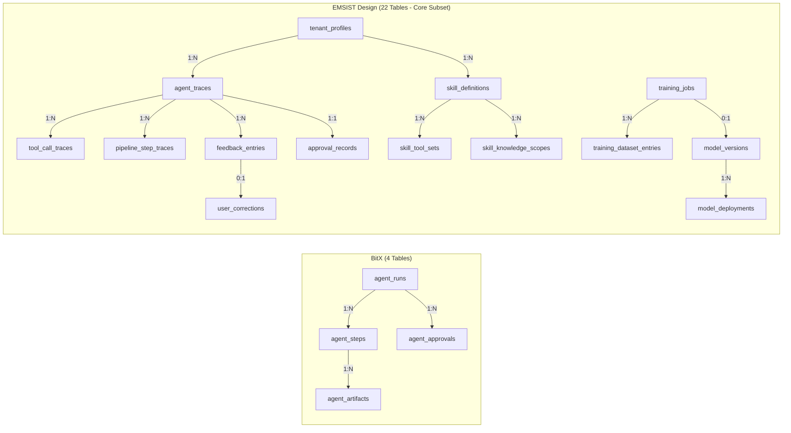
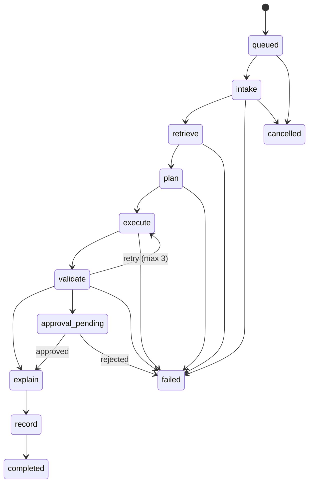

# Data Architecture Validation

## BitX AI Engine vs EMSIST AI Agent Platform Design

**Date:** 2026-03-06
**Agent:** SA (Solution Architect)
**Principles Version:** SA-PRINCIPLES.md v1.1.0
**Scope:** Two-way comparison -- BitX Reference PDFs vs EMSIST Design Documents only (no source code referenced)

### Sources Compared

**BitX Reference PDFs:**
- `01-AI-ENGINE-ARCHITECTURE.pdf` -- Core architecture, database schema (4 SQLite tables), API surface, 6-stage pipeline
- `02-LEARNING-METHODOLOGY.pdf` -- RAG store architecture, BM25 search, knowledge lifecycle, tenant-scoped learning
- `04-DASHBOARDS-LEARNING-MODEL.pdf` -- Dashboard data models, analytics queries, aggregation strategy

**EMSIST Design Documents:**
- `01-PRD-AI-Agent-Platform.md` -- Product vision, 7-step pipeline, 13 learning methods, agent system
- `02-Technical-Specification.md` -- Technology stack, code templates, Spring AI integration, training pipelines
- `05-Technical-LLD.md` -- 22 PostgreSQL tables, Flyway migrations, ERD, PGVector schema
- `10-Full-Stack-Integration-Spec.md` -- DTO contracts (TypeScript + Java records), SSE streaming, API gateway routes

---

## Executive Summary

BitX and EMSIST represent fundamentally different philosophies applied to the same problem domain (multi-agent AI platforms with continuous learning). BitX is a **lightweight, locally-hosted monolith** using SQLite with BM25 sparse search, designed for immediate local deployment with zero external dependencies. EMSIST is an **enterprise-grade distributed microservice platform** using PostgreSQL with pgvector dense embeddings, designed for multi-tenant cloud deployment with multiple LLM providers.

The two systems share strong conceptual alignment in their core data entities (agent runs, steps, artifacts, approvals) and pipeline architecture (6 vs 7 stages), but diverge significantly in data storage technology, vector search approach, learning pipeline complexity, and data model granularity. EMSIST's design extends well beyond BitX's scope with 22 tables (vs 4), formal training pipeline data structures, model versioning, and rich multi-tenant isolation -- reflecting its enterprise ambitions.

**Key finding:** The EMSIST Design faithfully absorbs and extends BitX's core data architecture. Every BitX data concept has a counterpart in EMSIST's design, while EMSIST adds substantial enterprise-grade data structures for training, model management, validation, and multi-tenancy that do not exist in BitX.

---

## 1. Data Model Comparison

### 1.1 Entity/Table Inventory

| Entity/Concept | BitX (PDF 01, Section 7) | EMSIST Design (LLD, Section 3) | Alignment |
|---|---|---|---|
| Agent runs | `agent_runs` (1 table) | `agent_traces` | **ALIGNED** |
| Pipeline steps | `agent_steps` (1 table) | `pipeline_step_traces` + `tool_call_traces` (2 tables) | **SIMILAR** |
| Artifacts | `agent_artifacts` (1 table) | No dedicated artifact table; artifacts embedded in trace JSONB | **DIVERGENT** |
| Approvals | `agent_approvals` (1 table) | `approval_records` | **ALIGNED** |
| RAG documents | `rag_documents` (implied) | `vector_store` (PGVector table) | **SIMILAR** |
| RAG search logs | `rag_search_log` (1 table) | No dedicated search log table in LLD | **BITX-ONLY** |
| Tenant profiles | Column-level tenant_id | `tenant_profiles` (dedicated table) | **SIMILAR** |
| Skills/Profiles | Profile JSON files on disk | `skill_definitions` + `skill_tool_sets` + `skill_knowledge_scopes` (3 tables) | **SIMILAR** |
| Tool registrations | Static code registry (12 tools) | `tool_registrations` (dynamic registry table) | **SIMILAR** |
| Validation rules | 7 hard-coded validators | `validation_rules` + `validation_results` (2 tables) | **SIMILAR** |
| Feedback | Not persisted as structured data | `feedback_entries` + `user_corrections` (2 tables) | **EMSIST-ONLY** |
| Business patterns | Not present | `business_patterns` (1 table) | **EMSIST-ONLY** |
| Learning materials | Filesystem-based ingestion | `learning_materials` (1 table) | **EMSIST-ONLY** |
| Training jobs | Not present | `training_jobs` + `training_dataset_entries` (2 tables) | **EMSIST-ONLY** |
| Model versions | Not present | `model_versions` + `model_deployments` (2 tables) | **EMSIST-ONLY** |

**Summary:** BitX uses 4 core tables + 2 supplementary stores. EMSIST designs 22 tables organized across 6 domains (orchestration, skills, tracing, feedback, training, model management).

### 1.2 Schema Design Philosophy

| Aspect | BitX | EMSIST Design | Assessment |
|---|---|---|---|
| **Database engine** | SQLite (single file, Drizzle ORM) | PostgreSQL 16 + PGVector extension (Flyway, JPA/Hibernate) | **DIVERGENT** |
| **ID strategy** | Auto-increment integer PKs | UUID v4 PKs (uuid_generate_v4()) | **DIVERGENT** |
| **Versioning** | No optimistic locking | `version BIGINT NOT NULL DEFAULT 0` on all mutable entities | **EMSIST-ONLY** |
| **Audit fields** | `created_at` only on most tables | `created_at`, `updated_at`, `created_by`, `updated_by` on all entities | **SIMILAR** (EMSIST more comprehensive) |
| **Soft delete** | No soft delete | Not specified in LLD (CLAUDE.md recommends `deletedAt` where applicable) | **ALIGNED** (neither uses it) |
| **JSON storage** | JSON columns for tool_input, tool_output, metadata | JSONB columns for allowed_tools, allowed_skills, benchmark_results, config | **ALIGNED** |
| **Tenant isolation** | `tenant_id` column on `agent_runs` | `tenant_id` FK on 8+ tables, dedicated `tenant_profiles` table, vector store partitioning | **SIMILAR** (EMSIST far more comprehensive) |
| **Index strategy** | Not documented in PDFs | BTREE, HNSW, GIN indexes explicitly defined in migrations | **EMSIST-ONLY** |
| **Foreign keys** | FK columns present (run_id, step_id) but no formal constraints in SQLite | Full FK constraints with REFERENCES clauses in PostgreSQL DDL | **SIMILAR** |
| **Normalization** | Denormalized (tool_input/output as JSON in steps) | Mix of normalized (skill_tool_sets junction table) and denormalized (JSONB columns) | **SIMILAR** |

### 1.3 Entity Relationships



**Key relationship differences:**

1. **BitX** keeps artifacts as a child of steps (step_id FK), maintaining a run -> step -> artifact hierarchy. **EMSIST** does not define a separate artifact table; artifacts appear to be embedded within trace data or represented as file paths in the response.

2. **BitX** has a flat approval model (approval linked to run + step). **EMSIST** links approvals directly to agent_traces with richer metadata (action_type, action_description, requested_by, approved_by, approval_notes).

3. **EMSIST** introduces a skill inheritance chain (skill_definitions.parent_skill_id self-referencing FK) that has no BitX equivalent, since BitX loads profiles from static JSON files.

4. **EMSIST** adds a full training pipeline data chain (feedback -> corrections -> training_dataset_entries -> training_jobs -> model_versions -> model_deployments) that is entirely absent from BitX.

### 1.4 Key Data Model Differences

| # | Difference | BitX | EMSIST Design | Impact |
|---|---|---|---|---|
| 1 | **Run granularity** | `agent_runs` stores router_model, worker_model, initial_prompt, final_output as flat columns | `agent_traces` stores model_used (single), task_type, complexity_level, confidence_score, pipeline_run_id with richer metadata | EMSIST captures more execution context per run |
| 2 | **Step tracking** | `agent_steps` combines LLM calls, tool calls, and validation in one table using `stage` + `role` columns | EMSIST splits into `pipeline_step_traces` (7-step pipeline stages) and `tool_call_traces` (individual tool invocations) | EMSIST provides finer-grained observability |
| 3 | **Artifact persistence** | Dedicated `agent_artifacts` table with type, content, file_path, metadata columns | No dedicated table; artifacts referenced in response content or trace data | BitX has better artifact traceability |
| 4 | **Token tracking** | `tokens_used` per step, `total_tokens` per run | `token_count_input` + `token_count_output` per trace (separate in/out) | EMSIST provides input/output token breakdown |
| 5 | **Status model** | 10 run statuses (queued, intake, inventory, context_gathering, planning, tool_loop, validation, finalizing, completed, failed, cancelled) | Not explicitly enumerated in LLD; `status` column on agent_traces is VARCHAR | BitX has more explicit state machine |
| 6 | **Error handling** | `error_message` on agent_runs + `status` on agent_steps | `error_message` on agent_traces + `status` on pipeline_step_traces | **ALIGNED** conceptually |

---

## 2. Data Storage Architecture

### 2.1 Database Technologies

| Dimension | BitX | EMSIST Design | Alignment |
|---|---|---|---|
| **Primary database** | SQLite (single file, Drizzle ORM) | PostgreSQL 16 (per-service databases, JPA/Hibernate, Flyway) | **DIVERGENT** |
| **Vector storage** | SQLite + BM25 sparse vectors (JSON term frequency maps) | PGVector extension (dense embeddings, HNSW indexing) | **DIVERGENT** |
| **Caching** | None documented | Redis 7 (session memory, conversation context) | **EMSIST-ONLY** |
| **Message broker** | None (in-process queue) | Apache Kafka 3.7 (inter-agent messaging, trace collection, feedback signals) | **EMSIST-ONLY** |
| **Object storage** | Local filesystem (working directory) | MinIO/S3 (training artifacts, model files) | **EMSIST-ONLY** |
| **Config storage** | Environment variables + local JSON profiles | Spring Cloud Config Server (Git backend) + per-service application.yml | **DIVERGENT** |

**Pros/Cons:**

| Factor | BitX (SQLite) | EMSIST (PostgreSQL+pgvector) |
|---|---|---|
| **Deployment simplicity** | Single file, zero infrastructure | Requires PostgreSQL server, PGVector extension, Flyway migrations |
| **Concurrency** | Limited (WAL mode, single writer) | Full MVCC, multiple concurrent writers |
| **Scalability** | Single-machine only | Horizontal read replicas, connection pooling |
| **Backup/Recovery** | File copy | pg_dump, WAL archiving, PITR |
| **Vector search quality** | BM25 keyword matching (no semantic understanding) | Dense embedding similarity (semantic search with cosine distance) |
| **Multi-tenancy** | Column-level tenant_id filter | Column-level + dedicated tenant_profiles table + vector store partitioning |
| **Operational cost** | Zero | PostgreSQL hosting + PGVector maintenance |

### 2.2 Vector Storage and Search

This is the most significant architectural divergence between the two systems.

| Aspect | BitX (PDF 02) | EMSIST Design (LLD Section 3.2, PRD Section 4) | Alignment |
|---|---|---|---|
| **Algorithm** | BM25 (Best Matching 25) probabilistic ranking | Dense vector similarity (cosine distance via HNSW) | **DIVERGENT** |
| **Vector type** | Sparse TF-IDF vectors stored as JSON maps | Dense embeddings (1536 dimensions, float array) | **DIVERGENT** |
| **Embedding model** | None (term frequency computation at index time) | External embedding model (dimension 1536 suggests OpenAI ada-002 or similar) | **DIVERGENT** |
| **Index type** | SQLite LIKE queries pre-filter + in-memory BM25 scoring | HNSW index (`vector_cosine_ops`, m=16, ef_construction=200) | **DIVERGENT** |
| **Chunking** | 2,000 chars with 200-char overlap, paragraph-first break priority | Not specified in LLD; PRD mentions chunking for RAG but no parameters | **BITX-ONLY** (more detailed) |
| **Deduplication** | SHA-256 content hashing per chunk | Not specified in LLD | **BITX-ONLY** |
| **Scoring parameters** | k1=1.5, b=0.75 (BM25 tuning) | No scoring parameters (cosine similarity is parameter-free) | N/A (different algorithms) |
| **Minimum relevance** | score >= 0.05 threshold | Not specified in LLD | **BITX-ONLY** |
| **Result limit** | Top 5 results default | Not specified in LLD; PRD mentions configurable topK | **BITX-ONLY** (more specific) |
| **Tenant isolation** | tenant_id filter on search queries; null tenant_id = global | tenant_id column on vector_store + MetadataFilter in code | **ALIGNED** |
| **Metadata** | Source type (doc, story, process, schema, test_history, skill, profile) | JSONB metadata column with GIN index | **SIMILAR** |
| **Incremental updates** | Idempotent re-ingestion (hash-based skip, update, remove) | Not detailed in LLD | **BITX-ONLY** |

**Assessment:** BitX's BM25 approach is simpler and requires no external embedding model or GPU, making it suitable for fully local deployment. EMSIST's dense embedding approach provides semantic similarity (understanding meaning, not just keywords) but requires an embedding model and more compute. For an enterprise platform with cloud model access, EMSIST's choice is appropriate. However, the EMSIST LLD lacks the chunking, deduplication, and scoring detail that BitX specifies clearly.

### 2.3 Caching Strategy

| Aspect | BitX | EMSIST Design | Alignment |
|---|---|---|---|
| **Runtime cache** | No caching layer documented | Redis 7 for session memory, conversation context | **EMSIST-ONLY** |
| **Dashboard caching** | In-dashboard time-based caching (60s run analytics, 5min token analytics, 10min RAG stats) | Not specified in LLD; Integration Spec mentions no caching strategy | **BITX-ONLY** |
| **RAG result cache** | Not documented | Not documented | **ALIGNED** (neither) |
| **Model health cache** | Health status cached, checked every 60 seconds | Not specified in design docs | **BITX-ONLY** |

**Assessment:** BitX specifies dashboard-level caching with clear TTL values and invalidation rules (PDF 04, Section 7.4). EMSIST's design does not address caching at the data architecture level despite specifying Redis in the tech stack. This is a gap in the EMSIST design documents.

### 2.4 File/Artifact Storage

| Aspect | BitX | EMSIST Design | Alignment |
|---|---|---|---|
| **Agent artifacts** | SQLite `agent_artifacts` table (content stored as TEXT) | No dedicated artifact table | **DIVERGENT** |
| **Code patches/diffs** | Stored as artifact types (patch, diff, file_created, file_modified) | Not specified as persistent artifacts | **BITX-ONLY** |
| **Model files** | Not persisted (LM Studio manages models externally) | MinIO/S3 for training artifacts and model files | **EMSIST-ONLY** |
| **Profile storage** | JSON files on local filesystem (`agents-local/profiles/`) | `skill_definitions` table in PostgreSQL | **DIVERGENT** |
| **RAG source files** | Local filesystem directories (agents-local/docs/, server/src/db/) | Not specified (ingestion pipeline abstracts source) | **DIVERGENT** |
| **Training data** | Not applicable (no fine-tuning) | `training_dataset_entries` table + MinIO for large files | **EMSIST-ONLY** |

---

## 3. Data Flow Patterns

### 3.1 Pipeline Data Flow

```mermaid
graph TD
    subgraph "BitX 6-Stage Pipeline (PDF 01, Section 2)"
        B1[1. Intake<br/>Router model] --> B2[2. Context Gathering<br/>Router/Worker + BM25 RAG]
        B2 --> B3[3. Planning<br/>Router model]
        B3 --> B4[4. Tool Loop<br/>Worker model, max 15 iterations]
        B4 --> B5[5. Validation<br/>7 validators]
        B5 --> B6[6. Finalize<br/>Router model]
    end

    subgraph "EMSIST 7-Stage Pipeline (PRD Section 3.1)"
        E1[1. Intake<br/>Classify + normalize] --> E2[2. Retrieve<br/>Orchestrator + PGVector RAG]
        E2 --> E3[3. Plan<br/>Orchestrator model]
        E3 --> E4[4. Execute<br/>Worker model, ReAct loop]
        E4 --> E5[5. Validate<br/>Rules engine + tests + approval]
        E5 --> E6[6. Explain<br/>Orchestrator model]
        E6 --> E7[7. Record<br/>Full trace logging]
    end
```



| Pipeline Aspect | BitX | EMSIST Design | Alignment |
|---|---|---|---|
| **Stage count** | 6 stages | 7 stages (Explain + Record added) | **SIMILAR** |
| **Data persisted per stage** | `agent_steps` row with stage, model, tool_name, tool_input/output, tokens_used, duration_ms, status | `pipeline_step_traces` row with step_name, duration_ms, input_summary, output_summary, status | **ALIGNED** |
| **State machine** | Explicit 10-state model (queued -> intake -> context_gathering -> planning -> tool_loop -> validation -> finalizing -> completed/failed/cancelled; approval branch) | Not explicitly defined in LLD | **BITX-ONLY** (more explicit) |
| **Retry on validation failure** | Not documented (orchestrator does not retry internally) | Retry with corrective feedback (default 2 retries, max 3 per skill risk profile) | **EMSIST-ONLY** |
| **Explanation step** | Included in Finalize (summary generation) | Dedicated Explain step (dual audience: business + technical) | **DIVERGENT** (EMSIST more structured) |
| **Trace recording** | Inline (each step writes to SQLite as it completes) | Dedicated Record step + async Kafka publishing to trace-collector service | **DIVERGENT** |

### 3.2 Event/Message Patterns

| Pattern | BitX | EMSIST Design | Alignment |
|---|---|---|---|
| **Inter-service messaging** | None (monolithic, in-process) | Apache Kafka topics: `agent-traces`, `feedback-signals`, `training-data-priority`, `customer-feedback`, `knowledge-updates` | **DIVERGENT** |
| **Real-time updates** | WebSocket callbacks (progress events at each stage transition) | SSE (Server-Sent Events) via `Flux<StreamChunkDTO>` with type-tagged chunks | **SIMILAR** |
| **Event payload** | `{runId, stage, message, data: {tool, args}}` | `StreamChunk {messageId, delta, type, done, toolCall, validation, explanation, tokenCount, error}` | **SIMILAR** (EMSIST richer payload) |
| **Progress granularity** | Per-stage transition events | Per-token streaming + stage events + tool execution events + validation events | **EMSIST richer** |

**Assessment:** BitX uses WebSocket for bidirectional communication (appropriate for its local-first React UI). EMSIST uses SSE which is inherently unidirectional server-to-client, appropriate for streaming LLM responses. Both are reasonable choices for their respective architectures.

### 3.3 Audit Trail

| Aspect | BitX | EMSIST Design | Alignment |
|---|---|---|---|
| **Trace storage** | `agent_runs` + `agent_steps` + `agent_artifacts` in SQLite | `agent_traces` + `pipeline_step_traces` + `tool_call_traces` in PostgreSQL + Kafka async | **ALIGNED** |
| **Trace granularity** | Per-step: model, role, tool_name, tool_input (JSON), tool_output (JSON), tokens_used, duration_ms, status | Per-step: step_name, duration_ms, input_summary, output_summary, status; per-tool-call: tool_name, arguments, result, latency_ms, success, sequence_order | **SIMILAR** (EMSIST separates tool calls into own table) |
| **Approval audit** | `agent_approvals`: run_id, step_id, required_by, reason, status, reviewer_id, reviewer_note | `approval_records`: agent_trace_id, tenant_id, action_type, action_description, status, requested_by, approved_by, approval_notes, requested_at, resolved_at | **SIMILAR** (EMSIST adds timestamps and tenant scoping) |
| **Search log audit** | Dedicated `rag_search_log` table: query, run_id, result_count, duration_ms, tenant_id | Not specified in EMSIST LLD | **BITX-ONLY** |
| **Dashboard queries** | SQL queries defined in PDF 04, Section 7.1 (runs per profile, token usage by stage, RAG search effectiveness, tool usage by profile) | Not specified in design docs (dashboards not yet designed) | **BITX-ONLY** |

### 3.4 Learning Data Capture

| Aspect | BitX | EMSIST Design | Alignment |
|---|---|---|---|
| **Learning approach** | Retrieval-first: re-ingest documents, BM25 search at runtime, no fine-tuning | Multi-method: RAG + SFT + DPO + RLHF + 9 additional methods (13 total) | **DIVERGENT** |
| **Feedback storage** | No structured feedback tables; learning via document re-ingestion | `feedback_entries` (ratings), `user_corrections` (explicit corrections), `business_patterns` (expert-defined patterns), `learning_materials` (documents) | **EMSIST-ONLY** |
| **Training data** | Not applicable | `training_dataset_entries`: source_type, input_text, output_text, rejected_text (for DPO pairs), weight, complexity_score, agent_type | **EMSIST-ONLY** |
| **Model versioning** | Not applicable (uses external LM Studio models) | `model_versions` + `model_deployments` with quality_score, benchmark_results, deployment_type, traffic_percentage | **EMSIST-ONLY** |
| **Quality tracking** | Eval Harness with 11 test cases, 5 categories, 8 scoring types; results stored as JSON files | `training_jobs` with quality_score_before, quality_score_after; model_versions with benchmark_results JSONB | **SIMILAR** (both track quality, different mechanisms) |
| **Telemetry** | `agent_steps.tokens_used`, `agent_steps.duration_ms`, `agent_steps.tool_name` drive dashboard analytics | `agent_traces.latency_ms`, `agent_traces.token_count_input/output`, OpenTelemetry integration planned | **SIMILAR** |

---

## 4. API Data Contracts

### 4.1 DTO Design

| DTO Concept | BitX (PDF 01, Section 10) | EMSIST Design (Integration Spec, Section 2) | Alignment |
|---|---|---|---|
| **Run creation** | `POST /local-agent/runs` (body not detailed in PDF) | `ChatRequest {agentId, message, conversationId, tenantId, attachments}` (TypeScript + Java record) | **SIMILAR** |
| **Run response** | `GET /local-agent/runs/:id` returns run details + steps + artifacts + approvals | `ChatResponse {messageId, content, type, agentId, traceId, timestamp, explanation, toolCalls, tokenCount}` | **SIMILAR** |
| **Streaming** | WebSocket callbacks `{runId, stage, message, data}` | `StreamChunk {messageId, delta, type, done, toolCall, validation, explanation, tokenCount, error}` | **SIMILAR** (EMSIST richer) |
| **Health** | `GET /local-agent/health` returns system health, model status, queue stats | Not defined as explicit DTO in design docs | **BITX-ONLY** |
| **Tool execution events** | Not exposed as real-time DTOs; logged in agent_steps | `ToolExecutionEvent {toolName, status, input, output, durationMs, error}` streamed in real-time | **EMSIST-ONLY** (richer real-time) |
| **Explanation** | Not a separate DTO; part of run summary | `ExplanationResponse {businessSummary, technicalDetails, artifacts[]}` | **EMSIST-ONLY** |
| **Validation** | Not exposed as DTO; internal validation report | `ValidationResult {passed, issues[{rule, severity, message, autoFixed}]}` | **EMSIST-ONLY** |
| **Agent profiles** | `GET /local-agent/profiles` returns summary list; `/profiles/:id` returns full details | `AgentProfile {id, name, description, avatarUrl, category, status, model, provider, skills, metrics, isPublic, isSystem}` | **SIMILAR** |
| **Skill management** | Not applicable (profiles are static JSON) | `SkillDefinition`, `SkillCreateRequest`, `SkillTestCase` DTOs for CRUD management | **EMSIST-ONLY** |
| **Feedback** | Not applicable | `UserRating`, `UserCorrection`, `BusinessPattern` DTOs | **EMSIST-ONLY** |
| **Analytics** | Proposed endpoints: `/analytics/runs`, `/analytics/tokens`, `/analytics/latency`, `/analytics/rag`, `/analytics/tools`, `/analytics/eval` (PDF 04, Section 7.2) | Not defined in design docs (dashboards not yet specified) | **BITX-ONLY** |

**Key observation:** BitX defines 20+ REST endpoints in a flat API surface (`/local-agent/*`). EMSIST designs versioned endpoints (`/api/v1/*`) with richer DTOs including dual TypeScript/Java definitions, but does not yet define analytics or dashboard endpoints.

### 4.2 Streaming Patterns

| Aspect | BitX | EMSIST Design | Alignment |
|---|---|---|---|
| **Transport** | WebSocket (bidirectional) | SSE via `Flux<StreamChunkDTO>` (unidirectional) | **DIVERGENT** |
| **Reconnection** | Not documented | Built-in `EventSource` reconnection + custom `SseReconnectService` with exponential backoff | **EMSIST-ONLY** |
| **Event types** | Stage transition events only | Typed chunks: start, content, tool_call, validation, explanation, done, error | **EMSIST richer** |
| **Backpressure** | Not addressed | Reactor Flux built-in backpressure | **EMSIST-ONLY** |
| **Timeout** | 60s (router), 120s (worker) per LLM call | 120s overall pipeline timeout with `Flux.timeout()` operator | **SIMILAR** |
| **Error propagation** | Progress callback emits failure events | `StreamChunk.error(message)` terminal event | **ALIGNED** |

---

## 5. Deviation Summary

| # | Category | BitX Approach | EMSIST Approach | Alignment | Severity | Recommendation |
|---|---|---|---|---|---|---|
| 1 | **Database engine** | SQLite single-file, zero-config | PostgreSQL 16 + PGVector, Flyway migrations | **DIVERGENT** | LOW | Appropriate for respective scopes. No change needed. |
| 2 | **Vector search** | BM25 sparse (keyword-based, no embedding model) | PGVector dense (semantic, requires embedding model) | **DIVERGENT** | MEDIUM | EMSIST should consider hybrid search (BM25 + dense) for best-of-both. EMSIST LLD should specify chunking parameters. |
| 3 | **Artifact persistence** | Dedicated `agent_artifacts` table with 10 artifact types | No dedicated artifact table | **DIVERGENT** | HIGH | EMSIST should add an `agent_artifacts` table or specify how artifacts are persisted. Current design loses artifact traceability. |
| 4 | **RAG search logging** | Dedicated `rag_search_log` table for analytics | Not specified | **BITX-ONLY** | MEDIUM | EMSIST should add a RAG search log table for search effectiveness monitoring and knowledge gap analysis. |
| 5 | **Run state machine** | Explicit 10-state model documented | Not explicitly defined | **BITX-ONLY** | MEDIUM | EMSIST should formalize the 7-step pipeline state machine in the LLD with valid transitions and failure paths. |
| 6 | **Chunking strategy** | 2000 chars, 200 overlap, paragraph-first priority, SHA-256 dedup | Not specified in LLD | **BITX-ONLY** | HIGH | EMSIST LLD must specify chunking parameters for RAG ingestion pipeline. Current design leaves critical RAG behavior undefined. |
| 7 | **Dashboard data model** | 5 dashboards, 6 analytics endpoints, SQL queries defined | Not addressed in design docs | **BITX-ONLY** | LOW | Analytics/dashboards can be designed later. Not blocking for core implementation. |
| 8 | **Learning pipeline** | Retrieval-only (no fine-tuning) | 13 learning methods with training infrastructure | **EMSIST-ONLY** | LOW | EMSIST's ambition is appropriate for enterprise scope. Phase wisely (Tier 1 first). |
| 9 | **Caching** | Dashboard-level TTL caching | Redis in tech stack but no caching design | **DIVERGENT** | MEDIUM | EMSIST should specify what data is cached in Redis, TTL policies, and invalidation strategies. |
| 10 | **ID strategy** | Integer auto-increment | UUID v4 | **DIVERGENT** | LOW | UUID is standard for distributed systems and multi-tenant platforms. No change needed. |
| 11 | **Streaming transport** | WebSocket (bidirectional) | SSE (unidirectional) | **DIVERGENT** | LOW | SSE is appropriate for LLM streaming (server-to-client). If bidirectional needed later, can add WebSocket. |
| 12 | **Feedback data model** | No structured feedback persistence | 4 feedback-related tables | **EMSIST-ONLY** | LOW | Essential for learning pipeline. Good extension beyond BitX scope. |

---

## 6. Strengths and Weaknesses

### 6.1 BitX Strengths

1. **Explicit state machine** -- The 10-state run lifecycle with clear transitions (queued -> intake -> ... -> completed/failed/cancelled, with approval branch) is well-documented and leaves no ambiguity about valid state transitions.

2. **Artifact traceability** -- Dedicated `agent_artifacts` table with 10 typed artifact categories (patch, diff, file_created, file_modified, test_result, report, plan, brief, acceptance_criteria, summary) provides a complete audit trail of what each agent produced.

3. **RAG search analytics** -- The `rag_search_log` table enables knowledge gap analysis (zero-result queries identify missing documentation), search effectiveness monitoring, and performance optimization. This is a practical and valuable data structure.

4. **Chunking specification** -- Detailed chunking parameters (2000 chars, 200 overlap, paragraph-first priority, SHA-256 deduplication) leave no ambiguity for implementers.

5. **Dashboard data architecture** -- Complete SQL queries for analytics, caching strategy with TTL values, 6 proposed analytics API endpoints, and aggregation strategy by time window.

6. **Operational simplicity** -- 4-table schema is easy to understand, query, and maintain. All data in one SQLite file simplifies backup, migration, and disaster recovery.

### 6.2 EMSIST Design Strengths

1. **Enterprise-grade data model** -- 22 tables with proper UUID PKs, optimistic locking (@Version), comprehensive audit fields (createdAt, updatedAt, createdBy, updatedBy), and foreign key constraints suitable for multi-tenant production deployment.

2. **Comprehensive learning pipeline data structures** -- `feedback_entries`, `user_corrections`, `business_patterns`, `learning_materials`, `training_dataset_entries`, `training_jobs`, `model_versions`, `model_deployments` provide end-to-end learning data management that BitX entirely lacks.

3. **Rich DTO contracts** -- Dual TypeScript/Java definitions with validation annotations (`@NotNull`, `@NotBlank`), typed stream chunks with 7 event types, and separate DTOs for tools, explanations, and validation results.

4. **Multi-tenant data isolation** -- Dedicated `tenant_profiles` table with configurable concurrency limits, tool/skill whitelists, vector store namespace isolation, and tenant-scoped foreign keys throughout the schema.

5. **Semantic vector search** -- Dense embeddings with HNSW indexing provide superior semantic search quality compared to BM25 keyword matching, enabling the system to find conceptually related content even when exact keywords differ.

6. **Skill management data model** -- Normalized `skill_definitions` with junction tables for tool sets and knowledge scopes, skill inheritance via parent_skill_id, versioning, and tenant scoping. This is a significant improvement over BitX's static JSON profile files.

7. **Validation data model** -- Persistent `validation_rules` and `validation_results` tables enable audit of which rules were applied and what they found, versus BitX's 7 hard-coded validators with no persistent rule configuration.

### 6.3 BitX Weaknesses

1. **No feedback loop** -- BitX has no data structures for capturing user feedback, corrections, or learning from interactions. The only "learning" mechanism is re-ingesting documents into the RAG store.

2. **SQLite concurrency limits** -- Single-writer constraint makes BitX unsuitable for multi-user or multi-tenant deployment without significant architectural changes.

3. **No model management** -- BitX relies entirely on LM Studio for model management. There are no data structures for tracking model versions, deployments, quality scores, or training history.

4. **Static profiles** -- Agent profiles stored as JSON files cannot be managed at runtime, do not support versioning or inheritance, and cannot be tenant-scoped.

5. **No formal DTO contracts** -- API payloads are not documented as structured contracts with validation rules. The PDF describes endpoints but not detailed request/response schemas.

6. **No encryption/security data** -- No data classification, encryption configuration, or security metadata in the schema.

### 6.4 EMSIST Design Weaknesses

1. **Missing artifact table** -- The LLD does not define an equivalent to BitX's `agent_artifacts` table. This means there is no clear data structure for persisting the code patches, test results, reports, and other deliverables that agents produce.

2. **Missing RAG operational data** -- No equivalent to BitX's `rag_search_log` table. Without this, the EMSIST platform cannot analyze search effectiveness, identify knowledge gaps, or optimize RAG performance.

3. **Undefined chunking strategy** -- The LLD does not specify document chunking parameters for the RAG ingestion pipeline. Without chunk size, overlap, break priority, and deduplication strategy, different implementers will make different choices, leading to inconsistent RAG quality.

4. **No explicit state machine** -- The 7-step pipeline stages are described but not formalized as a state machine with valid transitions, failure paths, and terminal states.

5. **Caching gap** -- Redis is listed in the tech stack (Section 1.4 of Tech Spec) but no caching strategy appears in the LLD. What gets cached, for how long, and how is it invalidated?

6. **Dashboard/analytics gap** -- No analytics data model, aggregation strategy, or API endpoint design exists in the EMSIST design documents. BitX provides a complete dashboard specification that EMSIST lacks.

7. **Vector store coupling** -- The LLD specifies `embedding vector(1536)` which hard-codes the embedding dimension. If the team changes embedding models, the schema must change. BitX's JSON sparse vectors are model-agnostic.

---

## 7. Recommendations

### 7.1 High Priority (Address Before Implementation)

**R1: Add an artifact persistence table.** Create an `agent_artifacts` table modeled after BitX's design but extended with EMSIST conventions:

```sql
CREATE TABLE IF NOT EXISTS agent_artifacts (
    id              UUID DEFAULT uuid_generate_v4() PRIMARY KEY,
    agent_trace_id  UUID NOT NULL REFERENCES agent_traces(id),
    step_trace_id   UUID REFERENCES pipeline_step_traces(id),
    type            VARCHAR(50) NOT NULL,  -- patch, diff, file_created, file_modified, test_result, report, plan, summary, code, query
    name            VARCHAR(500) NOT NULL,
    content         TEXT,
    file_path       VARCHAR(1000),
    metadata        JSONB DEFAULT '{}',
    tenant_id       UUID NOT NULL,
    created_at      TIMESTAMP WITH TIME ZONE NOT NULL DEFAULT NOW()
);
```

**R2: Specify RAG chunking strategy.** Add a dedicated section to the LLD defining:
- Chunk size (recommend 1500-2000 chars per BitX's working parameters)
- Chunk overlap (recommend 200-300 chars)
- Break priority (paragraph > line > sentence > hard cut)
- Deduplication (SHA-256 content hashing, as BitX implements)
- Metadata schema for chunks (source_type, source_path, tenant_id, chunk_index)

**R3: Add RAG search logging.** Create a `rag_search_log` table:

```sql
CREATE TABLE IF NOT EXISTS rag_search_log (
    id              UUID DEFAULT uuid_generate_v4() PRIMARY KEY,
    query           TEXT NOT NULL,
    agent_trace_id  UUID REFERENCES agent_traces(id),
    result_count    INT NOT NULL DEFAULT 0,
    top_score       FLOAT,
    duration_ms     BIGINT NOT NULL,
    tenant_id       UUID NOT NULL,
    created_at      TIMESTAMP WITH TIME ZONE NOT NULL DEFAULT NOW()
);
```

### 7.2 Medium Priority (Address During Implementation)

**R4: Formalize pipeline state machine.** Define valid run statuses and transitions in the LLD:



**R5: Design caching strategy.** Specify Redis usage:
- Conversation memory: TTL 24 hours, keyed by `tenant:{tenantId}:conv:{conversationId}`
- Skill resolution cache: TTL 5 minutes, invalidated on skill update
- Model health cache: TTL 60 seconds (per BitX pattern)
- RAG results: Consider caching top results for repeated queries, TTL 10 minutes

**R6: Consider hybrid search.** Evaluate combining BM25 keyword scoring with dense vector similarity for RAG retrieval. This provides keyword precision (exact term matching) alongside semantic recall (conceptual similarity). PostgreSQL can support both: BM25 via `tsvector` full-text search plus PGVector for dense similarity.

### 7.3 Low Priority (Address in Later Phases)

**R7: Design analytics data model.** When dashboards are needed, reference BitX's dashboard specification (PDF 04) as a starting template. Adapt the SQL queries for PostgreSQL and add tenant-scoped analytics views.

**R8: Make embedding dimension configurable.** Instead of hard-coding `vector(1536)`, consider a parameterized approach or using a dimension that matches the planned embedding model. Document which embedding model the dimension targets.

**R9: Add knowledge coverage tracking.** BitX's dashboard concept of a "Knowledge Coverage Map" (domain, docs, searches, gap score) is valuable for identifying where the RAG store has insufficient coverage. Consider persisting knowledge domain metadata.

---

## Appendix A: Complete Table Mapping

| # | BitX Table | EMSIST Design Table | Notes |
|---|---|---|---|
| 1 | `agent_runs` | `agent_traces` | Core run/trace entity |
| 2 | `agent_steps` | `pipeline_step_traces` + `tool_call_traces` | EMSIST splits into two tables |
| 3 | `agent_artifacts` | *Not defined* | **Gap -- see R1** |
| 4 | `agent_approvals` | `approval_records` | Enhanced with timestamps and tenant |
| 5 | `rag_documents` (implied) | `vector_store` | Different search technology |
| 6 | `rag_search_log` | *Not defined* | **Gap -- see R3** |
| 7 | -- | `tenant_profiles` | EMSIST-only: dedicated tenant config |
| 8 | -- | `skill_definitions` | EMSIST-only: persistent skill management |
| 9 | -- | `skill_tool_sets` | EMSIST-only: skill-tool junction |
| 10 | -- | `skill_knowledge_scopes` | EMSIST-only: skill-knowledge junction |
| 11 | -- | `tool_registrations` | EMSIST-only: dynamic tool registry |
| 12 | -- | `validation_rules` | EMSIST-only: configurable rules |
| 13 | -- | `validation_results` | EMSIST-only: rule evaluation results |
| 14 | -- | `feedback_entries` | EMSIST-only: user feedback |
| 15 | -- | `user_corrections` | EMSIST-only: explicit corrections |
| 16 | -- | `business_patterns` | EMSIST-only: expert patterns |
| 17 | -- | `learning_materials` | EMSIST-only: knowledge documents |
| 18 | -- | `training_jobs` | EMSIST-only: training orchestration |
| 19 | -- | `training_dataset_entries` | EMSIST-only: training data |
| 20 | -- | `model_versions` | EMSIST-only: model tracking |
| 21 | -- | `model_deployments` | EMSIST-only: deployment management |

## Appendix B: Data Flow Comparison Matrix

| Data Flow | BitX Path | EMSIST Design Path |
|---|---|---|
| User request intake | HTTP -> Fastify -> Scheduler -> Orchestrator | HTTP -> API Gateway -> ai-service -> RequestPipeline |
| RAG context retrieval | Orchestrator -> ragStore.getRelevantContext() -> SQLite BM25 | RequestPipeline -> RagService -> PGVector cosine search |
| Tool execution | Tool Gateway -> 12 tools -> filesystem/test runner | ToolExecutor -> ToolRegistry -> Spring beans + dynamic tools |
| Trace persistence | Orchestrator -> SQLite (inline per step) | TraceLogger -> Kafka "agent-traces" -> TraceCollectorService -> PostgreSQL |
| Feedback capture | Not supported | REST API -> FeedbackController -> PostgreSQL + Kafka |
| Training pipeline | Not supported | Kafka -> TrainingDataService -> SFT/DPO trainers -> Ollama |
| Real-time updates | WebSocket callbacks (stage transitions) | SSE Flux stream (token-level + stage + tool + validation events) |
