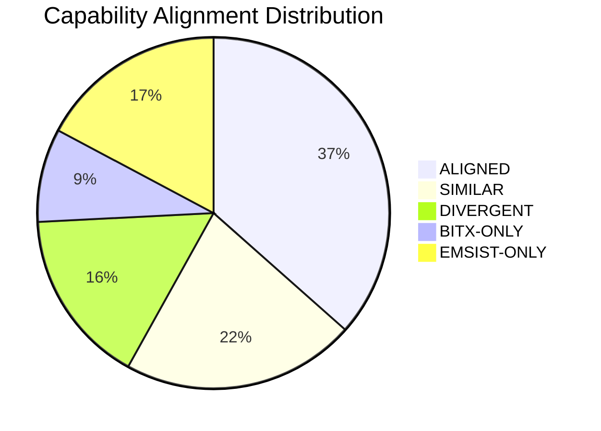
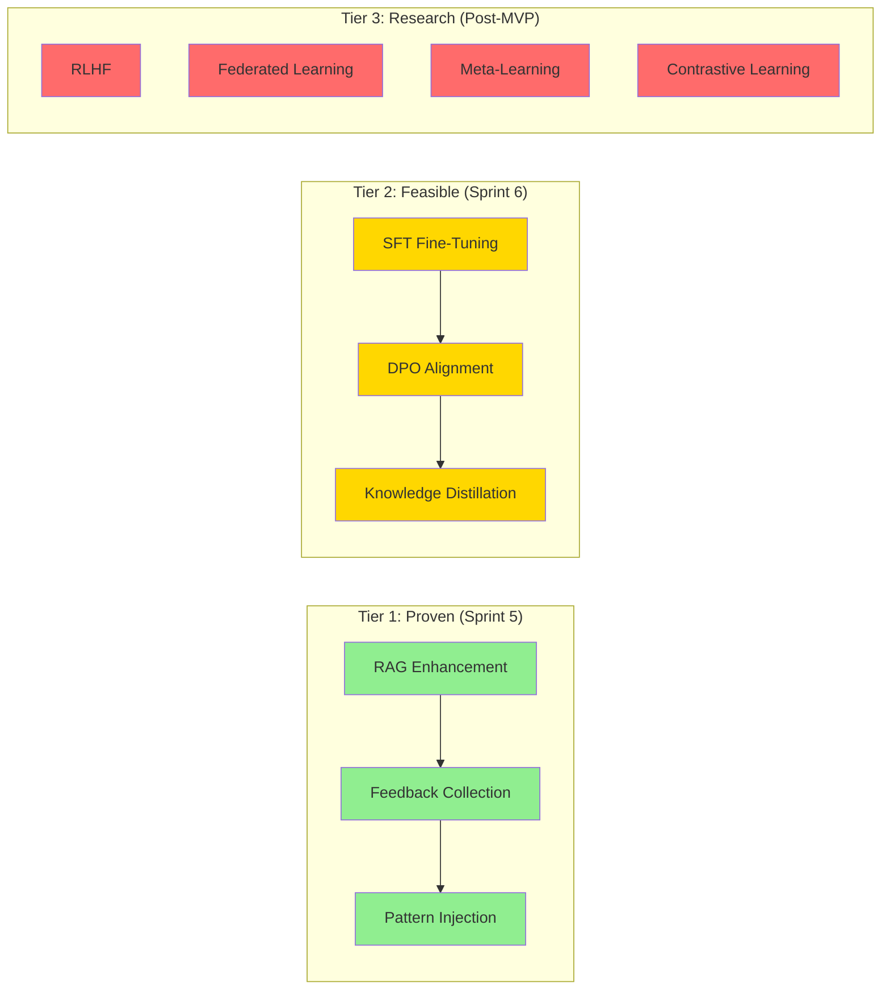

# Consolidated Validation Report
## BitX AI Engine vs EMSIST AI Agent Platform Design

**Date:** 2026-03-06
**Scope:** Two-way comparison — BitX Reference PDFs vs EMSIST Design Documents (no source code)
**Agents Used:** ARCH, SA, SEC, BA
    **Document Role:** Canonical executive report for the validation set (01-04 are deep dives; codex-validation is a supporting addendum)

---

## Executive Summary

This report consolidates findings from four specialized agent validations comparing the **BitX AI Engine** (6 reference PDFs) against the **EMSIST AI Agent Platform Design** (10 design documents). The comparison is document-to-document only — no source code was examined.

**Both platforms share common architectural DNA:**
- Dual-model local LLM architecture (lightweight orchestrator + powerful worker)
- Multi-stage pipeline orchestration (6 vs 7 steps)
- Tool-based agent execution with registries
- Deterministic validation layers (7 validators vs pluggable rule chain)
- Agent profile systems (26 vs 32 profiles)
- Multi-tenant data isolation via tenant_id

**They diverge in platform philosophy:**
- **BitX** = Local-first, single-tenant developer tool (Node.js monolith, SQLite, LM Studio)
- **EMSIST** = Enterprise-grade, multi-tenant SaaS platform (Spring Cloud microservices, PostgreSQL, Ollama + cloud fallback)

**Readiness interpretation:** The main residual gap is implementation maturity. Architecture intent is largely aligned, but several design areas are still documentation-level and need enforceable runtime controls, conformance tests, and operational evidence.

---

## Overall Alignment Scores

| Domain | ALIGNED | SIMILAR | DIVERGENT | BITX-ONLY | EMSIST-ONLY | Report |
|--------|---------|---------|-----------|-----------|-------------|--------|
| Application & Infrastructure | 5 (14%) | 12 (34%) | 9 (26%) | 4 (11%) | 5 (14%) | 01 |
| Data Architecture | 2 (13%) | 5 (33%) | 1 (7%) | 1 (7%) | 6 (40%) | 02 |
| Security Architecture | ~55% | ~20% | ~15% | ~5% | ~5% | 03 |
| Business Architecture | ~65% | ~15% | ~10% | ~5% | ~5% | 04 |

**Weighted Overall: ~50% ALIGNED/SIMILAR, ~15% DIVERGENT, ~8% BITX-ONLY, ~16% EMSIST-ONLY**

**Scoring normalization note:** This report is the single source for quantitative alignment metrics. Any qualitative labels in supporting notes (for example "High" or "Medium-High") are interpretation only and do not override these scores.

---

## Cross-Domain Findings

### 1. Architecture & Pipeline

| Aspect | BitX | EMSIST Design | Alignment |
|--------|------|---------------|-----------|
| Pipeline stages | 6 (Intake → Context → Plan → Tool Loop → Validate → Finalize) | 7 (Intake → Retrieve → Plan → Execute → Validate → Explain → Record) | **SIMILAR** |
| Dual-model architecture | Ministral 8B (router) + Qwen 32B (worker) | Orchestrator ~8B + Worker ~24B (model-agnostic via Ollama) | **ALIGNED** |
| Tool system | 12 concrete tools with Zod schemas | ToolRegistry + ToolExecutor (abstract, dynamic registration) | **SIMILAR** |
| Validation layer | 7 named validators (Error/Warning severity) | Pluggable ValidationRule chain (PathScope, DataAccess, Format, PIIRedaction) | **ALIGNED** |
| Run state machine | 10 explicit states with transition rules | Not formally defined in design docs | **BITX-ONLY** |
| Skills framework | Static JSON profile files | Versioned, inheritable, tenant-scoped SkillDefinitions in DB | **DIVERGENT** |
| Cloud model fallback | None (100% local) | Claude/Codex/Gemini as teachers and fallbacks | **EMSIST-ONLY** |
| Learning pipeline | RAG-only (no fine-tuning) | 13 methods (SFT, DPO, RLHF, knowledge distillation, etc.) | **DIVERGENT** |

**Key Deviation:** EMSIST extends BitX's 6-stage pipeline with dedicated Explain and Record steps, adds a comprehensive learning pipeline with 13 methods, and introduces cloud model integration. BitX defines a formal run state machine that EMSIST's design lacks.

### 2. Data Architecture

| Aspect | BitX | EMSIST Design | Alignment |
|--------|------|---------------|-----------|
| Database | SQLite (single file, Drizzle ORM) | PostgreSQL 16 + pgvector (JPA/Hibernate, Flyway) | **DIVERGENT** |
| Table count | 4 core + 2 supplementary | 22 tables across 6 domains | **DIVERGENT** |
| Vector search | BM25 sparse (keyword, no embedding model) | pgvector dense (semantic, HNSW, cosine distance) | **DIVERGENT** |
| Chunking strategy | 2000 chars, 200 overlap, SHA-256 dedup | Not specified | **BITX-ONLY** |
| Artifact persistence | Dedicated `agent_artifacts` table | No dedicated artifact table | **BITX-ONLY** |
| RAG search logging | Dedicated `rag_search_log` table | Not specified | **BITX-ONLY** |
| Feedback/learning data | Not persisted | 4 feedback tables + training pipeline tables | **EMSIST-ONLY** |
| Model versioning | Not applicable | `model_versions` + `model_deployments` tables | **EMSIST-ONLY** |
| Streaming transport | WebSocket (bidirectional) | SSE via Flux (unidirectional) | **DIVERGENT** |
| Caching | Dashboard-level TTL | Redis in tech stack but no caching design | **DIVERGENT** |

**Key Deviation:** EMSIST has a significantly richer data model (22 vs 4 tables) but is missing 3 practical structures BitX defines: artifact persistence, RAG search logging, and chunking parameters.

### 3. Security Architecture

| Aspect | BitX | EMSIST Design | Alignment |
|--------|------|---------------|-----------|
| Authentication | Optional JWT (HS256, self-managed) | Mandatory OAuth2/OIDC (RS256, Keycloak) | **DIVERGENT** |
| RBAC | 2 roles (admin, user) | 4 roles (USER, DOMAIN_EXPERT, ML_ENGINEER, ADMIN) | **SIMILAR** |
| Encryption in transit | None (HTTP on localhost) | TLS 1.3 across all environments | **DIVERGENT** |
| Encryption at rest | None (plain SQLite file) | PostgreSQL PDE/TDE + encrypted volumes | **DIVERGENT** |
| Secrets management | `.env` file with defaults | K8s Secrets / HashiCorp Vault | **DIVERGENT** |
| Multi-tenant isolation | Column-level tenant_id | Column + namespace + per-service DB + compute isolation | **SIMILAR** |
| Prompt injection defense | Not addressed | Not addressed | **ALIGNED (GAP)** |
| System prompt leakage | Not addressed | Not addressed | **ALIGNED (GAP)** |
| Phase-based tool restrictions | Auto-forbidden writes for Discover/Design | Not explicitly described | **BITX-ONLY** |
| PII redaction | Blocked patterns (secrets only) | Dedicated PIIRedactionRule | **SIMILAR** |
| XSS defense | Not addressed (React default) | DOMPurify + Angular sanitizer + CSP | **EMSIST-ONLY** |
| Data retention policy | Not documented | Not documented | **ALIGNED (GAP)** |

**Key Deviation:** EMSIST is significantly stronger on enterprise security (encryption, auth, RBAC, container hardening). Both platforms share critical gaps in LLM-specific security: prompt injection defense and system prompt leakage prevention.

### 4. Business Architecture

| Aspect | BitX | EMSIST Design | Alignment |
|--------|------|---------------|-----------|
| Target audience | Development teams | Enterprise organizations (multi-department) | **DIVERGENT** |
| Business model | Internal developer tool | Multi-tenant SaaS platform | **DIVERGENT** |
| Agent count | 26 SDLC agents | 32 profiles (8 orchestrator + 24 worker) | **SIMILAR** |
| SDLC depth | 10 specialized testing agents | 2 generalist quality profiles | **DIVERGENT** |
| Domain breadth | SDLC only | SDLC + analytics + support + compliance + documents | **EMSIST-ONLY** |
| UI framework | React 19 + Tailwind CSS | Angular 21 + PrimeNG (neumorphic) | **DIVERGENT** |
| Accessibility | Not explicitly addressed | WCAG AAA + RTL support | **EMSIST-ONLY** |
| Dashboard specification | 5 categories with wireframes + SQL queries | High-level metrics categories (no detailed specs) | **BITX-ONLY** |
| Eval harness | 11 test cases, 5 categories, weighted scoring | No equivalent quality measurement system | **BITX-ONLY** |
| Learning approach | RAG-only (retrieval-first, no fine-tuning) | 13-method pipeline (SFT, DPO, RLHF, etc.) | **DIVERGENT** |

**Key Deviation:** BitX has deeper SDLC specialization (10 testers vs 2). EMSIST has broader domain coverage (6 business domains vs 1). EMSIST's 13-method learning pipeline is its most ambitious extension beyond BitX, with no precedent to validate against.

---

## Top Deviations by Severity

### Critical (Must Address in Design)

| # | Finding | Domain | Impact |
|---|---------|--------|--------|
| 1 | **Neither platform addresses prompt injection defense** (OWASP LLM01) | Security | Adversarial users can bypass all safety controls |
| 2 | **Neither platform prevents system prompt leakage** (OWASP LLM07) | Security | Internal instructions/tool definitions could be extracted |
| 3 | **EMSIST lacks pre-cloud PII sanitization** before routing to Claude/Codex/Gemini | Security | Sensitive data could leak to external model providers |

### High (Should Address Before Implementation)

| # | Finding | Domain | Impact |
|---|---------|--------|--------|
| 4 | **EMSIST missing artifact persistence table** | Data | No clear structure for storing agent-produced code, patches, reports |
| 5 | **EMSIST missing RAG chunking specification** | Data | Undefined RAG behavior — chunk size, overlap, dedup strategy |
| 6 | **EMSIST missing RAG search logging** | Data | Cannot analyze search effectiveness or identify knowledge gaps |
| 7 | **EMSIST missing formal pipeline state machine** | Application | Ambiguous run lifecycle without defined states and transitions |
| 8 | **EMSIST missing phase-based tool restrictions** | Security | Discovery/design agents not auto-forbidden from write operations |
| 9 | **EMSIST missing eval harness** | Business | No automated benchmark for measuring agent quality over time |
| 10 | **EMSIST testing depth gap** — 2 generalist vs BitX's 10 specialized testers | Business | May produce lower-quality testing outcomes |

### Medium (Address During Implementation)

| # | Finding | Domain | Impact |
|---|---------|--------|--------|
| 11 | **Neither platform documents data retention policy** | Security | GDPR/CCPA compliance risk |
| 12 | **EMSIST caching strategy undefined** despite Redis in tech stack | Data | Redis allocated but purpose/TTL/invalidation not designed |
| 13 | **EMSIST dashboard/analytics not specified** vs BitX's 5 complete dashboards | Business | Operational visibility delayed |
| 14 | **Vector search approach divergence** — BM25 vs dense-only | Data | Consider hybrid search for best-of-both |

---

## Strengths Comparison

### Where BitX Is Stronger

| # | Strength | Why It Matters |
|---|----------|---------------|
| 1 | **Formal run state machine** (10 explicit states with transitions) | Eliminates ambiguity in pipeline lifecycle |
| 2 | **Artifact traceability** (dedicated table with 10 typed categories) | Complete audit trail of agent deliverables |
| 3 | **RAG search analytics** (search log + gap detection) | Enables knowledge store optimization |
| 4 | **Detailed chunking specification** (2000 chars, 200 overlap, SHA-256 dedup) | Reproducible RAG behavior |
| 5 | **Phase-based read-only enforcement** (Discover/Design auto-forbidden from writes) | Strong defense-in-depth safety control |
| 6 | **Eval harness** (11 test cases, 5 categories, adversarial suite) | Automated quality measurement |
| 7 | **10 specialized testing agents** | Deep SDLC quality coverage |
| 8 | **Complete dashboard specification** (5 categories, SQL queries, wireframes) | Immediate implementable analytics |
| 9 | **100% data sovereignty** (no external API calls) | Zero cloud data leakage risk |
| 10 | **Operational simplicity** (4-table SQLite, single process) | Easy to understand, debug, and maintain |

### Where EMSIST Design Is Stronger

| # | Strength | Why It Matters |
|---|----------|---------------|
| 1 | **Enterprise authentication** (Keycloak OIDC, RS256, 4-tier RBAC) | Production-grade auth for thousands of users |
| 2 | **Comprehensive multi-tenancy** (data, compute, config, vector, async isolation) | True SaaS platform capability |
| 3 | **Encryption everywhere** (TLS 1.3, PDE/TDE, SASL_SSL, Vault) | Enterprise security compliance |
| 4 | **13-method learning pipeline** (SFT, DPO, RLHF, distillation, etc.) | Continuous model improvement |
| 5 | **Cloud model fallback** (Claude, Codex, Gemini as teachers) | Best-of-both-worlds model strategy |
| 6 | **22-table enterprise data model** with UUID PKs, optimistic locking, audit fields | Production-grade data management |
| 7 | **Semantic vector search** (pgvector, HNSW, cosine similarity) | Superior search quality over keyword matching |
| 8 | **Versioned, inheritable skill system** (DB-backed, tenant-scoped) | Dynamic agent management |
| 9 | **6 business domains** beyond SDLC (analytics, support, compliance, etc.) | Broader enterprise value |
| 10 | **WCAG AAA + RTL accessibility** | Enterprise regulatory compliance |
| 11 | **XSS defense in depth** (4-layer protection for rendered content) | Secure content rendering |
| 12 | **CI/CD security integration** (OWASP Dep Check, Trivy, npm audit) | Shift-left security |

---

## Strategic Recommendations

### Priority 1: Adopt from BitX into EMSIST Design (High-Value, Low-Risk)

| # | Recommendation | Effort | Value |
|---|---------------|--------|-------|
| R1 | **Add formal pipeline state machine** — Define 10+ states with valid transitions, failure paths, and terminal states (reference BitX's queued→intake→...→completed/failed/cancelled model) | Low | High |
| R2 | **Add `agent_artifacts` table** — Persist agent-produced deliverables (code, patches, test results, reports) with typed categories | Low | High |
| R3 | **Add `rag_search_log` table** — Enable search effectiveness monitoring and knowledge gap analysis | Low | High |
| R4 | **Specify RAG chunking parameters** — Define chunk size (1500-2000 chars), overlap (200-300 chars), break priority, and SHA-256 deduplication | Low | High |
| R5 | **Adopt phase-based tool restrictions** — Auto-forbid write tools for discovery/planning phase agents | Low | High |
| R6 | **Design eval harness** — Implement automated benchmark with adversarial test cases and weighted scoring | Medium | High |
| R7 | **Add specialized testing profiles** — Expand from 2 to at least 5-6 testing profiles (unit, integration, E2E, performance, accessibility, security) | Medium | Medium |

### Priority 2: Close Shared Security Gaps (Critical)

| # | Recommendation | Effort | Value |
|---|---------------|--------|-------|
| R8 | **Implement prompt injection defense** — Input sanitization, prompt boundary markers, canary tokens, output filtering | High | Critical |
| R9 | **Add system prompt leakage prevention** — Output filtering for system prompt fragments, extraction pattern detection | Medium | High |
| R10 | **Add pre-cloud PII sanitization** — Scrub PII/tenant identifiers before routing to external model providers | Medium | High |
| R11 | **Define data retention policy** — Retention periods, automated purging, right-to-erasure for GDPR/CCPA | Medium | High |

### Priority 3: EMSIST Design Enhancements (Medium-Term)

| # | Recommendation | Effort | Value |
|---|---------------|--------|-------|
| R12 | **Design caching strategy** — Specify what goes in Redis, TTL policies, invalidation rules | Low | Medium |
| R13 | **Specify dashboard/analytics data model** — Reference BitX's 5-dashboard spec as starting template | Medium | Medium |
| R14 | **Consider hybrid search** — Combine BM25 keyword scoring with pgvector dense similarity | Medium | Medium |
| R15 | **Make embedding dimension configurable** — Current hard-coded `vector(1536)` creates model coupling | Low | Low |
| R16 | **Spike learning pipeline early** — Validate SFT/DPO feasibility in Sprint 3 before committing Sprints 5-6 scope | High | High |

### Priority 4: Preserve EMSIST Design Advantages (No Change Needed)

These intentional divergences from BitX are appropriate for EMSIST's enterprise scope and should be maintained:

- PostgreSQL + pgvector over SQLite (scalability, concurrency, semantic search)
- Spring Cloud microservices over Node.js monolith (enterprise deployment)
- Keycloak OIDC over self-managed JWT (enterprise authentication)
- 4-tier RBAC over 2-role model (enterprise authorization)
- SSE streaming over WebSocket (appropriate for LLM streaming)
- UUID PKs over auto-increment integers (distributed systems)
- TLS 1.3 + encryption at rest (enterprise security compliance)
- Angular + PrimeNG over React + Tailwind (enterprise UI framework)
- 6 business domains beyond SDLC (enterprise value proposition)

### Priority 5: Operationalization Controls (Close Design-to-Runtime Gap)

| # | Recommendation | Effort | Value |
|---|---------------|--------|-------|
| R17 | **Add security baseline annex across core design docs** — service identity + mTLS, centralized secrets manager integration, key rotation policy, immutable audit requirements | Medium | Critical |
| R18 | **Add runtime policy matrix** — explicit `strict-local`, `hybrid-fallback`, and `air-gapped` operating modes with approval rules and auditability for cloud escalation | Medium | High |
| R19 | **Add implementation status/evidence tags** — mark each subsystem as Implemented/In Progress/Planned and attach code/test/pipeline evidence links | Low | High |
| R20 | **Add AI threat model and abuse case catalog** — prompt injection, tool abuse, cross-tenant access, poisoned knowledge ingestion, mapped to controls/tests | Medium | High |
| R21 | **Add data governance baseline** — classification tiers, retention/deletion schedule, tenant offboarding, legal hold, right-to-erasure workflow | Medium | High |
| R22 | **Define SLO/SLA + DR acceptance criteria** — availability/error budgets, RTO/RPO, backup-restore cadence, failover verification tests | Medium | High |
| R23 | **Add profile lifecycle governance** — profile version approval, deprecation policy, rollback criteria, security review checklist per profile/toolset | Low | Medium |
| R24 | **Define conformance test suite** — pipeline contract tests, tenant isolation tests, authz/tool-policy regression tests, cross-environment parity checks | Medium | High |

---

## Risk Assessment

### EMSIST Sprint Plan Risks

| Sprint | Risk | Mitigation |
|--------|------|------------|
| Sprints 1-2 (Infrastructure + Agent Framework) | Low — well-precedented by BitX | Follow BitX patterns for pipeline and tool system |
| Sprint 3 (Tools + Skills) | Medium — dynamic tool registration has no BitX precedent | Prototype ToolRegistry early; validate with 3-5 tools |
| Sprint 4 (Multi-Tenancy + Validation) | Medium — tenant isolation complexity | Leverage existing EMSIST platform multi-tenancy patterns |
| **Sprints 5-6 (Learning Pipeline)** | **High — 12 of 13 learning methods have no BitX precedent** | **Spike SFT/DPO in Sprint 3; defer advanced methods (RLHF, federated, meta-learning) to post-MVP** |
| Sprint 7 (Observability + Docs) | Low — standard enterprise patterns | Reference BitX dashboard specs for analytics design |

### Learning Pipeline Risk Detail

EMSIST's 13-method learning pipeline is its most ambitious differentiator from BitX, but also its highest-risk area. Only 1 of the 13 methods (RAG) has a working BitX precedent. The recommendation is to implement in tiers: Tier 1 (proven) in Sprint 5, Tier 2 (feasible) in Sprint 6, and defer Tier 3 (research-grade) to post-MVP.

---

## Conclusion

BitX and EMSIST share ~50% alignment at the conceptual level, reflecting their common architectural DNA. EMSIST's design successfully extends BitX's developer-tool foundation into an enterprise platform with comprehensive multi-tenancy, encryption, authentication, learning pipeline, and broad domain coverage.

**EMSIST should adopt 7 high-value, low-risk patterns from BitX** (state machine, artifact table, search logging, chunking spec, phase-based tool restrictions, eval harness, specialized test profiles) that would strengthen the design without changing its enterprise architecture.

**Both platforms must urgently address** prompt injection defense and system prompt leakage prevention — the top LLM-specific security vulnerabilities.

**The highest-risk area** in EMSIST's delivery plan is the 13-method learning pipeline (Sprints 5-6), which should be de-risked by spiking SFT/DPO in Sprint 3 and tiering the methods by proven feasibility.

This document is the canonical consolidated assessment for the validation package. Domain reports (01-04) provide traceable detail; supporting addenda must not introduce conflicting scoring systems.

---

## Appendix: Source Documents

### BitX Reference PDFs (`docs/ai-service/references/`)

| # | Document | Pages | Key Content |
|---|----------|-------|-------------|
| 01 | AI-ENGINE-ARCHITECTURE.pdf | 11 | Core architecture, pipeline, tools, validators, schema |
| 02 | LEARNING-METHODOLOGY.pdf | 9 | RAG store, BM25, knowledge lifecycle, eval harness |
| 03 | UI-UX-DESIGN.pdf | 10 | React UI, wireframes, component library |
| 04 | DASHBOARDS-LEARNING-MODEL.pdf | 12 | 5 dashboard categories, analytics queries, caching |
| 05 | DDA-PROCESS-ANALYST-THINKING.pdf | 11 | Process analysis, thinking patterns |
| 06 | AGENT-INFRASTRUCTURE.pdf | 20 | Agent profiles, deployment, security, production checklist |

### EMSIST Design Documents (`docs/ai-service/Design/`)

| # | Document | Size | Key Content |
|---|----------|------|-------------|
| 01 | PRD-AI-Agent-Platform.md | 42KB | Vision, dual-model, Spring Cloud, learning pipeline |
| 02 | Technical-Specification.md | 57KB | Spring AI, project structure, agent-common library |
| 03 | Epics-and-User-Stories.md | 42KB | 9 epics, acceptance criteria |
| 04 | Git-Structure-and-Claude-Code-Guide.md | 16KB | Mono-repo layout, module structure |
| 05 | Technical-LLD.md | 145KB | Maven config, 22-table schema, API contracts, security |
| 06 | UI-UX-Design-Spec.md | 83KB | Angular 21 + PrimeNG, neumorphic design system |
| 07 | Detailed-User-Stories.md | 101KB | 75 stories, 307 points, 7 sprints, MoSCoW priorities |
| 08 | Agent-Prompt-Templates.md | 184KB | 32 profiles (8 orchestrator + 24 worker) |
| 09 | Infrastructure-Setup-Guide.md | 112KB | Docker, K8s, Ollama, CI/CD |
| 10 | Full-Stack-Integration-Spec.md | 123KB | SSE, DTOs, Angular services, E2E tests |

### Validation Reports

| # | Report | Agent | Lines |
|---|--------|-------|-------|
| 01 | application-infrastructure-validation.md | ARCH | 497 |
| 02 | data-architecture-validation.md | SA | 502 |
| 03 | security-architecture-validation.md | SEC | 518 |
| 04 | business-architecture-validation.md | BA | 647 |
| 05 | consolidated-validation.md (this document) | Orchestrator | — |
| 06 | codex-validation.md (supporting addendum, non-scoring) | Codex | — |
