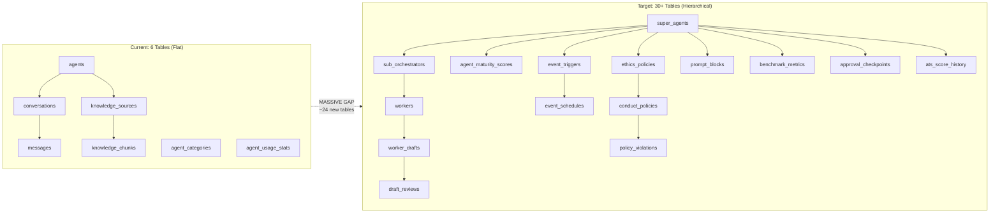
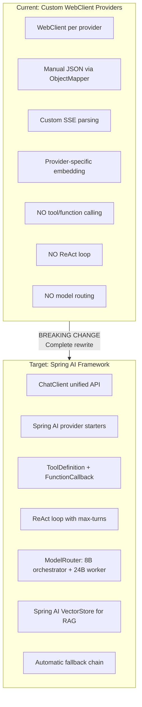
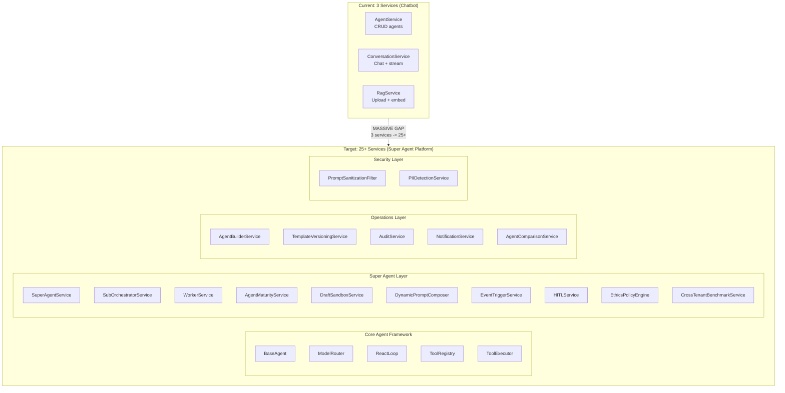
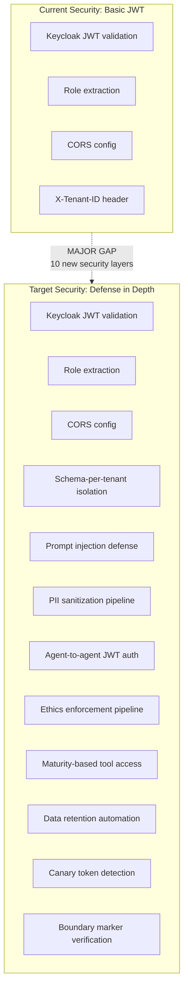
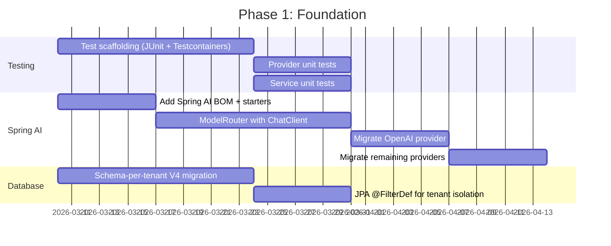
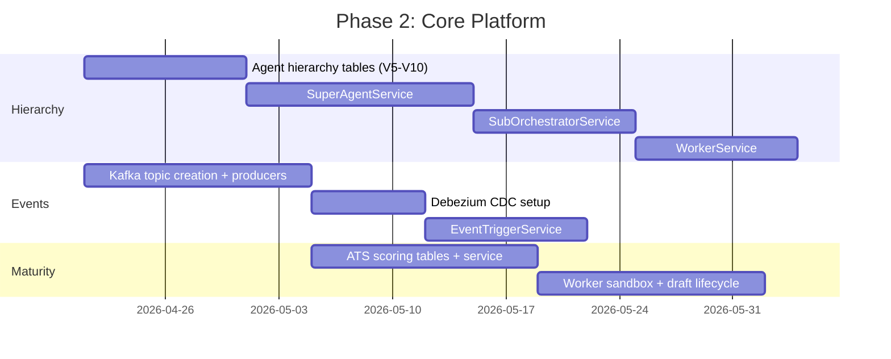
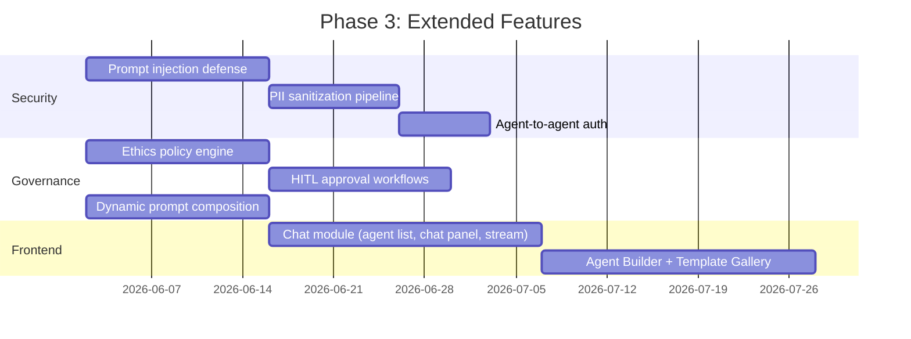
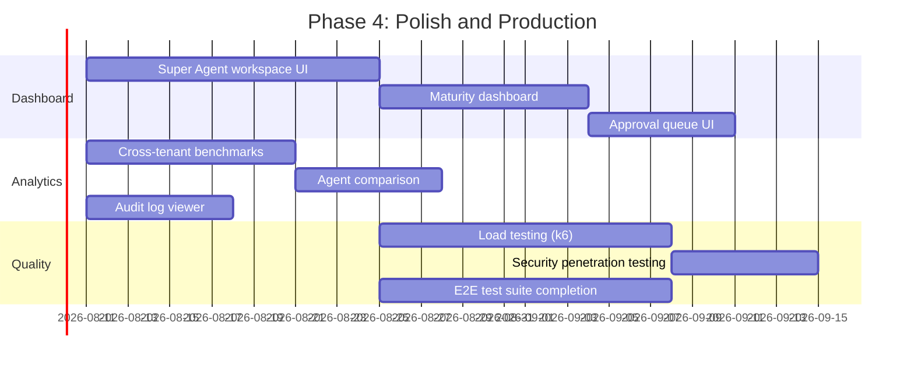

# Codebase Delta Analysis: Super Agent Design Target vs Existing ai-service

**Document:** codebase-delta-analysis.md
**Version:** 1.0.0
**Date:** 2026-03-08
**Status:** Evidence-based analysis (all claims verified against source code)
**Author:** ARCH Agent
**Cross-References:**
- Current codebase: `backend/ai-service/` (49 Java source files, 3 Flyway migrations, pom.xml, application.yml)
- Design target: `docs/ai-service/Design/01-PRD-AI-Agent-Platform.md` (v1.4), `02-Technical-Specification.md` (v1.3), `05-Technical-LLD.md` (v1.4.0), `10-Full-Stack-Integration-Spec.md` (v1.4.0)
- Architecture decisions: `docs/adr/ADR-023` through `ADR-030` (all Proposed status)
- BA domain model: `docs/data-models/super-agent-domain-model.md` (35 entities)

---

## 1. Executive Summary

This document provides a brutally honest, evidence-based comparison between the **existing ai-service codebase** and the **Super Agent platform design target**. Every claim about the current state is verified against actual source files with absolute paths.

### Current State: Simple Multi-Provider Chatbot API

The existing `ai-service` is a functional chatbot platform with:
- 6 database tables (V1-V3 Flyway migrations)
- 4 LLM providers via custom WebClient (OpenAI, Anthropic, Gemini, Ollama)
- CRUD for agents, conversations, messages, knowledge sources
- Basic RAG with pgvector embeddings
- SSE streaming via `Flux<StreamChunkDTO>`
- OAuth2 resource server security with Keycloak JWT
- Zero tests, zero Kafka producers/consumers, zero Spring AI integration

### Target State: Enterprise Hierarchical Super Agent Platform

The design target describes:
- 30+ database tables (15 new Super Agent tables + 15 existing/planned agent platform tables)
- Spring AI ChatClient with ReAct loop, ToolDefinition, ModelRouter
- Three-tier hierarchy: Super Agent -> Sub-Orchestrators -> Workers
- 4-level maturity model with ATS scoring (Coaching -> Graduate)
- Event-driven triggers via 9 Kafka topics + Debezium CDC
- Worker sandbox with draft lifecycle
- Dynamic system prompt composition from modular blocks
- Ethics enforcement pipeline, HITL approval workflows
- Schema-per-tenant isolation
- 25+ Angular components, 10+ Angular services
- Full test pyramid

### Gap Magnitude Summary

| Dimension | Gap Size | Assessment |
|-----------|----------|------------|
| Entity Model | **MASSIVE** | 6 tables exist; 30+ tables needed; hierarchy model requires complete data architecture redesign |
| LLM Integration | **MASSIVE** | Custom WebClient providers must be replaced with Spring AI ChatClient + ReAct loop |
| Service Architecture | **MASSIVE** | 3 services exist; 15+ services needed; fundamental paradigm shift from chatbot to orchestrator |
| Event System | **MASSIVE** | Kafka configured but 0 producers/consumers; 9 topics + Debezium needed |
| Security | **MAJOR** | Basic JWT exists; need agent-to-agent auth, ethics pipeline, PII sanitization, prompt injection defense |
| Frontend | **MASSIVE** | Zero AI components exist; 25+ components and 10+ services needed (greenfield) |
| Testing | **MASSIVE** | Zero test files exist; full pyramid needed |
| Infrastructure | **MODERATE** | Core infrastructure exists; need Debezium, Ollama GPU, schema-per-tenant, event scheduler |
| Tenant Isolation | **MASSIVE** | Row-level `tenant_id` exists; schema-per-tenant required (ADR-026) |

---

## 2. Entity Model Delta

### 2.1 Current State [IMPLEMENTED]

**Evidence:** `/Users/mksulty/Claude/Projects/EMSIST/backend/ai-service/src/main/resources/db/migration/V1__ai_agents.sql`

The existing database has **6 tables** across 3 Flyway migrations:

| Table | Migration | Columns | Key Features |
|-------|-----------|---------|--------------|
| `agents` | V1 | 17 cols + V3 adds `version` | Flat structure; `tenant_id` VARCHAR(50); `system_prompt` TEXT; `provider` enum (OPENAI, ANTHROPIC, GEMINI, OLLAMA); `model_config` JSONB |
| `agent_categories` | V1 | 8 cols | Static lookup; seeded with 10 categories in V2 |
| `conversations` | V1 | 11 cols | Links user to agent; `tenant_id` filter; `message_count`/`total_tokens` counters |
| `messages` | V1 | 8 cols | Conversation messages; `role` enum (USER, ASSISTANT, SYSTEM); `rag_context` JSONB |
| `knowledge_sources` | V1 | 14 cols | RAG document sources; `source_type` enum (FILE, URL, TEXT); processing status |
| `knowledge_chunks` | V1 | 8 cols | Vectorized chunks; `embedding vector(1536)` with HNSW cosine index |
| `agent_usage_stats` | V1 | 8 cols | Daily per-user usage tracking |

**Entity classes verified:**
- `/Users/mksulty/Claude/Projects/EMSIST/backend/ai-service/src/main/java/com/ems/ai/entity/AgentEntity.java` -- Flat `@Entity` with `LlmProvider` enum, `AgentStatus` enum, `@Version` optimistic locking
- `/Users/mksulty/Claude/Projects/EMSIST/backend/ai-service/src/main/java/com/ems/ai/entity/ConversationEntity.java` -- `@ManyToOne` to AgentEntity
- `/Users/mksulty/Claude/Projects/EMSIST/backend/ai-service/src/main/java/com/ems/ai/entity/MessageEntity.java` -- `@ManyToOne` to ConversationEntity
- `/Users/mksulty/Claude/Projects/EMSIST/backend/ai-service/src/main/java/com/ems/ai/entity/KnowledgeSourceEntity.java` -- `@ManyToOne` to AgentEntity
- `/Users/mksulty/Claude/Projects/EMSIST/backend/ai-service/src/main/java/com/ems/ai/entity/KnowledgeChunkEntity.java` -- `float[] embedding` with `@Array(length=1536)`
- `/Users/mksulty/Claude/Projects/EMSIST/backend/ai-service/src/main/java/com/ems/ai/entity/AgentCategoryEntity.java` -- Simple lookup entity

### 2.2 Target State [PLANNED]

**Evidence:** `docs/ai-service/Design/05-Technical-LLD.md` v1.4.0, Sections 3.16-3.30

The Super Agent platform requires **15 new tables** (in addition to ~15 tables for the base agent platform):

| Table | LLD Section | Purpose | Key Relationship |
|-------|-------------|---------|-----------------|
| `super_agents` | 3.16 | Tenant-level orchestrators | 1 per tenant; references `agents` |
| `sub_orchestrators` | 3.17 | Domain-expert planners | N per super_agent; domain enum (EA, PERF, GRC, KM, SD) |
| `workers` | 3.18 | Capability executors | N per sub_orchestrator; capability_type enum |
| `agent_maturity_scores` | 3.19 | Current ATS composite scores | 1 per agent+tenant; 5 dimension scores |
| `ats_score_history` | 3.20 | Historical ATS snapshots | Time-series per agent+tenant |
| `worker_drafts` | 3.21 | Sandbox draft outputs | Per worker execution; status lifecycle |
| `draft_reviews` | 3.22 | Review decisions on drafts | Links reviewer to draft; approve/reject/revise |
| `approval_checkpoints` | 3.23 | HITL approval points | Risk x maturity matrix; timeout escalation |
| `event_triggers` | 3.24 | Event source definitions | Source type (ENTITY_CHANGE, SCHEDULE, THRESHOLD, EXTERNAL) |
| `event_schedules` | 3.25 | Cron-based trigger schedules | Links to event_triggers; next_run tracking |
| `ethics_policies` | 3.26 | Platform-immutable ethics rules | Scope: PLATFORM vs TENANT |
| `conduct_policies` | 3.27 | Tenant-configurable conduct rules | Extends ethics_policies per tenant |
| `policy_violations` | 3.28 | Ethics/conduct violation log | Links agent + policy + severity |
| `prompt_blocks` | 3.29 | Modular prompt composition blocks | Block type, conditions, priority |
| `benchmark_metrics` | 3.30 | Cross-tenant anonymized benchmarks | Aggregated performance metrics |

Additionally, the base agent platform (LLD 3.6-3.15) requires:

| Table | LLD Section | Purpose |
|-------|-------------|---------|
| `pipeline_runs` | 3.6 | Pipeline state machine tracking |
| `agent_artifacts` | 3.7 | Trained model artifacts |
| `rag_search_log` | 3.8 | RAG query audit trail |
| `rag_chunking_config` | 3.9 | Per-agent chunking strategy |
| `agent_templates` | 3.10 | Template gallery for Agent Builder |
| `audit_events` | 3.11 | Structured audit log |
| `agent_publish_submissions` | 3.12 | Publishing approval workflow |
| `notifications` | 3.14 | User notification queue |

### 2.3 Delta Visualization

### 2.4 Migration Complexity Assessment

| Aspect | Complexity | Rationale |
|--------|-----------|-----------|
| **Existing table preservation** | LOW | Current 6 tables can remain; `agents` table becomes a base entity referenced by hierarchy |
| **Hierarchy introduction** | HIGH | `super_agents` -> `sub_orchestrators` -> `workers` requires foreign key chains and cascade rules |
| **Schema-per-tenant migration** | CRITICAL | ADR-026 requires moving from row-level `tenant_id` to PostgreSQL schema isolation; affects ALL existing queries |
| **ATS scoring tables** | MODERATE | New tables with no dependencies on existing data; can be added incrementally |
| **Event system tables** | MODERATE | New tables; `event_triggers` and `event_schedules` are self-contained |
| **Ethics/policy tables** | MODERATE | New tables with platform-level seed data |
| **Prompt block tables** | MODERATE | New table; can be added without schema migration of existing data |
| **Total new migrations** | **~15-20 Flyway scripts** | V4 through V20+ estimated |

---

## 3. LLM Integration Delta

### 3.1 Current State [IMPLEMENTED]

**Evidence:** `/Users/mksulty/Claude/Projects/EMSIST/backend/ai-service/src/main/java/com/ems/ai/provider/`

The current LLM integration uses **custom WebClient-based providers**:

| Component | File | Pattern |
|-----------|------|---------|
| Provider interface | `LlmProviderService.java` | `CompletableFuture<ChatResponse> chat(ChatRequest)`, `Flux<StreamChunkDTO> streamChat(ChatRequest)`, `float[] generateEmbedding(String)` |
| Provider factory | `LlmProviderFactory.java` | `Map<LlmProvider, LlmProviderService>` keyed by enum |
| OpenAI | `OpenAiProvider.java` | `WebClient` to `https://api.openai.com/v1`; manual JSON construction via `ObjectMapper`; SSE parsing |
| Anthropic | `AnthropicProvider.java` | `WebClient` to `https://api.anthropic.com`; manual `x-api-key` header; Anthropic-specific SSE parsing |
| Gemini | `GeminiProvider.java` | `WebClient` to Google's `generativelanguage.googleapis.com/v1beta`; API key in query param |
| Ollama | `OllamaProvider.java` | `WebClient` to local Ollama (`http://localhost:11434`); dynamic model discovery via `/api/tags` |

**Key characteristics of current approach:**
- Each provider manually constructs JSON request bodies using `ObjectMapper.createObjectNode()`
- Each provider manually parses JSON responses
- Each provider handles SSE stream parsing independently
- No tool/function calling support
- No ReAct loop
- No model routing (complexity-based selection)
- No fallback chain
- Embedding generation only via OpenAI and Ollama (Anthropic throws `UnsupportedOperationException`)

**Maven dependency:** `com.theokanning.openai-gpt3-java:service:0.18.2` (an older community OpenAI SDK, not Spring AI)

### 3.2 Target State [PLANNED]

**Evidence:** `docs/ai-service/Design/02-Technical-Specification.md` v1.3, Sections 3.1-3.3

The target uses **Spring AI ChatClient** with a unified abstraction:

| Component | Tech Spec Section | Pattern |
|-----------|-------------------|---------|
| BaseAgent | 3.1 | Spring AI `ChatClient` via `ModelRouter.route()` |
| ModelRouter | 3.2 | Two-model architecture: 8B orchestrator (routing/planning) + 24B worker (execution) + cloud fallback |
| ReAct loop | 3.3 | `ChatClient.prompt().functions(tools).call()` with max-turns limit; thought-action-observation cycle |
| ToolRegistry | 3.4 | `ToolDefinition` + `FunctionCallback` for dynamic tool resolution per agent skill set |
| Spring AI providers | 1.3 | `spring-ai-ollama-spring-boot-starter`, `spring-ai-anthropic-spring-boot-starter`, `spring-ai-openai-spring-boot-starter`, `spring-ai-vertex-ai-gemini-spring-boot-starter` |

### 3.3 Delta Analysis

**Breaking changes:**
1. `LlmProviderService` interface must be replaced with Spring AI `ChatModel`
2. `LlmProviderFactory` must be replaced with `ModelRouter`
3. All 4 provider implementations (1000+ lines of WebClient code) must be replaced with Spring AI starters
4. `AiProviderProperties` config structure changes from `ai.providers.*` to `spring.ai.*`
5. `com.theokanning.openai-gpt3-java` dependency removed; replaced with `spring-ai-openai-spring-boot-starter`
6. SSE streaming changes from custom `Flux<StreamChunkDTO>` parsing to Spring AI's native streaming

**Migration path:**
1. Add Spring AI BOM and provider starters to `pom.xml`
2. Create `ModelRouter` wrapping Spring AI `ChatClient`
3. Create adapter layer: `LlmProviderService` delegates to `ChatModel` (enables gradual migration)
4. Port each provider one at a time; validate against existing test suite (once tests exist)
5. Remove custom `WebClient` providers after all migrated
6. Add `ToolRegistry` and `ReAct` loop on top of Spring AI

---

## 4. Service Architecture Delta

### 4.1 Current State [IMPLEMENTED]

**Evidence:** `/Users/mksulty/Claude/Projects/EMSIST/backend/ai-service/src/main/java/com/ems/ai/service/`

The current service layer has **3 service pairs** (interface + implementation):

| Service | Interface | Implementation | Responsibility |
|---------|-----------|----------------|---------------|
| AgentService | `AgentService.java` | `AgentServiceImpl.java` | CRUD for agents; search; category listing |
| ConversationService | `ConversationService.java` | `ConversationServiceImpl.java` | CRUD for conversations; send message; stream message; get messages |
| RagService | `RagService.java` | `RagServiceImpl.java` | File upload; text ingestion; chunking; embedding; similarity search |

**Controllers verified:**
- `/Users/mksulty/Claude/Projects/EMSIST/backend/ai-service/src/main/java/com/ems/ai/controller/AgentController.java` -- 8 endpoints (`POST /`, `GET /{id}`, `PUT /{id}`, `DELETE /{id}`, `GET /my`, `GET /`, `GET /search`, `GET /category/{id}`, `GET /categories`)
- `/Users/mksulty/Claude/Projects/EMSIST/backend/ai-service/src/main/java/com/ems/ai/controller/ConversationController.java` -- 8 endpoints
- `/Users/mksulty/Claude/Projects/EMSIST/backend/ai-service/src/main/java/com/ems/ai/controller/StreamController.java` -- 1 endpoint (SSE streaming)
- `/Users/mksulty/Claude/Projects/EMSIST/backend/ai-service/src/main/java/com/ems/ai/controller/KnowledgeController.java` -- 4 endpoints
- `/Users/mksulty/Claude/Projects/EMSIST/backend/ai-service/src/main/java/com/ems/ai/controller/ProviderController.java` -- 2 endpoints

**Total: 5 controllers, 23 endpoints, 3 services, 6 repositories, 6 entities, 12 DTOs**

### 4.2 Target State [PLANNED]

**Evidence:** `docs/ai-service/Design/02-Technical-Specification.md` v1.3, Sections 3.1-3.31

The target requires **20+ service classes** across multiple layers:

| Service | Tech Spec Section | Layer | Purpose |
|---------|-------------------|-------|---------|
| BaseAgent | 3.1 | Core | Abstract agent with ReAct loop, tool execution, memory management |
| ModelRouter | 3.2 | Core | Two-model routing: orchestrator vs worker vs cloud |
| ReactLoop | 3.3 | Core | Thought-action-observation cycle with max-turns |
| ToolRegistry | 3.4 | Core | Dynamic tool resolution per agent skill set |
| ToolExecutor | 3.5 | Core | Sandboxed tool execution with result capture |
| SkillManager | 3.6-3.7 | Core | Skill definition with template fields |
| ConversationMemory | 3.8 | Memory | Short-term conversation context |
| VectorMemory | 3.8 | Memory | Long-term RAG-based memory |
| TraceLogger | 3.9 | Observability | Kafka-based trace recording |
| PromptSanitizationFilter | 3.13 | Security | Prompt injection defense |
| PIIDetectionService | 3.14 | Security | PII detection and redaction |
| AgentBuilderService | 3.16 | Builder | Template CRUD, fork, publish, version, soft-delete, export/import |
| TemplateVersioningService | 3.17 | Builder | Semantic versioning and rollback |
| AuditService | 3.18 | Operations | Structured audit logging |
| NotificationService | 3.19 | Operations | User notification queue |
| KnowledgeSourceService | 3.20 | RAG | Advanced knowledge management |
| AgentComparisonService | 3.21 | Analytics | Side-by-side agent comparison |
| **SuperAgentService** | **3.22** | **Super Agent** | Tenant-level orchestrator lifecycle |
| **SubOrchestratorService** | **3.23** | **Super Agent** | Domain planner management |
| **WorkerService** | **3.24** | **Super Agent** | Capability worker lifecycle |
| **AgentMaturityService** | **3.25** | **Super Agent** | ATS scoring and maturity transitions |
| **DraftSandboxService** | **3.26** | **Super Agent** | Worker sandbox with draft lifecycle |
| **DynamicPromptComposer** | **3.27** | **Super Agent** | Runtime prompt assembly from blocks |
| **EventTriggerService** | **3.28** | **Super Agent** | Event source management and routing |
| **HITLService** | **3.29** | **Super Agent** | Human-in-the-loop approval workflows |
| **EthicsPolicyEngine** | **3.30** | **Super Agent** | Ethics enforcement pipeline |
| **CrossTenantBenchmarkService** | **3.31** | **Super Agent** | Anonymized cross-tenant benchmarks |

### 4.3 Delta Visualization

---

## 5. Event System Delta

### 5.1 Current State [IMPLEMENTED -- Configuration Only]

**Evidence:**
- `/Users/mksulty/Claude/Projects/EMSIST/backend/ai-service/src/main/resources/application.yml` (lines 44-55): Kafka bootstrap-servers, producer/consumer serializers configured
- `/Users/mksulty/Claude/Projects/EMSIST/backend/ai-service/pom.xml` (line 76): `spring-kafka` dependency present

**Verification of zero usage:**
- Grep for `KafkaTemplate` across `backend/ai-service/`: **0 results**
- Grep for `@KafkaListener` across `backend/ai-service/`: **0 results**
- No Kafka producer or consumer classes exist in any package

**Status:** Kafka is configured as an infrastructure dependency but has **zero runtime usage**. The `spring-kafka` JAR is on the classpath but no beans produce or consume messages.

### 5.2 Target State [PLANNED]

**Evidence:** `docs/ai-service/Design/02-Technical-Specification.md` v1.3, Section 6; ADR-025 (Event-Driven Triggers)

The target requires **9 Kafka topics** with producers, consumers, and Debezium CDC:

| Topic | Purpose | Producer | Consumer |
|-------|---------|----------|----------|
| `agent.traces` | Execution trace recording | TraceLogger (every agent request) | TraceCollector (learning pipeline) |
| `agent.feedback` | User feedback signals | FeedbackService | TrainingDataService |
| `agent.training` | Training job coordination | TrainingOrchestrator | ModelEvaluator |
| `agent.events` | Business event triggers | Debezium CDC, external webhooks | EventTriggerService |
| `agent.hierarchy.commands` | Super Agent -> Sub-Orchestrator commands | SuperAgentService | SubOrchestratorService |
| `agent.worker.tasks` | Sub-Orchestrator -> Worker task assignments | SubOrchestratorService | WorkerService |
| `agent.drafts` | Worker draft submissions for review | DraftSandboxService | HITLService |
| `agent.maturity` | ATS score change events | AgentMaturityService | NotificationService |
| `agent.ethics` | Policy violation events | EthicsPolicyEngine | AuditService, NotificationService |

Additionally:
- **Debezium CDC connector** to capture entity changes in real-time (ADR-025)
- **Spring Cloud Stream** bindings for declarative producer/consumer wiring
- **Dead Letter Queue (DLQ)** for failed event processing
- **Schema Registry** for event payload schema evolution

### 5.3 Delta Assessment

| Aspect | Current | Target | Gap |
|--------|---------|--------|-----|
| Kafka dependency | Present in pom.xml | Same | None |
| Kafka config | application.yml configured | Enhanced with topics and consumer groups | Moderate |
| Producers | **0** | **9+** | MASSIVE |
| Consumers | **0** | **9+** | MASSIVE |
| Debezium | **Not present** | Required for CDC | Infrastructure addition |
| Spring Cloud Stream | **Not present** | Required for declarative bindings | Dependency addition |
| Schema Registry | **Not present** | Required for schema evolution | Infrastructure addition |
| DLQ handling | **Not present** | Required for error resilience | New implementation |

**Activation vs greenfield:** The Kafka infrastructure is an **activation** scenario (config exists, dependency exists, just need to write producers/consumers). But the event topology design is **greenfield** (zero existing patterns to extend).

---

## 6. Security Delta

### 6.1 Current State [IMPLEMENTED]

**Evidence:** `/Users/mksulty/Claude/Projects/EMSIST/backend/ai-service/src/main/java/com/ems/ai/config/SecurityConfig.java`

The current security layer provides:

| Feature | Implementation | Evidence |
|---------|---------------|----------|
| OAuth2 Resource Server | `oauth2ResourceServer(jwt -> ...)` | SecurityConfig.java line 44 |
| JWT from Keycloak | `issuer-uri: http://localhost:8180/realms/master` | application.yml line 12 |
| Role extraction | Custom `extractAuthorities()` from `realm_access`, `resource_access`, direct `roles` claim | SecurityConfig.java lines 59-81 |
| Stateless sessions | `SessionCreationPolicy.STATELESS` | SecurityConfig.java line 37 |
| CORS | Localhost origins (4200, 4201, 127.0.0.1:4200) | SecurityConfig.java lines 129-133 |
| Endpoint security | Actuator/Swagger public; `/api/v1/providers/**` requires TENANT_ADMIN+; all others authenticated | SecurityConfig.java lines 39-42 |
| CSRF disabled | `csrf(AbstractHttpConfigurer::disable)` | SecurityConfig.java line 35 |
| Tenant isolation | `@RequestHeader("X-Tenant-ID")` on every controller method | AgentController.java, ConversationController.java |

### 6.2 Target State [PLANNED]

**Evidence:** `docs/ai-service/Design/05-Technical-LLD.md` v1.4.0, Sections 6.7-6.16

The target requires **10 additional security layers**:

| Security Layer | LLD Section | Description |
|----------------|-------------|-------------|
| Prompt injection defense | 6.7, 6.15 | Boundary markers, canary tokens, input scanning |
| Pre-cloud PII sanitization | 6.8, 6.16 | Regex + NER-based PII detection before sending to cloud providers |
| Data retention architecture | 6.9 | Configurable TTL per data type; automatic purge |
| Caching strategy | 6.10 | Redis/Valkey strategy with tenant-scoped keys |
| Agent-level security | 6.11 | Per-agent permission boundaries based on maturity |
| Agent-to-agent authentication | 6.12 | Signed JWT tokens for inter-agent communication in hierarchy |
| Cross-tenant data boundary | 6.13 | Schema-per-tenant + RLS + JPA filters (triple layer) |
| Ethics policy enforcement | 6.14 | Runtime pre-check and post-check pipeline |
| Multi-agent prompt injection | 6.15 | Hierarchical prompt boundary protection |
| Agent PII sanitization | 6.16 | Pipeline-level PII detection across agent chain |

### 6.3 Delta Assessment

**Incremental security layer-up plan:**
1. **P0:** Prompt injection defense (critical for any LLM platform)
2. **P0:** PII sanitization (before sending user data to cloud providers)
3. **P1:** Schema-per-tenant migration (ADR-026)
4. **P1:** Agent-to-agent authentication (needed for hierarchy)
5. **P2:** Ethics enforcement pipeline
6. **P2:** Maturity-based tool access
7. **P3:** Data retention automation
8. **P3:** Cross-tenant benchmark anonymization

---

## 7. Frontend Delta

### 7.1 Current State

**Verification:** Grep for `ai-|agent|chat|conversation` across `/frontend/src/app/*.ts`: **0 results**

There are **zero Angular components, services, or routes** related to AI/agent/chat functionality in the frontend. The frontend contains only the EMSIST administration shell (tenant management, user management, session management, branding).

### 7.2 Target State [PLANNED]

**Evidence:** `docs/ai-service/Design/10-Full-Stack-Integration-Spec.md` v1.4.0, `docs/ai-service/Design/06-UI-UX-Design-Spec.md`

The target requires a complete AI frontend module:

**Angular Services (10+):**
- AgentService, ConversationService, StreamService, KnowledgeService
- AgentBuilderService, TemplateGalleryService
- AuditLogService, PipelineRunService, NotificationService, KnowledgeSourceService, AgentComparisonService
- SuperAgentService, HITLApprovalService, EventTriggerService, MaturityDashboardService

**Angular Components (25+):**
- Chat: agent-list, agent-card, chat-panel, message-bubble, streaming-indicator
- Builder: agent-builder, template-gallery, capability-library, prompt-playground, skill-picker
- Operations: audit-log-viewer, pipeline-viewer, notification-panel, agent-comparison, ai-preferences
- Knowledge: knowledge-source-list, knowledge-upload, chunk-viewer
- Super Agent: agent-workspace, embedded-panel, approval-queue, maturity-dashboard, event-trigger-management
- Common: agent-delete-dialog, agent-publish-dialog, template-review

**Routes:**
- `/ai/chat`, `/ai/agents`, `/ai/agents/:id`, `/ai/agents/new`
- `/ai/builder`, `/ai/templates`, `/ai/templates/:id`
- `/ai/workspace`, `/ai/approvals`, `/ai/maturity`, `/ai/events`
- `/ai/audit`, `/ai/pipeline`, `/ai/notifications`, `/ai/knowledge`

### 7.3 Delta Assessment

| Aspect | Current | Target | Gap |
|--------|---------|--------|-----|
| Components | 0 | 25+ | **GREENFIELD** |
| Services | 0 | 15+ | **GREENFIELD** |
| Routes | 0 | 15+ | **GREENFIELD** |
| DTOs/models | 0 | 30+ | **GREENFIELD** |
| E2E tests | 0 | 20+ specs | **GREENFIELD** |

This is the cleanest gap in the analysis -- there is literally nothing to migrate or adapt. The entire AI frontend is greenfield development.

---

## 8. Testing Delta

### 8.1 Current State

**Verification:** Glob for `backend/ai-service/src/test/**/*.java`: **0 results**

There are **zero test files** in the ai-service module. No unit tests, no integration tests, no controller tests.

### 8.2 Target State [PLANNED]

The Definition of Done (CLAUDE.md) requires:

| Test Level | Target Coverage | Framework |
|------------|----------------|-----------|
| Unit tests (backend) | >= 80% line, >= 75% branch | JUnit 5 + Mockito |
| Integration tests (backend) | API endpoints + DB | Testcontainers (PostgreSQL + pgvector, Kafka, Valkey) |
| Unit tests (frontend) | >= 80% coverage | Vitest + TestBed |
| E2E tests (frontend) | Happy path + error states | Playwright |
| Responsive tests | Desktop + Tablet + Mobile | Playwright viewports |
| Accessibility tests | WCAG AAA | axe-core via Playwright |
| Contract tests | API schema validation | Spring Cloud Contract / Pact |
| Load tests | Concurrent user scenarios | k6 / Gatling |

### 8.3 Test Scaffolding Priority

| Priority | Test Target | Rationale |
|----------|-------------|-----------|
| P0 | Provider unit tests | Validate LLM integration during Spring AI migration |
| P0 | ConversationService unit tests | Core chat functionality |
| P0 | AgentService unit tests | Agent CRUD |
| P1 | Controller integration tests | API contract validation |
| P1 | RagService integration tests | pgvector + embedding pipeline |
| P1 | SecurityConfig tests | JWT validation, role extraction |
| P2 | Kafka producer/consumer tests | Event system activation |
| P2 | Frontend component tests | As components are built |
| P3 | E2E tests | After frontend exists |
| P3 | Load tests | After core functionality stable |

---

## 9. Infrastructure Delta

### 9.1 Current State [IMPLEMENTED]

**Evidence:** `/Users/mksulty/Claude/Projects/EMSIST/infrastructure/docker/docker-compose.yml`

| Component | Image | Status |
|-----------|-------|--------|
| PostgreSQL | `postgres:16-alpine` | Running; ai_db exists |
| Valkey (Redis) | `valkey/valkey:8-alpine` | Running; ai-service configured to connect |
| Neo4j | `neo4j:5.12.0-community` | Running; used by auth-facade only |
| Kafka | `confluentinc/cp-kafka:7.5.0` | Running; ai-service has consumer config but zero usage |
| Zookeeper | `confluentinc/cp-zookeeper:7.5.0` | Running; Kafka dependency |
| Keycloak | `quay.io/keycloak/keycloak:24.0` | Running; JWT issuer for ai-service |
| Prometheus | `prom/prometheus:v2.48.0` | Running; scrapes actuator metrics |
| Grafana | `grafana/grafana:10.2.2` | Running; visualization |

### 9.2 Target State [PLANNED]

**Evidence:** ADR-025 (Event-Driven Triggers), ADR-026 (Schema-per-Tenant), `docs/ai-service/Design/09-Infrastructure-Setup-Guide.md`

| Component | Image/Technology | Purpose | Status |
|-----------|-----------------|---------|--------|
| PostgreSQL | `postgres:16-alpine` | Schema-per-tenant; pgvector | **EXISTS** -- needs schema-per-tenant migration |
| Valkey | `valkey/valkey:8-alpine` | Session cache, conversation context | **EXISTS** |
| Kafka | `confluentinc/cp-kafka:7.5.0` | 9 event topics | **EXISTS** -- needs topic creation and producers/consumers |
| Zookeeper | `confluentinc/cp-zookeeper:7.5.0` | Kafka coordination | **EXISTS** |
| Keycloak | `quay.io/keycloak/keycloak:24.0` | JWT, agent-to-agent auth tokens | **EXISTS** -- needs agent client configuration |
| **Debezium** | `debezium/connect:2.x` | CDC for entity change events (ADR-025) | **DOES NOT EXIST** |
| **Schema Registry** | `confluentinc/cp-schema-registry:7.5.0` | Kafka event schema evolution | **DOES NOT EXIST** |
| **Ollama** | `ollama/ollama:latest` | Local LLM inference (GPU-accelerated) | **DOES NOT EXIST** in Docker Compose |
| **Event Scheduler** | Spring `@Scheduled` or Quartz | Cron-based trigger execution (ADR-025) | **DOES NOT EXIST** |

### 9.3 Delta Assessment

| Addition | Effort | Dependency |
|----------|--------|------------|
| Add Debezium container to docker-compose | LOW | Kafka must be running |
| Add Schema Registry container | LOW | Kafka must be running |
| Add Ollama container with GPU passthrough | MODERATE | Host GPU drivers required |
| Configure schema-per-tenant PostgreSQL | HIGH | Requires Flyway migration strategy change |
| Create 9 Kafka topics in docker-compose | LOW | Kafka running |
| Configure Keycloak agent client | MODERATE | Keycloak admin API |
| Add event scheduler | MODERATE | Spring Boot @Scheduled or Quartz |

---

## 10. Migration Priority Matrix

| # | Component | Gap Size | Priority | Estimated Effort | Dependencies | Blocks |
|---|-----------|----------|----------|-----------------|--------------|--------|
| 1 | **Spring AI Migration** | MASSIVE | **P0** | 3-4 weeks | None | Everything else |
| 2 | **Test Foundation** | MASSIVE | **P0** | 2-3 weeks | None (parallel with #1) | Safe migration of providers |
| 3 | **Schema-per-Tenant** | MASSIVE | **P0** | 2-3 weeks | None | Super Agent tables, event system |
| 4 | **Agent Hierarchy Tables** | MASSIVE | **P1** | 2 weeks | #3 (schema-per-tenant) | Super Agent services |
| 5 | **SuperAgentService + SubOrchestrator + Worker** | MASSIVE | **P1** | 4-5 weeks | #1 (Spring AI), #4 (tables) | Event triggers, HITL, sandbox |
| 6 | **Kafka Activation** | MASSIVE | **P1** | 2-3 weeks | #5 (Super Agent services produce events) | Event-driven triggers |
| 7 | **Debezium CDC** | MODERATE | **P1** | 1 week | #6 (Kafka active) | Entity change triggers |
| 8 | **Agent Maturity + ATS Scoring** | MAJOR | **P1** | 2-3 weeks | #4 (maturity tables) | Sandbox, HITL |
| 9 | **Worker Sandbox + Draft Lifecycle** | MAJOR | **P1** | 2 weeks | #5 (Worker service), #8 (maturity) | Draft review, HITL |
| 10 | **Dynamic Prompt Composition** | MAJOR | **P1** | 2 weeks | #4 (prompt_blocks table), #5 | Improved agent output quality |
| 11 | **Event Trigger Service** | MAJOR | **P1** | 2 weeks | #6 (Kafka), #7 (Debezium) | Proactive agent behavior |
| 12 | **HITL Approval Workflows** | MAJOR | **P2** | 2-3 weeks | #8 (maturity), #9 (sandbox) | Graduate autonomy |
| 13 | **Prompt Injection Defense** | MAJOR | **P2** | 2 weeks | #1 (Spring AI) | Production security |
| 14 | **PII Sanitization** | MAJOR | **P2** | 1-2 weeks | #1 (Spring AI) | Cloud provider usage |
| 15 | **Ethics Policy Engine** | MAJOR | **P2** | 2-3 weeks | #4 (ethics tables), #5 | Compliance readiness |
| 16 | **Frontend: Chat Module** | MASSIVE | **P2** | 3-4 weeks | #1 (Spring AI streaming) | User-facing AI features |
| 17 | **Frontend: Agent Builder** | MASSIVE | **P2** | 3-4 weeks | #16 (chat), #5 (Super Agent API) | Template management |
| 18 | **Frontend: Super Agent Dashboard** | MAJOR | **P2** | 2-3 weeks | #17, #8 (maturity), #12 (HITL) | Operations visibility |
| 19 | **Cross-Tenant Benchmarks** | MODERATE | **P3** | 1-2 weeks | #8 (ATS scores exist) | Benchmarking insights |
| 20 | **Agent Comparison** | MODERATE | **P3** | 1 week | #16 (frontend exists) | Analytics |
| 21 | **Audit Log Viewer** | MODERATE | **P3** | 1 week | #6 (Kafka events logged) | Compliance visibility |
| 22 | **Load/Performance Testing** | MODERATE | **P3** | 2 weeks | #16 (frontend), #5 (backend stable) | Production readiness |

---

## 11. Recommended Implementation Roadmap

### Phase 1: Foundation (Weeks 1-6)

**Goal:** Establish the technical foundation without breaking existing functionality.

**Deliverables:**
- Spring AI ChatClient replaces custom WebClient providers
- Schema-per-tenant database architecture
- 80%+ test coverage on existing services
- Existing API contracts preserved (no breaking changes)

### Phase 2: Core Platform (Weeks 7-14)

**Goal:** Build the Super Agent hierarchy and event system.

**Deliverables:**
- Three-tier hierarchy operational (Super Agent -> Sub-Orchestrator -> Worker)
- 9 Kafka topics with producers and consumers
- Debezium CDC for entity change detection
- ATS scoring with maturity transitions
- Worker sandbox producing draft outputs

### Phase 3: Extended Features (Weeks 15-22)

**Goal:** Add governance, security, and user-facing features.

**Deliverables:**
- Prompt injection defense and PII sanitization active
- Ethics enforcement pipeline operational
- HITL approval workflows for low-maturity workers
- Chat UI with SSE streaming
- Agent Builder with template gallery

### Phase 4: Polish and Production (Weeks 23-28)

**Goal:** Operations dashboard, benchmarking, and production readiness.

**Deliverables:**
- Full operations dashboard
- Cross-tenant anonymized benchmarking
- Load testing validates SLA targets
- Complete E2E test suite
- Production deployment ready

---

## 12. Risk Register

| Risk | Likelihood | Impact | Mitigation |
|------|-----------|--------|------------|
| Spring AI migration breaks existing streaming | HIGH | HIGH | Adapter pattern; keep old providers as fallback during migration; comprehensive test suite first |
| Schema-per-tenant migration causes data loss | MEDIUM | CRITICAL | Backup before migration; staged rollout per tenant; extensive testing with production-like data |
| Kafka activation causes performance degradation | MEDIUM | MEDIUM | Async producers; batch consumers; monitor lag and throughput |
| Super Agent hierarchy adds unacceptable latency | MEDIUM | MEDIUM | Cache routing decisions; async Kafka for non-blocking; monitor P95 latency |
| Zero existing tests means regressions go undetected | HIGH | HIGH | Write tests BEFORE migration (test existing behavior first) |
| Frontend greenfield scope creep | HIGH | MEDIUM | Strict phase gating; MVP chat module first; Builder in Phase 3 |
| ATS scoring gaming (agents optimized for metrics not quality) | LOW | MEDIUM | Multi-dimensional scoring with minimum per-dimension thresholds |

---

## 13. Summary of Key Findings

1. **The gap is MASSIVE across every dimension.** The existing ai-service is a functional chatbot API; the target is an enterprise multi-agent orchestration platform. This is not a migration -- it is a platform build on top of an existing foundation.

2. **The existing code is NOT throwaway.** The 6 database tables, 4 LLM provider integrations, SSE streaming, and OAuth2 security are all valuable foundations. The migration strategy should preserve and extend, not replace.

3. **Spring AI migration is the critical path.** Everything in the target architecture depends on Spring AI's `ChatClient`, `ToolDefinition`, and `ChatModel` abstractions. This must be done first.

4. **Tests must come before migration.** With zero existing tests, any migration risks breaking current functionality without detection. The test foundation (P0) enables safe refactoring.

5. **Schema-per-tenant is architecturally significant.** ADR-026 changes the fundamental data isolation model from row-level to schema-level. This affects every JPA repository, every Flyway migration, and every query in the system.

6. **Frontend is pure greenfield.** Zero AI components exist. This is the simplest dimension to plan because there are no legacy constraints.

7. **Kafka is the cheapest activation.** The infrastructure and dependencies exist; only producers and consumers need to be written. This is a rare case where the gap (MASSIVE in scope) has low infrastructure cost.

8. **Estimated total effort: 28-32 weeks** for a team of 3-4 developers, assuming parallel frontend and backend tracks. Phase 1 (Foundation) is the highest-risk phase and should not be parallelized excessively.
