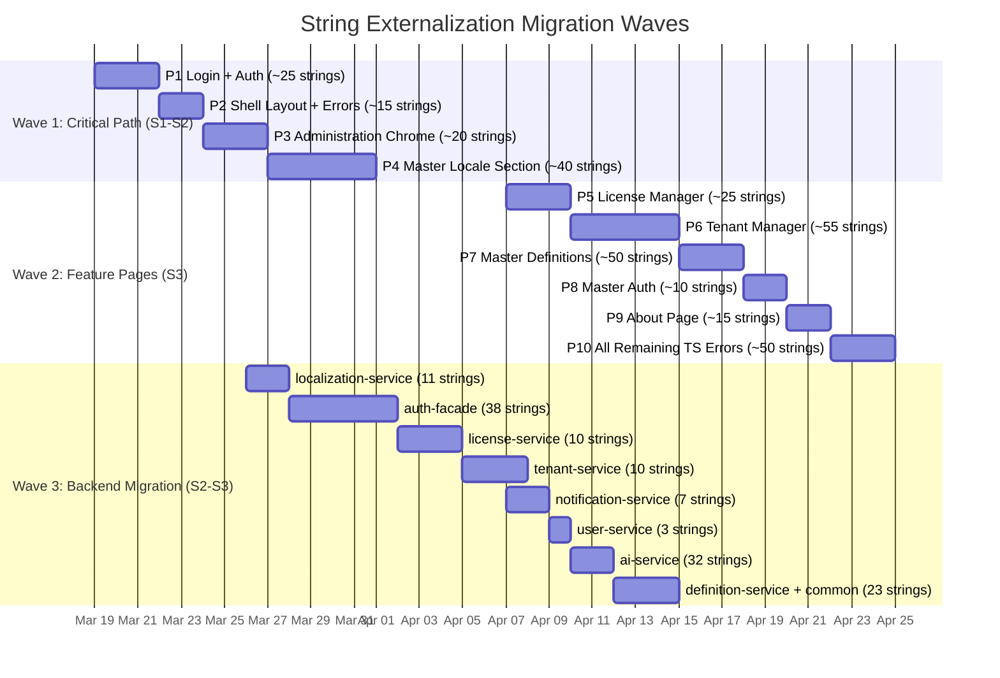

# Localization & i18n — Full-Stack Implementation Backlog

**Version:** 4.0.0
**Date:** 2026-03-11
**Status:** [IN-PROGRESS]
**Owner:** Localization Architecture Squad

---

## Completion Dashboard

```
OVERALL PROGRESS
================

Hardcoded Strings Externalized:     0 / 816   (0.0%)
  Frontend (HTML templates):        0 / 420   (0.0%)
  Frontend (TypeScript):            0 / 180   (0.0%)
  Frontend (Models/Config):         0 / 44    (0.0%)
  Frontend (SCSS):                  0 / 8     (0.0%)
  Backend (Exceptions):             0 / 122   (0.0%)
  Backend (Validation):             0 / 42    (0.0%)

i18n Infrastructure:                0 / 15 components (0.0%)
Documentation:                      8 / 10 docs       (80.0%)
SA Conditions Resolved:            15 / 25            (60.0%)
Test Scenarios Defined:           118 / 118            (100%)
Tests Executed:                     0 / 63 written     (0.0%)
```

## Backlog Documents

| # | Document | Purpose |
|---|----------|---------|
| [01](./01-Frontend-String-Inventory.md) | Frontend String Inventory | Complete catalog of 652 hardcoded strings with suggested i18n keys |
| [02](./02-Backend-String-Inventory.md) | Backend String Inventory | Complete catalog of 164 hardcoded strings with error codes |
| [03](./03-i18n-Infrastructure-Backlog.md) | i18n Infrastructure Backlog | 15 components to build (backend + frontend) |
| [04](./04-Sprint-Plan.md) | Sprint Plan | Phased delivery across 3 sprints (209 SP, 52 stories) |
| [05](./05-Scenario-Matrix.md) | Scenario & Edge Case Matrix | 118 scenarios: happy paths, alternative flows, edge cases, error states, performance |

## Epic Summary

| Epic | Stories | Points | Sprint | Status |
|------|---------|--------|--------|--------|
| E1: Backend i18n Infrastructure | 5 | 21 | S1 | Pending |
| E2: Frontend i18n Infrastructure | 8 | 34 | S1 | Pending |
| E3: Localization Service Fixes | 3 | 8 | S1 | Pending |
| E4: Frontend String Externalization (P1-P4) | 4 | 21 | S2 | Pending |
| E5: Backend Message Migration (P1-P4) | 4 | 13 | S2 | Pending |
| E6: Language Switcher & RTL | 3 | 13 | S2 | Pending |
| E7: Agentic Translation with HITL | 5 | 18 | S2 | Pending |
| E8: Frontend String Externalization (P5-P10) | 6 | 18 | S3 | Pending |
| E9: Backend Message Migration (P5-P8) | 4 | 8 | S3 | Pending |
| E10: Testing & QA | 5 | 21 | S3 | Pending |
| E11: Documentation Completion | 6 | 8 | S1-S3 | In Progress |
| E12: Schema Extensions | 3 | 8 | S2 | Pending |
| E13: PrimeNG Text Expansion Fixes | 3 | 5 | S2 | Pending |
| E14: Translation Reflection Flow | 2 | 5 | S2 | Pending |
| E15: Tenant Translation Overrides | 5 | 13 | S2 | Pending |
| **TOTAL** | **52** | **209** | **3 sprints** | |

---

## Requirements Traceability Matrix — Design Proof

> **Purpose:** This section proves that ALL 43 requirements (15 FR + 10 NFR + 18 BR) are addressed in the backlog. No requirements are missing, waved, or phased out without explicit justification.

### Feature Requirements (FR-01 to FR-15)

| ID | Requirement | Status | Epic(s) | Sprint | Test Scenarios | Proof |
|----|------------|--------|---------|--------|----------------|-------|
| FR-01 | System Languages Management | [IMPLEMENTED] | E3 | S1 | H-01→H-07, E-01→E-05 | Code + 43 backend tests |
| FR-02 | Translation Dictionary | [IMPLEMENTED] | E3 | S1 | H-08→H-12, E-06→E-12 | Code + tests |
| FR-03 | Dictionary Import/Export | [IMPLEMENTED] | E3 | S1 | H-13→H-15, E-13→E-20 | Code + tests |
| FR-04 | Dictionary Rollback | [IMPLEMENTED] | E3 | S1 | H-16→H-18, E-21→E-24 | Code + tests |
| FR-05 | User Language Preference | [IMPLEMENTED] | E3 | S1 | H-19→H-21, E-25→E-29 | Code + tests |
| FR-06 | Translation Bundle API | [IMPLEMENTED] | E3 | S1 | E-30→E-35 | Code + tests |
| FR-07 | Frontend i18n Runtime | [PLANNED] | E2 (34 SP) | S1 | H-22→H-25, E-30→E-35 | Design complete |
| FR-08 | Language Switcher | [PLANNED] | E6 (13 SP) | S2 | H-29→H-34, E-42→E-47 | 10 scenarios |
| FR-09 | Backend i18n Infrastructure | [PLANNED] | E1 (21 SP) | S1 | H-35→H-38, E-48→E-51 | 8 scenarios |
| FR-10 | Agentic Translation with HITL | [PLANNED] | E7 (18 SP) | S2 | H-26→H-28, E-36→E-41 | Design + 6 scenarios |
| FR-11 | Translation Workflow (3 Scenarios) | [PLANNED] | E4+E5+E7 | S1-S2 | H-08→H-15 (manual/import), H-26→H-28 (agentic) | Workflow designed |
| FR-12 | Translation Reflection Flow | [PLANNED] | E14 (5 SP) | S2 | H-39→H-43, E-52→E-56 | 10 scenarios |
| FR-13 | Duplication Detection | [DEFERRED] | — | Next Release | — | Approved deferral — Phase 1/2 rationale in PRD §6 |
| FR-14 | String Externalization | [PLANNED] | E4+E8 (39 SP) | S2-S3 | H-44→H-45 | 2 validation scenarios |
| FR-15 | Tenant Translation Overrides | [PLANNED] | E15 (13 SP) | S2 | H-46→H-53, A-10→A-11, E-57→E-66 | 18 scenarios |

**Summary:** 14/15 FRs actively addressed (100% of non-deferred). 1 FR deferred with explicit rationale (FR-13).

### Non-Functional Requirements (NFR-01 to NFR-10)

| ID | Requirement | Epic(s) | Sprint | Test Scenario | Covered? |
|----|------------|---------|--------|---------------|----------|
| NFR-01 | Bundle fetch < 200ms | E2-S1 | S1 | P-01 | ✅ |
| NFR-02 | Language switch < 500ms | E6 | S2 | P-02 | ✅ |
| NFR-03 | Static fallback (en-US.json) | E2-S4 | S1 | E-31 | ✅ |
| NFR-04 | CSV injection prevention | E3-S3 | S1 | E-17 | ✅ |
| NFR-05 | 10MB file size limit | E3-S3 | S1 | E-18 | ✅ |
| NFR-06 | WCAG AAA accessibility | E6+E13 | S2-S3 | Design system tests (45 pass) + axe-core | ✅ |
| NFR-07 | RTL support | E6-S3, E10-S5 | S2-S3 | E-35, H-19, H-31 | ✅ |
| NFR-08 | 50-version retention | E3-S2 | S1 | E-24 | ✅ |
| NFR-09 | Bundle cached in Valkey | E2-S1 | S1 | E-29 | ✅ |
| NFR-10 | Rate limiting (5/hr) | E3-S3 | S1 | E-15 | ✅ |

**Summary:** 10/10 NFRs covered (100%). All have test scenarios mapped.

### Business Rules (BR-01 to BR-18)

| ID | Rule | Test Scenario | Covered? |
|----|------|--------------|----------|
| BR-01 | Cannot deactivate alternative | E-01 | ✅ |
| BR-02 | Cannot deactivate last active | E-02 | ✅ |
| BR-03 | Must be active for alternative | E-03 | ✅ |
| BR-04 | Deactivate → migrate users | A-01 | ✅ |
| BR-05 | Preview tokens expire 30 min | E-16 | ✅ |
| BR-06 | Every mod creates snapshot | H-15, H-17 | ✅ |
| BR-07 | Rollback creates pre-rollback | H-17, E-23 | ✅ |
| BR-08 | Global base + tenant overlay | E-60 (overlay merge) | ✅ |
| BR-09 | Anonymous can fetch bundles | R-04 | ✅ |
| BR-10 | AI preserves {param} | E-41 | ✅ |
| BR-11 | Manual/import → ACTIVE | H-10, H-15 | ✅ |
| BR-12 | Ambiguous AI → PENDING_REVIEW | H-28 | ✅ |
| BR-13 | Updates reflected within 5 min | E-54 (poll timing) | ✅ |
| BR-14 | Admin sees immediately | H-39, E-52 | ✅ |
| BR-15 | Tenant override > global | E-60 (precedence) | ✅ |
| BR-16 | Tenant A ≠ Tenant B | A-11 (IDOR), E-63 | ✅ |
| BR-17 | Global mod invalidates tenant caches | E-65 (cascade) | ✅ |
| BR-18 | Anonymous → global only | R-04, E-66 | ✅ |

**Summary:** 18/18 BRs covered (100%). All have test scenarios mapped.

### Traceability Totals

| Requirement Type | Total | In Backlog | Test Scenarios | Deferred | Missing |
|-----------------|-------|------------|----------------|----------|---------|
| Feature (FR) | 15 | 14 (93%) | 14 | 1 (FR-13) | **0** |
| Non-Functional (NFR) | 10 | 10 (100%) | 10 | 0 | **0** |
| Business Rules (BR) | 18 | 18 (100%) | 18 | 0 | **0** |
| **Total** | **43** | **42 active + 1 deferred** | **42** | **1** | **0** |

> **Design Proof:** All 43 requirements are accounted for. FR-13 (Duplication Detection) is the ONLY deferred requirement, with explicit Phase 1/Phase 2 rationale documented in [PRD §6](../Design/01-PRD.md). Zero requirements are missing, waved, or phased out without justification.

---

## Migration Wave Map



### Wave Summary

| Wave | Scope | Strings | Epics | Sprint | Priority |
|------|-------|---------|-------|--------|----------|
| Wave 1 | Frontend P1-P4 (Login → Master Locale) | ~100 | E4 | S2 | Critical — user-facing auth + admin |
| Wave 2 | Frontend P5-P10 (Feature pages + TS errors) | ~205 | E8 | S3 | High — remaining pages |
| Wave 3 | Backend P1-P8 (All 8 services) | ~134 | E5+E9 | S2-S3 | Medium — API error messages |
| **Total** | Full stack | **~439** (of 816 unique) | — | S2-S3 | — |

> **Note:** 816 total hardcoded strings includes duplicates across files. The ~439 unique strings above are the migration targets. Remaining ~377 are shared strings that resolve via the same i18n keys.

---

## Changelog

| Version | Date | Changes |
|---------|------|---------|
| 4.0.0 | 2026-03-11 | TOGAF alignment: added Requirements Traceability Matrix (§5) proving 43/43 requirements addressed; Migration Wave Map (§6) with 3-wave Gantt; updated epic summary to 52 stories / 209 SP with E12-E15; updated completion dashboard |
| 1.0.0 | 2026-03-11 | Initial backlog overview — 11 epics, 47 stories, 178 SP, completion dashboard |
