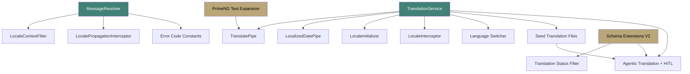

# i18n Infrastructure Backlog

**Status:** 0 / 15 components built (0%) — Updated per stakeholder feedback (v2.0)

---

## Backend Components (4)

### 1. MessageResolver
- **File:** `backend/common/src/main/java/com/ems/common/i18n/MessageResolver.java`
- **Status:** [PLANNED]
- **Purpose:** Wraps Spring `MessageSource` with locale-aware fallback chain
- **Behavior:**
  - `resolve(code, locale, args...)` → localized message string
  - Fallback: requested locale → default locale → raw code
  - Uses `.properties` files per service (not Feign call to localization-service)
- **Why local files, not API:** Error messages during auth/startup can't depend on another service

### 2. LocaleContextFilter
- **File:** `backend/common/src/main/java/com/ems/common/i18n/LocaleContextFilter.java`
- **Status:** [PLANNED]
- **Purpose:** Servlet filter that reads `Accept-Language` header → sets `LocaleContextHolder`
- **Registration:** Auto-configured via `@Component` + `@Order(Ordered.HIGHEST_PRECEDENCE + 10)`

### 3. LocalePropagationInterceptor
- **File:** `backend/common/src/main/java/com/ems/common/i18n/LocalePropagationInterceptor.java`
- **Status:** [PLANNED]
- **Purpose:** Feign `RequestInterceptor` that copies `Accept-Language` from current thread to outgoing calls
- **Impact:** All Feign clients automatically propagate locale (auth-facade → license-service, etc.)

### 4. Error Code Constants (per service)
- **Pattern:** `{Service}ErrorCodes.java` in each service
- **Status:** [PLANNED]
- **Convention:** `{SERVICE}-{TYPE}-{SEQ}` (e.g., `AUTH-E-010`, `LOC-V-001`)

---

## Frontend Components (8)

### 5. TranslationService
- **File:** `frontend/src/app/core/i18n/translation.service.ts`
- **Status:** [PLANNED]
- **API:**
  ```typescript
  // Signals
  readonly currentLocale: Signal<string>;
  readonly direction: Signal<'ltr' | 'rtl'>;
  readonly isLoading: Signal<boolean>;

  // Methods
  t(key: string, params?: Record<string, string>): string;
  setLocale(code: string): Promise<void>;
  detectLocale(): Promise<string>;
  ```
- **Bundle source:** `GET /api/v1/locales/{code}/bundle` via ApiGatewayService
- **Cache:** Memory Signal + IndexedDB (offline fallback) + static JSON (last resort)
- **Polling:** Check `/bundle/version` every 5 minutes; re-fetch if version changed

### 6. TranslatePipe
- **File:** `frontend/src/app/core/i18n/translate.pipe.ts`
- **Status:** [PLANNED]
- **Usage:** `{{ 'auth.login.welcome' | translate }}` or `{{ 'key' | translate:{ name: 'value' } }}`
- **Fallback:** Returns raw key if not found in bundle

### 7. LocalizedDatePipe
- **File:** `frontend/src/app/core/i18n/localized-date.pipe.ts`
- **Status:** [PLANNED]
- **Usage:** `{{ date | localizedDate:'mediumDate' }}`
- **Behavior:** Wraps Angular `DatePipe`, automatically injects locale from `TranslationService.currentLocale`

### 8. LocaleInitializer (APP_INITIALIZER)
- **File:** `frontend/src/app/core/i18n/locale-initializer.ts`
- **Status:** [PLANNED]
- **Sequence:**
  1. Check stored preference (IndexedDB or localStorage)
  2. If none: call `GET /api/v1/locales/detect` with browser `Accept-Language`
  3. Fetch bundle for detected locale
  4. Set `document.documentElement.dir` and `lang` attributes
  5. If backend unreachable: load `assets/i18n/en-US.json`

### 9. LocaleInterceptor
- **File:** `frontend/src/app/core/i18n/locale.interceptor.ts`
- **Status:** [PLANNED]
- **Purpose:** Angular HTTP interceptor that adds `Accept-Language: {currentLocale}` to ALL outgoing requests
- **Registration:** `provideHttpClient(withInterceptors([localeInterceptor]))`

### 10. Language Switcher Component
- **File:** `frontend/src/app/shared/components/language-switcher/language-switcher.component.ts`
- **Status:** [PLANNED]
- **Design:** Matches existing island button style (44x44 circular, neumorphic shadow)
- **Behavior:**
  - Shows current locale flag emoji + code (e.g., "EN")
  - Click opens dropdown with active locales (flag + native name)
  - Selection calls `TranslationService.setLocale()` + `PUT /api/v1/user/locale`
  - For unauthenticated: stores in localStorage, no API call
- **Placement:** Shell header (authenticated), login page footer (unauthenticated)

### 11. Seed Translation Files
- **Files:**
  - `frontend/src/assets/i18n/en-US.json` — All 652 keys with English values
  - `frontend/src/assets/i18n/ar-AE.json` — Same keys, Arabic values (initially empty, populated via AI or manual)
- **Status:** [PLANNED]
- **Purpose:** Static fallback when backend unreachable; also used as source of truth for key registration

### 12. Agentic Translation Integration (with HITL)
- **File:** `frontend/src/app/features/administration/sections/master-locale/agentic-translation/`
- **Status:** [PLANNED]
- **Components:**
  - `agentic-translation-panel.component.ts` — AI translation request + HITL review panel
  - Two sections: (1) Auto-applied summary (unambiguous terms → ACTIVE), (2) HITL review table (ambiguous terms → PENDING_REVIEW)
  - HITL review shows: source text, AI translation, ambiguity reason, approve/reject buttons
  - No bulk accept for high-confidence — auto-applied terms don't need review
  - Integrates with ai-service for LLM translation
- **API:**
  - `POST /api/v1/admin/dictionary/ai-translate` — Request AI translation for missing keys
  - Request: `{ targetLocale: "ar-AE", sourceLocale: "en-US", keys: ["key1", "key2"] }`
  - Response: `{ autoApplied: [...], pendingReview: [{ key, source, translation, confidence, ambiguityReason }] }`
  - `PUT /api/v1/admin/dictionary/translations/review` — Approve/reject HITL items (status update)

### 13. Translation Status Filter
- **File:** `backend/localization-service/src/main/java/com/ems/localization/service/DictionaryService.java` (modify existing)
- **Status:** [PLANNED]
- **Purpose:** Bundle generation query filters `WHERE status = 'ACTIVE'` to exclude PENDING_REVIEW and REJECTED translations
- **Behavior:** Only ACTIVE translations appear in bundles served to end users

### 14. Schema Extensions Migration
- **File:** `backend/localization-service/src/main/resources/db/migration/V2__schema_extensions.sql`
- **Status:** [PLANNED]
- **Changes:**
  - Add `translator_notes TEXT` to `dictionary_entries`
  - Add `max_length INTEGER` to `dictionary_entries`
  - Add `tags VARCHAR[]` to `dictionary_entries`
  - Add `status VARCHAR(20) DEFAULT 'ACTIVE'` to `dictionary_translations`
  - Update existing rows: `UPDATE dictionary_translations SET status = 'ACTIVE' WHERE status IS NULL`

### 15. PrimeNG Text Expansion Fixes
- **Files:** Multiple SCSS files
- **Status:** [PLANNED]
- **Changes:**
  - `master-locale-section.component.scss:64` — Search input: `width: 280px` → `min-width: 280px; width: 100%; max-width: 400px`
  - `master-locale-section.component.scss:70-80` — Translation cell: `max-width: 200px` → `max-width: 300px` or `[resizableColumns]`
  - `master-locale-section.component.scss:~45` — Table: add `[scrollable]="true" scrollDirection="horizontal"`
  - `p-dialog` — Set `[style]="{ 'min-width': '480px', 'max-width': '90vw' }"`
  - `p-toast` — Set `[style]="{ 'max-width': '90vw' }"`

---

## Dependency Graph



**Critical path:** TranslationService must be built first — everything else depends on it. Schema Extensions (V2 migration) unblock HITL translation workflow.
