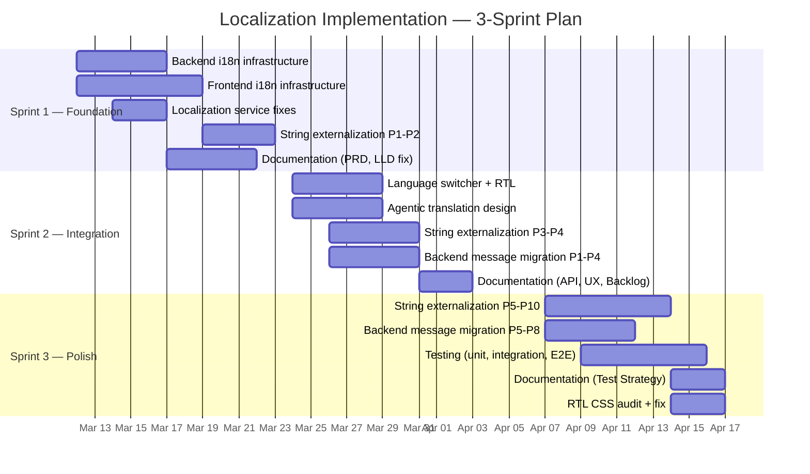

# Sprint Plan — Localization & i18n Implementation

**Version:** 1.0.0
**Date:** 2026-03-11

---

## Sprint Overview

---

## Sprint 1 — Foundation (63 SP)

### E1: Backend i18n Infrastructure (21 SP)

| Story | SP | Description | Files |
|-------|----|-------------|-------|
| E1-S1 | 5 | Create `MessageResolver` in backend/common wrapping Spring `MessageSource` with fallback chain | `backend/common/.../i18n/MessageResolver.java` |
| E1-S2 | 5 | Create `LocaleContextFilter` — servlet filter that reads `Accept-Language` and sets `LocaleContextHolder` | `backend/common/.../i18n/LocaleContextFilter.java` |
| E1-S3 | 5 | Create `LocalePropagationInterceptor` — Feign `RequestInterceptor` for inter-service locale forwarding | `backend/common/.../i18n/LocalePropagationInterceptor.java` |
| E1-S4 | 3 | Create error code constants class for localization-service | `backend/localization-service/.../ErrorCodes.java` |
| E1-S5 | 3 | Create `messages.properties` + `messages_ar.properties` for localization-service | `backend/localization-service/src/main/resources/messages*.properties` |

### E2: Frontend i18n Infrastructure (34 SP)

| Story | SP | Description | Files |
|-------|----|-------------|-------|
| E2-S1 | 8 | Create `TranslationService` — Signals-based service that fetches bundles, caches in memory + IndexedDB, exposes `t()` method | `frontend/src/app/core/i18n/translation.service.ts` |
| E2-S2 | 3 | Create `TranslatePipe` — Angular pipe wrapping `TranslationService.t()` | `frontend/src/app/core/i18n/translate.pipe.ts` |
| E2-S3 | 3 | Create `LocalizedDatePipe` — wraps DatePipe with automatic locale from TranslationService | `frontend/src/app/core/i18n/localized-date.pipe.ts` |
| E2-S4 | 5 | Create `APP_INITIALIZER` locale bootstrap — detect, fetch bundle, set dir/lang attributes | `frontend/src/app/core/i18n/locale-initializer.ts` |
| E2-S5 | 3 | Create `LocaleInterceptor` — HTTP interceptor adding `Accept-Language` to all requests | `frontend/src/app/core/i18n/locale.interceptor.ts` |
| E2-S6 | 5 | Create seed `en-US.json` with all 652 extracted strings | `frontend/src/assets/i18n/en-US.json` |
| E2-S7 | 2 | Create placeholder `ar-AE.json` with same keys, Arabic TBD | `frontend/src/assets/i18n/ar-AE.json` |
| E2-S8 | 5 | Register TranslatePipe, LocalizedDatePipe, interceptor, initializer in app.config.ts | `frontend/src/app/app.config.ts` |

### E3: Localization Service Fixes (8 SP)

| Story | SP | Description | Files |
|-------|----|-------------|-------|
| E3-S1 | 2 | Fix GW-03: Change `/api/v1/user/locale**` to `/api/v1/user/locale` | `backend/api-gateway/.../RouteConfig.java:33` |
| E3-S2 | 3 | Add INF-01: `@Scheduled` version retention cleanup (keep 50 latest) | `backend/localization-service/.../DictionaryService.java` |
| E3-S3 | 3 | Add SEC-04: CSV injection validation + 10MB file size limit | `backend/localization-service/.../DictionaryService.java` |

---

## Sprint 2 — Integration (95 SP)

### E4: Frontend String Externalization P1-P4 (21 SP)

| Story | SP | Scope | String Count |
|-------|----|-------|-------------|
| E4-S1 | 5 | P1: Login + auth pages | ~25 strings |
| E4-S2 | 3 | P2: Shell layout + error pages | ~15 strings |
| E4-S3 | 5 | P3: Administration page chrome | ~20 strings |
| E4-S4 | 8 | P4: Master Locale section | ~40 strings |

### E5: Backend Message Migration P1-P4 (13 SP)

| Story | SP | Service | String Count |
|-------|----|---------|-------------|
| E5-S1 | 2 | localization-service | 11 strings |
| E5-S2 | 5 | auth-facade | 38 strings |
| E5-S3 | 3 | license-service (partial: controllers) | ~10 strings |
| E5-S4 | 3 | tenant-service (partial: state errors) | ~10 strings |

### E6: Language Switcher & RTL (13 SP)

| Story | SP | Description | Files |
|-------|----|-------------|-------|
| E6-S1 | 5 | Create language switcher component (dropdown with flag + native name, matching island button style) | `frontend/src/app/shared/components/language-switcher/` |
| E6-S2 | 3 | Add language switcher to shell-layout header (authenticated) | `frontend/src/app/layout/shell-layout/` |
| E6-S3 | 5 | Add language switcher to login page (unauthenticated) + RTL document dir switching | `frontend/src/app/features/auth/login.page.*` |

### E7: Agentic Translation with HITL (18 SP)

| Story | SP | Description |
|-------|----|-------------|
| E7-S1 | 5 | Design agentic translation API contract (request LLM translation for missing keys per locale) |
| E7-S2 | 5 | Create AI translation review UI — auto-applied summary + HITL review table for ambiguous terms |
| E7-S3 | 3 | Add placeholder integrity validation (ensure `{param}` tokens preserved in AI translations) |
| E7-S4 | 3 | Add translation status (ACTIVE/PENDING_REVIEW/REJECTED) to dictionary_translations + bundle filter |
| E7-S5 | 2 | Add ambiguity detection logic — agent classifies multi-meaning terms for HITL |

### E12: Schema Extensions (8 SP)

| Story | SP | Description |
|-------|----|-------------|
| E12-S1 | 3 | Add `translator_notes`, `max_length`, `tags` columns to `dictionary_entries` (migration V2) |
| E12-S2 | 3 | Add `status` column to `dictionary_translations` (ACTIVE/PENDING_REVIEW/REJECTED, default ACTIVE) |
| E12-S3 | 2 | Update bundle generation query to filter `WHERE status = 'ACTIVE'` |

### E13: PrimeNG Text Expansion Fixes (5 SP)

| Story | SP | Description |
|-------|----|-------------|
| E13-S1 | 2 | Fix 5 CSS constraints in master-locale-section.component.scss (280px input, 200px cell, 60rem table, 480px dialog, 460px brand island) |
| E13-S2 | 2 | Configure PrimeNG locale strings (`providePrimeNG({ translation })`) for paginator, file upload, confirm dialog labels |
| E13-S3 | 1 | Set `max-width: 90vw` on p-toast and p-dialog for long translated messages |

### E14: Translation Reflection Flow (5 SP)

| Story | SP | Description |
|-------|----|-------------|
| E14-S1 | 3 | Add bundle version polling to TranslationService (poll `/bundle/version` every 5 min, re-fetch on mismatch) |
| E14-S2 | 2 | Add immediate bundle re-fetch after admin save/import/rollback operations |

### E15: Tenant Translation Overrides (13 SP)

| Story | SP | Description |
|-------|----|-------------|
| E15-S1 | 3 | V3 migration (`tenant_translation_overrides` table) + JPA entity + repository |
| E15-S2 | 3 | `TenantOverrideService` (CRUD + validation + tenant isolation) |
| E15-S3 | 2 | `TenantOverrideController` (5 REST endpoints: list, create/update, delete, import, export) |
| E15-S4 | 3 | `BundleService` merge logic — global + tenant overrides + tenant-scoped caching |
| E15-S5 | 2 | Admin UI: "Tenant Overrides" sub-tab (key, global value, override value, locale, actions) |

### E11-part: Documentation (4 SP)

| Story | SP | Document |
|-------|----|----------|
| E11-S3 | 2 | API Contract (06-API-Contract.md) + openapi.yaml |
| E11-S4 | 2 | UI/UX Design Spec (05-UI-UX-Design-Spec.md) |

---

## Sprint 3 — Polish (51 SP)

### E8: Frontend String Externalization P5-P10 (18 SP)

| Story | SP | Scope | String Count |
|-------|----|-------|-------------|
| E8-S1 | 3 | P5: License Manager | ~25 strings |
| E8-S2 | 5 | P6: Tenant Manager | ~55 strings |
| E8-S3 | 3 | P7: Master Definitions | ~50 strings |
| E8-S4 | 2 | P8: Master Auth | ~10 strings |
| E8-S5 | 2 | P9: About page | ~15 strings |
| E8-S6 | 3 | P10: All remaining TS error messages | ~50 strings |

### E9: Backend Message Migration P5-P8 (8 SP)

| Story | SP | Service |
|-------|----|---------|
| E9-S1 | 2 | notification-service (7 strings) |
| E9-S2 | 1 | user-service (3 strings) |
| E9-S3 | 2 | ai-service (32 strings) |
| E9-S4 | 3 | definition-service DTOs (14 strings) + common DTOs (9 strings) |

### E10: Testing & QA (21 SP)

| Story | SP | Description |
|-------|----|-------------|
| E10-S1 | 3 | Execute existing 43 backend + 20 frontend tests |
| E10-S2 | 5 | Write Testcontainers integration tests (4 test classes) |
| E10-S3 | 5 | Write Playwright E2E tests (5 test suites for 4 tabs + switcher) |
| E10-S4 | 3 | Responsive tests (3 viewports) |
| E10-S5 | 5 | RTL CSS audit: find and fix physical CSS properties → logical properties |

### E11-part: Documentation (4 SP)

| Story | SP | Document |
|-------|----|----------|
| E11-S5 | 2 | Test Strategy (15-Test-Strategy.md) |
| E11-S6 | 2 | Playwright Test Plan (16-Playwright-Test-Plan.md) |

---

## Velocity & Capacity

| Sprint | Story Points | Stories | Focus |
|--------|-------------|---------|-------|
| S1 | 63 | 13 | Foundation — infrastructure that unblocks everything |
| S2 | 95 | 24 | Integration — user-facing features, HITL, schema extensions, text expansion, reflection, tenant overrides |
| S3 | 51 | 15 | Polish — remaining strings, testing, documentation |
| **Total** | **209** | **52** | |

---

## Definition of Done (Per Story)

- [ ] Code written and compiles
- [ ] Unit tests pass (80%+ coverage on new code)
- [ ] No hardcoded English strings in new/modified code
- [ ] Existing tests not broken
- [ ] Documentation updated if applicable
- [ ] SA conditions addressed if applicable
- [ ] Accessibility: all interactive elements have ARIA labels (via translate pipe)
- [ ] RTL: no physical CSS properties introduced
