# UI/UX Design Specification: Localization & i18n

**Product Name:** EMSIST Localization Management
**Version:** 4.0.0
**Date:** March 11, 2026
**Status:** [PLANNED] — Design spec updated: personas aligned with registry, tenant overrides sub-tab, Language Switcher design token compliance mandated
**Owner:** UX Agent

**Scope:** This document defines the complete UI/UX design for the Localization Management feature, including the existing 4-tab admin section enhancements, the language switcher component, the agentic translation panel, and the i18n runtime user experience. All designs follow the EMSIST neumorphic design system.

**Framework:** Angular 21+ with PrimeNG standalone components
**Design System:** EMSIST neumorphic design system (PrimeNG Aura preset with EMSIST neumorphic token overrides)

> **Existing Implementation Note:** The Master Locale section (4 tabs) is [IMPLEMENTED] in `frontend/src/app/features/administration/sections/master-locale/`. This spec defines enhancements and new components that extend the existing UI.

---

## Table of Contents

1. [Design System Tokens (Localization-Specific)](#1-design-system-tokens)
2. [Personas & RBAC-Driven Views](#2-personas--rbac-driven-views)
3. [Component Library](#3-component-library)
4. [Page Layouts & Wireframes](#4-page-layouts--wireframes)
5. [Responsive Breakpoints](#5-responsive-breakpoints)
6. [Accessibility (WCAG AAA)](#6-accessibility-wcag-aaa)
7. [Interaction Patterns](#7-interaction-patterns)
8. [Animation & Motion](#8-animation--motion)
9. [User Flows (Mermaid)](#9-user-flows)
10. [Persona Journey Maps](#10-persona-journey-maps)

---

## 1. Design System Tokens

**Status:** [PLANNED] — Extends existing `--adm-*` and `--tm-*` tokens

All localization-specific tokens inherit from the EMSIST neumorphic design system defined in:
- `frontend/src/app/features/administration/administration.tokens.scss` — `--adm-*`, `--tm-*`, `--bs-*`
- `frontend/src/styles.scss` — `--tp-*`, `--nm-*` global tokens
- `frontend/src/app/layout/shell-layout/shell-layout.component.scss` — Island button pattern

### 1.1 Color Palette (Inherited)

| Token | Value | Usage |
|-------|-------|-------|
| `--adm-primary` | `#428177` (Forest Green) | Active locale indicators, coverage bars, language switcher active |
| `--adm-primary-hover` | `#054239` (Forest Deep) | Hover states, focus rings |
| `--adm-danger` | `#6b1f2a` (Deep Umber) | Error banners, low coverage warnings, CSV injection alerts |
| `--adm-surface` | `#edebe0` (Wheat Light) | Card surfaces, tab backgrounds, dropdown panels |
| `--adm-text-strong` | `#3d3a3b` (Charcoal) | Primary text, translation values |
| `--tp-primary-light` / `--bs-color-accent` | `#b9a779` (Golden Wheat) | Secondary borders, RTL direction badge, dividers |

### 1.2 Localization-Specific Tokens

| Token | Value | Usage |
|-------|-------|-------|
| `--loc-coverage-high` | `rgba(66, 129, 119, 0.85)` | Coverage bar >80% |
| `--loc-coverage-medium` | `rgba(185, 167, 121, 0.85)` | Coverage bar 40-80% |
| `--loc-coverage-low` | `rgba(107, 31, 42, 0.65)` | Coverage bar <40% |
| `--loc-flag-size` | `24px` | Flag emoji display size |
| `--loc-rtl-badge-bg` | `rgba(185, 167, 121, 0.18)` | RTL direction badge background |
| `--loc-ai-confidence-high` | `rgba(66, 129, 119, 0.12)` | AI confidence >90% row bg |
| `--loc-ai-confidence-medium` | `rgba(185, 167, 121, 0.12)` | AI confidence 50-90% row bg |
| `--loc-ai-confidence-low` | `rgba(107, 31, 42, 0.08)` | AI confidence <50% row bg |

### 1.3 Typography

Inherits the EMSIST type scale. Localization-specific additions:

| Element | Font | Size | Weight | Usage |
|---------|------|------|--------|-------|
| Locale code | `--adm-font-code` | 0.8rem | 400 | `en-US`, `ar-AE` code display |
| Translation value | `--adm-font-brand` | 0.875rem | 400 | Dictionary translation text |
| RTL translation | `Noto Sans Arabic, Tahoma` | 0.875rem | 400 | Arabic/Hebrew translation inputs |
| Flag emoji | System | 1.5rem | — | Locale flag in tables and switcher |
| AI confidence | `--adm-font-code` | 0.75rem | 600 | Percentage display |

### 1.4 Spacing & Layout

| Token | Value | Usage |
|-------|-------|-------|
| Tab bar gap | `0.25rem` (4px) | Between tab buttons |
| Tab content padding | `1.5rem` (24px) | Content area padding |
| Table cell padding | `0.75rem 1rem` | Standard table cell |
| Language switcher size | `44px` min | Touch target (WCAG AAA) |
| Switcher dropdown gap | `0.5rem` (8px) | Between locale items in dropdown |
| Coverage bar height | `6px` | Thin progress indicator |
| Dialog min-width | `480px` | Edit translation dialog |

### 1.5 Shadow System (Inherited)

All neumorphic shadows use the existing dual-shadow system:

| Pattern | Tokens | Usage |
|---------|--------|-------|
| Island (raised) | `--adm-island-shadow` | Language switcher button, tab bar container |
| Card | `--tm-shadow-card` | Coverage report cards, format config panels |
| Inset (pressed) | `--tm-shadow-search-inset` | Search inputs, active tab indicator |
| Button bezel | `--adm-button-shadow-before` | Primary action buttons (Export, Confirm Import) |
| Dialog | `--adm-dialog-shadow` | Edit translation dialog, rollback confirmation |

---

## 2. Personas & RBAC-Driven Views

> **Registry compliance:** Personas reference the [EMSIST Persona Registry](../../persona/PERSONA-REGISTRY.md). See [PRD Section 2](01-PRD.md#2-personas) for full persona-to-registry mapping.

### 2.1 Persona Definitions

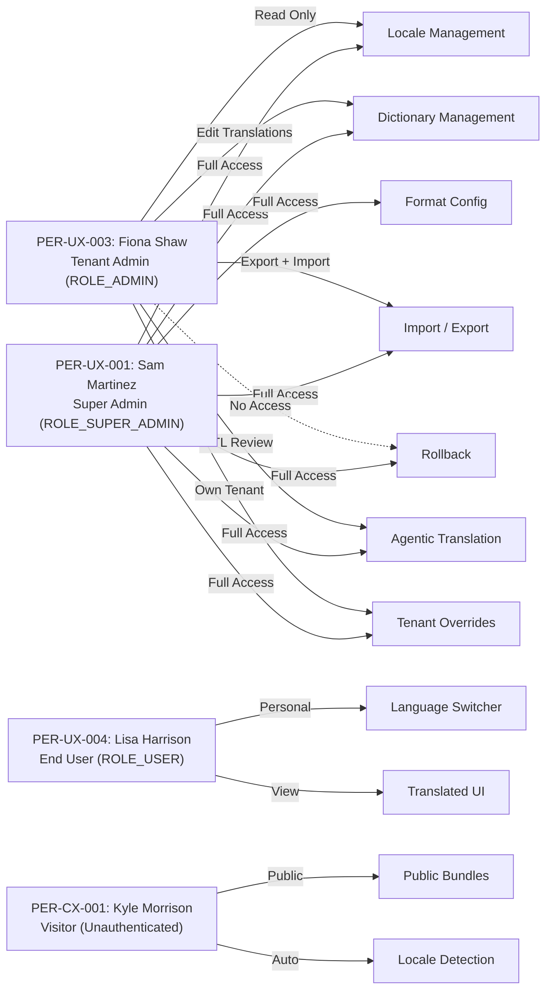

### 2.2 View Matrix by Persona

| Screen / Component | Super Admin | Tenant Admin | End User | Anonymous |
|---------------------|-------------|--------------|----------|-----------|
| **Languages tab** | Full CRUD (toggle active, set alternative) | Read-only table (no toggles) | Hidden | Hidden |
| **Dictionary tab** | Edit translations, add keys | Edit translations (manual + HITL review) | Hidden | Hidden |
| **Import/Export tab** | Full (upload CSV, export, preview, commit) | Full (upload CSV, export, preview, commit) | Hidden | Hidden |
| **Rollback tab** | Full (view versions, rollback) | View versions only (no rollback button) | Hidden | Hidden |
| **Format Config** | Edit calendar, numeral, currency, date format | View only | Hidden | Hidden |
| **Language Switcher** | In header + admin settings | In header | In header | On login page footer |
| **Agentic Translation** | Full (request AI, review HITL items, accept/reject) | Review HITL items, accept/reject flagged terms | Hidden | Hidden |
| **Coverage Report** | Full per-locale breakdown | View summary | Hidden | Hidden |

### 2.3 RBAC Enforcement in UI

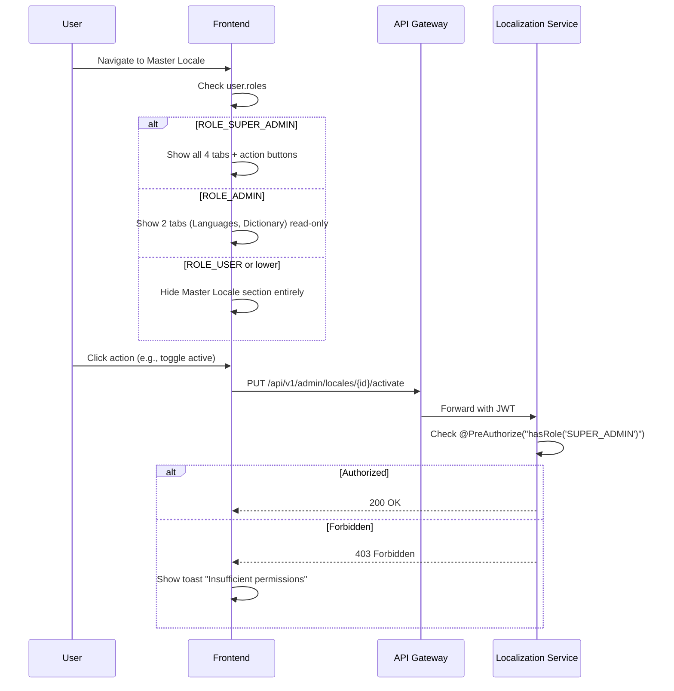

---

## 3. Component Library

### 3.1 Language Switcher Component [PLANNED]

**File:** `frontend/src/app/shared/components/language-switcher/language-switcher.component.ts`

The language switcher **MUST** match the existing **island button** style from the shell header. It is a **neighbor pill** inside the `.topnav.header-island` container and uses identical neumorphic treatment as the `topnav` buttons in [shell-layout.component.scss](frontend/src/app/layout/shell-layout/shell-layout.component.scss).

> **Design Compliance Mandate:** The Language Switcher component must not introduce any custom styling. All visual properties (background, border, border-radius, font, min-height, hover, focus, active states) must be inherited from or identical to the existing `.topnav a` CSS rules. Deviation from the neighbor button pattern is a design violation.

#### 3.1.1 Anatomy

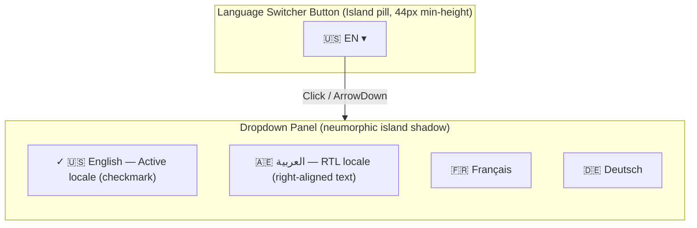

#### 3.1.2 Design Specifications — Neighbor Button Compliance

The following table maps every visual property to its **exact source** in [shell-layout.component.scss](frontend/src/app/layout/shell-layout/shell-layout.component.scss). The Language Switcher MUST NOT deviate from these values.

| Property | Value | Source (shell-layout SCSS) |
|----------|-------|---------------------------|
| **Container** | Inside `.topnav.header-island` flex container | `.topnav` — `display: flex; align-items: center; gap: 0.35rem` |
| **Button shape** | Pill (`border-radius: 999px`) | `.topnav a` — `border-radius: 999px` |
| **Min height** | `44px` | `.topnav a` — `min-height: 44px` (WCAG AAA touch target) |
| **Min width** | `64px` | Minimum for flag emoji (24px) + 2-char code + chevron |
| **Background** | `#edebe0` | `.topnav a` — `background: #edebe0` |
| **Border** | `1px solid #b9a779` (golden wheat) | `.topnav a` — `border: 1px solid #b9a779` |
| **Font** | `0.85rem`, weight `600` | `.topnav a` — `font-size: 0.85rem; font-weight: 600` |
| **Padding** | `0.42rem 0.8rem` | `.topnav a` — `padding: 0.42rem 0.8rem` |
| **Shadow** | None (flat, no individual shadow) | Consistent with all `.topnav a` buttons — shadow is on `.header-island` only |
| **Gap to neighbors** | `0.35rem` (5.6px) | `.topnav` — `gap: 0.35rem` |
| **Hover** | `background: var(--tp-primary) (#428177); color: #fff; border-color: var(--tp-primary)` | `.topnav a:hover` — forest green fill on hover |
| **Focus** | `outline: 3px solid #054239; outline-offset: 2px; background: var(--tp-primary); color: #fff` | `.topnav a:focus-visible` — deep forest focus ring |
| **Active state** | `background: linear-gradient(135deg, var(--tp-primary), var(--tp-primary-dark)); color: #fff; border-color: var(--tp-primary-dark)` | `.topnav a.active` — gradient active state |
| **Transition** | `all 0.2s ease` | `.topnav a` — `transition: all 0.2s ease` |
| **Content** | Flag emoji (24px) + locale code (uppercase, 2 chars) + chevron SVG (12px) | — |

**Island shadow (on parent container, NOT on button):**
```scss
// .header-island — the Language Switcher inherits this from its parent
box-shadow:
  6px 6px 16px rgba(152, 133, 97, 0.32),     // Dark shadow (bottom-right)
  -6px -6px 16px rgba(255, 255, 255, 0.92);  // Light shadow (top-left)
```

**Mobile responsive (`@media (max-width: 768px)`):**
```scss
.topnav a {
  font-size: 0.78rem;
  padding: 0.38rem 0.68rem;
}
```
On mobile, the Language Switcher moves into the hamburger menu as the last item before Sign Out, maintaining the same pill styling.

#### 3.1.3 Dropdown Panel

| Property | Value |
|----------|-------|
| **Background** | `#edebe0` |
| **Border** | `1px solid rgba(255, 255, 255, 0.42)` |
| **Border-radius** | `1rem` (`--adm-radius-card`) |
| **Shadow** | `--adm-island-shadow` (neumorphic dual-shadow) |
| **Max-height** | `320px` (scrollable if many locales) |
| **Item height** | `44px` min (touch target) |
| **Item padding** | `0.5rem 1rem` |
| **Item hover** | `background: rgba(66, 129, 119, 0.08)` |
| **Active item** | Checkmark icon + `color: var(--adm-primary)` |
| **RTL items** | `direction: rtl; text-align: right` for RTL locale names |
| **Animation** | Scale from 0.95 + fade in (150ms ease-out) |

#### 3.1.4 Placement

| Context | Position | Behavior |
|---------|----------|----------|
| **Authenticated (shell header)** | Inside `.topnav` island, after nav links, before Sign Out | Calls `PUT /api/v1/user/locale` to persist |
| **Login page (unauthenticated)** | Bottom of `.login-content`, centered | Stores in `localStorage`, no API call |
| **Mobile (< 768px)** | Collapses into hamburger menu as last item | Same dropdown behavior |

### 3.2 Enhanced Tab Bar [PLANNED]

The existing tab bar in `master-locale-section.component.scss` uses basic styling. The enhanced version adopts the neumorphic inset tab pattern from `--tm-shadow-tablist`.

#### 3.2.1 Specifications

| Property | Current | Enhanced |
|----------|---------|----------|
| Container | Flat with bottom border | Neumorphic inset (`--tm-shadow-tablist`) |
| Active tab | Bottom border highlight | Raised pill with `--tm-shadow-tab-active` |
| Background | Transparent | `var(--adm-surface)` |
| Border-radius | None | `0.72rem` per tab, `1rem` container |
| RBAC | Shows all 4 tabs | Conditionally renders tabs based on role |
| Tab icons | None | PrimeNG icons (pi-globe, pi-book, pi-upload, pi-history) |

#### 3.2.2 Tab Visibility by Role

| Tab | Icon | Super Admin | Tenant Admin | Others |
|-----|------|-------------|--------------|--------|
| Languages | `pi-globe` | Visible | Visible (read-only) | Hidden |
| Dictionary | `pi-book` | Visible | Visible (read-only) | Hidden |
| Import/Export | `pi-upload` | Visible | Export only | Hidden |
| Rollback | `pi-history` | Visible | View only | Hidden |
| AI Translate | `pi-sparkles` | Visible | View only | Hidden |

### 3.3 Coverage Bar Component [PLANNED]

A thin horizontal progress bar showing translation coverage per locale.

| Property | Value |
|----------|-------|
| Height | `6px` |
| Border-radius | `3px` |
| Background (track) | `rgba(152, 133, 97, 0.15)` |
| Fill >80% | `--loc-coverage-high` (Forest Green) |
| Fill 40-80% | `--loc-coverage-medium` (Golden Wheat) |
| Fill <40% | `--loc-coverage-low` (Deep Umber) |
| Label | `{percentage}%` right-aligned, `--adm-font-code`, 0.75rem |
| Animation | Width transition 400ms ease-out on load |

### 3.4 Format Config Panel [PLANNED]

An expandable panel in the Languages tab showing locale-specific format configuration.

| Property | Value |
|----------|-------|
| Trigger | Click row → expand accordion below row |
| Container | Neumorphic card (`--tm-shadow-card`) |
| Fields | Calendar system, Numeral system, Currency code, Date format, Time format |
| Inputs | PrimeNG Dropdown (calendar, numeral), InputText (currency), InputText with mask (date/time) |
| Save button | Neumorphic primary button matching `--adm-button-bezel-gradient` |

### 3.5 Agentic Translation Panel [PLANNED]

A new tab (5th) or a drawer panel accessible from the Dictionary tab. Updated per stakeholder decision: HITL review is only for **ambiguous terms** (words with multiple contextual meanings).

#### 3.5.1 Anatomy

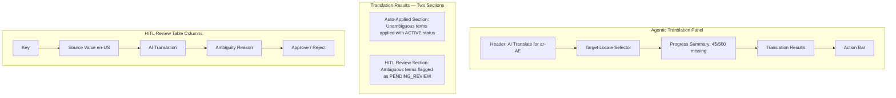

#### 3.5.2 Translation Flow

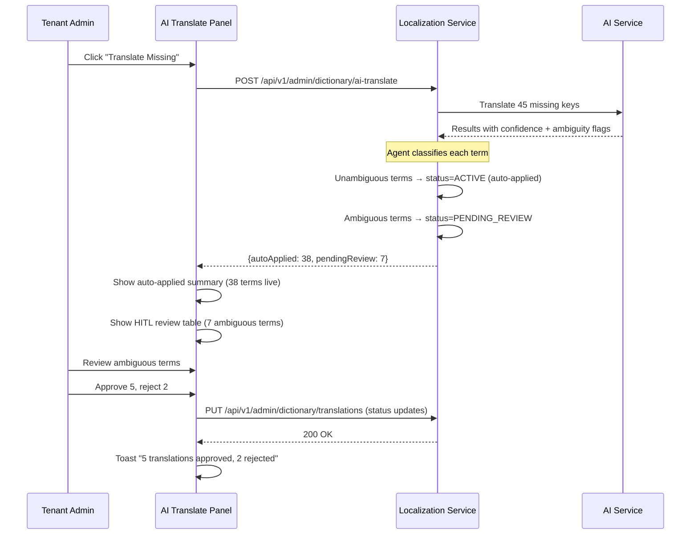

#### 3.5.3 Table Row Styling

| Row Type | Background | Badge Color | Badge Text |
|----------|------------|-------------|------------|
| Auto-applied (read-only summary) | `--loc-ai-confidence-high` | `--adm-primary` | "AUTO" |
| HITL: High confidence but ambiguous | `--loc-ai-confidence-medium` | `--bs-color-accent` | "REVIEW" |
| HITL: Low confidence + ambiguous | `--loc-ai-confidence-low` | `--adm-danger` | "REVIEW" |

#### 3.5.4 HITL Review Row Detail

Each HITL row shows **why** the term was flagged:

| Column | Content | Example |
|--------|---------|---------|
| Key | `dictionary.key` | `admin.nav.bank` |
| Source (en-US) | Original value | "Bank" |
| AI Translation | Suggested translation | "بنك" |
| Ambiguity Reason | Why flagged | "Multiple meanings: financial institution vs. river bank" |
| Approve / Reject | Action buttons | Approve applies ACTIVE; Reject applies REJECTED |

#### 3.5.5 Action Bar

| Button | Style | Label | Behavior |
|--------|-------|-------|----------|
| Approve Selected | Primary neumorphic | "Approve ({n})" | Sets selected HITL items to ACTIVE, included in bundle |
| Reject Selected | Secondary ghost | "Reject ({n})" | Sets selected to REJECTED; admin must re-translate manually |
| Approve All | Primary outline | "Approve All Pending" | Bulk approve all PENDING_REVIEW items |
| Translate Missing | Primary neumorphic | "Translate Missing" | Calls AI service for untranslated keys |

### 3.8 Tenant Override Sub-Tab [PLANNED]

**File:** `frontend/src/app/features/administration/sections/master-locale/tenant-overrides/tenant-overrides.component.ts`
**Visibility:** `ROLE_ADMIN` (Tenant Admin manages own tenant overrides) and `ROLE_SUPER_ADMIN`

#### 3.8.1 Anatomy

```mermaid
graph TD
    subgraph "Tenant Overrides Sub-Tab"
        TB[Toolbar: Search + Locale Filter + Add Override]
        OT[Override Table]
        PG[Paginator]
        IE[Import / Export Buttons]
    end

    subgraph "Override Table Columns"
        K[Key (technical_name)]
        GV[Global Value (struck-through)]
        OV[Override Value (highlighted)]
        LC[Locale Code]
        SRC[Source (MANUAL / IMPORTED)]
        ACT[Actions (Edit / Delete)]
    end
```

#### 3.8.2 Design Specifications

| Property | Value | Source |
|----------|-------|--------|
| **Table** | PrimeNG `p-table` with `[resizableColumns]="true"` | Matches Dictionary tab pattern |
| **Diff highlighting** | Global value shown in `text-decoration: line-through; opacity: 0.6` | — |
| **Override value** | `background: rgba(66, 129, 119, 0.08)` (subtle green tint) | `--adm-primary` at 8% opacity |
| **Empty state** | "No overrides for this tenant. Global translations are used for all keys." + "Add Override" button | — |
| **Add Override dialog** | Select key (autocomplete from dictionary_entries), select locale, enter override value | PrimeNG `p-dialog` matching §3.6 pattern |
| **Import/Export** | Same CSV pattern as §3.7 but scoped to tenant overrides | Matches import/export tab |

#### 3.8.3 RBAC

| Role | Permissions |
|------|------------|
| `ROLE_SUPER_ADMIN` | View + CRUD overrides for any tenant |
| `ROLE_ADMIN` | View + CRUD overrides for own tenant only (tenant_id from JWT) |
| `ROLE_USER` | Hidden |

### 3.6 Translation Edit Dialog (Enhanced) [PLANNED]

Enhances the existing `p-dialog` in [master-locale-section.component.html:156-176](frontend/src/app/features/administration/sections/master-locale/master-locale-section.component.html#L156-L176).

**PrimeNG text expansion fix:** Dialog uses `[style]="{ 'min-width': '480px', 'max-width': '90vw' }"` to accommodate translated titles (e.g., "Übersetzungen bearbeiten" is 45% longer than "Edit Translations").

| Enhancement | Description |
|-------------|-------------|
| **RTL input** | When editing RTL locale (ar-AE), input gets `dir="rtl"` and `text-align: right` |
| **Character count** | Shows `{current}/{max_length}` below each textarea (max_length from `dictionary_entries.max_length`, default 5000) |
| **Translator notes** | Read-only hint from `dictionary_entries.translator_notes` shown above input (e.g., "button label, keep short") |
| **Preview pane** | Toggle to show rendered translation with parameter substitution |
| **AI suggest** | Button to request AI translation for empty fields (if agentic enabled) |
| **Diff view** | When editing existing translation, show old value struck through |
| **Placeholder validation** | Highlight `{param}` tokens; warn if different from source locale |
| **Save behavior** | Saves with `status=ACTIVE` immediately — no approval workflow for manual edits |

### 3.7 Import Preview Card (Enhanced) [PLANNED]

Enhances the existing import preview in [master-locale-section.component.html:200-234](frontend/src/app/features/administration/sections/master-locale/master-locale-section.component.html#L200-L234).

| Enhancement | Description |
|-------------|-------------|
| **Visual summary** | Pie chart showing update/new/error breakdown |
| **Preview timer** | Shows "Preview expires in 28:42" countdown (30-min Valkey TTL) |
| **Error highlighting** | Rows with errors shown in `--loc-coverage-low` background |
| **Diff view** | Toggle to show changed values (old → new) side by side |
| **File info** | Shows filename, size, encoding, row count |

---

## 4. Page Layouts & Wireframes

### 4.1 Master Locale Section Layout

```mermaid
graph TD
    subgraph "Master Locale Section"
        TB[Tab Bar: Languages | Dictionary | Import/Export | Rollback | AI Translate]
        TB --> TC[Tab Content Area]

        subgraph "Languages Tab"
            ST[Search + Filter Toolbar]
            LT[Locale Table with Pagination]
            FC[Format Config Accordion]
        end

        subgraph "Dictionary Tab"
            DST[Search + Module Filter]
            DT[Dictionary Table with Dynamic Locale Columns]
            CB[Coverage Bar per Locale]
        end

        subgraph "Import/Export Tab"
            EX[Export Section: Download CSV]
            IM[Import Section: Upload + Preview + Commit]
        end

        subgraph "Rollback Tab"
            VT[Version History Table]
            VD[Version Detail Drawer]
        end

        subgraph "AI Translate Tab"
            ATP[Agentic Translation Panel]
        end
    end
```

### 4.2 Shell Header with Language Switcher

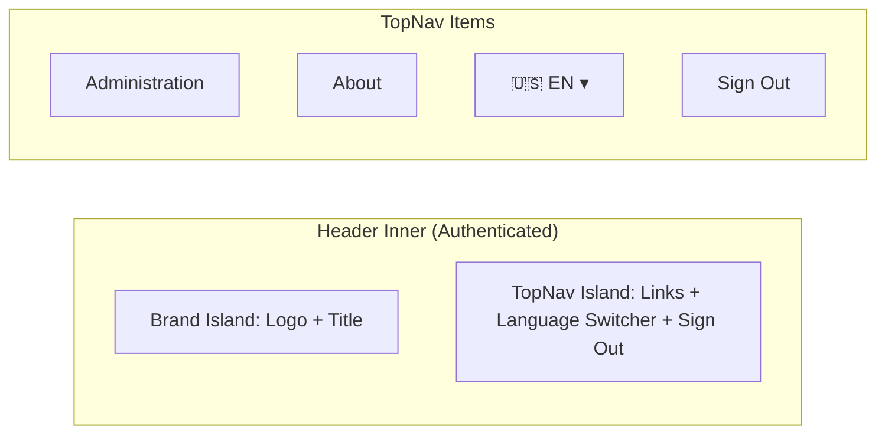

**Layout Rule:** The language switcher sits between the last navigation link and the Sign Out button. On mobile, it moves into the hamburger menu as the last item before Sign Out.

### 4.3 Login Page with Language Switcher

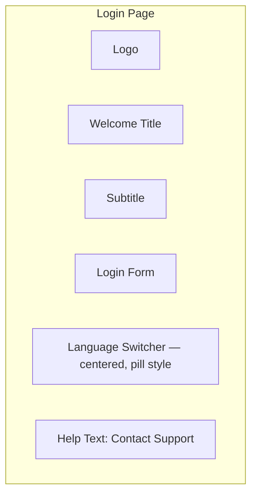

**Layout Rule:** Language switcher appears below the login form, centered, using the same pill button style but with a subtle variant (`opacity: 0.85`) to not compete with the primary Sign In button.

---

## 5. Responsive Breakpoints

### 5.1 Breakpoint Definitions

| Breakpoint | Width | Layout Changes |
|------------|-------|----------------|
| Desktop XL | >1200px | Full table view, side-by-side panels |
| Desktop | 1024-1200px | Standard layout, max-width: 1200px |
| Tablet | 768-1024px | Stacked layout, table scrolls horizontally |
| Mobile L | 480-768px | Single column, tabs become scrollable |
| Mobile S | <480px | Compact view, simplified tables |

### 5.2 Component Responsive Behavior

| Component | Desktop (>1024px) | Tablet (768-1024px) | Mobile (<768px) |
|-----------|-------------------|---------------------|-----------------|
| **Tab bar** | Horizontal pills, all visible | Horizontal, scrollable | Horizontal scroll, icon-only with tooltip |
| **Locale table** | All 7 columns | Horizontal scroll | Card view (stacked key-value pairs) |
| **Dictionary table** | All locale columns visible | Max 3 locale columns, scroll for rest | Card view with expansion |
| **Language switcher** | In topnav island | In topnav island | In hamburger menu |
| **Edit dialog** | `min-width: 480px` centered | `width: 90vw` | Full-screen bottom sheet |
| **Import preview** | Side panel | Below import area | Full-width card |
| **Coverage bar** | Inline with locale name | Below locale name | Full-width below card |
| **AI translate panel** | 3-column table (source, translation, actions) | 2-column (translation, actions) | Card view |
| **Format config** | Inline accordion below row | Slide-over panel | Full-screen bottom sheet |

### 5.3 Mobile Table → Card Transformation

On screens <768px, PrimeNG tables transform into stacked cards:

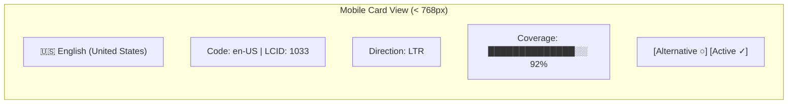

---

## 6. Accessibility (WCAG AAA)

### 6.1 Color Contrast Requirements

| Element | Foreground | Background | Ratio | Target |
|---------|-----------|------------|-------|--------|
| Primary text on surface | `#3d3a3b` | `#edebe0` | 7.8:1 | AAA (7:1) |
| Text on primary button | `#ffffff` | `#428177` | 4.6:1 | AA (4.5:1) |
| Error text on surface | `#6b1f2a` | `#edebe0` | 8.2:1 | AAA (7:1) |
| Muted text on surface | `rgba(61,58,59,0.72)` | `#edebe0` | 5.6:1 | AA (4.5:1) |
| Link text on surface | `#428177` | `#edebe0` | 4.1:1 | AA Large (3:1) |

### 6.2 Keyboard Navigation

| Component | Tab Order | Key Bindings |
|-----------|-----------|--------------|
| **Tab bar** | Tab to first tab, Arrow Left/Right between tabs | Enter/Space to activate tab |
| **Language switcher** | Tab to button | Enter/Space to open, Arrow Up/Down to navigate, Enter to select, Escape to close |
| **Locale table** | Tab through interactive cells (radio, toggle) | Space to toggle switch, Enter for radio |
| **Dictionary table** | Tab to edit button | Enter to open edit dialog |
| **Edit dialog** | Tab through locale inputs | Escape to cancel, Ctrl+Enter to save |
| **Import file picker** | Tab to Choose CSV button | Enter/Space to open file dialog |
| **Rollback button** | Tab to rollback button | Enter to open confirmation |
| **AI translate table** | Tab through accept/reject per row | Space to toggle selection, Enter to accept |

### 6.3 ARIA Requirements

| Component | ARIA Pattern | Attributes |
|-----------|-------------|------------|
| **Tab bar** | `tablist` + `tab` + `tabpanel` | `role="tablist"`, `aria-selected`, `aria-controls` |
| **Language switcher** | `listbox` dropdown | `role="listbox"`, `aria-expanded`, `aria-activedescendant` |
| **Active toggle** | Switch | `role="switch"`, `aria-checked`, `aria-label="Activate {locale}"` |
| **Alternative radio** | Radio group | `role="radiogroup"`, `aria-label="Alternative locale"` |
| **Coverage bar** | Progressbar | `role="progressbar"`, `aria-valuenow`, `aria-valuemin="0"`, `aria-valuemax="100"` |
| **Loading overlay** | Live region | `aria-live="polite"`, `aria-busy="true"` |
| **Error banner** | Alert | `role="alert"`, `aria-live="assertive"` |
| **Toast notifications** | Status | `role="status"`, `aria-live="polite"` |
| **Edit dialog** | Dialog | `role="dialog"`, `aria-modal="true"`, `aria-labelledby` |
| **Confirmation dialog** | Alert dialog | `role="alertdialog"`, `aria-modal="true"` |

### 6.4 RTL Support

| Property | LTR | RTL |
|----------|-----|-----|
| `document.documentElement.dir` | `"ltr"` | `"rtl"` |
| `document.documentElement.lang` | `"en-US"` | `"ar-AE"` |
| CSS logical properties | `margin-inline-start` | Flips automatically |
| Text alignment | `text-align: start` | Flips to right |
| Table column order | Left-to-right | Right-to-left |
| Chevron icons | Points right (▸) | Points left (◂) |
| Number formatting | `1,234.56` | `١٬٢٣٤٫٥٦` (if Hijri numerals) |
| Font stack | Gotham Rounded → Nunito | Noto Sans Arabic → Tahoma → Gotham Rounded |

### 6.5 Focus Management

| Scenario | Focus Target |
|----------|-------------|
| Tab switch | First interactive element in new tab panel |
| Dialog open | First input in dialog |
| Dialog close | Button that opened the dialog |
| Toast appears | Focus remains on current element (non-intrusive) |
| Error banner appears | Error banner dismiss button |
| Language switch | Language switcher button (stays on trigger) |
| File upload complete | Preview summary area |
| Rollback confirmation | Confirm button in dialog |

---

## 7. Interaction Patterns

### 7.1 Tab Switching

| Action | Response | Duration |
|--------|----------|----------|
| Click tab | Active tab changes, content fades in | 150ms ease-in |
| New tab content loads | Loading spinner in content area (not full page) | Until data arrives |
| Tab has no data | Empty state illustration + message | Immediate |

### 7.2 Language Switcher Interactions

| Action | Response |
|--------|----------|
| **Click button** | Dropdown opens with scale+fade animation (150ms) |
| **Select locale** | Dropdown closes, button updates to new flag+code, UI text updates without reload |
| **Click outside** | Dropdown closes |
| **Escape key** | Dropdown closes, focus returns to button |
| **RTL locale selected** | `document.dir` flips, all layouts mirror, transition 300ms |

### 7.3 Locale Toggle (Active/Inactive)

| Action | Response | Side Effect |
|--------|----------|-------------|
| **Toggle ON** | Switch animates to active, toast "Locale activated" | Locale appears in language switchers |
| **Toggle OFF (no users)** | Switch animates to inactive, toast "Locale deactivated" | Locale removed from switchers |
| **Toggle OFF (users affected)** | Confirmation dialog: "{n} users will be migrated to {alternative}" | Users migrated on confirm |
| **Toggle OFF (alternative)** | 409 error, toast "Cannot deactivate alternative locale" | Toggle reverts |
| **Toggle OFF (last active)** | 409 error, toast "Cannot deactivate the last active locale" | Toggle reverts |

### 7.4 Import Flow

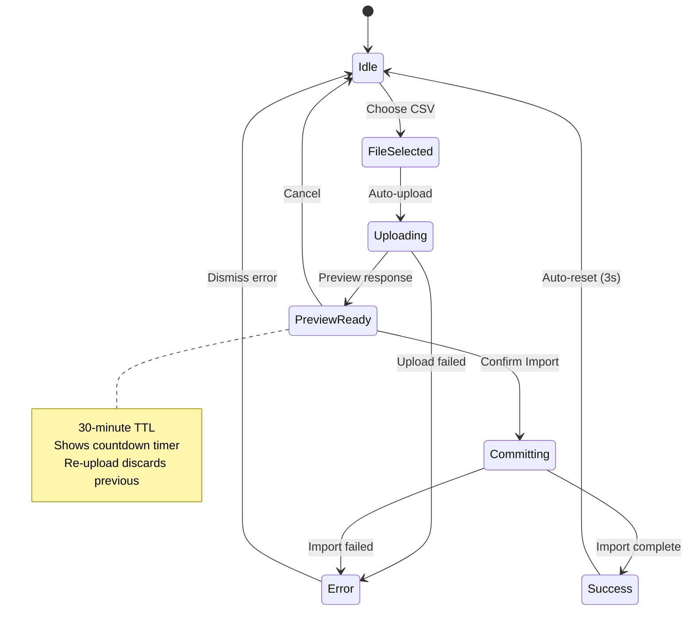

### 7.5 Rollback Confirmation

| Step | UI Element |
|------|-----------|
| 1. Click "Rollback" on version row | Confirmation dialog opens |
| 2. Dialog shows | "Rollback to version #{n}? This will create a pre-rollback snapshot and restore the dictionary to this state." |
| 3. User confirms | Loading state, then toast "Dictionary rolled back to version #{n}" |
| 4. Success | Version table refreshes, new snapshot version appears at top |

### 7.6 Dictionary Search

| Feature | Behavior |
|---------|----------|
| Debounce | 300ms after last keystroke |
| Search fields | `technical_name`, `module`, translation values |
| Highlight | Matched text highlighted with `--adm-primary` underline |
| Empty result | "No entries matching '{query}'" with clear button |
| Persistence | Search term preserved when switching tabs |

### 7.7 Toast Notification System

| Type | Icon | Background | Duration | Position |
|------|------|------------|----------|----------|
| Success | `pi-check-circle` | `--loc-coverage-high` | 3 seconds | Top-right |
| Warning | `pi-exclamation-triangle` | `--loc-coverage-medium` | 5 seconds | Top-right |
| Error | `pi-times-circle` | `--loc-coverage-low` | Persistent (manual dismiss) | Top-right |
| Info | `pi-info-circle` | `rgba(5, 66, 57, 0.1)` | 4 seconds | Top-right |

### 7.8 Translation Reflection [PLANNED]

| Scenario | UX Behavior | Implementation |
|----------|-------------|----------------|
| **Admin saves translation** | Toast "Translation saved". All `{{ key \| translate }}` pipes re-render in same session. | TranslationService re-fetches bundle after save; Signal update triggers pipe re-evaluation |
| **Admin commits CSV import** | Toast "Import complete: X updated, Y new". Bundle refreshed immediately. | Same as above — post-commit callback triggers bundle re-fetch |
| **Admin performs rollback** | Toast "Dictionary rolled back to version #N". Bundle refreshed immediately. | Same — post-rollback callback |
| **End user (passive)** | No visible indicator. Text updates silently within 5 minutes. | TranslationService polls `/bundle/version` every 5 min. On version mismatch, re-fetches and updates Signal. |
| **Backend unreachable during poll** | No error shown. Cached bundle continues to serve. Retry on next poll cycle. | TranslationService catches fetch error, logs warning, retries in 5 min |
| **Stale bundle on app resume** | User returns to tab after 30+ minutes. First poll detects stale bundle. | `visibilitychange` event triggers immediate version check when tab becomes visible |

---

## 8. Animation & Motion

### 8.1 Transition Specifications

| Animation | Duration | Easing | Trigger |
|-----------|----------|--------|---------|
| Tab content fade-in | 150ms | `ease-in` | Tab switch |
| Dropdown open | 150ms | `ease-out` | Switcher click |
| Dropdown close | 100ms | `ease-in` | Outside click / escape |
| Toggle switch | 200ms | `ease` | State change |
| Coverage bar fill | 400ms | `ease-out` | On data load |
| Dialog appear | 200ms | `ease-out` | Dialog open |
| Dialog dismiss | 150ms | `ease-in` | Cancel / close |
| RTL layout flip | 300ms | `ease-in-out` | Language change |
| Toast slide-in | 250ms | `ease-out` | Notification |
| Toast slide-out | 200ms | `ease-in` | Auto-dismiss |
| Button hover lift | 200ms | `ease` | Mouse enter |
| Table row highlight | 100ms | `linear` | Mouse enter |
| Import progress | Continuous | `linear` | During upload |
| Skeleton shimmer | 1.5s | `linear` infinite | Loading state |

### 8.2 Reduced Motion

When `prefers-reduced-motion: reduce`:
- All transitions set to 0ms
- Coverage bar appears at final width immediately
- Skeleton shimmer replaced with static gray
- Dropdown appears/disappears without animation
- RTL flip is instant

---

## 9. User Flows

### 9.1 Super Admin: Manage Locales

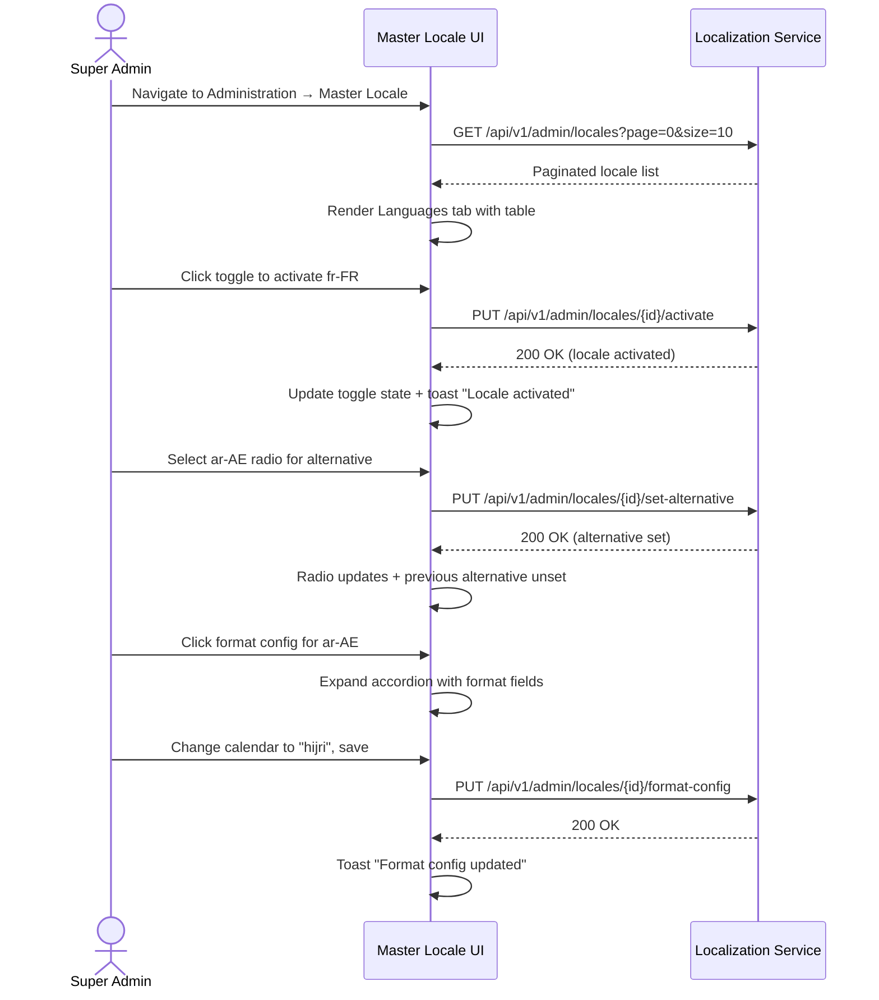

### 9.2 Admin: AI-Powered Translation with HITL

```mermaid
sequenceDiagram
    actor Admin as Super Admin / Tenant Admin
    participant UI as AI Translate Tab
    participant LS as Localization Service
    participant AI as AI Service

    Admin->>UI: Navigate to AI Translate tab
    Admin->>UI: Select target locale: ar-AE
    UI->>LS: GET /api/v1/admin/dictionary/coverage?locale=ar-AE
    LS-->>UI: {total: 500, translated: 455, missing: 45}

    Admin->>UI: Click "Translate Missing"
    UI->>LS: POST /api/v1/admin/dictionary/ai-translate
    Note over LS,AI: {targetLocale: "ar-AE", sourceLocale: "en-US", keys: [...45 keys]}
    LS->>AI: Request LLM translations
    AI-->>LS: Translations with confidence + ambiguity flags

    Note over LS: Agent classifies results
    LS->>LS: 38 unambiguous → status=ACTIVE (auto-applied, live in bundle)
    LS->>LS: 7 ambiguous → status=PENDING_REVIEW (excluded from bundle)
    LS-->>UI: {autoApplied: 38, pendingReview: 7, details: [...]}

    UI->>UI: Show summary: "38 translations auto-applied"
    UI->>UI: Render HITL review table (7 ambiguous terms)

    Admin->>UI: Review ambiguous terms with context reasons
    Admin->>UI: Approve 5 terms, reject 2 terms
    UI->>LS: PUT /api/v1/admin/dictionary/translations/review (bulk status update)
    LS->>LS: Approved → status=ACTIVE; Rejected → status=REJECTED
    LS-->>UI: 200 OK (snapshot created)
    UI->>UI: Toast "5 approved, 2 rejected — re-translate manually"
```

### 9.3 End User: Switch Language

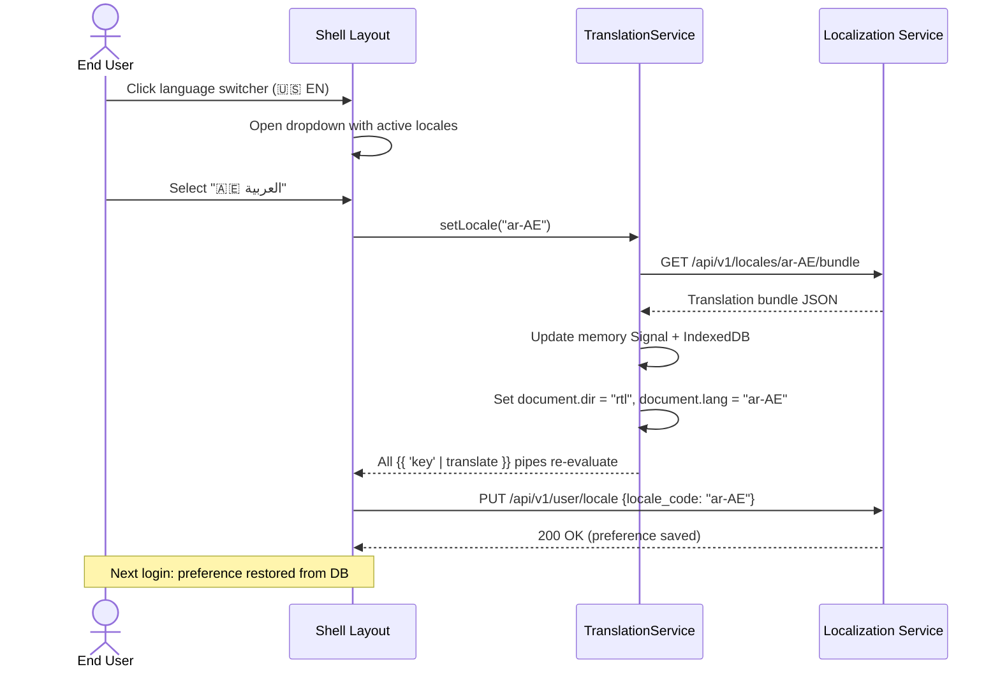

### 9.4 Anonymous: Login Page Locale Detection

```mermaid
sequenceDiagram
    actor AN as Anonymous User
    participant BR as Browser
    participant UI as Login Page
    participant TS as TranslationService
    participant API as Localization Service

    AN->>BR: Open login URL
    BR->>UI: Load login page
    UI->>TS: APP_INITIALIZER → detectLocale()

    alt Stored preference exists (localStorage)
        TS->>TS: Use stored locale code
    else No stored preference
        TS->>API: GET /api/v1/locales/detect
        Note over TS,API: Accept-Language: fr-FR,en;q=0.8
        API-->>TS: {detected: "fr-FR", active: true}
    end

    TS->>API: GET /api/v1/locales/fr-FR/bundle
    alt Backend reachable
        API-->>TS: Bundle JSON
    else Backend unreachable
        TS->>TS: Load assets/i18n/en-US.json (static fallback)
    end

    TS->>UI: Set dir, lang, render translated login page
    UI->>UI: Show language switcher at bottom
```

### 9.5 Tenant Admin: Manage Translation Overrides

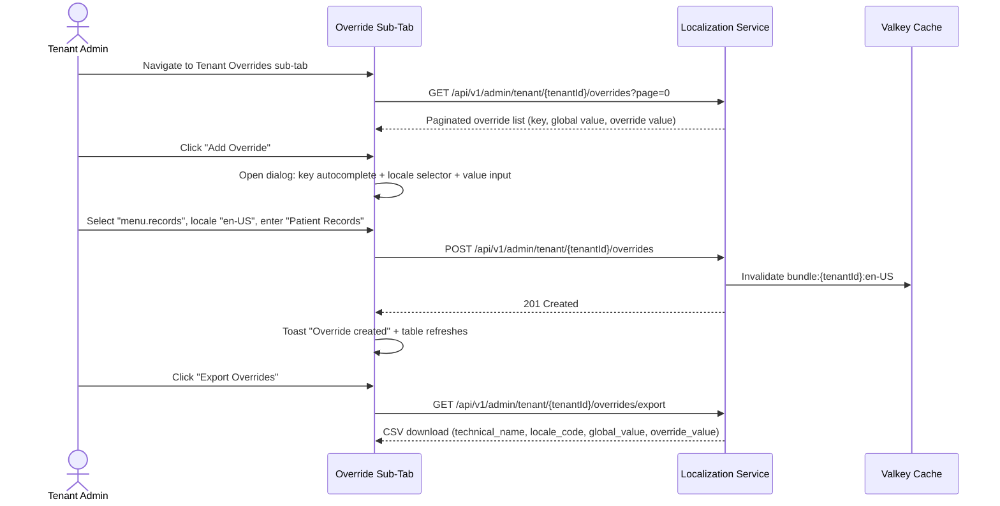

---

## 10. Persona Journey Maps

### 10.1 Super Admin: Full Localization Setup

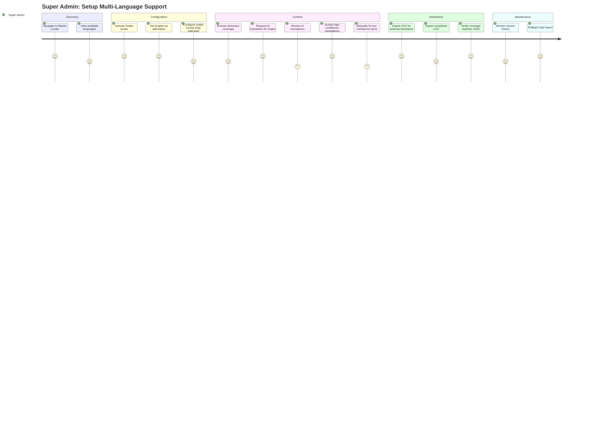

### 10.2 End User: Daily Multilingual Experience

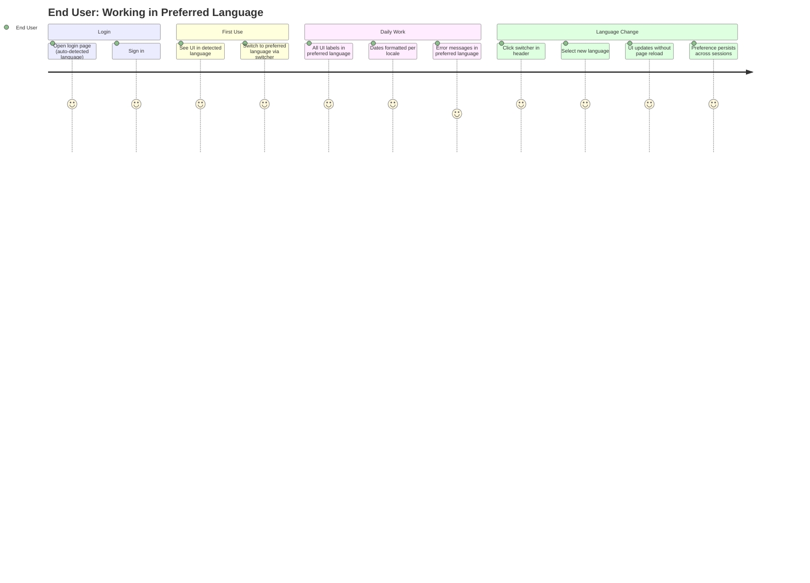

### 10.3 Tenant Admin: Translation Management

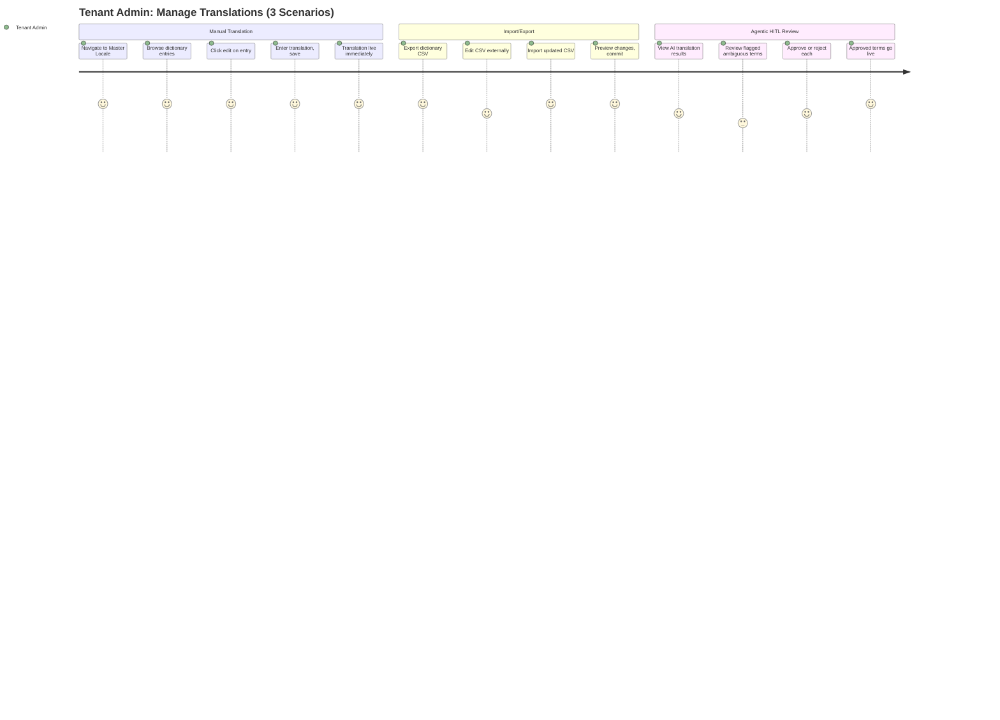

### 10.4 Tenant Admin: Override Management

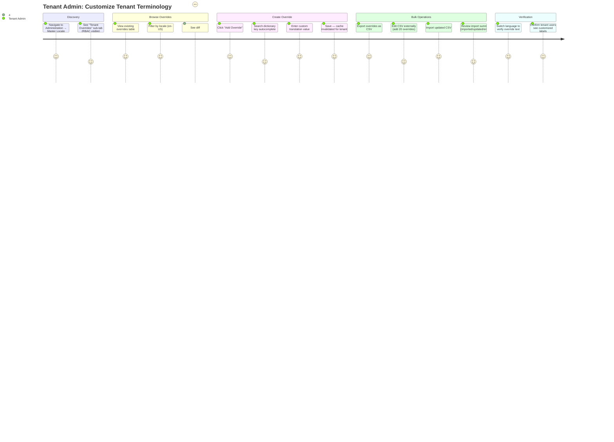

---

## Changelog

| Version | Date | Author | Changes |
|---------|------|--------|---------|
| 4.0.0 | 2026-03-11 | UX Agent | TOGAF alignment: §3.8 Tenant Override Sub-Tab (anatomy, RBAC, diff highlighting); §7.8 Translation Reflection interaction pattern; §9.5 Tenant Admin override user flow; §10.4 Tenant Admin override journey map |
| 2.0.0 | 2026-03-11 | UX Agent | Stakeholder feedback: Tenant Admin gets edit/import access; agentic panel updated for HITL-only-ambiguous; edit dialog adds translator_notes + max_length; PrimeNG text expansion fixes; journey maps updated for 3-scenario workflow |
| 1.0.0 | 2026-03-11 | UX Agent | Initial UI/UX Design Spec — language switcher, enhanced tabs, agentic translation, RBAC views, responsive, accessibility, user flows |
