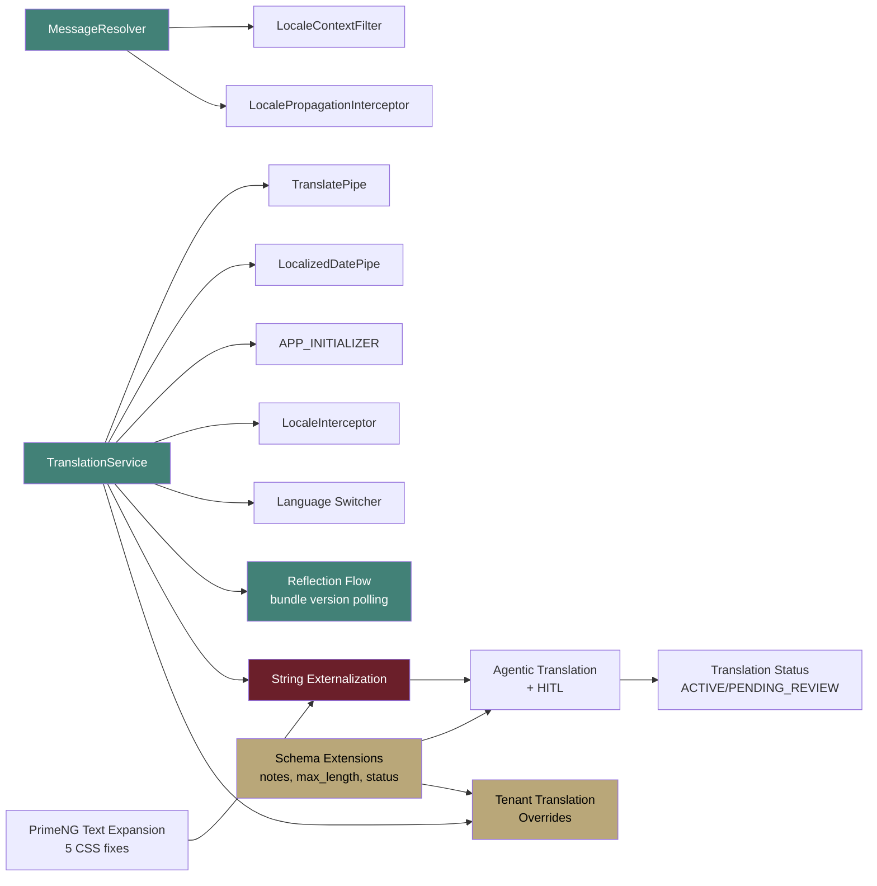

# Implementation Backlog: Localization & i18n

**Version:** 3.0.0
**Date:** March 11, 2026
**Status:** [IN-PROGRESS] — Service code-complete, i18n runtime [PLANNED], workflow decisions finalized, tenant overrides [PLANNED]
**Owner:** PM Agent

---

## 1. Backlog Index

This document serves as a quick reference to the detailed backlog files.

| Document | Location | Contents |
|----------|----------|----------|
| Frontend String Inventory | [01-Frontend-String-Inventory.md](../Backlog/01-Frontend-String-Inventory.md) | 652 hardcoded strings with i18n keys, P1-P10 priority |
| Backend String Inventory | [02-Backend-String-Inventory.md](../Backlog/02-Backend-String-Inventory.md) | 164 hardcoded strings per service with error codes |
| i18n Infrastructure Backlog | [03-i18n-Infrastructure-Backlog.md](../Backlog/03-i18n-Infrastructure-Backlog.md) | 12 components to build (4 backend + 8 frontend) |
| Sprint Plan | [04-Sprint-Plan.md](../Backlog/04-Sprint-Plan.md) | 3-sprint plan, 178 SP, 39 stories, 11 epics |
| Scenario Matrix | [05-Scenario-Matrix.md](../Backlog/05-Scenario-Matrix.md) | 28 happy, 9 alternative, 41 edge cases |

---

## 2. Implementation Status Dashboard

| Component | Status | Progress |
|-----------|--------|----------|
| localization-service (backend) | [IMPLEMENTED] | 100% |
| Admin UI (4-tab Master Locale) | [IMPLEMENTED] | 100% |
| AdminLocaleService (frontend) | [IMPLEMENTED] | 100% |
| API Gateway routes | [IMPLEMENTED] | 100% |
| Docker + init-db.sql | [IMPLEMENTED] | 100% |
| Backend unit tests (43) | [WRITTEN] | 0% executed |
| Frontend unit tests (65) | [EXECUTED] | 100% — 45 design system + 20 functional pass |
| Frontend design system tests (45) | [EXECUTED] | 100% — all pass (Vitest) |
| **TranslationService** | [PLANNED] | 0% |
| **TranslatePipe** | [PLANNED] | 0% |
| **LocalizedDatePipe** | [PLANNED] | 0% |
| **APP_INITIALIZER** | [PLANNED] | 0% |
| **LocaleInterceptor** | [PLANNED] | 0% |
| **Language Switcher** | [PLANNED] | 0% |
| **Seed Translation Files** | [PLANNED] | 0% |
| **Agentic Translation (with HITL)** | [PLANNED] | 0% |
| **Translation Status (ACTIVE/PENDING_REVIEW/REJECTED)** | [PLANNED] | 0% |
| **Translation Reflection Flow** | [PLANNED] | 0% |
| **Duplication Detection Flag** | [PLANNED — Next Release] | 0% |
| **Dictionary schema extensions** | [PLANNED] | 0% — translator_notes, max_length, tags, status |
| **PrimeNG Text Expansion Fixes** | [PLANNED] | 0% — 5 CSS constraints to fix |
| **Tenant Translation Overrides** | [PLANNED] | 0% — overlay pattern, V3 migration, 5 new endpoints |
| **MessageResolver (backend)** | [PLANNED] | 0% |
| **LocaleContextFilter** | [PLANNED] | 0% |
| **LocalePropagationInterceptor** | [PLANNED] | 0% |
| **String Externalization** | [PLANNED] | 0/816 (0%) |
| **SA Condition Fixes** | [PLANNED] | 0/3 code fixes |
| **Documentation** | [IN-PROGRESS] | 10/10 documents (v2.0 updates applied) |

---

## 3. Sprint Assignment Summary

| Sprint | Focus | Story Points | Stories |
|--------|-------|-------------|---------|
| **Sprint 1** | Foundation — backend + frontend i18n infrastructure, SA fixes | 63 SP | 13 |
| **Sprint 2** | Integration — language switcher, agentic translation, string externalization P1-P4, tenant overrides | 77 SP | 16 |
| **Sprint 3** | Polish — remaining strings P5-P10, testing, documentation | 51 SP | 15 |
| **Total** | | **191 SP** | **44** |

---

## 4. Critical Path

**Critical items:** TranslationService must be built first (frontend). MessageResolver must be built first (backend). String externalization (816 strings) is the largest effort. Schema extensions (translator_notes, max_length, status) unblock agentic HITL. Tenant translation overrides depend on TranslationService + Schema Extensions.

---

## Changelog

| Version | Date | Changes |
|---------|------|---------|
| 3.0.0 | 2026-03-11 | Added tenant translation overrides to dashboard + critical path; updated sprint 2 SP (64→77) and total (178→191); persona alignment with registry |
| 2.0.0 | 2026-03-11 | Stakeholder feedback: added HITL, translation status, reflection flow, schema extensions, PrimeNG text expansion, duplication detection; updated test counts; documentation complete |
| 1.0.0 | 2026-03-11 | Initial backlog index — links to 5 detailed backlog files |
