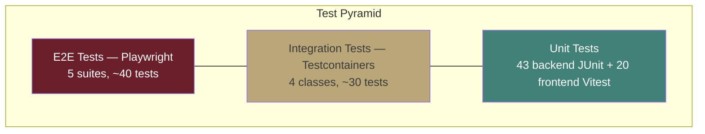

# Test Strategy: Localization & i18n

**Version:** 1.0.0
**Date:** March 11, 2026
**Status:** [IN-PROGRESS] — 63 tests written, NOT executed
**Owner:** QA Agent

---

## 1. Test Pyramid



---

## 2. Test Inventory

### 2.1 Backend Unit Tests (43 total) [WRITTEN, NOT EXECUTED]

| Test Class | Tests | Coverage |
|-----------|-------|----------|
| `LocaleServiceTest` | 12 | LocaleService: activate, deactivate, VR-02, VR-03, setAlternative, detect |
| `DictionaryServiceTest` | 15 | CRUD, import/export, preview/commit, rollback, rate limiting, snapshots |
| `FormatConfigServiceTest` | 5 | CRUD, locale association |
| `UserLocaleServiceTest` | 4 | Get/set preference, upsert semantics |
| `LocaleControllerTest` | 7 | HTTP status codes, request validation, admin vs public endpoints |

**Evidence:** Test files exist in `backend/localization-service/src/test/java/com/ems/localization/`

### 2.2 Frontend Unit Tests (20 total) [WRITTEN, NOT EXECUTED]

| Test File | Tests | Coverage |
|-----------|-------|----------|
| `master-locale-section.component.spec.ts` | 11 | Tab switching, locale search, toggle activation, edit dialog, import preview |
| `admin-locale.service.spec.ts` | 9 | API calls, signal state management, error handling |

**Evidence:** [master-locale-section.component.spec.ts](frontend/src/app/features/administration/sections/master-locale/master-locale-section.component.spec.ts), [admin-locale.service.spec.ts](frontend/src/app/features/administration/services/admin-locale.service.spec.ts)

**Framework:** Vitest 4.0.18 with Angular TestBed, `vi.fn()` mocks

### 2.3 Integration Tests [PLANNED]

| Test Class | Scope | Infrastructure |
|-----------|-------|----------------|
| `LocaleIntegrationTest` | Full CRUD + VR-02/VR-03 validation | PostgreSQL (Testcontainers) |
| `DictionaryIntegrationTest` | Snapshots, rollback, version integrity | PostgreSQL (Testcontainers) |
| `ImportExportIntegrationTest` | CSV round-trip, rate limiting | PostgreSQL + Valkey (Testcontainers) |
| `BundleIntegrationTest` | Bundle generation, cache invalidation | PostgreSQL + Valkey (Testcontainers) |

### 2.4 E2E Tests [PLANNED]

| Test Suite | Scenarios | Browser |
|-----------|-----------|---------|
| `languages.spec.ts` | View, search, activate, deactivate, set alternative, format config | Chromium, Firefox, WebKit |
| `dictionary.spec.ts` | Browse, search, edit translation, coverage report | Chromium, Firefox, WebKit |
| `import-export.spec.ts` | Export CSV, import preview, commit, error handling | Chromium |
| `rollback.spec.ts` | View versions, rollback, verify restoration | Chromium |
| `language-switcher.spec.ts` | Switch language, RTL flip, persist preference, anonymous | Chromium, Firefox |

---

## 3. Coverage Targets

| Layer | Line Coverage | Branch Coverage | Tool |
|-------|-------------|----------------|------|
| Backend unit | 80% | 75% | JaCoCo |
| Frontend unit | 80% | 75% | Vitest c8 |
| Integration | N/A (functional) | N/A | Testcontainers |
| E2E | N/A (scenario) | N/A | Playwright |

---

## 4. Test Environment Matrix

| Environment | Backend | Frontend | Database | Cache |
|-------------|---------|----------|----------|-------|
| **Local (dev)** | `mvn test -pl localization-service` | `npx vitest run` | H2 (unit), Testcontainers PostgreSQL (integration) | Testcontainers Valkey |
| **CI Pipeline** | Same as local | Same as local | Testcontainers | Testcontainers |
| **Staging** | Full docker-compose stack | Built Angular app | PostgreSQL 16 | Valkey 8 |

---

## 5. Test Data

### 5.1 Seed Data (from V1__init.sql)

- 10 system locales (en-US active + alternative, 9 inactive)
- No dictionary entries seeded (created via tests or admin UI)

### 5.2 Test Fixtures

| Fixture | Content | Used By |
|---------|---------|---------|
| `test-locales.json` | 10 locales with mixed active/inactive | Unit + Integration |
| `test-dictionary.csv` | 50 entries, 3 locales, includes edge cases (long values, RTL, emoji) | Import tests |
| `test-dictionary-malicious.csv` | CSV injection payloads (`=CMD`, `+cmd`, `-cmd`, `@sum`) | Security tests |
| `test-bundle.json` | Pre-computed bundle for en-US (100 entries) | Frontend unit tests |

---

## 6. Quality Gates

| Gate | Criteria | Blocks |
|------|----------|--------|
| Unit test pass | 100% of unit tests pass | PR merge |
| Coverage threshold | 80% line, 75% branch | PR merge |
| Integration test pass | All integration tests pass | Staging deploy |
| E2E test pass | All E2E scenarios pass | Release |
| Accessibility audit | Zero axe-core violations at AAA level | Release |
| Responsive test pass | Desktop + tablet + mobile viewports | Release |

---

## 7. Test Execution Commands

```bash
# Backend unit tests
cd backend && mvn test -pl localization-service

# Backend integration tests
cd backend && mvn verify -pl localization-service -Pintegration

# Frontend unit tests
cd frontend && npx vitest run src/app/features/administration/

# E2E tests
cd frontend && npx playwright test e2e/localization/

# Accessibility audit
cd frontend && npx playwright test e2e/localization/ --project=accessibility
```

---

## 8. Risk Areas

| Risk | Mitigation | Priority |
|------|-----------|----------|
| RTL layout breaks existing LTR components | CSS logical properties audit, dedicated RTL test viewport | HIGH |
| Bundle cache stale after rapid edits | Verify Valkey invalidation in integration tests | HIGH |
| CSV injection via import | Dedicated security test with malicious CSV payloads | CRITICAL |
| Concurrent admin edits causing data loss | Optimistic locking test with `@Version` conflicts | HIGH |
| IndexedDB unavailable in private browsing | Frontend unit test with IndexedDB mock failure | MEDIUM |
| Large bundle (>500 keys) performance | Load test with 1000-key bundle, measure fetch time | MEDIUM |

---

## Changelog

| Version | Date | Changes |
|---------|------|---------|
| 1.0.0 | 2026-03-11 | Initial test strategy — pyramid, inventory, coverage targets, quality gates |
