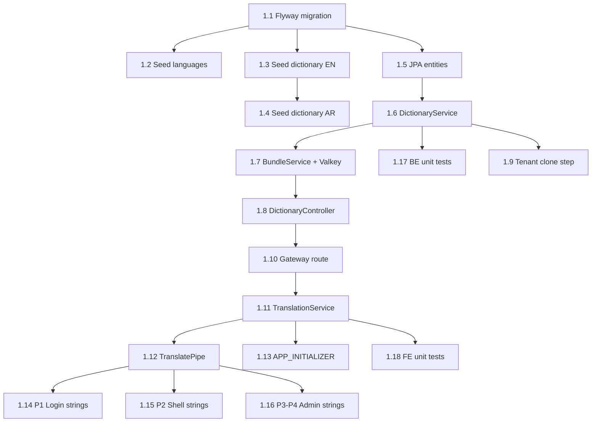
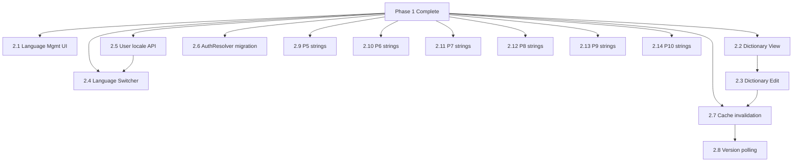
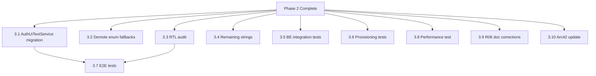

# R06 Implementation Plan v5: Unified Dictionary-Based Localization

**Version:** 5.0.0
**Date:** 2026-03-19
**Status:** [PLANNED]
**Owner:** Architecture Team
**ADR Reference:** [ADR-032](../../../Architecture/adr/ADR-032-unified-dictionary-localization.md)

---

## Overview

This plan supersedes all prior R06 sprint plans (including 04-Sprint-Plan.md and 11-Implementation-Backlog.md) which were based on the phantom localization-service architecture. This plan is grounded in the validated decisions documented in ADR-032 and operates exclusively within tenant-service and the Angular frontend.

**Scope:** 3 phases (1 sprint each), dictionary-based localization with no standalone service.

**Total Effort:** 36 stories, ~130 story points

---

## Mandatory Companion Contracts

This implementation plan does not define the final UI contract, design-system acceptance contract, Angular test matrix, or CI gate set on its own. The following four documents are mandatory execution references:

| Contract | Execution Role |
|----------|----------------|
| [`R06-UI-Spec-v5.md`](./R06-UI-Spec-v5.md) | Governs the frozen v5 Angular UI scope and component placement. |
| [`R06-Design-System-Validation-v5.md`](./R06-Design-System-Validation-v5.md) | Governs localization UI compliance against the actual EMSIST design-system rules and scripts. |
| [`R06-Angular-Test-Strategy-v5.md`](./R06-Angular-Test-Strategy-v5.md) | Governs required frontend unit/component spec files and behavior coverage. |
| [`R06-CI-Quality-Gates-v5.md`](./R06-CI-Quality-Gates-v5.md) | Governs CI checks and merge criteria for localization frontend work. |

Frontend stories in Phase 1 through Phase 3 are considered complete only when they satisfy these four companion contracts in addition to the story text in this plan.

---

## Phase 1: Foundation (Sprint 1)

**Goal:** Database schema, dictionary seeding, DictionaryResolver, bundle API, TranslationService, TranslatePipe, and initial string externalization (login + shell chrome).

**Duration:** 2 weeks
**Story Points:** ~50 SP

### Stories

| # | Story | SP | Layer | Priority |
|---|-------|----|-------|----------|
| 1.1 | Create Flyway migration V16: `dictionary`, `dictionary_translation`, `languages` tables in master_db | 3 | BE | P0 |
| 1.2 | Seed `languages` table with Google Workspace language codes (en, ar, fr, de, es, it, pt, ja, zh, hi) with direction and active flag. Only `en` and `ar` active by default | 2 | BE | P0 |
| 1.3 | Seed `dictionary` table with all 816 technical_names + English default_values, grouped by module (auth, shell, admin, common, etc.) | 8 | BE | P0 |
| 1.4 | Seed `dictionary_translation` table with Arabic translations for P1-P4 strings (~200 keys: auth, shell, admin chrome) | 5 | BE | P0 |
| 1.5 | Implement `DictionaryEntity`, `DictionaryTranslationEntity`, `LanguageEntity` JPA entities with repositories | 3 | BE | P0 |
| 1.6 | Implement `DictionaryService` with `resolve(technicalName, localeCode)` method and English fallback chain | 3 | BE | P0 |
| 1.7 | Implement `DictionaryBundleService` to assemble full bundle (all entries for a locale) with Valkey caching (`dict:bundle:{tenantId}:{locale}`, TTL 5 min) | 5 | BE | P0 |
| 1.8 | Implement `DictionaryController` with `GET /api/v1/dictionary/bundle?locale={code}` (public) and `GET /api/v1/dictionary/languages` (public, active languages only) | 3 | BE | P0 |
| 1.9 | Add `CLONE_DICTIONARY` step to tenant provisioning workflow: bulk-copy dictionary + dictionary_translation to tenant per-tenant database | 5 | BE | P1 |
| 1.10 | Add gateway route for `/api/v1/dictionary/**` to tenant-service in RouteConfig.java | 1 | BE | P0 |
| 1.11 | Implement `TranslationService` (Angular, Signals-based): fetch bundle on init, expose `translate(key, params?)`, `currentLocale` signal, `switchLocale(code)` method | 5 | FE | P0 |
| 1.12 | Implement `TranslatePipe` (pure pipe): `{{ 'auth.login.welcome' \| translate }}` and `{{ 'key' \| translate:params }}` with parameter interpolation | 2 | FE | P0 |
| 1.13 | Implement `APP_INITIALIZER` that loads translation bundle before app renders. Embed static EN fallback bundle for offline/failure scenarios | 3 | FE | P0 |
| 1.14 | Externalize P1 strings: Login page (~25 strings) -- replace hardcoded text with TranslatePipe | 3 | FE | P1 |
| 1.15 | Externalize P2 strings: Shell layout + header (~30 strings) -- navigation, breadcrumbs, user menu | 3 | FE | P1 |
| 1.16 | Externalize P3-P4 strings: Admin chrome + Administration page (~50 strings) | 5 | FE | P1 |
| 1.17 | Unit tests: DictionaryService, DictionaryBundleService, DictionaryController (JUnit 5 + Testcontainers) | 5 | BE | P1 |
| 1.18 | Unit tests: TranslationService, TranslatePipe (Vitest) | 3 | FE | P1 |

### Dependencies (Phase 1)

**Execution note:** Stories `1.11` through `1.18` must conform to [`R06-UI-Spec-v5.md`](./R06-UI-Spec-v5.md), [`R06-Design-System-Validation-v5.md`](./R06-Design-System-Validation-v5.md), [`R06-Angular-Test-Strategy-v5.md`](./R06-Angular-Test-Strategy-v5.md), and [`R06-CI-Quality-Gates-v5.md`](./R06-CI-Quality-Gates-v5.md).

**Critical path:** 1.1 -> 1.5 -> 1.6 -> 1.7 -> 1.8 -> 1.10 -> 1.11 -> 1.12 -> 1.14

### Risk Items (Phase 1)

| Risk | Impact | Likelihood | Mitigation |
|------|--------|------------|------------|
| Seeding 816 keys is error-prone | Medium | Medium | Generate seed SQL from string inventory docs (01-Frontend-String-Inventory.md, 02-Backend-String-Inventory.md); validate count in test |
| Existing V8-V15 migrations conflict with new V16 | High | Low | Test against clean DB and existing DB; Flyway checksum validation |
| TranslationService init blocks app rendering | High | Medium | Set 3s timeout on bundle fetch; fall back to embedded EN bundle |
| Arabic translations incomplete for P1-P4 | Low | Medium | Missing AR translations fall back to EN default_value transparently |

### Definition of Done (Phase 1)

- [ ] V16 migration runs clean on both fresh and existing databases
- [ ] `GET /api/v1/dictionary/bundle?locale=en` returns all 816 entries
- [ ] `GET /api/v1/dictionary/bundle?locale=ar` returns AR translations with EN fallback for missing keys
- [ ] `GET /api/v1/dictionary/languages` returns active languages (en, ar)
- [ ] TranslatePipe renders translated text in login page template
- [ ] App initializes with bundle; falls back to static EN on network failure
- [ ] Tenant provisioning creates dictionary copy in new tenant DB
- [ ] All unit tests pass: `mvn clean verify` (backend), `ng test` (frontend)
- [ ] Valkey cache hit confirmed via logs on second bundle fetch

---

## Phase 2: Admin UI + Full Externalization (Sprint 2)

**Goal:** Language management admin UI, dictionary editor, language switcher, complete string externalization, user locale preference, AuthLocalizedMessageResolver migration.

**Duration:** 2 weeks
**Story Points:** ~50 SP

### Stories

| # | Story | SP | Layer | Priority |
|---|-------|----|-------|----------|
| 2.1 | Language Management UI: table of languages with activate/deactivate toggle checkboxes. Admin endpoint `PUT /api/v1/admin/languages/{code}/activate` and `PUT .../deactivate` (ROLE_SUPER_ADMIN) | 5 | Full | P1 |
| 2.2 | Dictionary View UI: paginated table showing technical_name, module, EN value, and one editable locale column. Filter by module. Admin endpoint `GET /api/v1/admin/dictionary` (paginated) | 5 | Full | P1 |
| 2.3 | Dictionary Edit UI: inline edit or dialog for translation value per key+locale. Admin endpoint `PUT /api/v1/admin/dictionary/translations` (ROLE_SUPER_ADMIN). Restore-to-master button per entry | 5 | Full | P1 |
| 2.4 | Language Switcher component: dropdown in shell header, shows language name + code, persists selection to user profile. Requires UX approval for placement and style | 5 | FE | P1 |
| 2.5 | User locale preference API: `PUT /api/v1/users/me/locale` (authenticated). Updates user profile `locale` field. TranslationService reads user locale on init | 3 | Full | P1 |
| 2.6 | Modify `AuthLocalizedMessageResolver` to use DictionaryResolver for AUTH-L-* and AUTH-I-* codes (UI messages), keep existing path for AUTH-E-* (error codes) | 3 | BE | P1 |
| 2.7 | Valkey cache strategy: invalidate `dict:bundle:{tenantId}:{locale}` on dictionary edit. Admin edit -> immediate invalidation. Poll version endpoint for other users | 3 | BE | P1 |
| 2.8 | Bundle version polling: `GET /api/v1/dictionary/bundle/version?locale={code}` returns current version number. TranslationService polls every 5 min; re-fetches on mismatch | 3 | FE | P1 |
| 2.9 | Externalize P5 strings: User Management (~60 strings) | 3 | FE | P2 |
| 2.10 | Externalize P6 strings: License Management (~40 strings) | 2 | FE | P2 |
| 2.11 | Externalize P7 strings: Identity Providers (~50 strings) | 3 | FE | P2 |
| 2.12 | Externalize P8 strings: Tenant Manager + Branding (~80 strings) | 5 | FE | P2 |
| 2.13 | Externalize P9 strings: Master Definitions (~70 strings) | 3 | FE | P2 |
| 2.14 | Externalize P10 strings: Remaining shared components, dialogs, toasts (~200 strings) | 5 | FE | P2 |
| 2.15 | Unit tests: Language management, dictionary admin endpoints, user locale API (JUnit 5 + Testcontainers) | 3 | BE | P2 |
| 2.16 | Unit tests: Language switcher, dictionary admin UI components (Vitest) | 2 | FE | P2 |

### Dependencies (Phase 2)

**Execution note:** Stories `2.1` through `2.16` must implement only the v5 UI scope frozen by [`R06-UI-Spec-v5.md`](./R06-UI-Spec-v5.md). They must also satisfy [`R06-Design-System-Validation-v5.md`](./R06-Design-System-Validation-v5.md), [`R06-Angular-Test-Strategy-v5.md`](./R06-Angular-Test-Strategy-v5.md), and [`R06-CI-Quality-Gates-v5.md`](./R06-CI-Quality-Gates-v5.md).

**Critical path:** Phase 1 -> 2.2 -> 2.3 -> 2.7 -> 2.8

**Note:** String externalization stories (2.9-2.14) can proceed in parallel once Phase 1 TranslatePipe is available. They do not depend on admin UI.

### Risk Items (Phase 2)

| Risk | Impact | Likelihood | Mitigation |
|------|--------|------------|------------|
| Language switcher UX not approved in time | Medium | Medium | Implement with sensible default (PrimeNG dropdown in header island area); adjust after UX review |
| Dictionary admin UI scope creep (import, versioning, rollback) | High | Medium | Strictly out of scope per ADR-032. Admin can only view, edit, and restore individual entries |
| String externalization velocity lower than planned | Medium | High | P9-P10 can slip to Phase 3 without blocking release. P1-P8 are required |
| Cache invalidation race condition on concurrent edits | Low | Low | Optimistic locking on dictionary_translation (`updated_at` check); last write wins |

### Definition of Done (Phase 2)

- [ ] Super Admin can activate/deactivate languages in admin UI
- [ ] Super Admin can browse dictionary entries filtered by module
- [ ] Super Admin can edit a translation value and see it reflected in the UI
- [ ] Language switcher visible in shell header; selection persisted to user profile
- [ ] User locale preference round-trips: set locale -> refresh -> correct locale loaded
- [ ] AUTH-L-* and AUTH-I-* codes resolved through DictionaryResolver (verified by integration test)
- [ ] All P1-P8 strings externalized (verified: 0 hardcoded strings in those component templates)
- [ ] Bundle version polling verified: admin edits translation -> other user sees update within 5 min
- [ ] All unit tests pass

---

## Phase 3: Polish + Testing (Sprint 3)

**Goal:** Migrate AuthUiTextService to TranslationService, clean up hardcoded enum fallbacks, RTL audit, full test suite, performance testing, documentation correction.

**Duration:** 2 weeks
**Story Points:** ~30 SP

### Stories

| # | Story | SP | Layer | Priority |
|---|-------|----|-------|----------|
| 3.1 | Migrate `AuthUiTextService` consumers to use `TranslationService` directly. AuthUiTextService becomes a thin wrapper or is removed | 3 | FE | P1 |
| 3.2 | Demote `AuthProblemType` and `AuthUiMessageType` enum fallback strings to compile-time constants only (log warnings if enum fallback is hit in production) | 2 | BE | P2 |
| 3.3 | RTL audit for Arabic: verify all externalized pages render correctly in RTL. Fix CSS `dir="rtl"` issues in shell, admin, auth pages | 5 | FE | P1 |
| 3.4 | Externalize remaining P9-P10 strings if not completed in Phase 2 (~100 strings buffer) | 3 | FE | P2 |
| 3.5 | Integration tests: DictionaryController endpoints with Testcontainers (PostgreSQL + Valkey). Test bundle fetch, cache hit/miss, language activation | 5 | BE | P1 |
| 3.6 | Integration tests: Tenant provisioning dictionary clone step. Verify new tenant has complete dictionary copy | 3 | BE | P1 |
| 3.7 | E2E tests (Playwright): Login page in EN and AR, language switching, admin dictionary edit flow, shell navigation in AR | 5 | FE | P1 |
| 3.8 | Performance test: bundle fetch latency <200ms (cached), <500ms (uncached). Measure with 1000 entries, 2 locales | 2 | BE | P2 |
| 3.9 | Correct all R06 design documents: remove references to localization-service, fix broken evidence links, update data model doc to match actual schema | 3 | Doc | P1 |
| 3.10 | Update arc42 Section 8 (Crosscutting -- Internationalization) to reflect ADR-032 architecture | 2 | Doc | P1 |

### Dependencies (Phase 3)

**Critical path:** Phase 2 -> 3.1 + 3.3 -> 3.7

### Risk Items (Phase 3)

| Risk | Impact | Likelihood | Mitigation |
|------|--------|------------|------------|
| RTL issues more extensive than expected | Medium | High | Budget 5 SP for RTL; focus on critical paths (login, shell, admin). Non-critical RTL fixes can carry over |
| Removing AuthUiTextService breaks login flow | High | Low | Keep AuthUiTextService as deprecated thin wrapper initially; remove in subsequent release |
| Bundle fetch exceeds 200ms target | Medium | Low | Valkey cache should keep cached responses <10ms. Only uncached first-request is at risk; pre-warm cache on deployment |
| R06 document corrections reveal more misalignment | Low | Medium | Scope corrections to factual accuracy only; do not redesign documents |

### Definition of Done (Phase 3)

- [ ] `AuthUiTextService` fully migrated; login page uses TranslationService exclusively
- [ ] Enum fallback strings only hit when DictionaryResolver is unreachable (logged as WARNING)
- [ ] Login, shell, and admin pages render correctly in Arabic RTL (visual review + Playwright screenshot comparison)
- [ ] All 816 strings externalized: `grep` for hardcoded strings in templates returns 0 matches (excluding test fixtures)
- [ ] Backend integration tests pass with Testcontainers
- [ ] E2E tests pass: login EN, login AR, language switch, admin dictionary edit
- [ ] Bundle fetch <200ms (cached) confirmed by performance test
- [ ] R06 design documents corrected: no references to localization-service, all evidence links valid
- [ ] Arc42 Section 8 updated to reflect ADR-032

---

## Cross-Phase Summary

### Effort by Layer

| Layer | Phase 1 | Phase 2 | Phase 3 | Total |
|-------|---------|---------|---------|-------|
| Backend | 28 SP | 14 SP | 10 SP | 52 SP |
| Frontend | 14 SP | 28 SP | 11 SP | 53 SP |
| Full-stack | 0 SP | 13 SP | 0 SP | 13 SP |
| Documentation | 0 SP | 0 SP | 5 SP | 5 SP |
| Testing (dedicated) | 8 SP | 5 SP | 15 SP | 28 SP |
| **Total** | **50 SP** | **50 SP** | **30 SP** | **130 SP** |

### What Changes vs. Prior Plans

| Aspect | Prior Plan (04-Sprint-Plan.md) | This Plan (v5) |
|--------|-------------------------------|----------------|
| Service | Standalone localization-service | tenant-service extension |
| Database | localization_db (6+1 tables) | master_db (3 new tables) |
| Endpoints | 22 + 5 planned | ~8 new endpoints |
| Docker | Separate container + init-db | No new container |
| Gateway | 4 new routes to localization-service | 1 new route to tenant-service |
| Story points | 191 SP / 44 stories | 130 SP / 36 stories |
| Sprints | 3 sprints | 3 sprints |
| Import/export | In scope (Sprint 2) | Out of scope |
| AI translation | In scope (Sprint 2) | Out of scope |
| Versioning/rollback | In scope (Sprint 1) | Out of scope |

### Key Architectural Guardrails

1. **No new microservice.** All localization code goes in tenant-service.
2. **No new database.** Dictionary tables live in master_db alongside existing tenant tables.
3. **No breaking changes to message_registry.** Existing error code resolution remains unchanged.
4. **English fallback is mandatory.** Every resolution path must terminate at an English value.
5. **Public bundle endpoint.** Login page needs translations before authentication.
6. **Tenant dictionary is a full clone.** Not an overlay -- each tenant gets a complete copy.
7. **Existing AuthUiTextService remains functional** throughout migration as a safety net.

### Documents to Correct After Phase 3

| Document | Correction Needed |
|----------|-------------------|
| `01-PRD.md` | Remove references to localization-service; update FR-01 through FR-06 evidence links; mark FR-03, FR-04, FR-10, FR-11, FR-12, FR-13, FR-15 as deferred; simplify NFRs |
| `04-Data-Model.md` | Replace 7-table schema with 3-table dictionary schema; remove system_locales, dictionary_versions, user_locale_preferences, locale_format_configs, tenant_translation_overrides; add actual dictionary/dictionary_translation/languages schema |
| `06-API-Contract.md` | Replace 27-endpoint contract with actual ~8 endpoints in tenant-service; update base URL and port |
| `11-Implementation-Backlog.md` | Replace with cross-reference to this plan (v5) |
| `03-LLD-Corrections.md` | Mark as superseded by ADR-032 |
| `07-SA-Conditions-Tracker.md` | Close conditions that referred to localization-service architecture |
| Arc42 `08-crosscutting.md` | Update internationalization section to reflect dictionary-based architecture |
| Arc42 `09-architecture-decisions.md` | Add ADR-032 entry; mark ADR-031 as superseded |
| `R06-BRD-v5.md`, `R06-LLD-v5.md`, `ADR-032` | Keep cross-references to the v5 UI / design-system / Angular test / CI companion contracts intact as implementation proceeds |

---

## Changelog

| Version | Date | Changes |
|---------|------|---------|
| 5.0.0 | 2026-03-19 | Complete rewrite based on ADR-032. Replaces localization-service plan with tenant-service extension. Reduced from 191 SP / 44 stories to 130 SP / 36 stories. Deferred import/export, AI translation, versioning/rollback. |
