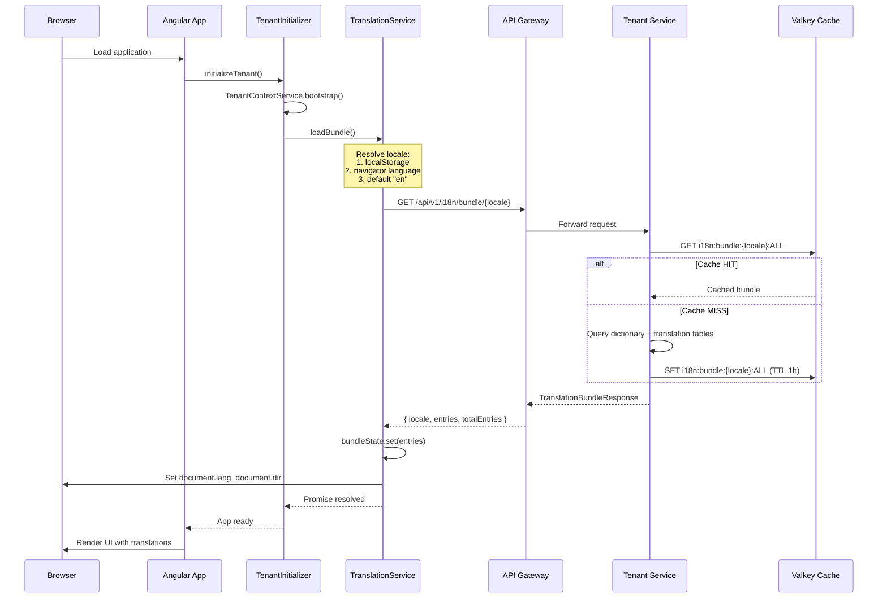
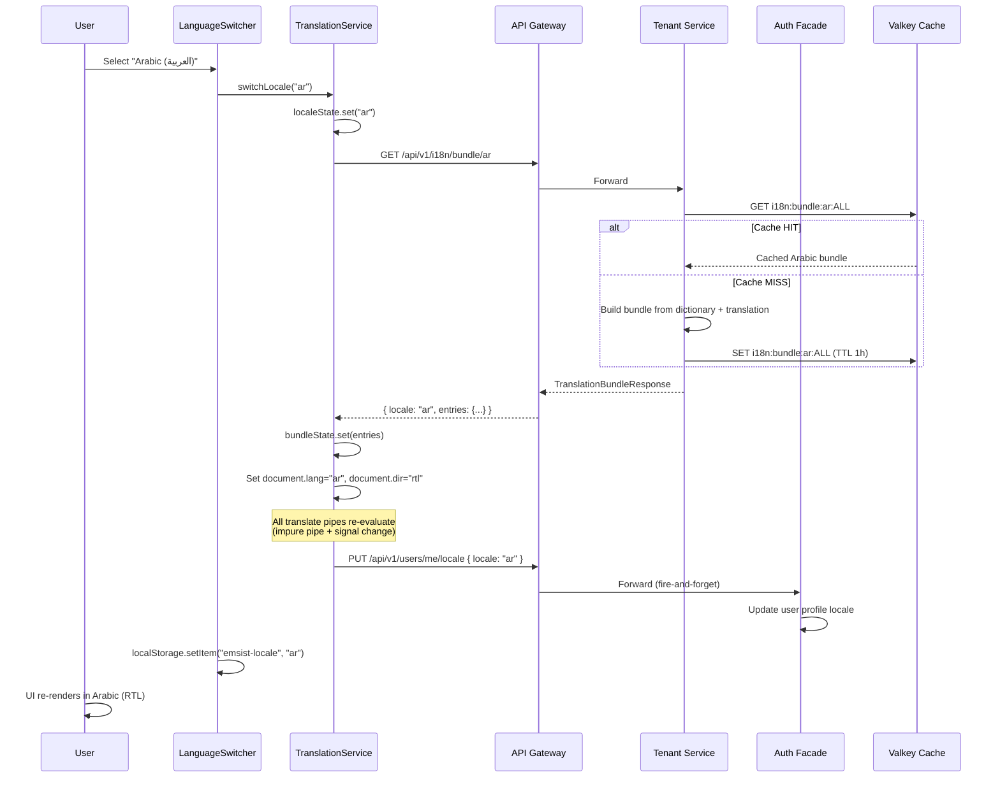
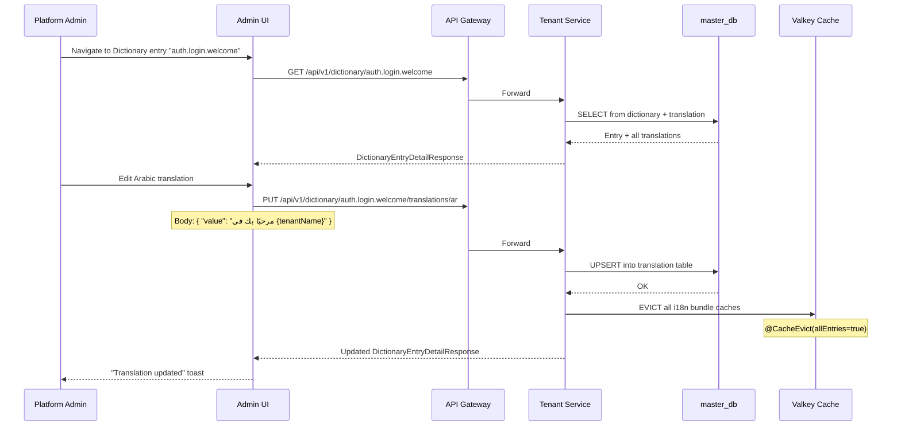
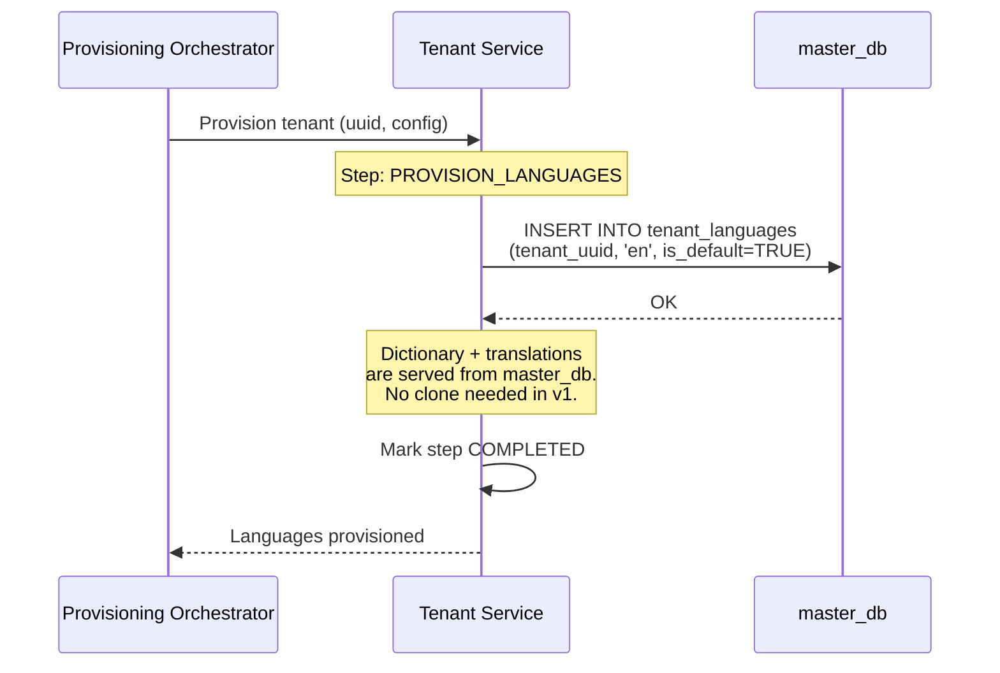

# R06 Localization -- Low-Level Design (LLD) v5

**Version:** 5.0.0
**Date:** 2026-03-19
**Status:** APPROVED
**Owner:** SA Agent
**Reviewers:** ARCH, DBA, BE, FE

---

## Table of Contents

1. [Design Decisions Summary](#1-design-decisions-summary)
2. [Data Model](#2-data-model)
3. [API Contract](#3-api-contract)
4. [Backend Architecture](#4-backend-architecture)
5. [Frontend Architecture](#5-frontend-architecture)
6. [Sequence Diagrams](#6-sequence-diagrams)
7. [Migration Strategy](#7-migration-strategy)
8. [Appendix A -- Languages Seed Data](#appendix-a--languages-seed-data)
9. [Appendix B -- Technical Name Convention](#appendix-b--technical-name-convention)

---

## Companion Implementation Contracts

This LLD defines technical architecture, data model, and service behavior. The following companion documents are mandatory for delivery of the frontend/runtime parts of v5:

| Contract | Role |
|----------|------|
| [`R06-UI-Spec-v5.md`](./R06-UI-Spec-v5.md) | Governs Angular screen inventory, component placement, state coverage, and the frozen v5 UI scope. |
| [`R06-Design-System-Validation-v5.md`](./R06-Design-System-Validation-v5.md) | Governs design-token usage, PrimeNG mapping, responsive and RTL validation, and localization screenshot baselines. |
| [`R06-Angular-Test-Strategy-v5.md`](./R06-Angular-Test-Strategy-v5.md) | Governs required Angular unit/component specs and scenario coverage. |
| [`R06-CI-Quality-Gates-v5.md`](./R06-CI-Quality-Gates-v5.md) | Governs CI job expectations and merge gates for localization frontend delivery. |

Implementation must treat these four documents as part of the v5 source-of-truth chain, not as optional references.

---

## 1. Design Decisions Summary

| # | Decision | Rationale |
|---|----------|-----------|
| D1 | Dictionary + Translation tables in `master_db` | Single source of truth; cloned to tenant DBs during provisioning |
| D2 | `technical_name` as VARCHAR PK in dictionary | Natural key; human-readable; no surrogate needed |
| D3 | English stored in `dictionary.default_value`, not in translation table | Eliminates redundancy; English is always the fallback |
| D4 | Languages table based on Google Workspace codes | Industry-standard codes; consistent with Google ecosystem |
| D5 | `message_registry` stays for error metadata | Error type, category, http_status remain in message_registry; text resolution delegates to dictionary |
| D6 | One resolver pattern | `DictionaryResolver.resolve(technicalName, locale)` -- single entry point |
| D7 | Frontend Signal-based TranslationService | Lazy-loads bundles; integrates with Angular signals for reactive re-rendering |
| D8 | Valkey caching for translation bundles | Key pattern `i18n:{tenantUuid}:{locale}`, TTL 1 hour |
| D9 | No import/export | Cancelled per stakeholder decision |
| D10 | No AI translation | Future phase |

---

## 2. Data Model

### 2.1 Entity-Relationship Diagram

```mermaid
erDiagram
    LANGUAGES {
        varchar10 code PK "e.g. en, ar, fr, de"
        varchar100 name "English name"
        varchar100 native_name "Native script name"
        varchar3 direction "LTR or RTL"
        boolean active "Available in system"
        timestamp created_at
        timestamp updated_at
        bigint version "Optimistic lock"
    }

    DICTIONARY {
        varchar255 technical_name PK "e.g. auth.login.welcome"
        text default_value "English text (always English)"
        varchar50 module "AUTH, ADMIN, SHELL, COMMON, etc."
        timestamp created_at
        timestamp updated_at
        bigint version "Optimistic lock"
    }

    TRANSLATION {
        varchar255 technical_name PK_FK "FK to dictionary"
        varchar10 locale_code PK "e.g. ar, fr, de"
        text value "Translated text"
        timestamp created_at
        timestamp updated_at
    }

    TENANT_LANGUAGES {
        uuid tenant_uuid PK_FK "FK to tenants"
        varchar10 language_code PK_FK "FK to languages"
        boolean is_default "One per tenant, locked"
        timestamp created_at
    }

    MESSAGE_REGISTRY {
        varchar20 code PK "e.g. AUTH-E-001"
        char1 type "E, W, C, I, S, L"
        varchar50 category "AUTH, LIC, etc."
        int http_status "HTTP status code"
        varchar255 technical_name_title FK "FK to dictionary for title"
        varchar255 technical_name_detail FK "FK to dictionary for detail"
        timestamp created_at
        timestamp updated_at
    }

    TENANTS {
        varchar50 id PK
        uuid uuid UK
        varchar10 default_locale "FK concept to languages"
    }

    DICTIONARY ||--o{ TRANSLATION : "technical_name"
    LANGUAGES ||--o{ TRANSLATION : "locale_code"
    LANGUAGES ||--o{ TENANT_LANGUAGES : "language_code"
    TENANTS ||--o{ TENANT_LANGUAGES : "tenant_uuid"
    DICTIONARY ||--o{ MESSAGE_REGISTRY : "technical_name_title"
    DICTIONARY ||--o{ MESSAGE_REGISTRY : "technical_name_detail"
```

### 2.2 New Tables DDL

#### 2.2.1 `languages` table

```sql
-- Flyway: V16__create_languages_table.sql
CREATE TABLE IF NOT EXISTS languages (
    code          VARCHAR(10)  PRIMARY KEY,
    name          VARCHAR(100) NOT NULL,
    native_name   VARCHAR(100) NOT NULL,
    direction     VARCHAR(3)   NOT NULL DEFAULT 'LTR',
    active        BOOLEAN      NOT NULL DEFAULT FALSE,
    created_at    TIMESTAMP WITH TIME ZONE NOT NULL DEFAULT NOW(),
    updated_at    TIMESTAMP WITH TIME ZONE NOT NULL DEFAULT NOW(),
    version       BIGINT       NOT NULL DEFAULT 0,
    CONSTRAINT languages_direction_check CHECK (direction IN ('LTR', 'RTL'))
);

CREATE INDEX IF NOT EXISTS idx_languages_active ON languages(active);

DROP TRIGGER IF EXISTS update_languages_updated_at ON languages;
CREATE TRIGGER update_languages_updated_at
    BEFORE UPDATE ON languages
    FOR EACH ROW EXECUTE FUNCTION update_updated_at_column();

COMMENT ON TABLE languages IS
    'System-wide language catalog. Based on Google Workspace language codes.';
```

#### 2.2.2 `dictionary` table

```sql
-- Flyway: V17__create_dictionary_table.sql
CREATE TABLE IF NOT EXISTS dictionary (
    technical_name  VARCHAR(255) PRIMARY KEY,
    default_value   TEXT         NOT NULL,
    module          VARCHAR(50),
    created_at      TIMESTAMP WITH TIME ZONE NOT NULL DEFAULT NOW(),
    updated_at      TIMESTAMP WITH TIME ZONE NOT NULL DEFAULT NOW(),
    version         BIGINT       NOT NULL DEFAULT 0
);

CREATE INDEX IF NOT EXISTS idx_dictionary_module ON dictionary(module);

DROP TRIGGER IF EXISTS update_dictionary_updated_at ON dictionary;
CREATE TRIGGER update_dictionary_updated_at
    BEFORE UPDATE ON dictionary
    FOR EACH ROW EXECUTE FUNCTION update_updated_at_column();

COMMENT ON TABLE dictionary IS
    'Master dictionary of all translatable strings. default_value is always English.';
```

#### 2.2.3 `translation` table

```sql
-- Flyway: V18__create_translation_table.sql
CREATE TABLE IF NOT EXISTS translation (
    technical_name  VARCHAR(255) NOT NULL REFERENCES dictionary(technical_name) ON DELETE CASCADE,
    locale_code     VARCHAR(10)  NOT NULL,
    value           TEXT         NOT NULL,
    created_at      TIMESTAMP WITH TIME ZONE NOT NULL DEFAULT NOW(),
    updated_at      TIMESTAMP WITH TIME ZONE NOT NULL DEFAULT NOW(),
    PRIMARY KEY (technical_name, locale_code)
);

CREATE INDEX IF NOT EXISTS idx_translation_locale_code ON translation(locale_code);

DROP TRIGGER IF EXISTS update_translation_updated_at ON translation;
CREATE TRIGGER update_translation_updated_at
    BEFORE UPDATE ON translation
    FOR EACH ROW EXECUTE FUNCTION update_updated_at_column();

COMMENT ON TABLE translation IS
    'Non-English translations. English text lives in dictionary.default_value.';
```

#### 2.2.4 `tenant_languages` table

```sql
-- Flyway: V19__create_tenant_languages_table.sql
CREATE TABLE IF NOT EXISTS tenant_languages (
    tenant_uuid    UUID        NOT NULL REFERENCES tenants(uuid) ON DELETE CASCADE,
    language_code  VARCHAR(10) NOT NULL REFERENCES languages(code) ON DELETE RESTRICT,
    is_default     BOOLEAN     NOT NULL DEFAULT FALSE,
    created_at     TIMESTAMP WITH TIME ZONE NOT NULL DEFAULT NOW(),
    PRIMARY KEY (tenant_uuid, language_code)
);

CREATE INDEX IF NOT EXISTS idx_tenant_languages_language_code ON tenant_languages(language_code);

-- Ensure exactly one default language per tenant
CREATE UNIQUE INDEX IF NOT EXISTS idx_tenant_languages_default
    ON tenant_languages(tenant_uuid) WHERE is_default = TRUE;

COMMENT ON TABLE tenant_languages IS
    'Per-tenant language activation. One language per tenant must be marked is_default=TRUE.';
```

### 2.3 Modified Tables

#### 2.3.1 `message_registry` -- Add dictionary FK columns

```sql
-- Flyway: V20__message_registry_add_dictionary_fk.sql

-- Add columns that reference dictionary entries for title and detail text
ALTER TABLE message_registry
    ADD COLUMN IF NOT EXISTS technical_name_title  VARCHAR(255),
    ADD COLUMN IF NOT EXISTS technical_name_detail VARCHAR(255);

-- FK constraints (deferred so we can populate dictionary first)
ALTER TABLE message_registry
    ADD CONSTRAINT fk_message_registry_title
        FOREIGN KEY (technical_name_title)
        REFERENCES dictionary(technical_name)
        DEFERRABLE INITIALLY DEFERRED;

ALTER TABLE message_registry
    ADD CONSTRAINT fk_message_registry_detail
        FOREIGN KEY (technical_name_detail)
        REFERENCES dictionary(technical_name)
        DEFERRABLE INITIALLY DEFERRED;

COMMENT ON COLUMN message_registry.technical_name_title IS
    'FK to dictionary for the message title text. When set, dictionary is authoritative for text.';
COMMENT ON COLUMN message_registry.technical_name_detail IS
    'FK to dictionary for the message detail text. When set, dictionary is authoritative for text.';
```

### 2.4 Flyway Migration Plan

| Version | File | Description |
|---------|------|-------------|
| V16 | `V16__create_languages_table.sql` | Create `languages` table + seed 75 Google Workspace languages |
| V17 | `V17__create_dictionary_table.sql` | Create `dictionary` table |
| V18 | `V18__create_translation_table.sql` | Create `translation` table |
| V19 | `V19__create_tenant_languages_table.sql` | Create `tenant_languages` table + seed master tenant with English default |
| V20 | `V20__message_registry_add_dictionary_fk.sql` | Add `technical_name_title` and `technical_name_detail` FK columns to `message_registry` |
| V21 | `V21__seed_dictionary_from_message_registry.sql` | Migrate all existing `message_registry` entries into `dictionary` + `translation` tables |
| V22 | `V22__seed_frontend_dictionary_strings.sql` | Seed all 652 frontend strings as dictionary entries |
| V23 | `V23__seed_backend_dictionary_strings.sql` | Seed all 164 backend strings as dictionary entries |

### 2.5 V21 -- Migration of Existing message_registry to Dictionary

This is the most critical migration. It bridges the existing `message_registry` system to the new `dictionary` system.

```sql
-- Flyway: V21__seed_dictionary_from_message_registry.sql
-- Migrate existing message_registry entries into dictionary + translation tables.
-- Convention: error code AUTH-E-001 maps to technical_names:
--   msg.AUTH-E-001.title  -> default_title text
--   msg.AUTH-E-001.detail -> default_detail text (when not null)

-- Step 1: Insert title entries into dictionary
INSERT INTO dictionary (technical_name, default_value, module)
SELECT
    'msg.' || code || '.title',
    default_title,
    category
FROM message_registry
ON CONFLICT (technical_name) DO NOTHING;

-- Step 2: Insert detail entries into dictionary (only where detail exists)
INSERT INTO dictionary (technical_name, default_value, module)
SELECT
    'msg.' || code || '.detail',
    default_detail,
    category
FROM message_registry
WHERE default_detail IS NOT NULL AND default_detail != ''
ON CONFLICT (technical_name) DO NOTHING;

-- Step 3: Copy existing translations from message_translation to translation
INSERT INTO translation (technical_name, locale_code, value)
SELECT
    'msg.' || code || '.title',
    locale_code,
    title
FROM message_translation
WHERE title IS NOT NULL AND title != ''
ON CONFLICT (technical_name, locale_code) DO NOTHING;

INSERT INTO translation (technical_name, locale_code, value)
SELECT
    'msg.' || code || '.detail',
    locale_code,
    detail
FROM message_translation
WHERE detail IS NOT NULL AND detail != ''
ON CONFLICT (technical_name, locale_code) DO NOTHING;

-- Step 4: Copy tenant-level overrides into translation scope
-- (Tenant overrides remain in tenant_message_translation for now;
--  full tenant-scoped dictionary is a future enhancement)

-- Step 5: Update message_registry to reference dictionary entries
UPDATE message_registry
SET technical_name_title = 'msg.' || code || '.title';

UPDATE message_registry
SET technical_name_detail = 'msg.' || code || '.detail'
WHERE default_detail IS NOT NULL AND default_detail != '';
```

### 2.6 Seed Data -- Languages (V16)

See [Appendix A](#appendix-a--languages-seed-data) for the full INSERT statement with all 75 Google Workspace languages.

### 2.7 Seed Data -- Frontend Dictionary Strings (V22)

Technical name convention: dot-separated, lowercase, matching the module hierarchy from the Frontend String Inventory.

Pattern: `{module}.{feature}.{context}.{descriptor}` or reusing existing `AUTH-*` code patterns for auth messages.

Example entries (the full migration will contain all 652 strings):

```sql
-- V22__seed_frontend_dictionary_strings.sql (excerpt)
INSERT INTO dictionary (technical_name, default_value, module) VALUES
    -- Common reusable strings
    ('common.save', 'Save', 'COMMON'),
    ('common.cancel', 'Cancel', 'COMMON'),
    ('common.close', 'Close', 'COMMON'),
    ('common.back', 'Back', 'COMMON'),
    ('common.refresh', 'Refresh', 'COMMON'),
    ('common.actions', 'Actions', 'COMMON'),
    ('common.status', 'Status', 'COMMON'),
    ('common.name', 'Name', 'COMMON'),
    ('common.active', 'Active', 'COMMON'),
    ('common.date', 'Date', 'COMMON'),
    ('common.created_by', 'Created By', 'COMMON'),
    ('common.view_details', 'View Details', 'COMMON'),
    ('common.saved', 'Saved', 'COMMON'),
    ('common.delete', 'Delete', 'COMMON'),
    ('common.edit', 'Edit', 'COMMON'),
    ('common.search', 'Search', 'COMMON'),
    ('common.loading', 'Loading...', 'COMMON'),
    ('common.no_results', 'No results found', 'COMMON'),
    ('common.confirm', 'Confirm', 'COMMON'),
    ('common.yes', 'Yes', 'COMMON'),
    ('common.no', 'No', 'COMMON'),

    -- Layout / Shell
    ('layout.skip_to_content', 'Skip to main content', 'SHELL'),
    ('layout.home_aria', 'ThinkPLUS Home', 'SHELL'),
    ('layout.logo_alt', 'ThinkPLUS', 'SHELL'),
    ('layout.sign_out', 'Sign Out', 'SHELL'),

    -- Auth Login (already in message_registry as AUTH-L-*, but also in dictionary for frontend bundle)
    ('auth.login.welcome', 'Welcome to {tenantName}', 'AUTH'),
    ('auth.login.tagline', 'Empower. Transform. Succeed.', 'AUTH'),
    ('auth.login.sign_in_email', 'Sign in with Email', 'AUTH'),
    ('auth.login.trouble', 'Having trouble signing in?', 'AUTH'),
    ('auth.login.contact_support', 'Contact support', 'AUTH'),
    ('auth.login.username_label', 'Email or Username', 'AUTH'),
    ('auth.login.username_placeholder', 'Enter your username', 'AUTH'),
    ('auth.login.password_label', 'Password', 'AUTH'),
    ('auth.login.password_placeholder', 'Enter your password', 'AUTH'),
    ('auth.login.show_password', 'Show password', 'AUTH'),
    ('auth.login.hide_password', 'Hide password', 'AUTH'),
    ('auth.login.tenant_label', 'Tenant ID', 'AUTH'),
    ('auth.login.tenant_placeholder', 'Enter tenant ID', 'AUTH'),
    ('auth.login.sign_in', 'Sign In', 'AUTH'),
    ('auth.login.signing_in', 'Signing in...', 'AUTH'),

    -- Auth errors/info (duplicate of message_registry text, dictionary is now authoritative)
    ('auth.login.signed_out', 'You have been signed out successfully.', 'AUTH'),
    ('auth.login.session_expired', 'Your session expired. Please sign in again.', 'AUTH'),
    ('auth.login.error.credentials_required', 'Email or username and password are required.', 'AUTH'),
    ('auth.login.error.tenant_required', 'Tenant ID is required.', 'AUTH'),
    ('auth.login.error.tenant_invalid', 'Tenant ID must be a UUID or a recognized tenant alias.', 'AUTH'),
    ('auth.login.error.failed', 'Login failed. Please verify your credentials.', 'AUTH'),
    ('auth.login.error.network', 'Unable to reach the server. Check your connection and try again.', 'AUTH'),
    ('auth.login.error.request_failed', 'Login request failed.', 'AUTH'),
    ('auth.login.code_label', 'Code', 'AUTH'),

    -- Password Reset
    ('auth.reset.title', 'Reset Password', 'AUTH'),
    ('auth.reset.subtitle', 'Request a secure reset link', 'AUTH'),
    ('auth.reset.email_label', 'Email address', 'AUTH'),
    ('auth.reset.email_placeholder', 'name@company.com', 'AUTH'),
    ('auth.reset.check_email', 'Check Your Email', 'AUTH'),
    ('auth.reset.return_signin', 'Return to sign in', 'AUTH'),
    ('auth.reset.success', 'Password Reset Successfully', 'AUTH'),
    ('auth.reset.new_password', 'New password', 'AUTH'),
    ('auth.reset.confirm_password', 'Confirm password', 'AUTH'),

    -- Error Pages
    ('error.access_denied.title', 'Access Denied', 'SHELL'),
    ('error.access_denied.message', 'You do not have permission to access this page', 'SHELL'),
    ('error.access_denied.go_back', 'Go Back', 'SHELL'),
    ('error.access_denied.go_admin', 'Go to Administration', 'SHELL'),
    ('error.session_expired.title', 'Session Expired', 'SHELL'),
    ('error.tenant_not_found.title', 'Tenant Not Found', 'SHELL'),
    ('error.tenant_not_found.contact', 'Contact Support', 'SHELL'),

    -- Administration Page Chrome
    ('admin.title', 'Administration', 'ADMIN'),
    ('admin.notifications', 'Notifications', 'ADMIN'),
    ('admin.help', 'Help', 'ADMIN'),
    ('admin.keyboard_shortcuts', 'Keyboard Shortcuts', 'ADMIN'),
    ('admin.nav_menu_aria', 'Navigation menu', 'ADMIN'),
    ('admin.nav.tenant_manager', 'Tenant Manager', 'ADMIN'),
    ('admin.nav.tenant_manager_desc', 'Tenant lifecycle, assignment, and embedded administration.', 'ADMIN'),
    ('admin.nav.license_manager', 'License Manager', 'ADMIN'),
    ('admin.nav.license_manager_desc', 'License state, entitlement visibility, and file import.', 'ADMIN'),
    ('admin.nav.master_locale', 'Master Locale', 'ADMIN'),
    ('admin.nav.master_locale_desc', 'System-wide language, region, and format defaults.', 'ADMIN'),
    ('admin.nav.master_definitions', 'Master Definitions', 'ADMIN'),
    ('admin.nav.master_definitions_desc', 'Reusable type definitions and metadata contracts.', 'ADMIN'),
    ('admin.section.tenant_management', 'Tenant Management', 'ADMIN'),
    ('admin.section.license_management', 'License Management', 'ADMIN'),

    -- Keyboard Shortcuts
    ('admin.shortcut.tab', 'Tab', 'ADMIN'),
    ('admin.shortcut.tab_desc', 'Move between interactive controls', 'ADMIN'),
    ('admin.shortcut.shift_tab', 'Shift + Tab', 'ADMIN'),
    ('admin.shortcut.shift_tab_desc', 'Move to previous control', 'ADMIN'),
    ('admin.shortcut.enter', 'Enter', 'ADMIN'),
    ('admin.shortcut.enter_desc', 'Activate selected dock item', 'ADMIN'),
    ('admin.shortcut.esc', 'Esc', 'ADMIN'),
    ('admin.shortcut.esc_desc', 'Close open overlays or dialogs', 'ADMIN'),

    -- Locale Admin Section
    ('admin.locale.tab.languages', 'Languages', 'ADMIN'),
    ('admin.locale.tab.dictionary', 'Dictionary', 'ADMIN'),
    ('admin.locale.tab.translations', 'Translations', 'ADMIN'),
    ('admin.locale.search_locales', 'Search locales...', 'ADMIN'),
    ('admin.locale.search_keys', 'Search keys...', 'ADMIN'),
    ('admin.locale.col.flag', 'Flag', 'ADMIN'),
    ('admin.locale.col.code', 'Code', 'ADMIN'),
    ('admin.locale.col.direction', 'Direction', 'ADMIN'),
    ('admin.locale.col.technical_name', 'Technical Name', 'ADMIN'),
    ('admin.locale.col.module', 'Module', 'ADMIN'),
    ('admin.locale.empty.locales', 'No locales found', 'ADMIN'),
    ('admin.locale.empty.dictionary', 'No dictionary entries found', 'ADMIN'),
    ('admin.locale.dialog.edit_translations', 'Edit Translations', 'ADMIN'),
    ('admin.locale.error.cannot_deactivate', 'Cannot Deactivate', 'ADMIN'),
    ('admin.locale.error.alternative_must_active', 'Alternative locale must remain active', 'ADMIN'),
    ('admin.locale.error.inactive_locale', 'Inactive Locale', 'ADMIN'),
    ('admin.locale.error.must_be_active', 'Locale must be active to be set as alternative.', 'ADMIN'),
    ('admin.locale.success.translations_updated', 'Translations updated', 'ADMIN'),
    ('admin.locale.error.load_locales', 'Failed to load locales', 'ADMIN'),
    ('admin.locale.error.load_dictionary', 'Failed to load dictionary', 'ADMIN'),
    ('admin.locale.error.update_translations', 'Failed to update translations', 'ADMIN'),

    -- License Manager Section
    ('admin.license.title', 'License Management', 'ADMIN'),
    ('admin.license.view_mode_aria', 'License view mode', 'ADMIN'),
    ('admin.license.import', 'Import License', 'ADMIN'),
    ('admin.license.empty.title', 'No Licenses Configured', 'ADMIN'),
    ('admin.license.empty.add_first', 'Add First License', 'ADMIN'),
    ('admin.license.col.id', 'License ID', 'ADMIN'),
    ('admin.license.col.product', 'Product', 'ADMIN'),
    ('admin.license.col.version', 'Version', 'ADMIN'),
    ('admin.license.col.expiry', 'Expiry', 'ADMIN'),
    ('admin.license.col.grace', 'Grace Period', 'ADMIN'),
    ('admin.license.col.tenants', 'Tenants', 'ADMIN'),
    ('admin.license.col.features', 'Features', 'ADMIN'),
    ('admin.license.col.customer', 'Customer', 'ADMIN'),
    ('admin.license.import_dialog', 'Import License File', 'ADMIN'),
    ('admin.license.drop_file', 'Drop your .lic file here', 'ADMIN'),
    ('admin.license.file_type_hint', 'Only .lic files accepted', 'ADMIN')
ON CONFLICT (technical_name) DO NOTHING;
```

**Note:** The full V22 migration will contain all 652 frontend strings. The complete list is generated from the Frontend String Inventory document. The V23 migration follows the same pattern for 164 backend strings.

### 2.8 Cross-Reference: AUTH-* Codes to Dictionary technical_names

The existing `AUTH-*` codes in `message_registry` map to dictionary entries via the `msg.` prefix convention established in V21. For the frontend bundle, auth strings also have dot-notation aliases (e.g., `auth.login.welcome`). The mapping is:

| message_registry code | dictionary technical_name (title) | Frontend alias |
|----------------------|----------------------------------|----------------|
| AUTH-L-001 | msg.AUTH-L-001.title | auth.login.welcome |
| AUTH-L-002 | msg.AUTH-L-002.title | auth.login.tagline |
| AUTH-L-003 | msg.AUTH-L-003.title | auth.login.sign_in_email |
| AUTH-L-014 | msg.AUTH-L-014.title | auth.login.sign_in |
| AUTH-I-031 | msg.AUTH-I-031.title | auth.login.signed_out |
| AUTH-C-004 | msg.AUTH-C-004.title | auth.login.error.credentials_required |
| AUTH-E-001 | msg.AUTH-E-001.title | (backend only) |

The frontend TranslationService uses the dot-notation keys (`auth.login.welcome`). The backend DictionaryResolver uses the `msg.AUTH-E-001.title` convention for error resolution. Both resolve from the same `dictionary` + `translation` tables.

---

## 3. API Contract

### 3.1 API Overview

All endpoints are hosted on **tenant-service** (port 8082), routed through **api-gateway** (port 8080).

| Method | Path | Auth | Description |
|--------|------|------|-------------|
| GET | `/api/v1/languages` | Public | List all languages |
| GET | `/api/v1/languages/active` | Public | List active languages only |
| GET | `/api/v1/tenants/{tenantId}/languages` | Tenant Admin | List activated languages for tenant |
| PUT | `/api/v1/tenants/{tenantId}/languages` | Tenant Admin | Set activated languages for tenant |
| GET | `/api/v1/dictionary` | Platform Admin | List dictionary entries (paginated) |
| GET | `/api/v1/dictionary/{technicalName}` | Platform Admin | Get single dictionary entry with translations |
| PUT | `/api/v1/dictionary/{technicalName}/translations/{locale}` | Platform Admin | Create/update a translation |
| DELETE | `/api/v1/dictionary/{technicalName}/translations/{locale}` | Platform Admin | Delete (restore to master default) |
| GET | `/api/v1/i18n/bundle/{locale}` | Public | Fetch full translation bundle for a locale |
| GET | `/api/v1/i18n/bundle/{locale}` (with `?module=AUTH`) | Public | Fetch module-scoped bundle |
| GET | `/api/v1/users/me/locale` | Authenticated | Get user locale preference |
| PUT | `/api/v1/users/me/locale` | Authenticated | Set user locale preference |

### 3.2 Endpoint Specifications

#### 3.2.1 GET `/api/v1/languages`

**Auth:** Public (no authentication required)
**Description:** Returns all languages in the system catalog.

**Response 200:**
```json
{
  "languages": [
    {
      "code": "en",
      "name": "English",
      "nativeName": "English",
      "direction": "LTR",
      "active": true
    },
    {
      "code": "ar",
      "name": "Arabic",
      "nativeName": "العربية",
      "direction": "RTL",
      "active": true
    }
  ]
}
```

**DTO:**
```java
public record LanguageResponse(
    String code,
    String name,
    String nativeName,
    String direction,
    boolean active
) {}

public record LanguageListResponse(
    List<LanguageResponse> languages
) {}
```

---

#### 3.2.2 GET `/api/v1/languages/active`

**Auth:** Public
**Description:** Returns only active languages (used by language switcher).

**Response 200:** Same shape as `LanguageListResponse`, filtered to `active=true`.

---

#### 3.2.3 GET `/api/v1/tenants/{tenantId}/languages`

**Auth:** `ROLE_TENANT_ADMIN` or `ROLE_PLATFORM_ADMIN`
**Description:** Returns the languages activated for a specific tenant.

**Response 200:**
```json
{
  "tenantId": "tenant-abc12345",
  "defaultLanguage": "en",
  "languages": [
    { "code": "en", "name": "English", "nativeName": "English", "direction": "LTR", "isDefault": true },
    { "code": "ar", "name": "Arabic", "nativeName": "العربية", "direction": "RTL", "isDefault": false }
  ]
}
```

**DTO:**
```java
public record TenantLanguageResponse(
    String code,
    String name,
    String nativeName,
    String direction,
    boolean isDefault
) {}

public record TenantLanguageListResponse(
    String tenantId,
    String defaultLanguage,
    List<TenantLanguageResponse> languages
) {}
```

---

#### 3.2.4 PUT `/api/v1/tenants/{tenantId}/languages`

**Auth:** `ROLE_TENANT_ADMIN` or `ROLE_PLATFORM_ADMIN`
**Description:** Sets the activated languages for a tenant. The default language cannot be removed.

**Request:**
```json
{
  "languageCodes": ["en", "ar", "fr"],
  "defaultLanguage": "en"
}
```

**Validation Rules:**
- `languageCodes` must not be empty
- `defaultLanguage` must be included in `languageCodes`
- All codes must exist in the `languages` table
- All codes must be `active=true` in the `languages` table

**Response 200:** Returns `TenantLanguageListResponse` (updated state).

**Error Responses:**

| Status | Code | Description |
|--------|------|-------------|
| 400 | I18N-C-001 | Default language must be in the activated list |
| 400 | I18N-C-002 | Language code not found in system catalog |
| 400 | I18N-C-003 | Language is not active in the system |
| 404 | I18N-E-001 | Tenant not found |

**DTO:**
```java
public record UpdateTenantLanguagesRequest(
    @NotEmpty List<@NotBlank String> languageCodes,
    @NotBlank String defaultLanguage
) {}
```

---

#### 3.2.5 GET `/api/v1/dictionary`

**Auth:** `ROLE_PLATFORM_ADMIN`
**Description:** Paginated list of dictionary entries with optional module filter and search.

**Query Parameters:**
| Param | Type | Default | Description |
|-------|------|---------|-------------|
| page | int | 0 | Page number (0-indexed) |
| size | int | 50 | Page size (max 200) |
| module | string | null | Filter by module (AUTH, ADMIN, SHELL, COMMON) |
| search | string | null | Search in technical_name or default_value |

**Response 200:**
```json
{
  "content": [
    {
      "technicalName": "auth.login.welcome",
      "defaultValue": "Welcome to {tenantName}",
      "module": "AUTH",
      "translationCount": 3,
      "updatedAt": "2026-03-19T10:00:00Z"
    }
  ],
  "page": 0,
  "size": 50,
  "totalElements": 816,
  "totalPages": 17
}
```

**DTO:**
```java
public record DictionaryEntryResponse(
    String technicalName,
    String defaultValue,
    String module,
    int translationCount,
    Instant updatedAt
) {}

// Uses Spring's Page<DictionaryEntryResponse>
```

---

#### 3.2.6 GET `/api/v1/dictionary/{technicalName}`

**Auth:** `ROLE_PLATFORM_ADMIN`
**Description:** Returns a single dictionary entry with all its translations.

**Response 200:**
```json
{
  "technicalName": "auth.login.welcome",
  "defaultValue": "Welcome to {tenantName}",
  "module": "AUTH",
  "translations": [
    { "localeCode": "ar", "value": "مرحبًا بك في {tenantName}", "updatedAt": "2026-03-19T10:00:00Z" },
    { "localeCode": "fr", "value": "Bienvenue chez {tenantName}", "updatedAt": "2026-03-19T10:00:00Z" }
  ],
  "version": 1,
  "updatedAt": "2026-03-19T10:00:00Z"
}
```

**Error:** 404 if `technicalName` does not exist.

**DTO:**
```java
public record DictionaryEntryDetailResponse(
    String technicalName,
    String defaultValue,
    String module,
    List<TranslationEntry> translations,
    long version,
    Instant updatedAt
) {}

public record TranslationEntry(
    String localeCode,
    String value,
    Instant updatedAt
) {}
```

---

#### 3.2.7 PUT `/api/v1/dictionary/{technicalName}/translations/{locale}`

**Auth:** `ROLE_PLATFORM_ADMIN`
**Description:** Create or update a translation for a dictionary entry.

**Request:**
```json
{
  "value": "مرحبًا بك في {tenantName}"
}
```

**Validation:**
- `value` must not be blank
- `locale` must exist in `languages` table
- `technicalName` must exist in `dictionary` table

**Response 200:** Returns the updated `DictionaryEntryDetailResponse`.

**Error Responses:**

| Status | Code | Description |
|--------|------|-------------|
| 400 | I18N-C-004 | Translation value must not be blank |
| 404 | I18N-E-002 | Dictionary entry not found |
| 404 | I18N-E-003 | Language not found |

**DTO:**
```java
public record UpdateTranslationRequest(
    @NotBlank String value
) {}
```

---

#### 3.2.8 DELETE `/api/v1/dictionary/{technicalName}/translations/{locale}`

**Auth:** `ROLE_PLATFORM_ADMIN`
**Description:** Deletes a translation, effectively restoring fallback to English default.

**Response 204:** No content.
**Error:** 404 if entry or translation does not exist.

---

#### 3.2.9 GET `/api/v1/i18n/bundle/{locale}`

**Auth:** Public (used by frontend before and after authentication)
**Description:** Returns the full flat map of `technical_name -> translated_value` for a locale. This is the primary endpoint consumed by the frontend `TranslationService`.

**Query Parameters:**
| Param | Type | Default | Description |
|-------|------|---------|-------------|
| module | string | null | Optional module filter (e.g., `AUTH` for login page) |

**Response 200:**
```json
{
  "locale": "ar",
  "entries": {
    "auth.login.welcome": "مرحبًا بك في {tenantName}",
    "auth.login.tagline": "تمكين. تحويل. نجاح.",
    "auth.login.sign_in": "تسجيل الدخول",
    "common.save": "حفظ",
    "common.cancel": "إلغاء"
  },
  "totalEntries": 816,
  "generatedAt": "2026-03-19T10:00:00Z"
}
```

**Resolution Logic:**
1. For locale `ar`: return `translation.value` where `locale_code='ar'`
2. If no translation exists for a key, return `dictionary.default_value` (English)
3. Result is a flat map covering ALL dictionary entries

**Cache:** Response is cached in Valkey. See Section 4.5.

**DTO:**
```java
public record TranslationBundleResponse(
    String locale,
    Map<String, String> entries,
    int totalEntries,
    Instant generatedAt
) {}
```

---

#### 3.2.10 GET `/api/v1/users/me/locale`

**Auth:** Authenticated user
**Description:** Returns the user's locale preference.

**Response 200:**
```json
{
  "locale": "ar",
  "source": "MANUAL"
}
```

**Note:** This endpoint is on **auth-facade** (port 8081), as user profile data is managed there. The auth-facade stores the `locale` field in the user profile (Keycloak attribute or user_locale_preferences table).

---

#### 3.2.11 PUT `/api/v1/users/me/locale`

**Auth:** Authenticated user
**Description:** Sets the user's locale preference.

**Request:**
```json
{
  "locale": "ar"
}
```

**Validation:**
- `locale` must be a valid language code in the `languages` table
- `locale` must be active

**Response 200:** Returns the updated locale response.

**DTO:**
```java
public record UpdateUserLocaleRequest(
    @NotBlank String locale
) {}

public record UserLocaleResponse(
    String locale,
    String source
) {}
```

---

### 3.3 Error Code Registry

All new error codes for the i18n feature:

| Code | Type | HTTP | Title | Detail |
|------|------|------|-------|--------|
| I18N-C-001 | C | 400 | Default language required | The default language must be included in the activated languages list. |
| I18N-C-002 | C | 400 | Unknown language code | Language code '{code}' does not exist in the system catalog. |
| I18N-C-003 | C | 400 | Inactive language | Language '{code}' is not active in the system. |
| I18N-C-004 | C | 400 | Translation value required | Translation value must not be blank. |
| I18N-E-001 | E | 404 | Tenant not found | Tenant with ID '{tenantId}' was not found. |
| I18N-E-002 | E | 404 | Dictionary entry not found | Dictionary entry '{technicalName}' was not found. |
| I18N-E-003 | E | 404 | Language not found | Language '{code}' was not found. |
| I18N-E-004 | E | 409 | Cannot remove default language | The default language cannot be removed from the tenant's activated languages. |
| I18N-E-500 | E | 500 | Translation service error | An unexpected error occurred while processing translations. |

These codes are seeded into `message_registry` and `dictionary` tables during V21/V23 migrations.

---

## 4. Backend Architecture

### 4.1 Package Structure (tenant-service)

```
com.ems.tenant
  controller/
    LanguageController.java              -- /api/v1/languages
    DictionaryController.java            -- /api/v1/dictionary
    TranslationBundleController.java     -- /api/v1/i18n/bundle
    TenantLanguageController.java        -- /api/v1/tenants/{id}/languages
  entity/
    LanguageEntity.java                  -- NEW
    DictionaryEntity.java                -- NEW
    TranslationEntity.java              -- NEW
    TranslationId.java                  -- NEW (composite key)
    TenantLanguageEntity.java           -- NEW
    TenantLanguageId.java               -- NEW (composite key)
  repository/
    LanguageRepository.java              -- NEW
    DictionaryRepository.java            -- NEW
    TranslationRepository.java          -- NEW
    TenantLanguageRepository.java       -- NEW
  service/
    LanguageService.java                 -- NEW
    DictionaryService.java               -- NEW
    DictionaryResolver.java              -- NEW (one resolver pattern)
    TranslationBundleService.java       -- NEW (bundle generation + caching)
    TenantLanguageService.java          -- NEW
  dto/
    LanguageResponse.java                -- NEW
    DictionaryEntryResponse.java         -- NEW
    TranslationBundleResponse.java      -- NEW
    UpdateTenantLanguagesRequest.java   -- NEW
    UpdateTranslationRequest.java       -- NEW
```

### 4.2 Entity Definitions

#### LanguageEntity

```java
@Entity
@Table(name = "languages")
@Getter @Setter @Builder
@NoArgsConstructor @AllArgsConstructor
public class LanguageEntity {

    @Id
    @Column(name = "code", length = 10)
    private String code;

    @Column(name = "name", nullable = false, length = 100)
    private String name;

    @Column(name = "native_name", nullable = false, length = 100)
    private String nativeName;

    @Column(name = "direction", nullable = false, length = 3)
    @Builder.Default
    private String direction = "LTR";

    @Column(name = "active", nullable = false)
    @Builder.Default
    private Boolean active = false;

    @Version
    @Column(name = "version")
    private Long version;

    @CreationTimestamp
    @Column(name = "created_at", nullable = false, updatable = false)
    private Instant createdAt;

    @UpdateTimestamp
    @Column(name = "updated_at", nullable = false)
    private Instant updatedAt;
}
```

#### DictionaryEntity

```java
@Entity
@Table(name = "dictionary")
@Getter @Setter @Builder
@NoArgsConstructor @AllArgsConstructor
public class DictionaryEntity {

    @Id
    @Column(name = "technical_name", length = 255)
    private String technicalName;

    @Column(name = "default_value", nullable = false, columnDefinition = "TEXT")
    private String defaultValue;

    @Column(name = "module", length = 50)
    private String module;

    @Version
    @Column(name = "version")
    private Long version;

    @CreationTimestamp
    @Column(name = "created_at", nullable = false, updatable = false)
    private Instant createdAt;

    @UpdateTimestamp
    @Column(name = "updated_at", nullable = false)
    private Instant updatedAt;
}
```

#### TranslationEntity

```java
@Entity
@Table(name = "translation")
@IdClass(TranslationId.class)
@Getter @Setter @Builder
@NoArgsConstructor @AllArgsConstructor
public class TranslationEntity {

    @Id
    @Column(name = "technical_name", nullable = false, length = 255)
    private String technicalName;

    @Id
    @Column(name = "locale_code", nullable = false, length = 10)
    private String localeCode;

    @Column(name = "value", nullable = false, columnDefinition = "TEXT")
    private String value;

    @CreationTimestamp
    @Column(name = "created_at", nullable = false, updatable = false)
    private Instant createdAt;

    @UpdateTimestamp
    @Column(name = "updated_at", nullable = false)
    private Instant updatedAt;
}
```

#### TenantLanguageEntity

```java
@Entity
@Table(name = "tenant_languages")
@IdClass(TenantLanguageId.class)
@Getter @Setter @Builder
@NoArgsConstructor @AllArgsConstructor
public class TenantLanguageEntity {

    @Id
    @Column(name = "tenant_uuid", nullable = false)
    private UUID tenantUuid;

    @Id
    @Column(name = "language_code", nullable = false, length = 10)
    private String languageCode;

    @Column(name = "is_default", nullable = false)
    @Builder.Default
    private Boolean isDefault = false;

    @CreationTimestamp
    @Column(name = "created_at", nullable = false, updatable = false)
    private Instant createdAt;
}
```

### 4.3 DictionaryResolver -- One Resolver Pattern

The `DictionaryResolver` is the single entry point for resolving any translatable string. It replaces direct usage of `MessageRegistryService.resolveMessage()` for text resolution.

```java
@Service
@RequiredArgsConstructor
@Slf4j
public class DictionaryResolver {

    private final DictionaryRepository dictionaryRepository;
    private final TranslationRepository translationRepository;

    /**
     * Resolve a technical_name to its translated value.
     *
     * Resolution order:
     * 1. translation table for exact locale (e.g., "fr")
     * 2. dictionary.default_value (English fallback)
     *
     * @param technicalName the dictionary key
     * @param locale        the target locale code (e.g., "ar", "fr")
     * @return resolved text, never null
     * @throws ResourceNotFoundException if technicalName does not exist
     */
    public String resolve(String technicalName, String locale) {
        DictionaryEntity entry = dictionaryRepository.findById(technicalName)
            .orElseThrow(() -> new ResourceNotFoundException(
                "Dictionary entry not found: " + technicalName));

        if (locale == null || "en".equalsIgnoreCase(locale)) {
            return entry.getDefaultValue();
        }

        return translationRepository
            .findByTechnicalNameAndLocaleCode(technicalName, locale.toLowerCase())
            .map(TranslationEntity::getValue)
            .orElse(entry.getDefaultValue());
    }

    /**
     * Resolve with placeholder substitution.
     */
    public String resolve(String technicalName, String locale, Map<String, ?> arguments) {
        String template = resolve(technicalName, locale);
        return applyArguments(template, arguments);
    }

    /**
     * Resolve a message_registry code to its title text via dictionary.
     * Bridges old AUTH-E-001 codes to new dictionary system.
     */
    public String resolveMessageTitle(String messageCode, String locale) {
        String technicalName = "msg." + messageCode + ".title";
        try {
            return resolve(technicalName, locale);
        } catch (ResourceNotFoundException e) {
            log.warn("No dictionary entry for message code {}, falling back to direct lookup", messageCode);
            return null; // caller falls back to message_registry.default_title
        }
    }

    public String resolveMessageDetail(String messageCode, String locale) {
        String technicalName = "msg." + messageCode + ".detail";
        try {
            return resolve(technicalName, locale);
        } catch (ResourceNotFoundException e) {
            return null;
        }
    }

    private String applyArguments(String template, Map<String, ?> arguments) {
        if (template == null || arguments == null || arguments.isEmpty()) {
            return template;
        }
        String resolved = template;
        for (Map.Entry<String, ?> entry : arguments.entrySet()) {
            resolved = resolved.replace("{" + entry.getKey() + "}", String.valueOf(entry.getValue()));
        }
        return resolved;
    }
}
```

### 4.4 Modifications to Existing Message Resolution

#### MessageRegistryService Changes

The existing `MessageRegistryService.resolveMessage()` method is modified to use `DictionaryResolver` when `technical_name_title` or `technical_name_detail` is set on a message_registry entry:

```java
// In MessageRegistryService.resolveMessage():
// Before: directly returns registry.getDefaultTitle() / translation.getTitle()
// After:  if registry.getTechnicalNameTitle() != null, delegate to DictionaryResolver

public ResolvedMessageResponse resolveMessage(String code, String locale, String tenantId) {
    String normalizedCode = normalizeCode(code);
    MessageRegistryEntity registry = messageRegistryRepository.findById(normalizedCode)
        .orElseThrow(() -> new ResourceNotFoundException("Message not found: " + normalizedCode));

    String normalizedLocale = normalizeLocale(locale);
    String resolvedTitle;
    String resolvedDetail;

    // New: prefer dictionary resolution when FK is set
    if (registry.getTechnicalNameTitle() != null) {
        resolvedTitle = dictionaryResolver.resolve(registry.getTechnicalNameTitle(), normalizedLocale);
    } else {
        resolvedTitle = resolveFromLegacy(registry, normalizedCode, normalizedLocale, tenantId, true);
    }

    if (registry.getTechnicalNameDetail() != null) {
        resolvedDetail = dictionaryResolver.resolve(registry.getTechnicalNameDetail(), normalizedLocale);
    } else {
        resolvedDetail = resolveFromLegacy(registry, normalizedCode, normalizedLocale, tenantId, false);
    }

    return new ResolvedMessageResponse(
        registry.getCode(),
        resolvedTitle,
        resolvedDetail,
        registry.getHttpStatus(),
        normalizedLocale
    );
}
```

This approach ensures **backwards compatibility** -- existing message resolution works unchanged until V21 populates the `technical_name_title`/`technical_name_detail` columns.

#### AuthLocalizedMessageResolver Changes (auth-facade)

No changes needed immediately. The `AuthLocalizedMessageResolver` already calls `MessageRegistryClient.resolveMessage()` which goes to tenant-service. Since tenant-service now resolves via dictionary internally, auth-facade gets the benefit automatically. The `AuthProblemType` enum fallbacks remain as a last-resort safety net.

### 4.5 Caching Strategy (Valkey)

#### Cache Key Pattern

```
i18n:bundle:{locale}              -- full bundle for a locale (no module filter)
i18n:bundle:{locale}:{module}     -- module-scoped bundle
```

**Note:** Translation bundles are global (not tenant-scoped) in v1, because dictionary + translation tables are in master_db and shared. Tenant-scoped dictionary overrides are a future phase.

#### Cache Configuration

| Property | Value | Rationale |
|----------|-------|-----------|
| TTL | 3600 seconds (1 hour) | Balance between freshness and DB load |
| Eviction | On translation edit/delete | Targeted invalidation via `@CacheEvict` |
| Serialization | JSON (Jackson) | Human-readable, debuggable |

#### Cache Implementation

```java
@Service
@RequiredArgsConstructor
@Slf4j
public class TranslationBundleService {

    private final DictionaryRepository dictionaryRepository;
    private final TranslationRepository translationRepository;

    private static final String CACHE_NAME = "i18n-bundles";

    @Cacheable(value = CACHE_NAME, key = "#locale + ':' + (#module ?: 'ALL')")
    public TranslationBundleResponse getBundle(String locale, String module) {
        List<DictionaryEntity> entries = module != null
            ? dictionaryRepository.findByModuleOrderByTechnicalName(module)
            : dictionaryRepository.findAllByOrderByTechnicalName();

        Map<String, String> bundle = new LinkedHashMap<>();
        if ("en".equalsIgnoreCase(locale) || locale == null) {
            for (DictionaryEntity entry : entries) {
                bundle.put(entry.getTechnicalName(), entry.getDefaultValue());
            }
        } else {
            Map<String, String> translations = translationRepository
                .findByLocaleCode(locale.toLowerCase())
                .stream()
                .collect(Collectors.toMap(
                    TranslationEntity::getTechnicalName,
                    TranslationEntity::getValue,
                    (a, b) -> a
                ));

            for (DictionaryEntity entry : entries) {
                bundle.put(
                    entry.getTechnicalName(),
                    translations.getOrDefault(entry.getTechnicalName(), entry.getDefaultValue())
                );
            }
        }

        return new TranslationBundleResponse(
            locale != null ? locale : "en",
            bundle,
            bundle.size(),
            Instant.now()
        );
    }

    @CacheEvict(value = CACHE_NAME, allEntries = true)
    public void evictAll() {
        log.info("Evicted all i18n bundle caches");
    }
}
```

#### Cache Invalidation Triggers

| Event | Action |
|-------|--------|
| Translation created/updated/deleted | Evict all bundles (`@CacheEvict(allEntries=true)`) |
| Dictionary entry updated | Evict all bundles |
| Language activated/deactivated | No cache impact (bundles exist per-locale regardless) |

### 4.6 Tenant Provisioning Changes

During tenant provisioning, the dictionary and translations are **not cloned** into the tenant DB in v1. Translation bundles are served from master_db. This simplifies the initial implementation.

Future phase will add:
- `tenant_dictionary_override` table in tenant DBs
- Clone mechanism during provisioning
- Tenant-scoped bundle resolution (check tenant override, then fall back to master)

The existing `tenant_languages` table is populated during provisioning:

```java
// In TenantProvisioningService (or equivalent):
public void provisionTenantLanguages(UUID tenantUuid) {
    // Seed the tenant with English as the default language
    TenantLanguageEntity defaultLang = TenantLanguageEntity.builder()
        .tenantUuid(tenantUuid)
        .languageCode("en")
        .isDefault(true)
        .build();
    tenantLanguageRepository.save(defaultLang);
}
```

### 4.7 Repository Interfaces

```java
@Repository
public interface LanguageRepository extends JpaRepository<LanguageEntity, String> {
    List<LanguageEntity> findByActiveTrueOrderByNameAsc();
    List<LanguageEntity> findAllByOrderByNameAsc();
}

@Repository
public interface DictionaryRepository extends JpaRepository<DictionaryEntity, String> {
    List<DictionaryEntity> findAllByOrderByTechnicalName();
    List<DictionaryEntity> findByModuleOrderByTechnicalName(String module);
    Page<DictionaryEntity> findByModuleAndTechnicalNameContainingIgnoreCase(
        String module, String search, Pageable pageable);
    Page<DictionaryEntity> findByTechnicalNameContainingIgnoreCaseOrDefaultValueContainingIgnoreCase(
        String search1, String search2, Pageable pageable);
}

@Repository
public interface TranslationRepository
    extends JpaRepository<TranslationEntity, TranslationId> {

    List<TranslationEntity> findByLocaleCode(String localeCode);
    List<TranslationEntity> findByTechnicalName(String technicalName);
    Optional<TranslationEntity> findByTechnicalNameAndLocaleCode(String technicalName, String localeCode);
    long countByTechnicalName(String technicalName);
}

@Repository
public interface TenantLanguageRepository
    extends JpaRepository<TenantLanguageEntity, TenantLanguageId> {

    List<TenantLanguageEntity> findByTenantUuidOrderByLanguageCodeAsc(UUID tenantUuid);
    void deleteByTenantUuid(UUID tenantUuid);
    boolean existsByTenantUuidAndLanguageCode(UUID tenantUuid, String languageCode);
}
```

---

## 5. Frontend Architecture

### 5.1 TranslationService Design

The `TranslationService` is a Signal-based Angular service that replaces hardcoded strings. It loads a translation bundle from the backend and exposes a reactive `t()` method.

**File:** `frontend/src/app/core/i18n/translation.service.ts`

```typescript
import { computed, inject, Injectable, signal } from '@angular/core';
import { HttpClient } from '@angular/common/http';
import { catchError, firstValueFrom, of } from 'rxjs';

export interface TranslationBundle {
  readonly locale: string;
  readonly entries: Record<string, string>;
  readonly totalEntries: number;
  readonly generatedAt: string;
}

@Injectable({ providedIn: 'root' })
export class TranslationService {
  private readonly http = inject(HttpClient);

  /** Current locale code */
  private readonly localeState = signal<string>(resolveInitialLocale());

  /** Raw bundle map: technical_name -> translated text */
  private readonly bundleState = signal<Record<string, string>>({});

  /** Loading state */
  private readonly loadingState = signal(false);

  /** Public readonly signals */
  readonly locale = this.localeState.asReadonly();
  readonly loading = this.loadingState.asReadonly();
  readonly direction = computed(() => RTL_LOCALES.has(this.localeState()) ? 'rtl' : 'ltr');

  private loadPromise: Promise<void> | null = null;

  /**
   * Load the full translation bundle for the given locale.
   * Called during app initialization and on language switch.
   */
  loadBundle(locale?: string): Promise<void> {
    const targetLocale = locale ?? this.localeState();

    // If same locale and already loaded, skip
    if (this.loadPromise && targetLocale === this.localeState() && Object.keys(this.bundleState()).length > 0) {
      return this.loadPromise;
    }

    this.localeState.set(targetLocale);
    this.loadingState.set(true);

    this.loadPromise = firstValueFrom(
      this.http.get<TranslationBundle>(`/api/v1/i18n/bundle/${targetLocale}`).pipe(
        catchError((error) => {
          console.warn('Failed to load translation bundle, using defaults', error);
          return of({ locale: targetLocale, entries: {}, totalEntries: 0, generatedAt: '' } as TranslationBundle);
        }),
      ),
    ).then((bundle) => {
      this.bundleState.set(bundle.entries);
      this.loadingState.set(false);
      document.documentElement.lang = targetLocale;
      document.documentElement.dir = RTL_LOCALES.has(targetLocale) ? 'rtl' : 'ltr';
    });

    return this.loadPromise;
  }

  /**
   * Translate a technical name to its localized value.
   * Returns the key itself if not found (development aid).
   */
  t(key: string, params?: Record<string, string>): string {
    const value = this.bundleState()[key] ?? key;
    if (!params) return value;
    return Object.entries(params).reduce(
      (result, [paramKey, paramValue]) => result.replace(`{${paramKey}}`, paramValue),
      value,
    );
  }

  /**
   * Switch to a new locale. Triggers bundle reload.
   */
  async switchLocale(locale: string): Promise<void> {
    await this.loadBundle(locale);
    // Persist to user profile if authenticated
    this.persistLocalePreference(locale);
  }

  private persistLocalePreference(locale: string): void {
    // Fire-and-forget PUT to /api/v1/users/me/locale
    this.http.put('/api/v1/users/me/locale', { locale }).pipe(
      catchError(() => of(null)),
    ).subscribe();
  }
}

const RTL_LOCALES = new Set(['ar', 'he', 'fa', 'ur', 'ps', 'sd', 'yi', 'ku']);

function resolveInitialLocale(): string {
  // Check localStorage first (for pre-auth persistence)
  const stored = globalThis.localStorage?.getItem('emsist-locale');
  if (stored) return stored;

  // Browser language detection
  const browserLang = globalThis.navigator?.languages?.[0]
    ?? globalThis.navigator?.language
    ?? 'en';
  return browserLang.split(/[-_]/)[0]?.toLowerCase() || 'en';
}
```

### 5.2 TranslatePipe

**File:** `frontend/src/app/core/i18n/translate.pipe.ts`

```typescript
import { inject, Pipe, PipeTransform } from '@angular/core';
import { TranslationService } from './translation.service';

@Pipe({
  name: 'translate',
  standalone: true,
  pure: false, // Must be impure to react to locale changes
})
export class TranslatePipe implements PipeTransform {
  private readonly translationService = inject(TranslationService);

  transform(key: string, params?: Record<string, string>): string {
    return this.translationService.t(key, params);
  }
}
```

**Usage in templates:**

```html
<!-- Simple -->
<h1>{{ 'auth.login.welcome' | translate: { tenantName: tenantName } }}</h1>

<!-- Without params -->
<button>{{ 'common.save' | translate }}</button>

<!-- In TypeScript -->
this.translationService.t('auth.login.error.credentials_required');
```

### 5.3 Language Switcher Component

**File:** `frontend/src/app/shared/language-switcher/language-switcher.component.ts`

```typescript
import { Component, inject, OnInit, signal } from '@angular/core';
import { CommonModule } from '@angular/common';
import { HttpClient } from '@angular/common/http';
import { SelectModule } from 'primeng/select';
import { FormsModule } from '@angular/forms';
import { TranslationService } from '../../core/i18n/translation.service';

interface Language {
  code: string;
  name: string;
  nativeName: string;
  direction: string;
}

@Component({
  selector: 'app-language-switcher',
  standalone: true,
  imports: [CommonModule, FormsModule, SelectModule],
  template: `
    <p-select
      [options]="languages()"
      [(ngModel)]="selectedLocale"
      optionLabel="nativeName"
      optionValue="code"
      [style]="{ minWidth: '140px' }"
      (onChange)="onLanguageChange($event.value)"
      aria-label="Select language">
    </p-select>
  `,
})
export class LanguageSwitcherComponent implements OnInit {
  private readonly http = inject(HttpClient);
  private readonly translationService = inject(TranslationService);

  protected readonly languages = signal<Language[]>([]);
  protected selectedLocale = this.translationService.locale();

  ngOnInit(): void {
    this.http.get<{ languages: Language[] }>('/api/v1/languages/active')
      .subscribe((response) => this.languages.set(response.languages));
  }

  protected async onLanguageChange(locale: string): Promise<void> {
    await this.translationService.switchLocale(locale);
    localStorage.setItem('emsist-locale', locale);
  }
}
```

**Placement:** Shell layout header, next to the user menu. Visible both pre-auth and post-auth.

### 5.4 Integration with Existing AuthUiTextService

The migration happens in phases:

**Phase 1 (Adapter):** Wrap `AuthUiTextService` to delegate to `TranslationService`.

```typescript
// Modified auth-ui-text.service.ts
@Injectable({ providedIn: 'root' })
export class AuthUiTextService {
  private readonly translationService = inject(TranslationService);

  // Keep existing preload() for backwards compatibility
  preload(): Promise<void> {
    // Now delegates to TranslationService.loadBundle()
    // Load only AUTH module for the login page (before full app loads)
    return this.translationService.loadBundle();
  }

  // Bridge method: maps AUTH-* codes to dictionary technical_names
  text(code: AuthUiMessageCode): string {
    const key = AUTH_CODE_TO_DICTIONARY_KEY[code];
    if (key) {
      const result = this.translationService.t(key);
      // If TranslationService returns the key itself (not loaded yet), fall back
      if (result !== key) return result;
    }
    // Fallback to local hardcoded text (safety net)
    return pickFallbackText(code, this.translationService.locale());
  }
}

// Mapping from AUTH-* codes to dictionary technical_names
const AUTH_CODE_TO_DICTIONARY_KEY: Record<AuthUiMessageCode, string> = {
  'AUTH-I-031': 'auth.login.signed_out',
  'AUTH-I-032': 'auth.login.session_expired',
  'AUTH-I-033': 'auth.login.code_label',
  'AUTH-C-004': 'auth.login.error.credentials_required',
  'AUTH-C-005': 'auth.login.error.tenant_required',
  'AUTH-C-006': 'auth.login.error.tenant_invalid',
  'AUTH-E-031': 'auth.login.error.failed',
  'AUTH-E-032': 'auth.login.error.network',
  'AUTH-E-033': 'auth.login.error.request_failed',
  'AUTH-L-001': 'auth.login.welcome',
  'AUTH-L-002': 'auth.login.tagline',
  'AUTH-L-003': 'auth.login.sign_in_email',
  'AUTH-L-004': 'auth.login.trouble',
  'AUTH-L-005': 'auth.login.contact_support',
  'AUTH-L-006': 'auth.login.username_label',
  'AUTH-L-007': 'auth.login.username_placeholder',
  'AUTH-L-008': 'auth.login.password_label',
  'AUTH-L-009': 'auth.login.password_placeholder',
  'AUTH-L-010': 'auth.login.show_password',
  'AUTH-L-011': 'auth.login.hide_password',
  'AUTH-L-012': 'auth.login.tenant_label',
  'AUTH-L-013': 'auth.login.tenant_placeholder',
  'AUTH-L-014': 'auth.login.sign_in',
  'AUTH-L-015': 'auth.login.signing_in',
  'AUTH-L-016': 'common.back',
};
```

**Phase 2 (Direct Migration):** Replace all `authUiText.text('AUTH-L-014')` calls in templates with `{{ 'auth.login.sign_in' | translate }}`. Remove `AuthUiTextService` once all consumers are migrated.

### 5.5 App Initialization Flow Changes

**File:** `frontend/src/app/core/initializers/tenant.initializer.ts`

```typescript
import { inject } from '@angular/core';
import { TranslationService } from '../i18n/translation.service';
import { TenantContextService } from '../services/tenant-context.service';

export function initializeTenant(): Promise<void> {
  const tenantContext = inject(TenantContextService);
  const translationService = inject(TranslationService);

  return tenantContext.bootstrap().then(() => {
    // Load translation bundle during app init (replaces authUiText.preload())
    return translationService.loadBundle();
  });
}
```

The `AuthUiTextService.preload()` call is replaced by `TranslationService.loadBundle()`. Since the TranslationService adapter wraps the same data source, `login.page.ts` continues to work unchanged.

### 5.6 LocaleHeaderInterceptor Changes

The existing `localeHeaderInterceptor` is modified to use `TranslationService.locale()` instead of raw browser detection:

```typescript
import { inject } from '@angular/core';
import { HttpInterceptorFn } from '@angular/common/http';
import { TranslationService } from '../i18n/translation.service';

export const localeHeaderInterceptor: HttpInterceptorFn = (request, next) => {
  if (!request.url.includes('/api/') || request.headers.has('Accept-Language')) {
    return next(request);
  }

  // Use the TranslationService's current locale (which accounts for
  // user preference, stored locale, and browser detection)
  const translationService = inject(TranslationService);
  const locale = translationService.locale();

  return next(
    request.clone({
      setHeaders: { 'Accept-Language': locale },
    }),
  );
};
```

### 5.7 String Externalization Strategy

The process for externalizing the ~652 frontend strings:

1. **Generate technical_names** from the Frontend String Inventory using the convention: `{module}.{feature}.{context}.{descriptor}` (all lowercase, dot-separated).

2. **Seed into dictionary table** via V22 migration.

3. **Replace hardcoded strings** in templates:
   - Template strings: `"Save"` becomes `{{ 'common.save' | translate }}`
   - TypeScript strings: `'Failed to load'` becomes `this.translationService.t('admin.locale.error.load_locales')`
   - Attribute bindings: `placeholder="Search..."` becomes `[placeholder]="'common.search' | translate"`
   - ARIA labels: `aria-label="Navigation menu"` becomes `[attr.aria-label]="'admin.nav_menu_aria' | translate"`

4. **Execution order:** P1 (Auth) then P2 (Shell) then P3 (Admin chrome) then P4-P10 by priority.

---

## 6. Sequence Diagrams

### 6.1 App Startup -- Locale Detection and Bundle Loading



### 6.2 User Switches Language



### 6.3 Tenant Admin Edits a Translation



### 6.4 Tenant Provisioning -- Language Setup



---

## 7. Migration Strategy

### 7.1 Overall Migration Approach

The migration is designed to be **incremental and non-breaking**. At no point does the existing system lose functionality.

```mermaid
graph LR
    subgraph Phase 1: Schema
        A[V16-V19: Create new tables] --> B[V20: Add FK columns to message_registry]
    end

    subgraph Phase 2: Data
        B --> C[V21: Migrate message_registry to dictionary]
        C --> D[V22-V23: Seed frontend + backend strings]
    end

    subgraph Phase 3: Backend
        D --> E[DictionaryResolver service]
        E --> F[MessageRegistryService uses DictionaryResolver]
        F --> G[New controllers: Language, Dictionary, Bundle]
    end

    subgraph Phase 4: Frontend
        G --> H[TranslationService + TranslatePipe]
        H --> I[AuthUiTextService adapter]
        I --> J[Externalize strings P1-P10]
    end

    subgraph Phase 5: Cleanup
        J --> K[Remove AuthUiTextService]
        K --> L[Remove AuthProblemType hardcoded Arabic]
        L --> M[Remove AuthUiMessageType hardcoded Arabic]
    end
```



### 7.2 Backwards Compatibility During Migration

| Component | Before Migration | During Migration | After Migration |
|-----------|-----------------|-----------------|-----------------|
| `message_registry` table | Owns text (default_title, default_detail) | Still works; FK columns added but optional | FK columns populated; text resolves through dictionary |
| `message_translation` table | Owns non-English translations | Still works; data copied to `translation` table | Deprecated; `translation` table is authoritative |
| `tenant_message_translation` table | Owns tenant overrides | Still works unchanged | Future: migrate to tenant_dictionary_override |
| `AuthProblemType` enum | Hardcoded en/ar fallbacks | Still works as last-resort fallback | Remove hardcoded Arabic; keep only English fallback |
| `AuthUiMessageType` enum | Hardcoded en/ar text | Still works as fallback | Remove hardcoded Arabic; keep only English fallback |
| `AuthLocalizedMessageResolver` | Calls MessageRegistryClient | No change needed (transparent) | No change needed |
| `AuthUiTextService` (frontend) | Calls auth-facade API, has local fallbacks | Adapter wraps TranslationService | Removed; TranslatePipe used directly |
| `LocaleHeaderInterceptor` | Uses browser navigator.language | Modified to use TranslationService.locale() | Final state |

### 7.3 Handling Existing AuthUiTextService (32 Auth Messages)

The 32 auth messages currently live in three places:
1. `message_registry` + `message_translation` tables (V12, V13, V14)
2. `AuthProblemType` enum (16 error entries with hardcoded en/ar)
3. `AuthUiMessageType` enum (25 UI text entries with hardcoded en/ar)
4. `AuthUiTextService` (frontend, 25 codes with hardcoded en/ar fallbacks)

**Migration path:**

1. **V21 migration** copies all message_registry entries into dictionary + translation tables. The `msg.AUTH-E-001.title` convention creates dictionary entries for every existing code.

2. **V22 migration** adds the dot-notation aliases (`auth.login.welcome`, etc.) as separate dictionary entries with the same English text. This gives the frontend human-readable keys.

3. **AuthUiTextService adapter** (Phase 1) maps `AUTH-L-001` to `auth.login.welcome` and delegates to `TranslationService`. No template changes needed initially.

4. **Template migration** (Phase 2) replaces `authUiText.text('AUTH-L-014')` with `{{ 'auth.login.sign_in' | translate }}`.

5. **Cleanup** removes:
   - `AUTH_UI_FALLBACKS` from `auth-ui-text.service.ts`
   - Arabic hardcoded text from `AuthProblemType` enum (keep English-only fallbacks)
   - Arabic hardcoded text from `AuthUiMessageType` enum (keep English-only fallbacks)
   - `AuthUiTextService` (once all consumers migrated)

### 7.4 Handling AuthProblemType / AuthUiMessageType Enum Fallbacks

These enums serve as **last-resort fallbacks** when the message registry is unavailable. After migration:

- Remove the `arabicTitle` and `arabicDetail` fields from `AuthProblemType`
- Remove the `arabicText` field from `AuthUiMessageType`
- Keep only English fallback text (the dictionary is now authoritative for all languages)
- The `fallbackTitle(Locale)` methods become locale-agnostic, always returning English
- This is safe because the dictionary/translation tables handle all locale resolution

### 7.5 Data Integrity Verification

After V21 migration, verify with:

```sql
-- Count: all message_registry entries should have dictionary counterparts
SELECT COUNT(*) FROM message_registry mr
WHERE NOT EXISTS (
    SELECT 1 FROM dictionary d WHERE d.technical_name = 'msg.' || mr.code || '.title'
);
-- Expected: 0

-- Count: all message_translation entries should be in translation table
SELECT COUNT(*) FROM message_translation mt
WHERE NOT EXISTS (
    SELECT 1 FROM translation t
    WHERE t.technical_name = 'msg.' || mt.code || '.title'
    AND t.locale_code = mt.locale_code
);
-- Expected: 0
```

---

## Appendix A -- Languages Seed Data

Included in V16 migration. Based on Google Workspace supported languages.

```sql
-- V16__create_languages_table.sql (seed data section)
INSERT INTO languages (code, name, native_name, direction, active) VALUES
    ('af', 'Afrikaans', 'Afrikaans', 'LTR', FALSE),
    ('am', 'Amharic', 'አማርኛ', 'LTR', FALSE),
    ('ar', 'Arabic', 'العربية', 'RTL', TRUE),
    ('az', 'Azerbaijani', 'Azərbaycan', 'LTR', FALSE),
    ('be', 'Belarusian', 'беларуская', 'LTR', FALSE),
    ('bg', 'Bulgarian', 'български', 'LTR', FALSE),
    ('bn', 'Bengali', 'বাংলা', 'LTR', FALSE),
    ('bs', 'Bosnian', 'bosanski', 'LTR', FALSE),
    ('ca', 'Catalan', 'català', 'LTR', FALSE),
    ('cs', 'Czech', 'čeština', 'LTR', FALSE),
    ('cy', 'Welsh', 'Cymraeg', 'LTR', FALSE),
    ('da', 'Danish', 'dansk', 'LTR', FALSE),
    ('de', 'German', 'Deutsch', 'LTR', FALSE),
    ('el', 'Greek', 'Ελληνικά', 'LTR', FALSE),
    ('en', 'English', 'English', 'LTR', TRUE),
    ('es', 'Spanish', 'español', 'LTR', FALSE),
    ('et', 'Estonian', 'eesti', 'LTR', FALSE),
    ('eu', 'Basque', 'euskara', 'LTR', FALSE),
    ('fa', 'Persian', 'فارسی', 'RTL', FALSE),
    ('fi', 'Finnish', 'suomi', 'LTR', FALSE),
    ('fil', 'Filipino', 'Filipino', 'LTR', FALSE),
    ('fr', 'French', 'français', 'LTR', FALSE),
    ('ga', 'Irish', 'Gaeilge', 'LTR', FALSE),
    ('gl', 'Galician', 'galego', 'LTR', FALSE),
    ('gu', 'Gujarati', 'ગુજરાતી', 'LTR', FALSE),
    ('he', 'Hebrew', 'עברית', 'RTL', FALSE),
    ('hi', 'Hindi', 'हिन्दी', 'LTR', FALSE),
    ('hr', 'Croatian', 'hrvatski', 'LTR', FALSE),
    ('hu', 'Hungarian', 'magyar', 'LTR', FALSE),
    ('hy', 'Armenian', 'հայերեն', 'LTR', FALSE),
    ('id', 'Indonesian', 'Indonesia', 'LTR', FALSE),
    ('is', 'Icelandic', 'íslenska', 'LTR', FALSE),
    ('it', 'Italian', 'italiano', 'LTR', FALSE),
    ('ja', 'Japanese', '日本語', 'LTR', FALSE),
    ('ka', 'Georgian', 'ქართული', 'LTR', FALSE),
    ('kk', 'Kazakh', 'қазақ тілі', 'LTR', FALSE),
    ('km', 'Khmer', 'ខ្មែរ', 'LTR', FALSE),
    ('kn', 'Kannada', 'ಕನ್ನಡ', 'LTR', FALSE),
    ('ko', 'Korean', '한국어', 'LTR', FALSE),
    ('ky', 'Kyrgyz', 'кыргызча', 'LTR', FALSE),
    ('lo', 'Lao', 'ລາວ', 'LTR', FALSE),
    ('lt', 'Lithuanian', 'lietuvių', 'LTR', FALSE),
    ('lv', 'Latvian', 'latviešu', 'LTR', FALSE),
    ('mk', 'Macedonian', 'македонски', 'LTR', FALSE),
    ('ml', 'Malayalam', 'മലയാളം', 'LTR', FALSE),
    ('mn', 'Mongolian', 'монгол', 'LTR', FALSE),
    ('mr', 'Marathi', 'मराठी', 'LTR', FALSE),
    ('ms', 'Malay', 'Melayu', 'LTR', FALSE),
    ('my', 'Burmese', 'မြန်မာ', 'LTR', FALSE),
    ('ne', 'Nepali', 'नेपाली', 'LTR', FALSE),
    ('nl', 'Dutch', 'Nederlands', 'LTR', FALSE),
    ('no', 'Norwegian', 'norsk', 'LTR', FALSE),
    ('pa', 'Punjabi', 'ਪੰਜਾਬੀ', 'LTR', FALSE),
    ('pl', 'Polish', 'polski', 'LTR', FALSE),
    ('ps', 'Pashto', 'پښتو', 'RTL', FALSE),
    ('pt', 'Portuguese', 'português', 'LTR', FALSE),
    ('ro', 'Romanian', 'română', 'LTR', FALSE),
    ('ru', 'Russian', 'русский', 'LTR', FALSE),
    ('sd', 'Sindhi', 'سنڌي', 'RTL', FALSE),
    ('si', 'Sinhala', 'සිංහල', 'LTR', FALSE),
    ('sk', 'Slovak', 'slovenčina', 'LTR', FALSE),
    ('sl', 'Slovenian', 'slovenščina', 'LTR', FALSE),
    ('sq', 'Albanian', 'shqip', 'LTR', FALSE),
    ('sr', 'Serbian', 'српски', 'LTR', FALSE),
    ('sv', 'Swedish', 'svenska', 'LTR', FALSE),
    ('sw', 'Swahili', 'Kiswahili', 'LTR', FALSE),
    ('ta', 'Tamil', 'தமிழ்', 'LTR', FALSE),
    ('te', 'Telugu', 'తెలుగు', 'LTR', FALSE),
    ('th', 'Thai', 'ไทย', 'LTR', FALSE),
    ('tr', 'Turkish', 'Türkçe', 'LTR', FALSE),
    ('uk', 'Ukrainian', 'українська', 'LTR', FALSE),
    ('ur', 'Urdu', 'اردو', 'RTL', FALSE),
    ('uz', 'Uzbek', 'oʻzbek', 'LTR', FALSE),
    ('vi', 'Vietnamese', 'Tiếng Việt', 'LTR', FALSE),
    ('zh', 'Chinese', '中文', 'LTR', FALSE),
    ('zu', 'Zulu', 'isiZulu', 'LTR', FALSE)
ON CONFLICT (code) DO NOTHING;
```

**Note:** Only `en` and `ar` are seeded as `active=TRUE`. Platform admins can activate additional languages.

---

## Appendix B -- Technical Name Convention

### Naming Rules

1. All lowercase, dot-separated
2. Pattern: `{module}.{feature}.{context}.{descriptor}`
3. Maximum length: 255 characters
4. Allowed characters: `a-z`, `0-9`, `.`, `_`

### Module Prefixes

| Prefix | Scope |
|--------|-------|
| `common.` | Reusable across all modules (Save, Cancel, etc.) |
| `auth.` | Authentication and login flows |
| `admin.` | Administration panel |
| `layout.` | Shell layout and navigation |
| `error.` | Error pages |
| `msg.` | Bridged from message_registry codes (auto-generated) |

### Examples

```
common.save                              -> "Save"
common.cancel                            -> "Cancel"
auth.login.welcome                       -> "Welcome to {tenantName}"
auth.login.error.credentials_required    -> "Email or username and password are required."
admin.locale.tab.languages               -> "Languages"
admin.license.col.product                -> "Product"
error.access_denied.title                -> "Access Denied"
layout.sign_out                          -> "Sign Out"
msg.AUTH-E-001.title                     -> "Invalid verification code"
msg.AUTH-E-001.detail                    -> "Enter a valid MFA verification code and try again."
```

### Bridged Message Registry Keys

Auto-generated from `message_registry` by V21 migration:
- `msg.{CODE}.title` maps to `message_registry.default_title`
- `msg.{CODE}.detail` maps to `message_registry.default_detail`

These are used internally by `DictionaryResolver.resolveMessageTitle()` and `resolveMessageDetail()`. Frontend code uses the dot-notation aliases (e.g., `auth.login.welcome`), not the `msg.` keys.

---

## Document Revision History

| Version | Date | Author | Changes |
|---------|------|--------|---------|
| 5.0.0 | 2026-03-19 | SA Agent | Complete rewrite based on validated decisions. Aligned with existing codebase: V15 migrations, message_registry schema, AuthUiTextService, AuthProblemType/AuthUiMessageType enums. |
| 5.0.1 | 2026-03-20 | Codex | Added explicit cross-references to the v5 UI, design-system validation, Angular test, and CI delivery-contract documents. |
