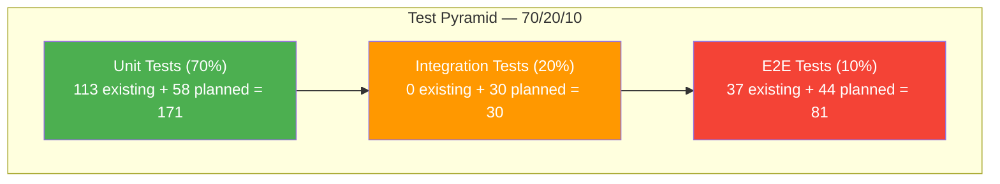

# Localization Module — Test Overview

> **Version:** 1.0.0
> **Date:** 2026-03-12
> **Status:** [IN-PROGRESS] — 150 tests written, 0 executed
> **Module:** `localization-service` (backend) + `administration/master-locale` (frontend)

---

## 1. Test Pyramid

**Governance:** `docs/governance/agents/QA-PRINCIPLES.md` — 70/20/10 pyramid, 80% line coverage, 75% branch coverage

---

## 2. Test Execution Dashboard

| Test Type | Document | Existing | Planned | Total | Passed | Failed | Skipped | Status |
|-----------|----------|----------|---------|-------|--------|--------|---------|--------|
| Backend Unit | [01-Backend-Unit-Tests.md](Unit/01-Backend-Unit-Tests.md) | 46 | 28 | 74 | 0 | 0 | 0 | NOT EXECUTED |
| Frontend Unit | [02-Frontend-Unit-Tests.md](Unit/02-Frontend-Unit-Tests.md) | 72 | 30 | 102 | 0 | 0 | 0 | NOT EXECUTED |
| Backend Integration | [03-Backend-Integration-Tests.md](Integration/03-Backend-Integration-Tests.md) | 0 | 30 | 30 | 0 | 0 | 0 | PLANNED |
| API Contract | [04-API-Contract-Tests.md](Integration/04-API-Contract-Tests.md) | 0 | 22 | 22 | 0 | 0 | 0 | PLANNED |
| Functional E2E | [05-Functional-E2E-Tests.md](E2E/05-Functional-E2E-Tests.md) | 0 | 44 | 44 | 0 | 0 | 0 | PLANNED |
| Responsive | [06-Responsive-Tests.md](E2E/06-Responsive-Tests.md) | 5 | 10 | 15 | 0 | 0 | 0 | NOT EXECUTED |
| Visual Regression | [07-Visual-Regression-Tests.md](E2E/07-Visual-Regression-Tests.md) | 4 | 8 | 12 | 0 | 0 | 0 | NOT EXECUTED |
| Design System | [08-Design-System-Tests.md](UI-UX/08-Design-System-Tests.md) | 44 | 20 | 64 | 0 | 0 | 0 | NOT EXECUTED |
| UI/UX Visual | [09-UI-UX-Visual-Tests.md](UI-UX/09-UI-UX-Visual-Tests.md) | 0 | 25 | 25 | 0 | 0 | 0 | PLANNED |
| WCAG 2.2 Level A | [10-WCAG-2.2-Level-A-Tests.md](Accessibility/10-WCAG-2.2-Level-A-Tests.md) | 4 | 21 | 25 | 0 | 0 | 0 | NOT EXECUTED |
| WCAG 2.2 Level AA | [11-WCAG-2.2-Level-AA-Tests.md](Accessibility/11-WCAG-2.2-Level-AA-Tests.md) | 0 | 13 | 13 | 0 | 0 | 0 | PLANNED |
| WCAG 2.2 Level AAA | [12-WCAG-2.2-Level-AAA-Tests.md](Accessibility/12-WCAG-2.2-Level-AAA-Tests.md) | 0 | 9 | 9 | 0 | 0 | 0 | PLANNED |
| Security | [13-Security-Tests.md](Security/13-Security-Tests.md) | 0 | 23 | 23 | 0 | 0 | 0 | PLANNED |
| Performance | [14-Performance-Tests.md](Performance/14-Performance-Tests.md) | 0 | 10 | 10 | 0 | 0 | 0 | PLANNED |
| Regression | [15-Regression-Suite.md](Regression/15-Regression-Suite.md) | 0 | 30 | 30 | 0 | 0 | 0 | PLANNED |
| Angular CI | [16-Angular-CI-Tests.md](CI/16-Angular-CI-Tests.md) | 0 | 8 | 8 | 0 | 0 | 0 | PLANNED |
| OpenAPI Validation | [17-OpenAPI-Validation-Tests.md](CI/17-OpenAPI-Validation-Tests.md) | 0 | 7 | 7 | 0 | 0 | 0 | PLANNED |
| **TOTALS** | | **175** | **358** | **533** | **0** | **0** | **0** | |

---

## 3. Coverage Summary

| Service / Module | Line Coverage | Branch Coverage | Target |
|-----------------|---------------|-----------------|--------|
| `localization-service` (backend) | NOT MEASURED | NOT MEASURED | 80% / 75% |
| `administration/master-locale` (frontend) | NOT MEASURED | NOT MEASURED | 80% / 75% |
| `e2e/localization-*` (Playwright) | N/A | N/A | Critical paths |

---

## 4. Test Environment Matrix

| Environment | Test Types | Trigger | Tools |
|-------------|-----------|---------|-------|
| **Development (Local)** | Unit, Component | Every code change | JUnit 5 + Mockito, Vitest + TestBed |
| **CI Pipeline** | Unit, Lint, SAST, SCA, BVT, Contract | Every push | GitHub Actions, JaCoCo, ESLint |
| **Staging** | E2E, Responsive, Accessibility, Smoke, Regression, Load, DAST, UAT | Deploy to staging | Playwright, axe-core, k6, OWASP ZAP |
| **Production** | Synthetic Monitoring, Canary | Post-deploy | Prometheus, Grafana |

---

## 5. Quality Gates Checklist

| Gate | Requirement | Status |
|------|-------------|--------|
| Unit test pass rate | 100% (zero failures) | NOT VERIFIED |
| Line coverage | >= 80% | NOT MEASURED |
| Branch coverage | >= 75% | NOT MEASURED |
| E2E critical path | All happy paths pass | NOT EXECUTED |
| WCAG 2.2 AA | Zero axe-core violations | NOT EXECUTED |
| Security scan | Zero CRITICAL/HIGH findings | NOT EXECUTED |
| Performance SLO | Bundle fetch < 200ms (P95) | NOT EXECUTED |
| Bundle size | Main < 500KB, lazy chunks < 100KB | NOT MEASURED |
| Zero CRITICAL defects | All P0/P1 resolved | N/A |

---

## 6. Existing Test Code Files

| File | Type | Tests | Framework |
|------|------|-------|-----------|
| `backend/.../service/LocaleServiceTest.java` | Backend Unit | 12 | JUnit 5 + Mockito |
| `backend/.../service/DictionaryServiceTest.java` | Backend Unit | 15 | JUnit 5 + Mockito |
| `backend/.../controller/LocaleControllerTest.java` | Backend Unit | 9 | MockMvc + @WebMvcTest |
| `backend/.../controller/DictionaryControllerTest.java` | Backend Unit | 10 | MockMvc + @WebMvcTest |
| `frontend/.../admin-locale.service.spec.ts` | Frontend Unit | 17 | Vitest + Angular TestBed |
| `frontend/.../master-locale-section.component.spec.ts` | Frontend Unit | 11 | Vitest + Angular TestBed |
| `frontend/.../master-locale-design-system.spec.ts` | Frontend Unit | 44 | Vitest + DOM queries |
| `frontend/e2e/localization-design-system.spec.ts` | E2E | 37 | Playwright |

**Total existing tests: 155** (46 backend + 72 frontend unit + 37 E2E)

---

## 7. Source Documents

| Document | Purpose |
|----------|---------|
| `docs/Localization/Design/01-PRD.md` | FR-01 to FR-15, NFR-01 to NFR-10, BR-01 to BR-18 |
| `docs/Localization/Design/15-Test-Strategy.md` | Test pyramid, coverage targets, environment matrix |
| `docs/Localization/Design/16-Playwright-Test-Plan.md` | 5 E2E suites, 50 test scenarios |
| `docs/Localization/Backlog/05-Scenario-Matrix.md` | 118 scenarios (happy + alt + edge) |
| `docs/governance/agents/QA-PRINCIPLES.md` | 70/20/10 pyramid, 80% coverage target |
| [18-Requirements-Traceability.md](Traceability/18-Requirements-Traceability.md) | FR/NFR/BR to test case mapping |
