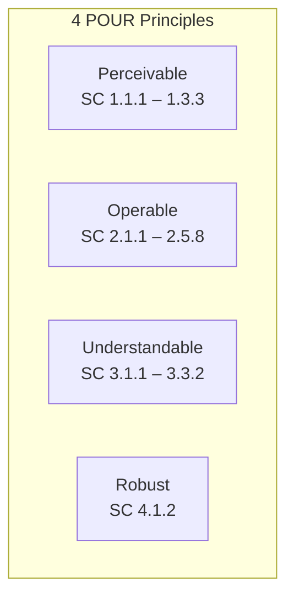

# WCAG 2.2 Level A Tests — Localization Module

> **Version:** 1.0.0
> **Date:** 2026-03-12
> **Status:** [IN-PROGRESS] — 4 existing axe-core tests (in E2E file), 21 planned
> **Framework:** Playwright 1.55.0 + @axe-core/playwright 4.11.1
> **Standard:** WCAG 2.2 Level A (minimum conformance)
> **axe-core tags:** `['wcag2a', 'wcag22a']`

---

## 1. Overview

WCAG 2.2 Level A defines the **minimum** accessibility requirements. Failure at Level A means content is inaccessible to many users with disabilities.



---

## 2. Existing Accessibility Tests

**File:** `frontend/e2e/localization-design-system.spec.ts`

| ID | Test Name | WCAG SC | Status |
|----|-----------|---------|--------|
| A11Y-E-01 | `Languages tab should pass WCAG 2.1 AA` | Multi-SC (axe-core full scan) | WRITTEN |
| A11Y-E-02 | `Dictionary tab should pass WCAG 2.1 AA` | Multi-SC (axe-core full scan) | WRITTEN |
| A11Y-E-03 | `Import/Export tab should pass WCAG 2.1 AA` | Multi-SC (axe-core full scan) | WRITTEN |
| A11Y-E-04 | `Rollback tab should pass WCAG 2.1 AA` | Multi-SC (axe-core full scan) | WRITTEN |

> **Note:** These existing tests use `wcag2aa` tags. Dedicated Level A tests below provide SC-specific granularity.

---

## 3. WCAG 2.2 Level A Success Criteria Tests

### Principle 1: Perceivable

#### 1.1.1 Non-text Content

| ID | Test | Element | Assertion | Status |
|----|------|---------|-----------|--------|
| A-1.1.1-01 | Flag emojis have accessible text | Flag emoji spans | `aria-label` or `role="img"` with alt text | PLANNED |
| A-1.1.1-02 | Action icons have ARIA labels | Edit, delete, export icons | `aria-label` on icon buttons | PLANNED |
| A-1.1.1-03 | Spinner has accessible name | Loading spinner | `role="status"` + `aria-label="Loading"` | PLANNED |

#### 1.3.1 Info and Relationships

| ID | Test | Element | Assertion | Status |
|----|------|---------|-----------|--------|
| A-1.3.1-01 | Table headers use `<th>` | Languages/Dictionary tables | `<th scope="col">` for column headers | PLANNED |
| A-1.3.1-02 | Form inputs have labels | Search, edit dialog inputs | `<label for="...">` or `aria-labelledby` | PLANNED |
| A-1.3.1-03 | Radio group has fieldset/legend | Alternative locale radios | `<fieldset>` + `<legend>` or `role="radiogroup"` + `aria-label` | PLANNED |
| A-1.3.1-04 | Tab bar uses ARIA tabs pattern | Tab buttons | `role="tablist"` + `role="tab"` + `aria-selected` | PLANNED |

#### 1.3.2 Meaningful Sequence

| ID | Test | Element | Assertion | Status |
|----|------|---------|-----------|--------|
| A-1.3.2-01 | DOM order matches visual (LTR) | Full page | Tab order follows visual top-to-bottom, left-to-right | PLANNED |
| A-1.3.2-02 | DOM order matches visual (RTL) | Full page (Arabic) | Tab order follows visual top-to-bottom, right-to-left | PLANNED |

#### 1.3.3 Sensory Characteristics

| ID | Test | Element | Assertion | Status |
|----|------|---------|-----------|--------|
| A-1.3.3-01 | Status not conveyed by color alone | Active/inactive toggle, coverage bar | Text label or icon accompanies color indicator | PLANNED |

### Principle 2: Operable

#### 2.1.1 Keyboard

| ID | Test | Element | Assertion | Status |
|----|------|---------|-----------|--------|
| A-2.1.1-01 | All tabs reachable via Tab key | Tab bar | All 4 tabs reachable and activatable via Enter/Space | PLANNED |
| A-2.1.1-02 | Toggle switches keyboard operable | p-toggleSwitch | Activatable via Space/Enter | PLANNED |
| A-2.1.1-03 | Dialog keyboard operable | Edit dialog | Tab cycles through dialog fields, Enter submits | PLANNED |
| A-2.1.1-04 | Language switcher keyboard operable | Dropdown | Arrow keys navigate, Enter selects, Escape closes | PLANNED |

#### 2.1.2 No Keyboard Trap

| ID | Test | Element | Assertion | Status |
|----|------|---------|-----------|--------|
| A-2.1.2-01 | Dialog focus trap is escapable | Edit/confirm dialogs | Escape key closes dialog, focus returns to trigger | PLANNED |

#### 2.4.1 Bypass Blocks

| ID | Test | Element | Assertion | Status |
|----|------|---------|-----------|--------|
| A-2.4.1-01 | Skip navigation link | Page level | "Skip to main content" link present, visible on focus | PLANNED |

#### 2.4.2 Page Titled

| ID | Test | Element | Assertion | Status |
|----|------|---------|-----------|--------|
| A-2.4.2-01 | Title includes section name | `<title>` | Title contains "Localization" or current tab name | PLANNED |

#### 2.5.8 Target Size (Minimum) — New in WCAG 2.2

| ID | Test | Element | Assertion | Status |
|----|------|---------|-----------|--------|
| A-2.5.8-01 | Touch targets >= 24x24px | All interactive elements | `offsetWidth >= 24` and `offsetHeight >= 24` | PLANNED |

### Principle 3: Understandable

#### 3.1.1 Language of Page

| ID | Test | Element | Assertion | Status |
|----|------|---------|-----------|--------|
| A-3.1.1-01 | HTML lang attribute set | `<html>` | `lang` attribute matches active locale | PLANNED |

#### 3.3.2 Labels or Instructions

| ID | Test | Element | Assertion | Status |
|----|------|---------|-----------|--------|
| A-3.3.2-01 | All form inputs have visible labels | Search, edit fields | Visible `<label>` or placeholder with `aria-label` | PLANNED |

### Principle 4: Robust

#### 4.1.2 Name, Role, Value

| ID | Test | Element | Assertion | Status |
|----|------|---------|-----------|--------|
| A-4.1.2-01 | Custom toggle exposes state | p-toggleSwitch | `aria-checked="true/false"` | PLANNED |
| A-4.1.2-02 | Custom tag has role | p-tag | `role` attribute or semantic HTML | PLANNED |

---

## 4. Automated axe-core Scan

```typescript
import { test, expect } from '@playwright/test';
import AxeBuilder from '@axe-core/playwright';

test('Languages tab passes WCAG 2.2 Level A', async ({ page }) => {
  await page.goto('/admin/localization');
  await page.waitForSelector('.locale-section p-table');

  const results = await new AxeBuilder({ page })
    .withTags(['wcag2a', 'wcag22a'])
    .analyze();

  expect(results.violations).toEqual([]);
});
```

---

## 5. Execution Commands

```bash
# Run Level A accessibility tests
npx playwright test e2e/localization-a11y-level-a.spec.ts

# Run with detailed violation output
npx playwright test e2e/localization-a11y-level-a.spec.ts --reporter=list
```

---

## 6. Pass Criteria

| Criteria | Threshold |
|----------|-----------|
| axe-core violations at Level A | **0 violations** |
| Keyboard operability | All interactive elements reachable and activatable |
| ARIA compliance | All custom components expose correct roles/states |
| Target size | All targets >= 24x24px |
