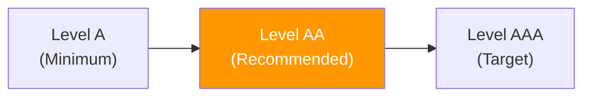

# WCAG 2.2 Level AA Tests — Localization Module

> **Version:** 1.0.0
> **Date:** 2026-03-12
> **Status:** [PLANNED] — 0 written, 0 executed
> **Framework:** Playwright 1.55.0 + @axe-core/playwright 4.11.1
> **Standard:** WCAG 2.2 Level AA (recommended conformance)
> **axe-core tags:** `['wcag2aa', 'wcag22aa']`

---

## 1. Overview

WCAG 2.2 Level AA builds on Level A with 13 additional success criteria. This is the **recommended** conformance level for most web applications and the legal standard in many jurisdictions.



---

## 2. WCAG 2.2 Level AA Success Criteria Tests

### Principle 1: Perceivable

#### 1.4.3 Contrast (Minimum)

| ID | Test | Element | Assertion | Status |
|----|------|---------|-----------|--------|
| AA-1.4.3-01 | Normal text contrast >= 4.5:1 | All text elements | Contrast ratio against background >= 4.5:1 | PLANNED |
| AA-1.4.3-02 | Large text contrast >= 3:1 | Headings, tab labels (>=18pt or >=14pt bold) | Contrast ratio >= 3:1 | PLANNED |
| AA-1.4.3-03 | Error message contrast | `.error-banner` text | Deep Umber (#6b1f2a) on background >= 4.5:1 | PLANNED |

#### 1.4.4 Resize Text

| ID | Test | Element | Assertion | Status |
|----|------|---------|-----------|--------|
| AA-1.4.4-01 | Text resizable to 200% | Full page | No content loss or overlap at 200% zoom | PLANNED |

#### 1.4.5 Images of Text

| ID | Test | Element | Assertion | Status |
|----|------|---------|-----------|--------|
| AA-1.4.5-01 | No images of text | All UI elements | No text rendered as images (logos excepted) | PLANNED |

#### 1.4.11 Non-text Contrast

| ID | Test | Element | Assertion | Status |
|----|------|---------|-----------|--------|
| AA-1.4.11-01 | Toggle switch contrast | p-toggleSwitch | Track/thumb contrast against background >= 3:1 | PLANNED |
| AA-1.4.11-02 | Icon contrast | Action icons (edit, delete, export) | Icon color against background >= 3:1 | PLANNED |
| AA-1.4.11-03 | Coverage bar contrast | `.coverage-bar .fill` | Fill color against empty track >= 3:1 | PLANNED |

### Principle 2: Operable

#### 2.4.7 Focus Visible

| ID | Test | Element | Assertion | Status |
|----|------|---------|-----------|--------|
| AA-2.4.7-01 | Focus indicator on buttons | Tab buttons, action buttons | `outline: 3px solid #054239` visible on focus | PLANNED |
| AA-2.4.7-02 | Focus indicator on inputs | Search input, edit fields | Visible focus ring on keyboard focus | PLANNED |
| AA-2.4.7-03 | Focus indicator on links | All `<a>` elements | Visible focus ring | PLANNED |

#### 2.5.7 Dragging Movements — New in WCAG 2.2

| ID | Test | Element | Assertion | Status |
|----|------|---------|-----------|--------|
| AA-2.5.7-01 | No drag-only interactions | All UI | No features require drag-and-drop; keyboard alternatives exist | PLANNED |

### Principle 3: Understandable

#### 3.1.2 Language of Parts

| ID | Test | Element | Assertion | Status |
|----|------|---------|-----------|--------|
| AA-3.1.2-01 | RTL translation text has lang attr | Arabic translation cells | `lang="ar"` on Arabic content elements | PLANNED |

#### 3.2.6 Consistent Help — New in WCAG 2.2

| ID | Test | Element | Assertion | Status |
|----|------|---------|-----------|--------|
| AA-3.2.6-01 | Help mechanism in consistent location | Help link/icon | If help exists, it appears in same relative position on all pages | PLANNED |

#### 3.3.8 Accessible Authentication (Minimum) — New in WCAG 2.2

| ID | Test | Element | Assertion | Status |
|----|------|---------|-----------|--------|
| AA-3.3.8-01 | Login doesn't require cognitive test | Login page | No CAPTCHA required; password managers work; copy-paste enabled | PLANNED |

---

## 3. Automated axe-core Scan

```typescript
test('Languages tab passes WCAG 2.2 Level AA', async ({ page }) => {
  await page.goto('/admin/localization');
  await page.waitForSelector('.locale-section p-table');

  const results = await new AxeBuilder({ page })
    .withTags(['wcag2a', 'wcag2aa', 'wcag22a', 'wcag22aa'])
    .analyze();

  expect(results.violations).toEqual([]);
});
```

---

## 4. Manual Verification Checklist

Some Level AA criteria cannot be fully automated:

| SC | Criteria | Manual Check |
|----|----------|-------------|
| 1.4.4 | Resize Text | Manually zoom to 200%, verify no content loss |
| 2.4.7 | Focus Visible | Tab through all elements, verify 3px focus ring |
| 2.5.7 | Dragging Movements | Verify no drag-only features exist |
| 3.2.6 | Consistent Help | Cross-page comparison of help location |
| 3.3.8 | Accessible Authentication | Verify CAPTCHA not required, paste works |

---

## 5. Contrast Reference Table

| Element | Foreground | Background | Ratio | Target | Status |
|---------|-----------|------------|-------|--------|--------|
| Body text | `#333333` | `#edebe0` | ~10:1 | 4.5:1 | TO VERIFY |
| Active tab border | `#428177` | `#edebe0` | ~3.5:1 | 3:1 (large) | TO VERIFY |
| Error banner text | `#ffffff` | `#6b1f2a` | ~8:1 | 4.5:1 | TO VERIFY |
| Focus outline | `#054239` | `#edebe0` | ~8:1 | 3:1 | TO VERIFY |
| Toggle ON track | `#428177` | `#edebe0` | ~3.5:1 | 3:1 (UI component) | TO VERIFY |

---

## 6. Execution Commands

```bash
# Run Level AA accessibility tests
npx playwright test e2e/localization-a11y-level-aa.spec.ts

# Run combined A + AA scan
npx playwright test e2e/localization-a11y-level-aa.spec.ts --grep "WCAG"
```
