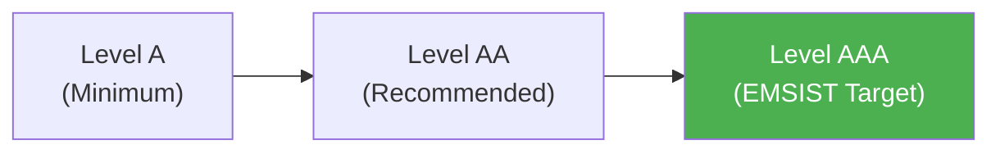

# WCAG 2.2 Level AAA Tests — Localization Module

> **Version:** 1.0.0
> **Date:** 2026-03-12
> **Status:** [PLANNED] — 0 written, 0 executed
> **Framework:** Playwright 1.55.0 + @axe-core/playwright 4.11.1
> **Standard:** WCAG 2.2 Level AAA (EMSIST target — enhanced conformance)
> **axe-core tags:** `['wcag2aaa']`

---

## 1. Overview

WCAG 2.2 Level AAA is the **highest** conformance level. EMSIST targets Level AAA as per `NFR-06` and `docs/governance/agents/QA-PRINCIPLES.md`.



> **Note:** WCAG 2.2 updated some criteria numbering from 2.1. This document uses WCAG 2.2 numbering.

---

## 2. WCAG 2.2 Level AAA Success Criteria Tests

### Principle 1: Perceivable

#### 1.4.6 Contrast (Enhanced)

| ID | Test | Element | Assertion | Status |
|----|------|---------|-----------|--------|
| AAA-1.4.6-01 | Normal text contrast >= 7:1 | All body/table text | Contrast ratio against background >= 7:1 | PLANNED |
| AAA-1.4.6-02 | Large text contrast >= 4.5:1 | Headings, tab labels | Contrast ratio against background >= 4.5:1 | PLANNED |

**Verification approach:**
```typescript
// Extract computed styles and calculate contrast
const textColor = await element.evaluate(el => getComputedStyle(el).color);
const bgColor = await element.evaluate(el => getComputedStyle(el).backgroundColor);
const ratio = calculateContrastRatio(textColor, bgColor);
expect(ratio).toBeGreaterThanOrEqual(7);
```

#### 1.4.8 Visual Presentation

| ID | Test | Element | Assertion | Status |
|----|------|---------|-----------|--------|
| AAA-1.4.8-01 | Line spacing >= 1.5 | Body text, table cells | `line-height >= 1.5` | PLANNED |
| AAA-1.4.8-02 | Paragraph spacing >= 2x font size | Content paragraphs | `margin-bottom >= 2 * font-size` | PLANNED |
| AAA-1.4.8-03 | Max 80 characters per line | Body text, table cells | `max-width` limits line length to ~80ch | PLANNED |

#### 1.4.9 Images of Text (No Exception)

| ID | Test | Element | Assertion | Status |
|----|------|---------|-----------|--------|
| AAA-1.4.9-01 | Absolutely no images of text | All UI | Zero text rendered as images (even logos use SVG text) | PLANNED |

### Principle 2: Operable

#### 2.4.9 Link Purpose (Link Only)

| ID | Test | Element | Assertion | Status |
|----|------|---------|-----------|--------|
| AAA-2.4.9-01 | All links have descriptive text | All `<a>` elements | No "click here", "read more", or "link" as link text | PLANNED |

#### 2.4.10 Section Headings

| ID | Test | Element | Assertion | Status |
|----|------|---------|-----------|--------|
| AAA-2.4.10-01 | All content sections have headings | Page sections | Each major section (Languages, Dictionary, etc.) has `<h2>`+ heading | PLANNED |

### Principle 3: Understandable

#### 3.2.5 Change on Request

| ID | Test | Element | Assertion | Status |
|----|------|---------|-----------|--------|
| AAA-3.2.5-01 | No automatic context changes | Language switch | Language switch only happens on explicit user click (not auto-detect) | PLANNED |
| AAA-3.2.5-02 | Tab switching is user-initiated | Tab bar | Tab content only changes on explicit click/Enter | PLANNED |

#### 3.3.6 Error Prevention (All)

| ID | Test | Element | Assertion | Status |
|----|------|---------|-----------|--------|
| AAA-3.3.6-01 | Confirmation for rollback | Rollback action | Confirm dialog before rollback execution | PLANNED |
| AAA-3.3.6-02 | Confirmation for import commit | Import commit | Confirm dialog before import finalization | PLANNED |
| AAA-3.3.6-03 | Confirmation for deactivate | Deactivate locale | Confirm dialog before deactivation | PLANNED |
| AAA-3.3.6-04 | Confirmation for delete override | Delete tenant override | Confirm dialog before deletion | PLANNED |

---

## 3. Automated axe-core Scan

```typescript
test('Languages tab passes WCAG 2.2 Level AAA', async ({ page }) => {
  await page.goto('/admin/localization');
  await page.waitForSelector('.locale-section p-table');

  const results = await new AxeBuilder({ page })
    .withTags(['wcag2a', 'wcag2aa', 'wcag2aaa', 'wcag22a', 'wcag22aa'])
    .analyze();

  expect(results.violations).toEqual([]);
});
```

---

## 4. Enhanced Contrast Reference

| Element | Foreground | Background | Ratio Required | Status |
|---------|-----------|------------|----------------|--------|
| Body text | `#333333` | `#edebe0` | >= 7:1 | TO VERIFY |
| Table cell text | `#333333` | `#ffffff` | >= 7:1 | TO VERIFY |
| Tab labels | `#333333` | `#edebe0` | >= 7:1 (normal) or >= 4.5:1 (large) | TO VERIFY |
| Error banner text | `#ffffff` | `#6b1f2a` | >= 7:1 | TO VERIFY |
| Placeholder text | `#888888` | `#ffffff` | >= 7:1 | MAY FAIL |
| Disabled text | `#aaaaaa` | `#edebe0` | >= 7:1 | MAY FAIL |

> **Risk:** Placeholder text and disabled states often fail AAA contrast. May need darker colors.

---

## 5. Manual Verification Checklist

| SC | Criteria | Manual Verification Steps |
|----|----------|--------------------------|
| 1.4.8 | Visual Presentation | Inspect `line-height`, `margin-bottom`, max line length via DevTools |
| 2.4.9 | Link Purpose | Read each link — must be understandable without surrounding context |
| 2.4.10 | Section Headings | Verify heading hierarchy (no skipped levels) |
| 3.2.5 | Change on Request | Verify no auto-redirect on locale detection |
| 3.3.6 | Error Prevention | Click each destructive action, verify confirm dialog appears |

---

## 6. WCAG 2.2 Changes from 2.1

| 2.1 Criterion | 2.2 Status | Impact |
|---------------|------------|--------|
| 4.1.1 Parsing | **Removed** in WCAG 2.2 (obsolete with HTML5) | No longer tested |
| 2.4.11 Focus Not Obscured (Minimum) | **New** in 2.2 (Level AA) | Tested in Level AA doc |
| 2.4.12 Focus Not Obscured (Enhanced) | **New** in 2.2 (Level AAA) | Focus indicator fully visible, not covered by sticky headers |
| 2.4.13 Focus Appearance | **New** in 2.2 (Level AAA) | Focus indicator area >= 2px, contrast >= 3:1 |
| 3.3.7 Redundant Entry | **New** in 2.2 (Level A) | Previously entered info auto-populated |
| 3.3.9 Accessible Authentication (Enhanced) | **New** in 2.2 (Level AAA) | No cognitive function test at all |

### Additional 2.2 AAA Criteria

| ID | Test | WCAG SC | Assertion | Status |
|----|------|---------|-----------|--------|
| AAA-2.4.12-01 | Focus not obscured (enhanced) | 2.4.12 | Focused element fully visible (not behind sticky header/footer) | PLANNED |
| AAA-2.4.13-01 | Focus appearance | 2.4.13 | Focus indicator: area >= 2px outline, contrast >= 3:1 against adjacent | PLANNED |
| AAA-3.3.9-01 | Accessible auth (enhanced) | 3.3.9 | No cognitive function test for authentication | PLANNED |

---

## 7. Execution Commands

```bash
# Run Level AAA accessibility tests
npx playwright test e2e/localization-a11y-level-aaa.spec.ts

# Run full accessibility suite (A + AA + AAA)
npx playwright test e2e/localization-a11y*.spec.ts
```

---

## 8. Pass Criteria

| Level | axe-core Violations | Manual Checks | Overall |
|-------|--------------------|---------------|---------|
| A | 0 violations | All pass | REQUIRED |
| AA | 0 violations | All pass | REQUIRED |
| AAA | 0 violations | All pass | TARGET (best effort) |

> **Note:** Some AAA criteria (especially 1.4.6 enhanced contrast for disabled states) may require design concessions. These should be documented as known exceptions with justification.
