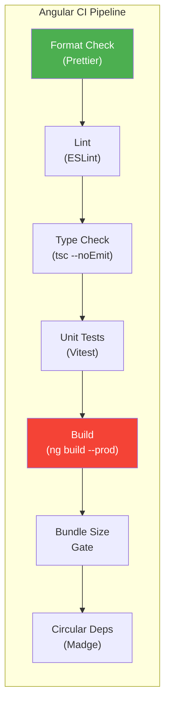

# Angular CI Tests — Localization Module

> **Version:** 1.0.0
> **Date:** 2026-03-12
> **Status:** [PLANNED] — 0 executed
> **Framework:** Angular 21 CLI, ESLint, TypeScript 5.x, Madge
> **CI Pipeline:** GitHub Actions / GitLab CI
> **Existing command:** `npm run validate` = `format:check && lint && typecheck && test && build`

---

## 1. Overview



**Gate:** All steps must pass to merge PR. Failure blocks merge.

---

## 2. CI Quality Gates

### 2.1 Build Verification

| ID | Gate | Command | Pass Criteria | Status |
|----|------|---------|---------------|--------|
| CI-BUILD-01 | Production build | `ng build --configuration=production` | Zero errors, zero warnings | PLANNED |
| CI-BUILD-02 | AOT compilation | Implicit in `ng build` (AOT default) | No JIT fallback errors | PLANNED |

### 2.2 Linting

| ID | Gate | Command | Pass Criteria | Status |
|----|------|---------|---------------|--------|
| CI-LINT-01 | ESLint pass | `ng lint` | Zero errors, zero warnings | PLANNED |
| CI-LINT-02 | No `any` type | ESLint `@typescript-eslint/no-explicit-any` | Zero violations | PLANNED |
| CI-LINT-03 | Strict templates | Angular `strictTemplates` in `tsconfig.json` | No type errors in templates | PLANNED |
| CI-LINT-04 | i18n hardcoded strings | Custom ESLint rule or `ng-i18n-checker` | No hardcoded user-facing strings in templates | PLANNED |
| CI-LINT-05 | Translate pipe usage | Custom rule: `translate` pipe references valid keys | No orphaned translation keys | PLANNED |

### 2.3 Type Checking

| ID | Gate | Command | Pass Criteria | Status |
|----|------|---------|---------------|--------|
| CI-TYPE-01 | TypeScript strict mode | `npx tsc --noEmit` | Zero type errors | PLANNED |
| CI-TYPE-02 | No implicit any | `tsconfig.json → "noImplicitAny": true` | No implicit any warnings | PLANNED |

### 2.4 Bundle Size Gates

| ID | Gate | Measurement | Threshold | Status |
|----|------|-------------|-----------|--------|
| CI-SIZE-01 | Main bundle | `dist/browser/main.*.js` (gzipped) | < 500KB | PLANNED |
| CI-SIZE-02 | Lazy chunks | `dist/browser/chunk-*.js` each | < 100KB each | PLANNED |
| CI-SIZE-03 | Total assets | Sum of all JS/CSS assets | < 2MB (gzipped) | PLANNED |

### 2.5 Circular Dependency Detection

| ID | Gate | Command | Pass Criteria | Status |
|----|------|---------|---------------|--------|
| CI-CIRC-01 | Zero circular deps | `npx madge --circular src/` | Zero cycles detected | PLANNED |

### 2.6 Format Checking

| ID | Gate | Command | Pass Criteria | Status |
|----|------|---------|---------------|--------|
| CI-FMT-01 | Prettier format check | `npx prettier --check "src/**/*.{ts,html,scss}"` | All files formatted | PLANNED |

---

## 3. i18n-Specific CI Rules

### 3.1 Hardcoded String Detection

```javascript
// .eslintrc.json — custom rule concept
{
  "rules": {
    "no-hardcoded-strings": ["error", {
      "patterns": [
        // Flag text content in Angular templates
        "(?<=>)[A-Z][a-z]+ [a-z]+(?=<)",
        // Flag string literals in component classes
        "label\\s*=\\s*['\"][A-Z]"
      ],
      "exclude": ["*.spec.ts", "*.mock.ts"]
    }]
  }
}
```

### 3.2 Translation Key Validation

| Check | Description | Implementation |
|-------|-------------|----------------|
| Orphaned keys | Keys in bundle but not used in code | `grep -r "translate" src/ \| extract keys \| diff with bundle` |
| Missing keys | Keys used in code but not in bundle | Same diff, reverse direction |
| Duplicate keys | Same key defined twice | `jq 'keys \| group_by(.) \| map(select(length > 1))' en-US.json` |

---

## 4. CI Pipeline Configuration

```yaml
# .github/workflows/angular-ci.yml (conceptual)
angular-ci:
  runs-on: ubuntu-latest
  steps:
    - uses: actions/checkout@v4
    - uses: actions/setup-node@v4
      with:
        node-version: '22'
        cache: 'npm'
        cache-dependency-path: frontend/package-lock.json

    - name: Install dependencies
      run: cd frontend && npm ci

    - name: Format check
      run: cd frontend && npx prettier --check "src/**/*.{ts,html,scss}"

    - name: Lint
      run: cd frontend && ng lint

    - name: Type check
      run: cd frontend && npx tsc --noEmit

    - name: Unit tests
      run: cd frontend && npx vitest run --coverage

    - name: Build
      run: cd frontend && ng build --configuration=production

    - name: Bundle size check
      run: |
        MAIN_SIZE=$(stat -f%z frontend/dist/browser/main.*.js 2>/dev/null || stat -c%s frontend/dist/browser/main.*.js)
        if [ "$MAIN_SIZE" -gt 524288 ]; then echo "Main bundle too large: $MAIN_SIZE bytes"; exit 1; fi

    - name: Circular dependency check
      run: cd frontend && npx madge --circular src/
```

---

## 5. Execution Commands

```bash
# Full validate pipeline (local)
cd frontend
npm run validate  # format:check && lint && typecheck && test && build

# Individual gates
npx prettier --check "src/**/*.{ts,html,scss}"
ng lint
npx tsc --noEmit
npx vitest run
ng build --configuration=production
npx madge --circular src/
```

---

## 6. Pass Criteria

| Gate | Threshold | Blocks Merge |
|------|-----------|-------------|
| Format | 0 unformatted files | YES |
| Lint | 0 errors (warnings allowed) | YES |
| Type check | 0 errors | YES |
| Unit tests | 100% pass rate | YES |
| Build | 0 errors, 0 warnings | YES |
| Bundle size | Main < 500KB gzipped | YES |
| Circular deps | 0 cycles | YES |
