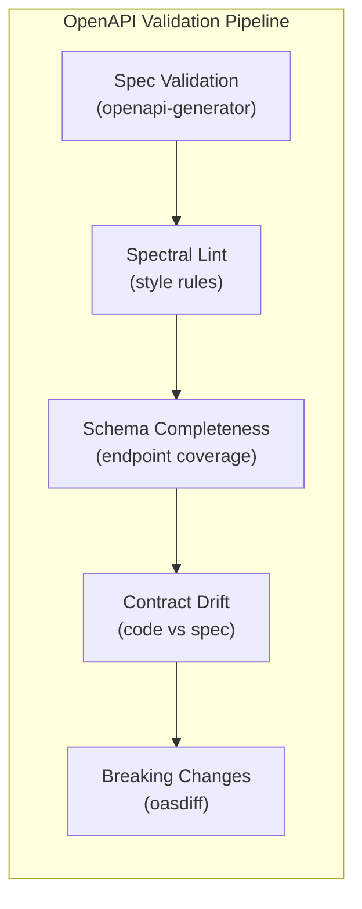

# OpenAPI Validation Tests — Localization Service

> **Version:** 1.0.0
> **Date:** 2026-03-12
> **Status:** [PLANNED] — 0 written, 0 executed
> **Framework:** openapi-generator-cli, Spectral, oasdiff
> **Spec:** `backend/localization-service/openapi.yaml` (OpenAPI 3.1)

---

## 1. Overview



**Trigger:** Every push that modifies `openapi.yaml` or controller files.

---

## 2. Spec Validation

| ID | Test | Command | Pass Criteria | Status |
|----|------|---------|---------------|--------|
| OA-SV-01 | Valid OpenAPI 3.1 | `openapi-generator-cli validate -i openapi.yaml` | Zero errors | PLANNED |
| OA-SV-02 | All `$ref` references resolve | Implicit in validation | No broken $ref pointers | PLANNED |

---

## 3. Schema Completeness

### 3.1 Endpoint Coverage

All localization-service controller endpoints must be documented in `openapi.yaml`:

| ID | Endpoint | Method | Controller | Status |
|----|----------|--------|------------|--------|
| OA-EP-01 | `/api/v1/locales` | GET | `LocaleController.searchLocales()` | PLANNED |
| OA-EP-02 | `/api/v1/locales/active` | GET | `LocaleController.getActiveLocales()` | PLANNED |
| OA-EP-03 | `/api/v1/locales/detect` | GET | `LocaleController.detectLocale()` | PLANNED |
| OA-EP-04 | `/api/v1/locales/{id}/activate` | PUT | `LocaleController.activate()` | PLANNED |
| OA-EP-05 | `/api/v1/locales/{id}/deactivate` | PUT | `LocaleController.deactivate()` | PLANNED |
| OA-EP-06 | `/api/v1/locales/{id}/alternative` | PUT | `LocaleController.setAlternative()` | PLANNED |
| OA-EP-07 | `/api/v1/dictionary` | GET | `DictionaryController.search()` | PLANNED |
| OA-EP-08 | `/api/v1/dictionary/{id}` | GET | `DictionaryController.getById()` | PLANNED |
| OA-EP-09 | `/api/v1/dictionary/{id}/translations` | PUT | `DictionaryController.updateTranslations()` | PLANNED |
| OA-EP-10 | `/api/v1/dictionary/register` | POST | `DictionaryController.registerKeys()` | PLANNED |
| OA-EP-11 | `/api/v1/dictionary/export` | GET | `DictionaryController.exportCsv()` | PLANNED |
| OA-EP-12 | `/api/v1/dictionary/import/preview` | POST | `DictionaryController.importPreview()` | PLANNED |
| OA-EP-13 | `/api/v1/dictionary/import/commit` | POST | `DictionaryController.importCommit()` | PLANNED |
| OA-EP-14 | `/api/v1/dictionary/versions` | GET | `DictionaryController.getVersions()` | PLANNED |
| OA-EP-15 | `/api/v1/dictionary/rollback/{versionId}` | POST | `DictionaryController.rollback()` | PLANNED |
| OA-EP-16 | `/api/v1/dictionary/coverage/{localeCode}` | GET | `DictionaryController.getCoverage()` | PLANNED |
| OA-EP-17 | `/api/v1/bundles/{localeCode}` | GET | `BundleController.getBundle()` | PLANNED |
| OA-EP-18 | `/api/v1/user-locale` | GET | `UserLocaleController.getUserLocale()` | PLANNED |
| OA-EP-19 | `/api/v1/user-locale` | PUT | `UserLocaleController.setUserLocale()` | PLANNED |
| OA-EP-20 | `/api/v1/tenant-overrides` | GET | `TenantOverrideController.list()` | PLANNED |
| OA-EP-21 | `/api/v1/tenant-overrides` | POST | `TenantOverrideController.create()` | PLANNED |
| OA-EP-22 | `/api/v1/tenant-overrides/{id}` | DELETE | `TenantOverrideController.delete()` | PLANNED |

---

## 4. Request/Response Schema Accuracy

| ID | Test | DTO Class | Schema | Checks | Status |
|----|------|-----------|--------|--------|--------|
| OA-SC-01 | SystemLocaleDto schema match | `SystemLocaleDto.java` | `#/components/schemas/SystemLocale` | Field names, types, required flags | PLANNED |
| OA-SC-02 | DictionaryEntryDto schema match | `DictionaryEntryDto.java` | `#/components/schemas/DictionaryEntry` | Map type for translations | PLANNED |
| OA-SC-03 | ImportPreviewDto schema match | `ImportPreviewDto.java` | `#/components/schemas/ImportPreview` | previewToken, counts, errors array | PLANNED |
| OA-SC-04 | DictionaryVersionDto schema match | `DictionaryVersionDto.java` | `#/components/schemas/DictionaryVersion` | No snapshotData field | PLANNED |
| OA-SC-05 | TenantOverrideDto schema match | `TenantOverrideDto.java` | `#/components/schemas/TenantOverride` | tenantId, entryId, localeCode, value | PLANNED |

---

## 5. Error Response Consistency

| ID | Test | Assertion | Status |
|----|------|-----------|--------|
| OA-ER-01 | All admin endpoints document 401 | Unauthorized response schema present | PLANNED |
| OA-ER-02 | All admin endpoints document 403 | Forbidden response schema present | PLANNED |
| OA-ER-03 | All GET-by-ID endpoints document 404 | Not Found response schema present | PLANNED |
| OA-ER-04 | Mutation endpoints document 400 | Validation error schema present | PLANNED |
| OA-ER-05 | Conflict endpoints document 409 | Conflict error (deactivate alt, duplicate code) | PLANNED |
| OA-ER-06 | Rate-limited endpoints document 429 | Import preview documents rate limit | PLANNED |

---

## 6. Contract Drift Detection

| ID | Test | Method | Assertion | Status |
|----|------|--------|-----------|--------|
| OA-CD-01 | No undocumented endpoints | Compare controller `@RequestMapping` vs openapi.yaml paths | All controller endpoints in spec | PLANNED |
| OA-CD-02 | No orphaned spec paths | Compare openapi.yaml paths vs controller annotations | All spec paths have controllers | PLANNED |
| OA-CD-03 | Parameter types match | Compare `@RequestParam` types vs spec parameter schemas | Exact type match | PLANNED |

---

## 7. Breaking Change Detection

| ID | Test | Tool | Assertion | Status |
|----|------|------|-----------|--------|
| OA-BC-01 | No breaking changes vs previous version | `oasdiff breaking old.yaml new.yaml` | Zero breaking changes | PLANNED |

**Breaking change categories checked by `oasdiff`:**
- Removed endpoints
- Changed request body (required fields added)
- Changed response structure (fields removed)
- Path parameter changes
- Authentication requirements changed

---

## 8. Spectral Linting Rules

```yaml
# .spectral.yml
extends: spectral:oas
rules:
  operation-operationId: error
  operation-description: warn
  operation-tags: error
  info-description: error
  oas3-valid-media-example: error
  oas3-api-servers: warn
  # Custom rules
  must-have-security:
    given: "$.paths[*][get,post,put,delete,patch]"
    then:
      field: security
      function: truthy
    severity: warn
    message: "Operations should define security requirements"
```

---

## 9. Execution Commands

```bash
# Validate OpenAPI spec
openapi-generator-cli validate -i backend/localization-service/openapi.yaml

# Spectral lint
npx @stoplight/spectral-cli lint backend/localization-service/openapi.yaml

# Breaking change detection
oasdiff breaking \
  backend/localization-service/openapi-previous.yaml \
  backend/localization-service/openapi.yaml

# Contract drift detection (custom script)
./scripts/check-openapi-drift.sh
```

---

## 10. CI Integration

```yaml
openapi-validation:
  runs-on: ubuntu-latest
  if: contains(github.event.head_commit.modified, 'openapi.yaml') ||
      contains(github.event.head_commit.modified, 'Controller.java')
  steps:
    - uses: actions/checkout@v4
    - run: npm install -g @openapitools/openapi-generator-cli @stoplight/spectral-cli
    - run: openapi-generator-cli validate -i backend/localization-service/openapi.yaml
    - run: spectral lint backend/localization-service/openapi.yaml
    - run: oasdiff breaking old.yaml new.yaml || echo "Breaking changes detected!"
```
