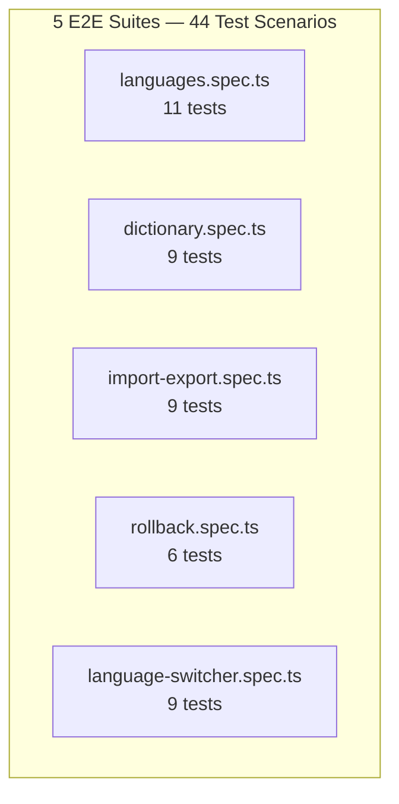

# Functional E2E Tests — Localization Module

> **Version:** 1.0.0
> **Date:** 2026-03-12
> **Status:** [PLANNED] — 0 functional E2E tests written, 0 executed
> **Framework:** Playwright 1.55.0
> **Browsers:** Chromium, Firefox, WebKit
> **Source:** `docs/Localization/Design/16-Playwright-Test-Plan.md`

---

## 1. Test Suite Overview



**Execution command:**
```bash
cd frontend
npx playwright test e2e/localization/ --project=chromium
npx playwright test e2e/localization/ --project=firefox
npx playwright test e2e/localization/ --project=webkit
```

---

## 2. Languages Tab — `languages.spec.ts` (11 tests)

| ID | Test Name | User Story | Preconditions | Steps | Expected Result | RBAC Role | FR/BR | Status |
|----|-----------|-----------|---------------|-------|----------------|-----------|-------|--------|
| L-01 | View locale catalog | US-LM-01 | Logged in as Super Admin, locales seeded | 1. Navigate to Admin → Localization → Languages | Table shows all locales with code, name, direction, active toggle, alternative radio | Super Admin | FR-01 | PLANNED |
| L-02 | Search locales | US-LM-01 | 10+ locales visible | 1. Type "French" in search 2. Observe results | Table filters to locales matching "French" | Super Admin | FR-01 | PLANNED |
| L-03 | Activate locale | US-LM-01 | Inactive locale exists | 1. Click toggle switch on inactive locale 2. Confirm | Toggle flips to ON, toast "Locale activated" | Super Admin | FR-01 | PLANNED |
| L-04 | Deactivate locale (no users) | US-LM-01 | 3+ active locales, target has no users | 1. Click toggle on active locale 2. Confirm dialog | Toggle flips to OFF, toast "Locale deactivated" | Super Admin | FR-01, BR-04 | PLANNED |
| L-05 | Deactivate alternative (blocked) | US-LM-01 | Alternative locale exists | 1. Click toggle on alternative locale | Error toast "Cannot deactivate alternative locale" | Super Admin | FR-01, BR-01 | PLANNED |
| L-06 | Deactivate last active (blocked) | US-LM-01 | Only 1 active locale | 1. Click toggle on last active | Error toast "Cannot deactivate last active locale" | Super Admin | FR-01, BR-02 | PLANNED |
| L-07 | Set alternative | US-LM-01 | 2+ active locales | 1. Click radio on non-alternative locale | Radio moves, previous alternative cleared, toast shown | Super Admin | FR-01, BR-03 | PLANNED |
| L-08 | Format config expand | US-LM-01 | Locale with format config | 1. Click expand icon on locale row | Format config panel shows date/number/currency formats | Super Admin | FR-01 | PLANNED |
| L-09 | Coverage bar display | US-LM-01 | Locale with partial translations | 1. View locale row | Coverage percentage bar visible with correct fill | Super Admin | FR-02 | PLANNED |
| L-10 | Empty search result | US-LM-01 | Locales loaded | 1. Search for "zzzzz" | Empty state: "No locales match your search" | Super Admin | FR-01 | PLANNED |
| L-11 | Responsive — mobile | US-LM-01 | Mobile viewport (375×667) | 1. Navigate to Languages tab | Table scrollable horizontally or card layout | Super Admin | FR-01, NFR-06 | PLANNED |

### Scenario Matrix Coverage

| Scenario ID | Description | E2E Test |
|-------------|-------------|----------|
| US-LM-01-H-01 | View locale list | L-01 |
| US-LM-01-H-03 | Search locales | L-02 |
| US-LM-01-H-04 | Activate locale | L-03 |
| US-LM-01-H-05 | Deactivate locale | L-04 |
| US-LM-01-H-06 | Set alternative | L-07 |
| US-LM-01-A-01 | Deactivate alternative blocked | L-05 |
| US-LM-01-A-02 | Deactivate last active blocked | L-06 |
| US-LM-01-E-01 | Empty search | L-10 |

---

## 3. Dictionary Tab — `dictionary.spec.ts` (9 tests)

| ID | Test Name | User Story | Preconditions | Steps | Expected Result | RBAC Role | FR/BR | Status |
|----|-----------|-----------|---------------|-------|----------------|-----------|-------|--------|
| D-01 | Browse dictionary | US-LM-02 | Dictionary seeded with 50+ entries | 1. Switch to Dictionary tab | Table shows entries with technical name, module, translations | Super Admin | FR-02 | PLANNED |
| D-02 | Search keys | US-LM-02 | Entries loaded | 1. Type "button" in search | Filtered entries containing "button" | Super Admin | FR-02 | PLANNED |
| D-03 | Edit translation | US-LM-02 | Entry with translations visible | 1. Click edit icon on entry 2. Dialog opens | Edit dialog shows current translations per locale | Super Admin | FR-02 | PLANNED |
| D-04 | Save translation | US-LM-02 | Edit dialog open | 1. Modify translation value 2. Click Save | Dialog closes, toast "Translation updated", table reflects change | Super Admin | FR-02, BR-06 | PLANNED |
| D-05 | Cancel edit | US-LM-02 | Edit dialog open with changes | 1. Click Cancel | Dialog closes, no changes saved | Super Admin | FR-02 | PLANNED |
| D-06 | Empty translation | US-LM-02 | Entry with missing translations | 1. View entry | Empty cells shown with "—" placeholder | Super Admin | FR-02 | PLANNED |
| D-07 | Long translation (validation) | US-LM-02 | Edit dialog open | 1. Enter translation >5000 chars 2. Submit | Validation error "Translation too long" | Super Admin | FR-02 | PLANNED |
| D-08 | Placeholders preserved | US-LM-02 | Entry with `{count}` placeholder | 1. Edit translation with `{count}` 2. Save | Placeholder preserved in saved value | Super Admin | FR-02, BR-10 | PLANNED |
| D-09 | RTL input direction | US-LM-02 | RTL locale (ar-SA) column | 1. Edit Arabic translation | Input field has `dir="rtl"` attribute | Super Admin | FR-02, NFR-07 | PLANNED |

### Scenario Matrix Coverage

| Scenario ID | Description | E2E Test |
|-------------|-------------|----------|
| US-LM-02-H-08 | Browse dictionary | D-01 |
| US-LM-02-H-09 | Search entries | D-02 |
| US-LM-02-H-11 | Edit translation | D-03, D-04 |
| US-LM-02-E-06 | Empty search | D-06 |
| US-LM-02-E-09 | Long value validation | D-07 |
| US-LM-02-E-12 | Placeholder handling | D-08 |

---

## 4. Import/Export Tab — `import-export.spec.ts` (9 tests)

| ID | Test Name | User Story | Preconditions | Steps | Expected Result | RBAC Role | FR/BR | Status |
|----|-----------|-----------|---------------|-------|----------------|-----------|-------|--------|
| IE-01 | Export CSV | US-LM-03 | Dictionary has entries | 1. Switch to Import/Export tab 2. Click Export | CSV downloaded with UTF-8 BOM, correct columns | Super Admin | FR-03 | PLANNED |
| IE-02 | Import preview | US-LM-03 | Valid CSV file | 1. Upload CSV file 2. Preview generated | Preview table shows rows to update/insert, diff highlighting | Super Admin | FR-03, BR-05 | PLANNED |
| IE-03 | Commit import | US-LM-03 | Preview displayed | 1. Review preview 2. Click Commit | Import committed, toast "Import successful", dictionary updated | Super Admin | FR-03, BR-06 | PLANNED |
| IE-04 | Import with errors | US-LM-03 | CSV with invalid rows | 1. Upload malformed CSV | Error rows highlighted, valid rows importable | Super Admin | FR-03 | PLANNED |
| IE-05 | Empty CSV | US-LM-03 | CSV with headers only | 1. Upload empty CSV | Message "No data rows found" | Super Admin | FR-03 | PLANNED |
| IE-06 | Large file (>10MB) | US-LM-03 | File > 10MB | 1. Upload oversized file | Error "File exceeds 10MB limit" | Super Admin | FR-03, NFR-05 | PLANNED |
| IE-07 | Rate limit | US-LM-03 | 5 imports already done this hour | 1. Attempt 6th import | Error "Rate limit exceeded (5/hour)" | Super Admin | FR-03, NFR-10 | PLANNED |
| IE-08 | Preview timer | US-LM-03 | Preview generated | 1. Observe preview | 30-minute countdown timer visible | Super Admin | FR-03, BR-05 | PLANNED |
| IE-09 | CSV injection (security) | US-LM-03 | CSV with `=CMD()` cell | 1. Upload CSV with formula injection | Row flagged/rejected, no formula execution | Super Admin | FR-03, NFR-04 | PLANNED |

---

## 5. Rollback Tab — `rollback.spec.ts` (6 tests)

| ID | Test Name | User Story | Preconditions | Steps | Expected Result | RBAC Role | FR/BR | Status |
|----|-----------|-----------|---------------|-------|----------------|-----------|-------|--------|
| R-01 | View version history | US-LM-04 | 5+ versions exist | 1. Switch to Rollback tab | Version table shows: version#, date, type, summary, user, actions | Super Admin | FR-04 | PLANNED |
| R-02 | Rollback to version | US-LM-04 | Multiple versions | 1. Click Rollback on version 2 2. Confirm | Translations restored to version 2 state | Super Admin | FR-04, BR-07 | PLANNED |
| R-03 | Confirm rollback | US-LM-04 | Rollback button clicked | 1. Confirm dialog appears | Dialog: "Rollback to version X? This will create a backup." | Super Admin | FR-04, BR-07 | PLANNED |
| R-04 | Cancel rollback | US-LM-04 | Confirm dialog open | 1. Click Cancel | Dialog closes, no rollback performed | Super Admin | FR-04 | PLANNED |
| R-05 | Current version badge | US-LM-04 | Latest version marked current | 1. View version list | Latest version has "Current" badge | Super Admin | FR-04 | PLANNED |
| R-06 | No rollback on current | US-LM-04 | Current version row | 1. Observe current version row | Rollback button disabled/hidden | Super Admin | FR-04 | PLANNED |

---

## 6. Language Switcher — `language-switcher.spec.ts` (9 tests)

| ID | Test Name | User Story | Preconditions | Steps | Expected Result | RBAC Role | FR/BR | Status |
|----|-----------|-----------|---------------|-------|----------------|-----------|-------|--------|
| LS-01 | Open switcher | US-LM-07 | Shell header visible, 2+ locales | 1. Click language button in header | Dropdown opens with locale list | Any | FR-08 | PLANNED |
| LS-02 | Select language | US-LM-07 | Dropdown open | 1. Click "French (France)" | UI updates to French, dropdown closes | Any | FR-08, NFR-02 | PLANNED |
| LS-03 | RTL layout flip | US-LM-07 | Arabic locale active | 1. Select Arabic | `dir="rtl"` on `<html>`, layout flips | Any | FR-08, NFR-07 | PLANNED |
| LS-04 | Persistence | US-LM-07 | Language selected | 1. Select French 2. Reload page | French persists after reload | Any | FR-08, FR-05 | PLANNED |
| LS-05 | Keyboard navigation | US-LM-07 | Dropdown open | 1. Use Arrow keys 2. Press Enter | Navigate and select via keyboard | Any | FR-08, NFR-06 | PLANNED |
| LS-06 | Escape closes | US-LM-07 | Dropdown open | 1. Press Escape | Dropdown closes, focus returns to trigger | Any | FR-08, NFR-06 | PLANNED |
| LS-07 | Click outside closes | US-LM-07 | Dropdown open | 1. Click outside dropdown | Dropdown closes | Any | FR-08 | PLANNED |
| LS-08 | Login page switcher | US-LM-07 | On login page (not authenticated) | 1. Click language switcher | Switcher works on login page | Anonymous | FR-08, BR-09 | PLANNED |
| LS-09 | Active check mark | US-LM-07 | Dropdown open | 1. Observe active locale | Checkmark icon on active locale | Any | FR-08 | PLANNED |

### Scenario Matrix Coverage

| Scenario ID | Description | E2E Test |
|-------------|-------------|----------|
| US-LM-07-H-29 | Open switcher | LS-01 |
| US-LM-07-H-30 | Select language | LS-02 |
| US-LM-07-H-31 | RTL switch | LS-03 |
| US-LM-07-H-32 | Persistence | LS-04 |
| US-LM-07-E-42 | Keyboard nav | LS-05 |
| US-LM-07-E-43 | Escape closes | LS-06 |
| US-LM-07-E-44 | Outside click | LS-07 |
| US-LM-07-E-46 | Login page | LS-08 |

---

## 7. Test Data Seeding

```typescript
// fixtures/localization-seed.ts
export const SEED_LOCALES = [
  { code: 'en-US', name: 'English (United States)', direction: 'LTR', isActive: true, isAlternative: true },
  { code: 'fr-FR', name: 'French (France)', direction: 'LTR', isActive: true, isAlternative: false },
  { code: 'ar-SA', name: 'Arabic (Saudi Arabia)', direction: 'RTL', isActive: true, isAlternative: false },
  { code: 'de-DE', name: 'German (Germany)', direction: 'LTR', isActive: false, isAlternative: false },
];

export const SEED_DICTIONARY = [
  { technicalName: 'common.button.save', module: 'common', translations: { 'en-US': 'Save', 'fr-FR': 'Enregistrer' } },
  { technicalName: 'common.button.cancel', module: 'common', translations: { 'en-US': 'Cancel', 'fr-FR': 'Annuler' } },
  // ... 48 more entries
];
```

---

## 8. Execution Matrix

| Suite | Chromium | Firefox | WebKit | Total |
|-------|----------|---------|--------|-------|
| languages.spec.ts | 11 | 11 | 11 | 33 |
| dictionary.spec.ts | 9 | 9 | 9 | 27 |
| import-export.spec.ts | 9 | 9 | 9 | 27 |
| rollback.spec.ts | 6 | 6 | 6 | 18 |
| language-switcher.spec.ts | 9 | 9 | 9 | 27 |
| **Total** | **44** | **44** | **44** | **132** |
