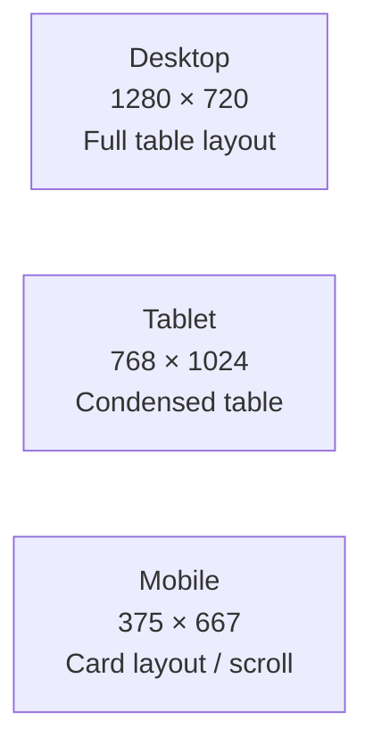

# Responsive Tests — Localization Module

> **Version:** 1.0.0
> **Date:** 2026-03-12
> **Status:** [IN-PROGRESS] — 5 existing (in E2E file), 10 planned
> **Framework:** Playwright 1.55.0 with viewport configuration
> **Viewports:** Desktop (1280x720), Tablet (768x1024), Mobile (375x667)

---

## 1. Viewport Definitions



---

## 2. Existing Responsive Tests

**File:** `frontend/e2e/localization-design-system.spec.ts`

| ID | Test Name | Viewport | Assertion | FR/BR | Status |
|----|-----------|----------|-----------|-------|--------|
| RESP-01 | `should render at Desktop (1280x720)` | Desktop | Page renders without overflow | NFR-06 | WRITTEN |
| RESP-02 | `should render at Tablet (768x1024)` | Tablet | Page renders, layout adjusts | NFR-06 | WRITTEN |
| RESP-03 | `should render at Mobile (375x667)` | Mobile | Page renders, no horizontal overflow | NFR-06 | WRITTEN |
| RESP-04 | `tab bar should be scrollable on mobile` | Mobile | Tab bar scrollable horizontally | NFR-06 | WRITTEN |
| RESP-05 | `Desktop should show full table with 7 columns` | Desktop | All 7 columns visible | NFR-06 | WRITTEN |

---

## 3. Planned Responsive Tests

### 3.1 Languages Tab

| ID | Test Name | Viewport | Steps | Expected Layout | FR/BR |
|----|-----------|----------|-------|----------------|-------|
| RESP-06 | Languages table — Desktop | 1280×720 | Navigate to Languages tab | Full 7-column table, all columns visible, paginator at bottom | FR-01, NFR-06 |
| RESP-07 | Languages table — Tablet | 768×1024 | Navigate to Languages tab | Table with horizontal scroll or hidden columns (Format, Coverage) | FR-01, NFR-06 |
| RESP-08 | Languages table — Mobile | 375×667 | Navigate to Languages tab | Card layout per locale OR horizontal scroll with 3 priority columns | FR-01, NFR-06 |

### 3.2 Dictionary Tab

| ID | Test Name | Viewport | Steps | Expected Layout | FR/BR |
|----|-----------|----------|-------|----------------|-------|
| RESP-09 | Dictionary table — Desktop | 1280×720 | Switch to Dictionary tab | Full table with tech name, module, translation columns per locale | FR-02, NFR-06 |
| RESP-10 | Dictionary table — Mobile | 375×667 | Switch to Dictionary tab | Card layout with key + expandable translations | FR-02, NFR-06 |

### 3.3 Import/Export Tab

| ID | Test Name | Viewport | Steps | Expected Layout | FR/BR |
|----|-----------|----------|-------|----------------|-------|
| RESP-11 | Import/Export — Desktop | 1280×720 | Switch to Import/Export tab | Side-by-side export/import sections | FR-03, NFR-06 |
| RESP-12 | Import/Export — Mobile | 375×667 | Switch to Import/Export tab | Stacked export above import | FR-03, NFR-06 |

### 3.4 Language Switcher

| ID | Test Name | Viewport | Steps | Expected Layout | FR/BR |
|----|-----------|----------|-------|----------------|-------|
| RESP-13 | Switcher dropdown — Desktop | 1280×720 | Open language switcher | Dropdown positioned below trigger, no overflow | FR-08, NFR-06 |
| RESP-14 | Switcher dropdown — Mobile | 375×667 | Open language switcher | Full-width dropdown or bottom sheet | FR-08, NFR-06 |

### 3.5 Edit Dialog

| ID | Test Name | Viewport | Steps | Expected Layout | FR/BR |
|----|-----------|----------|-------|----------------|-------|
| RESP-15 | Edit dialog — Mobile | 375×667 | Open translation edit dialog | Dialog min-width 480px or full-screen on mobile, max-width 90vw | FR-02, NFR-06 |

---

## 4. Layout Assertion Matrix

| Component | Desktop (>1024px) | Tablet (768-1024px) | Mobile (<768px) |
|-----------|-------------------|---------------------|-----------------|
| Tab bar | Horizontal, all tabs visible | Horizontal, all tabs visible | Horizontal scroll, overflow-x: auto |
| Languages table | 7 columns, full width | 5-7 columns, condensed | Card layout or horizontal scroll |
| Dictionary table | All columns visible | Tech name + 2-3 locale columns | Card layout with expand |
| Import/Export | Side-by-side | Side-by-side | Stacked vertically |
| Rollback table | 6 columns | 4-6 columns | Card layout |
| Language Switcher | Dropdown below trigger | Dropdown below trigger | Full-width dropdown |
| Edit Dialog | Centered, 480px-90vw | Centered, 480px-90vw | Full-screen sheet |
| Search input | min-width 280px | min-width 280px | Full width |
| Paginator | Full paginator | Compact paginator | Minimal (prev/next) |

---

## 5. Execution Commands

```bash
# Run responsive tests at all viewports
npx playwright test e2e/localization-responsive.spec.ts

# Run at specific viewport
npx playwright test --project=mobile
npx playwright test --project=tablet
npx playwright test --project=desktop

# Playwright config viewport presets
# playwright.config.ts → projects[].use.viewport
```

---

## 6. Breakpoint CSS Verification

| Breakpoint | Media Query | Key Changes |
|------------|-------------|-------------|
| Mobile | `@media (max-width: 767px)` | Tab bar scrolls, tables become cards, dialogs full-screen |
| Tablet | `@media (min-width: 768px) and (max-width: 1023px)` | Columns condensed, paginator compact |
| Desktop | `@media (min-width: 1024px)` | Full layout, all columns, side-by-side panels |
