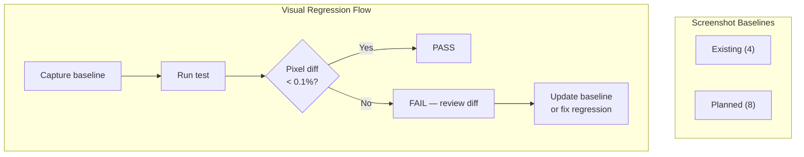

# Visual Regression Tests — Localization Module

> **Version:** 1.0.0
> **Date:** 2026-03-12
> **Status:** [IN-PROGRESS] — 4 existing baselines, 8 planned
> **Framework:** Playwright 1.55.0 (`toHaveScreenshot()`)
> **Threshold:** 0.1% pixel diff tolerance
> **Baseline Dir:** `frontend/e2e/__screenshots__/`

---

## 1. Overview



---

## 2. Existing Visual Baselines

**File:** `frontend/e2e/localization-design-system.spec.ts`

| ID | Test Name | Screenshot | Component | Theme | Status |
|----|-----------|-----------|-----------|-------|--------|
| VR-01 | `visual baseline for Languages tab` | `languages-tab.png` | Languages tab — full view | Light (neumorphic) | WRITTEN |
| VR-02 | `visual baseline for Dictionary tab` | `dictionary-tab.png` | Dictionary tab — full view | Light (neumorphic) | WRITTEN |
| VR-03 | `visual baseline for Import/Export tab` | `import-export-tab.png` | Import/Export tab — full view | Light (neumorphic) | WRITTEN |
| VR-04 | `visual baseline for Rollback tab` | `rollback-tab.png` | Rollback tab — full view | Light (neumorphic) | WRITTEN |

---

## 3. Planned Visual Baselines

### 3.1 Component-Level Baselines

| ID | Screenshot Name | Component | State | Viewport | FR/BR |
|----|----------------|-----------|-------|----------|-------|
| VR-05 | `language-switcher-closed.png` | Language Switcher button | Closed (pill button in header) | Desktop | FR-08 |
| VR-06 | `language-switcher-open.png` | Language Switcher dropdown | Open with locale list | Desktop | FR-08 |
| VR-07 | `error-banner.png` | Error banner | Visible with error message | Desktop | FR-01 |
| VR-08 | `loading-overlay.png` | Loading overlay | Visible with spinner | Desktop | FR-01 |

### 3.2 State-Specific Baselines

| ID | Screenshot Name | Component | State | Viewport | FR/BR |
|----|----------------|-----------|-------|----------|-------|
| VR-09 | `edit-dialog.png` | Translation edit dialog | Open with translations | Desktop | FR-02 |
| VR-10 | `import-preview.png` | Import preview table | Preview with diff highlighting | Desktop | FR-03 |
| VR-11 | `empty-state.png` | Empty dictionary | No entries found | Desktop | FR-02 |
| VR-12 | `rtl-layout.png` | Full page in RTL mode | Arabic locale active, `dir="rtl"` | Desktop | NFR-07 |

---

## 4. Visual Comparison Configuration

```typescript
// playwright.config.ts — visual regression settings
export default defineConfig({
  expect: {
    toHaveScreenshot: {
      maxDiffPixelRatio: 0.001, // 0.1% tolerance
      threshold: 0.2,           // per-pixel color threshold
      animations: 'disabled',   // disable CSS animations for deterministic screenshots
    },
  },
  // Screenshot storage
  snapshotDir: '__screenshots__',
  snapshotPathTemplate: '{testDir}/__screenshots__/{projectName}/{testFilePath}/{arg}{ext}',
});
```

---

## 5. Test Implementation Pattern

```typescript
test('visual baseline for Languages tab', async ({ page }) => {
  // Navigate and wait for stable render
  await page.goto('/admin/localization');
  await page.waitForSelector('.locale-section p-table');
  await page.waitForLoadState('networkidle');

  // Disable animations for deterministic comparison
  await page.addStyleTag({ content: '*, *::before, *::after { animation-duration: 0s !important; transition-duration: 0s !important; }' });

  // Capture and compare
  await expect(page.locator('.locale-section')).toHaveScreenshot('languages-tab.png');
});
```

---

## 6. Baseline Management

| Action | Command | When |
|--------|---------|------|
| Generate baselines | `npx playwright test --update-snapshots` | Initial setup or after intentional UI change |
| Run visual regression | `npx playwright test e2e/localization-visual.spec.ts` | Every PR with UI changes |
| Review diffs | `npx playwright show-report` | After failed visual test |
| Clean baselines | `rm -rf frontend/e2e/__screenshots__/` | Full refresh needed |

---

## 7. CI Integration

```yaml
# .github/workflows/visual-regression.yml
visual-regression:
  runs-on: ubuntu-latest
  steps:
    - uses: actions/checkout@v4
    - run: npm ci
    - run: npx playwright install --with-deps chromium
    - run: npx playwright test e2e/localization-visual.spec.ts
    - uses: actions/upload-artifact@v4
      if: failure()
      with:
        name: visual-diff-report
        path: frontend/playwright-report/
```
