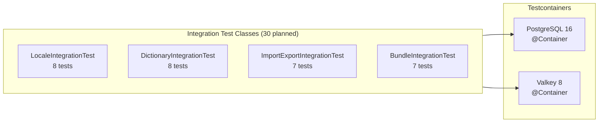

# Backend Integration Tests — Localization Service

> **Version:** 1.0.0
> **Date:** 2026-03-12
> **Status:** [PLANNED] — 0 tests written, 0 executed
> **Framework:** JUnit 5 + Testcontainers 1.20.6 (PostgreSQL 16 + Valkey 8)
> **Spring Profile:** `@ActiveProfiles("integration")`

---

## 1. Overview



**Execution command:**
```bash
cd backend/localization-service
mvn verify -Pintegration -Dspring.profiles.active=integration
```

---

## 2. LocaleIntegrationTest [PLANNED]

**Class:** `com.ems.localization.integration.LocaleIntegrationTest`
**Tests:** 8 | **Infrastructure:** PostgreSQL

| ID | Method | Scenario | Preconditions | Steps | Expected Result | FR/BR |
|----|--------|----------|---------------|-------|----------------|-------|
| INT-LI-01 | `fullCrudLifecycle` | Create, read, update, delete locale | Empty DB | POST → GET → PUT → DELETE | All CRUD operations persist and return correctly | FR-01 |
| INT-LI-02 | `activateDeactivateWithRealDb` | Activate then deactivate | 2 active locales in DB | PUT activate → PUT deactivate | State changes persisted, audit fields set | FR-01 |
| INT-LI-03 | `localeCodeUniquenessConstraint` | Duplicate locale code | `en-US` exists | POST with `en-US` | HTTP 409 Conflict (DB unique constraint) | FR-01, VR-02 |
| INT-LI-04 | `deactivateLastActiveLocaleBlocked` | Cannot deactivate last | 1 active locale | PUT deactivate | HTTP 409 (BR-02 enforced) | FR-01, BR-02 |
| INT-LI-05 | `setAlternativeWithRealDb` | Set alternative clears previous | 2 active locales, 1 alternative | PUT set-alternative | Old cleared, new set, both persisted | FR-01 |
| INT-LI-06 | `searchLocalesWithPagination` | Paginated search | 25 locales seeded | GET search?page=2&size=10 | Page 2 with 10 items, correct total | FR-01 |
| INT-LI-07 | `detectLocaleWithAcceptLanguage` | Accept-Language header parsing | fr-FR, en-US active | GET detect (Accept-Language: fr-FR,en;q=0.9) | Returns fr-FR | FR-05 |
| INT-LI-08 | `localeValidation_rejectsInvalidCode` | Invalid locale code format | Empty DB | POST with `invalid_code` | HTTP 400 (VR-03 validation) | FR-01 |

### Scenario Matrix Coverage

| Scenario ID | Description | Test ID |
|-------------|-------------|---------|
| US-LM-01-H-01 to H-07 | Full locale management | INT-LI-01 to INT-LI-05 |
| US-LM-01-A-02 | Last active blocked | INT-LI-04 |
| US-LM-01-E-04 | Duplicate code rejected | INT-LI-03 |
| US-LM-05-H-19 | Accept-Language detection | INT-LI-07 |

---

## 3. DictionaryIntegrationTest [PLANNED]

**Class:** `com.ems.localization.integration.DictionaryIntegrationTest`
**Tests:** 8 | **Infrastructure:** PostgreSQL + Valkey

| ID | Method | Scenario | Preconditions | Steps | Expected Result | FR/BR |
|----|--------|----------|---------------|-------|----------------|-------|
| INT-DI-01 | `createAndSearchEntries` | Dictionary entry CRUD | Empty DB | Register keys → Search | Entries persisted and searchable | FR-02 |
| INT-DI-02 | `updateTranslationCreatesSnapshot` | Edit creates version | 1 entry with translation | PUT update translation | DictionaryVersion row created with snapshot JSON | FR-02, BR-06 |
| INT-DI-03 | `rollbackRestoresState` | Rollback to version | 3 versions created | POST rollback to v1 | Translations match v1 state | FR-04, BR-07 |
| INT-DI-04 | `rollbackCreatesPreRollbackSnapshot` | Safety snapshot | 2 versions exist | POST rollback to v1 | Pre-rollback snapshot saved as latest version | FR-04, BR-07 |
| INT-DI-05 | `versionHistoryPagination` | Version list pagination | 15 versions created | GET versions?page=1&size=10 | 10 versions, correct ordering | FR-04 |
| INT-DI-06 | `coverageCalculation` | Translation coverage | 10 entries, 7 translated for fr-FR | GET coverage/fr-FR | 70% coverage, 3 missing keys listed | FR-02 |
| INT-DI-07 | `cacheInvalidationOnUpdate` | Valkey cache cleared | Bundle cached in Valkey | PUT update translation | Cache key deleted from Valkey | NFR-09, BR-06 |
| INT-DI-08 | `concurrentTranslationUpdates` | Optimistic locking | Same entry | 2 concurrent PUTs | One succeeds, one gets 409 Conflict | FR-02 |

---

## 4. ImportExportIntegrationTest [PLANNED]

**Class:** `com.ems.localization.integration.ImportExportIntegrationTest`
**Tests:** 7 | **Infrastructure:** PostgreSQL + Valkey

| ID | Method | Scenario | Preconditions | Steps | Expected Result | FR/BR |
|----|--------|----------|---------------|-------|----------------|-------|
| INT-IE-01 | `csvRoundTrip` | Export then import | 5 entries with translations | Export CSV → Modify → Import preview → Commit | Translations match modified CSV | FR-03 |
| INT-IE-02 | `rateLimitEnforcedWithValkey` | 5 imports per hour | Rate counter at 0 in Valkey | 5 imports → 6th import | First 5 succeed, 6th returns 429 | FR-03, NFR-10 |
| INT-IE-03 | `previewTokenExpiryInValkey` | 30-min TTL | Preview created | Wait for Valkey key to expire (mock time) | Commit returns 400 "expired" | FR-03, BR-05 |
| INT-IE-04 | `importWithUtf8BomAndSpecialChars` | Unicode preservation | Empty DB | Import CSV with UTF-8 BOM + Chinese/Arabic chars | Characters preserved correctly | FR-03 |
| INT-IE-05 | `importRejectsOversizeFile` | 10MB limit | Valid file > 10MB | POST import | HTTP 413 / 400 "file too large" | FR-03, NFR-05 |
| INT-IE-06 | `importRejectsCsvInjection` | Formula injection | CSV with `=CMD()` cell | POST import preview | Rows flagged/rejected | FR-03, NFR-04 |
| INT-IE-07 | `exportIncludesAllActiveLocaleColumns` | Dynamic columns | 3 active locales | GET export | CSV has columns for all 3 locales | FR-03 |

### Scenario Matrix Coverage

| Scenario ID | Description | Test ID |
|-------------|-------------|---------|
| US-LM-03-H-13 to H-15 | Import/export happy paths | INT-IE-01, INT-IE-07 |
| US-LM-03-A-04 | Rate limit | INT-IE-02 |
| US-LM-03-E-13 | Oversize file | INT-IE-05 |
| US-LM-03-E-14 | CSV injection | INT-IE-06 |
| US-LM-03-E-16 | Expired token | INT-IE-03 |

---

## 5. BundleIntegrationTest [PLANNED]

**Class:** `com.ems.localization.integration.BundleIntegrationTest`
**Tests:** 7 | **Infrastructure:** PostgreSQL + Valkey

| ID | Method | Scenario | Preconditions | Steps | Expected Result | FR/BR |
|----|--------|----------|---------------|-------|----------------|-------|
| INT-BI-01 | `bundleGenerationFromDb` | Build bundle from translations | 10 entries with en-US translations | GET bundle/en-US | Flat JSON with 10 key-value pairs | FR-06 |
| INT-BI-02 | `bundleCachingInValkey` | Bundle cached after first fetch | Cache empty | GET bundle/en-US × 2 | First builds from DB, second from Valkey cache | FR-06, NFR-09 |
| INT-BI-03 | `cacheInvalidationClearsBundle` | Cache cleared on translation update | Bundle cached | PUT update translation → GET bundle | Fresh bundle (not stale) | NFR-09, BR-06 |
| INT-BI-04 | `tenantOverrideMerge` | Tenant overrides merged with global | Global + tenant overrides | GET bundle with X-Tenant-ID | Merged bundle (global + overrides) | FR-15, BR-15, BR-08 |
| INT-BI-05 | `tenantBundleCachedSeparately` | Tenant-specific cache key | Global + tenant bundles | GET global → GET tenant → verify cache keys | `bundle:global:en-US` and `bundle:tenant1:en-US` in Valkey | FR-15, NFR-09 |
| INT-BI-06 | `globalChangeInvalidatesAllTenantCaches` | BR-17 enforcement | 2 tenant caches exist | PUT global translation | Both tenant cache keys deleted | BR-17, NFR-09 |
| INT-BI-07 | `anonymousUserGetsGlobalBundleOnly` | No tenant overrides for anon | Tenant overrides exist | GET bundle (no auth) | Global-only bundle returned | BR-18, BR-09 |

### Scenario Matrix Coverage

| Scenario ID | Description | Test ID |
|-------------|-------------|---------|
| US-LM-06-H-22 | Bundle fetch | INT-BI-01 |
| US-LM-06-E-30 | Cache behavior | INT-BI-02, INT-BI-03 |
| US-LM-11-H-46 | Tenant override merge | INT-BI-04 |
| US-LM-11-H-50 | Tenant cache isolation | INT-BI-05 |
| US-LM-11-E-59 | Global invalidates tenant | INT-BI-06 |
| US-LM-11-E-65 | Anonymous gets global | INT-BI-07 |

---

## 6. Test Infrastructure Setup

### Testcontainers Configuration

```java
@Testcontainers
@SpringBootTest(webEnvironment = SpringBootTest.WebEnvironment.RANDOM_PORT)
@ActiveProfiles("integration")
abstract class BaseIntegrationTest {

    @Container
    static PostgreSQLContainer<?> postgres = new PostgreSQLContainer<>("postgres:16-alpine")
        .withDatabaseName("localization_test")
        .withUsername("test")
        .withPassword("test");

    @Container
    static GenericContainer<?> valkey = new GenericContainer<>("valkey/valkey:8-alpine")
        .withExposedPorts(6379);

    @DynamicPropertySource
    static void configureProperties(DynamicPropertyRegistry registry) {
        registry.add("spring.datasource.url", postgres::getJdbcUrl);
        registry.add("spring.datasource.username", postgres::getUsername);
        registry.add("spring.datasource.password", postgres::getPassword);
        registry.add("spring.data.redis.host", valkey::getHost);
        registry.add("spring.data.redis.port", () -> valkey.getMappedPort(6379));
    }
}
```

### Execution Commands

```bash
# Run all integration tests
mvn verify -Pintegration

# Run specific integration test
mvn verify -Pintegration -Dtest=BundleIntegrationTest

# Skip unit tests, only integration
mvn verify -Pintegration -DskipUnitTests=true
```
