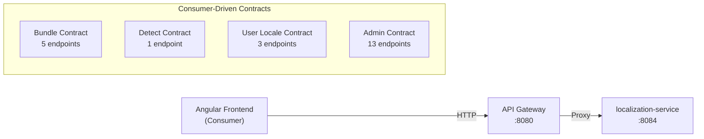

# API Contract Tests — Localization Service

> **Version:** 1.0.0
> **Date:** 2026-03-12
> **Status:** [PLANNED] — 0 tests written, 0 executed
> **Framework:** Spring Cloud Contract / Pact
> **Consumer:** Angular frontend | **Provider:** localization-service

---

## 1. Overview



---

## 2. Bundle API Contracts

| ID | Consumer Call | Method + Path | Request | Expected Response | FR/BR |
|----|-------------|---------------|---------|-------------------|-------|
| CT-B-01 | `TranslationService.fetchBundle(locale)` | `GET /api/v1/bundles/{localeCode}` | Path: `en-US` | 200: `{"common.save": "Save", ...}` | FR-06 |
| CT-B-02 | `TranslationService.fetchBundle(locale)` | `GET /api/v1/bundles/{localeCode}` | Path: `xx-XX` (inactive) | 404: `{"error": "Locale not active"}` | FR-06 |
| CT-B-03 | `TranslationService.fetchBundle(locale)` with tenant | `GET /api/v1/bundles/{localeCode}` | Header: `X-Tenant-ID: tenant-1` | 200: Merged bundle (global + overrides) | FR-15, BR-15 |
| CT-B-04 | `TranslationService.fetchBundle(locale)` anonymous | `GET /api/v1/bundles/{localeCode}` | No auth header | 200: Global-only bundle | BR-09, BR-18 |
| CT-B-05 | `TranslationService.fetchBundle(locale)` cached | `GET /api/v1/bundles/{localeCode}` | `If-None-Match: etag` | 304 Not Modified / 200 | NFR-09 |

---

## 3. Locale Detection Contract

| ID | Consumer Call | Method + Path | Request | Expected Response | FR/BR |
|----|-------------|---------------|---------|-------------------|-------|
| CT-D-01 | `LocaleService.detectLocale()` | `GET /api/v1/locales/detect` | Header: `Accept-Language: fr-FR,en;q=0.9` | 200: `{"localeCode": "fr-FR", "name": "French"}` | FR-05 |

---

## 4. User Locale Contracts

| ID | Consumer Call | Method + Path | Request | Expected Response | FR/BR |
|----|-------------|---------------|---------|-------------------|-------|
| CT-UL-01 | `LocaleService.getUserLocale()` | `GET /api/v1/user-locale` | Auth: Bearer token | 200: `{"localeCode": "fr-FR"}` | FR-05 |
| CT-UL-02 | `LocaleService.setUserLocale(code)` | `PUT /api/v1/user-locale` | Body: `{"localeCode": "fr-FR"}` | 200: `{"localeCode": "fr-FR"}` | FR-05 |
| CT-UL-03 | `LocaleService.getUserLocale()` (no pref) | `GET /api/v1/user-locale` | Auth: Bearer (no saved pref) | 200: `{"localeCode": "en-US", "source": "default"}` | FR-05 |

---

## 5. Admin API Contracts

### 5.1 Locale Administration

| ID | Consumer Call | Method + Path | Request | Expected Response | FR/BR |
|----|-------------|---------------|---------|-------------------|-------|
| CT-A-01 | `AdminLocaleService.loadLocales()` | `GET /api/v1/locales?page=1&size=20` | Auth: ROLE_ADMIN | 200: Paginated locales | FR-01 |
| CT-A-02 | `AdminLocaleService.loadActiveLocales()` | `GET /api/v1/locales/active` | Auth: ROLE_ADMIN | 200: Active locale array | FR-01 |
| CT-A-03 | `AdminLocaleService.activateLocale(id)` | `PUT /api/v1/locales/{id}/activate` | Auth: ROLE_ADMIN | 200: Updated locale DTO | FR-01 |
| CT-A-04 | `AdminLocaleService.deactivateLocale(id)` | `PUT /api/v1/locales/{id}/deactivate` | Auth: ROLE_ADMIN | 200 / 409 (last active) | FR-01, BR-01, BR-02 |
| CT-A-05 | No auth | `GET /api/v1/locales` | No auth header | 401 Unauthorized | FR-01 |

### 5.2 Dictionary Administration

| ID | Consumer Call | Method + Path | Request | Expected Response | FR/BR |
|----|-------------|---------------|---------|-------------------|-------|
| CT-A-06 | `AdminLocaleService.loadEntries()` | `GET /api/v1/dictionary?q=save&page=1` | Auth: ROLE_ADMIN | 200: Paginated entries with translations map | FR-02 |
| CT-A-07 | `AdminLocaleService.updateTranslation()` | `PUT /api/v1/dictionary/{id}/translations` | Body: `[{"localeCode":"en-US","value":"Save"}]` | 200: Updated entry | FR-02, BR-06 |
| CT-A-08 | `AdminLocaleService.exportCsv()` | `GET /api/v1/dictionary/export` | Auth: ROLE_ADMIN | 200: `text/csv` with UTF-8 BOM | FR-03 |
| CT-A-09 | `AdminLocaleService.importPreview()` | `POST /api/v1/dictionary/import/preview` | Multipart: CSV file | 200: Preview DTO with token | FR-03, BR-05 |
| CT-A-10 | `AdminLocaleService.importCommit()` | `POST /api/v1/dictionary/import/commit` | Body: `{"previewToken": "..."}` | 200: Import result | FR-03 |

### 5.3 Tenant Override Administration

| ID | Consumer Call | Method + Path | Request | Expected Response | FR/BR |
|----|-------------|---------------|---------|-------------------|-------|
| CT-A-11 | `AdminLocaleService.listOverrides()` | `GET /api/v1/tenant-overrides?locale=en-US` | Auth: ROLE_TENANT_ADMIN | 200: Override list | FR-15, BR-16 |
| CT-A-12 | `AdminLocaleService.setOverride()` | `POST /api/v1/tenant-overrides` | Body: `{"entryId":"...","localeCode":"en-US","value":"Custom"}` | 200: Created override | FR-15, BR-15 |
| CT-A-13 | `AdminLocaleService.deleteOverride()` | `DELETE /api/v1/tenant-overrides/{id}` | Auth: ROLE_TENANT_ADMIN | 204 No Content | FR-15 |

---

## 6. Contract Schema Definitions

### SystemLocaleDto

```json
{
  "localeId": "uuid",
  "code": "string (BCP-47)",
  "name": "string",
  "textDirection": "LTR | RTL",
  "isActive": "boolean",
  "isAlternative": "boolean",
  "activatedBy": "string | null",
  "activatedAt": "datetime | null"
}
```

### DictionaryEntryDto

```json
{
  "entryId": "uuid",
  "technicalName": "string (dot-notation)",
  "module": "string",
  "description": "string | null",
  "translations": { "locale-code": "translation-value" }
}
```

### ImportPreviewDto

```json
{
  "previewToken": "string",
  "totalRows": "integer",
  "rowsToUpdate": "integer",
  "rowsToInsert": "integer",
  "errors": "string[]"
}
```

---

## 7. Verification

```bash
# Provider-side verification
cd backend/localization-service
mvn verify -Pcontract

# Consumer-side stub generation
cd frontend
npx pact-verify --provider=localization-service
```
