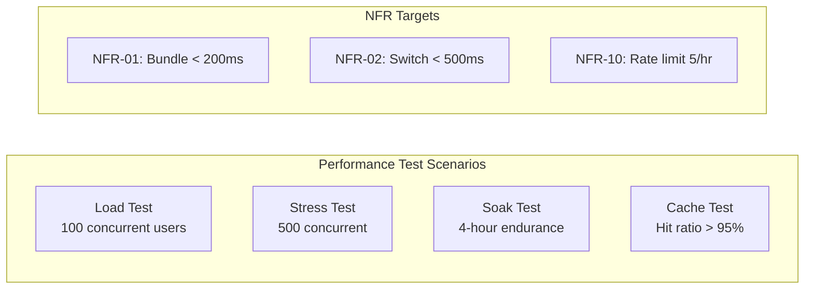

# Performance Tests — Localization Module

> **Version:** 1.0.0
> **Date:** 2026-03-12
> **Status:** [PLANNED] — 0 written, 0 executed
> **Framework:** k6 (primary), Gatling (alternative)
> **Infrastructure:** Valkey 8, PostgreSQL 16, localization-service :8084

---

## 1. Overview



---

## 2. Load Test Scenarios

### 2.1 NFR-01: Bundle Fetch Performance

| ID | Test | Concurrency | Duration | Target | Assertion |
|----|------|-------------|----------|--------|-----------|
| PERF-01 | Bundle fetch (cached) | 100 VUs | 5 min | P95 < 200ms | `http_req_duration{p(95)} < 200` |
| PERF-02 | Bundle fetch (cold cache) | 100 VUs | 2 min | P95 < 500ms | First request builds cache, subsequent < 200ms |

### 2.2 NFR-02: Language Switch Performance

| ID | Test | Concurrency | Duration | Target | Assertion |
|----|------|-------------|----------|--------|-----------|
| PERF-03 | Language switch (frontend) | 50 VUs | 3 min | P95 < 500ms | Total time: API call + signal update + DOM re-render |

### 2.3 NFR-10: Rate Limiting Under Load

| ID | Test | Concurrency | Duration | Target | Assertion |
|----|------|-------------|----------|--------|-----------|
| PERF-04 | Rate limit enforcement | 20 VUs (same user) | 2 min | 5 imports/hr | Requests 1-5 succeed (200), 6+ return 429 |

---

## 3. Stress Test Scenarios

| ID | Test | Load Profile | Breaking Point | Assertions |
|----|------|-------------|----------------|------------|
| PERF-05 | Progressive bundle load | Ramp 10→500 VUs over 10 min | Find P95 > 1s threshold | Error rate < 1% at 200 VUs, document breaking point |
| PERF-06 | Concurrent dictionary writes | Ramp 5→50 VUs updating translations | Optimistic lock contention | 409 Conflict rate vs successful writes |

---

## 4. Soak Test Scenarios

| ID | Test | Load | Duration | Monitoring |
|----|------|------|----------|------------|
| PERF-07 | Endurance — bundle fetch | 50 VUs steady | 4 hours | Memory leak detection, P95 drift, GC pauses |
| PERF-08 | Endurance — with cache invalidation | 50 VUs + periodic translation updates | 4 hours | Cache rebuild time, no stale data served |

---

## 5. Cache Performance Scenarios

| ID | Test | Scenario | Target | Assertion |
|----|------|----------|--------|-----------|
| PERF-09 | Cache hit ratio | 100 VUs fetching 5 locale bundles | > 95% hits | Valkey `keyspace_hits / (hits + misses) > 0.95` |
| PERF-10 | Cache rebuild time | Invalidate cache + concurrent requests | Rebuild < 500ms | First cold request < 500ms, subsequent < 200ms |

---

## 6. k6 Test Scripts

### 6.1 Bundle Load Test

```javascript
// k6/localization-bundle-load.js
import http from 'k6/http';
import { check, sleep } from 'k6';

export const options = {
  stages: [
    { duration: '30s', target: 50 },   // Ramp up
    { duration: '5m', target: 100 },   // Sustain
    { duration: '30s', target: 0 },    // Ramp down
  ],
  thresholds: {
    'http_req_duration{name:bundle_fetch}': ['p(95)<200'],
    'http_req_failed': ['rate<0.01'],
  },
};

const LOCALES = ['en-US', 'fr-FR', 'de-DE', 'ar-SA', 'ja-JP'];

export default function () {
  const locale = LOCALES[Math.floor(Math.random() * LOCALES.length)];
  const res = http.get(
    `http://localhost:8084/api/v1/bundles/${locale}`,
    { tags: { name: 'bundle_fetch' } }
  );
  check(res, {
    'status is 200': (r) => r.status === 200,
    'response is JSON': (r) => r.headers['Content-Type'].includes('application/json'),
    'response time < 200ms': (r) => r.timings.duration < 200,
  });
  sleep(1);
}
```

### 6.2 Stress Test

```javascript
// k6/localization-stress.js
export const options = {
  stages: [
    { duration: '2m', target: 100 },
    { duration: '2m', target: 200 },
    { duration: '2m', target: 300 },
    { duration: '2m', target: 500 },
    { duration: '2m', target: 0 },
  ],
  thresholds: {
    'http_req_duration': ['p(95)<1000'],
    'http_req_failed': ['rate<0.05'],
  },
};
```

---

## 7. Execution Commands

```bash
# Load test
k6 run k6/localization-bundle-load.js

# Stress test
k6 run k6/localization-stress.js

# Soak test (4 hours)
k6 run --duration 4h k6/localization-soak.js

# With Grafana dashboard
k6 run --out influxdb=http://localhost:8086/k6 k6/localization-bundle-load.js
```

---

## 8. SLO Summary

| NFR | SLO | Measurement | Target |
|-----|-----|-------------|--------|
| NFR-01 | Bundle response time | P95 latency | < 200ms (cached) |
| NFR-02 | Language switch time | Total user-perceived | < 500ms |
| NFR-09 | Cache hit ratio | Valkey keyspace stats | > 95% |
| NFR-10 | Rate limit accuracy | 429 responses at threshold | 100% enforcement |
| General | Error rate under load | HTTP 5xx / total | < 1% at 100 VUs |
| General | Throughput | Requests/second | > 500 rps at 100 VUs |
