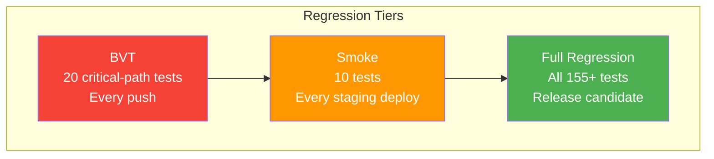

# Regression Suite — Localization Module

> **Version:** 1.0.0
> **Date:** 2026-03-12
> **Status:** [PLANNED] — 0 written, 0 executed
> **Framework:** JUnit 5 (backend BVT), Playwright (frontend smoke + regression)
> **Governance:** `docs/governance/agents/QA-PRINCIPLES.md` — BVT on every push, smoke on staging

---

## 1. Overview



---

## 2. BVT — Build Verification Tests (20 tests)

**Trigger:** Every push to `main` or PR branch
**Timeout:** < 3 minutes total
**Gate:** Blocks merge on failure

| ID | Test | Type | Layer | Assertion | FR/BR |
|----|------|------|-------|-----------|-------|
| BVT-01 | Locale service health | Backend | Unit | `GET /actuator/health` returns UP | FR-01 |
| BVT-02 | Active locales endpoint | Backend | Unit | `GET /locales/active` returns 200 | FR-01 |
| BVT-03 | Locale search endpoint | Backend | Unit | `GET /locales?q=en` returns paginated | FR-01 |
| BVT-04 | Dictionary search endpoint | Backend | Unit | `GET /dictionary?q=save` returns entries | FR-02 |
| BVT-05 | Bundle fetch endpoint | Backend | Unit | `GET /bundles/en-US` returns JSON | FR-06 |
| BVT-06 | Locale detection | Backend | Unit | `GET /locales/detect` returns locale | FR-05 |
| BVT-07 | RBAC — admin blocked without role | Backend | Unit | `GET /locales` without ROLE_ADMIN → 403 | FR-01 |
| BVT-08 | RBAC — bundle public | Backend | Unit | `GET /bundles/en-US` without auth → 200 | BR-09 |
| BVT-09 | Activate locale | Backend | Unit | `PUT /locales/{id}/activate` → 200 | FR-01 |
| BVT-10 | Deactivate alternative blocked | Backend | Unit | `PUT /locales/{id}/deactivate` on alt → 409 | BR-01 |
| BVT-11 | Update translation creates snapshot | Backend | Unit | `PUT /dictionary/{id}/translations` → version created | BR-06 |
| BVT-12 | Export CSV | Backend | Unit | `GET /dictionary/export` → text/csv | FR-03 |
| BVT-13 | Import preview generates token | Backend | Unit | `POST /dictionary/import/preview` → token | FR-03 |
| BVT-14 | Rate limit enforced | Backend | Unit | 6th import → 429 | NFR-10 |
| BVT-15 | Languages tab renders | Frontend | E2E | Navigate to Admin → Localization, p-table visible | FR-01 |
| BVT-16 | Tab switching works | Frontend | E2E | Click Dictionary tab → content switches | FR-02 |
| BVT-17 | Search field functional | Frontend | E2E | Type in search → results filter | FR-02 |
| BVT-18 | Error banner displays | Frontend | E2E | Trigger error → banner visible | FR-01 |
| BVT-19 | ng build passes | CI | Build | `ng build --configuration=production` → 0 errors | CI gate |
| BVT-20 | TypeScript strict passes | CI | Build | `npx tsc --noEmit` → 0 errors | CI gate |

---

## 3. Smoke Tests (10 tests)

**Trigger:** Every staging deployment
**Timeout:** < 2 minutes total
**Gate:** Blocks promotion to production on failure

| ID | Test | Layer | Assertion | FR/BR |
|----|------|-------|-----------|-------|
| SMOKE-01 | Health check — localization-service | Backend | `/actuator/health` → UP | Infrastructure |
| SMOKE-02 | Health check — api-gateway | Backend | Gateway routes localization requests | Infrastructure |
| SMOKE-03 | Bundle fetch for en-US | Backend | Valid JSON returned from production endpoint | FR-06 |
| SMOKE-04 | Locale detection with Accept-Language | Backend | Correct locale detected | FR-05 |
| SMOKE-05 | Admin page loads | Frontend | Localization admin page renders without JS errors | FR-01 |
| SMOKE-06 | Language switcher renders | Frontend | Switcher button visible in header | FR-08 |
| SMOKE-07 | Dictionary tab loads | Frontend | Dictionary table renders with data | FR-02 |
| SMOKE-08 | Valkey cache operational | Backend | Bundle cached on first fetch, served from cache on second | NFR-09 |
| SMOKE-09 | RBAC enforced in staging | Backend | Admin endpoint returns 403 without auth | FR-01 |
| SMOKE-10 | SSL/TLS certificate valid | Infrastructure | HTTPS connection successful | Security |

---

## 4. Full Regression Suite

**Trigger:** Release candidate build
**Timeout:** < 30 minutes total
**Gate:** Blocks release on failure

| Category | Test Documents | Test Count | Included |
|----------|---------------|------------|----------|
| Backend Unit | [01-Backend-Unit-Tests.md](../Unit/01-Backend-Unit-Tests.md) | 46 | ALL |
| Frontend Unit | [02-Frontend-Unit-Tests.md](../Unit/02-Frontend-Unit-Tests.md) | 72 | ALL |
| Integration | [03-Backend-Integration-Tests.md](../Integration/03-Backend-Integration-Tests.md) | 30 | ALL |
| Functional E2E | [05-Functional-E2E-Tests.md](../E2E/05-Functional-E2E-Tests.md) | 44 | ALL |
| Responsive | [06-Responsive-Tests.md](../E2E/06-Responsive-Tests.md) | 15 | ALL |
| Visual Regression | [07-Visual-Regression-Tests.md](../E2E/07-Visual-Regression-Tests.md) | 12 | ALL |
| Accessibility | [10-WCAG-2.2-Level-A-Tests.md](../Accessibility/10-WCAG-2.2-Level-A-Tests.md) + [AA](../Accessibility/11-WCAG-2.2-Level-AA-Tests.md) | 38 | A + AA |
| Security | [13-Security-Tests.md](../Security/13-Security-Tests.md) | 23 | ALL |
| **Total** | | **280** | |

---

## 5. Change Impact Analysis

When code changes are made, determine which regression tests to run:

| Change Area | Impacted Tests | Priority |
|-------------|---------------|----------|
| `LocaleService.java` | BVT-01 to BVT-10, BU-LS-*, INT-LI-* | HIGH |
| `DictionaryService.java` | BVT-04, BVT-11 to BVT-14, BU-DS-*, INT-DI-* | HIGH |
| `BundleService.java` | BVT-05, BU-BS-*, INT-BI-*, PERF-01 to PERF-02 | HIGH |
| `TenantOverrideService.java` | BU-TO-*, INT-BI-04 to INT-BI-07, SEC-TI-* | HIGH |
| `master-locale-section.component.*` | BVT-15 to BVT-18, FU-MLS-*, DS-*, VR-* | HIGH |
| `admin-locale.service.ts` | FU-ALS-*, E2E L-*, D-*, IE-*, R-* | HIGH |
| `language-switcher.component.*` | LS-*, FU-LSC-*, DS-P-14 to DS-P-18 | MEDIUM |
| `*.scss` / design tokens | DS-*, VR-*, RESP-* | MEDIUM |
| `docker-compose.yml` | SMOKE-01 to SMOKE-10 | LOW |
| `application.yml` | BVT-01, SMOKE-01, SMOKE-08 | LOW |

---

## 6. Execution Commands

```bash
# BVT (runs on every push)
cd backend/localization-service && mvn test -Dtest="*ControllerTest,*ServiceTest" && \
cd ../../frontend && npx playwright test e2e/localization-bvt.spec.ts

# Smoke (runs on staging deploy)
npx playwright test e2e/localization-smoke.spec.ts --project=chromium

# Full regression (release candidate)
cd backend/localization-service && mvn verify && \
cd ../../frontend && npx vitest run && npx playwright test e2e/localization/
```

---

## 7. Flaky Test Management

| Policy | Rule |
|--------|------|
| Quarantine | After 3 failures in 5 runs, move to quarantine suite |
| Root cause | Quarantined tests must have JIRA ticket within 48 hours |
| Re-admission | Pass 10 consecutive runs before returning to main suite |
| Tracking | Flaky test rate reported weekly (target: < 2%) |
