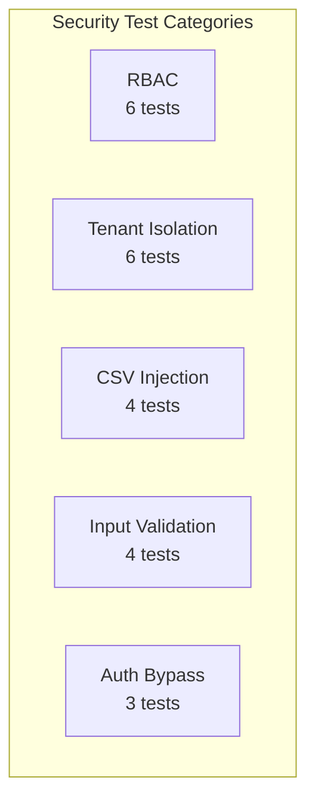

# Security Tests — Localization Module

> **Version:** 1.0.0
> **Date:** 2026-03-12
> **Status:** [PLANNED] — 0 written, 0 executed
> **Framework:** JUnit 5 + MockMvc (backend), Playwright (E2E), OWASP ZAP (DAST)
> **SA Conditions:** SEC-01 (RBAC), SEC-02 (Tenant Isolation), SEC-03 (Input Validation), SEC-04 (Rate Limiting)

---

## 1. Overview



---

## 2. RBAC Tests (SEC-01)

| ID | Test | Role | Endpoint | Expected | FR/BR | Status |
|----|------|------|----------|----------|-------|--------|
| SEC-RBAC-01 | Super Admin full access | ROLE_SUPER_ADMIN | All admin endpoints | HTTP 200 on all CRUD operations | FR-01, FR-02, FR-03, FR-04 | PLANNED |
| SEC-RBAC-02 | Tenant Admin limited access | ROLE_TENANT_ADMIN | Locale read + tenant override CRUD | HTTP 200 on allowed, 403 on global dictionary edits | FR-15 | PLANNED |
| SEC-RBAC-03 | End User blocked from admin | ROLE_USER | All admin endpoints | HTTP 403 Forbidden | FR-01 | PLANNED |
| SEC-RBAC-04 | Anonymous public-only | No auth | `GET /bundles/{locale}`, `GET /locales/detect` | HTTP 200 on public, 401 on admin | BR-09 | PLANNED |
| SEC-RBAC-05 | Role escalation attempt | ROLE_USER | `PUT /locales/{id}/activate` with tampered role | HTTP 403 (server-side role check) | FR-01 | PLANNED |
| SEC-RBAC-06 | Expired token blocked | Expired JWT | Any admin endpoint | HTTP 401 Unauthorized | FR-01 | PLANNED |

### Scenario Matrix Coverage

| Scenario ID | Description | Test ID |
|-------------|-------------|---------|
| R-01 | Super Admin full access | SEC-RBAC-01 |
| R-02 | Tenant Admin limited | SEC-RBAC-02 |
| R-03 | End User blocked | SEC-RBAC-03 |
| R-04 | Role escalation blocked | SEC-RBAC-05 |
| R-05 | Expired/tampered JWT | SEC-RBAC-06 |
| R-06 | Anonymous public access | SEC-RBAC-04 |

---

## 3. Tenant Isolation Tests (SEC-02)

| ID | Test | Attack Vector | Setup | Expected | FR/BR | Status |
|----|------|--------------|-------|----------|-------|--------|
| SEC-TI-01 | X-Tenant-ID spoofing | Header manipulation | Tenant A JWT + Tenant B header | Server uses JWT tenant, ignores header | FR-15, BR-16 | PLANNED |
| SEC-TI-02 | Cross-tenant override read | Direct ID access | Tenant A requests Tenant B override by ID | HTTP 403 or 404 (no data leaked) | FR-15, BR-16 | PLANNED |
| SEC-TI-03 | Cross-tenant override write | PUT with wrong tenant | Tenant A tries to modify Tenant B override | HTTP 403 Forbidden | FR-15, BR-16 | PLANNED |
| SEC-TI-04 | Cross-tenant override delete | DELETE with wrong tenant | Tenant A tries to delete Tenant B override | HTTP 403 Forbidden | FR-15, BR-16 | PLANNED |
| SEC-TI-05 | Bundle tenant scope verification | GET bundle with tenant | Tenant A fetches bundle | Only Tenant A overrides applied | FR-15, BR-15, BR-16 | PLANNED |
| SEC-TI-06 | JWT tenant_id validation | Tampered JWT | JWT with modified tenant_id claim | Signature validation fails → 401 | BR-16 | PLANNED |

### Scenario Matrix Coverage

| Scenario ID | Description | Test ID |
|-------------|-------------|---------|
| US-LM-11-E-57 | Tenant ID spoofing | SEC-TI-01 |
| US-LM-11-E-58 | Cross-tenant access | SEC-TI-02 to SEC-TI-04 |
| US-LM-11-E-65 | Anonymous gets global only | SEC-TI-05 |

---

## 4. CSV Injection Tests (SEC-03 / NFR-04)

| ID | Test | Payload | Injection Type | Expected | FR/BR | Status |
|----|------|---------|----------------|----------|-------|--------|
| SEC-CSV-01 | Formula injection `=CMD()` | `=CMD('calc')` in translation cell | Excel formula | Row rejected/sanitized, no formula execution | NFR-04 | PLANNED |
| SEC-CSV-02 | Plus prefix injection | `+cmd('calc')` in translation cell | Excel formula | Prefix stripped or row rejected | NFR-04 | PLANNED |
| SEC-CSV-03 | Minus prefix injection | `-cmd('calc')` in translation cell | Excel formula | Prefix stripped or row rejected | NFR-04 | PLANNED |
| SEC-CSV-04 | At-sign injection | `@SUM(A1:A10)` in translation cell | Excel formula | Prefix stripped or row rejected | NFR-04 | PLANNED |

### Scenario Matrix Coverage

| Scenario ID | Description | Test ID |
|-------------|-------------|---------|
| US-LM-03-E-14 | CSV formula injection | SEC-CSV-01 to SEC-CSV-04 |

---

## 5. Input Validation Tests (SEC-03)

| ID | Test | Attack Vector | Input | Expected | FR/BR | Status |
|----|------|--------------|-------|----------|-------|--------|
| SEC-IV-01 | XSS in translation value | Stored XSS | `<script>alert('xss')</script>` | HTML-encoded in output, no script execution | NFR-04 | PLANNED |
| SEC-IV-02 | SQL injection in search | SQLi | `'; DROP TABLE locales; --` | Parameterized query, no injection | NFR-04 | PLANNED |
| SEC-IV-03 | Overlong translation value | Buffer overflow | 50,000-character translation | HTTP 400 validation error | NFR-04 | PLANNED |
| SEC-IV-04 | Malformed locale code | Invalid format | `../../etc/passwd` as locale code | HTTP 400 validation (BCP-47 regex) | NFR-04 | PLANNED |

---

## 6. Auth Bypass Tests (SEC-01)

| ID | Test | Attack Vector | Setup | Expected | FR/BR | Status |
|----|------|--------------|-------|----------|-------|--------|
| SEC-AB-01 | Expired JWT on admin endpoint | Token expiry | JWT with `exp` in the past | HTTP 401 Unauthorized | FR-01 | PLANNED |
| SEC-AB-02 | Missing JWT on admin endpoint | No auth header | Request without Authorization header | HTTP 401 Unauthorized | FR-01 | PLANNED |
| SEC-AB-03 | Tampered JWT signature | Signature manipulation | JWT with modified payload but original signature | HTTP 401 Unauthorized (signature mismatch) | FR-01 | PLANNED |

---

## 7. File Upload Security

| ID | Test | Attack Vector | Expected | FR/BR | Status |
|----|------|--------------|----------|-------|--------|
| SEC-FU-01 | 10MB file size limit | Upload 11MB CSV | HTTP 413 / 400 "File too large" | NFR-05 | PLANNED |
| SEC-FU-02 | Non-CSV file type | Upload .exe as CSV | HTTP 400 "Invalid file type" | NFR-04 | PLANNED |
| SEC-FU-03 | ZIP bomb / decompression bomb | Upload compressed file | Rejected at content-type check | NFR-04 | PLANNED |

---

## 8. DAST Scan Configuration (OWASP ZAP)

```yaml
# zap-localization-scan.yaml
env:
  contexts:
    - name: "Localization Service"
      urls:
        - "http://localhost:8084/api/v1/"
      authentication:
        method: "jwt"
        parameters:
          token: "${JWT_TOKEN}"
  policies:
    - name: "OWASP Top 10"
      rules:
        - id: 40012  # XSS
        - id: 40018  # SQL Injection
        - id: 40014  # CSRF
        - id: 90027  # IDOR
        - id: 10202  # Missing headers
```

---

## 9. Execution Commands

```bash
# Backend security tests (MockMvc)
cd backend/localization-service
mvn test -Dtest="*SecurityTest"

# DAST scan with OWASP ZAP
docker run -t owasp/zap2docker-stable zap-api-scan.py \
  -t http://localhost:8084/v3/api-docs \
  -f openapi -r security-report.html

# Playwright security-focused E2E
npx playwright test e2e/localization-security.spec.ts
```

---

## 10. Pass Criteria

| Category | Threshold |
|----------|-----------|
| RBAC violations | 0 — no unauthorized access |
| Tenant isolation breaches | 0 — no cross-tenant data leakage |
| CSV injection | 0 — all formula prefixes rejected/sanitized |
| XSS/SQLi | 0 — no injection successful |
| OWASP ZAP CRITICAL/HIGH | 0 findings |
| OWASP ZAP MEDIUM | < 3 findings (with justification) |
