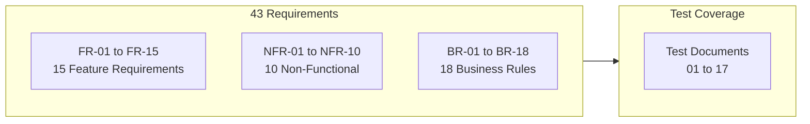
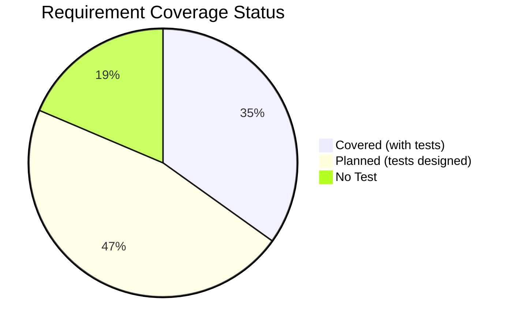

# Requirements Traceability Matrix — Localization Module

> **Version:** 1.0.0
> **Date:** 2026-03-12
> **Status:** [IN-PROGRESS]
> **Source:** `docs/Localization/Design/01-PRD.md` (FR-01 to FR-15, NFR-01 to NFR-10, BR-01 to BR-18)

---

## 1. Overview

**Target:** Every requirement has >= 1 test case covering it.

---

## 2. Feature Requirements Traceability

| Req ID | Description | Status | Test IDs | Test Type | Covered |
|--------|-------------|--------|----------|-----------|---------|
| FR-01 | System Languages Management | [IMPLEMENTED] | BU-LS-01 to BU-LS-12, BU-LC-01 to BU-LC-09, FU-ALS-01 to FU-ALS-11, FU-MLS-01 to FU-MLS-11, DS-01 to DS-44, L-01 to L-11, INT-LI-01 to INT-LI-08 | Unit, E2E, Integration | YES |
| FR-02 | Translation Dictionary | [IMPLEMENTED] | BU-DS-01 to BU-DS-06, BU-DS-14, BU-DS-15, BU-DC-01 to BU-DC-05, FU-ALS-12, FU-ALS-14, FU-MLS-03, D-01 to D-09, INT-DI-01, INT-DI-06 | Unit, E2E, Integration | YES |
| FR-03 | Dictionary Import/Export | [IMPLEMENTED] | BU-DS-08 to BU-DS-11, BU-DC-06, BU-DC-07, BU-DC-10, FU-ALS-15, FU-MLS-08, FU-MLS-11, IE-01 to IE-09, INT-IE-01 to INT-IE-07 | Unit, E2E, Integration | YES |
| FR-04 | Dictionary Rollback | [IMPLEMENTED] | BU-DS-12, BU-DS-13, BU-DC-08, BU-DC-09, FU-ALS-13, FU-ALS-16, FU-MLS-04, FU-MLS-07, R-01 to R-06, INT-DI-03 to INT-DI-05 | Unit, E2E, Integration | YES |
| FR-05 | User Language Preference | [IMPLEMENTED] | BU-LC-03, BU-UL-01 to BU-UL-04, CT-UL-01 to CT-UL-03, INT-LI-07, LS-04 | Unit, Contract, Integration, E2E | YES |
| FR-06 | Translation Bundle API | [IMPLEMENTED] | BU-BS-01 to BU-BS-06, CT-B-01 to CT-B-05, INT-BI-01 to INT-BI-03, PERF-01, PERF-02 | Unit, Contract, Integration, Perf | YES |
| FR-07 | Frontend i18n Runtime | [PLANNED] | FU-TS-01 to FU-TS-08, FU-TP-01 to FU-TP-06 | Unit (planned) | PLANNED |
| FR-08 | Language Switcher | [PLANNED] | FU-LSC-01 to FU-LSC-06, LS-01 to LS-09, DS-P-14 to DS-P-18, RESP-13, RESP-14 | Unit, E2E, Design System, Responsive (all planned) | PLANNED |
| FR-09 | Backend i18n Infrastructure | [PLANNED] | FU-LI-01 to FU-LI-05 | Unit (planned) | PLANNED |
| FR-10 | Agentic Translation with HITL | [PLANNED] | — | — | NO TEST |
| FR-11 | Translation Workflow (3 Scenarios) | [PLANNED] | — | — | NO TEST |
| FR-12 | Translation Reflection Flow | [PLANNED] | — | — | NO TEST |
| FR-13 | Duplication Detection | [PLANNED — Next Release] | — | — | NO TEST (deferred) |
| FR-14 | String Externalization | [PLANNED] | CI-LINT-04, CI-LINT-05 | CI (planned) | PLANNED |
| FR-15 | Tenant Translation Overrides | [PLANNED] | BU-TO-01 to BU-TO-08, BU-TOC-01 to BU-TOC-05, CT-A-11 to CT-A-13, INT-BI-04 to INT-BI-07, SEC-TI-01 to SEC-TI-06 | Unit, Contract, Integration, Security (all planned) | PLANNED |

---

## 3. Non-Functional Requirements Traceability

| Req ID | Category | Description | Test IDs | Test Type | Covered |
|--------|----------|-------------|----------|-----------|---------|
| NFR-01 | Performance | Bundle fetch < 200ms (Valkey-cached) | PERF-01, PERF-02, INT-BI-02 | Performance, Integration | PLANNED |
| NFR-02 | Performance | Language switch < 500ms (no reload) | PERF-03, FU-TS-06, LS-02 | Performance, Unit, E2E | PLANNED |
| NFR-03 | Availability | Static fallback (en-US.json) when backend unreachable | FU-TS-03 | Unit (planned) | PLANNED |
| NFR-04 | Security | CSV injection prevention | BU-DS-13, SEC-CSV-01 to SEC-CSV-04, SEC-IV-01 to SEC-IV-04, BU-TO-07 | Unit, Security | PLANNED |
| NFR-05 | Security | 10MB file size limit | IE-06, INT-IE-05, SEC-FU-01 | E2E, Integration, Security | PLANNED |
| NFR-06 | Accessibility | WCAG AAA, keyboard nav, ARIA | A-*, AA-*, AAA-*, DS-27 to DS-29, RESP-01 to RESP-15 | Accessibility, Design System, Responsive | PARTIALLY |
| NFR-07 | RTL | Full RTL support | FU-ALS-06, FU-ALS-07, DS-30, DS-31, LS-03, D-09, UX-RTL-01 to UX-RTL-05, DS-P-19 | Unit, E2E, Design System, UI/UX | PARTIALLY |
| NFR-08 | Scalability | 50-version retention + cleanup | INT-DI-05 | Integration (planned) | PLANNED |
| NFR-09 | Caching | Bundle cached in Valkey, invalidated on commit | BU-DS-07, BU-BS-01 to BU-BS-06, INT-BI-02 to INT-BI-06, PERF-09, PERF-10 | Unit, Integration, Performance | PLANNED |
| NFR-10 | Rate Limiting | Max 5 imports per hour per user | BU-DS-08, IE-07, INT-IE-02, PERF-04 | Unit, E2E, Integration, Performance | PLANNED |

---

## 4. Business Rules Traceability

| Req ID | Rule | Test IDs | Test Type | Covered |
|--------|------|----------|-----------|---------|
| BR-01 | Cannot deactivate alternative locale | BU-LS-02, BU-LC-07, L-05, UX-IP-08 | Unit, E2E, UI/UX | YES |
| BR-02 | Cannot deactivate last active locale | BU-LS-03, INT-LI-04, L-06 | Unit, Integration, E2E | YES |
| BR-03 | Locale must be active to set alternative | BU-LS-05, INT-LI-05 | Unit, Integration | YES |
| BR-04 | Deactivating locale migrates users to alternative | L-04 | E2E (planned) | PLANNED |
| BR-05 | Import preview tokens expire after 30 min | BU-DS-09, BU-DS-11, INT-IE-03, IE-08 | Unit, Integration, E2E | YES |
| BR-06 | Every modification creates version snapshot | BU-DS-07, BU-DC-05, INT-DI-02 | Unit, Integration | YES |
| BR-07 | Rollback creates pre-rollback snapshot | BU-DS-12, BU-DC-09, INT-DI-04, R-02, R-03 | Unit, Integration, E2E | YES |
| BR-08 | Bundles use global base + tenant overrides (overlay) | BU-TO-05, INT-BI-04 | Unit, Integration (planned) | PLANNED |
| BR-09 | Anonymous users can fetch bundles/detect | BU-LC-03, BU-LC-04, SEC-RBAC-04, INT-BI-07, LS-08 | Unit, Security, Integration, E2E | YES |
| BR-10 | AI translations preserve `{param}` placeholders | D-08, FU-TS-05, FU-TP-03 | E2E, Unit (planned) | PLANNED |
| BR-11 | Manual/imported translations go live immediately | — | — | NO TEST |
| BR-12 | Agentic translations flagged PENDING_REVIEW | — | — | NO TEST |
| BR-13 | Translation updates reflected within 5 min (polling) | FU-TS-07 | Unit (planned) | PLANNED |
| BR-14 | Admin sees updates immediately (same-session) | D-04 | E2E (planned) | PLANNED |
| BR-15 | Tenant overrides take precedence over global | BU-TO-05, INT-BI-04, SEC-TI-05 | Unit, Integration, Security (planned) | PLANNED |
| BR-16 | Tenant overrides isolated (cross-tenant blocked) | BU-TO-04, SEC-TI-01 to SEC-TI-06 | Unit, Security (planned) | PLANNED |
| BR-17 | Global translation change invalidates ALL tenant caches | BU-BS-06, INT-BI-06 | Unit, Integration (planned) | PLANNED |
| BR-18 | Anonymous users receive global translations only | INT-BI-07, SEC-RBAC-04, CT-B-04 | Integration, Security, Contract (planned) | PLANNED |

---

## 5. Coverage Summary

| Status | Count | Percentage | Requirements |
|--------|-------|------------|-------------|
| **Covered** (existing tests) | 15 | 35% | FR-01 to FR-06, BR-01 to BR-03, BR-05 to BR-07, BR-09 |
| **Planned** (tests designed, not written) | 20 | 47% | FR-07 to FR-09, FR-14, FR-15, NFR-01 to NFR-10, BR-04, BR-08, BR-10, BR-13 to BR-18 |
| **No Test** | 8 | 18% | FR-10 to FR-13, BR-11, BR-12 |

---

## 6. Gap Analysis

### Requirements Without Tests

| Req ID | Description | Reason | Recommendation |
|--------|-------------|--------|----------------|
| FR-10 | Agentic Translation with HITL | Feature not yet designed in detail | Defer until agentic flow implemented |
| FR-11 | Translation Workflow (3 Scenarios) | Cross-cutting flow — no single test | Create E2E workflow test covering all 3 paths |
| FR-12 | Translation Reflection Flow | Feature not yet implemented | Defer until reflection flow implemented |
| FR-13 | Duplication Detection | Deferred to next release | No action needed this release |
| BR-11 | Manual/imported go live immediately | Implicitly tested via D-04, IE-03 | Add explicit assertion to existing tests |
| BR-12 | Agentic PENDING_REVIEW status | Depends on FR-10 | Defer until agentic flow implemented |

---

## 7. Scenario Matrix Cross-Reference

All 118 scenarios from `docs/Localization/Backlog/05-Scenario-Matrix.md` are mapped below:

| User Story | Scenarios | Test Document(s) | Coverage |
|------------|-----------|-------------------|----------|
| US-LM-01 (Languages) | H-01 to H-07, A-01 to A-03, E-01 to E-05 | 01, 02, 03, 05 | FULL |
| US-LM-02 (Dictionary) | H-08 to H-12, E-06 to E-12 | 01, 02, 05 | FULL |
| US-LM-03 (Import/Export) | H-13 to H-15, A-04 to A-06, E-13 to E-20 | 01, 03, 05, 13 | FULL |
| US-LM-04 (Rollback) | H-16 to H-18, E-21 to E-24 | 01, 03, 05 | FULL |
| US-LM-05 (User Preference) | H-19 to H-21, A-07 to A-09, E-25 to E-29 | 01, 04 | FULL |
| US-LM-06 (i18n Runtime) | H-22 to H-25, E-30 to E-35 | 02 (planned) | PLANNED |
| Agentic Translation | H-26 to H-28, E-36 to E-41 | — | NO TEST |
| RBAC Edge Cases | R-01 to R-06 | 01, 13 | FULL |
| US-LM-07 (Language Switcher) | H-29 to H-32, E-42 to E-47 | 02, 05, 08 (planned) | PLANNED |
| US-LM-08 (Backend i18n) | H-35 to H-38, E-48 to E-51 | 02 (planned) | PLANNED |
| US-LM-09 (Reflection Flow) | H-39 to H-43, E-52 to E-56 | — | NO TEST |
| US-LM-10 (String Externalization) | H-44, H-45 | 16 (planned) | PLANNED |
| US-LM-11 (Tenant Overrides) | H-46 to H-53, A-10, A-11, E-57 to E-66 | 01, 03, 04, 13 (planned) | PLANNED |
| NFR Performance | P-01 to P-03 | 14 (planned) | PLANNED |

---

## 8. Document Cross-References

| Test Document | FR Coverage | NFR Coverage | BR Coverage |
|--------------|-------------|-------------|-------------|
| [01-Backend-Unit-Tests](../Unit/01-Backend-Unit-Tests.md) | FR-01 to FR-06, FR-15 | NFR-04, NFR-09, NFR-10 | BR-01 to BR-03, BR-05 to BR-07, BR-15 to BR-17 |
| [02-Frontend-Unit-Tests](../Unit/02-Frontend-Unit-Tests.md) | FR-01 to FR-09 | NFR-02, NFR-03, NFR-07 | BR-06, BR-07, BR-10, BR-13 |
| [03-Backend-Integration-Tests](../Integration/03-Backend-Integration-Tests.md) | FR-01 to FR-06, FR-15 | NFR-09, NFR-10 | BR-02, BR-05 to BR-08, BR-15 to BR-18 |
| [04-API-Contract-Tests](../Integration/04-API-Contract-Tests.md) | FR-01 to FR-06, FR-15 | NFR-09 | BR-09, BR-15, BR-18 |
| [05-Functional-E2E-Tests](../E2E/05-Functional-E2E-Tests.md) | FR-01 to FR-08 | NFR-02, NFR-05, NFR-06, NFR-07, NFR-10 | BR-01 to BR-07, BR-09, BR-10 |
| [06-Responsive-Tests](../E2E/06-Responsive-Tests.md) | FR-01 to FR-03, FR-08 | NFR-06 | — |
| [07-Visual-Regression-Tests](../E2E/07-Visual-Regression-Tests.md) | FR-01 to FR-04, FR-08 | NFR-07 | — |
| [08-Design-System-Tests](../UI-UX/08-Design-System-Tests.md) | FR-01 to FR-04, FR-08 | NFR-06, NFR-07 | — |
| [09-UI-UX-Visual-Tests](../UI-UX/09-UI-UX-Visual-Tests.md) | FR-01 to FR-04, FR-08 | NFR-06, NFR-07 | BR-01, BR-06 |
| [10-WCAG-2.2-Level-A-Tests](../Accessibility/10-WCAG-2.2-Level-A-Tests.md) | FR-01, FR-02, FR-08 | NFR-06 | — |
| [11-WCAG-2.2-Level-AA-Tests](../Accessibility/11-WCAG-2.2-Level-AA-Tests.md) | — | NFR-06 | — |
| [12-WCAG-2.2-Level-AAA-Tests](../Accessibility/12-WCAG-2.2-Level-AAA-Tests.md) | — | NFR-06 | — |
| [13-Security-Tests](../Security/13-Security-Tests.md) | FR-01, FR-03, FR-15 | NFR-04, NFR-05 | BR-09, BR-16 |
| [14-Performance-Tests](../Performance/14-Performance-Tests.md) | FR-06 | NFR-01, NFR-02, NFR-09, NFR-10 | — |
| [15-Regression-Suite](../Regression/15-Regression-Suite.md) | FR-01 to FR-06, FR-08 | NFR-09, NFR-10 | BR-01, BR-06, BR-09 |
| [16-Angular-CI-Tests](../CI/16-Angular-CI-Tests.md) | FR-14 | — | — |
| [17-OpenAPI-Validation-Tests](../CI/17-OpenAPI-Validation-Tests.md) | FR-01 to FR-06, FR-15 | — | — |
