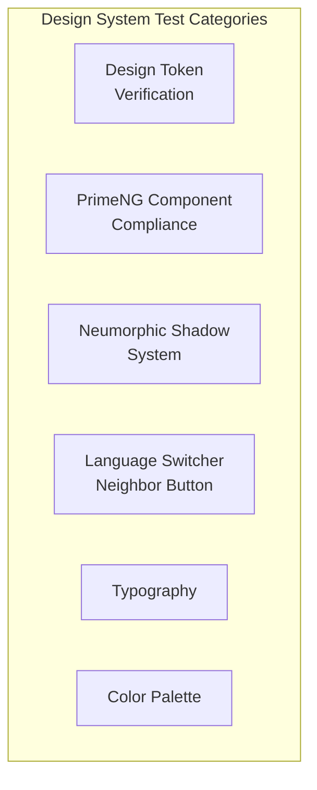

# Design System Tests — Localization Module

> **Version:** 1.0.0
> **Date:** 2026-03-12
> **Status:** [IN-PROGRESS] — 44 existing (Vitest) + 37 existing (Playwright E2E), 20 planned
> **Framework:** Vitest 4.0.8 + Angular TestBed (unit), Playwright 1.55.0 (E2E)
> **Design System:** EMSIST Neumorphic — `shell-layout.component.scss` + ThinkPlusPrimePreset

---

## 1. Overview

---

## 2. Existing Design System Tests (Vitest — 44 tests)

**File:** `frontend/src/app/features/administration/sections/master-locale/master-locale-design-system.spec.ts`

### 2.1 Layout Structure

| ID | Test | Assertion | Status |
|----|------|-----------|--------|
| DS-01 | `should render locale-section` | `.locale-section` container exists | WRITTEN |
| DS-02 | `should render 4 tabs` | 4 `.tab-button` elements | WRITTEN |
| DS-03 | `should render correct tab labels` | Labels: Languages, Dictionary, Import/Export, Rollback | WRITTEN |
| DS-04 | `should render tab-content area` | `.tab-content` element exists | WRITTEN |

### 2.2 Tab Active State

| ID | Test | Assertion | Status |
|----|------|-----------|--------|
| DS-05 | `should apply active class to selected tab` | `.tab-button.active` on first tab | WRITTEN |
| DS-06 | `should move active class on switch` | Active class moves on click | WRITTEN |
| DS-07 | `should apply bottom border via CSS` | `border-bottom` computed style on active | WRITTEN |

### 2.3 Tab Bar CSS Tokens

| ID | Test | Assertion | Token | Status |
|----|------|-----------|-------|--------|
| DS-08 | `tab-bar should use flex layout` | `display: flex` on `.tab-bar` | Layout token | WRITTEN |
| DS-09 | `buttons should be flat (not neumorphic)` | No `box-shadow` on tab buttons | Neumorphic exception | WRITTEN |

### 2.4 Languages Table (PrimeNG Compliance)

| ID | Test | Component | Assertion | Status |
|----|------|-----------|-----------|--------|
| DS-10 | `should render p-table` | `p-table` | PrimeNG table rendered | WRITTEN |
| DS-11 | `should render 7 header columns` | `th` | 7 header cells | WRITTEN |
| DS-12 | `should render 3 locale rows` | `tr` body rows | Mock data rows rendered | WRITTEN |
| DS-13 | `should render code in tag` | `p-tag` | Locale code in PrimeNG tag | WRITTEN |
| DS-14 | `should render direction tag` | `p-tag` | LTR/RTL direction badge | WRITTEN |
| DS-15 | `should render toggle switches` | `p-toggleSwitch` | Active toggle present | WRITTEN |
| DS-16 | `should render radio buttons` | `input[type=radio]` | Alternative radio | WRITTEN |
| DS-17 | `should check alternative radio` | `radio:checked` | Default alternative selected | WRITTEN |

### 2.5 Search & Paginator

| ID | Test | Component | Assertion | Status |
|----|------|-----------|-----------|--------|
| DS-18 | `should render search input with placeholder` | `input[placeholder]` | Placeholder text present | WRITTEN |
| DS-19 | `should render search icon` | `.pi-search` | Search icon visible | WRITTEN |
| DS-20 | `should render PrimeNG paginator` | `p-paginator` | Paginator component present | WRITTEN |

### 2.6 Error Banner & Loading Overlay

| ID | Test | State | Assertion | Status |
|----|------|-------|-----------|--------|
| DS-21 | `no error when none exists` | No error | `.error-banner` not visible | WRITTEN |
| DS-22 | `show error banner when error` | Error set | `.error-banner` visible | WRITTEN |
| DS-23 | `display error message` | Error set | Error text displayed | WRITTEN |
| DS-24 | `render dismiss button` | Error set | Dismiss button present | WRITTEN |
| DS-25 | `no overlay when not loading` | Not loading | `.loading-overlay` not visible | WRITTEN |
| DS-26 | `show overlay with spinner when loading` | Loading | `.loading-overlay` + spinner visible | WRITTEN |

### 2.7 Keyboard Navigation

| ID | Test | Target | Assertion | Status |
|----|------|--------|-----------|--------|
| DS-27 | `tab buttons focusable` | Tab buttons | `tabindex` not -1 | WRITTEN |
| DS-28 | `search input focusable` | Search input | Focusable via Tab | WRITTEN |
| DS-29 | `radio buttons keyboard accessible` | Radio inputs | Name attribute grouping | WRITTEN |

### 2.8 RTL Support

| ID | Test | Scenario | Assertion | Status |
|----|------|----------|-----------|--------|
| DS-30 | `identify RTL locales` | ar-SA in list | RTL direction detected | WRITTEN |
| DS-31 | `render RTL direction tag with warn` | RTL locale | p-tag severity="warn" for RTL | WRITTEN |

### 2.9 Flag Emoji

| ID | Test | Input | Expected | Status |
|----|------|-------|----------|--------|
| DS-32 | `render flag for valid country` | "US" | Flag emoji rendered | WRITTEN |
| DS-33 | `render globe for undefined` | undefined | 🌐 globe | WRITTEN |
| DS-34 | `render globe for invalid` | "XX" | 🌐 globe | WRITTEN |

### 2.10 Badge Severity

| ID | Test | Change Type | Expected Severity | Status |
|----|------|-------------|-------------------|--------|
| DS-35 | `ROLLBACK -> warn` | ROLLBACK | `warn` | WRITTEN |
| DS-36 | `IMPORT -> info` | IMPORT | `info` | WRITTEN |
| DS-37 | `EDIT -> success` | EDIT | `success` | WRITTEN |
| DS-38 | `unknown -> success` | OTHER | `success` (default) | WRITTEN |

### 2.11 Import/Export & Rollback Tabs

| ID | Test | Tab | Assertion | Status |
|----|------|-----|-----------|--------|
| DS-39 | `render export section` | Import/Export | Export section visible | WRITTEN |
| DS-40 | `render export button` | Import/Export | Export button present | WRITTEN |
| DS-41 | `render import file upload` | Import/Export | File input present | WRITTEN |
| DS-42 | `render version table with 6 cols` | Rollback | 6-column table | WRITTEN |
| DS-43 | `show empty message` | Rollback | Empty state message | WRITTEN |

### 2.12 Component Composition

| ID | Test | Component | Assertion | Status |
|----|------|-----------|-----------|--------|
| DS-44 | `include p-toast and p-confirmDialog` | Composition | Both PrimeNG overlays present | WRITTEN |

---

## 3. Existing Design System Tests (Playwright E2E — 37 tests)

**File:** `frontend/e2e/localization-design-system.spec.ts`

> Summarized in [07-Visual-Regression-Tests.md](../E2E/07-Visual-Regression-Tests.md). Key design token tests:

| ID | Test | Token/Property | Expected Value | Status |
|----|------|---------------|----------------|--------|
| DS-E2E-01 | `tab bar should use flex layout` | `display` | `flex` | WRITTEN |
| DS-E2E-02 | `tab buttons should use correct font sizing` | `font-size` | `0.875rem` | WRITTEN |
| DS-E2E-03 | `tab-content should have fade-in animation` | `animation-name` | `fadeIn` | WRITTEN |
| DS-E2E-04 | `active tab should have bottom border color` | `border-bottom-color` | `--adm-tab-active-border` | WRITTEN |
| DS-E2E-05 | `locale-section container should have padding` | `padding` | `1.5rem` | WRITTEN |
| DS-E2E-06 | `toolbar search input should have fixed width` | `min-width` | `280px` | WRITTEN |

---

## 4. Planned Design System Tests (20 tests)

### 4.1 Design Token Verification [PLANNED]

| ID | Test | Token | Expected Value | Source |
|----|------|-------|----------------|--------|
| DS-P-01 | Island shadow applied to locale-section | `--tp-island-shadow` | `4px 4px 12px rgba(0,0,0,0.06), -2px -2px 8px rgba(255,255,255,0.7)` | `shell-layout.component.scss` |
| DS-P-02 | Card background color | `--adm-card-bg` | `var(--tp-surface-card)` | Design system |
| DS-P-03 | Tab active border uses forest green | `--adm-tab-active-border` | `#428177` (Forest Green) | Color palette |
| DS-P-04 | Error banner uses deep umber | `.error-banner background` | `#6b1f2a` (Deep Umber) | Color palette |
| DS-P-05 | Wheat light background | `--tp-surface-ground` | `#edebe0` (Wheat Light) | Color palette |

### 4.2 PrimeNG Theme Compliance [PLANNED]

| ID | Test | Component | Assertion |
|----|------|-----------|-----------|
| DS-P-06 | p-table renders with ThinkPlusPrimePreset | `p-table` | Header bg matches preset, row hover uses wheat |
| DS-P-07 | p-dialog uses neumorphic shadow | `p-dialog` | Box-shadow matches island shadow token |
| DS-P-08 | p-toast uses correct severity colors | `p-toast` | Success=green, Warn=amber, Error=red per palette |
| DS-P-09 | p-tag uses rounded style | `p-tag` | `border-radius: 999px` for locale code tags |
| DS-P-10 | p-paginator uses forest green | `p-paginator` | Active page button uses `#428177` |

### 4.3 Neumorphic Shadow System [PLANNED]

| ID | Test | Element | Expected Shadow |
|----|------|---------|----------------|
| DS-P-11 | Island shadow on locale-section | `.locale-section` | Outer: `4px 4px 12px`, Inner: `-2px -2px 8px` |
| DS-P-12 | Inset shadow on search input | `.toolbar input` | Inset shadow on focus |
| DS-P-13 | Button bezel gradient on export button | `.export-btn` | Linear gradient with subtle bevel |

### 4.4 Language Switcher Neighbor Button [PLANNED]

| ID | Test | Property | Expected Value | Source |
|----|------|----------|----------------|--------|
| DS-P-14 | Pill shape | `border-radius` | `999px` | `.topnav a` |
| DS-P-15 | Min height | `min-height` | `44px` | `.topnav a` |
| DS-P-16 | Golden wheat border | `border` | `1px solid #b9a779` | `.topnav a` |
| DS-P-17 | Gap between neighbor buttons | `gap` | `0.35rem` | `.topnav` |
| DS-P-18 | No individual shadow | `box-shadow` | `none` | `.topnav a` |

### 4.5 Typography [PLANNED]

| ID | Test | Element | Expected Font |
|----|------|---------|---------------|
| DS-P-19 | RTL locale uses Noto Sans Arabic | `[dir=rtl] body` | `'Noto Sans Arabic', sans-serif` |
| DS-P-20 | Table headers use correct weight | `p-table th` | `font-weight: 600` |

---

## 5. Color Palette Reference

| Name | Hex | Usage |
|------|-----|-------|
| Forest Green | `#428177` | Active states, primary actions, tab borders |
| Deep Umber | `#6b1f2a` | Error states, destructive action warnings |
| Wheat Light | `#edebe0` | Surface background, ground color |
| Golden Wheat | `#b9a779` | Borders, secondary accents, header buttons |
| Dark Teal | `#054239` | Focus outlines, text on light backgrounds |
