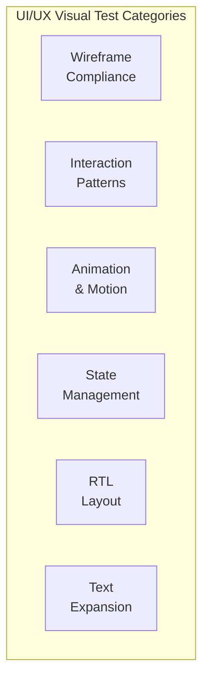

# UI/UX Visual Tests — Localization Module

> **Version:** 1.0.0
> **Date:** 2026-03-12
> **Status:** [PLANNED] — 0 written, 0 executed
> **Framework:** Playwright 1.55.0 (screenshots + visual comparison), Vitest (signal state assertions)
> **Source:** `docs/Localization/Design/05-UI-UX-Design-Spec.md` wireframes

---

## 1. Overview



---

## 2. Wireframe Compliance Tests [PLANNED]

| ID | Test | Component | Wireframe Ref | Assertions | FR/BR |
|----|------|-----------|---------------|------------|-------|
| UX-WC-01 | Languages tab matches wireframe | Languages tab | §3.2 Languages Tab | Tab bar top, toolbar below, table centered, paginator bottom | FR-01 |
| UX-WC-02 | Dictionary tab matches wireframe | Dictionary tab | §3.3 Dictionary Tab | Search bar + table + edit action per row | FR-02 |
| UX-WC-03 | Import/Export tab matches wireframe | Import/Export tab | §3.4 Import/Export Tab | Export section (button + info) + Import section (upload + preview) | FR-03 |
| UX-WC-04 | Rollback tab matches wireframe | Rollback tab | §3.5 Rollback Tab | Version history table + rollback actions | FR-04 |
| UX-WC-05 | Language Switcher matches wireframe | Language Switcher | §3.1 Language Switcher | Pill button in header → dropdown with flags + names | FR-08 |

---

## 3. Interaction Pattern Tests [PLANNED]

| ID | Test | Interaction | Steps | Expected Behavior | FR/BR |
|----|------|-------------|-------|-------------------|-------|
| UX-IP-01 | Tab switching | Click tab | 1. Click "Dictionary" tab | Content area transitions, tab indicator moves | FR-01 |
| UX-IP-02 | Edit dialog open | Click edit icon | 1. Click edit on dictionary entry | Dialog slides in from center, backdrop overlay | FR-02 |
| UX-IP-03 | Edit dialog close (save) | Click Save | 1. Modify value 2. Click Save | Dialog closes, toast appears bottom-right | FR-02, BR-06 |
| UX-IP-04 | Edit dialog close (cancel) | Click Cancel | 1. Click Cancel | Dialog closes, no toast, no changes | FR-02 |
| UX-IP-05 | Dropdown open | Click trigger | 1. Click language switcher | Dropdown slides down with animation | FR-08 |
| UX-IP-06 | Dropdown close (selection) | Click item | 1. Click locale in dropdown | Dropdown closes, UI language updates | FR-08, NFR-02 |
| UX-IP-07 | Toast lifecycle | Auto-dismiss | 1. Trigger toast | Toast appears, auto-dismisses after 5s | FR-01 |
| UX-IP-08 | Confirm dialog flow | Destructive action | 1. Click deactivate 2. Confirm dialog | Dialog: title + message + Cancel/Confirm buttons | FR-01, BR-01 |

---

## 4. Animation & Motion Tests [PLANNED]

| ID | Test | Element | Animation | Duration | FR/BR |
|----|------|---------|-----------|----------|-------|
| UX-AM-01 | Tab content fade-in | `.tab-content` | `fadeIn` opacity 0→1 | 150ms | FR-01 |
| UX-AM-02 | Toggle switch transition | `p-toggleSwitch` | Scale + color transition | 150ms | FR-01 |
| UX-AM-03 | Progress bar width animation | `.coverage-bar .fill` | Width 0% → N% | 400ms ease-out | FR-02 |
| UX-AM-04 | Toast slide-in | `p-toast-message` | Slide from right | 300ms | FR-01 |
| UX-AM-05 | Dialog backdrop fade | `.p-dialog-mask` | Opacity 0→0.4 | 200ms | FR-02 |

---

## 5. State Management Tests [PLANNED]

| ID | Test | State | Visual Indicator | Assertions | FR/BR |
|----|------|-------|------------------|------------|-------|
| UX-SM-01 | Loading overlay | `loading()=true` | Full-page overlay with spinner | Overlay covers content, spinner centered | FR-01 |
| UX-SM-02 | Error banner | `error()!=null` | Red banner top of content | Banner visible, message text, dismiss button | FR-01 |
| UX-SM-03 | Empty state — dictionary | No entries | "No translation entries found" | Illustration/icon + message + suggested action | FR-02 |
| UX-SM-04 | Empty state — versions | No versions | "No version history yet" | Message with explanation | FR-04 |
| UX-SM-05 | Skeleton loading | Initial load | Skeleton placeholder rows | p-skeleton components in table rows | FR-01 |

---

## 6. RTL Layout Tests [PLANNED]

| ID | Test | Element | LTR Behavior | RTL Behavior | FR/BR |
|----|------|---------|-------------|-------------|-------|
| UX-RTL-01 | HTML dir attribute | `<html>` | `dir="ltr"` | `dir="rtl"` | NFR-07 |
| UX-RTL-02 | Text alignment flip | Table cells | `text-align: left` | `text-align: right` | NFR-07 |
| UX-RTL-03 | Icon mirroring | Navigation icons | Default orientation | `transform: scaleX(-1)` on directional icons | NFR-07 |
| UX-RTL-04 | Flag emoji positioning | Locale rows | Flag on left side | Flag on right side | NFR-07 |
| UX-RTL-05 | Tab bar direction | `.tab-bar` | Left-to-right order | Right-to-left order | NFR-07 |

---

## 7. PrimeNG Text Expansion Tests [PLANNED]

| ID | Test | Component | Property | Expected Value | FR/BR |
|----|------|-----------|----------|----------------|-------|
| UX-TE-01 | Search input min-width | `.toolbar input` | `min-width` | 280px (expands to 400px on focus) | FR-02 |
| UX-TE-02 | Translation cell max-width | `.translation-cell` | `max-width` | 300px with `text-overflow: ellipsis` | FR-02 |
| UX-TE-03 | Dialog responsive sizing | `p-dialog` | `min-width` / `max-width` | 480px / 90vw | FR-02 |

---

## 8. Execution Commands

```bash
# Run UI/UX visual tests
npx playwright test e2e/localization-ux-visual.spec.ts

# Run with screenshots for visual comparison
npx playwright test --update-snapshots e2e/localization-ux-visual.spec.ts

# Run Vitest state management tests
npx vitest run src/app/features/administration/sections/master-locale/master-locale-ux.spec.ts
```

---

## 9. Acceptance Criteria

| Category | Pass Criteria |
|----------|--------------|
| Wireframe compliance | All 5 component layouts match §3.x anatomy diagrams (visual comparison) |
| Interaction patterns | All 8 interactions complete without visual glitches |
| Animation | All animations use correct duration (tolerance ±50ms) and easing |
| State management | All 5 states render correct visual indicators |
| RTL | All 5 RTL tests pass with correct mirroring |
| Text expansion | All 3 sizing rules verified via computed styles |
