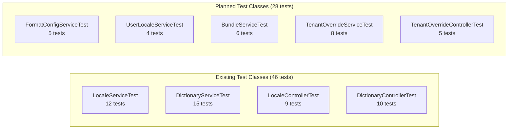

# Backend Unit Tests — Localization Service

> **Version:** 1.0.0
> **Date:** 2026-03-12
> **Status:** [IN-PROGRESS] — 46 tests written, 0 executed
> **Framework:** JUnit 5.10 + Mockito 5.x + AssertJ 3.x
> **Coverage Target:** 80% line, 75% branch (JaCoCo)

---

## 1. Test Class Overview



**Execution command:**
```bash
cd backend/localization-service
mvn test -pl . -Dtest="*Test" -Djacoco.destFile=target/jacoco.exec
mvn jacoco:report
```

---

## 2. LocaleServiceTest

**File:** `backend/localization-service/src/test/java/com/ems/localization/service/LocaleServiceTest.java`
**Tests:** 12 | **Status:** WRITTEN, NOT EXECUTED

| ID | Method | Scenario | Expected Result | FR/BR | Status |
|----|--------|----------|----------------|-------|--------|
| BU-LS-01 | `activate_shouldSetActiveAndAuditFields_whenLocaleExists` | Activate an inactive locale | `isActive=true`, audit fields populated | FR-01, BR-03 | WRITTEN |
| BU-LS-02 | `deactivate_shouldThrowConflict_whenLocaleIsAlternative` | Deactivate the alternative locale | `ConflictException("alternative locale")` | FR-01, BR-01 | WRITTEN |
| BU-LS-03 | `deactivate_shouldThrowConflict_whenOnlyOneActiveLocale` | Deactivate the last active locale | `ConflictException("last active")` | FR-01, BR-02 | WRITTEN |
| BU-LS-04 | `deactivate_shouldSucceed_whenMultipleActiveLocalesAndNotAlternative` | Deactivate non-alternative with multiple active | `isActive=false` | FR-01 | WRITTEN |
| BU-LS-05 | `setAlternative_shouldThrowLocalizationException_whenLocaleIsInactive` | Set alternative on inactive locale | `LocalizationException("active")` | FR-01, BR-03 | WRITTEN |
| BU-LS-06 | `setAlternative_shouldClearPreviousAlternativeAndSetNew` | Set alternative clears old, sets new | Old alternative cleared, new set, 2 saves | FR-01 | WRITTEN |
| BU-LS-07 | `toDto_shouldMapAllFields` | DTO mapping covers all fields | All fields present in DTO | FR-01 | WRITTEN |
| BU-LS-08 | `activate_shouldThrowEntityNotFoundException_whenLocaleNotFound` | Activate non-existent locale | `EntityNotFoundException` | FR-01 | WRITTEN |
| BU-LS-09 | `getActive_shouldReturnOnlyActiveLocales` | List active locales | Only active locales returned | FR-01 | WRITTEN |
| BU-LS-10 | `deactivate_shouldThrowEntityNotFoundException_whenLocaleNotFound` | Deactivate non-existent locale | `EntityNotFoundException` | FR-01 | WRITTEN |
| BU-LS-11 | `setAlternative_shouldThrowEntityNotFoundException_whenLocaleNotFound` | Set alternative on non-existent locale | `EntityNotFoundException` | FR-01 | WRITTEN |
| BU-LS-12 | `setAlternative_shouldSetAlternative_whenNoPreviousAlternativeExists` | Set alternative when none exists | New alternative set, no NPE | FR-01 | WRITTEN |

### Scenario Matrix Coverage

| Scenario ID | Description | Test ID |
|-------------|-------------|---------|
| US-LM-01-H-01 | Activate locale | BU-LS-01 |
| US-LM-01-H-02 | Deactivate locale | BU-LS-04 |
| US-LM-01-H-06 | Set alternative locale | BU-LS-06 |
| US-LM-01-A-01 | Deactivate alternative blocked | BU-LS-02 |
| US-LM-01-A-02 | Deactivate last active blocked | BU-LS-03 |
| US-LM-01-E-01 | Locale not found | BU-LS-08, BU-LS-10, BU-LS-11 |
| US-LM-01-E-02 | Set alternative on inactive | BU-LS-05 |

---

## 3. DictionaryServiceTest

**File:** `backend/localization-service/src/test/java/com/ems/localization/service/DictionaryServiceTest.java`
**Tests:** 15 | **Status:** WRITTEN, NOT EXECUTED

| ID | Method | Scenario | Expected Result | FR/BR | Status |
|----|--------|----------|----------------|-------|--------|
| BU-DS-01 | `search_shouldReturnPagedResponse` | Search dictionary with keyword | Paged response with matching entries | FR-02 | WRITTEN |
| BU-DS-02 | `getById_shouldReturnDictionaryEntryDto` | Fetch entry by ID | DTO with correct fields | FR-02 | WRITTEN |
| BU-DS-03 | `registerKeys_shouldSkipExistingKeys` | Register duplicate key | Count=0, no save called | FR-02 | WRITTEN |
| BU-DS-04 | `registerKeys_shouldInsertNewKey` | Register new key | Count=1, save called | FR-02 | WRITTEN |
| BU-DS-05 | `getCoverage_shouldReturnCoverageReport` | Translation coverage stats | Total, translated, missing counts + keys | FR-02 | WRITTEN |
| BU-DS-06 | `toDto_shouldMapTranslationsAsMap` | DTO maps translations as locale->value | Map contains "en-US" -> "Save" | FR-02 | WRITTEN |
| BU-DS-07 | `updateTranslations_shouldCreateSnapshotAndInvalidateCache` | Update translation value | Snapshot created, cache invalidated | FR-02, BR-06, NFR-09 | WRITTEN |
| BU-DS-08 | `importPreview_shouldThrowRateLimitException_whenLimitExceeded` | Import rate limit exceeded (6th import) | `RateLimitException` | FR-03, NFR-10 | WRITTEN |
| BU-DS-09 | `importPreview_shouldIncrementRateLimitAndStorePreview_whenUnderLimit` | Valid CSV import preview | Preview token generated, row counts correct | FR-03, BR-05 | WRITTEN |
| BU-DS-10 | `exportCsv_shouldStartWithUtf8Bom` | Export CSV file | UTF-8 BOM (0xEF 0xBB 0xBF) prefix | FR-03 | WRITTEN |
| BU-DS-11 | `importCommit_shouldThrowLocalizationException_whenPreviewExpired` | Commit with expired token | `LocalizationException("expired")` | FR-03, BR-05 | WRITTEN |
| BU-DS-12 | `rollback_shouldCreatePreRollbackSnapshot` | Rollback creates safety snapshot | At least 2 version saves (pre-rollback + restore) | FR-04, BR-07 | WRITTEN |
| BU-DS-13 | `toVersionDto_shouldNotExposeSnapshotData` | Version DTO hides snapshot | No `snapshotData` field in DTO (reflection check) | FR-04, NFR-04 | WRITTEN |
| BU-DS-14 | `search_shouldReturnEmptyPage_whenNoMatch` | Search with no results | Empty page, totalElements=0 | FR-02 | WRITTEN |
| BU-DS-15 | `getById_shouldThrowEntityNotFoundException_whenNotFound` | Fetch non-existent entry | `EntityNotFoundException` | FR-02 | WRITTEN |

### Scenario Matrix Coverage

| Scenario ID | Description | Test ID |
|-------------|-------------|---------|
| US-LM-02-H-08 | Search dictionary | BU-DS-01 |
| US-LM-02-H-09 | View entry details | BU-DS-02 |
| US-LM-02-H-11 | Edit translation | BU-DS-07 |
| US-LM-02-E-06 | Empty search results | BU-DS-14 |
| US-LM-02-E-07 | Entry not found | BU-DS-15 |
| US-LM-03-H-13 | Export CSV | BU-DS-10 |
| US-LM-03-H-14 | Import preview | BU-DS-09 |
| US-LM-03-A-04 | Rate limit exceeded | BU-DS-08 |
| US-LM-03-E-16 | Expired preview token | BU-DS-11 |
| US-LM-04-H-16 | Rollback version | BU-DS-12 |
| US-LM-04-E-24 | Snapshot not exposed | BU-DS-13 |

---

## 4. LocaleControllerTest

**File:** `backend/localization-service/src/test/java/com/ems/localization/controller/LocaleControllerTest.java`
**Tests:** 9 | **Status:** WRITTEN, NOT EXECUTED

| ID | Method | Scenario | Expected Result | FR/BR | Status |
|----|--------|----------|----------------|-------|--------|
| BU-LC-01 | `getActiveLocales_shouldReturn200_withAdminRole` | Admin fetches active locales | HTTP 200 + JSON array | FR-01, BR-09 | WRITTEN |
| BU-LC-02 | `searchLocales_shouldReturn200_withAdminRole` | Admin searches locales | HTTP 200 + paginated response | FR-01 | WRITTEN |
| BU-LC-03 | `detectLocale_shouldReturn200_withoutAuth` | Anonymous locale detection | HTTP 200 (no auth required) | FR-05, BR-09 | WRITTEN |
| BU-LC-04 | `searchLocales_shouldReturn403_withoutAdminRole` | Non-admin search attempt | HTTP 403 Forbidden | FR-01 | WRITTEN |
| BU-LC-05 | `activateLocale_shouldReturn200_withAdminRole` | Admin activates locale | HTTP 200 + updated DTO | FR-01 | WRITTEN |
| BU-LC-06 | `deactivateLocale_shouldReturn200_withAdminRole` | Admin deactivates locale | HTTP 200 + updated DTO | FR-01 | WRITTEN |
| BU-LC-07 | `deactivateLocale_shouldReturn409_whenAlternativeLocale` | Deactivate alternative locale | HTTP 409 Conflict | FR-01, BR-01 | WRITTEN |
| BU-LC-08 | `setAlternativeLocale_shouldReturn200_withAdminRole` | Admin sets alternative | HTTP 200 + updated DTO | FR-01 | WRITTEN |
| BU-LC-09 | `getActiveLocales_shouldReturn403_withoutAdminRole` | Non-admin list attempt | HTTP 403 Forbidden | FR-01 | WRITTEN |

### Scenario Matrix Coverage

| Scenario ID | Description | Test ID |
|-------------|-------------|---------|
| R-01 | Super Admin full access | BU-LC-01, BU-LC-05, BU-LC-06, BU-LC-08 |
| R-03 | End User blocked from admin | BU-LC-04, BU-LC-09 |
| R-06 | Anonymous public endpoints | BU-LC-03 |

---

## 5. DictionaryControllerTest

**File:** `backend/localization-service/src/test/java/com/ems/localization/controller/DictionaryControllerTest.java`
**Tests:** 10 | **Status:** WRITTEN, NOT EXECUTED

| ID | Method | Scenario | Expected Result | FR/BR | Status |
|----|--------|----------|----------------|-------|--------|
| BU-DC-01 | `searchDictionary_shouldReturn200_withAdminRole` | Admin searches dictionary | HTTP 200 + paginated entries | FR-02 | WRITTEN |
| BU-DC-02 | `searchDictionary_shouldReturn403_withoutAdminRole` | Non-admin search attempt | HTTP 403 Forbidden | FR-02 | WRITTEN |
| BU-DC-03 | `getCoverage_shouldReturn200_withAdminRole` | Admin views coverage | HTTP 200 + coverage DTO | FR-02 | WRITTEN |
| BU-DC-04 | `getEntry_shouldReturn200_withAdminRole` | Admin views entry | HTTP 200 + entry DTO | FR-02 | WRITTEN |
| BU-DC-05 | `updateTranslations_shouldReturn200_withAdminRole` | Admin updates translation | HTTP 200 + updated DTO | FR-02, BR-06 | WRITTEN |
| BU-DC-06 | `exportCsv_shouldReturn200_withContentTypeCsv` | Admin exports CSV | HTTP 200 + `text/csv` content type | FR-03 | WRITTEN |
| BU-DC-07 | `importCommit_shouldReturn200_withAdminRole` | Admin commits import | HTTP 200 | FR-03 | WRITTEN |
| BU-DC-08 | `getVersions_shouldReturn200_andNotIncludeSnapshotData` | Admin views versions | HTTP 200 + no snapshotData field | FR-04, NFR-04 | WRITTEN |
| BU-DC-09 | `rollback_shouldReturn200_withAdminRole` | Admin rolls back | HTTP 200 | FR-04, BR-07 | WRITTEN |
| BU-DC-10 | `importPreview_shouldReturn200_withAdminRole` | Admin previews import | HTTP 200 + preview DTO | FR-03 | WRITTEN |

---

## 6. Planned Test Classes

### 6.1 FormatConfigServiceTest [PLANNED]

| ID | Method | Scenario | Expected Result | FR/BR |
|----|--------|----------|----------------|-------|
| BU-FC-01 | `getFormatConfig_shouldReturnDefaultsForLocale` | Get format config for locale | Default date/number/currency formats | FR-01 |
| BU-FC-02 | `updateFormatConfig_shouldPersistChanges` | Update format config | Saved and returned | FR-01 |
| BU-FC-03 | `getFormatConfig_shouldThrow_whenLocaleNotFound` | Config for non-existent locale | `EntityNotFoundException` | FR-01 |
| BU-FC-04 | `toDto_shouldMapAllFormatFields` | DTO mapping | All format fields present | FR-01 |
| BU-FC-05 | `getFormatConfig_shouldFallbackToParentLocale` | Config for region with parent | Inherits from parent locale | FR-01 |

### 6.2 UserLocaleServiceTest [PLANNED]

| ID | Method | Scenario | Expected Result | FR/BR |
|----|--------|----------|----------------|-------|
| BU-UL-01 | `detectLocale_shouldParseAcceptLanguageHeader` | Accept-Language: fr-FR,en;q=0.9 | Returns fr-FR if active | FR-05 |
| BU-UL-02 | `setUserLocale_shouldPersistPreference` | User sets locale preference | Saved to user profile | FR-05 |
| BU-UL-03 | `detectLocale_shouldFallbackToAlternative_whenNoMatch` | No Accept-Language match | Falls back to alternative locale | FR-05 |
| BU-UL-04 | `getUserLocale_shouldReturnSavedPreference` | Fetch saved preference | Returns persisted locale | FR-05 |

### 6.3 BundleServiceTest [PLANNED]

| ID | Method | Scenario | Expected Result | FR/BR |
|----|--------|----------|----------------|-------|
| BU-BS-01 | `getBundle_shouldReturnFromCache_whenCached` | Bundle in Valkey cache | Returns cached bundle, no DB query | FR-06, NFR-09 |
| BU-BS-02 | `getBundle_shouldBuildAndCache_whenNotCached` | Cache miss | Builds from DB, stores in Valkey | FR-06, NFR-09 |
| BU-BS-03 | `invalidateCache_shouldDeleteCacheKey` | Cache invalidation on update | Cache key deleted | NFR-09, BR-06 |
| BU-BS-04 | `getBundle_shouldReturnFlatJsonStructure` | Bundle format | Flat key-value JSON | FR-06 |
| BU-BS-05 | `getBundle_shouldReturn404_whenLocaleNotActive` | Bundle for inactive locale | `EntityNotFoundException` | FR-06 |
| BU-BS-06 | `invalidateCache_shouldDeleteAllTenantVariants` | Global change invalidation | All tenant cache keys deleted | NFR-09, BR-17 |

### 6.4 TenantOverrideServiceTest [PLANNED]

| ID | Method | Scenario | Expected Result | FR/BR |
|----|--------|----------|----------------|-------|
| BU-TO-01 | `getOverrides_shouldReturnTenantOverrides` | List tenant overrides | Only current tenant's overrides | FR-15, BR-16 |
| BU-TO-02 | `setOverride_shouldCreateOrUpdate` | Set tenant override | Override persisted | FR-15, BR-15 |
| BU-TO-03 | `deleteOverride_shouldRemoveOverride` | Delete tenant override | Override removed, cache invalidated | FR-15 |
| BU-TO-04 | `getOverrides_shouldRejectCrossTenantAccess` | Tenant A accesses Tenant B | `ForbiddenException` | FR-15, BR-16 |
| BU-TO-05 | `buildTenantBundle_shouldMergeGlobalWithOverrides` | Bundle with overrides | Global values + tenant overrides merged | FR-15, BR-15, BR-08 |
| BU-TO-06 | `buildTenantBundle_shouldCacheWithTenantKey` | Tenant bundle caching | Cache key: `bundle:{tenantId}:{locale}` | FR-15, NFR-09 |
| BU-TO-07 | `importOverrides_shouldRejectCsvInjection` | CSV injection attempt | `=CMD()` prefix rejected | FR-15, NFR-04 |
| BU-TO-08 | `setOverride_shouldInvalidateTenantCache` | Override update invalidation | Tenant-specific cache invalidated | FR-15, NFR-09 |

### 6.5 TenantOverrideControllerTest [PLANNED]

| ID | Method | Scenario | Expected Result | FR/BR |
|----|--------|----------|----------------|-------|
| BU-TOC-01 | `listOverrides_shouldReturn200_withTenantAdminRole` | Tenant Admin lists overrides | HTTP 200 | FR-15 |
| BU-TOC-02 | `setOverride_shouldReturn200_withTenantAdminRole` | Tenant Admin sets override | HTTP 200 | FR-15 |
| BU-TOC-03 | `deleteOverride_shouldReturn200_withTenantAdminRole` | Tenant Admin deletes override | HTTP 200 | FR-15 |
| BU-TOC-04 | `listOverrides_shouldReturn403_withEndUserRole` | End User attempts access | HTTP 403 | FR-15 |
| BU-TOC-05 | `importOverrides_shouldReturn200_withTenantAdminRole` | Tenant Admin imports overrides | HTTP 200 | FR-15, FR-03 |

---

## 7. Test Execution Commands

```bash
# Run all localization-service unit tests
cd backend/localization-service
mvn test

# Run with coverage report
mvn test jacoco:report
# Report: target/site/jacoco/index.html

# Run specific test class
mvn test -Dtest=LocaleServiceTest

# Run specific test method
mvn test -Dtest="DictionaryServiceTest#importPreview_shouldThrowRateLimitException_whenLimitExceeded"
```
