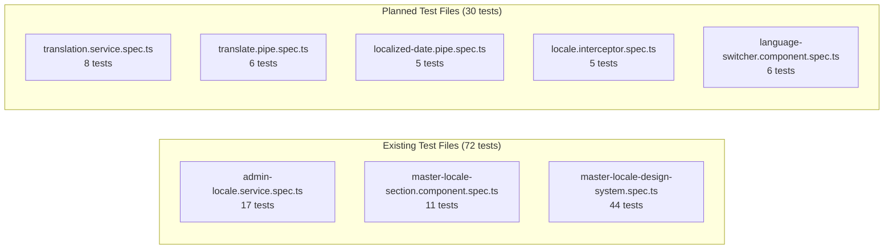

# Frontend Unit Tests — Localization Module

> **Version:** 1.0.0
> **Date:** 2026-03-12
> **Status:** [IN-PROGRESS] — 72 tests written, 0 executed
> **Framework:** Vitest 4.0.8 + Angular TestBed + DOM queries
> **Coverage Target:** 80% line, 75% branch (c8/istanbul)

---

## 1. Test File Overview



**Execution command:**
```bash
cd frontend
npx vitest run --coverage --reporter=verbose
```

---

## 2. admin-locale.service.spec.ts

**File:** `frontend/src/app/features/administration/services/admin-locale.service.spec.ts`
**Tests:** 17 | **Status:** WRITTEN, NOT EXECUTED

| ID | it-block | Scenario | Expected Result | FR/BR | Status |
|----|----------|----------|----------------|-------|--------|
| FU-ALS-01 | `should be created` | Service instantiation | Service instance exists | FR-01 | WRITTEN |
| FU-ALS-02 | `should set locales and totalLocales on loadLocales success` | Load all locales | `locales()` signal populated, `totalLocales()` updated | FR-01 | WRITTEN |
| FU-ALS-03 | `should set error on loadLocales failure` | API failure on load | `error()` signal set with error message | FR-01 | WRITTEN |
| FU-ALS-04 | `should set activeLocales on loadActiveLocales success` | Load active locales | `activeLocales()` signal populated | FR-01 | WRITTEN |
| FU-ALS-05 | `should compute activeLocaleCodes from activeLocales` | Derived signal computation | `activeLocaleCodes()` returns string array of codes | FR-01 | WRITTEN |
| FU-ALS-06 | `should compute rtlLocales as empty when all are LTR` | All LTR locales | `rtlLocales()` returns empty array | FR-01, NFR-07 | WRITTEN |
| FU-ALS-07 | `should compute rtlLocales correctly when RTL locale is active` | RTL locale active | `rtlLocales()` includes RTL locale | FR-01, NFR-07 | WRITTEN |
| FU-ALS-08 | `should update locale in list on activateLocale success` | Activate locale | Locale's `isActive` toggled in `locales()` | FR-01 | WRITTEN |
| FU-ALS-09 | `should set error on activateLocale failure` | Activation API failure | `error()` signal set | FR-01 | WRITTEN |
| FU-ALS-10 | `should update locale is_alternative on setAlternative` | Set alternative locale | `isAlternative` flag updated in list | FR-01 | WRITTEN |
| FU-ALS-11 | `clearError should set error to null` | Clear error | `error()` returns null | FR-01 | WRITTEN |
| FU-ALS-12 | `should set dictionaryEntries on loadEntries success` | Load dictionary entries | `dictionaryEntries()` populated | FR-02 | WRITTEN |
| FU-ALS-13 | `should set versions on loadVersions success` | Load version history | `versions()` populated | FR-04 | WRITTEN |
| FU-ALS-14 | `should update translation on updateTranslation success` | Update translation | Entry updated in list | FR-02, BR-06 | WRITTEN |
| FU-ALS-15 | `should set importPreview on importPreview success` | Import preview | `importPreview()` signal set | FR-03 | WRITTEN |
| FU-ALS-16 | `should trigger rollback and reload versions` | Rollback dictionary | `versions()` reloaded after rollback | FR-04, BR-07 | WRITTEN |
| FU-ALS-17 | `should deactivate locale and update list` | Deactivate locale | `isActive=false` in list | FR-01 | WRITTEN |

### Scenario Matrix Coverage

| Scenario ID | Description | Test ID |
|-------------|-------------|---------|
| US-LM-01-H-01 | Activate locale | FU-ALS-08 |
| US-LM-01-H-02 | Deactivate locale | FU-ALS-17 |
| US-LM-01-H-06 | Set alternative | FU-ALS-10 |
| US-LM-01-E-03 | API error handling | FU-ALS-03, FU-ALS-09 |
| US-LM-06-H-22 | RTL detection | FU-ALS-06, FU-ALS-07 |

---

## 3. master-locale-section.component.spec.ts

**File:** `frontend/src/app/features/administration/sections/master-locale/master-locale-section.component.spec.ts`
**Tests:** 11 | **Status:** WRITTEN, NOT EXECUTED

| ID | it-block | Scenario | Expected Result | FR/BR | Status |
|----|----------|----------|----------------|-------|--------|
| FU-MLS-01 | `should create` | Component instantiation | Component exists | FR-01 | WRITTEN |
| FU-MLS-02 | `should call loadActiveLocales and loadLocales on init` | Component init | Both service methods called | FR-01 | WRITTEN |
| FU-MLS-03 | `should switch to dictionary tab and call loadEntries` | Tab switch to Dictionary | `loadEntries()` called | FR-02 | WRITTEN |
| FU-MLS-04 | `should switch to rollback tab and call loadVersions` | Tab switch to Rollback | `loadVersions()` called | FR-04 | WRITTEN |
| FU-MLS-05 | `getFlagEmoji should return globe for undefined country` | Flag for unknown code | Returns 🌐 globe emoji | FR-01 | WRITTEN |
| FU-MLS-06 | `getFlagEmoji should return flag emoji string for valid 2-letter country code` | Flag for valid code | Returns flag emoji (e.g., 🇫🇷) | FR-01 | WRITTEN |
| FU-MLS-07 | `getChangeBadgeSeverity should return warn for ROLLBACK` | Rollback badge color | Returns `'warn'` | FR-04 | WRITTEN |
| FU-MLS-08 | `getChangeBadgeSeverity should return info for IMPORT` | Import badge color | Returns `'info'` | FR-03 | WRITTEN |
| FU-MLS-09 | `getChangeBadgeSeverity should return success for EDIT` | Edit badge color | Returns `'success'` | FR-02 | WRITTEN |
| FU-MLS-10 | `should handle deactivateLocale confirmation` | Deactivate with confirm dialog | Confirmation dialog shown, locale deactivated | FR-01, BR-01 | WRITTEN |
| FU-MLS-11 | `should handle export button click` | Export CSV click | CSV download triggered | FR-03 | WRITTEN |

---

## 4. master-locale-design-system.spec.ts

**File:** `frontend/src/app/features/administration/sections/master-locale/master-locale-design-system.spec.ts`
**Tests:** 44 | **Status:** WRITTEN, NOT EXECUTED

> **Note:** Full test listing in [08-Design-System-Tests.md](../UI-UX/08-Design-System-Tests.md). Summary below.

### 4.1 Layout Structure (4 tests)

| ID | it-block | Scenario | FR/BR | Status |
|----|----------|----------|-------|--------|
| FU-DS-01 | `should render locale-section` | Container renders | FR-01 | WRITTEN |
| FU-DS-02 | `should render 4 tabs` | 4 tab buttons present | FR-01 | WRITTEN |
| FU-DS-03 | `should render correct tab labels` | Languages, Dictionary, Import/Export, Rollback | FR-01 | WRITTEN |
| FU-DS-04 | `should render tab-content area` | Content area renders | FR-01 | WRITTEN |

### 4.2 Tab Active State (3 tests)

| ID | it-block | Scenario | FR/BR | Status |
|----|----------|----------|-------|--------|
| FU-DS-05 | `should apply active class to selected tab` | Active tab highlighted | FR-01 | WRITTEN |
| FU-DS-06 | `should move active class on switch` | Class moves on click | FR-01 | WRITTEN |
| FU-DS-07 | `should apply bottom border via CSS` | CSS border indicator | FR-01 | WRITTEN |

### 4.3 Tab Bar CSS (2 tests)

| ID | it-block | Scenario | FR/BR | Status |
|----|----------|----------|-------|--------|
| FU-DS-08 | `tab-bar should use flex layout` | Flexbox layout | NFR-06 | WRITTEN |
| FU-DS-09 | `buttons should be flat (not neumorphic)` | No neumorphic shadows | NFR-06 | WRITTEN |

### 4.4 Languages Table (8 tests)

| ID | it-block | Scenario | FR/BR | Status |
|----|----------|----------|-------|--------|
| FU-DS-10 | `should render p-table` | PrimeNG table present | FR-01 | WRITTEN |
| FU-DS-11 | `should render 7 header columns` | 7 columns rendered | FR-01 | WRITTEN |
| FU-DS-12 | `should render 3 locale rows` | Mock data rows | FR-01 | WRITTEN |
| FU-DS-13 | `should render code in tag` | p-tag for locale code | FR-01 | WRITTEN |
| FU-DS-14 | `should render direction tag` | LTR/RTL tag | NFR-07 | WRITTEN |
| FU-DS-15 | `should render toggle switches` | p-toggleSwitch | FR-01 | WRITTEN |
| FU-DS-16 | `should render radio buttons` | Alternative radio | FR-01 | WRITTEN |
| FU-DS-17 | `should check alternative radio` | Pre-selected radio | FR-01 | WRITTEN |

### 4.5 Search, Paginator, Error, Loading (9 tests)

| ID | it-block | Scenario | FR/BR | Status |
|----|----------|----------|-------|--------|
| FU-DS-18 | `should render search input with placeholder` | Search field | FR-02 | WRITTEN |
| FU-DS-19 | `should render search icon` | Search icon | FR-02 | WRITTEN |
| FU-DS-20 | `should render PrimeNG paginator` | p-paginator | FR-01 | WRITTEN |
| FU-DS-21 | `no error when none exists` | No error banner | FR-01 | WRITTEN |
| FU-DS-22 | `show error banner when error` | Error banner visible | FR-01 | WRITTEN |
| FU-DS-23 | `display error message` | Error text shown | FR-01 | WRITTEN |
| FU-DS-24 | `render dismiss button` | Dismiss button | FR-01 | WRITTEN |
| FU-DS-25 | `no overlay when not loading` | No loading overlay | FR-01 | WRITTEN |
| FU-DS-26 | `show overlay with spinner when loading` | Loading spinner | FR-01 | WRITTEN |

### 4.6 Keyboard, RTL, Flags, Badges, Import/Export, Rollback, Composition (18 tests)

| ID | Range | Category | Count | Status |
|----|-------|----------|-------|--------|
| FU-DS-27 to FU-DS-29 | Keyboard Navigation | 3 | WRITTEN |
| FU-DS-30 to FU-DS-31 | RTL Support | 2 | WRITTEN |
| FU-DS-32 to FU-DS-34 | Flag Emoji | 3 | WRITTEN |
| FU-DS-35 to FU-DS-38 | Badge Severity | 4 | WRITTEN |
| FU-DS-39 to FU-DS-41 | Import/Export Tab | 3 | WRITTEN |
| FU-DS-42 to FU-DS-43 | Rollback Tab | 2 | WRITTEN |
| FU-DS-44 | Component Composition (p-toast, p-confirmDialog) | 2 | WRITTEN |

---

## 5. Planned Test Files

### 5.1 translation.service.spec.ts [PLANNED]

| ID | it-block | Scenario | Expected Result | FR/BR |
|----|----------|----------|----------------|-------|
| FU-TS-01 | `should fetch bundle for active locale` | Bundle API call | `translations()` signal populated | FR-06 |
| FU-TS-02 | `should cache bundle after fetch` | No duplicate API calls | Second call uses cache | FR-06, NFR-09 |
| FU-TS-03 | `should fallback to en-US.json when API fails` | API error | Static fallback loaded | NFR-03 |
| FU-TS-04 | `should return key when translation missing` | Missing key | Returns raw key | FR-06 |
| FU-TS-05 | `should interpolate parameters` | `{count}` placeholder | Parameter substituted | FR-06, BR-10 |
| FU-TS-06 | `should reload bundle on locale change` | Locale switch | New bundle fetched | FR-06, NFR-02 |
| FU-TS-07 | `should poll for updates every 5 minutes` | Polling interval | API call at 5-min interval | BR-13 |
| FU-TS-08 | `should handle concurrent bundle requests` | Race condition | Single API call, shared response | FR-06 |

### 5.2 translate.pipe.spec.ts [PLANNED]

| ID | it-block | Scenario | Expected Result | FR/BR |
|----|----------|----------|----------------|-------|
| FU-TP-01 | `should transform key to translation` | `'common.save' \| translate` | Returns translated string | FR-07 |
| FU-TP-02 | `should return key when no translation exists` | Missing key | Returns raw key | FR-07 |
| FU-TP-03 | `should interpolate params` | `'greeting' \| translate:{name:'Alice'}` | Interpolated string | FR-07, BR-10 |
| FU-TP-04 | `should update when locale changes` | Signal update | Pipe re-evaluates | FR-07, NFR-02 |
| FU-TP-05 | `should handle null/undefined input` | Null input | Returns empty string | FR-07 |
| FU-TP-06 | `should handle nested keys` | `'module.section.key'` | Correct lookup | FR-07 |

### 5.3 localized-date.pipe.spec.ts [PLANNED]

| ID | it-block | Scenario | Expected Result | FR/BR |
|----|----------|----------|----------------|-------|
| FU-LDP-01 | `should format date per locale config` | en-US date | `MM/DD/YYYY` format | FR-01 |
| FU-LDP-02 | `should format date for fr-FR` | fr-FR date | `DD/MM/YYYY` format | FR-01 |
| FU-LDP-03 | `should handle RTL date formatting` | ar-SA date | Correct Hijri/Gregorian | NFR-07 |
| FU-LDP-04 | `should handle null date input` | Null date | Returns empty string | FR-01 |
| FU-LDP-05 | `should apply custom format string` | Custom pattern | Formatted per pattern | FR-01 |

### 5.4 locale.interceptor.spec.ts [PLANNED]

| ID | it-block | Scenario | Expected Result | FR/BR |
|----|----------|----------|----------------|-------|
| FU-LI-01 | `should add Accept-Language header` | Outgoing request | Header added with active locale | FR-09 |
| FU-LI-02 | `should add X-Tenant-ID header` | Multi-tenant request | Tenant header from context | FR-15 |
| FU-LI-03 | `should not modify requests to external URLs` | Third-party API call | No locale headers added | FR-09 |
| FU-LI-04 | `should handle missing locale gracefully` | No locale set | Defaults to en-US | FR-09 |
| FU-LI-05 | `should pass through on error` | Interceptor error | Request proceeds unmodified | FR-09 |

### 5.5 language-switcher.component.spec.ts [PLANNED]

| ID | it-block | Scenario | Expected Result | FR/BR |
|----|----------|----------|----------------|-------|
| FU-LSC-01 | `should render dropdown trigger button` | Button visible | Pill-shaped button with flag + label | FR-08 |
| FU-LSC-02 | `should open dropdown on click` | Click trigger | Dropdown panel opens | FR-08 |
| FU-LSC-03 | `should close dropdown on outside click` | Click outside | Panel closes | FR-08 |
| FU-LSC-04 | `should close dropdown on Escape` | Escape key | Panel closes | FR-08, NFR-06 |
| FU-LSC-05 | `should show checkmark on active locale` | Active locale | Checkmark icon visible | FR-08 |
| FU-LSC-06 | `should emit locale change on selection` | Select locale | `localeChange` event emitted | FR-08, NFR-02 |

---

## 6. Test Execution Commands

```bash
# Run all frontend tests
cd frontend
npx vitest run

# Run with coverage
npx vitest run --coverage

# Run specific test file
npx vitest run src/app/features/administration/services/admin-locale.service.spec.ts

# Run in watch mode
npx vitest watch

# Run with verbose output
npx vitest run --reporter=verbose
```
