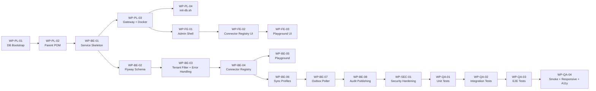

# Integration Hub — Phase 0 + Phase 1 Implementation Plan

## Context

EMSIST needs a dedicated **integration-service** (port 8091) to govern four communication patterns: External EA/BPM sync, Tenant-to-Tenant sharing, Agent-to-Agent governance, and External AI Agent integration. The LLD spec (`Documentation/lld/integration-hub-spec.md`) and ADR-033 (`Documentation/adr/ADR-033-integration-governance-hub.md`) are finalized and serve as the authoritative design source.

This plan covers **Phase 0** (service skeleton, gateway, DB, admin shell, health) and **Phase 1** (connector registry, playground, sync profiles, outbox poller, audit publishing, baseline tests).

---

## Critical Path



---

## Stream: Platform / Infrastructure

### WP-PL-01 — Database Bootstrap (`init-db.sh`)
**Agent:** DBA → DEV
**Depends on:** Nothing (first work package)
**Outputs:**
- Add to `infrastructure/docker/init-db.sh`:
  ```
  create_db_and_user "integration_db" "svc_integration" "SVC_INTEGRATION_PASSWORD" "full"
  ```
- Add REVOKE PUBLIC for `integration_db`
- Add `SVC_INTEGRATION_PASSWORD` to env var documentation block
- Add `integration_db` to the Step 3 comment block listing all databases

**Acceptance criteria:**
- `docker-compose up` creates `integration_db` with `svc_integration` user
- User has SCRAM-SHA-256 auth and full privileges on `integration_db`
- PUBLIC schema access revoked

**LLD reference:** Section 7 (Data Model), ADR-033 Service Profile table

---

### WP-PL-02 — Parent POM Module Registration
**Agent:** DEV
**Depends on:** WP-PL-01
**Outputs:**
- Add `<module>integration-service</module>` to `backend/pom.xml` `<modules>` section
- Create `backend/integration-service/pom.xml` with dependencies:
  - `spring-boot-starter-web`, `spring-boot-starter-data-jpa`, `spring-boot-starter-actuator`
  - `spring-boot-starter-validation`, `spring-cloud-starter-netflix-eureka-client`
  - `spring-kafka`, `flyway-core`, `flyway-database-postgresql`
  - `postgresql` (runtime), `mapstruct` + `mapstruct-processor`
  - `com.ems:common` (project dependency)
  - Test: `spring-boot-starter-test`, `testcontainers` (postgresql, kafka)

**Acceptance criteria:**
- `mvn clean compile -pl integration-service` succeeds
- Module appears in reactor build order

**LLD reference:** Section 1 (Service Profile)

---

### WP-PL-03 — Gateway Routes + Docker Configuration
**Agent:** DEV + DEVOPS
**Depends on:** WP-BE-01
**Outputs:**

**Gateway — Java routes** (`backend/api-gateway/.../config/RouteConfig.java`):
- Add route: `integration-service` → path `/api/v1/integrations/**` → `lb://INTEGRATION-SERVICE`
- Add route: `integration-webhooks` → path `/api/v1/webhooks/**` → `lb://INTEGRATION-SERVICE`

**Gateway — Docker YAML** (`backend/api-gateway/src/main/resources/application-docker.yml`):
- Add `docker-integration-service` route (API)
- Add `docker-integration-webhooks` route (webhooks)
- Add `docker-integration-health` route with `RewritePath` filter

**Gateway — Security** (`backend/api-gateway/.../config/SecurityConfig.java`):
- Add `.pathMatchers("/api/v1/webhooks/**").permitAll()` (webhooks are HMAC-validated in integration-service, not JWT-gated)
- Add `.pathMatchers("/api/v1/integrations/**").authenticated()` (standard JWT gate)

**Docker — integration-service Dockerfile:**
- Create `backend/integration-service/Dockerfile` following existing service pattern (multi-stage, POM caching layer)

**Docker — Update ALL 11 existing Dockerfiles:**
- Add `COPY integration-service/pom.xml integration-service/` to the POM caching layer in:
  - `eureka-server`, `api-gateway`, `auth-facade`, `tenant-service`, `user-service`, `license-service`, `notification-service`, `audit-service`, `ai-service`, `process-service`, `definition-service`

**Docker Compose** (`infrastructure/docker/docker-compose.yml`):
- Add `integration-service` container definition (port 8091, depends_on: postgres, kafka, eureka-server)

**Acceptance criteria:**
- `curl localhost:8080/api/v1/integrations/health` returns 200 through gateway
- `curl localhost:8080/api/v1/webhooks/test` routes to integration-service
- All 11 existing Dockerfiles build successfully with new POM line
- `docker-compose up` starts integration-service and registers with Eureka

**LLD reference:** Section 1 (Service Profile), Section 11 (Kafka Topics — webhook route)

---

### WP-PL-04 — init-db.sh Integration Verification
**Agent:** DEVOPS
**Depends on:** WP-PL-01, WP-PL-03
**Outputs:**
- Verify `docker-compose up` from clean state creates `integration_db`
- Verify Flyway migrations run on first boot (depends on WP-BE-02)
- Document env vars in docker-compose for `SVC_INTEGRATION_PASSWORD`

**Acceptance criteria:**
- Fresh `docker-compose up` → `integration_db` exists → Flyway creates tables → service registers with Eureka → health endpoint returns UP

---

## Stream: Backend

### WP-BE-01 — Service Skeleton
**Agent:** SA → DEV
**Depends on:** WP-PL-02
**Outputs:**
- `backend/integration-service/src/main/java/com/ems/integration/IntegrationServiceApplication.java`
- `application.yml` with:
  - `server.port: 8091`
  - `spring.application.name: integration-service`
  - PostgreSQL datasource (`integration_db`, `svc_integration`)
  - Eureka client config
  - Kafka bootstrap servers
  - Flyway enabled
- `application-docker.yml` with Docker-profile overrides
- Package structure:
  ```
  com.ems.integration
  ├── config/          # SecurityConfig, KafkaConfig, WebConfig
  ├── controller/      # REST controllers
  ├── service/         # Business logic
  ├── repository/      # JPA repositories
  ├── domain/          # JPA entities
  ├── dto/             # Request/Response DTOs
  ├── mapper/          # MapStruct mappers
  ├── exception/       # GlobalExceptionHandler (ProblemDetail)
  └── outbox/          # Outbox poller
  ```
- Health endpoint: `GET /actuator/health` (Spring Boot default)

**Acceptance criteria:**
- `mvn spring-boot:run -pl integration-service` starts on port 8091
- Actuator health endpoint returns `{"status": "UP"}`
- Service registers with Eureka as `INTEGRATION-SERVICE`

**LLD reference:** Section 1 (Service Profile), Section 12 (Deployment)

---

### WP-BE-02 — Flyway Schema Migrations
**Agent:** DBA → DEV
**Depends on:** WP-BE-01
**Outputs:**
- `V1__create_connectors.sql` — `connectors` table
- `V2__create_connector_health_checks.sql` — `connector_health_checks` table
- `V3__create_definition_mappings.sql` — `definition_mappings` table
- `V4__create_sync_profiles.sql` — `sync_profiles` table (with `mapping_id` FK, `mapping_version_pin`, `conflict_strategy`)
- `V5__create_sync_runs.sql` — `sync_runs` table
- `V6__create_sync_checkpoints.sql` — `sync_checkpoints` table
- `V7__create_sync_exception_queue.sql` — `sync_exception_queue` table
- `V8__create_run_locks.sql` — `run_locks` table
- `V9__create_outbox_events.sql` — `outbox_events` table
- `V10__create_webhook_registrations.sql` — `webhook_registrations` table
- `V11__create_agent_channels.sql` — `agent_channels` table (Phase 3 placeholder, empty)
- `V12__create_integration_policies.sql` — `integration_policies` table
- `V13__create_connector_credentials.sql` — `connector_credentials` table (encrypted column, Phase 1)

All tables include: `tenant_id UUID NOT NULL`, `created_at`, `updated_at`, `created_by`, `updated_by`
All tables use: `UUID` primary keys, appropriate indexes on `tenant_id` + status columns

**Acceptance criteria:**
- `mvn flyway:info -pl integration-service` shows all migrations as Applied
- All tables exist with correct columns, types, constraints, and indexes
- FK from `sync_profiles.mapping_id` → `definition_mappings.id` is enforced

**LLD reference:** Section 7 (Data Model — full schema)

---

### WP-BE-03 — Tenant Filter + Error Handling
**Agent:** DEV
**Depends on:** WP-BE-02
**Outputs:**

**Tenant isolation:**
- `TenantContext.java` — ThreadLocal holder for tenant ID extracted from JWT
- `TenantFilter.java` — Servlet filter that extracts `tenant_id` claim from JWT and sets ThreadLocal
- **Note:** No `extractTenantId` utility exists in `common` module — integration-service must implement its own JWT tenant extraction (consistent with how other services handle it)
- All JPA repositories add `WHERE tenant_id = :tenantId` via `@Query` or Spring Data specifications

**Error handling:**
- `GlobalExceptionHandler.java` using **ProblemDetail / RFC 9457**
- Extends pattern from `auth-facade`'s `AuthProblemFactory` (more sophisticated) rather than `definition-service`'s simpler pattern
- Cross-tenant access → **404** (not 403) — anti-enumeration, intentional divergence from TenantController
- Uses `ResourceNotFoundException` and `BusinessException` from `com.ems:common`

**Acceptance criteria:**
- Request without valid JWT → 401
- Request with JWT but wrong tenant → 404 (not 403)
- All error responses are ProblemDetail format with `type`, `title`, `status`, `detail`, `timestamp`
- No data leaks across tenants

**LLD reference:** Section 10 (Error Handling — 404 divergence, ProblemDetail), Section 8.2 (Tenant isolation)

---

### WP-BE-04 — Connector Registry (CRUD + Lifecycle)
**Agent:** SA → DEV
**Depends on:** WP-BE-03
**Outputs:**
- `ConnectorController.java` — CRUD endpoints:
  - `POST /api/v1/integrations/connectors` — Create connector (DRAFT)
  - `GET /api/v1/integrations/connectors` — List connectors (page/limit, LHS bracket filters)
  - `GET /api/v1/integrations/connectors/{id}` — Get connector
  - `PUT /api/v1/integrations/connectors/{id}` — Update connector
  - `DELETE /api/v1/integrations/connectors/{id}` — Soft-delete / archive
  - `POST /api/v1/integrations/connectors/{id}/activate` — DRAFT → ACTIVE
  - `POST /api/v1/integrations/connectors/{id}/archive` — ACTIVE → ARCHIVED
- `ConnectorService.java` — Business logic, lifecycle state machine
- `ConnectorRepository.java` — JPA repository with tenant-scoped queries
- `Connector.java` — JPA entity
- DTOs: `ConnectorRequest`, `ConnectorResponse`, `ConnectorListResponse`
- `ConnectorMapper.java` — MapStruct mapper
- Lifecycle: `DRAFT → ACTIVE → ARCHIVED` (no backward transitions)
- LHS bracket filters: `filter[status]=ACTIVE&filter[connectorType]=mega-hopex`

**Acceptance criteria:**
- Full CRUD works with tenant isolation
- Lifecycle transitions enforced (ARCHIVED → ACTIVE rejected with 409)
- Page/limit pagination on list endpoint
- LHS bracket filter parsing works
- All responses are ProblemDetail on error

**LLD reference:** Section 3 (Connector Registry), Section 6 (API Contracts — connector endpoints)

---

### WP-BE-05 — Playground (Connectivity + Auth Test)
**Agent:** DEV
**Depends on:** WP-BE-04
**Outputs:**
- `PlaygroundController.java`:
  - `POST /api/v1/integrations/connectors/{id}/playground/connectivity` — Test connection
  - `POST /api/v1/integrations/connectors/{id}/playground/auth` — Test authentication
  - `POST /api/v1/integrations/connectors/{id}/playground/schema` — Discover remote schema
  - `POST /api/v1/integrations/connectors/{id}/playground/dry-read` — Read without writing
- `PlaygroundService.java` — Executes test operations via connector's plugin adapter
- Timeout: 30s max per playground operation
- Results: `{ success: boolean, latencyMs: number, message: string, details: {} }`

**Acceptance criteria:**
- Playground endpoints work for ACTIVE connectors only (DRAFT/ARCHIVED → 409)
- Timeout enforced at 30s
- Results include latency measurement
- Errors return ProblemDetail

**LLD reference:** Section 3.5 (Playground), Section 6 (API Contracts)

---

### WP-BE-06 — Sync Profiles
**Agent:** SA → DEV
**Depends on:** WP-BE-04
**Outputs:**
- `SyncProfileController.java`:
  - `POST /api/v1/integrations/connectors/{connectorId}/sync-profiles`
  - `GET /api/v1/integrations/connectors/{connectorId}/sync-profiles`
  - `GET /api/v1/integrations/connectors/{connectorId}/sync-profiles/{id}`
  - `PUT /api/v1/integrations/connectors/{connectorId}/sync-profiles/{id}`
  - `DELETE /api/v1/integrations/connectors/{connectorId}/sync-profiles/{id}`
  - `POST /api/v1/integrations/connectors/{connectorId}/sync-profiles/{id}/trigger` — Manual trigger
- `SyncProfile.java` entity with:
  - `mapping_id` FK → `definition_mappings.id`
  - `mapping_version_pin` (string)
  - `conflict_strategy` enum: `SOURCE_WINS | TARGET_WINS | LATEST_WINS | FLAG`
  - `schedule_cron` + `timezone` (single source of truth for scheduling)
- `SyncProfileService.java` — Validates mapping reference exists, enforces version pin

**Acceptance criteria:**
- Sync profiles are nested under connectors (URL hierarchy)
- `mapping_id` FK enforced (400 if mapping doesn't exist)
- `conflict_strategy` validated against allowed enum values
- `schedule_cron` accepts valid cron expressions only
- Tenant isolation enforced

**LLD reference:** Section 5 (Sync Engine), Section 7 (Data Model — sync_profiles with mapping boundary)

---

### WP-BE-07 — Outbox Poller
**Agent:** DEV
**Depends on:** WP-BE-06
**Outputs:**
- `OutboxPoller.java` — `@Scheduled` poller (configurable interval, default 5s)
  - Reads `outbox_events` with `status = PENDING`
  - Publishes to Kafka topic from `outbox_events.topic` column
  - Updates status to `SENT` on success, `FAILED` on error
  - Batch size configurable (default 100)
- `OutboxEvent.java` — JPA entity for `outbox_events` table
- `OutboxRepository.java` — Repository with `findByStatusOrderByCreatedAt`
- Kafka producer config in `KafkaConfig.java`
- CloudEvents v1.0 envelope: `specversion`, `type`, `source`, `id`, `time`, `datacontenttype`, `sequence`, `dataschema`

**Acceptance criteria:**
- Events written to `outbox_events` within a transaction are published to Kafka
- Failed publishes are retried on next poll cycle
- `SENT` events are not re-processed
- CloudEvents envelope is valid (parseable by any CloudEvents SDK)

**LLD reference:** Section 11 (Event Architecture — outbox strategy), Section 7 (outbox_events schema)

---

### WP-BE-08 — Audit Publishing
**Agent:** DEV
**Depends on:** WP-BE-07
**Outputs:**
- `AuditEventPublisher.java` — Publishes integration audit events to `integration-audit` Kafka topic via outbox
- Event types: `connector.created`, `connector.activated`, `connector.archived`, `sync.triggered`, `sync.completed`, `sync.failed`, `credential.accessed`
- `AuditEventBuilder.java` — Fluent builder for CloudEvents with integration-specific extensions
- Wire into `ConnectorService`, `SyncProfileService`, `PlaygroundService` — audit events emitted on state changes

**Acceptance criteria:**
- Every connector lifecycle change produces an audit event in Kafka
- Every sync trigger/completion produces an audit event
- Events are CloudEvents v1.0 compliant
- `audit-service` can consume these events (topic format compatible)

**LLD reference:** Section 9 (Audit Trail), Section 11 (Kafka Topics — integration-audit)

---

## Stream: Frontend

### WP-FE-01 — Admin Shell Wiring
**Agent:** DEV (frontend)
**Depends on:** WP-PL-03 (gateway routes available)
**Outputs:**
- Add `integration-hub` section to `administration.page.html` `@switch` block (after line 157)
- Add sidebar entry in administration component for "Integration Hub"
- Create standalone component shell: `features/administration/sections/integration-hub/`
  - `integration-hub.component.ts` — Container with tab navigation
  - `integration-hub.component.html` — Tab layout (Connectors, Sync Profiles, Playground)
  - Route: `/administration?section=integration-hub`
- Wire in `app.routes.ts` or lazy-load config

**Acceptance criteria:**
- Navigating to `/administration?section=integration-hub` renders the shell
- Tab navigation between sub-sections works
- Empty states shown for each tab

**LLD reference:** Section 6 (Frontend admin section), ADR-033 (Neutral consequences — admin tab)

---

### WP-FE-02 — Connector Registry UI
**Agent:** DEV (frontend) + UX
**Depends on:** WP-FE-01, WP-BE-04
**Outputs:**
- Connector list view (table with Card/Table toggle per existing pattern)
- Connector detail/edit form
- Lifecycle action buttons (Activate, Archive) with confirmation dialogs
- LHS bracket filter UI (status dropdown, connector type dropdown)
- `IntegrationService` (Angular) — HTTP client for connector API
- Empty state for no connectors

**Acceptance criteria:**
- CRUD operations work end-to-end through gateway
- Lifecycle transitions reflected in UI immediately
- Filters work correctly
- Responsive at desktop/tablet/mobile breakpoints

**LLD reference:** Section 6 (API Contracts — connector endpoints)

---

### WP-FE-03 — Playground UI
**Agent:** DEV (frontend)
**Depends on:** WP-FE-02, WP-BE-05
**Outputs:**
- Playground panel within connector detail view
- Buttons: Test Connectivity, Test Auth, Discover Schema, Dry Read
- Results display with success/failure indicator and latency
- Loading states during test execution (30s timeout)

**Acceptance criteria:**
- All four playground operations trigger correctly
- Results displayed with clear success/failure indication
- Loading spinner during execution
- Timeout handled gracefully in UI

**LLD reference:** Section 3.5 (Playground)

---

## Stream: Security

### WP-SEC-01 — Security Hardening
**Agent:** SEC
**Depends on:** WP-BE-08 (all backend complete)
**Outputs:**
- `SecurityConfig.java` in integration-service:
  - Role-based access: `TENANT_ADMIN` for tenant-local connector/sync operations, `ADMIN` for higher-risk tenant-local admin actions, `SUPER_ADMIN` for cross-tenant platform operations
  - No new `PLATFORM_ADMIN` role string; platform/security operations map to `SUPER_ADMIN`
  - If `TENANT_ADMIN` remains part of the runtime contract, seed or normalize it explicitly in the identity/bootstrap layer
  - Webhook endpoints: no JWT (HMAC-validated in controller)
- Input validation on all DTOs (`@Valid`, `@NotBlank`, `@Size`, `@Pattern`)
- Credential column encryption (Phase 1: AES-256 with app-managed key)
- HMAC validation for webhook endpoints
- Rate limiting annotations (placeholder for Phase 1, full implementation Phase 3)
- SQL injection review (parameterized queries only)
- Verify anti-enumeration: cross-tenant → 404

**Acceptance criteria:**
- Unauthorized access → 401
- Wrong role → 403 (except cross-tenant which is 404)
- Invalid input → 400 with ProblemDetail listing violations
- Credential values never appear in logs or API responses (masked)
- OWASP Top 10 review passed

**LLD reference:** Section 8 (Security), Section 10 (Error Handling — 404 anti-enumeration)

---

## Stream: QA

### WP-QA-01 — Unit Tests
**Agent:** QA-UNIT
**Depends on:** WP-BE-08
**Outputs:**
- Unit tests for all services: `ConnectorService`, `SyncProfileService`, `PlaygroundService`, `OutboxPoller`, `AuditEventPublisher`
- Unit tests for `GlobalExceptionHandler` (ProblemDetail format)
- Unit tests for `TenantFilter` (JWT extraction, missing claims)
- Unit tests for lifecycle state machine (valid/invalid transitions)
- Unit tests for LHS bracket filter parsing
- MapStruct mapper tests
- **Target:** >=80% line coverage, >=75% branch coverage

**Acceptance criteria:**
- `mvn test -pl integration-service` — all pass
- Coverage report meets thresholds
- Edge cases covered: null tenant, expired JWT, invalid lifecycle transition, malformed filter

**LLD reference:** Section 13 (Testing Strategy — unit test requirements)

---

### WP-QA-02 — Integration Tests (Testcontainers)
**Agent:** QA-INT
**Depends on:** WP-QA-01
**Outputs:**
- Integration tests with Testcontainers (PostgreSQL + Kafka):
  - Connector CRUD through `@SpringBootTest` + `MockMvc`
  - Sync profile CRUD with FK validation
  - Outbox → Kafka end-to-end (write outbox row → poll → verify Kafka message)
  - Flyway migration verification (clean start → all migrations apply)
  - Tenant isolation verification (tenant A cannot see tenant B's connectors)
- `@TestConfiguration` for Testcontainers setup

**Acceptance criteria:**
- `mvn verify -pl integration-service -Pintegration` — all pass
- Kafka messages verified with embedded consumer
- Tenant isolation proven with multi-tenant test data

**LLD reference:** Section 13 (Testing Strategy — integration test requirements)

---

### WP-QA-03 — E2E Tests (Playwright)
**Agent:** QA-INT
**Depends on:** WP-FE-03, WP-QA-02
**Outputs:**
- Playwright E2E tests:
  - Navigate to Integration Hub → verify shell renders
  - Create connector → verify appears in list
  - Activate connector → verify lifecycle state change
  - Run playground connectivity test → verify result display
  - Create sync profile → verify linked to connector
  - Filter connectors by status → verify filtered results
  - Empty state verification (no connectors)

**Acceptance criteria:**
- `npx playwright test integration-hub` — all pass
- Tests run against route-intercepted API (no live backend required for CI)
- Happy path + error states + empty states covered

**LLD reference:** Section 13 (Testing Strategy — E2E)

---

### WP-QA-04 — Smoke + Responsive + Accessibility
**Agent:** QA-INT + QA-REG
**Depends on:** WP-QA-03
**Outputs:**
- **Smoke tests:** Login → Navigate to Integration Hub → Create connector → Verify audit event in Kafka
- **Responsive tests:** Playwright viewport configs for desktop (1280px), tablet (768px), mobile (375px)
- **Accessibility tests:** axe-core scan on Integration Hub pages, keyboard navigation verification, ARIA labels on form fields

**Acceptance criteria:**
- Smoke test passes end-to-end
- All three viewport sizes render correctly (no overflow, no hidden content)
- Zero axe-core violations at WCAG AAA level
- All interactive elements reachable via keyboard

**LLD reference:** Section 13 (Testing Strategy — responsive + accessibility)

---

## SDLC Agent Handoff Points

| Handoff | From | To | Gate |
|---------|------|----|------|
| Requirements validated | **BA** | SA | `ba-signoff.md` created |
| Technical design approved | **SA** | DEV | `sa-review.md` created |
| Principles acknowledged | **DEV** | (self) | `principles-ack.md` created — Layer 2 unblocked |
| Code complete | **DEV** | QA | All WP-BE + WP-FE outputs committed |
| Tests pass | **QA** | (done) | `qa-report.md` created — Layer 3 unblocked |

**Evidence files** (all in `docs/sdlc-evidence/`):
- `ba-signoff.md` — BA validates plan scope against requirements
- `principles-ack.md` — DEV/QA agents acknowledge principles
- `sa-review.md` — SA validates API contracts and data model
- `qa-report.md` — QA provides test execution report

---

## Risks, Assumptions, and Rollout Gates

### Risks

| Risk | Impact | Mitigation |
|------|--------|------------|
| 11 Dockerfile updates (POM caching layer) | Build breakage if any missed | Script the update; verify all Dockerfiles build in CI |
| No `extractTenantId` in common module | Each service reimplements JWT extraction | Create integration-service's own; consider extracting to common in future |
| init-db.sh ordering | New DB creation must not break existing services | Add `integration_db` at end of existing list; test clean bootstrap |
| Flyway migration count (~13) | Schema drift if migrations conflict | Number migrations sequentially; test from clean DB state |
| Gateway security rule ordering | `permitAll()` for webhooks must be positioned correctly | Place webhook matcher BEFORE `.anyExchange().authenticated()` |
| Role drift across auth layers | Runtime auth mismatch if Integration Hub depends on roles that bootstrap does not seed | Phase 0 resolves `TENANT_ADMIN` handling explicitly and does not introduce `PLATFORM_ADMIN` |

### Assumptions

- PostgreSQL, Kafka, and Eureka are running (existing infrastructure)
- `com.ems:common` module is available with `ResourceNotFoundException`, `BusinessException`
- Frontend Angular 21 build toolchain is functional
- R08 resolves current role drift explicitly: `PLATFORM_ADMIN` is not introduced, and `TENANT_ADMIN` is either bootstrapped end-to-end or normalized consistently before release
- `audit-service` can consume CloudEvents from new `integration-audit` topic without code changes

### Rollout Gates

| Gate | Criteria | Blocks |
|------|----------|--------|
| **G1: Skeleton boots** | Service starts, registers with Eureka, health UP | All Phase 1 work |
| **G2: Schema applied** | All Flyway migrations succeed on clean DB | Backend CRUD work |
| **G3: Gateway routes** | API + webhook routes work through gateway | Frontend work |
| **G4: CRUD works** | Connector registry E2E through gateway | Playground, sync profiles |
| **G5: Outbox works** | Events reach Kafka via outbox poller | Audit publishing |
| **G6: Tests pass** | Unit >=80%, integration pass, E2E pass | Release gate |

---

## Verification Plan

### End-to-End Smoke Test (Post-Implementation)

```
1. docker-compose up (clean state)
2. Verify integration_db created with svc_integration user
3. Verify integration-service registered in Eureka
4. curl localhost:8080/api/v1/integrations/connectors (through gateway) → 200 empty list
5. POST connector → 201 with DRAFT status
6. POST activate → 200 with ACTIVE status
7. POST playground/connectivity → result with latencyMs
8. POST sync-profile → 201 with mapping_id reference
9. Wait 5s → check Kafka integration-audit topic → audit events present
10. Frontend: navigate to /administration?section=integration-hub → shell renders
11. Frontend: create connector via UI → appears in list
```

### Build Verification

```bash
mvn clean verify -pl integration-service          # Unit + integration tests
ng build                                           # Frontend builds
npx playwright test integration-hub                # E2E tests
docker build -t integration-service backend/integration-service  # Docker builds
```
