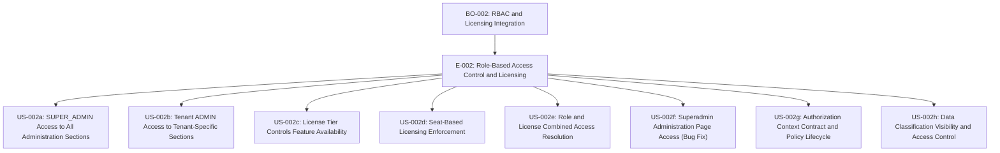
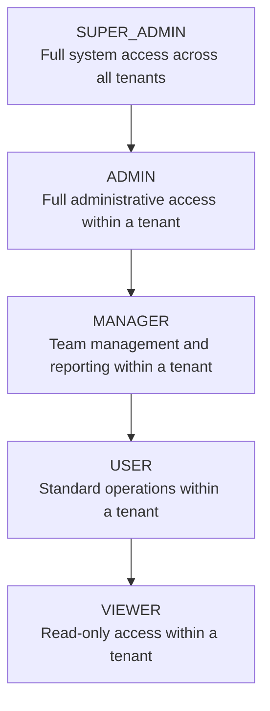
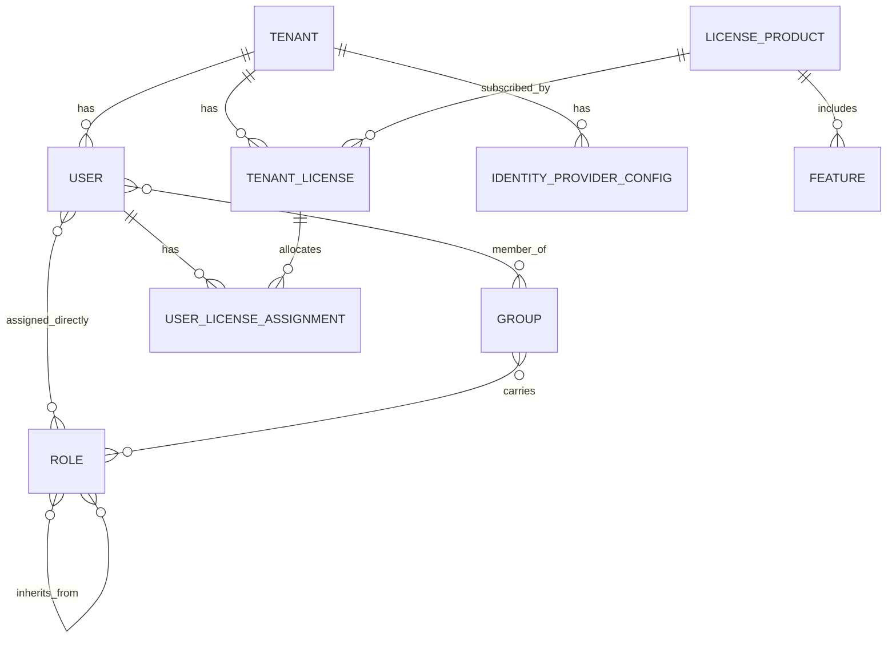
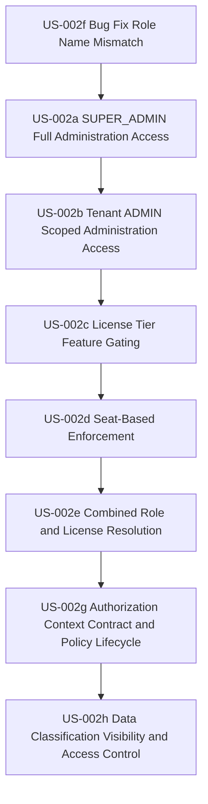

# RBAC & Licensing Integration Requirements

| Field | Value |
|-------|-------|
| **Epic** | E-002: Role-Based Access Control & Licensing Integration |
| **Business Objective** | BO-002: Enforce role-based page/section visibility combined with license-tier feature gating across all tenants |
| **Created** | 2026-02-26 |
| **Author** | BA Agent |
| **Status** | DRAFT - Pending Stakeholder Validation |
| **Related Issues** | ISSUE-001 (superadmin cannot access administration page) |

---

## Scope Note

This document defines the **authorization integration pattern** (role + license intersection).

For licensing commercial/model details in on-premise deployments, the canonical source is:

- [ON-PREMISE-LICENSING-REQUIREMENTS.md](./ON-PREMISE-LICENSING-REQUIREMENTS.md)
- [ADR-015](../adr/ADR-015-on-premise-license-architecture.md)

SaaS product-tier examples in this document (Starter/Pro/Enterprise) are transitional and require full harmonization with the on-premise license-file model.

---

## Requirements Traceability



---

## 1. Business Object Model

### 1.1 Domain Overview

EMSIST is a multi-tenant platform where access to functionality is governed by two orthogonal dimensions:

1. **Role-based access** -- determines WHAT a user is allowed to do (view, edit, administer)
2. **License-based access** -- determines WHICH features a tenant (and its users) have paid for

These two dimensions combine: a user must have both the correct role AND a valid license to access a feature. The exception is the SUPER_ADMIN role on the master tenant, which bypasses license restrictions for platform administration.

### 1.2 Core Business Objects

#### Tenant

**Description:** An organization or company that subscribes to the EMSIST platform. Each tenant is an isolated workspace with its own users, data, and configuration.

**Attributes:**

| Attribute | Business Meaning | Required | Rules |
|-----------|------------------|----------|-------|
| Identifier | Unique short name for the tenant | Yes | Max 50 characters, alphanumeric + hyphens |
| Full Name | Legal or display name of the organization | Yes | Max 255 characters |
| Tenant Type | Classification of the tenant | Yes | One of: Master, Dominant, Regular |
| Status | Operational state | Yes | One of: Active, Locked, Suspended |
| Is Protected | Whether the tenant can be deleted | Yes | Boolean; master tenant is always protected |

**Relationships:**

| Relationship | Related Entity | Cardinality | Description |
|--------------|----------------|-------------|-------------|
| Has users | User | 1:N | A tenant contains many users |
| Has licenses | Tenant License | 1:N | A tenant subscribes to one or more license products |
| Has identity provider configs | Identity Provider Config | 1:N | A tenant has one or more authentication providers |

**Business Rules:**
- BR-001: Only one Master tenant may exist in the system
- BR-002: The Master tenant is always protected and cannot be deleted or suspended
- BR-003: A tenant's status must be Active for its users to authenticate
- BR-003a: A non-master tenant must not transition to Active unless a valid tenant license entitlement exists

**Tenant Scope:** Global (tenants are root-level entities)

---

#### User

**Description:** An individual person with access to the EMSIST platform within a specific tenant. Users authenticate through their tenant's identity provider and are authorized based on their assigned roles and license seat.

**Attributes:**

| Attribute | Business Meaning | Required | Rules |
|-----------|------------------|----------|-------|
| Email | Login identifier and contact address | Yes | Unique within a tenant; valid email format |
| First Name | Given name | Yes | Max 100 characters |
| Last Name | Family name | Yes | Max 100 characters |
| Status | Account state | Yes | Active or Inactive (reflects identity provider enabled flag) |
| Email Verified | Whether the email address is confirmed | Yes | Boolean |
| Last Login | Most recent authentication timestamp | No | Null if user has never logged in |

**Relationships:**

| Relationship | Related Entity | Cardinality | Description |
|--------------|----------------|-------------|-------------|
| Belongs to | Tenant | N:1 | Every user belongs to exactly one tenant |
| Has roles | Role | N:N | A user can be assigned one or more roles directly |
| Member of | Group | N:N | A user can belong to groups that carry roles |
| Has license seat | User License Assignment | 1:N | A user may be assigned seats in one or more license pools |

**Business Rules:**
- BR-004: A user's email must be unique within their tenant (but not globally)
- BR-005: A user can only belong to one tenant
- BR-006: A user must have at least one role assigned (default: VIEWER)
- BR-007: A user's effective roles include directly assigned roles PLUS roles inherited through group membership

**Tenant Scope:** Tenant-Scoped

---

#### Role

**Description:** A named authorization level that grants a user a set of capabilities within the platform. Roles form a strict hierarchy where higher roles inherit all capabilities of lower roles.

**Attributes:**

| Attribute | Business Meaning | Required | Rules |
|-----------|------------------|----------|-------|
| Name | Unique role identifier | Yes | One of: SUPER_ADMIN, ADMIN, MANAGER, USER, VIEWER |
| Display Name | Human-readable label | Yes | Max 100 characters |
| Description | What the role grants | Yes | Max 500 characters |
| System Role | Whether this is a built-in role | Yes | System roles cannot be deleted |

**Relationships:**

| Relationship | Related Entity | Cardinality | Description |
|--------------|----------------|-------------|-------------|
| Inherits from | Role | N:N | A role inherits capabilities from lower roles |
| Assigned to | User | N:N | A role can be assigned to many users |
| Assigned to | Group | N:N | A role can be assigned to many groups |

**Role Hierarchy (highest to lowest):**



**Business Rules:**
- BR-008: SUPER_ADMIN inherits all capabilities of ADMIN, MANAGER, USER, and VIEWER
- BR-009: ADMIN inherits all capabilities of MANAGER, USER, and VIEWER
- BR-010: Role inheritance is transitive (SUPER_ADMIN inherits everything down the chain)
- BR-011: The five system roles are immutable and cannot be deleted
- BR-012: SUPER_ADMIN is only assignable to users belonging to the Master tenant
- BR-013: Custom (tenant-specific) roles may be created in the future but are out of scope for this epic

**Tenant Scope:** Global (system roles are shared across all tenants; custom roles would be tenant-scoped)

---

#### Permission

**Description:** A fine-grained capability that defines a specific action on a specific resource. Permissions are grouped into roles but can also be checked individually for granular access control.

**Attributes:**

| Attribute | Business Meaning | Required | Rules |
|-----------|------------------|----------|-------|
| Key | Unique permission identifier | Yes | Format: {resource}:{action} (e.g., "users:read", "admin:manage") |
| Display Name | Human-readable label | Yes | Max 100 characters |
| Description | What the permission grants | Yes | Max 500 characters |
| Category | Grouping for display purposes | Yes | e.g., "Administration", "User Management", "Reporting" |

**Relationships:**

| Relationship | Related Entity | Cardinality | Description |
|--------------|----------------|-------------|-------------|
| Granted by | Role | N:N | Permissions are bundled into roles |
| Checked against | User | (indirect) | Users have permissions through their roles |

**Business Rules:**
- BR-014: Permissions are evaluated transitively through role inheritance
- BR-015: A user has a permission if ANY of their effective roles (direct + inherited) grants it

**Tenant Scope:** Global

---

#### License Product

**Description:** A named subscription tier that defines a bundle of features available to tenants. Products represent the commercial offering (e.g., Starter, Pro, Enterprise).

**Attributes:**

| Attribute | Business Meaning | Required | Rules |
|-----------|------------------|----------|-------|
| Name | System identifier for the product | Yes | Unique; max 100 characters |
| Display Name | Commercial name shown to customers | Yes | Max 255 characters |
| Description | What the product includes | No | Free text |
| Monthly Price | Cost per month per seat | No | Decimal; null for custom pricing |
| Annual Price | Cost per year per seat | No | Decimal; null for custom pricing |
| Is Active | Whether the product is available for purchase | Yes | Boolean; default true |
| Sort Order | Display ordering | Yes | Integer; ascending |

**Relationships:**

| Relationship | Related Entity | Cardinality | Description |
|--------------|----------------|-------------|-------------|
| Includes features | Feature | 1:N | A product includes many features |
| Subscribed by | Tenant License | 1:N | Many tenants can subscribe to the same product |

**Business Rules:**
- BR-016: Three products are seeded by default: Starter, Pro, Enterprise
- BR-017: Enterprise includes all features from Pro; Pro includes all features from Starter
- BR-018: Products cannot be deleted if active tenant licenses reference them
- BR-019: Only SUPER_ADMIN can create, modify, or deactivate license products

**Tenant Scope:** Global (products are platform-wide)

---

#### Feature

**Description:** A specific capability or module within the platform that can be included in or excluded from a license product. Features are the atomic unit of license-based access control.

**Attributes:**

| Attribute | Business Meaning | Required | Rules |
|-----------|------------------|----------|-------|
| Feature Key | Unique system identifier | Yes | Format: snake_case; max 100 characters |
| Display Name | Human-readable label | Yes | Max 255 characters |
| Description | What the feature provides | No | Free text |
| Is Core | Whether this feature is fundamental | Yes | Core features are included in all products |

**Relationships:**

| Relationship | Related Entity | Cardinality | Description |
|--------------|----------------|-------------|-------------|
| Belongs to | License Product | N:1 | A feature is defined per product |
| Overridden by | User License Assignment | N:N | Individual users can have features enabled or disabled |

**Currently Seeded Features:**

| Feature Key | Starter | Pro | Enterprise | Description |
|-------------|---------|-----|------------|-------------|
| basic_workflows | Yes (core) | Yes (core) | Yes (core) | Create and manage basic workflows |
| basic_reports | Yes (core) | Yes (core) | Yes (core) | Standard reports |
| email_notifications | Yes (core) | Yes (core) | Yes (core) | Email notification support |
| advanced_workflows | -- | Yes | Yes | Complex workflow automation |
| advanced_reports | -- | Yes | Yes | Custom and advanced reporting |
| api_access | -- | Yes | Yes | REST API access for integrations |
| webhooks | -- | Yes | Yes | Webhook notifications |
| ai_persona | -- | -- | Yes | AI-powered persona features |
| custom_branding | -- | -- | Yes | White-label customization |
| sso_integration | -- | -- | Yes | SAML/OIDC single sign-on |
| audit_logs | -- | -- | Yes | Full audit trail access |
| priority_support | -- | -- | Yes | 24/7 priority support |

**Business Rules:**
- BR-020: Core features are automatically included in every product
- BR-021: Features are identified by feature_key in all access checks
- BR-022: Feature availability is checked at two levels: tenant-level (does the tenant's license include this feature?) and user-level (does the user's seat assignment include this feature?)

**Tenant Scope:** Global (feature definitions are platform-wide; feature access is tenant-scoped via licenses)

---

#### Tenant License

**Description:** A binding between a tenant and a license product, representing the tenant's subscription. Includes seat allocation and validity period.

**Attributes:**

| Attribute | Business Meaning | Required | Rules |
|-----------|------------------|----------|-------|
| Total Seats | Maximum number of user seats in this license pool | Yes | Positive integer |
| Assigned Seats | Current number of seats consumed | Yes | Integer; 0 <= assigned <= total |
| Valid From | Start date of the license | Yes | Date; cannot be after Valid Until |
| Valid Until | Expiry date of the license | Yes | Date; must be after Valid From |
| Billing Cycle | Payment frequency | Yes | MONTHLY or ANNUAL |
| Auto Renew | Whether the license renews automatically | Yes | Boolean; default true |
| Status | Current state of the license | Yes | ACTIVE, SUSPENDED, EXPIRED, CANCELLED |

**Relationships:**

| Relationship | Related Entity | Cardinality | Description |
|--------------|----------------|-------------|-------------|
| Belongs to | Tenant | N:1 | A license pool belongs to one tenant |
| References | License Product | N:1 | A license pool is for one product |
| Has assignments | User License Assignment | 1:N | Users are assigned seats from this pool |

**Business Rules:**
- BR-023: A tenant can have only one active license per product (enforced by unique constraint)
- BR-024: A license is valid only when: status is ACTIVE AND current date is between valid_from and valid_until
- BR-025: Assigned seats can never exceed total seats
- BR-026: When a license expires, all user assignments remain but access is blocked until the license is renewed

**Tenant Scope:** Tenant-Scoped

---

#### User License Assignment (Seat)

**Description:** The allocation of a specific license seat to a specific user within a tenant. This is the binding that grants a user access to the features included in a license product.

**Attributes:**

| Attribute | Business Meaning | Required | Rules |
|-----------|------------------|----------|-------|
| Enabled Features | Features explicitly granted beyond the product default | No | List of feature keys |
| Disabled Features | Features explicitly revoked from the product default | No | List of feature keys |
| Assigned At | When the seat was allocated | Yes | Timestamp |
| Assigned By | Who allocated the seat | No | User identifier of the administrator |

**Relationships:**

| Relationship | Related Entity | Cardinality | Description |
|--------------|----------------|-------------|-------------|
| Assigned to | User | N:1 | One seat per user per license pool |
| From pool | Tenant License | N:1 | The seat comes from a specific license pool |

**Business Rules:**
- BR-027: A user can hold at most one seat per tenant license pool
- BR-028: Assigning a seat increments the assigned_seats counter on the Tenant License
- BR-029: Revoking a seat decrements the assigned_seats counter on the Tenant License
- BR-030: Feature overrides (enabled/disabled) take precedence over the product's default feature set
- BR-031: If disabled_features contains a feature_key, the user does NOT have that feature regardless of product defaults
- BR-032: If enabled_features contains a feature_key, the user HAS that feature even if the product does not include it

**Tenant Scope:** Tenant-Scoped

---

### 1.3 Entity Relationship Summary



---

## 2. User Stories

### Dependency Map



**US-002f must be completed first** -- the role name format mismatch between the identity provider (SUPER_ADMIN) and the frontend route guard ('super-admin') is a blocking defect.

---

### User Story: US-002f - Fix Role Name Mismatch for Administration Page Access

**As a** superadmin user (superadmin@emsist.local)
**I want** the administration page to recognize my SUPER_ADMIN role from the identity provider
**So that** I can access the administration page without being redirected to the access-denied page

#### Acceptance Criteria

**AC-1: Main Scenario (Happy Path) - SUPER_ADMIN can access administration page**

```gherkin
Given the superadmin user has authenticated successfully
  And the identity provider has issued an access token containing the role "SUPER_ADMIN"
  And the frontend has stored the user's roles from the authentication response
When the superadmin navigates to the administration page
Then the route guard recognizes "SUPER_ADMIN" as a valid administrative role
  And the administration page loads successfully
  And all four dock sections are visible:
    | Section            |
    | Tenant Management  |
    | License Management |
    | Master Locale      |
    | Master Definitions |
  And no access-denied page is shown
```

**AC-2: Alternative Scenario - ADMIN role also grants access**

```gherkin
Given a tenant administrator has authenticated successfully
  And the identity provider has issued an access token containing the role "ADMIN"
When the tenant administrator navigates to the administration page
Then the route guard recognizes "ADMIN" as a valid administrative role
  And the administration page loads successfully
```

**AC-3: Edge Case - Role matching is case-insensitive**

```gherkin
Given roles may arrive from the identity provider in different formats:
    | Format           | Example      |
    | SCREAMING_SNAKE  | SUPER_ADMIN  |
    | kebab-case       | super-admin  |
    | lowercase        | superadmin   |
When the route guard evaluates any of these formats against the required roles
Then all formats are recognized as equivalent
  And the user is granted access regardless of casing or separator style
```

**AC-4: Edge Case - Role inherited through hierarchy**

```gherkin
Given a user has the "SUPER_ADMIN" role assigned
  And SUPER_ADMIN inherits from ADMIN in the role hierarchy
When the route guard checks whether the user has an admin-level role
Then the check succeeds because SUPER_ADMIN implicitly includes ADMIN capabilities
```

**AC-5: Error Handling - User with no administrative role**

```gherkin
Given a user has authenticated with only the "USER" role
When the user attempts to navigate to the administration page
Then the route guard determines the user lacks administrative roles
  And the user is redirected to the access-denied page
  And the administration page content is not rendered
```

**AC-6: Authorization - Navigation bar shows administration link only for admin roles**

```gherkin
Given a user has authenticated with the "SUPER_ADMIN" or "ADMIN" role
When the main navigation renders
Then an "Administration" link is visible in the navigation bar
  And the link navigates to the administration page
When a user with only "USER" or "VIEWER" role authenticates
Then no "Administration" link appears in the navigation bar
```

#### Business Rules

- BR-033: Role names from the identity provider must be normalized to a canonical format before comparison
- BR-034: The canonical role format is SCREAMING_SNAKE_CASE (e.g., SUPER_ADMIN, ADMIN, MANAGER, USER, VIEWER)
- BR-035: Route guards must accept both canonical format and common variants (kebab-case, lowercase) for backwards compatibility
- BR-036: The administration page requires at minimum the ADMIN role (SUPER_ADMIN satisfies this through inheritance)

#### Root Cause Analysis (Verified)

| Component | Expected Value | Actual Value | File |
|-----------|---------------|--------------|------|
| Keycloak realm roles | SUPER_ADMIN, ADMIN | SUPER_ADMIN, ADMIN | V004__create_default_roles.cypher |
| Backend role extraction | Passes through as-is | SUPER_ADMIN, ADMIN | KeycloakPrincipalExtractor.java |
| Frontend route guard | `['admin', 'super-admin']` | Token contains `['SUPER_ADMIN', 'ADMIN']` | app.routes.ts:92 |
| Token hasAnyRole | Case-sensitive `includes()` | `'SUPER_ADMIN'.includes('admin')` = false | token.service.ts:194-196 |

**Conclusion:** The route data specifies lowercase kebab-case role names (`'admin'`, `'super-admin'`) but the identity provider issues SCREAMING_SNAKE_CASE role names (`ADMIN`, `SUPER_ADMIN`). The `hasRole` method in `TokenService` performs a case-sensitive `includes()` check on the roles array, which fails.

#### Priority

**Must Have** -- This is a blocking defect. The superadmin user cannot access the administration page, which prevents all administration workflows.

#### Dependencies

- US-001b (Superuser must exist in identity provider)
- US-001c (Login flow must return valid token with roles)

#### Definition of Done

- [ ] SUPER_ADMIN user can navigate to /administration without being redirected to access-denied
- [ ] ADMIN user can navigate to /administration without being redirected to access-denied
- [ ] USER and VIEWER are redirected to access-denied when attempting /administration
- [ ] Role comparison is case-insensitive and separator-agnostic
- [ ] Navigation bar shows/hides administration link based on role
- [ ] Acceptance criteria AC-1 through AC-6 pass functional validation

---

### User Story: US-002a - SUPER_ADMIN Access to All Administration Sections

**As a** master tenant superadmin
**I want** unrestricted access to all five administration sections
**So that** I can manage the entire platform including tenants, licenses, locales, definitions, and authentication

#### Acceptance Criteria

**AC-1: Main Scenario (Happy Path) - All sections accessible**

```gherkin
Given the superadmin is authenticated with the SUPER_ADMIN role
  And the superadmin belongs to the master tenant
When the superadmin navigates to the administration page
Then all four dock sections are visible and clickable:
    | Section              | Dock Position |
    | Tenant Management    | 1             |
    | License Management   | 2             |
    | Master Locale        | 3             |
    | Master Definitions   | 4             |
  And the default active section is "Tenant Management"
  And clicking any section loads its content without errors
```

**AC-2: Alternative Scenario - SUPER_ADMIN can manage any tenant's resources**

```gherkin
Given the superadmin is on the Tenant Management section
  And multiple tenants exist (master, tenant-a, tenant-b)
When the superadmin selects tenant-a from the tenant list
Then the superadmin can view and manage tenant-a's details, users, and configuration
  And no "access denied" error occurs despite the superadmin belonging to the master tenant
```

**AC-3: Edge Case - SUPER_ADMIN bypasses license checks for admin functions**

```gherkin
Given the master tenant does not have a commercial license assigned
  And the superadmin is authenticated with SUPER_ADMIN role
When the superadmin accesses any administration section
Then all sections load without license-related restrictions
  And no "license required" or "feature not available" message is displayed
  And administration functions are fully operational
```

**AC-4: Authorization - Only master tenant SUPER_ADMIN has cross-tenant access**

```gherkin
Given a user with SUPER_ADMIN role belongs to the master tenant
When this user accesses resources belonging to any tenant
Then access is granted (cross-tenant bypass)

Given a user with ADMIN role belongs to tenant-a
When this user attempts to access resources belonging to tenant-b
Then access is denied with a "Forbidden" response
  And the denial is logged for audit purposes
```

#### Business Rules

- BR-037: SUPER_ADMIN on the master tenant has unrestricted access to all administration sections
- BR-038: SUPER_ADMIN bypasses license feature checks for platform administration functions
- BR-039: SUPER_ADMIN bypasses tenant isolation for resource access (cross-tenant)
- BR-040: SUPER_ADMIN actions are fully auditable (every action is logged with user identifier and timestamp)

#### Priority

**Must Have** -- The superadmin is the primary persona for platform administration.

#### Dependencies

- US-002f (Role name mismatch must be fixed first)

---

### User Story: US-002b - Tenant ADMIN Access to Tenant-Specific Sections

**As a** tenant administrator
**I want** access to administration sections relevant to my own tenant
**So that** I can manage my tenant's users, branding, locale, and authentication without seeing other tenants' data

#### Acceptance Criteria

**AC-1: Main Scenario (Happy Path) - Tenant admin sees scoped sections**

```gherkin
Given a user with ADMIN role belongs to tenant-a
  And tenant-a has an active license
When the tenant administrator navigates to the administration page
Then the following sections are visible:
    | Section              | Accessible |
    | Tenant Management    | Yes (own tenant only) |
    | License Management   | No (SUPER_ADMIN only) |
    | Master Locale        | No (SUPER_ADMIN only) |
    | Master Definitions   | No (SUPER_ADMIN only) |
    | Tenant Authentication (under Tenant Management) | Yes (own tenant auth) |
  And the tenant administrator can only view and manage tenant-a's resources
```

**AC-2: Alternative Scenario - ADMIN with Enterprise license sees more features**

```gherkin
Given tenant-a has an Enterprise license with sso_integration and custom_branding features
  And a user with ADMIN role belongs to tenant-a
When the administrator views the authentication section
Then SSO configuration options are available
  And branding customization is available
When tenant-b has a Starter license (without sso_integration)
  And a user with ADMIN role belongs to tenant-b views the authentication section
Then SSO configuration options are hidden or disabled
  And a message indicates "SSO Integration requires Pro or Enterprise license"
```

**AC-3: Edge Case - ADMIN cannot see other tenants**

```gherkin
Given a user with ADMIN role belongs to tenant-a
When the administrator views the tenant management section
Then only tenant-a appears in the tenant list
  And no other tenants are visible or accessible
  And the administrator cannot create new tenants (this is a SUPER_ADMIN function)
```

**AC-4: Permissions - MANAGER, USER, VIEWER cannot access administration**

```gherkin
Given a user with MANAGER, USER, or VIEWER role
When the user attempts to navigate to the administration page
Then the user is redirected to the access-denied page
  And the administration page is not rendered
  And the navigation bar does not show an "Administration" link
```

#### Business Rules

- BR-041: ADMIN role grants access to administration for the user's own tenant only
- BR-042: Tenant Management for ADMIN shows only the admin's own tenant (no tenant list, no create)
- BR-043: License Management is restricted to SUPER_ADMIN (manages commercial offerings)
- BR-044: Master Locale and Master Definitions are restricted to SUPER_ADMIN (platform-wide settings)
- BR-045: Authentication configuration under Tenant Management is available to ADMIN for own tenant
- BR-046: Features within sections are gated by the tenant's active license (see US-002c)

#### Priority

**Must Have** -- Tenant administrators need self-service administration for their own tenants.

#### Dependencies

- US-002f (Role name mismatch must be fixed first)
- US-002a (SUPER_ADMIN access pattern established first)

---

### User Story: US-002c - License Tier Controls Feature Availability

**As a** tenant administrator
**I want** features in the administration interface to be enabled or disabled based on my tenant's license tier
**So that** I understand what capabilities are available and can upgrade to access more features

#### Acceptance Criteria

**AC-1: Main Scenario (Happy Path) - Enterprise tenant sees all features**

```gherkin
Given tenant-a has an active Enterprise license
  And the administrator is authenticated with ADMIN role
When the administrator views the administration page
Then all feature-gated sections are fully accessible:
    | Feature Key          | Section/Capability              | Available |
    | advanced_workflows   | Advanced workflow designer       | Yes       |
    | advanced_reports     | Custom report builder            | Yes       |
    | api_access           | API key management               | Yes       |
    | sso_integration      | SSO configuration                | Yes       |
    | custom_branding      | Branding editor                  | Yes       |
    | audit_logs           | Audit log viewer                 | Yes       |
    | ai_persona           | AI Persona Studio                | Yes       |
```

**AC-2: Alternative Scenario - Starter tenant sees limited features**

```gherkin
Given tenant-b has an active Starter license
  And the administrator is authenticated with ADMIN role
When the administrator views the administration page
Then only core features are accessible:
    | Feature Key          | Available | Message                              |
    | basic_workflows      | Yes       | --                                   |
    | basic_reports        | Yes       | --                                   |
    | email_notifications  | Yes       | --                                   |
    | advanced_workflows   | No        | "Requires Pro or Enterprise license"  |
    | sso_integration      | No        | "Requires Enterprise license"         |
    | custom_branding      | No        | "Requires Enterprise license"         |
  And unavailable features are visually distinct (greyed out, disabled, or with upgrade prompt)
  And an "Upgrade" action is available linking to license information
```

**AC-3: Edge Case - Tenant with expired license**

```gherkin
Given tenant-c had a Pro license that expired yesterday
  And the administrator is authenticated with ADMIN role
When the administrator views the administration page
Then only core features remain accessible (equivalent to Starter)
  And non-core Pro features are locked with message: "Your license has expired. Please renew to restore access."
  And existing data created with Pro features is still visible (read-only) but cannot be modified
  And a prominent banner displays: "Your Pro license expired on [date]. Contact your administrator."
```

**AC-4: Edge Case - SUPER_ADMIN bypasses license checks**

```gherkin
Given the master tenant has no commercial license
  And the superadmin is authenticated with SUPER_ADMIN role
When the superadmin accesses any feature
Then all features are accessible regardless of license status
  And no upgrade prompts or locked feature messages appear
```

**AC-5: Error Handling - License service unavailable**

```gherkin
Given the license service is unreachable
When the administration page attempts to check feature availability
Then the page falls back to showing only core features (fail-safe to restrictive)
  And a non-blocking notification displays: "Unable to verify license. Some features may be temporarily unavailable."
  And the notification includes a "Retry" action
```

#### Business Rules

- BR-047: Feature gating checks the tenant's active license FIRST, then user-level overrides
- BR-048: When the license service is unavailable, the system defaults to the most restrictive feature set (core features only)
- BR-049: Expired license data is preserved but access reverts to Starter-equivalent
- BR-050: Upgrade prompts must be contextual (show which license tier unlocks the feature)
- BR-051: SUPER_ADMIN on master tenant is exempt from all feature gate checks

#### Priority

**Should Have** -- Important for the commercial model but administration access (US-002a/b) is the immediate priority.

#### Dependencies

- US-002a (Administration access must work first)
- US-002b (Tenant scoping must work first)

---

### User Story: US-002d - Seat-Based Licensing Enforcement

**As a** tenant administrator
**I want** the system to enforce seat limits so that only licensed users can access the platform
**So that** licensing compliance is maintained and unauthorized access is prevented

#### Acceptance Criteria

**AC-1: Main Scenario (Happy Path) - User with valid seat can access platform**

```gherkin
Given tenant-a has a Pro license with 10 total seats and 5 assigned seats
  And user-x belongs to tenant-a
  And user-x has a valid seat assignment in the Pro license pool
When user-x authenticates and accesses the platform
Then user-x is granted access
  And Pro-level features are available to user-x
```

**AC-2: Alternative Scenario - New seat assignment when seats available**

```gherkin
Given tenant-a has a Pro license with 10 total seats and 9 assigned seats (1 available)
  And the administrator wants to assign a seat to a new user
When the administrator assigns a seat to user-y
Then the assigned seat count increases to 10
  And user-y receives a notification that a license seat has been granted
  And the license pool shows "10 of 10 seats used"
```

**AC-3: Edge Case - Seat assignment when seats full**

```gherkin
Given tenant-a has a Pro license with 10 total seats and 10 assigned seats (0 available)
  And the administrator attempts to assign a seat to user-z
When the system validates the assignment
Then the assignment is rejected
  And the administrator sees: "No seats available. Current usage: 10 of 10. Please revoke an existing seat or upgrade your license."
  And user-z does not receive a seat
```

**AC-4: Edge Case - User without a seat**

```gherkin
Given user-w belongs to tenant-a
  And user-w does not have a seat assignment in any license pool
When user-w authenticates and attempts to access the platform
Then user-w can log in (authentication succeeds)
  But user-w is directed to a "No License" page explaining:
    | Element     | Content                                          |
    | Heading     | "No License Assigned"                            |
    | Description | "You do not have an active license. Contact your administrator." |
    | Action      | Link to contact administrator                    |
  And user-w cannot access any platform features except their profile page
```

**AC-5: Edge Case - Seat revocation**

```gherkin
Given user-x has a valid seat assignment
  And the administrator revokes user-x's seat
When the revocation is processed
Then the assigned seat count decreases by one
  And user-x's current session remains valid until the access token expires
  And on next token refresh or login, user-x is treated as having no seat
  And the feature gate cache for user-x is invalidated
```

**AC-6: Pagination - Seat usage display**

```gherkin
Given the administrator views the license management section
  And the tenant has more than 10 seat assignments
When the seat assignment list loads
Then the list displays the first 10 assignments (default page size)
  And pagination controls show: 10, 25, 50 rows per page
  And a summary displays: "Showing 1-10 of N assignments"
  And the total seat usage is displayed: "X of Y seats used"
```

#### Business Rules

- BR-052: A user must have a valid seat assignment to access platform features beyond the profile page
- BR-053: Seat assignment is only possible if available seats > 0
- BR-054: Revoking a seat does not immediately terminate the user's session (grace period until token expires)
- BR-055: The seat count is maintained with optimistic locking (version column) to prevent race conditions
- BR-056: SUPER_ADMIN on master tenant does not require a seat assignment

#### Priority

**Should Have** -- Seat enforcement is important for the licensing model but can follow initial RBAC access control.

#### Dependencies

- US-002c (Feature gating must be defined first)

---

### User Story: US-002e - Role + License Combined Access Resolution

**As a** platform user
**I want** the system to correctly determine my access by combining my role-based permissions with my license-based feature entitlements
**So that** I can access exactly the features my organization has paid for AND my role allows

#### Acceptance Criteria

**AC-1: Main Scenario (Happy Path) - ADMIN with Enterprise license**

```gherkin
Given user-admin belongs to tenant-a
  And user-admin has the ADMIN role
  And tenant-a has an active Enterprise license
  And user-admin has a valid seat assignment
When user-admin accesses the platform
Then the following access matrix applies:
    | Capability                     | Role Allows | License Allows | Result  |
    | View administration page       | Yes (ADMIN) | N/A            | GRANTED |
    | Configure SSO                  | Yes (ADMIN) | Yes (Enterprise)| GRANTED |
    | Manage users                   | Yes (ADMIN) | N/A            | GRANTED |
    | View audit logs                | Yes (ADMIN) | Yes (Enterprise)| GRANTED |
    | Customize branding             | Yes (ADMIN) | Yes (Enterprise)| GRANTED |
    | Create/delete tenants          | No (need SUPER_ADMIN) | N/A  | DENIED  |
```

**AC-2: Alternative Scenario - ADMIN with Starter license (limited admin)**

```gherkin
Given user-admin belongs to tenant-b
  And user-admin has the ADMIN role
  And tenant-b has an active Starter license
  And user-admin has a valid seat assignment
When user-admin accesses the platform
Then the following access matrix applies:
    | Capability                     | Role Allows | License Allows | Result  |
    | View administration page       | Yes (ADMIN) | N/A            | GRANTED |
    | Configure SSO                  | Yes (ADMIN) | No (Starter)   | DENIED  |
    | Manage users                   | Yes (ADMIN) | N/A            | GRANTED |
    | View audit logs                | Yes (ADMIN) | No (Starter)   | DENIED  |
    | Customize branding             | Yes (ADMIN) | No (Starter)   | DENIED  |
    | Create advanced workflows      | Yes (ADMIN) | No (Starter)   | DENIED  |
```

**AC-3: Alternative Scenario - USER with Enterprise license**

```gherkin
Given user-standard belongs to tenant-a
  And user-standard has the USER role (not ADMIN)
  And tenant-a has an active Enterprise license
  And user-standard has a valid seat assignment
When user-standard accesses the platform
Then the following access matrix applies:
    | Capability                     | Role Allows | License Allows | Result  |
    | View administration page       | No (USER)   | N/A            | DENIED  |
    | Create basic workflows         | Yes (USER)  | Yes (Enterprise)| GRANTED |
    | Create advanced workflows      | Yes (USER)  | Yes (Enterprise)| GRANTED |
    | View audit logs                | No (USER)   | Yes (Enterprise)| DENIED  |
    | Use AI Persona                 | Yes (USER)  | Yes (Enterprise)| GRANTED |
```

**AC-4: Edge Case - User-level feature override**

```gherkin
Given user-special belongs to tenant-a with a Pro license
  And user-special has a seat assignment with enabled_features = ["ai_persona"]
  And ai_persona is NOT included in the Pro product by default
When the feature gate checks ai_persona for user-special
Then access is GRANTED because the user-level override explicitly enables it
  And this override is independent of the tenant's product features
```

**AC-5: Edge Case - User-level feature revocation**

```gherkin
Given user-restricted belongs to tenant-a with an Enterprise license
  And user-restricted has a seat assignment with disabled_features = ["audit_logs"]
  And audit_logs IS included in the Enterprise product by default
When the feature gate checks audit_logs for user-restricted
Then access is DENIED because the user-level override explicitly disables it
  And this revocation takes precedence over the product's feature set
```

#### Business Rules

- BR-057: Access = Role Check AND License Check. Both must pass for feature access.
- BR-058: Role-only capabilities (e.g., "view administration page") do not require license checks
- BR-059: License-only capabilities (e.g., "ai_persona feature") still require a minimum role level
- BR-060: User-level feature overrides (enabled/disabled lists) take precedence over product defaults
- BR-061: The access resolution order is: (1) Check role, (2) Check tenant license validity, (3) Check user seat assignment, (4) Apply user-level overrides
- BR-062: SUPER_ADMIN on master tenant skips steps 2-4 (always full access)

#### Priority

**Should Have** -- This defines the complete access resolution model.

#### Dependencies

- US-002a (SUPER_ADMIN pattern)
- US-002b (ADMIN pattern)
- US-002c (License feature gating)
- US-002d (Seat enforcement)

---

### User Story: US-002g - Authorization Context Contract and Incremental Policy Lifecycle

**As a** platform architect
**I want** the backend to return a deterministic authorization context at login and refresh
**So that** frontend visibility is consistent while backend remains the authoritative enforcement boundary

#### Acceptance Criteria

**AC-1: Main Scenario (Happy Path) - Login response contains full authorization context**

```gherkin
Given a user authenticates successfully
When auth-facade returns the login response
Then the response contains authorization.roles
  And the response contains authorization.responsibilities
  And the response contains authorization.features
  And the response contains authorization.policyVersion
```

**AC-2: Tamper Scenario - Frontend manipulation does not bypass backend policy**

```gherkin
Given a user manipulates frontend state to force visibility of a restricted action
When the user calls the protected API endpoint directly
Then backend authorization checks still execute
  And the response is 403 with a machine-readable denial reason
```

**AC-3: Default-Deny Scenario - Unmapped capability is denied**

```gherkin
Given a new capability exists with no policy mapping
When a user attempts to access that capability
Then access is denied by default
  And no fallback "allow" behavior occurs
```

**AC-4: Incremental Policy Release Scenario - Tests are mandatory**

```gherkin
Given a policy increment introduces or changes capability mappings
When CI executes authorization policy gates
Then contract tests pass
  And backend authorization tests pass
  And E2E visibility tests pass
  And release is blocked if any gate fails
```

#### Business Rules

- BR-067: Login and token refresh responses must include authorization context (`roles`, `responsibilities`, `features`, `policyVersion`)
- BR-068: Frontend visibility state is advisory only and must never be treated as a security boundary
- BR-069: Backend-protected endpoints must return deterministic denial reasons for role/feature/tenant-state failures
- BR-070: Policy evaluation defaults to deny when any required mapping is missing
- BR-071: Every policy change must increment `policyVersion`
- BR-072: Policy increments are releasable only if contract, backend authorization, and E2E visibility tests all pass

#### Priority

**Must Have** -- This is required for rigid and auditable access control.

#### Dependencies

- US-002e (Combined role + license resolution)

---

### User Story: US-002h - Data Classification Visibility and Access Control

**As a** security and compliance stakeholder
**I want** data visibility and actions to be controlled by classification (`OPEN`, `INTERNAL`, `CONFIDENTIAL`, `RESTRICTED`)
**So that** sensitive data is visible only to users with sufficient clearance and policy authorization

#### Acceptance Criteria

**AC-1: Main Scenario (Happy Path) - User sees data at or below clearance**

```gherkin
Given a user has clearance level CONFIDENTIAL
  And role and feature checks are satisfied for a page
When the user opens a dataset containing OPEN, INTERNAL, and CONFIDENTIAL records
Then records up to CONFIDENTIAL are visible
  And RESTRICTED records are not visible in raw form
```

**AC-2: UI Control Scenario - Tabs and fields obey classification policy**

```gherkin
Given a page has tabs and fields mapped to classification policy keys
  And the user has clearance level INTERNAL
When the page renders
Then tabs requiring CONFIDENTIAL or RESTRICTED are hidden or disabled per policy
  And fields above INTERNAL are masked or redacted per policy
```

**AC-3: Backend Security Scenario - Direct API call with insufficient clearance**

```gherkin
Given a user with clearance level INTERNAL calls an endpoint returning RESTRICTED data
When backend classification policy executes
Then backend returns 403 with reason classification_denied
  And no restricted raw data appears in the response
```

**AC-4: Incremental Policy Scenario - New classification mapping**

```gherkin
Given a new capability is introduced with classification policy
When policy is released
Then policyVersion is incremented
  And contract tests, backend authorization tests, and E2E visibility tests pass
```

#### Business Rules

- BR-073: Classification levels are ordered as `OPEN < INTERNAL < CONFIDENTIAL < RESTRICTED`
- BR-074: Access requires passing all gates: tenant active, role, feature, and classification
- BR-075: UI visibility controls for classification are advisory; backend remains authoritative
- BR-076: Backend denies with `classification_denied` when clearance is insufficient
- BR-077: Field-level policy may apply masking/redaction when full visibility is not allowed

#### Priority

**Must Have** -- Required for strict information control and compliance.

#### Dependencies

- US-002g (Authorization context and policy lifecycle)

---

## 3. Access Control Matrix

### 3.1 Role-to-Page/Section Matrix

| Page / Section | SUPER_ADMIN | ADMIN | MANAGER | USER | VIEWER |
|----------------|:-----------:|:-----:|:-------:|:----:|:------:|
| **Administration Page** | Full Access | Scoped to own tenant | Denied | Denied | Denied |
| -- Tenant Management | All tenants (CRUD) | Own tenant (Read only) | -- | -- | -- |
| -- License Management | Full Access | Denied | -- | -- | -- |
| -- Master Locale | Full Access | Denied | -- | -- | -- |
| -- Master Definitions | Full Access | Denied | -- | -- | -- |
| -- Tenant Authentication (under Tenant Management) | Full Access | Own tenant auth config | -- | -- | -- |
| **Products Page** | Full Access | Full Access | Full Access | Read/Write | Read Only |
| **Personas Page** | Full Access | Full Access | Full Access | Read/Write | Read Only |
| **Process Modeler** | Full Access | Full Access | Full Access | Read/Write | Read Only |
| **AI Assistant** | Full Access | Full Access | Full Access | Full Access | Denied |
| **Profile Page** | Full Access | Full Access | Full Access | Full Access | Full Access |

### 3.2 License-to-Feature Matrix

| Feature | Starter | Pro | Enterprise | SUPER_ADMIN Override |
|---------|:-------:|:---:|:----------:|:--------------------:|
| basic_workflows | Yes | Yes | Yes | Always |
| basic_reports | Yes | Yes | Yes | Always |
| email_notifications | Yes | Yes | Yes | Always |
| advanced_workflows | -- | Yes | Yes | Always |
| advanced_reports | -- | Yes | Yes | Always |
| api_access | -- | Yes | Yes | Always |
| webhooks | -- | Yes | Yes | Always |
| ai_persona | -- | -- | Yes | Always |
| custom_branding | -- | -- | Yes | Always |
| sso_integration | -- | -- | Yes | Always |
| audit_logs | -- | -- | Yes | Always |
| priority_support | -- | -- | Yes | Always |

### 3.3 Combined Matrix: Role + License = Effective Access

| Scenario | Role | License | Seat | Effective Access |
|----------|------|---------|------|------------------|
| Master superadmin | SUPER_ADMIN | None needed | None needed | Full platform access |
| Enterprise admin | ADMIN | Enterprise | Valid | Admin + all Enterprise features |
| Pro admin | ADMIN | Pro | Valid | Admin + Pro features; Enterprise features locked |
| Starter admin | ADMIN | Starter | Valid | Admin + core features only; Pro/Enterprise features locked |
| Enterprise user | USER | Enterprise | Valid | Standard user + all Enterprise features; no admin |
| Pro user | USER | Pro | Valid | Standard user + Pro features; no admin |
| Starter user | USER | Starter | Valid | Standard user + core features only; no admin |
| Enterprise viewer | VIEWER | Enterprise | Valid | Read-only + all Enterprise features viewable |
| Any user, expired license | Any | Expired | Valid seat but expired license | Core features only; non-core locked with renewal prompt |
| Any user, no seat | Any | Any | No seat | Login only; "No License" page; profile access only |

### 3.4 Data Classification Visibility Matrix [TARGET STATE]

| UI Element / Data Scope | OPEN | INTERNAL | CONFIDENTIAL | RESTRICTED |
|-------------------------|:----:|:--------:|:------------:|:----------:|
| Navigation tab visibility | Visible to all authorized users | Visible when clearance >= INTERNAL | Visible when clearance >= CONFIDENTIAL | Visible when clearance >= RESTRICTED |
| Section/component access | Allowed by role/feature | Allowed by role/feature + INTERNAL clearance | Allowed by role/feature + CONFIDENTIAL clearance | Allowed by role/feature + RESTRICTED clearance |
| Field values | Full value | Full value | Full value or masked per policy | Masked/redacted unless explicitly allowed |
| Table rows | Included | Included when row classification <= INTERNAL | Included when row classification <= CONFIDENTIAL | Included only for RESTRICTED clearance |
| Export/download actions | Allowed per role/feature | Allowed with INTERNAL clearance | Allowed with CONFIDENTIAL clearance | Allowed only with RESTRICTED clearance and explicit policy |

UI rule:

- Tabs, buttons, and fields follow backend-provided visibility hints (`uiVisibility`), but direct API access is always backend-enforced.

---

## 4. Business Rules Catalog

### Access Control Rules

| ID | Rule | Entities Affected | Stories |
|----|------|-------------------|---------|
| BR-033 | Role names from identity provider must be normalized to canonical format before comparison | Role, User | US-002f |
| BR-034 | The canonical role format is SCREAMING_SNAKE_CASE | Role | US-002f |
| BR-035 | Route guards must accept canonical and variant formats for backwards compatibility | Role | US-002f |
| BR-036 | Administration page requires minimum ADMIN role | Role, User | US-002f |
| BR-037 | SUPER_ADMIN on master tenant has unrestricted access to all administration sections | Role, Tenant | US-002a |
| BR-038 | SUPER_ADMIN bypasses license feature checks for platform administration | Role, License | US-002a |
| BR-039 | SUPER_ADMIN bypasses tenant isolation for resource access | Role, Tenant | US-002a |
| BR-040 | SUPER_ADMIN actions are fully auditable | Role, Audit | US-002a |
| BR-041 | ADMIN role grants access to administration for own tenant only | Role, Tenant | US-002b |
| BR-042 | Tenant Management for ADMIN shows only admin's own tenant | Role, Tenant | US-002b |
| BR-043 | License Management is restricted to SUPER_ADMIN | Role | US-002b |
| BR-044 | Master Locale and Master Definitions restricted to SUPER_ADMIN | Role | US-002b |
| BR-045 | Authentication configuration under Tenant Management available to ADMIN for own tenant | Role, Tenant | US-002b |
| BR-046 | Features within sections gated by tenant's active license | License, Feature | US-002b |

### License Rules

| ID | Rule | Entities Affected | Stories |
|----|------|-------------------|---------|
| BR-047 | Feature gating checks tenant license first, then user-level overrides | License, Feature, User | US-002c |
| BR-048 | Unavailable license service defaults to most restrictive feature set | License, Feature | US-002c |
| BR-049 | Expired license data preserved but access reverts to Starter-equivalent | License, Tenant | US-002c |
| BR-050 | Upgrade prompts show which tier unlocks the feature | License, Feature | US-002c |
| BR-051 | SUPER_ADMIN on master tenant exempt from feature gate checks | Role, License | US-002c |
| BR-052 | User must have valid seat to access platform features beyond profile | License, User | US-002d |
| BR-053 | Seat assignment only possible if available seats > 0 | License, Seat | US-002d |
| BR-054 | Seat revocation does not immediately terminate session | License, Seat | US-002d |
| BR-055 | Seat count maintained with optimistic locking | License, Seat | US-002d |
| BR-056 | SUPER_ADMIN on master tenant does not require seat assignment | Role, License | US-002d |

### Combined Resolution Rules

| ID | Rule | Entities Affected | Stories |
|----|------|-------------------|---------|
| BR-057 | Access = Role Check AND License Check (both must pass) | Role, License, Feature | US-002e |
| BR-058 | Role-only capabilities do not require license checks | Role | US-002e |
| BR-059 | License-only capabilities still require minimum role level | License, Role | US-002e |
| BR-060 | User-level feature overrides take precedence over product defaults | Seat, Feature | US-002e |
| BR-061 | Access resolution order: Role -> Tenant License -> User Seat -> Overrides | All | US-002e |
| BR-062 | SUPER_ADMIN on master tenant skips license/seat checks | Role, License | US-002e |

### Authorization Context and Policy Lifecycle Rules

| ID | Rule | Entities Affected | Stories |
|----|------|-------------------|---------|
| BR-067 | Auth login/refresh responses must include authorization context (`roles`, `responsibilities`, `features`, `policyVersion`) | User, Role, Feature | US-002g |
| BR-068 | Frontend visibility decisions are advisory only; backend checks are always authoritative | User, Role, Feature | US-002g |
| BR-069 | Backend denials must distinguish tenant-state, role, and feature failure reasons | User, Role, Feature, Tenant | US-002g |
| BR-070 | Missing policy mapping results in deny by default | Role, Feature | US-002g |
| BR-071 | Any policy change must increment `policyVersion` | Policy, User | US-002g |
| BR-072 | Policy increments are releasable only when contract + backend + E2E authorization tests pass | Policy, QA | US-002g |

### Data Classification Rules

| ID | Rule | Entities Affected | Stories |
|----|------|-------------------|---------|
| BR-073 | Classification lattice is `OPEN < INTERNAL < CONFIDENTIAL < RESTRICTED` | User, Data | US-002h |
| BR-074 | Effective access requires classification gate in addition to tenant/role/feature gates | User, Role, Feature, Data | US-002h |
| BR-075 | Frontend classification visibility is advisory; backend enforcement is authoritative | User, Data | US-002h |
| BR-076 | Backend must return `classification_denied` for insufficient clearance | User, Data | US-002h |
| BR-077 | Field-level masking/redaction policy applies where full visibility is disallowed | User, Data | US-002h |

### License Lifecycle Rules

| ID | Rule | Description | Impact |
|----|------|-------------|--------|
| BR-063 | When a license expires | Status transitions to EXPIRED; features gated by this license become unavailable; seat assignments remain but are non-functional; a renewal banner is shown to ADMIN users | Users lose access to non-core features; data is preserved |
| BR-064 | When seats are full | New seat assignments are rejected; existing assignments remain valid; ADMIN sees "seats full" warning with count; option to revoke or upgrade is shown | New users cannot be onboarded until seats are freed or upgraded |
| BR-065 | SUPER_ADMIN always bypasses license checks | SUPER_ADMIN on master tenant is never restricted by license validity, seat availability, or feature gates | Platform administration is always operational |
| BR-066 | Role and license are independent dimensions | A user can have ADMIN role but Starter license (limited admin features); a user can have USER role but Enterprise license (full features, no admin); neither dimension overrides the other | Access is the intersection of role permissions and license features |

---

## 5. Acceptance Criteria for Current Bug (US-002f Summary)

### What "Superadmin Can Access Administration Page" Means

In business terms, the following conditions must all be satisfied:

1. **Authentication succeeds**: The user `superadmin@emsist.local` can log in through the auth-facade using the master tenant's identity provider and receives a valid access token.

2. **Role is recognized**: The route guard on the `/administration` route correctly identifies `SUPER_ADMIN` (as received from the identity provider in SCREAMING_SNAKE_CASE format) as an administrative role.

3. **Page renders**: The administration page loads with all four dock sections visible and functional (Tenant Management, License Management, Master Locale, Master Definitions).

4. **No redirect to access-denied**: At no point during navigation to `/administration` is the user redirected to `/errors/access-denied`.

5. **Navigation link is visible**: The main application navigation bar includes an "Administration" link for users with SUPER_ADMIN or ADMIN roles, and this link navigates correctly to `/administration`.

### Verified Root Cause

The defect is a **role name format mismatch**:
- The identity provider (Keycloak) issues roles in SCREAMING_SNAKE_CASE: `SUPER_ADMIN`, `ADMIN`
- The frontend route configuration (`app.routes.ts` line 92) expects lowercase kebab-case: `'admin'`, `'super-admin'`
- The role comparison in `TokenService.hasRole()` (`token.service.ts` line 194-196) uses a strict case-sensitive `Array.includes()` check
- Result: `['SUPER_ADMIN'].includes('super-admin')` evaluates to `false`, so the guard denies access

### Resolution Approach (Business View)

The system must normalize role names so that roles from the identity provider (which may use any casing convention) are correctly matched against the role requirements defined in routes. The normalization must be case-insensitive and separator-agnostic (underscores and hyphens treated equivalently).

---

## Domain Vocabulary Updates

| Term | Definition | NOT |
|------|------------|-----|
| Tenant | Organization using the platform | Customer, Client |
| User | Individual with platform access | Account, Member |
| Role | Named authorization level in a hierarchy | Permission (too granular) |
| Permission | Fine-grained action on a resource | Role (too coarse) |
| License Product | Commercial subscription tier (Starter/Pro/Enterprise) | Plan, Package |
| Feature | Atomic licensed capability gated by product | Permission (not role-based) |
| Tenant License | Binding of a tenant to a license product with seats | Subscription (too vague) |
| Seat | User-level license allocation within a tenant license pool | License (too broad) |
| Feature Gate | Access check combining tenant license + user seat + overrides | Guard (that is role-based) |
| Master Tenant | Platform-level tenant for SUPER_ADMIN administration | Regular Tenant |

---

## Checklist Verification

- [x] User stories follow "As a / I want / So that" format
- [x] Acceptance criteria in Given/When/Then format
- [x] All criteria are testable by QA
- [x] Business rules documented and numbered (BR-033 through BR-077)
- [x] Entities defined in business terms (not technical)
- [x] Entity relationships identified with cardinality
- [x] Tenant scope specified for each entity
- [x] Priority assigned using MoSCoW
- [x] Dependencies on other stories identified
- [x] No technical implementation details (no databases, APIs, or code prescribed)
- [x] Traceability to business objective BO-002 established
- [x] Edge cases and error scenarios covered
- [x] Main scenario, alternative scenarios, pagination, sorting, filtering, empty state, permissions, and error handling covered per story
- [x] Root cause of current bug verified against codebase

---

## Next Steps

1. **Stakeholder Validation** -- These requirements require review and approval before implementation
2. **SA Agent** -- Transform the business object model into the canonical data model, defining data types, keys, and service boundaries
3. **DEV Agent** -- Implement US-002f first (role name normalization), then US-002g authorization context, then US-002h classification enforcement
4. **QA Agent** -- Convert acceptance criteria into automated BDD test scenarios including policy tamper/default-deny (US-002g) and classification denial/masking tests (US-002h)
5. **UX Agent** -- Design the "locked feature", "no license", "policy denied", and classification masking/redaction states
