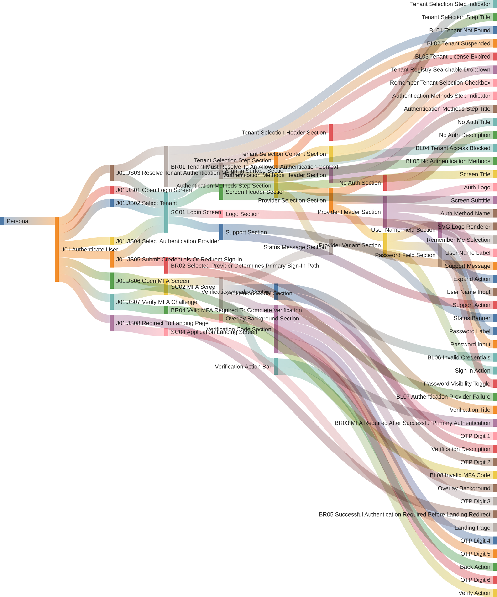

# Login Scenarios

## Persona -> Journey -> Journey Step -> Screen -> Section -> Element -> Validation Rule Set -> Validation Rule

**Status**

- High-level baseline only
- Detailed authentication implementation remains owned by `R01. AUTHENTICATION AND AUTHORIZATION`
- This artifact aligns the business login flow to the zero-redirect architecture baseline
- Only `UAE Pass` is modeled here as a redirect-based exception

**Scope**

- Show the available authentication methods for the resolved tenant
- Let the user authenticate through the selected auth method
- Complete MFA when required before session issuance
- Handle tenant access-state outcomes before sign-in proceeds
- Handle tenant-not-found resolution as a login-entry outcome

**Source anchors**

- `Documentation/Architecture/09-architecture-decisions.md`
- `Documentation/Architecture/06-runtime-view.md`
- `Documentation/togaf/02-business-architecture.md`
- `Documentation/togaf/04-application-architecture.md`
- `Documentation/togaf/artifacts/building-blocks/ABB-001-identity-orchestration.md`
- `Documentation/.Requirements/.references/R01. AUTHENTICATION AND AUTHORIZATION/Design/01-PRD-Authentication-Authorization.md`
- `Documentation/.Requirements/.references/R01. AUTHENTICATION AND AUTHORIZATION/Design/06-API-Contract.md`
- `Documentation/.Requirements/.references/R01. AUTHENTICATION AND AUTHORIZATION/Design/09-Detailed-User-Journeys.md`
- `frontend/src/app/features/auth/login.page.html`
- `frontend/src/app/features/auth/login.page.ts`

## Reading Guide

- `persona` = the business actor who is allowed to perform the login journey
- `journey` = the business goal the persona is trying to complete
- `journey step` = the ordered workflow step that activates a screen
- `business rule` = the journey-flow rule that decides whether a conditional journey step executes, is skipped, or is diverted
- `blocker` = the business blocking condition or blocked outcome raised against one or more journey steps
- `screen` = the top structural host context and validation-rule-set scope
- `section` = the structural grouping object inside a screen or another section
- `element` = the terminal visible or interactive object and must always remain a leaf
- `validation rule set` = the screen-scoped rule-set definition for runtime UI behavior
- `validation rule` = the declarative condition and action record that targets a screen, section, or element

Authoring notes:

- this artifact now uses the structural baseline from `G02.01 System Graphs`
- the current login HTML sketch is the naming source for screen, section, and element labels
- legacy `touchpoint` and `variant` language may still appear in upstream references and temporary traceability notes, but it is no longer the active structural modeling baseline for this artifact

Example:

- `J01` = `Authenticate User`
- `J01.JS01` = `Open Login Screen`
- `J01.JS01` activates `SC01 = Login Screen`
- `J01.JS06` is `conditional` and governed by a business rule such as `MFA Required After Successful Primary Authentication`
- `SC01` contains `Sign-In Surface Section`
- `Authentication Methods Step Section` contains `Status Message Section` and `Provider Selection Section`
- `Provider Selection Section` contains `No Auth Section`, `Provider Header Section`, and `Provider Variant Section`
- business rules may raise blockers such as `Tenant Not Found` or `No Authentication Methods`
- `SC01 Login Screen Rule Set` may target `No Auth Section`, `Status Banner`, `Sign In Action`, or other named structural targets after the business-flow outcome is known

Canonical graph reference:

- `Documentation/.Requirements/G02. Data architecture/G02.01. System Graphs/00-System-Graph-Model.md`
- The canonical system graph is maintained only in `G02.01 System Graphs` and must not be duplicated in this login artifact.

## Personas List

| Code | Persona |
|------|---------|
| `P01` | `ADMIN (MASTER)` |
| `P02` | `ADMIN (REGULAR)` |
| `P03` | `ADMIN (DOMINANT)` |
| `P04` | `USER` |
| `P05` | `VIEWER` |

## Journeys List

Purpose: this list defines the login business journey covered by this artifact. Tenant-state outcomes, tenant-not-found resolution, provider availability, primary-auth failures, and MFA failures are handled by the screen validation-rule set and the screen structure, not treated here as standalone journeys.

| Code | Journey | Purpose |
|------|---------|---------|
| `J01` | Authenticate User | Authenticate user and authorize user to access the landing page |

Outcome note:

- success outcome: user is authenticated and redirected to the application screen and landing page
- failure outcomes are resolved through screen rule outcomes such as tenant not found, tenant suspended, tenant license expired, tenant access blocked, no authentication methods, invalid credentials, authentication provider failure, and invalid MFA code

## Journey Steps List

Purpose: this list defines the ordered login workflow steps, the screen each step activates, and whether the step is mandatory or conditional in the business flow. Section and element state within the active screen is controlled separately by the screen validation-rule set.

| Code | Journey | Journey Step | Execution Method | Screen | Purpose |
|------|---------|--------------|------------------|-------|---------|
| `J01.JS01` | `J01` | Open Login Screen | `mandatory` | `SC01` | Open the unauthenticated login screen and expose the login experience baseline |
| `J01.JS02` | `J01` | Select Tenant | `mandatory` | `SC01` | Capture the required tenant and optional remembered tenant selection before authentication-method resolution proceeds |
| `J01.JS03` | `J01` | Resolve Tenant Authentication Methods | `mandatory` | `SC01` | Resolve tenant access-state and tenant-scoped authentication-method outcomes before provider selection proceeds |
| `J01.JS04` | `J01` | Select Authentication Provider | `conditional` | `SC01` | Let the user choose one available authentication provider when the tenant is valid and one or more auth methods are available |
| `J01.JS05` | `J01` | Submit Credentials Or Redirect Sign-In | `conditional` | `SC01` | Let the user enter credentials or continue through the provider-specific redirect sign-in flow and resolve the primary-authentication outcome |
| `J01.JS06` | `J01` | Open MFA Screen | `conditional` | `SC02` | Open the step-up verification screen after primary authentication succeeds and MFA is required |
| `J01.JS07` | `J01` | Verify MFA Challenge | `conditional` | `SC02` | Let the MFA flow collect and verify the MFA challenge code when the MFA screen is active |
| `J01.JS08` | `J01` | Redirect To Landing Page | `conditional` | `SC04` | Redirect the authenticated user into the post-login application landing screen after login succeeds |

Note:

- tenant access-state blocking and tenant-not-found resolution remain rule-driven login outcomes; they are documented through screens, sections, elements, and rule targets, not as standalone journeys in this section
- the current BPMN baseline makes these explicit rule-driven outcomes:
  - tenant not found
  - tenant suspended
  - tenant license expired
  - tenant access blocked
  - no authentication methods
  - invalid credentials
  - authentication failed
  - invalid MFA code

## Business Rules List

Purpose: this list defines the business rules that govern conditional journey-step execution. These rules control business flow, not screen or UI state.

| Code | Business Rule | Governs Journey Step(s) | Effect |
|------|---------------|-------------------------|--------|
| `BR01` | Tenant Must Resolve To An Allowed Authentication Context | `J01.JS03`, `J01.JS04` | Allows provider selection only when the tenant exists, tenant access is allowed, and one or more authentication methods are available |
| `BR02` | Selected Provider Determines Primary Sign-In Path | `J01.JS05` | Routes the user through credential submission or redirect sign-in according to the selected provider type and primary-auth outcome |
| `BR03` | MFA Required After Successful Primary Authentication | `J01.JS06` | Opens the MFA screen only when primary authentication succeeds and the selected method requires MFA |
| `BR04` | Valid MFA Required To Complete Verification | `J01.JS07` | Allows MFA completion only when the submitted MFA challenge code is valid |
| `BR05` | Successful Authentication Required Before Landing Redirect | `J01.JS08` | Allows redirect to the application screen and landing page only after successful primary authentication and successful MFA when required |

## Blockers List

Purpose: this list defines the blockers that can prevent, interrupt, or divert a journey step. Blockers belong to the business-flow layer; screen validation rules render their outcomes in the UI.

| Code | Blocker | Affects Journey Step(s) | Typical Screen Outcome | Notes |
|------|---------|-------------------------|-----------------------|-------|
| `BL01` | Tenant Not Found | `J01.JS03`, `J01.JS04` | `SC03 Tenant Not Found Screen` | Tenant resolution fails before provider selection can continue |
| `BL02` | Tenant Suspended | `J01.JS03`, `J01.JS04` | `SC01` status-message outcome | Blocks normal sign-in before provider selection proceeds |
| `BL03` | Tenant License Expired | `J01.JS03`, `J01.JS04` | `SC01` status-message outcome | Blocks or alters normal sign-in before provider selection proceeds |
| `BL04` | Tenant Access Blocked | `J01.JS03`, `J01.JS04` | `SC01` status-message outcome | Covers blocked or inactive tenant access before provider selection proceeds |
| `BL05` | No Authentication Methods | `J01.JS03`, `J01.JS04` | `SC01` no-auth outcome | Prevents provider selection because no active authentication methods are available |
| `BL06` | Invalid Credentials | `J01.JS05` | `SC01` status-message outcome | Keeps the user in the login screen with credential feedback |
| `BL07` | Authentication Provider Failure | `J01.JS05` | `SC01` status-message outcome | Covers failed or incomplete provider response after primary sign-in submission |
| `BL08` | Invalid MFA Code | `J01.JS07` | `SC02` status-message outcome | Keeps the user in the MFA screen with verification feedback |

## Journey Flow Graph

Purpose: this diagram visualizes the login journey from persona to journey, journey step, business rule, blocker, screen, section, and element. It is a journey-specific projection of the login scope and does not replace the canonical system graph in `G02.01 System Graphs`.

### J01 Authenticate User



Rule-driven outcome note:

- tenant access-state blocking remains a rule-driven outcome inside `SC01 Login Screen`
- tenant-not-found remains a rule-driven outcome that activates `SC03 Tenant Not Found Screen`
- for redirect-based auth methods, `Provider Variant Section` keeps `Sign In Action` and the credential field sections are hidden by the screen validation-rule set

## Screens List

Purpose: this list defines the structural screens used by the login journeys.

| Code | Screen | Purpose | Notes |
|------|-------|---------|-------|
| `SC01` | `Login Screen` | Unauthenticated screen for the screen header, logo, tenant selection, provider selection, provider sign-in, and support path | Main login screen |
| `SC02` | `MFA Screen` | Step-up verification screen used after primary authentication succeeds and MFA is required | Uses the MFA verification modal structure |
| `SC03` | `Tenant Not Found Screen` | Standalone not-found screen shown when tenant resolution fails before login can proceed | Dedicated screen record; no longer treated as a touchpoint in the active structural baseline |
| `SC04` | `Application Landing Screen` | Post-authentication landing target reached after successful login | Lands inside the authenticated application shell; detailed shell structure is owned outside this login artifact |

## Screen Structure

### SC01 Login Screen

```text
SC01 Login Screen
  Screen Header Section
    Screen Title
    Screen Subtitle
  Logo Section
    SVG Logo Renderer
  Sign-In Surface Section
    Tenant Selection Step Section
      Tenant Selection Header Section
        Tenant Selection Step Indicator
        Tenant Selection Step Title
      Tenant Selection Content Section
        Tenant Registry Searchable Dropdown
        Remember Tenant Selection Checkbox
    Authentication Methods Step Section
      Authentication Methods Header Section
        Authentication Methods Step Indicator
        Authentication Methods Step Title
      Status Message Section
        Status Banner
      Provider Selection Section
        No Auth Section
          No Auth Title
          No Auth Description
        Provider Header Section [0..n]
          Auth Logo [0..n]
          Auth Method Name [0..n]
          Remember Me Selection [0..n]
          Expand Action [0..n]
        Provider Variant Section [0..n]
          User Name Field Section [credential only]
            User Name Label
            User Name Input
          Password Field Section [credential only]
            Password Label
            Password Input
            Password Visibility Toggle
          Sign In Action
  Support Section
    Support Message
    Support Action
```

### SC02 MFA Screen

```text
SC02 MFA Screen
  Overlay Background Section
    Overlay Background
  Verification Modal Section
    Verification Header Section
      Verification Title
      Verification Description
    Status Message Section
      Status Banner
    Verification Code Section
      OTP Digit 1
      OTP Digit 2
      OTP Digit 3
      OTP Digit 4
      OTP Digit 5
      OTP Digit 6
    Verification Action Bar
      Back Action
      Verify Action
```

Deviation note:

- the current HTML artifact still renders `Overlay Background` directly under the screen root; this violates the structural rule that a screen may contain sections only and must be corrected to `Overlay Background Section`

### SC03 Tenant Not Found Screen

```text
SC03 Tenant Not Found Screen
  Screen Header Section
    Screen Title
    Screen Subtitle
  Logo Section
    SVG Logo Renderer
  Tenant Not Found Section
    Not Found Title
    Not Found Description
    Back to Login Action
```

### SC04 Application Landing Screen

```text
SC04 Application Landing Screen
  Landing Page Section
    Landing Page
```

## Element Specification

Purpose: this section defines each UI element as a structural leaf and documents the PrimeNG source baseline, EMSIST styling baseline, and runtime-control baseline that implementation must follow.

### SC01 Login Screen Elements

| Element | Parent Section | PrimeNG Source | EMSIST Pattern | Token Source / Family | `render_mode` | `default_state` | `control_source` | Notes |
|------------|------------------|----------------|----------------|-----------------------|---------------|-----------------|------------------|-------|
| `Screen Title` | `Screen Header Section` | `Custom` | Screen title `H1` | `frontend/src/styles.scss` -> `--tp-font-family`, `--tp-font-xl`, `--tp-text-dark` | `static` | `visible` | `none` | Title content may be composed from fixed prefix plus backend/config values, but is not controlled by the rule set |
| `Screen Subtitle` | `Screen Header Section` | `Custom` | Screen subtitle `H2` | `frontend/src/styles.scss` -> `--tp-font-lg`, `--tp-text-secondary` | `static` | `visible` | `none` | Subtitle text is configuration-driven content, not a rule-set target by default |
| `SVG Logo Renderer` | `Logo Section` | `Custom` | Brand logo renderer | `frontend/src/styles.scss` -> brand color and spacing primitives | `static` | `visible` | `none` | Brand asset renderer |
| `Tenant Selection Step Indicator` | `Tenant Selection Header Section` | `Stepper` | Step indicator tokenized under step-header pattern | `frontend/src/styles.scss` -> spacing, typography, border primitives | `static` | `visible` | `none` | PrimeNG source pattern is stepper, even though the current artifact is standalone HTML |
| `Tenant Selection Step Title` | `Tenant Selection Header Section` | `Stepper` | Step title | `frontend/src/styles.scss` -> `--tp-font-md`, `--tp-text-dark` | `static` | `visible` | `none` | Current title: `Select Tenant` |
| `Tenant Registry Searchable Dropdown` | `Tenant Selection Content Section` | `Select` | Searchable single-select tenant picker | `frontend/src/styles.scss` -> `--p-select-*`, `--tp-space-*`, `--nm-radius-pill` | `static` | `visible` | `validation_rule_set` | Filtered single-select list aligned to EMSIST select tokens |
| `Remember Tenant Selection Checkbox` | `Tenant Selection Content Section` | `Checkbox` | Remember-tenant selection | `frontend/src/styles.scss` -> `--p-checkbox-*` | `static` | `visible` | `validation_rule_set` | Optional setting |
| `Authentication Methods Step Indicator` | `Authentication Methods Header Section` | `Stepper` | Step indicator tokenized under step-header pattern | `frontend/src/styles.scss` -> spacing, typography, border primitives | `static` | `visible` | `none` | PrimeNG source pattern is stepper |
| `Authentication Methods Step Title` | `Authentication Methods Header Section` | `Stepper` | Step title | `frontend/src/styles.scss` -> `--tp-font-md`, `--tp-text-dark` | `static` | `visible` | `none` | Current title: `Select Login Method` |
| `Status Banner` | `Status Message Section` | `Message` | Inline status banner | `frontend/src/styles.scss` -> `--p-message-*`, `--tp-toast-*` | `conditional` | `hidden` | `validation_rule_set` | Screen rule set owns message visibility, severity, and text |
| `No Auth Title` | `No Auth Section` | `Custom` | Empty-state title | `frontend/src/styles.scss` -> `--tp-font-lg`, `--tp-text-dark` | `conditional` | `hidden` | `validation_rule_set` | Shown when zero auth methods are available |
| `No Auth Description` | `No Auth Section` | `Custom` | Empty-state supporting text | `frontend/src/styles.scss` -> `--tp-font-md`, `--tp-text-secondary` | `conditional` | `hidden` | `validation_rule_set` | Shown with `No Auth Title` |
| `Auth Logo [0..n]` | `Provider Header Section` | `Custom` | Provider badge or logo renderer | `frontend/src/styles.scss` -> icon sizing, surface, border primitives | `conditional` | `hidden` | `none` | Data-driven repeatable element; appears only when providers exist |
| `Auth Method Name [0..n]` | `Provider Header Section` | `Custom` | Provider display label | `frontend/src/styles.scss` -> `--tp-font-md`, `--tp-text-dark` | `conditional` | `hidden` | `none` | Data-driven repeatable element |
| `Remember Me Selection [0..n]` | `Provider Header Section` | `RadioButton` | Remember-provider selection | `frontend/src/styles.scss` -> `--p-radiobutton-*` | `conditional` | `hidden` | `none` | Optional per-provider selection control |
| `Expand Action [0..n]` | `Provider Header Section` | `Button` | Expand/collapse provider option | `frontend/src/styles.scss` -> `--p-button-*` | `conditional` | `hidden` | `none` | Icon-only or text-icon action depending on provider card rendering |
| `User Name Label [credential only]` | `User Name Field Section` | `Custom` | Field label | `frontend/src/styles.scss` -> `--tp-font-sm`, `--tp-text` | `conditional` | `hidden` | `none` | Credential providers only |
| `User Name Input [credential only]` | `User Name Field Section` | `InputText` | Username input with EMSIST field styling | `frontend/src/styles.scss` -> `--p-inputtext-*` | `conditional` | `hidden` | `validation_rule_set` | Credential providers only |
| `Password Label [credential only]` | `Password Field Section` | `Custom` | Field label | `frontend/src/styles.scss` -> `--tp-font-sm`, `--tp-text` | `conditional` | `hidden` | `none` | Credential providers only |
| `Password Input [credential only]` | `Password Field Section` | `InputText` | Password input aligned to EMSIST input tokens | `frontend/src/styles.scss` -> `--p-inputtext-*` | `conditional` | `hidden` | `validation_rule_set` | Credential providers only; visibility action handled separately |
| `Password Visibility Toggle [credential only]` | `Password Field Section` | `Button` | Icon-only toggle action | `frontend/src/styles.scss` -> `--p-button-*`, icon sizing primitives | `conditional` | `hidden` | `none` | Credential providers only |
| `Sign In Action [0..n]` | `Provider Variant Section` | `Button` | Provider submit action | `frontend/src/styles.scss` -> `--p-button-*` | `conditional` | `hidden` | `validation_rule_set` | Redirect providers show this action without credential inputs |
| `Support Message` | `Support Section` | `Custom` | Support helper text | `frontend/src/styles.scss` -> `--tp-font-sm`, `--tp-text-secondary` | `static` | `visible` | `none` | Informational text only |
| `Support Action` | `Support Section` | `Button` | Support navigation action | `frontend/src/styles.scss` -> `--p-button-text-secondary-*`, `--p-button-*` | `static` | `visible` | `none` | Navigation target rather than validation target |

### SC02 MFA Screen Elements

| Element | Parent Section | PrimeNG Source | EMSIST Pattern | Token Source / Family | `render_mode` | `default_state` | `control_source` | Notes |
|------------|------------------|----------------|----------------|-----------------------|---------------|-----------------|------------------|-------|
| `Overlay Background` | `Overlay Background Section` | `Custom` | Modal overlay backdrop | `frontend/src/styles.scss` -> `--tp-z-overlay`, surface and opacity primitives | `static` | `visible` | `none` | Structural overlay surface behind the modal |
| `Verification Title` | `Verification Header Section` | `Custom` | Modal title | `frontend/src/styles.scss` -> `--tp-font-lg`, `--tp-text-dark` | `static` | `visible` | `none` | Visible title of the MFA screen |
| `Verification Description` | `Verification Header Section` | `Custom` | Modal supporting text | `frontend/src/styles.scss` -> `--tp-font-md`, `--tp-text-secondary` | `static` | `visible` | `none` | Explains the verification requirement |
| `Status Banner` | `Status Message Section` | `Message` | Inline MFA status banner | `frontend/src/styles.scss` -> `--p-message-*`, `--tp-toast-*` | `conditional` | `hidden` | `validation_rule_set` | Used for invalid code and expired session outcomes |
| `OTP Digit 1..6` | `Verification Code Section` | `InputOtp` | Six-slot OTP entry | `frontend/src/styles.scss` -> global spacing, radius, text, and focus primitives; no dedicated `--p-inputotp-*` family is currently defined | `static` | `visible` | `validation_rule_set` | PrimeNG source baseline is `InputOtp`; dedicated token family remains to be added if needed |
| `Back Action` | `Verification Action Bar` | `Button` | Modal secondary navigation action | `frontend/src/styles.scss` -> `--p-button-secondary-*`, `--p-button-*` | `static` | `visible` | `validation_rule_set` | May transition back to the prior login screen state |
| `Verify Action` | `Verification Action Bar` | `Button` | Modal primary submit action | `frontend/src/styles.scss` -> `--p-button-primary-*`, `--p-button-*` | `static` | `visible` | `validation_rule_set` | Submit target for MFA verification |

### SC03 Tenant Not Found Screen Elements

| Element | Parent Section | PrimeNG Source | EMSIST Pattern | Token Source / Family | `render_mode` | `default_state` | `control_source` | Notes |
|------------|------------------|----------------|----------------|-----------------------|---------------|-----------------|------------------|-------|
| `Screen Title` | `Screen Header Section` | `Custom` | Screen title `H1` | `frontend/src/styles.scss` -> `--tp-font-family`, `--tp-font-xl`, `--tp-text-dark` | `static` | `visible` | `none` | Reuses the screen-header title pattern |
| `Screen Subtitle` | `Screen Header Section` | `Custom` | Screen subtitle `H2` | `frontend/src/styles.scss` -> `--tp-font-lg`, `--tp-text-secondary` | `static` | `visible` | `none` | Reuses the screen-header subtitle pattern |
| `SVG Logo Renderer` | `Logo Section` | `Custom` | Brand logo renderer | `frontend/src/styles.scss` -> brand color and spacing primitives | `static` | `visible` | `none` | Brand asset renderer |
| `Not Found Title` | `Tenant Not Found Section` | `Custom` | Not-found title | `frontend/src/styles.scss` -> `--tp-font-lg`, `--tp-text-dark` | `static` | `visible` | `none` | Main outcome title |
| `Not Found Description` | `Tenant Not Found Section` | `Custom` | Not-found explanation text | `frontend/src/styles.scss` -> `--tp-font-md`, `--tp-text-secondary` | `static` | `visible` | `none` | Outcome explanation |
| `Back to Login Action` | `Tenant Not Found Section` | `Button` | Return-to-login action | `frontend/src/styles.scss` -> `--p-button-secondary-*`, `--p-button-*` | `static` | `visible` | `validation_rule_set` | Transition target back to `SC01 Login Screen` |

### SC04 Application Landing Screen Elements

| Element | Parent Section | PrimeNG Source | EMSIST Pattern | Token Source / Family | `render_mode` | `default_state` | `control_source` | Notes |
|------------|------------------|----------------|----------------|-----------------------|---------------|-----------------|------------------|-------|
| `Landing Page` | `Landing Page Section` | `Custom` | Post-login landing target | Inherited from the authenticated application shell implementation | `static` | `visible` | `none` | This artifact carries the redirect target only; detailed landing-page structure is defined outside the login artifact |

## Screen Validation Rule Set Baseline

Purpose: this section defines the screen-scoped runtime rule sets that consume the designed validation-rule graph and resolve UI-state changes after the business journey, business-rule, and blocker outcomes are known.

| Screen | Validation Rule Set | Scope | Allowed Runtime Actions | Primary Facts / Inputs | Primary Targets |
|-------|------------------------|-------|-------------------------|------------------------|-----------------|
| `SC01 Login Screen` | `Login Screen Rule Set` | `screen` | `show`, `hide`, `enable`, `disable`, `set_value`, `set_text`, `transition` | tenant selection state, tenant resolution result, tenant access state, available auth methods count, selected provider type, credential validation result, rate limit result | `Status Message Section`, `Status Banner`, `No Auth Section`, `Tenant Registry Searchable Dropdown`, `User Name Input`, `Password Input`, `Sign In Action` |
| `SC02 MFA Screen` | `MFA Screen Rule Set` | `screen` | `show`, `hide`, `enable`, `disable`, `set_value`, `set_text`, `transition` | MFA required, MFA code validity, MFA session expiry, retry state | `Status Message Section`, `Status Banner`, `Verification Code Section`, `Verify Action`, `Back Action` |
| `SC03 Tenant Not Found Screen` | `Tenant Not Found Screen Rule Set` | `screen` | `show`, `hide`, `set_text`, `transition` | tenant resolution failure outcome | `Tenant Not Found Section`, `Not Found Title`, `Not Found Description`, `Back to Login Action` |
| `SC04 Application Landing Screen` | `Application Landing Screen Rule Set` | `screen` | `transition` | authenticated user context, resolved home target | `Landing Page` |

## Explicit Validation Rule Outcomes

Purpose: this list aligns the screen validation-rule-set model with the explicit business-rule and blocker outcomes now present in the BPMN baseline.

| Rule Outcome | Screen | Primary Target | Typical Runtime Actions | Notes |
|--------------|-------|----------------|-------------------------|-------|
| `TENANT_NOT_FOUND` | `SC03` | `Tenant Not Found Section` | `show`, `set_text`, `transition` | Dedicated not-found screen outcome |
| `TENANT_SUSPENDED` | `SC01` | `Status Message Section`, `Status Banner` | `show`, `set_text`, `hide`, `disable` | Blocks normal sign-in in the login screen |
| `TENANT_LICENSE_EXPIRED` | `SC01` | `Status Message Section`, `Status Banner` | `show`, `set_text`, `hide`, `disable` | License-expired outcome before normal sign-in proceeds |
| `TENANT_ACCESS_BLOCKED` | `SC01` | `Status Message Section`, `Status Banner` | `show`, `set_text`, `hide`, `disable` | Covers blocked or inactive tenant access before sign-in proceeds |
| `NO_AUTH_METHODS` | `SC01` | `No Auth Section` | `show`, `hide`, `set_text` | Empty-state outcome when no auth methods are available |
| `INVALID_CREDENTIALS` | `SC01` | `Status Message Section`, `Status Banner` | `show`, `set_text`, `enable` | Keeps user in the login screen and exposes credential feedback |
| `AUTH_PROVIDER_FAILURE` | `SC01` | `Status Message Section`, `Status Banner` | `show`, `set_text` | Generic authentication failure after provider response |
| `INVALID_MFA_CODE` | `SC02` | `Status Message Section`, `Status Banner` | `show`, `set_text`, `enable` | Keeps user in the MFA screen and exposes verification feedback |

## Login Rule Targets

Purpose: this list defines the named structural targets that the screen rule sets may affect.

| Target | Object Type | Screen | Example Runtime Actions | Notes |
|--------|-------------|-------|-------------------------|-------|
| `Status Message Section` | `Section` | `SC01`, `SC02` | `show`, `hide` | Section-level message region |
| `Status Banner` | `Element` | `SC01`, `SC02` | `show`, `hide`, `set_text` | Message text and severity output |
| `No Auth Section` | `Section` | `SC01` | `show`, `hide` | Empty-state outcome when zero auth methods are available |
| `No Auth Title` | `Element` | `SC01` | `show`, `hide`, `set_text` | Empty-state title for no-auth outcome |
| `No Auth Description` | `Element` | `SC01` | `show`, `hide`, `set_text` | Empty-state description for no-auth outcome |
| `Tenant Registry Searchable Dropdown` | `Element` | `SC01` | `enable`, `disable`, `set_value` | Tenant-selection control |
| `Remember Tenant Selection Checkbox` | `Element` | `SC01` | `enable`, `disable`, `set_value` | Optional remembered-selection control |
| `User Name Input` | `Element` | `SC01` | `enable`, `disable`, `set_value` | Credential-provider input target |
| `Password Input` | `Element` | `SC01` | `enable`, `disable`, `set_value` | Credential-provider input target |
| `Sign In Action` | `Element` | `SC01` | `show`, `hide`, `enable`, `disable`, `set_text`, `transition` | Shared submit action across credential and redirect providers |
| `Verification Code Section` | `Section` | `SC02` | `show`, `hide`, `enable`, `disable` | MFA entry region |
| `Verify Action` | `Element` | `SC02` | `enable`, `disable`, `transition` | MFA submit target |
| `Back Action` | `Element` | `SC02` | `transition` | Return-path action |
| `Back to Login Action` | `Element` | `SC03` | `transition` | Returns the user to `SC01 Login Screen` |
| `Landing Page` | `Element` | `SC04` | `transition` | Post-login destination inside the authenticated application shell |

## Legacy Touchpoint And Variant Traceability

Purpose: this appendix preserves traceability from the old login baseline while making the new screen/section/element model authoritative.

### Legacy Touchpoint To New Structure

| Legacy Touchpoint | New Screen | New Activated Section | Mapping Note |
|-------------------|-----------|-------------------------|--------------|
| `TP01 Available Auth Providers` | `SC01` | `Authentication Methods Step Section` | Provider-list behavior now lives inside the login screen structure |
| `TP02 Auth Method Screen` | `SC01` | `Provider Variant Section` | Method-specific sign-in is now modeled as provider-specific structure and rule targets |
| `TP03 MFA Verification` | `SC02` | `Verification Modal Section` | MFA remains a dedicated screen with modal structure |
| `TP04 Tenant Not Found` | `SC03` | `Tenant Not Found Section` | Not-found outcome is normalized to a dedicated screen |

### Legacy Variant Family To New Structure And Rule Targets

| Legacy Variant Family | New Structural Target | New Rule Targeting Baseline |
|-----------------------|-----------------------|-----------------------------|
| `TP01-V01 Active Providers List` | `Provider Selection Section` | Render repeatable provider header and provider variant structure |
| `TP01-V02 No Active Providers` | `No Auth Section` | Show `No Auth Section`; hide provider-driven content |
| `TP01-V03`, `TP01-V04`, `TP01-V06`, `TP01-V07`, `TP01-V08` | `Status Message Section` | Show `Status Banner` and set outcome text according to business state |
| `TP02-V01` to `TP02-V06` | `Provider Variant Section` | Use provider type and business rules to show redirect or credential controls |
| `TP02-V07` to `TP02-V10` | `Status Message Section`, `Provider Variant Section` | Keep structure stable and use the rule set for error messaging and control state |
| `TP03-V01` to `TP03-V04` | `Verification Modal Section` | Keep MFA structure stable and use the rule set for verification and error states |
| `TP04-V01` | `Tenant Not Found Section` | Dedicated not-found screen outcome |

## Notes

- the first login experience remains the EMSIST login screen, not a provider-owned external screen
- available auth methods are derived from `GET /api/v1/auth/providers`
- the active providers exposed by `GET /api/v1/auth/providers` are the tenant's active `Authentication` integrations configured through `G01.03.04 Manage Tenant Integrations`
- tenant-state outcomes are handled before normal sign-in completes:
  - no tenant license
  - tenant license expired
  - tenant suspended
  - tenant deleted or not found
- `Documentation/Architecture` and `Documentation/togaf` define the zero-redirect BFF pattern as the baseline:
  - users never see Keycloak UI
  - login forms remain part of the Angular application
  - auth traffic is mediated by the backend
- current documented provider families for tenant auth configuration are `OIDC`, `SAML`, `LDAP`, and `OAUTH2`
- `SCIM` appears in provider-configuration documentation but is provisioning or sync, not an end-user login method
- `UAE Pass` remains the documented redirect-based exception in the current baseline
- `Google` and `Microsoft` remain supported documented sign-in paths and should render through the provider-selection structure when active
- when a tenant has no license or an expired tenant license, normal users do not enter the product screen
- for `No Tenant License` and `Tenant License Expired`, only the default admin may continue from the tenant login flow
- when a tenant is suspended, no user may access the tenant through login
- when a tenant is deleted or does not exist, login resolves to the dedicated tenant-not-found screen
- the current Angular frontend is still underimplemented against this baseline and currently exposes only part of the required structure and rule behavior
