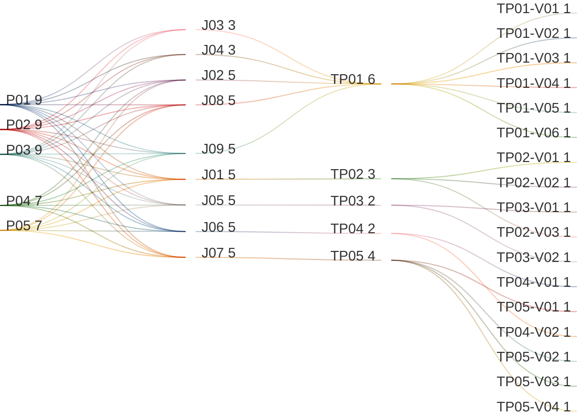

# System Shell

## Persona -> Journey -> Touchpoint -> Variant

**Status**

- High-level baseline only
- Detailed contents are deferred to the next stage
- Detailed contents require canonical data model finalization first
- UI component mapping must be completed against the canonical data model before screen contents can be signed off
- After that sign-off, this artifact can progress to prototypes, business rules, and validation rules

**Scope**

- Product Shell
- Home / Landing
- Help Pages
- About
- Notification Panel

**Source anchors**

- `../../../PERSONA-INTERACTION-SPECIFICATION.md:123-130`
- `../../../PERSONA-INTERACTION-SPECIFICATION.md:226-228`
- `../../../PERSONA-INTERACTION-SPECIFICATION.md:791-818`
- `Documentation/prototypes/index.html:1905-1927`
- `Documentation/prototypes/app.js:374-400`
- `frontend/src/app/features/administration/administration.page.html:1-205`
- `frontend/src/app/features/about/about.page.html:1-200`

## Reading Guide

- `journey` = the business goal the persona is trying to complete
- `shell context` = the host container around the touchpoint
- `touchpoint` = the screen used in that journey
- `variant` = a meaningful state of that screen
- variants inherit the shell context of their touchpoint

Example:

- `TP01` = `Product Shell`
- `TP01` sits in `SH01 = Product Shell`
- `TP01-V03` = the `Product Shell` when the dock is filtered by role and shows the allowed sections
- `TP01-V06` = the `Product Shell` when admin-only license-expiry restrictions are active after login
- `TP04-V01` = the `About` screen when legal notices are visible

## Personas List

| Code | Persona |
|------|---------|
| `P01` | `ADMIN (MASTER)` |
| `P02` | `ADMIN (REGULAR)` |
| `P03` | `ADMIN (DOMINANT)` |
| `P04` | `USER` |
| `P05` | `VIEWER` |

## Journeys List

Purpose: this list defines the global shell goals covered by this artifact.

| Code | Journey | Purpose |
|------|---------|---------|
| `J01` | Reach Home After Login | Land on the resolved home screen after successful login |
| `J02` | Return to Home | Return from a deeper screen to the resolved home destination |
| `J03` | Open Tenant Manager | Open the tenant-management entry from the dock and resolve tenant work from there |
| `J04` | Open Settings | Open the settings section in the dock to reach tenant registry and master license management |
| `J05` | View Help Pages | Open help content from the dock using links, not only a modal dialog |
| `J06` | View About | Open the about page and review legal notices and version information |
| `J07` | Review Notifications | Open and review recent notifications from the global shell |
| `J08` | Sign Out | End the session from the dock and return to the login entry screen |
| `J09` | Navigate by Breadcrumb | Move up the current navigation path without returning all the way to home |

## Shell Contexts List

Purpose: this list defines the host shell or container in which each touchpoint lives.

| Code | Shell Context | Purpose |
|------|---------------|---------|
| `SH01` | Product Shell | The single authenticated shell used across the product after login |

## Touchpoints List

Purpose: this list defines the screens used in the global shell flow.

| Code | Touchpoint | Shell Context | Purpose |
|------|------------|---------------|---------|
| `TP01` | Product Shell | `SH01` | Global authenticated shell that frames navigation, dock, header identity, breadcrumb, and footer |
| `TP02` | Home / Landing | `SH01` | Resolved landing destination after login and after direct return-home actions |
| `TP03` | Help Pages | `SH01` | Help destination reached from the dock through one or more help links |
| `TP04` | About | `SH01` | About page for legal notices, copyright, trademark, and version information |
| `TP05` | Notification Panel | `SH01` | Global notification destination for recent alerts and linked events |

## Touchpoint Variants List

Purpose: this list defines the meaningful screen states that require explicit requirements coverage.

| Code | Touchpoint | Variant | Meaning / When Used |
|------|------------|---------|---------------------|
| `TP01-V01` | `TP01` | Desktop Product Shell | Product shell is shown in desktop layout |
| `TP01-V02` | `TP01` | Mobile Product Shell | Product shell is shown in mobile layout with responsive navigation behavior |
| `TP01-V03` | `TP01` | Role-Based Dock | Dock sections and items are filtered by the current authenticated persona |
| `TP01-V04` | `TP01` | Dock Support Section | Dock support section exposes help links and the About entry |
| `TP01-V05` | `TP01` | Dock Account Section | Dock account section exposes sign out as the last action |
| `TP01-V06` | `TP01` | Admin License-Expired Restricted Shell | Product shell is shown only for admins who are still allowed to enter during license-expiry restriction |
| `TP02-V01` | `TP02` | Admin Home / Landing | Resolved landing destination for authenticated admin personas |
| `TP02-V02` | `TP02` | User Home / Landing | Resolved landing destination for standard users |
| `TP02-V03` | `TP02` | Viewer Executive Home / Landing | Resolved landing destination for viewers and executive-style read-only entry |
| `TP03-V01` | `TP03` | Help Links List | Help screen or help area lists one or more curated help destinations |
| `TP03-V02` | `TP03` | External Help Destination | Selecting a help link opens the external help page |
| `TP04-V01` | `TP04` | About Legal Notices | About page shows copyright, reproduction, trademark, and third-party legal notices |
| `TP04-V02` | `TP04` | About Version Information | About page shows platform version information |
| `TP05-V01` | `TP05` | Notification Loading | Notification panel is loading recent notifications |
| `TP05-V02` | `TP05` | Notification List | Notification panel shows one or more recent notifications |
| `TP05-V03` | `TP05` | Notification Empty | Notification panel shows the empty state when there are no notifications |
| `TP05-V04` | `TP05` | Notification Error | Notification panel shows an error state when notifications cannot be loaded |

## Variant Contents List

| Variant | Screen Contents |
|---------|-----------------|
| `TP01-V01` | Header; home action; current screen title; user profile avatar; notifications entry; breadcrumb; dock; footer |
| `TP01-V02` | Responsive header; responsive dock/menu behavior; home action; breadcrumb; user profile avatar; footer |
| `TP01-V03` | `Tenant Manager` dock item for `ADMIN (MASTER)`, `ADMIN (REGULAR)`, and `ADMIN (DOMINANT)`; `Settings` section; role-filtered visibility by authenticated persona |
| `TP01-V04` | Support section in dock; help links; About entry |
| `TP01-V05` | Account section in dock; logout action as the last dock action |
| `TP01-V06` | Restricted-access banner; expired-license notice; role-filtered admin navigation; only still-allowed admin destinations remain active |
| `TP02-V01` | Resolved admin landing destination; admin return-home target |
| `TP02-V02` | User landing cards and standard-user return-home target |
| `TP02-V03` | Viewer executive landing and read-only return-home target |
| `TP03-V01` | Help links list; curated help destinations; external help URLs |
| `TP03-V02` | External help page such as `http://aris.thinkplus.ltd/static/help/en/handling/connect/vc/#/index/en/1` |
| `TP04-V01` | Copyright notice; reproduction and disclosure restrictions; trademark notice; third-party legal notice references |
| `TP04-V02` | Portal version; ARIS version |
| `TP05-V01` | Loading state for notifications |
| `TP05-V02` | Notification items; unread state; linked destinations; mark-all-read action |
| `TP05-V03` | Empty-state message when no notifications exist |
| `TP05-V04` | Error message or retry state when notifications fail to load |

## Notes

- `touchpoint = screen`
- `shell context = host container around the screen`
- `variant = state/version of that screen`
- this artifact uses one authenticated `Product Shell` only
- `Return to Home` and `Navigate by Breadcrumb` are not the same:
  - `Return to Home` goes to the resolved landing destination
  - `Navigate by Breadcrumb` moves up the current navigation hierarchy
- the dock must contain multiple sections
- the dock support section must expose help links and the About page
- the dock account section must expose logout as the last action
- `Tenant Manager` resolves tenant-management work for `ADMIN (MASTER)`, `ADMIN (REGULAR)`, and `ADMIN (DOMINANT)`
- the settings section must expose tenant registry management for admins and master license management for `ADMIN (MASTER)` only
- when an admin is still allowed to enter during license-expiry restriction, the system shell must show an explicit restricted-access state
- normal users do not enter the product shell when the tenant has no license or an expired license; that outcome belongs to `G01.01.01 Login Scenarios`
- if the user is no longer allowed to log in after the expiry window is exhausted, that state belongs to `G01.01.01 Login Scenarios`, not to this shell artifact
- the current implementation still uses a help modal in the administration header; this baseline changes that direction to dock-based help pages
- the current about page exists in the codebase and is the correct destination for the `About` touchpoint, but its content must align to the legal/version baseline
- sign out should return the user to `G01.01.01 Login Scenarios -> TP01 Available Auth Providers`
