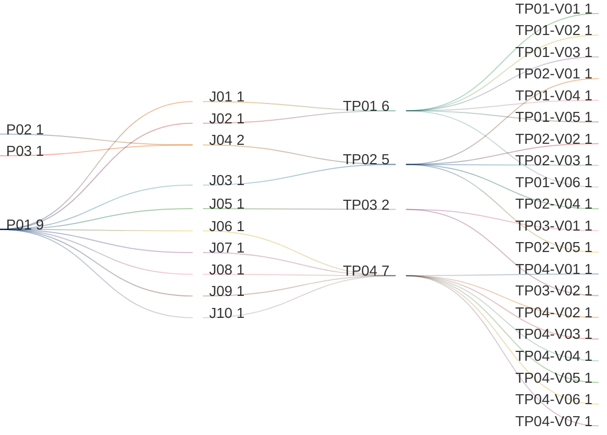

# View Tenant List

## Persona -> Journey -> Touchpoint -> Variant

**Status**

- High-level baseline only
- Detailed contents are deferred to the next stage
- Detailed contents require canonical data model finalization first
- UI component mapping must be completed against the canonical data model before screen contents can be signed off
- After that sign-off, this artifact can progress to prototypes, business rules, and validation rules

**Scope**

- View tenant list
- Search, filter, sort, and page the tenant list
- View tenant fact-sheet entry paths
- Start create-tenant flow
- Manage tenant lifecycle transitions

**Source anchors**

- `Documentation/.Requirements/.references/R02. TENANT MANAGEMENT/Design/R02-COMPLETE-STORY-INVENTORY.md:13-123`
- `Documentation/.Requirements/.references/R02. TENANT MANAGEMENT/Design/01-PRD-Tenant-Management.md:171-182`
- `Documentation/.Requirements/.references/R02. TENANT MANAGEMENT/Design/01-PRD-Tenant-Management.md:281-372`
- `Documentation/.Requirements/.references/R02. TENANT MANAGEMENT/Design/R02-journey-maps.md:48-110`
- `Documentation/.Requirements/.references/R02. TENANT MANAGEMENT/Design/R02-journey-maps.md:205-480`
- `Documentation/.Requirements/.references/R02. TENANT MANAGEMENT/Design/R02-screen-flow-prototype.html:656-841`
- `Documentation/.Requirements/.references/R02. TENANT MANAGEMENT/Design/00-FACT-SHEET-PATTERN.md:84-95`

## Reading Guide

- `journey` = the business goal the persona is trying to complete
- `shell context` = the host container around the touchpoint
- `touchpoint` = the screen used in that journey
- `variant` = a meaningful state of that screen
- variants inherit the shell context of their touchpoint

Example:

- `TP01` = `View Tenant List`
- `TP01` sits in `SH01 = System Shell`
- `TP01-V05` = the `View Tenant List` screen when search, filters, sort, or pagination are actively shaping the visible result set
- `TP04-V03` = the `Tenant Lifecycle Dialog` screen when archival is being confirmed

## Personas List

| Code | Persona |
|------|---------|
| `P01` | `ADMIN (MASTER)` |
| `P02` | `ADMIN (REGULAR)` |
| `P03` | `ADMIN (DOMINANT)` |

## Journeys List

Purpose: this list defines the tenant-management goals covered by this artifact.

| Code | Journey | Purpose |
|------|---------|---------|
| `J01` | View Tenant List | Browse tenants and locate a tenant to inspect or manage |
| `J02` | Search, Filter, Sort, and Page Tenant List | Narrow, order, and page the tenant list until the target tenant is found |
| `J03` | Open Tenant Fact Sheet from List | Review one selected tenant from the master-admin tenant list |
| `J04` | View Own Tenant Fact Sheet | Let a regular or dominant admin open its own tenant fact sheet directly |
| `J05` | Start Create Tenant | Start tenant creation from the list or its empty state |
| `J06` | Activate Tenant | Move a tenant into the active state when lifecycle rules allow it |
| `J07` | Suspend Tenant | Move an active tenant into the suspended state through the lifecycle flow |
| `J08` | Archive Tenant | Move an active or suspended tenant into the archived state |
| `J09` | Restore Tenant | Restore an archived tenant when lifecycle rules allow it |
| `J10` | Permanently Delete Tenant | Complete irreversible tenant deletion when retention and lifecycle rules allow it |

## Shell Contexts List

Purpose: this list defines the host shell or container in which each touchpoint lives.

| Code | Shell Context | Purpose |
|------|---------------|---------|
| `SH01` | System Shell | Top-level tenant-management shell used for list and create entry flows |
| `SH02` | Tenant Fact Sheet Shell | Tenant-scoped shell used when one tenant is opened |
| `SH03` | Dialog Shell | Confirmation shell for lifecycle actions |

## Touchpoints List

Purpose: this list defines the screens used to complete the journeys.

| Code | Touchpoint | Shell Context | Purpose |
|------|------------|---------------|---------|
| `TP01` | View Tenant List | `SH01` | Main tenant-management screen for browsing, searching, filtering, sorting, paging, and selecting tenants |
| `TP02` | View Tenant Fact Sheet | `SH02` | Detail screen for one tenant, including overview and roles-and-access view |
| `TP03` | Create Tenant | `SH01` | Tenant-creation screen for entering new-tenant data and starting provisioning |
| `TP04` | Tenant Lifecycle Dialog | `SH03` | Lifecycle-action screen for activate, suspend, archive, restore, and permanent-delete flows |

## Touchpoint Variants List

Purpose: this list defines the meaningful screen states that require explicit requirements coverage.

| Code | Touchpoint | Variant | Meaning / When Used |
|------|------------|---------|---------------------|
| `TP01-V01` | `TP01` | Initial Loading | Tenant list screen before the first result set is loaded |
| `TP01-V02` | `TP01` | List View | Tenant list screen after tenant records have loaded successfully in list or table presentation |
| `TP01-V03` | `TP01` | Card View | Tenant list screen after tenant records have loaded successfully in card or grid presentation |
| `TP01-V04` | `TP01` | Empty State | Tenant list screen when no tenants exist yet |
| `TP01-V05` | `TP01` | Filtered / Sorted Results | Tenant list screen when search, filters, sort, or paging are shaping the visible result set |
| `TP01-V06` | `TP01` | No Results | Tenant list screen when search or filters return no matching tenants |
| `TP02-V01` | `TP02` | Master Admin Any-Tenant View | Tenant fact sheet as opened by a master admin from the tenant list |
| `TP02-V02` | `TP02` | Own-Tenant Admin View | Tenant fact sheet as opened directly by a regular or dominant admin for its own tenant |
| `TP02-V03` | `TP02` | Suspended Tenant View | Tenant fact sheet when the tenant is in suspended state |
| `TP02-V04` | `TP02` | Initial Loading | Tenant fact sheet before the selected tenant data has loaded |
| `TP02-V05` | `TP02` | Roles & Access Tab | Tenant fact sheet when the roles-and-access tab is active |
| `TP03-V01` | `TP03` | Default Create Entry | Create-tenant screen ready for data entry |
| `TP03-V02` | `TP03` | Provisioning In Progress | Create-tenant flow after submission while provisioning is still running |
| `TP04-V01` | `TP04` | Activate Confirmation | Lifecycle dialog when activation is being confirmed |
| `TP04-V02` | `TP04` | Suspend Confirmation | Lifecycle dialog when suspension is being confirmed |
| `TP04-V03` | `TP04` | Archive Confirmation | Lifecycle dialog when archival is being confirmed |
| `TP04-V04` | `TP04` | Restore Confirmation | Lifecycle dialog when restore is being confirmed |
| `TP04-V05` | `TP04` | Permanent Delete Confirmation | Lifecycle dialog when irreversible deletion is being confirmed |
| `TP04-V06` | `TP04` | Invalid Transition Error | Lifecycle dialog when the requested state transition is not allowed |
| `TP04-V07` | `TP04` | Master Tenant Protected | Lifecycle dialog when a protected master-tenant action is blocked |

## Variant Contents List

| Variant | Screen Contents |
|---------|-----------------|
| `TP01-V01` | Header `Tenant Manager`; New Tenant button; search placeholder; type, status, and date filter placeholders; sort placeholder; result-count placeholder; list-loading skeleton; pagination placeholder |
| `TP01-V02` | Header `Tenant Manager`; New Tenant button; search input; type, status, and date filters; sort control; result count; tenant list or table rows; tenant identity; classification; key metrics; pagination |
| `TP01-V03` | Header `Tenant Manager`; New Tenant button; search input; type, status, and date filters; sort control; result count; tenant card or grid layout; card identity; classification; key metrics; pagination |
| `TP01-V04` | Header `Tenant Manager`; empty-state message; Create Tenant CTA |
| `TP01-V05` | Header `Tenant Manager`; active search term; active filter summary; sort selection; result count; tenant list or card results; pagination; clear-filter path |
| `TP01-V06` | Header `Tenant Manager`; active search term or filters; zero-result count; no-results message; clear-filter path |
| `TP02-V01` | Banner hero; tenant meta; KPI chips; action area; tab bar |
| `TP02-V02` | Banner hero; tenant meta; KPI chips; action area; tab bar |
| `TP02-V03` | Banner hero; suspended status indicator; suspension message or reason; restricted or read-only action area |
| `TP02-V04` | Fact-sheet initial loading state; banner placeholders; tab-content loading placeholders |
| `TP02-V05` | Roles and access tab; roles list; associated users by role; effective access summary; role visibility within the tenant context |
| `TP03-V01` | Create Tenant form entry from list or empty-state path |
| `TP03-V02` | Provisioning overlay or progress state; tenant creation submitted; user waits for provisioning result |
| `TP04-V01` | Activate confirmation dialog; target-state summary; cancel action; confirm activate action |
| `TP04-V02` | Suspend confirmation dialog; session-termination warning; cancel action; confirm suspend action |
| `TP04-V03` | Archive confirmation dialog; retention warning; cancel action; confirm archive action |
| `TP04-V04` | Restore confirmation dialog; restore target-state summary; cancel action; confirm restore action |
| `TP04-V05` | Permanent delete confirmation dialog; irreversible action warning; explicit destructive-action acknowledgement; permanently delete action |
| `TP04-V06` | Invalid-transition message; current state; requested state; blocked confirm action; lifecycle guidance |
| `TP04-V07` | Protected-master-tenant message; blocked action explanation; no destructive action path |

## Notes

- `touchpoint = screen`
- `shell context = host container around the screen`
- `variant = state/version of that screen`
- list screens in the product inherit the same baseline pattern: search, filter, sort, result count, pagination, list/card presentation where supported, empty state, and no-results state
- `TP01 View Tenant List` includes both `List View` and `Card View` as requirement-level presentation variants
- `ADMIN (MASTER)` uses the multi-tenant list path
- `ADMIN (REGULAR)` and `ADMIN (DOMINANT)` go directly to their own tenant fact sheet
- lifecycle transitions are modeled through one canonical `Tenant Lifecycle Dialog` rather than separate per-action screens
- lifecycle actions are a master-admin path in this baseline
- the tenant fact sheet includes a `Roles & Access` tab where admin users can view roles and associated users
- the prototype still shows a secondary tenant identifier below the tenant name; target-field naming changes belong to the data and backend transformation work, not this business-requirements map
