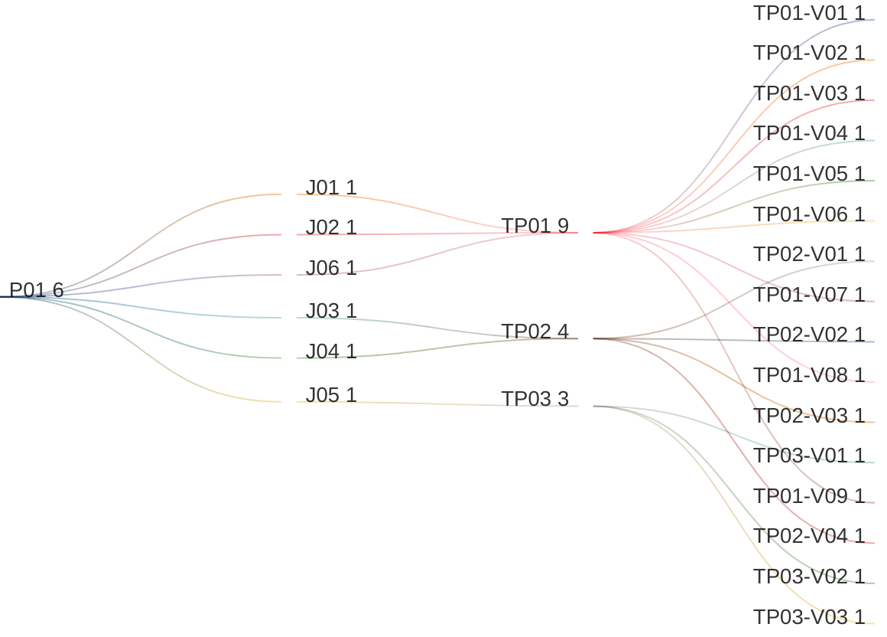

# Manage Master License Management

## Persona -> Journey -> Touchpoint -> Variant

**Status**

- High-level baseline only
- This artifact covers the authenticated settings path for master license management
- Detailed contents are deferred to the next stage
- Detailed contents require canonical licensing data model and service-contract finalization first
- UI component mapping must be completed against the canonical data model before screen contents can be signed off
- After that sign-off, this artifact can progress to prototypes, business rules, and validation rules

**Scope**

- View master license dashboard
- Review tenant license allocation overview
- View contracts inventory
- Add contract
- Update contract
- Extend contract end date
- Review expiry alerts and restricted-access state

**Source anchors**

- `Documentation/requirements/ON-PREMISE-LICENSING-REQUIREMENTS.md:294-311`
- `Documentation/requirements/ON-PREMISE-LICENSING-REQUIREMENTS.md:497-897`
- `Documentation/requirements/RBAC-LICENSING-REQUIREMENTS.md:631`
- `Documentation/requirements/RBAC-LICENSING-REQUIREMENTS.md:1230-1234`
- `Documentation/issues/open/ISSUE-003-license-admin-403-gateway-routing.md:120-146`
- `Documentation/prototypes/index.html:573-697`
- `Documentation/prototypes/README.md:32-39`
- `Documentation/prototypes/DESIGN-SYSTEM-VALIDATION.md:77-90`
- `Documentation/persona/PERSONA-REGISTRY.md:163-200`
- `frontend/src/app/features/administration/sections/license-manager/license-manager-section.component.html:1-304`
- `frontend/src/app/features/administration/sections/license-manager/license-manager-section.component.ts:1-237`

## Reading Guide

- `journey` = the business goal the persona is trying to complete
- `shell context` = the host container around the touchpoint
- `touchpoint` = the screen used in that journey
- `variant` = a meaningful state of that screen
- variants inherit the shell context of their touchpoint

Example:

- `TP01` = `Master License Dashboard`
- `TP01` sits in `SH02 = Master License Management Shell`
- `TP01-V06` = the `Master License Dashboard` when one or more contracts are expiring and renewal warnings are active
- `TP02-V01` = the `Contract Form Dialog` when a new contract is being added
- `TP03-V01` = the `Contract Extension Dialog` when the user is extending the end date of an expired or expiring contract

## Personas List

| Code | Persona |
|------|---------|
| `P01` | `ADMIN (MASTER)` |

## Journeys List

Purpose: this list defines the master-license-management goals covered by this artifact.

| Code | Journey | Purpose |
|------|---------|---------|
| `J01` | View Master License Dashboard | Review the master licensing dashboard from settings, including platform-wide license totals and contract status |
| `J02` | Review Tenant License Allocation Overview | Review tenant-level counts and allocation status across tenant, admin, user, and viewer licenses from the dashboard |
| `J03` | Add Contract | Add a new contract that generates or extends available license counts |
| `J04` | Update Existing Contract | Update an existing contract record and its managed counts or dates |
| `J05` | Extend Contract End Date | Extend the end date of an expiring or expired contract |
| `J06` | Review Expiry Alerts and Restricted Access State | Review contract-expiry warnings, renewal notifications, and the restricted admin state after expiry |

## Shell Contexts List

Purpose: this list defines the host shell or container in which each touchpoint lives.

| Code | Shell Context | Purpose |
|------|---------------|---------|
| `SH01` | Settings Shell | Settings-area host shell that contains tenant registry and master license management |
| `SH02` | Master License Management Shell | Main master licensing screen used after entering the settings section |
| `SH03` | Dialog Shell | Modal or review shell used for contract add, update, and extension flows |

## Touchpoints List

Purpose: this list defines the screens used in the master-license-management flow.

| Code | Touchpoint | Shell Context | Purpose |
|------|------------|---------------|---------|
| `TP01` | Master License Dashboard | `SH02` | Main settings screen for contract status, total license counts, tenant allocation overview, and contracts inventory |
| `TP02` | Contract Form Dialog | `SH03` | Add or update screen for a contract record and its managed license counts |
| `TP03` | Contract Extension Dialog | `SH03` | Screen for extending the end date of an expiring or expired contract |

## Touchpoint Variants List

Purpose: this list defines the meaningful screen states that require explicit requirements coverage.

| Code | Touchpoint | Variant | Meaning / When Used |
|------|------------|---------|---------------------|
| `TP01-V01` | `TP01` | Initial Loading | Dashboard is loading master-license counts, tenant allocation rows, and contracts inventory for the first time |
| `TP01-V02` | `TP01` | Default Dashboard | Dashboard shows total available vs remaining counts and the default tenant/contracts overview |
| `TP01-V03` | `TP01` | Contracts Table View | Contracts inventory is shown in table presentation |
| `TP01-V04` | `TP01` | Contracts Grid View | Contracts inventory is shown in grid or card presentation where supported |
| `TP01-V05` | `TP01` | Empty State | No contracts exist yet and the page prompts the master admin to add one |
| `TP01-V06` | `TP01` | Expiring Contracts Warning | One or more active contracts are approaching end date and renewal warnings are active |
| `TP01-V07` | `TP01` | Expired Contract Restricted Access | Contract end date has passed and only the master-license restricted-access state is shown here |
| `TP01-V08` | `TP01` | Access Denied | Dashboard request fails with authorization denial and must not be misreported as `No contracts` |
| `TP01-V09` | `TP01` | No Results | Tenant-allocation or contracts search and filters return no matching rows |
| `TP02-V01` | `TP02` | Add Contract | Contract form is being used to create a new contract |
| `TP02-V02` | `TP02` | Update Contract | Contract form is being used to update an existing contract |
| `TP02-V03` | `TP02` | Contract Validation Error | Contract input is invalid and save is blocked |
| `TP02-V04` | `TP02` | Contract Ready to Save | Contract input is valid and the add or update action can proceed |
| `TP03-V01` | `TP03` | Extend Contract End Date | Extension dialog is open to change the contract end date |
| `TP03-V02` | `TP03` | Extension Validation Error | Extension input is invalid and the end-date change is blocked |
| `TP03-V03` | `TP03` | Extension Ready to Save | Extension input is valid and the new end date can be confirmed |

## Variant Contents List

| Variant | Screen Contents |
|---------|-----------------|
| `TP01-V01` | Dashboard header; loading state; total-license placeholders; tenant-allocation placeholders; contracts-list placeholders; disabled actions |
| `TP01-V02` | Total license overview cards for `Tenant`, `Admin`, `User`, and `Viewer`; available vs remaining counts; contracts status summary; active contracts count; nearest expiry countdown; tenant-allocation list with `short name`, `full name`, `tenant license`, `admin count`, `user count`, `viewer count`; add contract action; update contract action |
| `TP01-V03` | Contracts inventory table; contract number; contract holder name; total tenant licenses; total admin count; total user count; total viewer count; contract start date; contract end date; search; filter; sort; result count; pagination |
| `TP01-V04` | Contract cards or tiles; contract number; contract holder; total license counts; start and end dates; open update path |
| `TP01-V05` | Empty-state message; add-contract path; guidance that no managed contracts exist yet |
| `TP01-V06` | Renewal-warning indicators; countdown in days; notification state; add extension path; update contract path |
| `TP01-V07` | Expired-contract state; restricted-access notice; renewal and extension guidance; master-license remediation path |
| `TP01-V08` | Authorization-denied message; retry or support guidance; no false empty-state signal |
| `TP01-V09` | Active search and filters; zero-result count; no-results message; clear-filter path |
| `TP02-V01` | Contract number; contract holder; total tenant license count; total admin count; total user count; total viewer count; contract start date; contract end date; save action |
| `TP02-V02` | Existing contract summary; editable counts and dates; update action |
| `TP02-V03` | Inline validation errors; invalid or missing contract values; blocked save |
| `TP02-V04` | Valid contract input; add or update action enabled |
| `TP03-V01` | Current end date; new end date input; extension summary; confirm action |
| `TP03-V02` | Invalid extension date; validation message; blocked save |
| `TP03-V03` | Valid extension input; confirm action enabled |

## Notes

- `touchpoint = screen`
- `shell context = host container around the screen`
- `variant = state/version of that screen`
- this artifact normalizes source terms such as `Superadmin` and `platform-admin` to `ADMIN (MASTER)`
- master license management is a settings-area capability and is master-only
- the business unit managed on this screen is the `contract`
- contracts generate and control the available counts for `Tenant`, `Admin`, `User`, and `Viewer` licenses
- each tenant license allocation maps to one contract
- list screens in the product inherit the same baseline pattern: search, filter, sort, result count, pagination, list/card presentation where supported, empty state, and no-results state
- `add contract` is the business equivalent of the earlier `import license` wording
- the dashboard must show contract status, including number of active contracts and expiry countdowns
- if multiple contracts exist, they must be listed in the contracts inventory on the same dashboard
- the system must issue renewal notifications through push notification, in-app notification, and email at:
  - 90 days before expiry
  - 60 days before expiry
  - 30 days before expiry
  - 3 weeks before expiry
  - 2 weeks before expiry
  - 1 week before expiry
- `TP01 Access Denied` is separate from `Empty State`; authorization failure must not be collapsed into `No contracts`
- on contract expiry, admins can still log in to `Tenant Management` and `Master License Management`
- the tenant fact-sheet restricted view that appears when a tenant license is expired is not modeled here; it belongs to `G01.03.01 View Tenant Fact Sheet`
- the settings section in the dock contains both tenant registry and master license management
