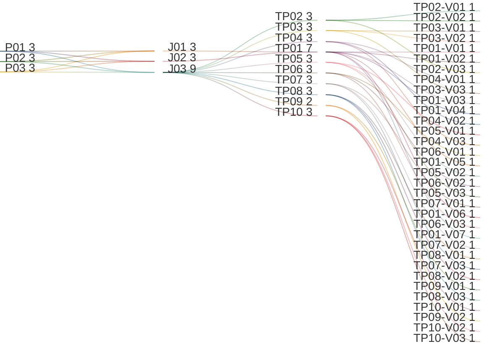

# View Tenant Fact Sheet

## Persona -> Journey -> Touchpoint -> Variant

**Status**

- High-level baseline only
- This artifact covers the tenant fact-sheet shell and tab-entry model
- Detailed tab contents are finalized in their dedicated downstream artifacts
- Detailed contents require canonical data model finalization first
- UI component mapping must be completed against the canonical data model before screen contents can be signed off
- After that sign-off, this artifact can progress to prototypes, business rules, and validation rules

**Scope**

- View the tenant fact-sheet shell
- Review banner hero and KPI chips
- Review tab visibility and badge counts
- Open tenant fact-sheet tabs
- Handle fact-sheet loading, lazy tab loading, and empty-tab entry states

**Source anchors**

- `Documentation/.Requirements/.references/R02. TENANT MANAGEMENT/Design/R02-COMPLETE-STORY-INVENTORY.md:32-66`
- `Documentation/.Requirements/.references/R02. TENANT MANAGEMENT/Design/01-PRD-Tenant-Management.md:160-182`
- `Documentation/.Requirements/.references/R02. TENANT MANAGEMENT/Design/00-FACT-SHEET-PATTERN.md:58-95`
- `Documentation/.Requirements/.references/R02. TENANT MANAGEMENT/Design/00-FACT-SHEET-PATTERN.md:171-191`
- `Documentation/.Requirements/.references/R02. TENANT MANAGEMENT/Design/R02-screen-flow-prototype.html:761-1195`
- `Documentation/requirements/ON-PREMISE-LICENSING-REQUIREMENTS.md:127-140`
- `Documentation/requirements/ON-PREMISE-LICENSING-REQUIREMENTS.md:575-590`

## Reading Guide

- `journey` = the business goal the persona is trying to complete
- `shell context` = the host container around the touchpoint
- `touchpoint` = the screen used in that journey
- `variant` = a meaningful state of that screen
- variants inherit the shell context of their touchpoint

Example:

- `TP01` = `Tenant Fact Sheet`
- `TP01` sits in `SH02 = Tenant Fact Sheet Shell`
- `TP01-V06` = the `Tenant Fact Sheet` screen when tab badges are loaded and visible
- `TP07-V01` = the `Studio Tab` screen when the tab is active in tenant context

## Personas List

| Code | Persona |
|------|---------|
| `P01` | `ADMIN (MASTER)` |
| `P02` | `ADMIN (REGULAR)` |
| `P03` | `ADMIN (DOMINANT)` |

## Journeys List

Purpose: this list defines the tenant-fact-sheet shell goals covered by this artifact.

| Code | Journey | Purpose |
|------|---------|---------|
| `J01` | View Tenant Fact Sheet | Open the tenant fact sheet and review tenant-scoped information from one place |
| `J02` | Review Banner Hero and Tab Badges | Review tenant identity, status, KPIs, and per-tab related-entity counts |
| `J03` | Open Tenant Fact Sheet Tabs | Switch to the target tenant-management tab and enter its shell-level screen state |

## Shell Contexts List

Purpose: this list defines the host shell or container in which each touchpoint lives.

| Code | Shell Context | Purpose |
|------|---------------|---------|
| `SH01` | System Shell | Top-level product shell from which the tenant fact sheet is opened |
| `SH02` | Tenant Fact Sheet Shell | Tenant-scoped shell used for the banner hero and all tab-entry screens |

## Touchpoints List

Purpose: this list defines the screens used to complete the journeys.

| Code | Touchpoint | Shell Context | Purpose |
|------|------------|---------------|---------|
| `TP01` | Tenant Fact Sheet | `SH02` | Tenant fact-sheet shell with banner hero, KPI chips, actions, and tab bar |
| `TP02` | Users Tab | `SH02` | Tenant fact-sheet users tab entry screen |
| `TP03` | Branding Tab | `SH02` | Tenant fact-sheet branding tab entry screen |
| `TP04` | Integrations Tab | `SH02` | Tenant fact-sheet integrations tab entry screen |
| `TP05` | Dictionary Tab | `SH02` | Tenant fact-sheet dictionary tab entry screen |
| `TP06` | Agents Tab | `SH02` | Tenant fact-sheet agents tab entry screen |
| `TP07` | Studio Tab | `SH02` | Tenant fact-sheet studio tab entry screen |
| `TP08` | Audit Log Tab | `SH02` | Tenant fact-sheet audit-log tab entry screen |
| `TP09` | Health Checks Tab | `SH02` | Tenant fact-sheet health-checks tab entry screen |
| `TP10` | License Tab | `SH02` | Tenant fact-sheet license tab entry screen |

## Touchpoint Variants List

Purpose: this list defines the meaningful screen states that require explicit requirements coverage.

| Code | Touchpoint | Variant | Meaning / When Used |
|------|------------|---------|---------------------|
| `TP01-V01` | `TP01` | Initial Loading | Tenant fact sheet before the selected tenant data has loaded |
| `TP01-V02` | `TP01` | Master Admin Any-Tenant View | Tenant fact sheet opened by a master admin for any tenant |
| `TP01-V03` | `TP01` | Regular Admin Own-Tenant View | Tenant fact sheet opened by a regular admin for its own tenant |
| `TP01-V04` | `TP01` | Dominant Admin Own-Tenant View | Tenant fact sheet opened by a dominant admin for its own tenant |
| `TP01-V05` | `TP01` | Banner Hero Ready | Tenant fact sheet with banner identity, status, KPIs, and actions visible |
| `TP01-V06` | `TP01` | Tab Badges Ready | Tenant fact sheet with the full tab bar and related-entity badge counts visible |
| `TP01-V07` | `TP01` | Tenant License Expired Restricted View | Tenant fact sheet is open for an expired tenant license and restricted tenant-level access rules are active |
| `TP02-V01` | `TP02` | Users Tab Active | Users tab is active and ready for users-list rendering |
| `TP02-V02` | `TP02` | Users Tab Empty State | Users tab has no related users and shows an empty-state entry view |
| `TP02-V03` | `TP02` | Users Tab Lazy Loading | Users tab is loading its content after first activation |
| `TP03-V01` | `TP03` | Branding Tab Active | Branding tab is active and ready for branding workspace rendering |
| `TP03-V02` | `TP03` | Branding Tab Empty State | Branding tab has no active branding data yet and shows an empty-state entry view |
| `TP03-V03` | `TP03` | Branding Tab Lazy Loading | Branding tab is loading its content after first activation |
| `TP04-V01` | `TP04` | Integrations Tab Active | Integrations tab is active and ready for integrations workspace rendering |
| `TP04-V02` | `TP04` | Integrations Tab Empty State | Integrations tab has no configured connectors and shows an empty-state entry view |
| `TP04-V03` | `TP04` | Integrations Tab Lazy Loading | Integrations tab is loading its content after first activation |
| `TP05-V01` | `TP05` | Dictionary Tab Active | Dictionary tab is active and ready for dictionary workspace rendering |
| `TP05-V02` | `TP05` | Dictionary Tab Empty State | Dictionary tab has no visible dictionary content yet and shows an empty-state entry view |
| `TP05-V03` | `TP05` | Dictionary Tab Lazy Loading | Dictionary tab is loading its content after first activation |
| `TP06-V01` | `TP06` | Agents Tab Active | Agents tab is active and ready for agents workspace rendering |
| `TP06-V02` | `TP06` | Agents Tab Empty State | Agents tab has no deployed agents yet and shows an empty-state entry view |
| `TP06-V03` | `TP06` | Agents Tab Lazy Loading | Agents tab is loading its content after first activation |
| `TP07-V01` | `TP07` | Studio Tab Active | Studio tab is active and ready for tenant-scoped studio or master-definitions workspace rendering |
| `TP07-V02` | `TP07` | Studio Tab Empty State | Studio tab has no visible process or definitions content yet and shows an empty-state entry view |
| `TP07-V03` | `TP07` | Studio Tab Lazy Loading | Studio tab is loading its content after first activation |
| `TP08-V01` | `TP08` | Audit Log Tab Active | Audit Log tab is active and ready for audit-log rendering |
| `TP08-V02` | `TP08` | Audit Log Tab Empty State | Audit Log tab has no matching events yet and shows an empty-state entry view |
| `TP08-V03` | `TP08` | Audit Log Tab Lazy Loading | Audit Log tab is loading its content after first activation |
| `TP09-V01` | `TP09` | Health Checks Tab Active | Health Checks tab is active and ready for health-dashboard rendering |
| `TP09-V02` | `TP09` | Health Checks Tab Lazy Loading | Health Checks tab is loading its content after first activation |
| `TP10-V01` | `TP10` | License Tab Active | License tab is active and ready for tenant-license summary and seat-allocation rendering |
| `TP10-V02` | `TP10` | No Tenant License Assigned | License tab is active but the tenant has no assigned tenant license yet |
| `TP10-V03` | `TP10` | License Tab Lazy Loading | License tab is loading its content after first activation |

## Variant Contents List

| Variant | Screen Contents |
|---------|-----------------|
| `TP01-V01` | Banner placeholders; KPI placeholders; tab-bar placeholders; tab-content loading area |
| `TP01-V02` | Banner hero; tenant identity; tenant type; status; KPI chips; action area; tab bar |
| `TP01-V03` | Banner hero; tenant identity; tenant type; status; KPI chips; own-tenant admin actions; tab bar |
| `TP01-V04` | Banner hero; tenant identity; tenant type; status; KPI chips; own-tenant admin actions; tab bar |
| `TP01-V05` | Logo or default icon; tenant name; tenant classification; lifecycle state; KPI chips; contextual action entry points |
| `TP01-V06` | Tab bar; tab labels; related-entity badge counts; active-tab indicator |
| `TP01-V07` | Banner hero; tenant identity; expired-license status; restricted-access notice; tabs that remain visible but inactive for `Users`, `Branding`, `Integrations`, and `Studio`; renewal or contact guidance |
| `TP02-V01` | Users tab selected; badge count; users-tab entry area; downstream users rendering path |
| `TP02-V02` | Users tab selected; zero-count or empty state; creation or management prompt where applicable |
| `TP02-V03` | Users tab selected; tab-content loading state; lazy-load placeholders |
| `TP03-V01` | Branding tab selected; badge count; branding-tab entry area; downstream branding rendering path |
| `TP03-V02` | Branding tab selected; empty-state entry view; setup or management prompt where applicable |
| `TP03-V03` | Branding tab selected; tab-content loading state; lazy-load placeholders |
| `TP04-V01` | Integrations tab selected; badge count; integrations-tab entry area; downstream integrations rendering path |
| `TP04-V02` | Integrations tab selected; empty-state entry view; setup or management prompt where applicable |
| `TP04-V03` | Integrations tab selected; tab-content loading state; lazy-load placeholders |
| `TP05-V01` | Dictionary tab selected; badge count; dictionary-tab entry area; downstream dictionary rendering path |
| `TP05-V02` | Dictionary tab selected; empty-state entry view; setup or management prompt where applicable |
| `TP05-V03` | Dictionary tab selected; tab-content loading state; lazy-load placeholders |
| `TP06-V01` | Agents tab selected; badge count; agents-tab entry area; downstream agents rendering path |
| `TP06-V02` | Agents tab selected; empty-state entry view; setup or deployment prompt where applicable |
| `TP06-V03` | Agents tab selected; tab-content loading state; lazy-load placeholders |
| `TP07-V01` | Studio tab selected; badge count; studio-tab entry area; tenant-scoped workspace path |
| `TP07-V02` | Studio tab selected; empty-state entry view; setup or workspace prompt where applicable |
| `TP07-V03` | Studio tab selected; tab-content loading state; lazy-load placeholders |
| `TP08-V01` | Audit Log tab selected; badge count; audit-log entry area; downstream audit-log rendering path |
| `TP08-V02` | Audit Log tab selected; empty-state entry view; no-event guidance |
| `TP08-V03` | Audit Log tab selected; tab-content loading state; lazy-load placeholders |
| `TP09-V01` | Health Checks tab selected; badge count where available; health-checks entry area; downstream dashboard rendering path |
| `TP09-V02` | Health Checks tab selected; tab-content loading state; lazy-load placeholders |
| `TP10-V01` | License tab selected; tenant license status; valid from; valid until; allocated-license table with `License Type`, `Allocated`, `Assigned`, and `Available`; rows for `Tenant`, `Admin`, `User`, and `Viewer` |
| `TP10-V02` | License tab selected; no-tenant-license notice; guidance to allocate or activate a tenant license from master license management |
| `TP10-V03` | License tab selected; tab-content loading state; lazy-load placeholders |

## Notes

- `touchpoint = screen`
- `shell context = host container around the screen`
- `variant = state/version of that screen`
- this artifact covers the tenant fact-sheet shell only; detailed tab journeys live in their dedicated downstream artifacts
- the planned tenant fact-sheet tabs are `Users`, `Branding`, `Integrations`, `Dictionary`, `Agents`, `Studio`, `Audit Log`, `Health Checks`, and `License`
- tab badges must show counts of related entities
- tabs load lazily on first activation
- empty tabs must show an empty-state entry view where the business flow requires it
- `ADMIN (MASTER)` can open any tenant's fact sheet; `ADMIN (REGULAR)` and `ADMIN (DOMINANT)` can open only their own tenant's fact sheet
- `TP01 Tenant License Expired Restricted View` belongs to the tenant fact-sheet shell, not to master license management
- the `Studio` tab currently resolves to the tenant-scoped workspace covered by `G01.03.09 Manage Tenant Master Definitions`
- the `Users`, `Branding`, `Integrations`, `Dictionary`, `Audit Log`, and `Health Checks` tabs resolve to their dedicated business-requirements artifacts
- the `License` tab shows the tenant-scoped license summary and seat availability; it is distinct from the master-level contract dashboard covered by `G01.02.02.01 Manage Master License Management`
- the `Agents` tab remains part of the shell baseline here, but detailed agents coverage is still pending
- health-check visibility in this shell baseline follows the currently sealed `G01.03.08 View Tenant Health Checks` artifact
