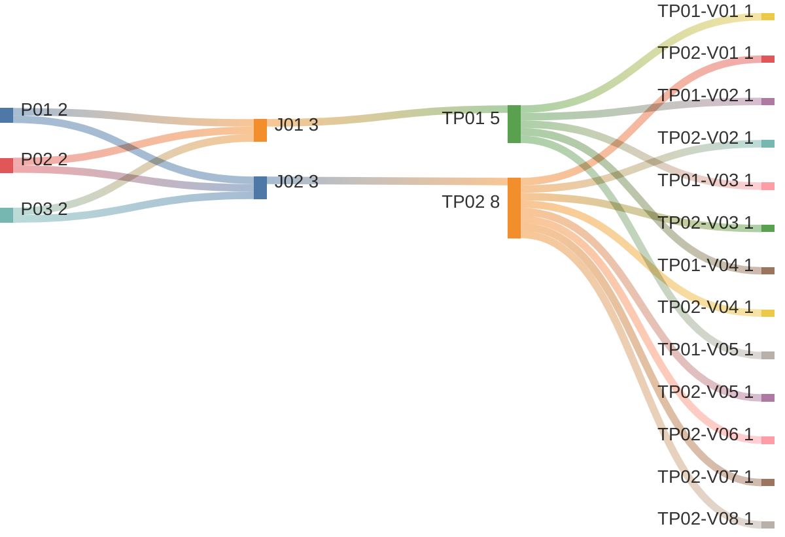

# Manage Tenant Users

## Persona -> Journey -> Touchpoint -> Variant

**Status**

- High-level baseline only
- Detailed contents are deferred to the next stage
- Detailed contents require canonical data model finalization first
- UI component mapping must be completed against the canonical data model before screen contents can be signed off
- After that sign-off, this artifact can progress to prototypes, business rules, and validation rules

**Scope**

- View users list
- View user fact sheet

**Source anchors**

- `Documentation/.Requirements/.references/R02. TENANT MANAGEMENT/Design/R02-COMPLETE-STORY-INVENTORY.md:146-161`
- `Documentation/.Requirements/.references/R02. TENANT MANAGEMENT/Design/01-PRD-Tenant-Management.md:461-476`
- `Documentation/.Requirements/.references/R02. TENANT MANAGEMENT/Design/R02-journey-maps.md:588-638`
- `frontend/src/app/features/admin/users/user-embedded.component.html:1-215`
- `frontend/src/app/features/admin/users/user-embedded.component.html:218-341`
- `Screenshot 2026-03-27 at 15.55.23.png`
- `Screenshot 2026-03-27 at 15.56.01.png`

## Reading Guide

- `journey` = the business goal the persona is trying to complete
- `shell context` = the host container around the touchpoint
- `touchpoint` = the screen used in that journey
- `variant` = a meaningful state of that screen
- variants inherit the shell context of their touchpoint

Example:

- `TP02` = `User Fact Sheet`
- `TP02` sits in `SH02 = User Fact Sheet Shell`
- `TP02-V05` = the `User Fact Sheet` screen when the sessions area fails to load and shows an error state
- `TP02-V06` = the `User Fact Sheet` screen when the `Organization` tab is active
- `TP02-V07` = the `User Fact Sheet` screen when the `Auth Providers` tab is active
- `TP02-V08` = the `User Fact Sheet` screen when the `Roles & Access` tab is active

## Personas List

| Code | Persona |
|------|---------|
| `P01` | `ADMIN (MASTER)` |
| `P02` | `ADMIN (REGULAR)` |
| `P03` | `ADMIN (DOMINANT)` |

## Journeys List

Purpose: this list defines the user-management goals covered by this artifact.

| Code | Journey | Purpose |
|------|---------|---------|
| `J01` | View Users List | Browse and find tenant users |
| `J02` | View User Fact Sheet | Review one user's overview, auth-provider source, roles and access, organization context, and sessions |

## Shell Contexts List

Purpose: this list defines the host shell or container in which each touchpoint lives.

| Code | Shell Context | Purpose |
|------|---------------|---------|
| `SH01` | Tenant Fact Sheet Shell | Tenant-scoped shell used for the users tab and embedded list |
| `SH02` | User Fact Sheet Shell | User-scoped shell used when one user is opened in detail |

## Touchpoints List

Purpose: this list defines the screens used to complete the journeys.

| Code | Touchpoint | Shell Context | Purpose |
|------|------------|---------------|---------|
| `TP01` | Users List | `SH01` | Main tenant-users screen for browsing and filtering users |
| `TP02` | User Fact Sheet | `SH02` | Detail screen for one selected user, including overview banner and auth-provider provenance |

## Touchpoint Variants List

Purpose: this list defines the meaningful screen states that require explicit requirements coverage.

| Code | Touchpoint | Variant | Meaning / When Used |
|------|------------|---------|---------------------|
| `TP01-V01` | `TP01` | Initial Loading | Users list screen before the first user page is loaded |
| `TP01-V02` | `TP01` | List View | Users list screen with results loaded in list or table presentation |
| `TP01-V03` | `TP01` | Empty State | Users list screen when the tenant has no users yet |
| `TP01-V04` | `TP01` | No Results | Users list screen when filters/search return no matches |
| `TP01-V05` | `TP01` | Card View | Users list screen with results loaded in card or tile presentation |
| `TP02-V01` | `TP02` | Initial Loading | User fact sheet before the selected user's data is loaded |
| `TP02-V02` | `TP02` | Overview Tab | User fact sheet overview tab with banner, profile, and auth-provider provenance |
| `TP02-V03` | `TP02` | Sessions Loading | User fact sheet while session records are still loading |
| `TP02-V04` | `TP02` | Sessions Empty State | User fact sheet when session lookup succeeds but no sessions exist |
| `TP02-V05` | `TP02` | Sessions Error State | User fact sheet when session lookup fails and an error banner is shown |
| `TP02-V06` | `TP02` | Organization Tab | User fact sheet organization tab showing organization context and relationships |
| `TP02-V07` | `TP02` | Auth Providers Tab | User fact sheet auth-providers tab showing provider source and linked providers |
| `TP02-V08` | `TP02` | Roles & Access Tab | User fact sheet roles-and-access tab showing licensed type, groups, and effective access scope |

## Variant Contents List

| Variant | Screen Contents |
|---------|-----------------|
| `TP01-V01` | Users header; search input; role filter; status filter; refresh action; table loading state; paginator placeholder |
| `TP01-V02` | Users header; search and filters; sort control; result count; user list or table; name; email; role; status; last active; row actions; paginator |
| `TP01-V03` | Users header; empty users message; invite user call to action |
| `TP01-V04` | Users header; active search and filters; zero-result count; no results message; clear-filter path |
| `TP01-V05` | Users header; search and filters; sort control; result count; user cards or tiles; user identity summary; role and status summary; row actions; paginator |
| `TP02-V01` | User fact sheet loading state; profile placeholders; role placeholders; sessions placeholders |
| `TP02-V02` | Overview banner; user display name; primary profile information imported from auth provider; auth-provider source tag; summary identity information; sessions summary; last login; user actions |
| `TP02-V03` | Sessions panel loading state; session table placeholders; revoke action disabled while loading |
| `TP02-V04` | Sessions panel; no sessions found message; close path; no active-session actions |
| `TP02-V05` | Sessions error banner; retry or refresh path; session actions blocked until load succeeds |
| `TP02-V06` | Organization tab; organization card or hierarchy view; reporting line; team or peer relationships; related organization context |
| `TP02-V07` | Auth providers tab; primary auth-provider source tag; linked auth providers list; provider status; provider-specific identity references or metadata |
| `TP02-V08` | Roles and access tab; user licensed type (`Admin`, `User`, or `Viewer`); assigned system roles; assigned groups; allow list; block list; effective access summary; group-scoped access visibility |

## Notes

- `touchpoint = screen`
- `shell context = host container around the screen`
- `variant = state/version of that screen`
- list screens in the product inherit the same baseline pattern: search, filter, sort, result count, pagination, list/card presentation where supported, empty state, and no-results state
- `TP01 Users List` is grounded in the documented `J12 Manage Users` journey
- `TP01 Users List` includes both `List View` and `Card View` as requirement-level presentation variants
- `TP02 User Fact Sheet` uses the current embedded users screen pattern as the baseline for profile, roles, and sessions detail
- the user fact sheet overview banner must show the user's profile information imported from the auth provider
- the user fact sheet must identify the auth provider from which the user's data came
- if the user is linked to multiple auth providers, the fact sheet must list those auth providers
- the user fact sheet includes high-level tabs for `Overview`, `Organization`, `Auth Providers`, and `Roles & Access`
- the `Roles & Access` tab is the place to show licensed user type, assigned groups, allow list, block list, and effective access summary
- identity-provider configuration belongs to `G01.03.04 Manage Tenant Integrations` under the `Authentication` integration type, not this users artifact
- loading, empty, and error variants are included to avoid requirement gaps
- current screen contents are high-level only and are not final sign-off content
- detailed screen contents must be linked back to the canonical data model before downstream prototype and rule work starts
