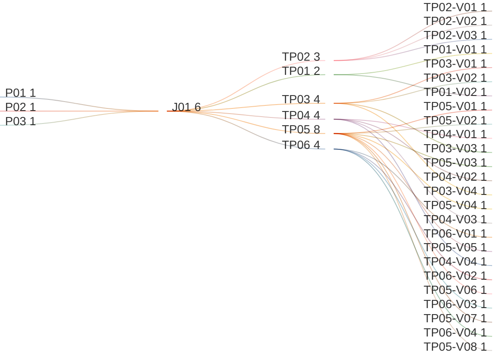

# Manage Tenant Branding

## Persona -> Journey -> Touchpoint -> Variant

**Status**

- High-level baseline only
- Detailed contents are deferred to the next stage
- Detailed contents require canonical data model finalization first
- UI component mapping must be completed against the canonical data model before screen contents can be signed off
- After that sign-off, this artifact can progress to prototypes, business rules, and validation rules

**Scope**

- Typography
- Color System
- Logos & Imagery
- Iconography
- Login Screen
- Publish

**Source anchors**

- `Documentation/.Requirements/.references/R02. TENANT MANAGEMENT/Design/R02-COMPLETE-STORY-INVENTORY.md:89-104`
- `Documentation/.Requirements/.references/R02. TENANT MANAGEMENT/Design/01-PRD-Tenant-Management.md:423-440`
- `Documentation/.Requirements/.references/R02. TENANT MANAGEMENT/Design/R02-journey-maps.md:487-540`
- `Documentation/.Requirements/G01 Business Requirements/G01.03 Tenant Fact Sheet/G01.03.03 Manage Tenant Branding/02-Cross-Worktree-Alignment-Note.md:1-42`

## Reading Guide

- `journey` = the business goal the persona is trying to complete
- `shell context` = the host container around the touchpoint
- `touchpoint` = the screen used in that journey
- `variant` = a meaningful state of that screen
- variants inherit the shell context of their touchpoint

Example:

- `TP03` = `Logos & Imagery`
- `TP03` sits in `SH02 = Brand Studio Shell`
- `TP03-V02` = the `Logos & Imagery` screen when the add or replace asset dialog is open
- `TP06-V02` = the `Publish` screen when draft and active branding are being reviewed before publish

## Personas List

| Code | Persona |
|------|---------|
| `P01` | `ADMIN (MASTER)` |
| `P02` | `ADMIN (REGULAR)` |
| `P03` | `ADMIN (DOMINANT)` |

## Journeys List

Purpose: this list defines the branding-management goals covered by this artifact.

| Code | Journey | Purpose |
|------|---------|---------|
| `J01` | Manage Tenant Branding | Open the approved branding screens from the tenant fact sheet and work on tenant branding in draft form, then validate and publish the new brand |

## Shell Contexts List

Purpose: this list defines the host shell or container in which each touchpoint lives.

| Code | Shell Context | Purpose |
|------|---------------|---------|
| `SH01` | Tenant Fact Sheet Shell | Tenant-scoped shell that provides the branding entry point |
| `SH02` | Brand Studio Shell | Downstream branding shell where the approved branding screens live |

## Touchpoints List

Purpose: this list defines the approved screens used in the branding flow.

| Code | Touchpoint | Shell Context | Purpose |
|------|------------|---------------|---------|
| `TP01` | Typography | `SH02` | Select and preview governed typography choices |
| `TP02` | Color System | `SH02` | Select and review governed palette packs and semantic color tokens |
| `TP03` | Logos & Imagery | `SH02` | Manage tenant logos and related imagery assets |
| `TP04` | Iconography | `SH02` | Manage the icon library used by object definitions |
| `TP05` | Login Screen | `SH02` | Configure and preview login-specific branding treatment |
| `TP06` | Publish | `SH02` | Validate the draft, review changes against active branding, publish, and review rollback/history |

## Touchpoint Variants List

Purpose: this list defines the meaningful screen states that require explicit requirements coverage.

| Code | Touchpoint | Variant | Meaning / When Used |
|------|------------|---------|---------------------|
| `TP01-V01` | `TP01` | Typography Matrix | Typography table is visible with item, font, and font-color selectors |
| `TP01-V02` | `TP01` | Typography Empty State | No typography roles are available in the table |
| `TP02-V01` | `TP02` | Palette Catalog | Palette packs are listed for review and selection |
| `TP02-V02` | `TP02` | Palette Pack Selected | One palette pack is selected as the active working choice |
| `TP02-V03` | `TP02` | Palette Detail Expanded | A palette panel is expanded to show core, system, and status colors |
| `TP03-V01` | `TP03` | Logo Panels | Light-logo and dark-logo panels are visible with preview and reset/update actions |
| `TP03-V02` | `TP03` | Add or Replace Asset Dialog | Asset upload dialog is open for a logo asset |
| `TP03-V03` | `TP03` | Asset Validation Error State | Asset submission fails file-type or file-size validation |
| `TP03-V04` | `TP03` | Reset to Default State | A logo asset is reset to the system default |
| `TP04-V01` | `TP04` | Icon Library List | One or more icon libraries are listed and can be selected |
| `TP04-V02` | `TP04` | Iconography Empty State | No tenant icon library is uploaded; platform-seeded library remains active |
| `TP04-V03` | `TP04` | Add Library Dialog | Icon-library upload dialog is open |
| `TP04-V04` | `TP04` | Icon Library Validation Error State | Library upload or import fails validation and the user must correct the package |
| `TP05-V01` | `TP05` | Background Pattern Mode | Login Screen editor is using pattern background mode |
| `TP05-V02` | `TP05` | Background Photo Mode | Login Screen editor is using photo background mode |
| `TP05-V03` | `TP05` | Background None Mode | Login Screen editor is using no background imagery |
| `TP05-V04` | `TP05` | Login Background Dialog | Background-photo upload dialog is open |
| `TP05-V05` | `TP05` | Login Background Validation Error State | Background-photo submission fails file-type or file-size validation |
| `TP05-V06` | `TP05` | Login Background Reset to Default State | Login background is reset to the default pattern/baseline |
| `TP05-V07` | `TP05` | Light Logo Variant | Login Screen preview uses the light logo treatment |
| `TP05-V08` | `TP05` | Dark Logo Variant | Login Screen preview uses the dark logo treatment |
| `TP06-V01` | `TP06` | Validation Summary | Publish flow shows the validation result for the current draft |
| `TP06-V02` | `TP06` | Draft vs Active Review | Publish flow compares the draft to the active branding before publish |
| `TP06-V03` | `TP06` | Publish Ready | Draft is valid and ready to be published |
| `TP06-V04` | `TP06` | Rollback / History Review | Publish flow exposes rollback/history review for prior published branding states |

## Variant Contents List

| Variant | Screen Contents |
|---------|-----------------|
| `TP01-V01` | Typography table; item column; font selector; font-color selector |
| `TP01-V02` | Typography empty-state message |
| `TP02-V01` | Palette pack list; summary swatches; summary token chips |
| `TP02-V02` | Selected-pack checkbox state; selected panel styling; active palette choice visible |
| `TP02-V03` | Expanded palette detail; core colors; system-role colors; status colors; copyable token chips |
| `TP03-V01` | `Logo in Light` panel; `Logo in Dark` panel; preview image; update action; reset action |
| `TP03-V02` | Asset dialog title; upload action; drag-and-drop area; accepted-file guidance; submit action |
| `TP03-V03` | Validation error for unsupported file type or file too large; retry path |
| `TP03-V04` | Logo panels restored to system-default asset state |
| `TP04-V01` | Add Library action; selectable icon-library panels; icon picker preview |
| `TP04-V02` | Empty-state message stating no tenant icon library is uploaded yet |
| `TP04-V03` | Library name field; upload package control; drag-and-drop area; submit action |
| `TP04-V04` | Validation error for unsupported library package or invalid upload/import |
| `TP05-V01` | Background color control; pattern-mode selector; pattern grid; login preview |
| `TP05-V02` | Photo-mode selector; upload photo action; reset photo action; login preview |
| `TP05-V03` | No-background mode; plain branded background treatment; login preview |
| `TP05-V04` | Background-photo dialog; upload action; drag-and-drop area; accepted-file guidance; submit action |
| `TP05-V05` | Validation error for unsupported login-background file type or file too large |
| `TP05-V06` | Login background restored to the default pattern/baseline |
| `TP05-V07` | Login preview showing the light logo asset |
| `TP05-V08` | Login preview showing the dark logo asset |
| `TP06-V01` | Validation summary for the current draft |
| `TP06-V02` | Draft-to-active comparison summary before publish |
| `TP06-V03` | Publish action enabled and ready state |
| `TP06-V04` | History and rollback review area for published branding revisions |

## Notes

- `touchpoint = screen`
- `shell context = host container around the screen`
- `variant = state/version of that screen`
- the approved branding touchpoints are `Typography`, `Color System`, `Logos & Imagery`, `Iconography`, `Login Screen`, and `Publish`
- touchpoints come from the approved requirement model, not only from the currently implemented preview page
- the current preview implementation covers the first five touchpoints; `Publish` remains a required touchpoint and an implementation gap until surfaced in the UI
- this artifact is aligned to the validated cross-worktree verdict
- cross-worktree alignment details are localized in `02-Cross-Worktree-Alignment-Note.md` so this baseline does not depend on external worktree documentation paths
- branding enters from the tenant fact sheet, but the real Brand Studio editor is downstream-owned by the branding stream
- `ADMIN (MASTER)` can manage branding for any tenant
- `ADMIN (REGULAR)` and `ADMIN (DOMINANT)` can manage branding for their own tenant only
- current screen contents are high-level only and are not final sign-off content
- detailed screen contents must be linked back to the canonical data model before downstream prototype and rule work starts
