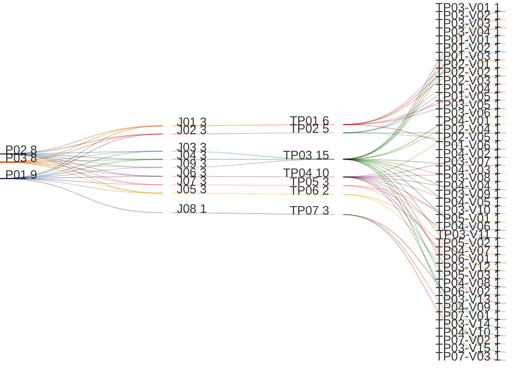

# Manage Tenant Integrations

## Persona -> Journey -> Touchpoint -> Variant

**Status**

- High-level baseline only
- This artifact uses `connector` as the canonical business term
- Detailed contents are deferred to the next stage
- Detailed contents require canonical integration data model and service-contract finalization first
- UI component mapping must be completed against the canonical data model before screen contents can be signed off
- After that sign-off, this artifact can progress to prototypes, business rules, and validation rules

**Scope**

- View connectors list
- View connector fact sheet
- Create new connector
- Update existing connector
- Delete connector
- Publish connector
- Test connector
- Govern MCP and agent-to-agent integration scenarios
- Select integration type before protocol- or family-specific configuration begins
- This artifact covers integration by type:
  - `Authentication`
  - `Communication`
  - `Third Party`

**Source anchors**

- `Documentation/.Requirements/.references/R02. TENANT MANAGEMENT/Design/R02-COMPLETE-STORY-INVENTORY.md:127-140`
- `Documentation/.Requirements/.references/R02. TENANT MANAGEMENT/Design/01-PRD-Tenant-Management.md:442-457`
- `Documentation/.Requirements/.references/R02. TENANT MANAGEMENT/Design/R02-journey-maps.md:540-584`
- `R08. Integration Hub/conversation.codexmd:49-64`
- `R08. Integration Hub/conversation.codexmd:104-120`
- `R08. Integration Hub/conversation.codexmd:126-252`
- `R08. Integration Hub/conversation.codexmd:256-321`
- `R08. Integration Hub/conversation.codexmd:352-363`
- `R08. Integration Hub/03-Integration-Hub-Phase0-Phase1-Implementation-Plan.md:360-405`
- `Documentation/issues/open/ISSUE-002-tenant-auth-providers-access-denied.md:132-165`

## Reading Guide

- `journey` = the business goal the persona is trying to complete
- `shell context` = the host container around the touchpoint
- `touchpoint` = the screen used in that journey
- `variant` = a meaningful state of that screen
- variants inherit the shell context of their touchpoint

Example:

- `TP02` = `Connector Fact Sheet`
- `TP02` sits in `SH03 = Connector Fact Sheet Shell`
- `TP02-V02` = the `Connector Fact Sheet` screen when the `Playground` tab is active
- `TP05-V03` = the `Publish Connector` screen when publish is blocked and the connector cannot move to active use yet
- `TP07-V01` = the governance screen when MCP-related channel governance is being reviewed

## Personas List

| Code | Persona |
|------|---------|
| `P01` | `ADMIN (MASTER)` |
| `P02` | `ADMIN (REGULAR)` |
| `P03` | `ADMIN (DOMINANT)` |

## Journeys List

Purpose: this list defines the integration-management goals covered by this artifact.

| Code | Journey | Purpose |
|------|---------|---------|
| `J01` | View Connectors List | Browse existing connectors and find the connector to review or change |
| `J02` | View Connector Fact Sheet | Open one connector and review its overview, test surface, run history, health, and governance context |
| `J03` | Create New Connector | Define a new connector and save it in a usable draft/configured state |
| `J04` | Update Existing Connector | Edit connector configuration, auth details, and connector metadata |
| `J05` | Delete Connector | Delete, archive, or otherwise remove a connector from active use through an explicit destructive flow |
| `J06` | Test Connector | Safely test connectivity, authentication, schema reachability, or safe read behavior before activation |
| `J07` | Publish Connector | Validate and publish the connector into active use so downstream integration behavior can rely on it |
| `J08` | Govern MCP and Agent-to-Agent Channels | Review and govern advanced integration scenarios that use MCP or agent-to-agent channels |
| `J09` | Select Integration Type | Select whether the new integration belongs to `Authentication`, `Communication`, or `Third Party` before family-specific configuration begins |

## Shell Contexts List

Purpose: this list defines the host shell or container in which each touchpoint lives.

| Code | Shell Context | Purpose |
|------|---------------|---------|
| `SH01` | Tenant Fact Sheet Shell | Tenant-scoped shell that provides the integrations entry point |
| `SH02` | Integration Hub Shell | Main connector-management shell for inventory and governance surfaces |
| `SH03` | Connector Fact Sheet Shell | Connector-scoped shell used when one connector is opened |
| `SH05` | Create Connector Shell | Type-selection and family-specific configuration shell used during create and update |
| `SH04` | Dialog Shell | Confirmation shell for destructive connector actions |

## Touchpoints List

Purpose: this list defines the screens used in the integration-management flow.

| Code | Touchpoint | Shell Context | Purpose |
|------|------------|---------------|---------|
| `TP01` | Connectors List | `SH02` | Main inventory screen for browsing, filtering, and opening connectors |
| `TP02` | Connector Fact Sheet | `SH03` | Detail screen for one selected connector |
| `TP03` | Connector Form | `SH05` | Create and update screen for integration type selection and family-specific connector configuration |
| `TP04` | Test Connector | `SH03` | Connector test screen for connectivity, auth, schema, and safe read checks |
| `TP05` | Publish Connector | `SH03` | Publish screen for validating and activating a connector |
| `TP06` | Delete Connector Confirmation | `SH04` | Destructive-action screen for delete, archive, or equivalent removal flow |
| `TP07` | Connector Governance & Channels | `SH02` | Governance screen for MCP, agent-to-agent, or other approval-led connector/channel scenarios |

## Touchpoint Variants List

Purpose: this list defines the meaningful screen states that require explicit requirements coverage.

| Code | Touchpoint | Variant | Meaning / When Used |
|------|------------|---------|---------------------|
| `TP01-V01` | `TP01` | Initial Loading | Connectors list is loading for the first time |
| `TP01-V02` | `TP01` | List View | One or more connectors are loaded and visible in list or table presentation |
| `TP01-V03` | `TP01` | Empty State | No connectors exist yet |
| `TP01-V04` | `TP01` | No Results | Filters or search return no matching connectors |
| `TP01-V05` | `TP01` | Card View | One or more connectors are loaded and visible in card or tile presentation |
| `TP01-V06` | `TP01` | Access Denied | Connector list request fails with authorization denial and must not be misreported as an empty integrations inventory |
| `TP02-V01` | `TP02` | Overview Tab | Connector fact sheet overview is active |
| `TP02-V02` | `TP02` | Playground Tab | Connector fact sheet is open on the connector-testing surface |
| `TP02-V03` | `TP02` | Run History Tab | Connector fact sheet is open on run history |
| `TP02-V04` | `TP02` | Health Timeline Tab | Connector fact sheet is open on health and degradation history |
| `TP02-V05` | `TP02` | Governance Tab | Connector fact sheet is open on governance, approvals, or channel-related context |
| `TP03-V01` | `TP03` | Create Connector | Connector form is being used to create a new connector |
| `TP03-V02` | `TP03` | Update Connector | Connector form is being used to update an existing connector |
| `TP03-V03` | `TP03` | Integration Type Selector | Create flow is selecting `Authentication`, `Communication`, or `Third Party` as the connector type |
| `TP03-V04` | `TP03` | Authentication Connector Type | Create or update flow is working within authentication integrations |
| `TP03-V05` | `TP03` | Communication Connector Type | Create or update flow is working within communication integrations |
| `TP03-V06` | `TP03` | Third-Party Connector Type | Create or update flow is working within third-party integrations |
| `TP03-V07` | `TP03` | LDAP/AD Authentication Form | Form is showing LDAP/AD-specific fields such as host, port, bind mode, base DN, and search settings |
| `TP03-V08` | `TP03` | OIDC Authentication Form | Form is showing OIDC-specific fields such as issuer, discovery URL, client ID, client secret, scopes, and claim mapping |
| `TP03-V09` | `TP03` | SAML Authentication Form | Form is showing SAML-specific fields such as entity ID, metadata source, certificate, binding, and attribute mapping |
| `TP03-V10` | `TP03` | OAuth2 Authentication Form | Form is showing OAuth2-specific fields such as authorize URL, token URL, client credentials, scopes, and callback settings |
| `TP03-V11` | `TP03` | SMTP Communication Form | Form is showing SMTP-specific fields such as host, port, TLS mode, sender identity, and credential settings |
| `TP03-V12` | `TP03` | Push Communication Form | Form is showing push-specific provider, token, channel, and delivery settings |
| `TP03-V13` | `TP03` | Third-Party Connector Form | Form is showing third-party endpoint, auth mode, direction, and payload contract settings |
| `TP03-V14` | `TP03` | Validation Error State | Configuration input is invalid and save is blocked |
| `TP03-V15` | `TP03` | Read-Only Archived State | Connector exists but is archived or otherwise not editable in the standard way |
| `TP04-V01` | `TP04` | LDAP/AD Test | Test screen is running LDAP-specific connectivity, bind, and search validation |
| `TP04-V02` | `TP04` | OIDC Test | Test screen is running OIDC-specific discovery, JWKS, client, and redirect validation |
| `TP04-V03` | `TP04` | SAML Test | Test screen is running SAML-specific metadata, certificate, and endpoint validation |
| `TP04-V04` | `TP04` | OAuth2 Test | Test screen is running OAuth2-specific endpoint, scope, and client validation |
| `TP04-V05` | `TP04` | SMTP Test | Test screen is running SMTP-specific connectivity and authentication checks |
| `TP04-V06` | `TP04` | Push Test | Test screen is running push-specific provider, token, and delivery validation |
| `TP04-V07` | `TP04` | Third-Party Test | Test screen is running third-party connectivity, authentication, schema, and safe-read checks |
| `TP04-V08` | `TP04` | Test Success | Connector test succeeds and returns usable result detail |
| `TP04-V09` | `TP04` | Test Failure | Connector test fails because of timeout, invalid credentials, unreachable endpoint, or similar error |
| `TP04-V10` | `TP04` | Unsupported or Empty Result | Schema discovery or safe-read test returns no usable result |
| `TP05-V01` | `TP05` | Publish Review | Connector is being reviewed before publish/activation |
| `TP05-V02` | `TP05` | Publish Ready | Connector is valid and can be published into active use |
| `TP05-V03` | `TP05` | Publish Blocked | Connector cannot be published because validation, policy, or test prerequisites are not satisfied |
| `TP06-V01` | `TP06` | Delete Confirmation | User is explicitly confirming delete, archive, or equivalent removal action |
| `TP06-V02` | `TP06` | Delete Blocked | Connector cannot be removed because policy, status, or dependency rules block the action |
| `TP07-V01` | `TP07` | MCP Governance | Governance screen is focused on MCP-related connector or channel behavior |
| `TP07-V02` | `TP07` | Agent-to-Agent Governance | Governance screen is focused on internal or external agent-to-agent integration scenarios |
| `TP07-V03` | `TP07` | Pending Approval Queue | Approval-led connector or channel actions are waiting for review and decision |

## Variant Contents List

| Variant | Screen Contents |
|---------|-----------------|
| `TP01-V01` | Loading state; search placeholder; filter placeholders; connector-list placeholders |
| `TP01-V02` | Search; status filter; connector-type filter; sort control; result count; connector list or table; open-detail path; pagination |
| `TP01-V03` | Empty-state message; create-connector path |
| `TP01-V04` | Active filters; zero-result count; no-results message; clear-filter path |
| `TP01-V05` | Search; status filter; connector-type filter; sort control; result count; connector cards or tiles; open-detail path; pagination |
| `TP01-V06` | Authorization-denied message; support or retry guidance; no empty-state card; no false `No connectors configured` signal |
| `TP02-V01` | Connector summary; connector status; protocol/provider summary; key metadata; action area |
| `TP02-V02` | Playground entry; test controls; latest test result summary; link to detailed testing |
| `TP02-V03` | Run history summary; recent runs; status chips; link to run detail |
| `TP02-V04` | Health summary; warning or degradation indicators; timeline entry points |
| `TP02-V05` | Governance summary; approval state; channel or policy indicators |
| `TP03-V01` | Connector family selection; template selection; save action |
| `TP03-V02` | Existing connector summary; editable configuration fields; update action |
| `TP03-V03` | Integration type choices for `Authentication`, `Communication`, and `Third Party`; type-selection action |
| `TP03-V04` | Authentication integration group; family selection; template selection; sign-in impact summary |
| `TP03-V05` | Communication integration group; family selection; delivery-impact summary |
| `TP03-V06` | Third-party integration group; family selection; endpoint/policy summary |
| `TP03-V07` | LDAP host; port; TLS mode; bind DN; bind secret reference; base DN; user search filter; save action |
| `TP03-V08` | OIDC issuer or discovery URL; client ID; client secret reference; scopes; claim mapping; callback settings |
| `TP03-V09` | SAML entity ID; metadata URL or XML source; SSO URL; signing certificate; binding mode; attribute mapping |
| `TP03-V10` | OAuth2 authorize URL; token URL; client ID; client secret reference; scopes; callback settings |
| `TP03-V11` | SMTP host; port; sender identity; TLS mode; credential mode; save action |
| `TP03-V12` | Push provider key; channel or topic; token or secret reference; delivery settings |
| `TP03-V13` | Third-party endpoint/base URL; auth mode; direction; payload or schema mapping; save action |
| `TP03-V14` | Inline field errors; invalid or missing configuration feedback; blocked save |
| `TP03-V15` | Archived/read-only banner; visible configuration; mutating controls disabled |
| `TP04-V01` | LDAP test controls for connectivity, bind, and search validation |
| `TP04-V02` | OIDC test controls for discovery, JWKS, and redirect validation |
| `TP04-V03` | SAML test controls for metadata, certificate, and endpoint validation |
| `TP04-V04` | OAuth2 test controls for endpoint, scope, and callback validation |
| `TP04-V05` | SMTP test controls for connectivity and mail-auth validation |
| `TP04-V06` | Push test controls for provider token and delivery validation |
| `TP04-V07` | Third-party test controls for connectivity, auth, schema, and safe-read validation |
| `TP04-V08` | Success indicator; latency; safe response detail; next-step path |
| `TP04-V09` | Failure reason; retry path; no false success signal |
| `TP04-V10` | Unsupported or empty result state; safe metadata summary; follow-up path |
| `TP05-V01` | Publish review summary; prerequisite checks; action path |
| `TP05-V02` | Publish action enabled; connector ready for activation |
| `TP05-V03` | Validation or policy failure; blocked publish; corrective guidance |
| `TP06-V01` | Confirmation title; destructive impact text; confirm action; cancel path |
| `TP06-V02` | Blocked-action message; dependency or policy explanation; no delete path |
| `TP07-V01` | MCP governance summary; channel/policy review area; decision path |
| `TP07-V02` | Agent-to-agent governance summary; boundary/policy review area; decision path |
| `TP07-V03` | Approval queue; request summary; approve/reject/return actions |

## Notes

- `touchpoint = screen`
- `shell context = host container around the screen`
- `variant = state/version of that screen`
- this artifact uses `connector` as the canonical term
- this artifact manages integrations by type:
  - `Authentication`
  - `Communication`
  - `Third Party`
- protocol- or family-specific connector variants are explicit here because `LDAP`, `OIDC`, `SAML`, `OAUTH2`, `SMTP`, `Push`, and third-party connectors have materially different configuration and test behavior
- list screens in the product inherit the same baseline pattern: search, filter, sort, result count, pagination, list/card presentation where supported, empty state, and no-results state
- `TP01 Connectors List` includes both `List View` and `Card View` as requirement-level presentation variants
- `TP01 Access Denied` is separate from `Empty State` and `No Results`; `403` must not collapse into `No identity providers configured`
- `Playground`, `Run History`, and `Health Timeline` are treated as connector-fact-sheet screens or tabs in the context of a selected connector
- the older R02 `Integrations` tab is treated as the entry point into connector management
- `Publish Connector` is a requirement-level step even if current technical docs describe activation with different lifecycle wording
- `MCP` and `agent-to-agent` scenarios are included as advanced governance coverage and must not be dropped
- `ADMIN (MASTER)` can manage integrations for any tenant
- `ADMIN (REGULAR)` and `ADMIN (DOMINANT)` can manage integrations for their own tenant only
- advanced MCP and agent-to-agent governance is primarily a master-context or elevated-governance path in this baseline
- loading, empty, warning, failure, and blocked-action variants are included to avoid requirement gaps
- current screen contents are high-level only and are not final sign-off content
- detailed screen contents must be linked back to the canonical integration data model and service contracts before downstream prototype and rule work starts
