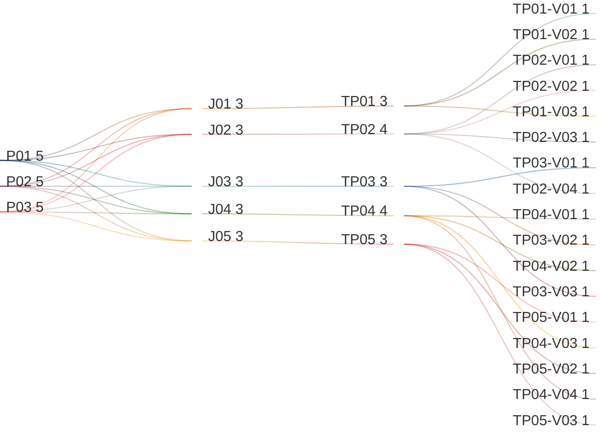

# Manage Tenant Dictionary and Messages

## Persona -> Journey -> Touchpoint -> Variant

**Status**

- High-level baseline only
- This artifact uses the localization dictionary interpretation, not the object-definition dictionary interpretation
- Detailed contents are deferred to the next stage
- Detailed contents require canonical localization data model and service-contract finalization first
- UI component mapping must be completed against the canonical data model before screen contents can be signed off
- After that sign-off, this artifact can progress to prototypes, business rules, and validation rules

**Scope**

- View languages list
- View dictionary list
- View dictionary entry detail
- View messages list
- View message translation detail

**Source anchors**

- `Documentation/.Requirements/.references/R06. Localization/README.md:13-16`
- `Documentation/.Requirements/.references/R06. Localization/Design/01-PRD.md:46-49`
- `Documentation/.Requirements/.references/R06. Localization/Design/01-PRD.md:66-76`
- `Documentation/.Requirements/.references/R06. Localization/Design/01-PRD.md:141-153`
- `Documentation/.Requirements/.references/R06. Localization/Design/05-UI-UX-Design-Spec.md:138-144`
- `Documentation/.Requirements/.references/R06. Localization/Design/05-UI-UX-Design-Spec.md:1000-1049`
- `Documentation/.Requirements/.references/R06. Localization/prototype/index.html:96-220`

## Reading Guide

- `journey` = the business goal the persona is trying to complete
- `shell context` = the host container around the touchpoint
- `touchpoint` = the screen used in that journey
- `variant` = a meaningful state of that screen
- variants inherit the shell context of their touchpoint

Example:

- `TP01` = `Languages List`
- `TP01` sits in `SH01 = Tenant Fact Sheet Shell`
- `TP02-V03` = the `Dictionary List` screen when search or filters return no matching dictionary entries
- `TP03-V02` = the `Dictionary Entry Detail Dialog` screen when the selected technical name is loaded and active-language values are visible
- `TP04-V02` = the `Messages List` screen when message codes and English defaults are loaded and visible
- `TP05-V02` = the `Message Translation Detail Dialog` screen when the selected message code and active-language values are visible

## Personas List

| Code | Persona |
|------|---------|
| `P01` | `ADMIN (MASTER)` |
| `P02` | `ADMIN (REGULAR)` |
| `P03` | `ADMIN (DOMINANT)` |

## Journeys List

Purpose: this list defines the tenant dictionary and message-translation goals covered by this artifact.

| Code | Journey | Purpose |
|------|---------|---------|
| `J01` | View Languages List | Review the active languages that the tenant can use in the system language switcher |
| `J02` | View Dictionary List | Review localization keys and default English values available to the tenant |
| `J03` | View Dictionary Entry Detail | Open one technical-name entry and inspect the default value plus values for all active languages |
| `J04` | View Messages List | Review message codes, classifications, and default English message texts available to the tenant |
| `J05` | View Message Translation Detail | Open one message code and inspect the default English message text plus values for all active languages |

## Shell Contexts List

Purpose: this list defines the host shell or container in which each touchpoint lives.

| Code | Shell Context | Purpose |
|------|---------------|---------|
| `SH01` | Tenant Fact Sheet Shell | Tenant-scoped shell that provides the dictionary entry point |
| `SH02` | Dialog Shell | Modal shell used for dictionary-entry detail view |

## Touchpoints List

Purpose: this list defines the screens used in the dictionary and message-translation flow.

| Code | Touchpoint | Shell Context | Purpose |
|------|------------|---------------|---------|
| `TP01` | Languages List | `SH01` | Screen for reviewing which languages are active for the tenant |
| `TP02` | Dictionary List | `SH01` | Screen for reviewing dictionary technical names and their default English values |
| `TP03` | Dictionary Entry Detail Dialog | `SH02` | Detail dialog for one selected technical name and its active-language values |
| `TP04` | Messages List | `SH01` | Screen for reviewing message codes, classifications, and default English message texts |
| `TP05` | Message Translation Detail Dialog | `SH02` | Detail dialog for one selected message code and its active-language values |

## Touchpoint Variants List

Purpose: this list defines the meaningful screen states that require explicit requirements coverage.

| Code | Touchpoint | Variant | Meaning / When Used |
|------|------------|---------|---------------------|
| `TP01-V01` | `TP01` | Initial Loading | Languages list is loading for the first time |
| `TP01-V02` | `TP01` | Languages List | One or more active languages are loaded and visible |
| `TP01-V03` | `TP01` | Empty State | No active tenant languages are configured yet |
| `TP02-V01` | `TP02` | Initial Loading | Dictionary list is loading for the first time |
| `TP02-V02` | `TP02` | Dictionary List | Dictionary entries are loaded and visible |
| `TP02-V03` | `TP02` | No Results | Search or filters return no matching dictionary entries |
| `TP02-V04` | `TP02` | Empty State | No dictionary entries are available to display |
| `TP03-V01` | `TP03` | Detail Loading | Dictionary entry detail dialog is open but the selected entry values are still loading |
| `TP03-V02` | `TP03` | Detail View | Technical name, default English value, and values for active languages are visible |
| `TP03-V03` | `TP03` | Partial Translation State | One or more active languages have no value yet for the selected technical name |
| `TP04-V01` | `TP04` | Initial Loading | Messages list is loading for the first time |
| `TP04-V02` | `TP04` | Messages List | Messages are loaded and visible |
| `TP04-V03` | `TP04` | No Results | Search or filters return no matching message codes |
| `TP04-V04` | `TP04` | Empty State | No messages are available to display |
| `TP05-V01` | `TP05` | Detail Loading | Message translation detail dialog is open but the selected message values are still loading |
| `TP05-V02` | `TP05` | Detail View | Message code, default English title/detail, and values for active languages are visible |
| `TP05-V03` | `TP05` | Partial Translation State | One or more active languages have no value yet for the selected message code |

## Variant Contents List

| Variant | Screen Contents |
|---------|-----------------|
| `TP01-V01` | Loading state; table placeholders; language rows waiting for data |
| `TP01-V02` | Language name; locale code; direction; active-state visibility; tenant-active language list |
| `TP01-V03` | Empty-state message; no active languages available |
| `TP02-V01` | Loading state; search placeholder; dictionary-row placeholders |
| `TP02-V02` | Technical name; default language value (`en`); view action |
| `TP02-V03` | Active search or filter state; no-results message; clear-filter path |
| `TP02-V04` | Empty-state message; no dictionary entries available |
| `TP03-V01` | Dialog shell; loading indicator; entry values waiting for data |
| `TP03-V02` | Technical name; default English value; list of active languages; value for each active language |
| `TP03-V03` | Technical name; default English value; active-language list with one or more missing translation values clearly visible |
| `TP04-V01` | Loading state; search placeholder; message-row placeholders |
| `TP04-V02` | Message code; message type; category; default English title/detail summary; view action |
| `TP04-V03` | Active search or filter state; no-results message; clear-filter path |
| `TP04-V04` | Empty-state message; no messages available |
| `TP05-V01` | Dialog shell; loading indicator; message values waiting for data |
| `TP05-V02` | Message code; message type; category; default English title; default English detail; list of active languages; localized title/detail for each active language |
| `TP05-V03` | Message code; default English title/detail; active-language list with one or more missing translation values clearly visible |

## Notes

- `touchpoint = screen`
- `shell context = host container around the screen`
- `variant = state/version of the screen`
- this artifact uses the localization-dictionary meaning of `dictionary`
- this artifact also covers tenant-visible message translation management
- `Languages List` defines which languages are active for the tenant and therefore available to the language switcher in the system shell
- `Dictionary List` is a tenant-facing view of localization entries, centered on `technical name` and default English value
- `Messages List` is a tenant-facing view of message objects, centered on `message code`, classification, and default English text
- the `View` action opens the dictionary-entry detail dialog
- the `View` action also opens the message-translation detail dialog for messages
- the detail dialog must show:
  - technical name
  - default English value
  - values for all active languages
- the message detail dialog must show:
  - message code
  - message type and category
  - default English title and detail
  - values for all active languages
- `ADMIN (MASTER)` can view dictionary information for any tenant
- `ADMIN (REGULAR)` and `ADMIN (DOMINANT)` can view dictionary information for their own tenant only
- loading, empty, no-results, and partial-translation variants are included to avoid requirement gaps
- current screen contents are high-level only and are not final sign-off content
- detailed screen contents must be linked back to the canonical localization data model and service contracts before downstream prototype and rule work starts
