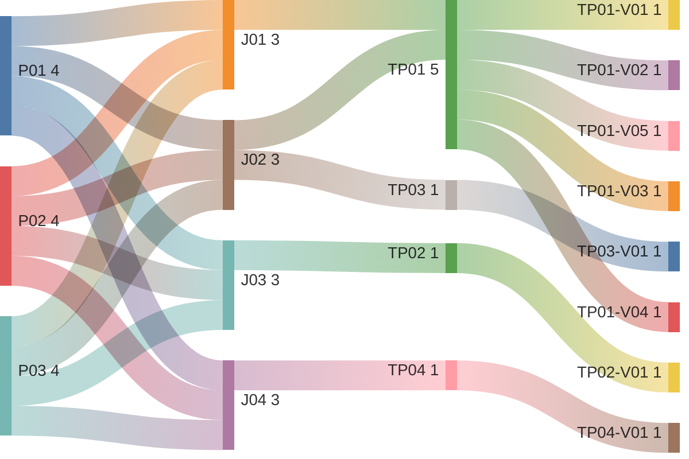

# View Tenant Audit Log

## Persona -> Journey -> Touchpoint -> Variant

**Status**

- High-level baseline only
- Detailed contents are deferred to the next stage
- Detailed contents require canonical data model finalization first
- UI component mapping must be completed against the canonical data model before screen contents can be signed off
- After that sign-off, this artifact can progress to prototypes, business rules, and validation rules

**Scope**

- View chronological audit event list
- Filter audit log by action type, actor, date range, and target entity
- View full audit event detail and payload diff
- Export audit log as CSV

**Source anchors**

- `Documentation/.Requirements/.references/R02. TENANT MANAGEMENT/Design/R02-COMPLETE-STORY-INVENTORY.md:52-63`
- `Documentation/.Requirements/.references/R02. TENANT MANAGEMENT/Design/R02-COMPLETE-STORY-INVENTORY.md:222-238`
- `Documentation/.Requirements/.references/R02. TENANT MANAGEMENT/Design/01-PRD-Tenant-Management.md:1048-1063`
- `Documentation/.Requirements/.references/R02. TENANT MANAGEMENT/Design/R02-screen-flow-prototype.html:1119-1170`
- `Documentation/.Requirements/.references/R02. TENANT MANAGEMENT/Design/00-FACT-SHEET-PATTERN.md:90-99`

## Reading Guide

- `journey` = the business goal the persona is trying to complete
- `shell context` = the host container around the touchpoint
- `touchpoint` = the screen used in that journey
- `variant` = a meaningful state of that screen
- variants inherit the shell context of their touchpoint

Example:

- `TP01` = `Audit Log`
- `TP01` sits in `SH01 = Tenant Fact Sheet Shell`
- `TP01-V03` = the `Audit Log` screen when filters are applied and the list is showing a filtered result set
- `TP02-V01` = the `Audit Event Detail Dialog` screen when one selected event is opened and the full payload diff is shown

## Personas List

| Code | Persona |
|------|---------|
| `P01` | `ADMIN (MASTER)` |
| `P02` | `ADMIN (REGULAR)` |
| `P03` | `ADMIN (DOMINANT)` |

## Journeys List

Purpose: this list defines the audit-log goals covered by this artifact.

| Code | Journey | Purpose |
|------|---------|---------|
| `J01` | View Audit Log | Review tenant administrative activity in chronological order |
| `J02` | Filter Audit Log | Narrow the audit list to relevant actions, actors, dates, and targets |
| `J03` | View Audit Event Detail | Inspect one event in full, including before and after state |
| `J04` | Export Audit Log | Export the audit log as CSV for downstream review |

## Shell Contexts List

Purpose: this list defines the host shell or container in which each touchpoint lives.

| Code | Shell Context | Purpose |
|------|---------------|---------|
| `SH01` | Tenant Fact Sheet Shell | Tenant-scoped shell used for the audit log tab |
| `SH02` | Dialog Shell | Modal shell used for event detail, filter, and export flows |

## Touchpoints List

Purpose: this list defines the screens used to complete the journeys.

| Code | Touchpoint | Shell Context | Purpose |
|------|------------|---------------|---------|
| `TP01` | Audit Log | `SH01` | Main audit-log tab showing the tenant audit event stream |
| `TP02` | Audit Event Detail Dialog | `SH02` | Detail screen for one selected audit event, including full payload diff |
| `TP03` | Audit Filters Dialog | `SH02` | Filter screen for narrowing the audit event list |
| `TP04` | Export Audit Log Dialog | `SH02` | Export screen for confirming CSV export of the audit log |

## Touchpoint Variants List

Purpose: this list defines the meaningful screen states that require explicit requirements coverage.

| Code | Touchpoint | Variant | Meaning / When Used |
|------|------------|---------|---------------------|
| `TP01-V01` | `TP01` | Initial Loading | Audit tab after activation and before the first audit page is loaded |
| `TP01-V02` | `TP01` | Audit Event List | Audit tab with events loaded in reverse chronological order |
| `TP01-V03` | `TP01` | Filtered Audit Event List | Audit tab after filters are applied and matching events are shown |
| `TP01-V04` | `TP01` | No Results | Audit tab when current filters return no matching events |
| `TP01-V05` | `TP01` | Load Error | Audit tab when audit events fail to load and a retry path is required |
| `TP02-V01` | `TP02` | Event Detail Diff View | Audit event detail dialog with actor, action, target, timestamp, and before/after payload diff |
| `TP03-V01` | `TP03` | Filter Form | Audit filter dialog with action type, actor, date range, and target entity filters |
| `TP04-V01` | `TP04` | Export CSV Confirmation | Export dialog for confirming CSV export of the current audit selection |

## Variant Contents List

| Variant | Screen Contents |
|---------|-----------------|
| `TP01-V01` | Audit tab header; export action; filter action; audit table loading state; lazy-load placeholders |
| `TP01-V02` | Audit tab header; export action; filter action; audit table; timestamp; actor; action; target; newest-first ordering |
| `TP01-V03` | Audit tab header; active filter summary; clear-filter path; filtered audit table; timestamp; actor; action; target |
| `TP01-V04` | Audit tab header; active filter summary; no matching events message; clear-filter path |
| `TP01-V05` | Audit tab header; load-failure message; retry path; audit table unavailable state |
| `TP02-V01` | Event detail header; actor identity and role; action; target entity; timestamp; before state; after state; full payload diff |
| `TP03-V01` | Filter dialog title; action-type filter; actor filter; date-range filter; target-entity filter; apply action; cancel action |
| `TP04-V01` | Export dialog title; CSV export summary; current filter scope summary; confirm export action; cancel action |

## Notes

- `touchpoint = screen`
- `shell context = host container around the screen`
- `variant = state/version of that screen`
- `TP01 Audit Log` sits inside the tenant fact sheet as one of the planned tenant tabs
- all three admin personas can view the audit log, but `ADMIN (MASTER)` can access any tenant while `ADMIN (REGULAR)` and `ADMIN (DOMINANT)` are limited to their own tenant
- the audit log must cover lifecycle transitions, CRUD operations, role changes, and configuration changes
- audit events are append-only; this artifact covers viewing and exporting, not editing
- the event-detail screen must expose the full payload diff for the selected event
- loading, no-results, and load-error variants are included to avoid requirement gaps on the audit tab
- current screen contents are high-level only and are not final sign-off content
- detailed screen contents must be linked back to the canonical audit-event data model before downstream prototype and rule work starts
