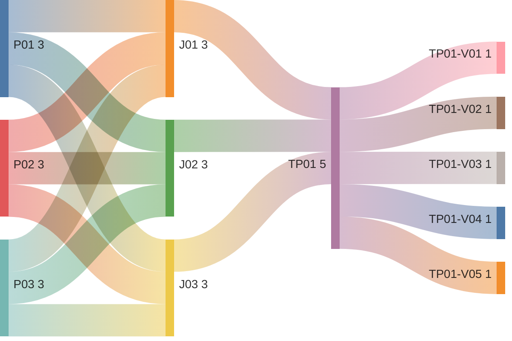

# View Tenant Health Checks

## Persona -> Journey -> Touchpoint -> Variant

**Status**

- High-level baseline only
- Detailed contents are deferred to the next stage
- Detailed contents require canonical health-check data model finalization first
- UI component mapping must be completed against the canonical data model before screen contents can be signed off
- After that sign-off, this artifact can progress to prototypes, business rules, and validation rules

**Scope**

- View tenant health dashboard
- Review healthy, degraded, and failed service states
- Review 24-hour health history
- Observe auto-refresh behavior for current health state

**Source anchors**

- `Documentation/.Requirements/.references/R02. TENANT MANAGEMENT/Design/R02-COMPLETE-STORY-INVENTORY.md:241-255`
- `Documentation/.Requirements/.references/R02. TENANT MANAGEMENT/Design/01-PRD-Tenant-Management.md:136`
- `Documentation/.Requirements/.references/R02. TENANT MANAGEMENT/Design/01-PRD-Tenant-Management.md:480-494`
- `Documentation/.Requirements/.references/R02. TENANT MANAGEMENT/Design/R02-journey-maps.md:642-706`
- `Documentation/.Requirements/.references/R02. TENANT MANAGEMENT/Design/R02-screen-flow-prototype.html:1175-1207`
- `Documentation/.Requirements/.references/R02. TENANT MANAGEMENT/Design/R02-MESSAGE-CODE-REGISTRY.md:40-44`
- `Documentation/.Requirements/.references/R02. TENANT MANAGEMENT/Design/R02-MESSAGE-CODE-REGISTRY.md:65`

## Reading Guide

- `journey` = the business goal the persona is trying to complete
- `shell context` = the host container around the touchpoint
- `touchpoint` = the screen used in that journey
- `variant` = a meaningful state of that screen
- variants inherit the shell context of their touchpoint

Example:

- `TP01` = `Health Checks Dashboard`
- `TP01` sits in `SH01 = Tenant Fact Sheet Shell`
- `TP01-V03` = the `Health Checks Dashboard` screen when one or more checks are degraded
- `TP01-V05` = the `Health Checks Dashboard` screen when the 24-hour health history is being reviewed

## Personas List

| Code | Persona |
|------|---------|
| `P01` | `ADMIN (MASTER)` |
| `P02` | `ADMIN (REGULAR)` |
| `P03` | `ADMIN (DOMINANT)` |

## Journeys List

Purpose: this list defines the health-check goals covered by this artifact.

| Code | Journey | Purpose |
|------|---------|---------|
| `J01` | View Health Dashboard | Review current infrastructure health for the selected tenant |
| `J02` | Review Degraded or Failed Checks | Inspect warning and failure conditions across tenant infrastructure services |
| `J03` | Review Health History | Review the most recent 24 hours of tenant health behavior |

## Shell Contexts List

Purpose: this list defines the host shell or container in which each touchpoint lives.

| Code | Shell Context | Purpose |
|------|---------------|---------|
| `SH01` | Tenant Fact Sheet Shell | Tenant-scoped shell used for the health-checks tab |

## Touchpoints List

Purpose: this list defines the screens used to complete the journeys.

| Code | Touchpoint | Shell Context | Purpose |
|------|------------|---------------|---------|
| `TP01` | Health Checks Dashboard | `SH01` | Main health-checks screen for current service health, warnings, failures, and recent history |

## Touchpoint Variants List

Purpose: this list defines the meaningful screen states that require explicit requirements coverage.

| Code | Touchpoint | Variant | Meaning / When Used |
|------|------------|---------|---------------------|
| `TP01-V01` | `TP01` | Initial Loading | Health dashboard after tab activation and before the first health response is loaded |
| `TP01-V02` | `TP01` | Healthy Dashboard | All required health checks are reachable and reporting healthy state |
| `TP01-V03` | `TP01` | Degraded Dashboard | One or more health checks are degraded and warning indicators are shown |
| `TP01-V04` | `TP01` | Partial Failure State | One or more health checks fail or are unreachable while other checks still render |
| `TP01-V05` | `TP01` | 24-Hour History View | Dashboard state when the recent health-history view for the last 24 hours is being reviewed |

## Variant Contents List

| Variant | Screen Contents |
|---------|-----------------|
| `TP01-V01` | Health tab header; last-checked placeholder; service-card placeholders; dashboard waiting for first response |
| `TP01-V02` | Header `Infrastructure Health`; last-checked timestamp; PostgreSQL card; Neo4j card; Keycloak card; application services card; healthy indicators; service metrics; auto-refresh behavior |
| `TP01-V03` | Header `Infrastructure Health`; last-checked timestamp; one or more degraded service cards; warning indicator `TEN-W-006`; service metrics; other healthy cards remain visible |
| `TP01-V04` | Header `Infrastructure Health`; last-checked timestamp; failed or unreachable-check state; error indicator `TEN-E-015`; failed-check detail; other service cards continue to render where available |
| `TP01-V05` | Current-health summary; recent-history area for last 24 hours; per-service historical trend or timeline; current warning or failure context retained |

## Notes

- `touchpoint = screen`
- `shell context = host container around the screen`
- `variant = state/version of that screen`
- this artifact is visible to all admin personas in tenant context
- the required health scope includes PostgreSQL connectivity, Neo4j connectivity, Keycloak health, and application-service health
- the dashboard must auto-refresh every 30 seconds while visible
- degraded states use `TEN-W-006`
- unreachable or failed health-check states use `TEN-E-015`
- current prototype shows the health dashboard as a card grid; a separate list/table presentation is not captured as a canonical requirement at this stage
- the 24-hour history requirement is canonical even if the current prototype does not yet fully visualize it
- current screen contents are high-level only and are not final sign-off content
- detailed screen contents must be linked back to the canonical health-check data model before downstream prototype and rule work starts
