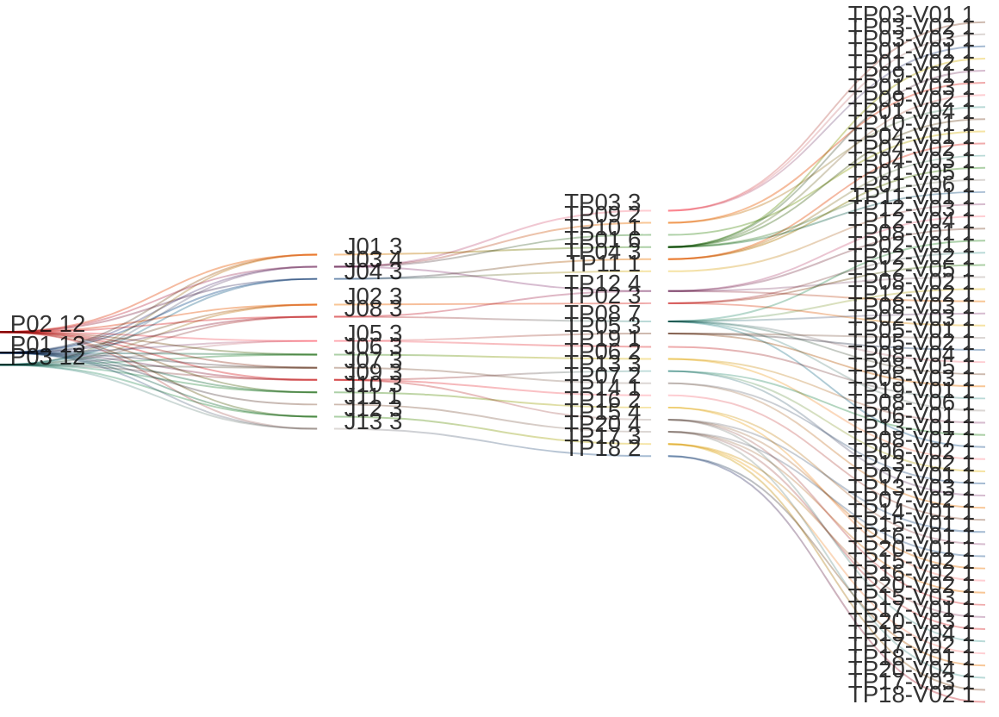

# Manage Tenant Master Definitions

## Persona -> Journey -> Touchpoint -> Variant

**Status**

- High-level baseline only
- Detailed contents are deferred to the next stage
- Detailed contents require canonical data model finalization first
- UI component mapping must be completed against the canonical data model before screen contents can be signed off
- After that sign-off, this artifact can progress to prototypes, business rules, and validation rules

**Scope**

- View tenant master definitions list
- View and update tenant definition detail screens
- Create tenant definitions
- Manage definition attributes and connections
- Review governance, maturity, and locale screens
- Review releases, impact analysis, and release actions
- Review release notifications
- Cover the tenant-scoped Studio workspace for definitions and process or workflow assets
- Cover master-only propagation flow where applicable

**Source anchors**

- `Documentation/.Requirements/.references/R04. MASTER DESFINITIONS/Design/01-PRD-Definition-Management.md:124-134`
- `Documentation/.Requirements/.references/R04. MASTER DESFINITIONS/Design/01-PRD-Definition-Management.md:217-227`
- `Documentation/.Requirements/.references/R04. MASTER DESFINITIONS/Design/12-SRS-Definition-Management.md:157-214`
- `Documentation/.Requirements/.references/R04. MASTER DESFINITIONS/Design/02-Technical-Specification.md:713-742`
- `Documentation/.Requirements/.references/R04. MASTER DESFINITIONS/Design/05-UI-UX-Design-Spec.md:620-700`
- `Documentation/.Requirements/.references/R04. MASTER DESFINITIONS/Design/09-Detailed-User-Journeys.md:900-980`
- `Documentation/.Requirements/.references/R04. MASTER DESFINITIONS/Design/09-Detailed-User-Journeys.md:2691-2721`
- `Documentation/.Requirements/.references/R04. MASTER DESFINITIONS/Design/R04-COMPLETE-STORY-INVENTORY.md:37-115`
- `Documentation/.Requirements/.references/R04. MASTER DESFINITIONS/Design/R04-COMPLETE-STORY-INVENTORY.md:306-345`
- `Documentation/.Requirements/.references/R02. TENANT MANAGEMENT/Design/01-PRD-Tenant-Management.md:179-180`
- `Documentation/.Requirements/.references/R02. TENANT MANAGEMENT/Design/R02-COMPLETE-STORY-INVENTORY.md:203-218`
- `frontend/src/app/features/administration/sections/master-definitions/master-definitions-section.component.html`
- `frontend/src/app/features/administration/sections/master-definitions/master-definitions-section.component.ts`
- `frontend/src/app/core/api/api-gateway.service.ts:394-541`

## Reading Guide

- `journey` = the business goal the persona is trying to complete
- `shell context` = the host container around the touchpoint
- `touchpoint` = the screen used in that journey
- `variant` = a meaningful state of that screen
- variants inherit the shell context of their touchpoint

Example:

- `TP03` = `Definition Attributes`
- `TP03` sits in `SH03 = Definition Fact Sheet Shell`
- `TP03-V03` = the `Definition Attributes` screen when inherited or mandated attributes are visible as locked or protected
- `TP08-V04` = the `Create Definition Wizard` screen when the `Governance` step is active in the target requirement model

## Personas List

| Code | Persona |
|------|---------|
| `P01` | `ADMIN (MASTER)` |
| `P02` | `ADMIN (REGULAR)` |
| `P03` | `ADMIN (DOMINANT)` |

## Journeys List

Purpose: this list defines the tenant master-definitions goals covered by this artifact.

| Code | Journey | Purpose |
|------|---------|---------|
| `J01` | View Definitions List | Browse definitions available to the tenant |
| `J02` | View Definition General | Review one definition's identity, state, and metadata |
| `J03` | Manage Definition Attributes | Review, add, create, remove, retire, or reactivate definition attributes |
| `J04` | Manage Definition Connections | Review, add, or remove definition connections |
| `J05` | Manage Definition Governance | Review governance settings, mandate indicators, and workflow controls |
| `J06` | Manage Definition Maturity | Review and configure maturity scoring for the definition |
| `J07` | Manage Definition Locale | Review localized values and language-dependent behavior for the definition |
| `J08` | Create Tenant Definition | Create a tenant-specific definition using the multi-step wizard |
| `J09` | Process Definition Release | Review releases, inspect impact, and take release actions |
| `J10` | Review Release Notifications | Review release alerts from the notification entry point |
| `J11` | Propagate Definitions to Child Tenant | Distribute canonical definitions to child tenants in master context |
| `J12` | Manage Locale Settings | Manage the tenant's active locale list |
| `J13` | Review Maturity Dashboard | Review maturity scoring across tenant definitions |

## Shell Contexts List

Purpose: this list defines the host shell or container in which each touchpoint lives.

| Code | Shell Context | Purpose |
|------|---------------|---------|
| `SH01` | Tenant Fact Sheet Shell | Tenant-scoped shell used as the entry point to master definitions |
| `SH02` | Master Definitions Shell | Definitions-management shell used for list and dashboard screens |
| `SH03` | Definition Fact Sheet Shell | Definition-scoped shell used for one selected definition |
| `SH04` | Dialog Shell | Modal shell used for wizard, add, confirm, and impact flows |
| `SH05` | Notification Shell | Header or dropdown shell used for release notifications |

## Touchpoints List

Purpose: this list defines the screens used to complete the journeys.

| Code | Touchpoint | Shell Context | Purpose |
|------|------------|---------------|---------|
| `TP01` | Definitions List | `SH02` | Main definitions screen for browsing tenant definitions |
| `TP02` | Definition General | `SH03` | Definition fact-sheet general screen with core metadata |
| `TP03` | Definition Attributes | `SH03` | Definition fact-sheet attributes screen |
| `TP04` | Definition Connections | `SH03` | Definition fact-sheet connections screen |
| `TP05` | Definition Governance | `SH03` | Definition fact-sheet governance screen |
| `TP06` | Definition Maturity | `SH03` | Definition fact-sheet maturity screen |
| `TP07` | Definition Locale | `SH03` | Definition fact-sheet locale screen |
| `TP08` | Create Definition Wizard | `SH04` | Multi-step wizard for creating a new definition |
| `TP09` | Add Attribute Dialog | `SH04` | Dialog for adding an existing attribute to the selected definition |
| `TP10` | Create Attribute Type Dialog | `SH04` | Dialog for creating a new reusable attribute type |
| `TP11` | Add Connection Dialog | `SH04` | Dialog for adding a connection to the selected definition |
| `TP12` | Definition Action Confirmation Dialog | `SH04` | Confirmation screen for destructive or impactful definition actions |
| `TP13` | Release Management Dashboard | `SH02` | Dashboard for release list, timeline, and tenant adoption state |
| `TP14` | Impact Analysis Dialog | `SH04` | Dialog for assessing release impact and conflicts |
| `TP15` | Release Action Dialog | `SH04` | Dialog for publish, accept, reject, or defer release actions |
| `TP16` | Notification Dropdown | `SH05` | Notification entry point for release alerts |
| `TP17` | Locale Management | `SH02` | Settings screen for the active locale list |
| `TP18` | Maturity Dashboard | `SH02` | Dashboard for per-definition maturity scores and breakdowns |
| `TP19` | Governance Workflow Settings Dialog | `SH04` | Dialog for configuring governance workflows and permissions |
| `TP20` | Propagation Wizard | `SH04` | Master-only flow for propagating definitions to child tenants |

## Touchpoint Variants List

Purpose: this list defines the meaningful screen states that require explicit requirements coverage.

| Code | Touchpoint | Variant | Meaning / When Used |
|------|------------|---------|---------------------|
| `TP01-V01` | `TP01` | Initial Loading | Definitions list before the first page is loaded |
| `TP01-V02` | `TP01` | List View | Definitions shown in table or list mode |
| `TP01-V03` | `TP01` | Card View | Definitions shown in card mode |
| `TP01-V04` | `TP01` | Empty State | Definitions list when no definitions exist yet |
| `TP01-V05` | `TP01` | No Results | Definitions list when search or filters return no matches |
| `TP01-V06` | `TP01` | Cross-Tenant / Inherited View | Master or inherited-focused list state with tenant and inheritance indicators |
| `TP02-V01` | `TP02` | General View | Definition general screen in read mode |
| `TP02-V02` | `TP02` | Edit Mode | Definition general screen in edit mode |
| `TP02-V03` | `TP02` | Inherited / Locked View | Definition general screen when inherited or mandated status limits editing |
| `TP03-V01` | `TP03` | Attributes List | Attributes screen with linked attributes loaded |
| `TP03-V02` | `TP03` | Empty State | Attributes screen with no linked attributes |
| `TP03-V03` | `TP03` | Mandated / Locked Attributes | Attributes screen showing readonly or protected inherited attributes |
| `TP04-V01` | `TP04` | Connections List | Connections screen with linked connections loaded |
| `TP04-V02` | `TP04` | Empty State | Connections screen with no linked connections |
| `TP04-V03` | `TP04` | Mandated / Locked Connections | Connections screen showing readonly or protected inherited connections |
| `TP05-V01` | `TP05` | Governance Settings View | Governance screen with current workflow and operation settings |
| `TP05-V02` | `TP05` | Empty Workflow State | Governance screen when no workflows are attached yet |
| `TP05-V03` | `TP05` | Readonly Mandated Governance | Governance screen when settings are inherited and locked |
| `TP06-V01` | `TP06` | Maturity Configuration | Definition maturity screen with axis weights and scoring configuration |
| `TP06-V02` | `TP06` | Readonly Maturity View | Definition maturity screen when the user can review but not edit |
| `TP07-V01` | `TP07` | Locale Value View | Definition locale screen with active locale values |
| `TP07-V02` | `TP07` | No Locale Configuration | Definition locale screen when locale data is not configured yet |
| `TP08-V01` | `TP08` | Basic Info Step | Create wizard step for name, key, description, icon, and status |
| `TP08-V02` | `TP08` | Attributes Step | Create wizard step for selecting attributes |
| `TP08-V03` | `TP08` | Connections Step | Create wizard step for defining relations |
| `TP08-V04` | `TP08` | Governance Step | Create wizard governance step in the target requirement model |
| `TP08-V05` | `TP08` | Review and Save Step | Create wizard review step before submission |
| `TP08-V06` | `TP08` | Empty Attribute Pick List | Create wizard attributes step when no additional attributes are available |
| `TP08-V07` | `TP08` | Save Error State | Create wizard when submission fails and the draft is preserved |
| `TP09-V01` | `TP09` | Select Existing Attribute | Add-attribute dialog with available attributes |
| `TP09-V02` | `TP09` | No Available Attributes | Add-attribute dialog when every attribute is already linked |
| `TP10-V01` | `TP10` | Attribute Type Form | Create-attribute-type dialog with the reusable attribute form |
| `TP11-V01` | `TP11` | Connection Form | Add-connection dialog with target, relationship names, cardinality, and direction |
| `TP12-V01` | `TP12` | Delete Object Type | Delete confirmation dialog |
| `TP12-V02` | `TP12` | Discard Wizard Draft | Confirmation dialog when abandoning wizard work |
| `TP12-V03` | `TP12` | Retire Attribute | Confirmation dialog for retiring an attribute |
| `TP12-V04` | `TP12` | Reactivate Attribute | Confirmation dialog for reactivating an attribute |
| `TP12-V05` | `TP12` | Bulk Retire Attributes | Confirmation dialog for retiring multiple attributes |
| `TP13-V01` | `TP13` | Release Timeline | Release dashboard with chronological release list and status |
| `TP13-V02` | `TP13` | Pending Release Review | Release dashboard when a release is waiting for tenant review |
| `TP13-V03` | `TP13` | No Releases | Release dashboard when no releases exist yet |
| `TP14-V01` | `TP14` | Impact Analysis Review | Impact-analysis dialog with conflicts and affected definitions or instances |
| `TP15-V01` | `TP15` | Publish Release | Publish-release confirmation or authoring dialog |
| `TP15-V02` | `TP15` | Accept Release | Accept-release confirmation dialog |
| `TP15-V03` | `TP15` | Reject Release | Reject-release dialog with required reason |
| `TP15-V04` | `TP15` | Defer Release | Defer-release dialog with reason input |
| `TP16-V01` | `TP16` | Unread Notifications | Notification dropdown with unread release alerts |
| `TP16-V02` | `TP16` | Empty Notifications | Notification dropdown when no release alerts exist |
| `TP17-V01` | `TP17` | Locale List | Locale-management screen with active locale grid |
| `TP17-V02` | `TP17` | No Locales Configured | Locale-management screen empty state |
| `TP17-V03` | `TP17` | RTL Preview | Locale-management screen when an RTL locale preview is active |
| `TP18-V01` | `TP18` | Maturity Overview | Maturity dashboard with overall scores and drill-down |
| `TP18-V02` | `TP18` | No Maturity Data | Maturity dashboard empty state |
| `TP19-V01` | `TP19` | Workflow Settings Form | Governance workflow-settings dialog |
| `TP20-V01` | `TP20` | Select Target Tenant | Propagation wizard target-tenant step |
| `TP20-V02` | `TP20` | Select Definitions | Propagation wizard definitions checklist step |
| `TP20-V03` | `TP20` | Mandate Settings | Propagation wizard mandate and override-policy step |
| `TP20-V04` | `TP20` | Review and Confirm | Propagation wizard review step before propagation |

## Variant Contents List

| Variant | Screen Contents |
|---------|-----------------|
| `TP01-V01` | Definitions header; search; status filter; sort placeholder; result-count placeholder; view toggle; list placeholders or skeletons; pagination placeholder |
| `TP01-V02` | Definitions header; search; status filter; sort control; result count; row list; name; type key; status; state; duplicate; restore; delete; pagination |
| `TP01-V03` | Definitions header; search; status filter; sort control; result count; card grid; name; status; attribute count; connection count; row actions; pagination |
| `TP01-V04` | Definitions header; empty-state message; create-definition path |
| `TP01-V05` | Definitions header; active search and filters; zero-result count; no-results message; clear-filter path |
| `TP01-V06` | Definitions list with tenant or inheritance indicators; inherited badges; cross-tenant or inherited filter context |
| `TP02-V01` | Definition title; type key; description; status; state; code; counts; created and updated timestamps |
| `TP02-V02` | Editable general form; name; description; icon; color; status; save and cancel actions |
| `TP02-V03` | General metadata plus inherited or mandated badges; restricted edit or delete actions |
| `TP03-V01` | Attributes header; linked attributes list; data type; required flag; add and remove paths |
| `TP03-V02` | Attributes empty-state message; add-attribute path |
| `TP03-V03` | Locked attribute indicators; inherited badges; readonly remove or retire actions where blocked |
| `TP04-V01` | Connections header; linked connection list; target type; active name; passive name; cardinality; direction; add and remove paths |
| `TP04-V02` | Connections empty-state message; add-connection path |
| `TP04-V03` | Locked connection indicators; inherited badges; readonly remove path where blocked |
| `TP05-V01` | Workflow list; direct operation settings; current governance state; mandate or override indicators |
| `TP05-V02` | Governance empty-state message; add-workflow path |
| `TP05-V03` | Governance settings in readonly mode; mandated or inherited banner; locked toggles |
| `TP06-V01` | Four-axis maturity weights; preview or score guidance; completeness, compliance, relationship, freshness controls |
| `TP06-V02` | Maturity scores or weights shown in readonly mode |
| `TP07-V01` | Active locale values; localized labels; language-dependent indicators; locale coverage |
| `TP07-V02` | No-locale message; locale-management path |
| `TP08-V01` | Name; type key; description; icon; icon color; status |
| `TP08-V02` | Attribute pick list; selected count; create-new-attribute path; maturity class or required indicators where applicable |
| `TP08-V03` | Added connections list; target type; active and passive names; cardinality; direction; add-connection path |
| `TP08-V04` | Master-mandate toggle; override policy; propagation strategy; governance guidance |
| `TP08-V05` | Review summary; basic information; attributes summary; connections summary; governance summary; create action |
| `TP08-V06` | Empty pick-list message; create-attribute-type path |
| `TP08-V07` | Error banner; preserved wizard data; retry path |
| `TP09-V01` | Attribute selector; required toggle; add action; cancel action |
| `TP09-V02` | No-available-attributes message; create-attribute-type path |
| `TP10-V01` | Attribute name; key; data type; group; description; save and cancel actions |
| `TP11-V01` | Target type selector; active name; passive name; cardinality; directed toggle; add and cancel actions |
| `TP12-V01` | Delete title; delete warning; confirm and cancel actions |
| `TP12-V02` | Discard title; unsaved-data warning; discard and continue-editing actions |
| `TP12-V03` | Retire title; retire impact message; confirm and cancel actions |
| `TP12-V04` | Reactivate title; reactivation message; confirm and cancel actions |
| `TP12-V05` | Bulk-retire title; selected-count summary; confirm and cancel actions |
| `TP13-V01` | Release header; pending count; release list; timeline; adoption tracker; release detail |
| `TP13-V02` | Pending release summary; release notes; action path to impact analysis and release decision |
| `TP13-V03` | No-releases message; empty-state guidance |
| `TP14-V01` | Before and after comparison; affected definitions or instances; conflicts list; action summary |
| `TP15-V01` | Publish title; publish impact message; publish, save-draft, and cancel actions |
| `TP15-V02` | Accept title; change summary; preserve-local-customizations guidance; accept and cancel actions |
| `TP15-V03` | Reject title; rejection reason input; reject and cancel actions |
| `TP15-V04` | Defer title; defer reason input; defer and cancel actions |
| `TP16-V01` | Notification count; unread release items; release preview; impact or view path |
| `TP16-V02` | Empty-notifications message |
| `TP17-V01` | Locale grid; active toggles; add locale path; locale display names |
| `TP17-V02` | No-locales message; add-locale path |
| `TP17-V03` | RTL preview state for active RTL locale |
| `TP18-V01` | Summary cards; per-definition maturity scores; drill-down path; flagged low-maturity items |
| `TP18-V02` | No-maturity-data message |
| `TP19-V01` | Workflow selector; behavior options; permission matrix; save and cancel actions |
| `TP20-V01` | Child-tenant selector; next action |
| `TP20-V02` | Definition checklist; selected-count summary |
| `TP20-V03` | Mandate settings; override-policy selector; propagation options |
| `TP20-V04` | Review summary; propagate and cancel actions |

## Notes

- `touchpoint = screen`
- `shell context = host container around the screen`
- `variant = state/version of that screen`
- list screens in the product inherit the same baseline pattern: search, filter, sort, result count, pagination, list/card presentation where supported, empty state, and no-results state
- this artifact covers `Master Definitions` as a tenant-fact-sheet area in R02, but its canonical downstream source is `R04. MASTER DESFINITIONS`
- this artifact is the current R02 baseline coverage for the tenant `Studio` tab and its tenant-scoped definitions workspace; no separate `View Tenant Studio` baseline is required at this stage
- the previous thin version under-captured the real requirement surface; this version includes list, detail tabs, dialogs, release handling, locale, maturity, notifications, and propagation coverage
- personas are normalized here to the R02 admin model: `ADMIN (MASTER)`, `ADMIN (REGULAR)`, and `ADMIN (DOMINANT)`
- detailed role mapping from R04 personas (`Super Admin`, `Architect`, `Tenant Admin`) to the R02 admin matrix is deferred to the next stage
- implemented screens confirmed from the current codebase include the definitions list, general detail editing, attributes screen, connections screen, create wizard, delete confirmation, add-attribute dialog, add-connection dialog, and create-attribute-type dialog
- governance, maturity, locale management, notification dropdown, release dashboard, release actions, and propagation are documented in R04 requirements and test plans but are not fully surfaced in the current implemented UI
- `TP08 Create Definition Wizard` intentionally includes the target governance step because it is present in the requirement model even though the current implementation still uses the shorter implemented wizard flow
- destructive or impactful actions are modeled as explicit dialog touchpoints because the PRD requires confirmation before execution
- current screen contents are high-level only and are not final sign-off content
- detailed screen contents must be linked back to the canonical definition data model before downstream prototype and rule work starts
