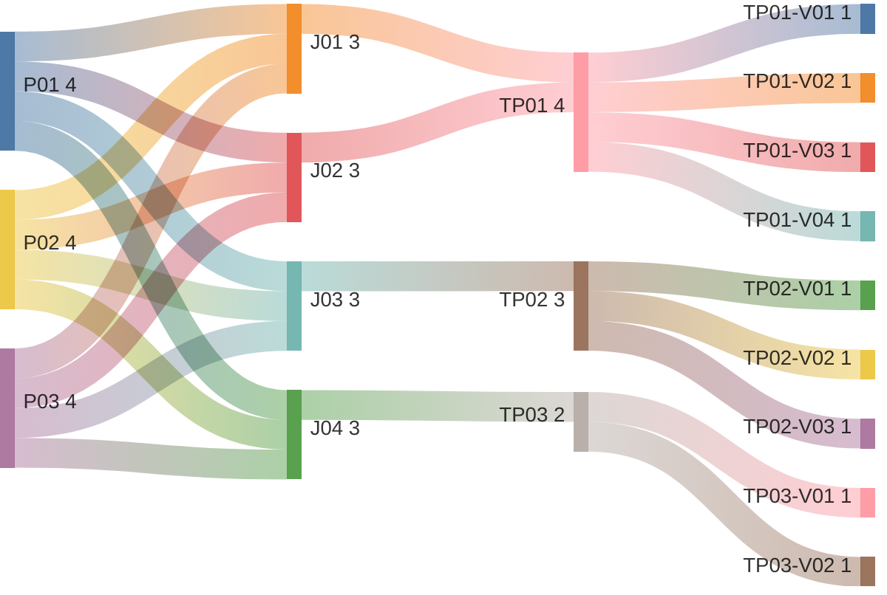

# Manage Tenant Landing Page

## Persona -> Journey -> Touchpoint -> Variant

**Status**

- High-level baseline only
- This artifact captures tenant-management control over the landing-page experience
- Existing documentation mostly defines landing-page runtime behavior; this artifact adds the management baseline explicitly
- Detailed contents are deferred to the next stage
- Detailed contents require canonical data-model and component-mapping finalization before sign-off

**Scope**

- View landing-page configuration
- Configure role-based landing behavior
- Preview landing-page variants
- Publish landing-page changes

**Source anchors**

- `Documentation/prototypes/screen-flow-playground.html:1944-1948`
- `Documentation/prototypes/index.html:1905-1927`
- `Documentation/prototypes/app.js:386-400`
- `Documentation/.Requirements/PERSONA-INTERACTION-SPECIFICATION.md:123`
- `Documentation/issues/open/ISSUE-004-admin-back-forward-login-history-loop.md:36`
- `Documentation/persona/personas/EX-PERSONAS-EXTENDED.md:650-659`
- `Documentation/persona/PERSONA-REGISTRY.md:1738-1753`

## Reading Guide

- `journey` = the business goal the persona is trying to complete
- `shell context` = the host container around the touchpoint
- `touchpoint` = the screen used in that journey
- `variant` = a meaningful state of that screen
- variants inherit the shell context of their touchpoint

Example:

- `TP01` = `Landing Page Settings`
- `TP01` sits in `SH01 = Product Shell`
- `TP01-V04` = the settings screen when role-based landing targets are being configured
- `TP02-V02` = the preview screen when the executive/viewer landing dashboard is shown
- `TP03-V02` = the publish dialog when the landing-page draft is valid and ready to publish

## Personas List

| Code | Persona |
|------|---------|
| `P01` | `ADMIN (MASTER)` |
| `P02` | `ADMIN (REGULAR)` |
| `P03` | `ADMIN (DOMINANT)` |

## Journeys List

Purpose: this list defines the landing-page management goals covered by this artifact.

| Code | Journey | Purpose |
|------|---------|---------|
| `J01` | View Landing Page Configuration | Review the current landing-page setup for the tenant |
| `J02` | Configure Role-Based Landing | Define how different user groups or roles land after successful login |
| `J03` | Preview Landing Page | Inspect the landing-page experience before publishing changes |
| `J04` | Publish Landing Page | Validate and publish the updated landing-page configuration |

## Shell Contexts List

Purpose: this list defines the host shell or container in which each touchpoint lives.

| Code | Shell Context | Purpose |
|------|---------------|---------|
| `SH01` | Product Shell | The authenticated product shell where landing-page management is accessed |

## Touchpoints List

Purpose: this list defines the screens used in the landing-page management flow.

| Code | Touchpoint | Shell Context | Purpose |
|------|------------|---------------|---------|
| `TP01` | Landing Page Settings | `SH01` | Screen for viewing and configuring landing-page behavior for the tenant |
| `TP02` | Landing Page Preview | `SH01` | Screen for previewing the landing-page experience by role or audience |
| `TP03` | Publish Landing Page Dialog | `SH01` | Dialog for validating and publishing landing-page changes |

## Touchpoint Variants List

Purpose: this list defines the meaningful screen states that require explicit requirements coverage.

| Code | Touchpoint | Variant | Meaning / When Used |
|------|------------|---------|---------------------|
| `TP01-V01` | `TP01` | Initial Loading | Landing-page configuration is loading for the first time |
| `TP01-V02` | `TP01` | Current Configuration | Existing landing-page configuration is loaded and visible |
| `TP01-V03` | `TP01` | Empty Configuration | No tenant-specific landing-page configuration exists yet |
| `TP01-V04` | `TP01` | Role-Based Landing Map | Role or audience landing targets are being reviewed or configured |
| `TP02-V01` | `TP02` | User Landing Preview | Preview of the standard user landing page with quick-entry cards |
| `TP02-V02` | `TP02` | Executive / Viewer Landing Preview | Preview of the viewer-style executive dashboard landing page |
| `TP02-V03` | `TP02` | Admin Landing Preview | Preview of the admin landing target, such as tenant management or other assigned home view |
| `TP03-V01` | `TP03` | Validation Summary | Publish dialog shows validation results for the landing-page draft |
| `TP03-V02` | `TP03` | Publish Ready | Landing-page draft is valid and ready to publish |

## Variant Contents List

| Variant | Screen Contents |
|---------|-----------------|
| `TP01-V01` | Loading state; configuration placeholders; landing settings waiting for data |
| `TP01-V02` | Current landing target; role or audience mapping; current home behavior summary; edit actions |
| `TP01-V03` | Empty-state message; create-configuration action |
| `TP01-V04` | Role or audience list; landing target selection; default-home summary; return-to-home behavior summary |
| `TP02-V01` | Welcome message; date; start chat card; recent conversations card; browse agents card |
| `TP02-V02` | KPI cards; trend charts; recent reports list; read-only executive dashboard summary |
| `TP02-V03` | Admin landing destination preview; top-level management entry; assigned home context |
| `TP03-V01` | Validation results; missing-configuration warnings if any; publish-decision summary |
| `TP03-V02` | Publish confirmation; publish action enabled; ready-to-go state |

## Notes

- `touchpoint = screen`
- `shell context = host container around the screen`
- `variant = state/version of the screen`
- this artifact adds explicit tenant-management coverage for landing-page management
- current documentation already defines runtime landing behavior, including:
  - role-based landing after login
  - user landing page
  - viewer executive landing page
  - admin landing to tenant management
- this artifact captures the management side of that behavior
- `Return to Home` and `Navigate by Breadcrumb` are different concerns:
  - home return goes to the resolved landing destination
  - breadcrumb returns to the parent context within the current navigation path
- `ADMIN (MASTER)` can manage landing-page behavior for any tenant
- `ADMIN (REGULAR)` and `ADMIN (DOMINANT)` can manage landing-page behavior for their own tenant only
- current screen contents are high-level only and are not final sign-off content
