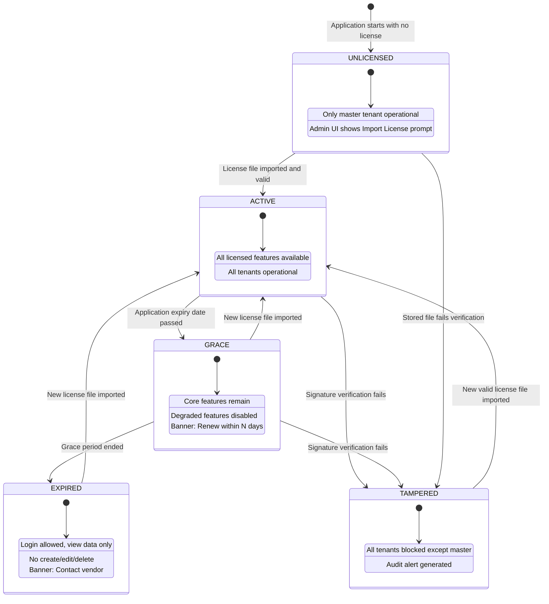

# EMS Canonical Data Model v2.0

> **Document Type:** Canonical Data Model (Technical Specification)
> **Author:** SA Agent
> **Created:** 2026-02-25
> **Updated:** 2026-02-27
> **Status:** VERIFIED
> **Input:** Business Domain Model (docs/data-models/domain-model.md) -- On-Premise Cryptographic Licensing Domain
> **Architecture Authority:** ADR-001 (Polyglot Persistence), ADR-015 (On-Premise License Architecture)
> **Next Step:** DBA Agent validates and creates Flyway migrations for license-service

> **v2.0 Change Summary:** The Licensing Domain has been fully redesigned to support on-premise
> cryptographic license validation (ADR-015), replacing the SaaS product catalog model. All
> SaaS-specific fields (monthly_price, annual_price, billing_cycle, auto_renew) are removed.
> The new model uses signed license files, hierarchical entitlements (application > tenant > user tier),
> and Ed25519 digital signature verification. See ADR-001 for polyglot persistence architecture.

---

## Overview

This document defines the technical Canonical Data Model for the EMS (Enterprise Management SaaS) platform. It transforms the Business Domain Model into precise technical specifications including:

- Exact data types for each field
- Primary keys, foreign keys, and unique constraints
- Index definitions for query performance
- Service ownership boundaries
- Storage architecture (PostgreSQL vs Neo4j)
- Cross-service reference patterns

### Architecture Context

EMS uses a **polyglot persistence** strategy:

| Database | Purpose | Services |
|----------|---------|----------|
| **Neo4j** | Graph-based RBAC, identity relationships | auth-facade |
| **PostgreSQL** | Relational domain data | All other services |
| **Valkey** | Caching (provider configs, roles, sessions) | auth-facade, license-service |

**Cache Implementation Notes:**
- **Current Implementation:** Valkey 8 (`valkey/valkey:8-alpine` in docker-compose.yml)
- **Framework Namespace:** Spring still uses `spring.data.redis` property names for Valkey connections
- **Decision Reference:** Standardized in ADR-005

---

## Storage Architecture

### Entity-to-Service Mapping

| Entity | Database | Service | Table/Label | Justification |
|--------|----------|---------|-------------|---------------|
| Tenant | PostgreSQL | tenant-service | `tenants` | Master tenant data with relational integrity |
| TenantDomain | PostgreSQL | tenant-service | `tenant_domains` | Domain verification workflow |
| TenantBranding | PostgreSQL | tenant-service | `tenant_branding` | Configuration data, 1:1 with tenant |
| TenantSessionConfig | PostgreSQL | tenant-service | `tenant_session_config` | Session policy configuration |
| TenantMFAConfig | PostgreSQL | tenant-service | `tenant_mfa_config` | MFA policy configuration |
| TenantAuthProvider | PostgreSQL | tenant-service | `tenant_auth_providers` | Provider display/metadata |
| TenantNode | Neo4j | auth-facade | `:Tenant` | Identity graph root |
| UserNode | Neo4j | auth-facade | `:User` | Role traversal via graph |
| GroupNode | Neo4j | auth-facade | `:Group` | Group hierarchy via graph |
| RoleNode | Neo4j | auth-facade | `:Role` | Role inheritance via graph |
| ProviderNode | Neo4j | auth-facade | `:Provider` | Provider relationships |
| ProtocolNode | Neo4j | auth-facade | `:Protocol` | Protocol support mapping |
| ConfigNode | Neo4j | auth-facade | `:Config` | Tenant-provider configuration |
| UserProfile | PostgreSQL | user-service | `user_profiles` | Extended user data |
| UserDevice | PostgreSQL | user-service | `user_devices` | Device trust management |
| UserSession | PostgreSQL | user-service | `user_sessions` | Session tracking |
| LicenseFile | PostgreSQL | license-service | `license_files` | Imported signed `.lic` files (ADR-015) |
| ApplicationLicense | PostgreSQL | license-service | `application_licenses` | Platform-wide entitlements extracted from license file |
| TenantLicense | PostgreSQL | license-service | `tenant_licenses` | Per-tenant entitlements from license file |
| TierSeatAllocation | PostgreSQL | license-service | `tier_seat_allocations` | Per-tier seat limits within tenant license |
| UserLicenseAssignment | PostgreSQL | license-service | `user_license_assignments` | User-to-tier seat assignments (runtime managed) |
| RevocationEntry | PostgreSQL | license-service | `revocation_entries` | Revoked license identifiers from `.revoke` file |
| AuditEvent | PostgreSQL | audit-service | `audit_events` | Immutable audit log |
| Notification | PostgreSQL | notification-service | `notifications` | Notification queue |
| NotificationTemplate | PostgreSQL | notification-service | `notification_templates` | Message templates |
| NotificationPreference | PostgreSQL | notification-service | `notification_preferences` | User preferences |
| Agent | PostgreSQL | ai-service | `agents` | AI assistant configuration |
| AgentCategory | PostgreSQL | ai-service | `agent_categories` | Agent classification |
| Conversation | PostgreSQL | ai-service | `conversations` | Chat sessions |
| Message | PostgreSQL | ai-service | `messages` | Chat messages |
| KnowledgeSource | PostgreSQL | ai-service | `knowledge_sources` | RAG source documents |
| KnowledgeChunk | PostgreSQL | ai-service | `knowledge_chunks` | Vector embeddings |
| BpmnElementType | PostgreSQL | process-service | `bpmn_element_types` | BPMN styling |

---

## Data Type Mappings

### Standard Type Mappings

| Business Type | PostgreSQL | Neo4j | Java | Notes |
|---------------|------------|-------|------|-------|
| Identifier | `UUID` | `String` | `UUID` | Generated via `GenerationType.UUID` |
| Tenant ID | `VARCHAR(50)` | `String` | `String` | Format: `tenant-{uuid8}` |
| Text (Short) | `VARCHAR(n)` | `String` | `String` | Length specified per field |
| Text (Long) | `TEXT` | `String` | `String` | Unlimited length |
| Integer | `INTEGER` | `Long` | `Integer` | 32-bit signed |
| Long | `BIGINT` | `Long` | `Long` | 64-bit signed |
| Boolean | `BOOLEAN` | `Boolean` | `Boolean` | true/false |
| Decimal | `NUMERIC(p,s)` | - | `BigDecimal` | For monetary values |
| Timestamp | `TIMESTAMP WITH TIME ZONE` | `DateTime` | `Instant` | UTC stored |
| Date | `DATE` | - | `LocalDate` | Date without time |
| Time | `TIME` | - | `LocalTime` | Time without date |
| Enum | `VARCHAR(n)` | `String` | `Enum` | Stored as string via `@Enumerated(STRING)` |
| JSON | `JSONB` | `Map` | `Map<String, Object>` | Via `@JdbcTypeCode(SqlTypes.JSON)` |
| String List | `JSONB` | `List<String>` | `List<String>` | Stored as JSON array |
| Vector | `vector(1536)` | - | `float[]` | pgvector extension, OpenAI embedding size |
| Version | `BIGINT` | - | `Long` | Optimistic locking `@Version` |

### Common Field Patterns

| Pattern | PostgreSQL Definition | Java Annotation |
|---------|----------------------|-----------------|
| Primary Key (UUID) | `id UUID PRIMARY KEY DEFAULT gen_random_uuid()` | `@Id @GeneratedValue(strategy = UUID)` |
| Primary Key (String) | `id VARCHAR(50) PRIMARY KEY` | `@Id` with `@PrePersist` generation |
| Created Timestamp | `created_at TIMESTAMP WITH TIME ZONE NOT NULL DEFAULT NOW()` | `@CreationTimestamp` |
| Updated Timestamp | `updated_at TIMESTAMP WITH TIME ZONE NOT NULL DEFAULT NOW()` | `@UpdateTimestamp` |
| Soft Delete | `deleted_at TIMESTAMP WITH TIME ZONE` | nullable `Instant` field |
| Tenant Reference | `tenant_id VARCHAR(50) NOT NULL` | `String tenantId` |
| Optimistic Lock | `version BIGINT NOT NULL DEFAULT 0` | `@Version Long version` |

---

## Entity Definitions

### Tenant Management Domain (tenant-service)

#### Tenant

**Table:** `tenants`
**Service:** tenant-service
**Database:** PostgreSQL

| Column | Type | Constraints | Default | Description |
|--------|------|-------------|---------|-------------|
| `id` | VARCHAR(50) | PK | Auto-generated | Format: `tenant-{uuid8}` |
| `uuid` | UUID | NOT NULL, UNIQUE | Auto-generated | External reference ID |
| `full_name` | VARCHAR(255) | NOT NULL | - | Full legal name |
| `short_name` | VARCHAR(100) | NOT NULL | - | Short display name |
| `slug` | VARCHAR(100) | NOT NULL, UNIQUE | - | URL-safe identifier |
| `description` | TEXT | - | NULL | Organization description |
| `logo_url` | VARCHAR(500) | - | NULL | Logo URL |
| `tenant_type` | VARCHAR(20) | NOT NULL | - | MASTER, DOMINANT, REGULAR |
| `tier` | VARCHAR(20) | NOT NULL | - | FREE, STANDARD, PROFESSIONAL, ENTERPRISE |
| `status` | VARCHAR(20) | NOT NULL | 'PENDING' | ACTIVE, LOCKED, SUSPENDED, PENDING |
| `keycloak_realm` | VARCHAR(100) | - | Auto-generated | Keycloak realm name |
| `is_protected` | BOOLEAN | NOT NULL | FALSE | System protection flag |
| `created_at` | TIMESTAMP WITH TIME ZONE | NOT NULL | NOW() | Creation timestamp |
| `updated_at` | TIMESTAMP WITH TIME ZONE | NOT NULL | NOW() | Last update |
| `created_by` | VARCHAR(50) | - | NULL | Creating user ID |

**Indexes:**
```sql
CREATE UNIQUE INDEX idx_tenant_slug ON tenants(slug);
CREATE UNIQUE INDEX idx_tenant_uuid ON tenants(uuid);
CREATE INDEX idx_tenant_status ON tenants(status);
CREATE INDEX idx_tenant_type ON tenants(tenant_type);
```

**Constraints:**
```sql
ALTER TABLE tenants ADD CONSTRAINT chk_tenant_type
    CHECK (tenant_type IN ('MASTER', 'DOMINANT', 'REGULAR'));
ALTER TABLE tenants ADD CONSTRAINT chk_tenant_tier
    CHECK (tier IN ('FREE', 'STANDARD', 'PROFESSIONAL', 'ENTERPRISE'));
ALTER TABLE tenants ADD CONSTRAINT chk_tenant_status
    CHECK (status IN ('ACTIVE', 'LOCKED', 'SUSPENDED', 'PENDING'));
```

---

#### TenantDomain

**Table:** `tenant_domains`
**Service:** tenant-service
**Database:** PostgreSQL

| Column | Type | Constraints | Default | Description |
|--------|------|-------------|---------|-------------|
| `id` | VARCHAR(50) | PK | Auto-generated | Format: `domain-{uuid8}` |
| `tenant_id` | VARCHAR(50) | FK, NOT NULL | - | Reference to tenant |
| `domain` | VARCHAR(255) | NOT NULL, UNIQUE | - | Domain name |
| `is_primary` | BOOLEAN | NOT NULL | FALSE | Primary domain flag |
| `is_verified` | BOOLEAN | NOT NULL | FALSE | Verification status |
| `verification_token` | VARCHAR(255) | - | NULL | DNS verification token |
| `verification_method` | VARCHAR(20) | - | 'DNS_TXT' | DNS_TXT, DNS_CNAME, HTTP_FILE |
| `ssl_status` | VARCHAR(20) | - | 'PENDING' | PENDING, ACTIVE, EXPIRED |
| `ssl_certificate_id` | VARCHAR(100) | - | NULL | External certificate ID |
| `ssl_expires_at` | TIMESTAMP WITH TIME ZONE | - | NULL | SSL expiration |
| `verified_at` | TIMESTAMP WITH TIME ZONE | - | NULL | Verification timestamp |
| `created_at` | TIMESTAMP WITH TIME ZONE | NOT NULL | NOW() | Creation timestamp |

**Indexes:**
```sql
CREATE UNIQUE INDEX idx_tenant_domain_domain ON tenant_domains(domain);
CREATE INDEX idx_tenant_domain_tenant ON tenant_domains(tenant_id);
CREATE INDEX idx_tenant_domain_primary ON tenant_domains(tenant_id, is_primary) WHERE is_primary = true;
```

**Foreign Keys:**
```sql
ALTER TABLE tenant_domains ADD CONSTRAINT fk_tenant_domains_tenant
    FOREIGN KEY (tenant_id) REFERENCES tenants(id) ON DELETE CASCADE;
```

---

#### TenantBranding

**Table:** `tenant_branding`
**Service:** tenant-service
**Database:** PostgreSQL

| Column | Type | Constraints | Default | Description |
|--------|------|-------------|---------|-------------|
| `tenant_id` | VARCHAR(50) | PK, FK | - | Reference to tenant (1:1) |
| `primary_color` | VARCHAR(7) | - | NULL | Hex color code |
| `primary_color_dark` | VARCHAR(7) | - | NULL | Dark mode primary |
| `secondary_color` | VARCHAR(7) | - | NULL | Secondary color |
| `logo_url` | VARCHAR(500) | - | NULL | Light mode logo |
| `logo_url_dark` | VARCHAR(500) | - | NULL | Dark mode logo |
| `favicon_url` | VARCHAR(500) | - | NULL | Favicon URL |
| `login_background_url` | VARCHAR(500) | - | NULL | Login page background |
| `font_family` | VARCHAR(100) | - | NULL | Custom font |
| `custom_css` | TEXT | - | NULL | Additional CSS |
| `updated_at` | TIMESTAMP WITH TIME ZONE | NOT NULL | NOW() | Last update |

**Foreign Keys:**
```sql
ALTER TABLE tenant_branding ADD CONSTRAINT fk_tenant_branding_tenant
    FOREIGN KEY (tenant_id) REFERENCES tenants(id) ON DELETE CASCADE;
```

---

#### TenantSessionConfig

**Table:** `tenant_session_config`
**Service:** tenant-service
**Database:** PostgreSQL

| Column | Type | Constraints | Default | Description |
|--------|------|-------------|---------|-------------|
| `tenant_id` | VARCHAR(50) | PK, FK | - | Reference to tenant (1:1) |
| `access_token_lifetime` | INTEGER | NOT NULL | 15 | Minutes |
| `refresh_token_lifetime` | INTEGER | NOT NULL | 1440 | Minutes (24 hours) |
| `idle_timeout` | INTEGER | NOT NULL | 30 | Minutes |
| `absolute_timeout` | INTEGER | NOT NULL | 480 | Minutes (8 hours) |
| `max_concurrent_sessions` | INTEGER | NOT NULL | 5 | Per user |
| `updated_at` | TIMESTAMP WITH TIME ZONE | NOT NULL | NOW() | Last update |

**Constraints:**
```sql
ALTER TABLE tenant_session_config ADD CONSTRAINT chk_token_lifetime
    CHECK (access_token_lifetime < refresh_token_lifetime);
ALTER TABLE tenant_session_config ADD CONSTRAINT chk_timeout
    CHECK (idle_timeout < absolute_timeout);
ALTER TABLE tenant_session_config ADD CONSTRAINT chk_sessions
    CHECK (max_concurrent_sessions >= 1);
```

**Foreign Keys:**
```sql
ALTER TABLE tenant_session_config ADD CONSTRAINT fk_tenant_session_config_tenant
    FOREIGN KEY (tenant_id) REFERENCES tenants(id) ON DELETE CASCADE;
```

---

#### TenantMFAConfig

**Table:** `tenant_mfa_config`
**Service:** tenant-service
**Database:** PostgreSQL

| Column | Type | Constraints | Default | Description |
|--------|------|-------------|---------|-------------|
| `tenant_id` | VARCHAR(50) | PK, FK | - | Reference to tenant (1:1) |
| `enabled` | BOOLEAN | NOT NULL | FALSE | MFA available |
| `required` | BOOLEAN | NOT NULL | FALSE | MFA mandatory |
| `allowed_methods` | JSONB | NOT NULL | '["TOTP"]' | Array of methods |
| `default_method` | VARCHAR(20) | - | 'TOTP' | TOTP, EMAIL, SMS, PUSH |
| `grace_period_days` | INTEGER | NOT NULL | 7 | Days before enforcement |
| `updated_at` | TIMESTAMP WITH TIME ZONE | NOT NULL | NOW() | Last update |

**Constraints:**
```sql
ALTER TABLE tenant_mfa_config ADD CONSTRAINT chk_mfa_required
    CHECK (NOT required OR enabled);
ALTER TABLE tenant_mfa_config ADD CONSTRAINT chk_mfa_method
    CHECK (default_method IN ('TOTP', 'EMAIL', 'SMS', 'PUSH'));
```

**Foreign Keys:**
```sql
ALTER TABLE tenant_mfa_config ADD CONSTRAINT fk_tenant_mfa_config_tenant
    FOREIGN KEY (tenant_id) REFERENCES tenants(id) ON DELETE CASCADE;
```

---

#### TenantAuthProvider

**Table:** `tenant_auth_providers`
**Service:** tenant-service
**Database:** PostgreSQL

| Column | Type | Constraints | Default | Description |
|--------|------|-------------|---------|-------------|
| `id` | UUID | PK | Auto-generated | Unique identifier |
| `tenant_id` | VARCHAR(50) | FK, NOT NULL | - | Reference to tenant |
| `type` | VARCHAR(20) | NOT NULL | - | LOCAL, AZURE_AD, SAML, OIDC, LDAP, UAEPASS |
| `name` | VARCHAR(100) | NOT NULL | - | Internal name |
| `display_name` | VARCHAR(100) | - | NULL | User-facing name |
| `icon` | VARCHAR(100) | - | NULL | Icon identifier |
| `is_enabled` | BOOLEAN | NOT NULL | TRUE | Active flag |
| `is_primary` | BOOLEAN | NOT NULL | FALSE | Default provider |
| `sort_order` | INTEGER | - | 0 | Display order |
| `config` | JSONB | NOT NULL | '{}' | Provider-specific config |
| `created_at` | TIMESTAMP WITH TIME ZONE | NOT NULL | NOW() | Creation timestamp |
| `updated_at` | TIMESTAMP WITH TIME ZONE | NOT NULL | NOW() | Last update |

**Indexes:**
```sql
CREATE INDEX idx_tenant_auth_provider_tenant ON tenant_auth_providers(tenant_id);
CREATE INDEX idx_tenant_auth_provider_type ON tenant_auth_providers(type);
CREATE UNIQUE INDEX idx_tenant_auth_provider_primary
    ON tenant_auth_providers(tenant_id) WHERE is_primary = true;
```

**Constraints:**
```sql
ALTER TABLE tenant_auth_providers ADD CONSTRAINT chk_provider_type
    CHECK (type IN ('LOCAL', 'AZURE_AD', 'SAML', 'OIDC', 'LDAP', 'UAEPASS'));
```

**Foreign Keys:**
```sql
ALTER TABLE tenant_auth_providers ADD CONSTRAINT fk_tenant_auth_providers_tenant
    FOREIGN KEY (tenant_id) REFERENCES tenants(id) ON DELETE CASCADE;
```

---

### Identity & Access Management Domain (auth-facade - Neo4j)

#### TenantNode

**Label:** `Tenant`
**Service:** auth-facade
**Database:** Neo4j

| Property | Type | Constraints | Description |
|----------|------|-------------|-------------|
| `id` | String | UNIQUE (PK) | Tenant identifier (matches PostgreSQL) |
| `domain` | String | - | Primary domain |
| `name` | String | NOT NULL | Tenant display name |
| `active` | Boolean | NOT NULL | Active status |
| `createdAt` | DateTime | - | Creation timestamp |
| `updatedAt` | DateTime | - | Last update |

**Neo4j Constraints:**
```cypher
CREATE CONSTRAINT tenant_id_unique IF NOT EXISTS
    FOR (t:Tenant) REQUIRE t.id IS UNIQUE;
```

**Relationships:**
- `(Tenant)-[:USES]->(Provider)` - Tenant uses provider
- `(Tenant)-[:CONFIGURED_WITH]->(Config)` - Tenant configuration

---

#### UserNode

**Label:** `User`
**Service:** auth-facade
**Database:** Neo4j

| Property | Type | Constraints | Description |
|----------|------|-------------|-------------|
| `id` | String | UNIQUE (PK) | User ID (matches keycloakId) |
| `email` | String | NOT NULL | User email |
| `firstName` | String | - | First name |
| `lastName` | String | - | Last name |
| `tenantId` | String | NOT NULL | Tenant reference |
| `active` | Boolean | NOT NULL | Active status |
| `emailVerified` | Boolean | NOT NULL | Email verification |
| `externalId` | String | - | External IdP user ID |
| `identityProvider` | String | - | Source IdP |
| `createdAt` | DateTime | - | Creation timestamp |
| `updatedAt` | DateTime | - | Last update |
| `lastLoginAt` | DateTime | - | Last login |

**Neo4j Constraints:**
```cypher
CREATE CONSTRAINT user_id_unique IF NOT EXISTS
    FOR (u:User) REQUIRE u.id IS UNIQUE;
CREATE INDEX user_email_idx IF NOT EXISTS
    FOR (u:User) ON (u.email);
CREATE INDEX user_tenant_idx IF NOT EXISTS
    FOR (u:User) ON (u.tenantId);
```

**Relationships:**
- `(User)-[:MEMBER_OF]->(Group)` - Group membership
- `(User)-[:HAS_ROLE]->(Role)` - Direct role assignment
- `(User)-[:BELONGS_TO]->(Tenant)` - Tenant membership

---

#### GroupNode

**Label:** `Group`
**Service:** auth-facade
**Database:** Neo4j

| Property | Type | Constraints | Description |
|----------|------|-------------|-------------|
| `id` | String | UNIQUE (PK) | Group UUID |
| `name` | String | NOT NULL | Group name |
| `displayName` | String | - | Display name |
| `description` | String | - | Description |
| `tenantId` | String | NOT NULL | Tenant reference |
| `systemGroup` | Boolean | NOT NULL | System-defined flag |
| `createdAt` | DateTime | - | Creation timestamp |
| `updatedAt` | DateTime | - | Last update |

**Neo4j Constraints:**
```cypher
CREATE CONSTRAINT group_id_unique IF NOT EXISTS
    FOR (g:Group) REQUIRE g.id IS UNIQUE;
CREATE INDEX group_tenant_idx IF NOT EXISTS
    FOR (g:Group) ON (g.tenantId);
CREATE INDEX group_name_tenant_idx IF NOT EXISTS
    FOR (g:Group) ON (g.tenantId, g.name);
```

**Relationships:**
- `(Group)-[:HAS_ROLE]->(Role)` - Role assignment
- `(Group)-[:CHILD_OF]->(Group)` - Parent hierarchy

---

#### RoleNode

**Label:** `Role`
**Service:** auth-facade
**Database:** Neo4j

| Property | Type | Constraints | Description |
|----------|------|-------------|-------------|
| `name` | String | UNIQUE (PK) | Role name identifier |
| `displayName` | String | - | Display name |
| `description` | String | - | Role description |
| `tenantId` | String | - | Tenant (NULL = global) |
| `systemRole` | Boolean | NOT NULL | System-defined flag |
| `createdAt` | DateTime | - | Creation timestamp |
| `updatedAt` | DateTime | - | Last update |

**Neo4j Constraints:**
```cypher
CREATE CONSTRAINT role_name_unique IF NOT EXISTS
    FOR (r:Role) REQUIRE r.name IS UNIQUE;
CREATE INDEX role_tenant_idx IF NOT EXISTS
    FOR (r:Role) ON (r.tenantId);
```

**Relationships:**
- `(Role)-[:INHERITS_FROM]->(Role)` - Role inheritance (variable depth)

---

#### ProviderNode

**Label:** `Provider`
**Service:** auth-facade
**Database:** Neo4j

| Property | Type | Constraints | Description |
|----------|------|-------------|-------------|
| `name` | String | UNIQUE (PK) | Provider identifier (KEYCLOAK, AUTH0, etc.) |
| `vendor` | String | - | Vendor name |
| `displayName` | String | - | Display name |
| `iconUrl` | String | - | Provider icon |
| `description` | String | - | Description |

**Neo4j Constraints:**
```cypher
CREATE CONSTRAINT provider_name_unique IF NOT EXISTS
    FOR (p:Provider) REQUIRE p.name IS UNIQUE;
```

**Relationships:**
- `(Provider)-[:SUPPORTS]->(Protocol)` - Protocol support
- `(Provider)-[:HAS_CONFIG]->(Config)` - Provider configurations

---

#### ProtocolNode

**Label:** `Protocol`
**Service:** auth-facade
**Database:** Neo4j

| Property | Type | Constraints | Description |
|----------|------|-------------|-------------|
| `type` | String | UNIQUE (PK) | OIDC, SAML, LDAP, OAUTH2 |
| `version` | String | - | Protocol version |
| `displayName` | String | - | Display name |
| `description` | String | - | Description |

**Neo4j Constraints:**
```cypher
CREATE CONSTRAINT protocol_type_unique IF NOT EXISTS
    FOR (p:Protocol) REQUIRE p.type IS UNIQUE;
```

---

#### ConfigNode

**Label:** `Config`
**Service:** auth-facade
**Database:** Neo4j

| Property | Type | Constraints | Description |
|----------|------|-------------|-------------|
| `id` | String | UNIQUE (PK) | UUID |
| `tenantId` | String | NOT NULL | Tenant reference |
| `providerName` | String | NOT NULL | Provider reference |
| `displayName` | String | - | Display name |
| `protocol` | String | NOT NULL | OIDC, SAML, LDAP, OAUTH2 |
| `clientId` | String | - | OAuth client ID |
| `clientSecretEncrypted` | String | - | Encrypted secret (Jasypt) |
| `discoveryUrl` | String | - | OIDC discovery URL |
| `authorizationUrl` | String | - | Authorization endpoint |
| `tokenUrl` | String | - | Token endpoint |
| `userInfoUrl` | String | - | User info endpoint |
| `jwksUrl` | String | - | JWKS URL |
| `issuerUrl` | String | - | Token issuer |
| `scopes` | List<String> | - | Requested scopes |
| `metadataUrl` | String | - | SAML metadata URL |
| `entityId` | String | - | SAML entity ID |
| `signingCertificate` | String | - | SAML signing cert |
| `serverUrl` | String | - | LDAP server URL |
| `port` | Integer | - | LDAP port |
| `bindDn` | String | - | LDAP bind DN |
| `bindPasswordEncrypted` | String | - | Encrypted bind password |
| `userSearchBase` | String | - | LDAP search base |
| `userSearchFilter` | String | - | LDAP search filter |
| `idpHint` | String | - | Keycloak IdP hint |
| `enabled` | Boolean | NOT NULL | Active status |
| `priority` | Integer | NOT NULL | Display priority |
| `trustEmail` | Boolean | NOT NULL | Trust provider email |
| `storeToken` | Boolean | NOT NULL | Store tokens |
| `linkExistingAccounts` | Boolean | NOT NULL | Link by email |
| `createdAt` | DateTime | - | Creation timestamp |
| `updatedAt` | DateTime | - | Last update |

**Neo4j Constraints:**
```cypher
CREATE CONSTRAINT config_id_unique IF NOT EXISTS
    FOR (c:Config) REQUIRE c.id IS UNIQUE;
CREATE INDEX config_tenant_idx IF NOT EXISTS
    FOR (c:Config) ON (c.tenantId);
CREATE INDEX config_provider_idx IF NOT EXISTS
    FOR (c:Config) ON (c.providerName);
```

---

### IAM Domain (user-service - PostgreSQL)

#### UserProfile

**Table:** `user_profiles`
**Service:** user-service
**Database:** PostgreSQL

| Column | Type | Constraints | Default | Description |
|--------|------|-------------|---------|-------------|
| `id` | UUID | PK | Auto-generated | Unique identifier |
| `keycloak_id` | UUID | NOT NULL, UNIQUE | - | Keycloak user ID |
| `tenant_id` | VARCHAR(50) | NOT NULL | - | Tenant reference |
| `email` | VARCHAR(255) | NOT NULL | - | User email |
| `email_verified` | BOOLEAN | - | FALSE | Email verification |
| `first_name` | VARCHAR(100) | - | NULL | First name |
| `last_name` | VARCHAR(100) | - | NULL | Last name |
| `display_name` | VARCHAR(255) | - | NULL | Display name |
| `job_title` | VARCHAR(100) | - | NULL | Job title |
| `department` | VARCHAR(100) | - | NULL | Department |
| `phone` | VARCHAR(50) | - | NULL | Office phone |
| `mobile` | VARCHAR(50) | - | NULL | Mobile phone |
| `office_location` | VARCHAR(255) | - | NULL | Office location |
| `employee_id` | VARCHAR(50) | - | NULL | Employee ID |
| `employee_type` | VARCHAR(50) | - | 'FULL_TIME' | FULL_TIME, CONTRACTOR, etc. |
| `manager_id` | UUID | FK | NULL | Manager reference |
| `avatar_url` | VARCHAR(500) | - | NULL | Profile picture |
| `timezone` | VARCHAR(50) | - | 'UTC' | User timezone |
| `locale` | VARCHAR(10) | - | 'en' | Language preference |
| `mfa_enabled` | BOOLEAN | - | FALSE | MFA status |
| `mfa_methods` | JSONB | - | '[]' | Configured methods |
| `password_last_changed` | TIMESTAMP WITH TIME ZONE | - | NULL | Last password change |
| `password_expires_at` | TIMESTAMP WITH TIME ZONE | - | NULL | Password expiration |
| `account_locked` | BOOLEAN | - | FALSE | Lock status |
| `lockout_end` | TIMESTAMP WITH TIME ZONE | - | NULL | Lockout end time |
| `failed_login_attempts` | INTEGER | - | 0 | Failed login counter |
| `last_login_at` | TIMESTAMP WITH TIME ZONE | - | NULL | Last login |
| `last_login_ip` | VARCHAR(45) | - | NULL | Last login IP (IPv6) |
| `status` | VARCHAR(20) | NOT NULL | 'ACTIVE' | ACTIVE, INACTIVE, SUSPENDED, PENDING_VERIFICATION, DELETED |
| `created_at` | TIMESTAMP WITH TIME ZONE | NOT NULL | NOW() | Creation timestamp |
| `updated_at` | TIMESTAMP WITH TIME ZONE | NOT NULL | NOW() | Last update |

**Indexes:**
```sql
CREATE UNIQUE INDEX idx_user_profiles_keycloak ON user_profiles(keycloak_id);
CREATE INDEX idx_user_profiles_tenant ON user_profiles(tenant_id);
CREATE INDEX idx_user_profiles_email ON user_profiles(email);
CREATE INDEX idx_user_profiles_status ON user_profiles(status);
CREATE INDEX idx_user_profiles_manager ON user_profiles(manager_id);
```

**Constraints:**
```sql
ALTER TABLE user_profiles ADD CONSTRAINT chk_user_status
    CHECK (status IN ('ACTIVE', 'INACTIVE', 'SUSPENDED', 'PENDING_VERIFICATION', 'DELETED'));
ALTER TABLE user_profiles ADD CONSTRAINT fk_user_profiles_manager
    FOREIGN KEY (manager_id) REFERENCES user_profiles(id) ON DELETE SET NULL;
```

---

#### UserDevice

**Table:** `user_devices`
**Service:** user-service
**Database:** PostgreSQL

| Column | Type | Constraints | Default | Description |
|--------|------|-------------|---------|-------------|
| `id` | UUID | PK | Auto-generated | Unique identifier |
| `user_id` | UUID | FK, NOT NULL | - | User reference |
| `tenant_id` | VARCHAR(50) | NOT NULL | - | Tenant reference |
| `fingerprint` | VARCHAR(255) | NOT NULL | - | Device fingerprint |
| `device_name` | VARCHAR(100) | - | NULL | User-assigned name |
| `device_type` | VARCHAR(20) | - | NULL | DESKTOP, LAPTOP, TABLET, PHONE, OTHER |
| `os_name` | VARCHAR(50) | - | NULL | Operating system |
| `os_version` | VARCHAR(50) | - | NULL | OS version |
| `browser_name` | VARCHAR(50) | - | NULL | Browser name |
| `browser_version` | VARCHAR(50) | - | NULL | Browser version |
| `trust_level` | VARCHAR(20) | - | 'UNKNOWN' | UNKNOWN, LOW, MEDIUM, HIGH, TRUSTED |
| `is_approved` | BOOLEAN | - | FALSE | Approval status |
| `approved_by` | UUID | - | NULL | Approver user ID |
| `approved_at` | TIMESTAMP WITH TIME ZONE | - | NULL | Approval timestamp |
| `first_seen_at` | TIMESTAMP WITH TIME ZONE | - | NULL | First detection |
| `last_seen_at` | TIMESTAMP WITH TIME ZONE | - | NULL | Last activity |
| `last_ip_address` | VARCHAR(45) | - | NULL | Last IP |
| `last_location` | JSONB | - | NULL | Geolocation data |
| `login_count` | INTEGER | - | 0 | Total logins |
| `created_at` | TIMESTAMP WITH TIME ZONE | NOT NULL | NOW() | Creation timestamp |
| `updated_at` | TIMESTAMP WITH TIME ZONE | NOT NULL | NOW() | Last update |

**Indexes:**
```sql
CREATE INDEX idx_user_devices_user ON user_devices(user_id);
CREATE INDEX idx_user_devices_tenant ON user_devices(tenant_id);
CREATE UNIQUE INDEX idx_user_devices_fingerprint ON user_devices(user_id, fingerprint);
```

**Constraints:**
```sql
ALTER TABLE user_devices ADD CONSTRAINT chk_device_type
    CHECK (device_type IN ('DESKTOP', 'LAPTOP', 'TABLET', 'PHONE', 'OTHER'));
ALTER TABLE user_devices ADD CONSTRAINT chk_trust_level
    CHECK (trust_level IN ('UNKNOWN', 'LOW', 'MEDIUM', 'HIGH', 'TRUSTED'));
```

**Foreign Keys:**
```sql
ALTER TABLE user_devices ADD CONSTRAINT fk_user_devices_user
    FOREIGN KEY (user_id) REFERENCES user_profiles(id) ON DELETE CASCADE;
```

---

#### UserSession

**Table:** `user_sessions`
**Service:** user-service
**Database:** PostgreSQL

| Column | Type | Constraints | Default | Description |
|--------|------|-------------|---------|-------------|
| `id` | UUID | PK | Auto-generated | Unique identifier |
| `user_id` | UUID | FK, NOT NULL | - | User reference |
| `tenant_id` | VARCHAR(50) | NOT NULL | - | Tenant reference |
| `device_id` | UUID | FK | NULL | Device reference |
| `session_token` | VARCHAR(255) | NOT NULL, UNIQUE | - | Session token |
| `refresh_token_id` | VARCHAR(255) | - | NULL | Refresh token reference |
| `ip_address` | VARCHAR(45) | - | NULL | Session IP |
| `user_agent` | VARCHAR(500) | - | NULL | Browser user agent |
| `location` | JSONB | - | NULL | Geolocation data |
| `created_at` | TIMESTAMP WITH TIME ZONE | NOT NULL | NOW() | Session start |
| `last_activity` | TIMESTAMP WITH TIME ZONE | - | NULL | Last activity |
| `expires_at` | TIMESTAMP WITH TIME ZONE | NOT NULL | - | Expiration |
| `is_remembered` | BOOLEAN | - | FALSE | Remember me flag |
| `mfa_verified` | BOOLEAN | - | FALSE | MFA completed |
| `status` | VARCHAR(20) | NOT NULL | 'ACTIVE' | ACTIVE, EXPIRED, REVOKED |
| `revoked_at` | TIMESTAMP WITH TIME ZONE | - | NULL | Revocation time |
| `revoked_by` | UUID | - | NULL | Revoking user |
| `revoke_reason` | VARCHAR(255) | - | NULL | Revocation reason |

**Indexes:**
```sql
CREATE UNIQUE INDEX idx_user_sessions_token ON user_sessions(session_token);
CREATE INDEX idx_user_sessions_user ON user_sessions(user_id);
CREATE INDEX idx_user_sessions_tenant ON user_sessions(tenant_id);
CREATE INDEX idx_user_sessions_status ON user_sessions(status);
CREATE INDEX idx_user_sessions_expires ON user_sessions(expires_at);
```

**Constraints:**
```sql
ALTER TABLE user_sessions ADD CONSTRAINT chk_session_status
    CHECK (status IN ('ACTIVE', 'EXPIRED', 'REVOKED'));
```

**Foreign Keys:**
```sql
ALTER TABLE user_sessions ADD CONSTRAINT fk_user_sessions_user
    FOREIGN KEY (user_id) REFERENCES user_profiles(id) ON DELETE CASCADE;
ALTER TABLE user_sessions ADD CONSTRAINT fk_user_sessions_device
    FOREIGN KEY (device_id) REFERENCES user_devices(id) ON DELETE SET NULL;
```

---

### On-Premise Cryptographic Licensing Domain (license-service)

> **Architecture Authority:** ADR-001 (Polyglot Persistence), ADR-015 (On-Premise Cryptographic License Architecture)
> **Database:** PostgreSQL (`license_db`)
> **BA Source:** Business Domain Model -- On-Premise Cryptographic Licensing Domain (lines 554-782)
> **Deployment Model:** On-premise with offline cryptographic validation. No SaaS billing infrastructure.
> **Legacy Tables Superseded:** `license_products`, `license_features` (SaaS catalog model from V1__licenses.sql)

#### Enum Definitions

The following enums are used across the licensing domain:

**`LicenseImportStatus`** -- Persisted status of a license file record.

| Value | Description |
|-------|-------------|
| `ACTIVE` | The currently active license file for this installation |
| `SUPERSEDED` | A previously active license file that has been replaced by a newer import |

**`UserTier`** -- Capability tier mapping to RBAC roles (ADR-015 Section 1.5).

| Value | RBAC Role | Hierarchy Level | Description |
|-------|-----------|-----------------|-------------|
| `TENANT_ADMIN` | `ADMIN` | 4 | Full tenant administration |
| `POWER_USER` | `MANAGER` | 3 | Advanced features: workflow design, API access |
| `CONTRIBUTOR` | `USER` | 2 | Standard productivity: workflows, forms, collaboration |
| `VIEWER` | `VIEWER` | 1 (lowest) | Read-only: dashboards, reports, audit logs |

Note: `SUPER_ADMIN` is reserved for the master tenant and is NOT a licensed tier (ADR-015 Section 1.5).

**`LicenseState`** -- Runtime computed state (NOT persisted). Derived from the active license file and current date.

| Value | Condition | System Behavior |
|-------|-----------|-----------------|
| `UNLICENSED` | No license file imported | Only master tenant operational. Admin UI shows "Import License" prompt. |
| `ACTIVE` | Current date < `expires_at` | Full operation. All licensed features available. |
| `GRACE` | `expires_at` < current date < `expires_at` + grace period | Degraded operation. Degraded features disabled. Banner warning. |
| `EXPIRED` | Current date > `expires_at` + grace period | Read-only mode. No create/edit/delete. No new user registration. |
| `TAMPERED` | Signature verification fails on stored file | Emergency state. All tenants blocked except master. Audit alert. |

---

#### LicenseFile

**Table:** `license_files`
**Service:** license-service
**Database:** PostgreSQL (`license_db`)
**Tenant Scope:** Global (managed by master tenant superadmin)

The signed `.lic` file artifact imported by the master tenant superadmin. Stores both the raw file content (for re-verification) and the parsed payload. Each import creates a new record; the previous active record is marked SUPERSEDED.

| Column | Type | Constraints | Default | Description |
|--------|------|-------------|---------|-------------|
| `id` | UUID | PK | `gen_random_uuid()` | Primary key |
| `license_id` | VARCHAR(100) | NOT NULL, UNIQUE | - | Globally unique license identifier from payload (e.g., "LIC-2026-0001"). Used for revocation checking. |
| `format_version` | VARCHAR(20) | NOT NULL | - | License format version from payload (e.g., "1.0") |
| `kid` | VARCHAR(100) | NOT NULL | - | Key Identifier from file header. Selects the Ed25519 public key for verification. |
| `issuer` | VARCHAR(255) | NOT NULL | - | Vendor legal name that generated the license |
| `issued_at` | TIMESTAMPTZ | NOT NULL | - | Timestamp when the license file was generated by the vendor |
| `customer_id` | VARCHAR(100) | NOT NULL | - | Customer identifier in vendor CRM |
| `customer_name` | VARCHAR(255) | NOT NULL | - | Customer legal name |
| `customer_country` | VARCHAR(2) | - | NULL | ISO 3166-1 alpha-2 country code |
| `raw_content` | BYTEA | NOT NULL | - | Complete raw `.lic` file bytes (for re-verification at startup) |
| `payload_json` | TEXT | NOT NULL | - | Decoded JSON payload (for querying without re-parsing the file) |
| `signature` | BYTEA | NOT NULL | - | Ed25519 digital signature bytes |
| `payload_checksum` | VARCHAR(100) | - | NULL | SHA-256 checksum of the payload (belt-and-suspenders with Ed25519) |
| `import_status` | VARCHAR(20) | NOT NULL | `'ACTIVE'` | `ACTIVE` or `SUPERSEDED` |
| `imported_by` | UUID | NOT NULL | - | The superadmin user who performed the import (cross-service ref to user-service) |
| `version` | BIGINT | NOT NULL | 0 | Optimistic locking (`@Version`) |
| `created_at` | TIMESTAMPTZ | NOT NULL | `NOW()` | Import timestamp |
| `updated_at` | TIMESTAMPTZ | NOT NULL | `NOW()` | Last update timestamp |

**JPA Annotation Hints:**
```java
@Entity
@Table(name = "license_files")
@Id @GeneratedValue(strategy = GenerationType.UUID) UUID id;
@Column(name = "license_id", nullable = false, unique = true, length = 100) String licenseId;
@Column(name = "raw_content", nullable = false, columnDefinition = "BYTEA") byte[] rawContent;
@Column(name = "payload_json", nullable = false, columnDefinition = "TEXT") String payloadJson;
@Column(name = "signature", nullable = false, columnDefinition = "BYTEA") byte[] signature;
@Enumerated(EnumType.STRING) @Column(name = "import_status", nullable = false, length = 20) LicenseImportStatus importStatus;
@Version @Column(name = "version") Long version;
@CreationTimestamp @Column(name = "created_at", updatable = false) Instant createdAt;
@UpdateTimestamp @Column(name = "updated_at") Instant updatedAt;
```

**Indexes:**
```sql
CREATE UNIQUE INDEX idx_license_files_license_id ON license_files(license_id);
CREATE INDEX idx_license_files_import_status ON license_files(import_status);
CREATE INDEX idx_license_files_created_at ON license_files(created_at DESC);
-- Partial unique index: only one ACTIVE license file per installation
CREATE UNIQUE INDEX idx_license_files_active_singleton
    ON license_files(import_status) WHERE import_status = 'ACTIVE';
```

**Constraints:**
```sql
ALTER TABLE license_files ADD CONSTRAINT chk_license_file_import_status
    CHECK (import_status IN ('ACTIVE', 'SUPERSEDED'));
ALTER TABLE license_files ADD CONSTRAINT chk_license_file_customer_country
    CHECK (customer_country IS NULL OR length(customer_country) = 2);
```

**Business Rules Enforced:**
- BR-LF001 (one ACTIVE per installation): Enforced by `idx_license_files_active_singleton` partial unique index
- BR-LF004 (supersede previous): Application logic sets previous record to `SUPERSEDED` before inserting new `ACTIVE`
- BR-LF005 (retain all for audit): No hard deletes; superseded records are kept
- BR-LF007 (KID for key selection): `kid` column is NOT NULL; application uses it to select the public key PEM file

---

#### ApplicationLicense

**Table:** `application_licenses`
**Service:** license-service
**Database:** PostgreSQL (`license_db`)
**Tenant Scope:** Global (not tenant-scoped)

The top-level entitlement extracted from the license file payload. Exactly one per active license file. Defines platform-wide constraints: product version range, max tenants, expiry, master feature set, and grace period configuration.

| Column | Type | Constraints | Default | Description |
|--------|------|-------------|---------|-------------|
| `id` | UUID | PK | `gen_random_uuid()` | Primary key |
| `license_file_id` | UUID | FK, NOT NULL, UNIQUE | - | Reference to the license file this was extracted from |
| `product` | VARCHAR(100) | NOT NULL | - | Product identifier (must match "EMSIST") |
| `version_min` | VARCHAR(20) | NOT NULL | - | Minimum application version (semver, e.g., "1.0.0") |
| `version_max` | VARCHAR(20) | NOT NULL | - | Maximum application version (semver, e.g., "2.99.99") |
| `instance_id` | VARCHAR(255) | - | NULL | Optional hardware/instance binding identifier |
| `max_tenants` | INTEGER | NOT NULL | - | Maximum number of tenants permitted |
| `expires_at` | TIMESTAMPTZ | NOT NULL | - | Application-level license expiry date |
| `features` | JSONB | NOT NULL | - | Master feature set as JSON array (e.g., `["basic_workflows","advanced_reports"]`) |
| `grace_period_days` | INTEGER | NOT NULL | 30 | Days of degraded operation after expiry |
| `degraded_features` | JSONB | NOT NULL | `'[]'` | Features disabled during grace period as JSON array |
| `version` | BIGINT | NOT NULL | 0 | Optimistic locking (`@Version`) |
| `created_at` | TIMESTAMPTZ | NOT NULL | `NOW()` | Creation timestamp |
| `updated_at` | TIMESTAMPTZ | NOT NULL | `NOW()` | Last update timestamp |

**JPA Annotation Hints:**
```java
@Entity
@Table(name = "application_licenses")
@OneToOne(fetch = FetchType.LAZY)
@JoinColumn(name = "license_file_id", nullable = false, unique = true) LicenseFileEntity licenseFile;
@JdbcTypeCode(SqlTypes.JSON) @Column(name = "features", nullable = false, columnDefinition = "jsonb") List<String> features;
@JdbcTypeCode(SqlTypes.JSON) @Column(name = "degraded_features", nullable = false, columnDefinition = "jsonb") List<String> degradedFeatures;
@Version Long version;
```

**Indexes:**
```sql
CREATE UNIQUE INDEX idx_application_licenses_license_file
    ON application_licenses(license_file_id);
CREATE INDEX idx_application_licenses_expires_at
    ON application_licenses(expires_at);
CREATE INDEX idx_application_licenses_product
    ON application_licenses(product);
```

**Constraints:**
```sql
ALTER TABLE application_licenses ADD CONSTRAINT chk_app_license_max_tenants
    CHECK (max_tenants > 0);
ALTER TABLE application_licenses ADD CONSTRAINT chk_app_license_grace_period
    CHECK (grace_period_days >= 0);
```

**Foreign Keys:**
```sql
ALTER TABLE application_licenses ADD CONSTRAINT fk_application_licenses_file
    FOREIGN KEY (license_file_id) REFERENCES license_files(id) ON DELETE CASCADE;
```

**Business Rules Enforced:**
- BR-AL001 (one active): Indirectly enforced -- one active license file (BR-LF001) means one active application license
- BR-AL006 (max tenants): `max_tenants` column; application logic validates `tenants[].length <= max_tenants` at import
- BR-AL007 (feature ceiling): `features` JSONB; application logic validates tenant features are subsets at import
- BR-AL008 (grace default 30): `grace_period_days` has DEFAULT 30
- BR-AL009 (degraded features): `degraded_features` JSONB array; vendor-controlled via license file

---

#### TenantLicense

**Table:** `tenant_licenses`
**Service:** license-service
**Database:** PostgreSQL (`license_db`)
**Tenant Scope:** Global (licenses managed by master tenant superadmin, not individual tenants)

Per-tenant entitlement carved from the application license. Each licensed tenant has one tenant license record per active license file. Specifies which features are enabled for that tenant and its expiry date.

| Column | Type | Constraints | Default | Description |
|--------|------|-------------|---------|-------------|
| `id` | UUID | PK | `gen_random_uuid()` | Primary key |
| `application_license_id` | UUID | FK, NOT NULL | - | Reference to the parent application license |
| `tenant_id` | VARCHAR(50) | NOT NULL | - | Tenant identifier (cross-service ref to tenant-service, no DB-level FK) |
| `display_name` | VARCHAR(255) | NOT NULL | - | Human-readable tenant name from the license file |
| `expires_at` | TIMESTAMPTZ | NOT NULL | - | Tenant-specific expiry date |
| `features` | JSONB | NOT NULL | - | Features enabled for this tenant as JSON array (subset of application features) |
| `version` | BIGINT | NOT NULL | 0 | Optimistic locking (`@Version`) |
| `created_at` | TIMESTAMPTZ | NOT NULL | `NOW()` | Creation timestamp |
| `updated_at` | TIMESTAMPTZ | NOT NULL | `NOW()` | Last update timestamp |

**JPA Annotation Hints:**
```java
@Entity
@Table(name = "tenant_licenses", uniqueConstraints = @UniqueConstraint(columnNames = {"application_license_id", "tenant_id"}))
@ManyToOne(fetch = FetchType.LAZY)
@JoinColumn(name = "application_license_id", nullable = false) ApplicationLicenseEntity applicationLicense;
@Column(name = "tenant_id", nullable = false, length = 50) String tenantId;
@JdbcTypeCode(SqlTypes.JSON) @Column(name = "features", nullable = false, columnDefinition = "jsonb") List<String> features;
@Version Long version;
@OneToMany(mappedBy = "tenantLicense", cascade = CascadeType.ALL, orphanRemoval = true) List<TierSeatAllocationEntity> seatAllocations;
@OneToMany(mappedBy = "tenantLicense", cascade = CascadeType.ALL) List<UserLicenseAssignmentEntity> assignments;
```

**Indexes:**
```sql
CREATE UNIQUE INDEX idx_tenant_licenses_app_tenant
    ON tenant_licenses(application_license_id, tenant_id);
CREATE INDEX idx_tenant_licenses_tenant_id
    ON tenant_licenses(tenant_id);
CREATE INDEX idx_tenant_licenses_expires_at
    ON tenant_licenses(expires_at);
```

**Constraints:**
```sql
-- No CHECK on features content; validated at application level during import
-- Tenant expiry <= application expiry enforced at application level (BR-TL002)
```

**Foreign Keys:**
```sql
ALTER TABLE tenant_licenses ADD CONSTRAINT fk_tenant_licenses_app_license
    FOREIGN KEY (application_license_id) REFERENCES application_licenses(id) ON DELETE CASCADE;
```

**Cross-Service Reference:**
- `tenant_id` references `tenants.id` in tenant-service. No database-level FK (different logical databases). Validated via REST call to tenant-service during license import (ADR-015 Section 2.3, Check 9).

**Business Rules Enforced:**
- BR-TL001 (tenant must exist): Application logic calls tenant-service during import to verify
- BR-TL002 (expiry <= app expiry): Application logic validates at import time
- BR-TL003 (features subset of app features): Application logic validates at import time
- BR-TL006 (at least one TENANT_ADMIN seat): Validated via `tier_seat_allocations` at import time

---

#### TierSeatAllocation

**Table:** `tier_seat_allocations`
**Service:** license-service
**Database:** PostgreSQL (`license_db`)
**Tenant Scope:** Global (part of the license file, managed by master tenant superadmin)

Defines the maximum number of seats for a specific user tier within a tenant license. Each tenant license has exactly four records -- one per `UserTier` value.

| Column | Type | Constraints | Default | Description |
|--------|------|-------------|---------|-------------|
| `id` | UUID | PK | `gen_random_uuid()` | Primary key |
| `tenant_license_id` | UUID | FK, NOT NULL | - | Reference to the parent tenant license |
| `tier` | VARCHAR(20) | NOT NULL | - | User tier: `TENANT_ADMIN`, `POWER_USER`, `CONTRIBUTOR`, `VIEWER` |
| `max_seats` | INTEGER | NOT NULL | - | Maximum seats for this tier. `-1` means unlimited. |
| `version` | BIGINT | NOT NULL | 0 | Optimistic locking (`@Version`) |
| `created_at` | TIMESTAMPTZ | NOT NULL | `NOW()` | Creation timestamp |
| `updated_at` | TIMESTAMPTZ | NOT NULL | `NOW()` | Last update timestamp |

**JPA Annotation Hints:**
```java
@Entity
@Table(name = "tier_seat_allocations", uniqueConstraints = @UniqueConstraint(columnNames = {"tenant_license_id", "tier"}))
@ManyToOne(fetch = FetchType.LAZY)
@JoinColumn(name = "tenant_license_id", nullable = false) TenantLicenseEntity tenantLicense;
@Enumerated(EnumType.STRING) @Column(name = "tier", nullable = false, length = 20) UserTier tier;
@Column(name = "max_seats", nullable = false) Integer maxSeats;
@Version Long version;
```

**Indexes:**
```sql
CREATE UNIQUE INDEX idx_tier_seat_allocations_license_tier
    ON tier_seat_allocations(tenant_license_id, tier);
CREATE INDEX idx_tier_seat_allocations_tenant_license
    ON tier_seat_allocations(tenant_license_id);
```

**Constraints:**
```sql
ALTER TABLE tier_seat_allocations ADD CONSTRAINT chk_tier_seat_tier
    CHECK (tier IN ('TENANT_ADMIN', 'POWER_USER', 'CONTRIBUTOR', 'VIEWER'));
ALTER TABLE tier_seat_allocations ADD CONSTRAINT chk_tier_seat_max_seats
    CHECK (max_seats = -1 OR max_seats >= 0);
```

**Foreign Keys:**
```sql
ALTER TABLE tier_seat_allocations ADD CONSTRAINT fk_tier_seat_allocations_tenant_license
    FOREIGN KEY (tenant_license_id) REFERENCES tenant_licenses(id) ON DELETE CASCADE;
```

**Business Rules Enforced:**
- BR-TSA001 (exactly 4 per tenant license): Application logic inserts exactly 4 records at import
- BR-TSA002 (TENANT_ADMIN >= 1): Application logic validates `max_seats >= 1` for TENANT_ADMIN tier at import
- BR-TSA003 (-1 = unlimited): `chk_tier_seat_max_seats` allows -1 or non-negative
- BR-TSA004 (valid values): Covered by `chk_tier_seat_max_seats` CHECK constraint

---

#### UserLicenseAssignment

**Table:** `user_license_assignments`
**Service:** license-service
**Database:** PostgreSQL (`license_db`)
**Tenant Scope:** Tenant-Scoped (each assignment exists within one tenant context)

Assignment of an individual user to a capability tier within their tenant. This is the only licensing entity actively managed at runtime (all others are imported from the license file). Each user holds at most one seat tier per tenant. Tier assignment drives RBAC role synchronization.

| Column | Type | Constraints | Default | Description |
|--------|------|-------------|---------|-------------|
| `id` | UUID | PK | `gen_random_uuid()` | Primary key |
| `tenant_license_id` | UUID | FK, NOT NULL | - | Reference to the parent tenant license |
| `user_id` | UUID | NOT NULL | - | The user holding this seat (cross-service ref to user-service, no DB-level FK) |
| `tenant_id` | VARCHAR(50) | NOT NULL | - | Tenant context (denormalized from tenant_license for query efficiency) |
| `tier` | VARCHAR(20) | NOT NULL | - | Assigned capability tier: `TENANT_ADMIN`, `POWER_USER`, `CONTRIBUTOR`, `VIEWER` |
| `assigned_at` | TIMESTAMPTZ | NOT NULL | `NOW()` | When the seat was allocated |
| `assigned_by` | UUID | NOT NULL | - | Administrator who allocated the seat (cross-service ref to user-service) |
| `version` | BIGINT | NOT NULL | 0 | Optimistic locking (`@Version`) |
| `created_at` | TIMESTAMPTZ | NOT NULL | `NOW()` | Creation timestamp |
| `updated_at` | TIMESTAMPTZ | NOT NULL | `NOW()` | Last update timestamp |

**JPA Annotation Hints:**
```java
@Entity
@Table(name = "user_license_assignments", uniqueConstraints = @UniqueConstraint(columnNames = {"user_id", "tenant_id"}))
@ManyToOne(fetch = FetchType.LAZY)
@JoinColumn(name = "tenant_license_id", nullable = false) TenantLicenseEntity tenantLicense;
@Column(name = "user_id", nullable = false) UUID userId;
@Column(name = "tenant_id", nullable = false, length = 50) String tenantId;
@Enumerated(EnumType.STRING) @Column(name = "tier", nullable = false, length = 20) UserTier tier;
@Column(name = "assigned_by", nullable = false) UUID assignedBy;
@Version Long version;
```

**Indexes:**
```sql
CREATE UNIQUE INDEX idx_user_license_assignments_user_tenant
    ON user_license_assignments(user_id, tenant_id);
CREATE INDEX idx_user_license_assignments_tenant_license
    ON user_license_assignments(tenant_license_id);
CREATE INDEX idx_user_license_assignments_tenant_id
    ON user_license_assignments(tenant_id);
CREATE INDEX idx_user_license_assignments_tier
    ON user_license_assignments(tenant_id, tier);
```

**Constraints:**
```sql
ALTER TABLE user_license_assignments ADD CONSTRAINT chk_user_license_tier
    CHECK (tier IN ('TENANT_ADMIN', 'POWER_USER', 'CONTRIBUTOR', 'VIEWER'));
```

**Foreign Keys:**
```sql
ALTER TABLE user_license_assignments ADD CONSTRAINT fk_user_license_assignments_tenant_license
    FOREIGN KEY (tenant_license_id) REFERENCES tenant_licenses(id) ON DELETE CASCADE;
```

**Cross-Service References:**
- `user_id` references `user_profiles.keycloak_id` in user-service. No DB-level FK. Validated via API call during assignment.
- `tenant_id` references `tenants.id` in tenant-service. Denormalized from `tenant_licenses` for direct query access. No DB-level FK.
- `assigned_by` references a user in user-service. No DB-level FK.

**Business Rules Enforced:**
- BR-ULA001 (one tier per tenant per user): `idx_user_license_assignments_user_tenant` UNIQUE constraint
- BR-ULA002 (seat availability): Application logic checks current count vs `tier_seat_allocations.max_seats` before insert
- BR-ULA003 (revoke does not delete user): Deleting this record only removes seat assignment, not the user
- BR-ULA004 (tier change = revoke + assign): Application logic deletes old record, inserts new with target tier (within transaction)
- BR-ULA005 (role sync on assign): Application logic calls auth-facade to update Neo4j role graph after seat assignment
- BR-ULA006 (role sync on revoke): Application logic calls auth-facade to remove role after seat revocation
- BR-ULA007 (SUPER_ADMIN exempt): Application logic skips seat validation for master tenant users
- BR-ULA008 (admin only): Endpoint requires TENANT_ADMIN or SUPER_ADMIN role (`@PreAuthorize`)

---

#### RevocationEntry

**Table:** `revocation_entries`
**Service:** license-service
**Database:** PostgreSQL (`license_db`)
**Tenant Scope:** Global

Record of a revoked license identifier, imported from an optional `.revoke` file. Allows the vendor to invalidate specific license files without requiring internet connectivity. Revocation entries are cumulative -- new imports add to existing entries.

| Column | Type | Constraints | Default | Description |
|--------|------|-------------|---------|-------------|
| `id` | UUID | PK | `gen_random_uuid()` | Primary key |
| `revoked_license_id` | VARCHAR(100) | NOT NULL, UNIQUE | - | The license identifier that is no longer valid |
| `revocation_reason` | TEXT | - | NULL | Human-readable reason for revocation |
| `revoked_at` | TIMESTAMPTZ | NOT NULL | - | When the revocation was issued by the vendor |
| `imported_at` | TIMESTAMPTZ | NOT NULL | `NOW()` | When this entry was imported into the system |
| `created_at` | TIMESTAMPTZ | NOT NULL | `NOW()` | Creation timestamp |

**JPA Annotation Hints:**
```java
@Entity
@Table(name = "revocation_entries")
@Column(name = "revoked_license_id", nullable = false, unique = true, length = 100) String revokedLicenseId;
```

**Indexes:**
```sql
CREATE UNIQUE INDEX idx_revocation_entries_license_id
    ON revocation_entries(revoked_license_id);
CREATE INDEX idx_revocation_entries_imported_at
    ON revocation_entries(imported_at DESC);
```

**Business Rules Enforced:**
- BR-RE001 (Ed25519 verified): Application logic verifies `.revoke` file signature before inserting entries
- BR-RE002 (active license invalidated): Application logic checks if `revoked_license_id` matches the active `license_files.license_id`
- BR-RE003 (cumulative): INSERT only; no UPDATE or DELETE of existing entries
- BR-RE004 (supplementary mechanism): Primary revocation is expiry-based; this table is optional

**Note:** Revocation entries are immutable. No UPDATE or DELETE operations are permitted at application level.

---

#### Licensing Domain Entity Relationship Diagram

```mermaid
erDiagram
    LICENSE_FILE ||--|| APPLICATION_LICENSE : "contains"
    APPLICATION_LICENSE ||--o{ TENANT_LICENSE : "authorizes"
    TENANT_LICENSE ||--o{ TIER_SEAT_ALLOCATION : "defines"
    TENANT_LICENSE ||--o{ USER_LICENSE_ASSIGNMENT : "assigns seats"
    REVOCATION_ENTRY }o..|| LICENSE_FILE : "may invalidate"

    LICENSE_FILE {
        uuid id PK
        varchar license_id UK "LIC-2026-0001"
        varchar format_version "1.0"
        varchar kid "emsist-2026-k1"
        varchar issuer "EMSIST AG"
        timestamptz issued_at
        varchar customer_id
        varchar customer_name
        varchar customer_country "DE"
        bytea raw_content "complete .lic bytes"
        text payload_json "decoded JSON"
        bytea signature "Ed25519 sig"
        varchar payload_checksum "sha256:..."
        varchar import_status "ACTIVE|SUPERSEDED"
        uuid imported_by "cross-svc user ref"
        bigint version "optimistic lock"
        timestamptz created_at
        timestamptz updated_at
    }

    APPLICATION_LICENSE {
        uuid id PK
        uuid license_file_id FK_UK
        varchar product "EMSIST"
        varchar version_min "1.0.0"
        varchar version_max "2.99.99"
        varchar instance_id "optional binding"
        integer max_tenants
        timestamptz expires_at
        jsonb features "master feature list"
        integer grace_period_days "default 30"
        jsonb degraded_features "disabled in grace"
        bigint version "optimistic lock"
        timestamptz created_at
        timestamptz updated_at
    }

    TENANT_LICENSE {
        uuid id PK
        uuid application_license_id FK
        varchar tenant_id "cross-svc tenant ref"
        varchar display_name
        timestamptz expires_at
        jsonb features "subset of app features"
        bigint version "optimistic lock"
        timestamptz created_at
        timestamptz updated_at
    }

    TIER_SEAT_ALLOCATION {
        uuid id PK
        uuid tenant_license_id FK
        varchar tier "TENANT_ADMIN|POWER_USER|CONTRIBUTOR|VIEWER"
        integer max_seats "-1 = unlimited"
        bigint version "optimistic lock"
        timestamptz created_at
        timestamptz updated_at
    }

    USER_LICENSE_ASSIGNMENT {
        uuid id PK
        uuid tenant_license_id FK
        uuid user_id "cross-svc user ref"
        varchar tenant_id "denormalized"
        varchar tier "TENANT_ADMIN|POWER_USER|CONTRIBUTOR|VIEWER"
        timestamptz assigned_at
        uuid assigned_by "cross-svc user ref"
        bigint version "optimistic lock"
        timestamptz created_at
        timestamptz updated_at
    }

    REVOCATION_ENTRY {
        uuid id PK
        varchar revoked_license_id UK
        text revocation_reason
        timestamptz revoked_at
        timestamptz imported_at
        timestamptz created_at
    }
```

---

#### License State Machine Diagram



---

#### API DTOs (Outline)

The following DTOs serve the on-premise licensing API surface. Full OpenAPI specification to be maintained in `backend/license-service/openapi.yaml`.

**License Import:**

| DTO | Direction | Fields |
|-----|-----------|--------|
| `LicenseImportRequest` | Request (`POST /api/v1/licenses/import`, multipart) | `file: MultipartFile` (the `.lic` file) |
| `LicenseImportResponse` | Response (200) | `licenseId: String`, `issuer: String`, `customerId: String`, `customerName: String`, `expiresAt: Instant`, `tenantCount: int`, `featureCount: int`, `importedAt: Instant`, `previousLicenseSuperseded: boolean` |

**License Status:**

| DTO | Direction | Fields |
|-----|-----------|--------|
| `LicenseStatusResponse` | Response (`GET /api/v1/licenses/status`) | `state: LicenseState`, `licenseId: String`, `expiresAt: Instant`, `gracePeriodDays: int`, `graceExpiresAt: Instant`, `tenantCount: int`, `activeTenants: int`, `totalFeatures: int`, `product: String`, `versionRange: String` |

**Seat Assignment:**

| DTO | Direction | Fields |
|-----|-----------|--------|
| `SeatAssignmentRequest` | Request (`POST /api/v1/licenses/seats`) | `userId: UUID`, `tenantId: String`, `tier: UserTier` |
| `SeatAssignmentResponse` | Response (201) | `assignmentId: UUID`, `userId: UUID`, `tenantId: String`, `tier: UserTier`, `assignedAt: Instant`, `assignedBy: UUID` |

**Feature Gate Check:**

| DTO | Direction | Fields |
|-----|-----------|--------|
| `FeatureGateCheckRequest` | Request (query params) | `tenantId: String`, `userId: UUID`, `featureKey: String` |
| `FeatureGateCheckResponse` | Response (200) | `featureKey: String`, `allowed: boolean`, `reason: String` (e.g., "feature_not_in_tenant_license", "tenant_expired", "master_tenant_implicit") |

**Seat Validation:**

| DTO | Direction | Fields |
|-----|-----------|--------|
| `SeatValidationRequest` | Request (internal, from auth-facade) | `tenantId: String`, `userId: UUID` |
| `SeatValidationResponse` | Response (200) | `valid: boolean`, `tier: UserTier`, `tenantFeatures: List<String>`, `reason: String` |

---

#### Valkey Cache Patterns (license-service)

The following Valkey cache keys are used by the licensing domain. TTL is 5 minutes (300 seconds), consistent with the existing pattern in `SeatValidationServiceImpl` and `FeatureGateServiceImpl`.

| Key Pattern | Value | TTL | Used By |
|-------------|-------|-----|---------|
| `seat:validation:{tenantId}:{userId}` | JSON `SeatValidationResponse` | 5 min | `SeatValidationServiceImpl` |
| `license:feature:{tenantId}:{userId}:{featureKey}` | `"1"` or `"0"` | 5 min | `FeatureGateServiceImpl` |
| `license:state` | JSON `{state, expiresAt, graceExpiresAt}` | 5 min | `LicenseStateHolder` |
| `license:tenant-features:{tenantId}` | JSON array of feature keys | 5 min | `FeatureGateServiceImpl.getTenantFeatures()` |

**Cache Invalidation:** On license import, all `license:*` and `seat:*` keys are invalidated. The `LicenseImportService` calls `redisTemplate.delete(redisTemplate.keys("license:*"))` and `redisTemplate.delete(redisTemplate.keys("seat:*"))`.

---

### Operations Domain (audit-service, notification-service)

#### AuditEvent

**Table:** `audit_events`
**Service:** audit-service
**Database:** PostgreSQL

| Column | Type | Constraints | Default | Description |
|--------|------|-------------|---------|-------------|
| `id` | UUID | PK | Auto-generated | Unique identifier |
| `tenant_id` | VARCHAR(50) | NOT NULL | - | Tenant context |
| `user_id` | UUID | - | NULL | Acting user |
| `username` | VARCHAR(255) | - | NULL | Username at event time |
| `session_id` | VARCHAR(100) | - | NULL | Session reference |
| `event_type` | VARCHAR(50) | NOT NULL | - | Event type code |
| `event_category` | VARCHAR(50) | - | NULL | Event category |
| `severity` | VARCHAR(20) | NOT NULL | 'INFO' | INFO, WARN, ERROR, CRITICAL |
| `message` | TEXT | - | NULL | Human-readable description |
| `resource_type` | VARCHAR(100) | - | NULL | Target resource type |
| `resource_id` | VARCHAR(255) | - | NULL | Target resource ID |
| `resource_name` | VARCHAR(255) | - | NULL | Target resource name |
| `action` | VARCHAR(20) | - | NULL | CREATE, READ, UPDATE, DELETE |
| `outcome` | VARCHAR(20) | NOT NULL | 'SUCCESS' | SUCCESS, FAILURE |
| `failure_reason` | TEXT | - | NULL | Error description |
| `old_values` | JSONB | - | NULL | Previous state |
| `new_values` | JSONB | - | NULL | New state |
| `ip_address` | VARCHAR(45) | - | NULL | Client IP |
| `user_agent` | VARCHAR(500) | - | NULL | User agent |
| `request_id` | VARCHAR(100) | - | NULL | Request correlation ID |
| `correlation_id` | VARCHAR(100) | - | NULL | Business correlation ID |
| `service_name` | VARCHAR(100) | - | NULL | Originating service |
| `service_version` | VARCHAR(50) | - | NULL | Service version |
| `metadata` | JSONB | - | NULL | Additional context |
| `timestamp` | TIMESTAMP WITH TIME ZONE | NOT NULL | NOW() | Event timestamp |
| `expires_at` | TIMESTAMP WITH TIME ZONE | - | NULL | Retention expiration |

**Indexes:**
```sql
CREATE INDEX idx_audit_events_tenant ON audit_events(tenant_id);
CREATE INDEX idx_audit_events_user ON audit_events(user_id);
CREATE INDEX idx_audit_events_event_type ON audit_events(event_type);
CREATE INDEX idx_audit_events_resource ON audit_events(resource_type, resource_id);
CREATE INDEX idx_audit_events_timestamp ON audit_events(timestamp);
CREATE INDEX idx_audit_events_service ON audit_events(service_name);
CREATE INDEX idx_audit_events_correlation ON audit_events(correlation_id);
```

**Constraints:**
```sql
ALTER TABLE audit_events ADD CONSTRAINT chk_audit_severity
    CHECK (severity IN ('INFO', 'WARN', 'ERROR', 'CRITICAL'));
ALTER TABLE audit_events ADD CONSTRAINT chk_audit_outcome
    CHECK (outcome IN ('SUCCESS', 'FAILURE'));
ALTER TABLE audit_events ADD CONSTRAINT chk_audit_action
    CHECK (action IS NULL OR action IN ('CREATE', 'READ', 'UPDATE', 'DELETE'));
```

**Note:** Audit events are immutable - no UPDATE or DELETE operations allowed at application level.

---

#### Notification

**Table:** `notifications`
**Service:** notification-service
**Database:** PostgreSQL

| Column | Type | Constraints | Default | Description |
|--------|------|-------------|---------|-------------|
| `id` | UUID | PK | Auto-generated | Unique identifier |
| `tenant_id` | VARCHAR(50) | NOT NULL | - | Tenant context |
| `user_id` | UUID | NOT NULL | - | Recipient user |
| `type` | VARCHAR(20) | NOT NULL | - | EMAIL, PUSH, IN_APP, SMS |
| `category` | VARCHAR(50) | NOT NULL | - | SYSTEM, MARKETING, TRANSACTIONAL, ALERT |
| `subject` | VARCHAR(255) | NOT NULL | - | Notification subject |
| `body` | TEXT | NOT NULL | - | Plain text body |
| `body_html` | TEXT | - | NULL | HTML body |
| `template_id` | UUID | FK | NULL | Template reference |
| `template_data` | JSONB | - | NULL | Template variables |
| `status` | VARCHAR(20) | NOT NULL | 'PENDING' | PENDING, SENT, DELIVERED, FAILED, READ |
| `recipient_address` | VARCHAR(255) | - | NULL | Email/phone/token |
| `sent_at` | TIMESTAMP WITH TIME ZONE | - | NULL | Send timestamp |
| `delivered_at` | TIMESTAMP WITH TIME ZONE | - | NULL | Delivery confirmation |
| `read_at` | TIMESTAMP WITH TIME ZONE | - | NULL | Read timestamp |
| `failed_at` | TIMESTAMP WITH TIME ZONE | - | NULL | Failure timestamp |
| `failure_reason` | TEXT | - | NULL | Error description |
| `retry_count` | INTEGER | - | 0 | Retry attempts |
| `max_retries` | INTEGER | - | 3 | Maximum retries |
| `priority` | VARCHAR(10) | - | 'NORMAL' | LOW, NORMAL, HIGH, URGENT |
| `scheduled_at` | TIMESTAMP WITH TIME ZONE | - | NULL | Scheduled send time |
| `action_url` | VARCHAR(500) | - | NULL | CTA URL |
| `action_label` | VARCHAR(100) | - | NULL | CTA button text |
| `metadata` | JSONB | - | NULL | Additional context |
| `correlation_id` | VARCHAR(100) | - | NULL | Business correlation |
| `created_at` | TIMESTAMP WITH TIME ZONE | NOT NULL | NOW() | Creation timestamp |
| `updated_at` | TIMESTAMP WITH TIME ZONE | NOT NULL | NOW() | Last update |
| `expires_at` | TIMESTAMP WITH TIME ZONE | - | NULL | Expiration |

**Indexes:**
```sql
CREATE INDEX idx_notifications_tenant ON notifications(tenant_id);
CREATE INDEX idx_notifications_user ON notifications(user_id);
CREATE INDEX idx_notifications_status ON notifications(status);
CREATE INDEX idx_notifications_type ON notifications(type);
CREATE INDEX idx_notifications_created ON notifications(created_at);
CREATE INDEX idx_notifications_scheduled ON notifications(scheduled_at) WHERE scheduled_at IS NOT NULL;
```

**Constraints:**
```sql
ALTER TABLE notifications ADD CONSTRAINT chk_notification_type
    CHECK (type IN ('EMAIL', 'PUSH', 'IN_APP', 'SMS'));
ALTER TABLE notifications ADD CONSTRAINT chk_notification_category
    CHECK (category IN ('SYSTEM', 'MARKETING', 'TRANSACTIONAL', 'ALERT'));
ALTER TABLE notifications ADD CONSTRAINT chk_notification_status
    CHECK (status IN ('PENDING', 'SENT', 'DELIVERED', 'FAILED', 'READ'));
ALTER TABLE notifications ADD CONSTRAINT chk_notification_priority
    CHECK (priority IN ('LOW', 'NORMAL', 'HIGH', 'URGENT'));
```

**Foreign Keys:**
```sql
ALTER TABLE notifications ADD CONSTRAINT fk_notifications_template
    FOREIGN KEY (template_id) REFERENCES notification_templates(id) ON DELETE SET NULL;
```

---

#### NotificationTemplate

**Table:** `notification_templates`
**Service:** notification-service
**Database:** PostgreSQL

| Column | Type | Constraints | Default | Description |
|--------|------|-------------|---------|-------------|
| `id` | UUID | PK | Auto-generated | Unique identifier |
| `tenant_id` | VARCHAR(50) | - | NULL | Tenant (NULL = system) |
| `code` | VARCHAR(100) | NOT NULL | - | Template code |
| `name` | VARCHAR(100) | NOT NULL | - | Template name |
| `description` | TEXT | - | NULL | Description |
| `type` | VARCHAR(20) | NOT NULL | - | EMAIL, PUSH, IN_APP, SMS |
| `category` | VARCHAR(50) | NOT NULL | - | Notification category |
| `subject_template` | VARCHAR(500) | - | NULL | Subject with placeholders |
| `body_template` | TEXT | NOT NULL | - | Body with placeholders |
| `body_html_template` | TEXT | - | NULL | HTML body template |
| `variables` | JSONB | - | NULL | Expected variable names |
| `is_active` | BOOLEAN | - | TRUE | Active flag |
| `is_system` | BOOLEAN | - | FALSE | System template flag |
| `locale` | VARCHAR(10) | - | 'en' | Template language |
| `created_at` | TIMESTAMP WITH TIME ZONE | NOT NULL | NOW() | Creation timestamp |
| `updated_at` | TIMESTAMP WITH TIME ZONE | NOT NULL | NOW() | Last update |

**Indexes:**
```sql
CREATE UNIQUE INDEX idx_notification_templates_tenant_code
    ON notification_templates(COALESCE(tenant_id, ''), code);
CREATE INDEX idx_notification_templates_type ON notification_templates(type);
CREATE INDEX idx_notification_templates_active ON notification_templates(is_active);
```

**Constraints:**
```sql
ALTER TABLE notification_templates ADD CONSTRAINT chk_template_type
    CHECK (type IN ('EMAIL', 'PUSH', 'IN_APP', 'SMS'));
```

---

#### NotificationPreference

**Table:** `notification_preferences`
**Service:** notification-service
**Database:** PostgreSQL

| Column | Type | Constraints | Default | Description |
|--------|------|-------------|---------|-------------|
| `id` | UUID | PK | Auto-generated | Unique identifier |
| `tenant_id` | VARCHAR(50) | NOT NULL | - | Tenant context |
| `user_id` | UUID | NOT NULL | - | User reference |
| `email_enabled` | BOOLEAN | - | TRUE | Allow email |
| `push_enabled` | BOOLEAN | - | TRUE | Allow push |
| `sms_enabled` | BOOLEAN | - | FALSE | Allow SMS |
| `in_app_enabled` | BOOLEAN | - | TRUE | Allow in-app |
| `system_notifications` | BOOLEAN | - | TRUE | System notifications (cannot disable) |
| `marketing_notifications` | BOOLEAN | - | FALSE | Marketing notifications |
| `transactional_notifications` | BOOLEAN | - | TRUE | Transactional notifications |
| `alert_notifications` | BOOLEAN | - | TRUE | Alert notifications |
| `quiet_hours_enabled` | BOOLEAN | - | FALSE | Enable quiet hours |
| `quiet_hours_start` | TIME | - | NULL | Quiet hours start |
| `quiet_hours_end` | TIME | - | NULL | Quiet hours end |
| `timezone` | VARCHAR(50) | - | 'UTC' | User timezone |
| `digest_enabled` | BOOLEAN | - | FALSE | Enable digest |
| `digest_frequency` | VARCHAR(20) | - | 'DAILY' | DAILY, WEEKLY |
| `created_at` | TIMESTAMP WITH TIME ZONE | NOT NULL | NOW() | Creation timestamp |
| `updated_at` | TIMESTAMP WITH TIME ZONE | NOT NULL | NOW() | Last update |

**Indexes:**
```sql
CREATE UNIQUE INDEX idx_notification_preferences_tenant_user
    ON notification_preferences(tenant_id, user_id);
CREATE INDEX idx_notification_preferences_user ON notification_preferences(user_id);
```

**Constraints:**
```sql
ALTER TABLE notification_preferences ADD CONSTRAINT chk_digest_frequency
    CHECK (digest_frequency IN ('DAILY', 'WEEKLY'));
ALTER TABLE notification_preferences ADD CONSTRAINT chk_quiet_hours
    CHECK (quiet_hours_start IS DISTINCT FROM quiet_hours_end OR NOT quiet_hours_enabled);
```

---

### AI Domain (ai-service)

#### Agent

**Table:** `agents`
**Service:** ai-service
**Database:** PostgreSQL

| Column | Type | Constraints | Default | Description |
|--------|------|-------------|---------|-------------|
| `id` | UUID | PK | Auto-generated | Unique identifier |
| `tenant_id` | VARCHAR(50) | NOT NULL | - | Tenant context |
| `owner_id` | UUID | NOT NULL | - | Creating user |
| `name` | VARCHAR(100) | NOT NULL | - | Agent name |
| `description` | TEXT | - | NULL | Description |
| `avatar_url` | VARCHAR(500) | - | NULL | Avatar image |
| `system_prompt` | TEXT | NOT NULL | - | System prompt |
| `greeting_message` | TEXT | - | NULL | Initial greeting |
| `conversation_starters` | JSONB | - | '[]' | Suggested prompts |
| `provider` | VARCHAR(20) | NOT NULL | - | OPENAI, ANTHROPIC, GEMINI, OLLAMA |
| `model` | VARCHAR(50) | NOT NULL | - | Model identifier |
| `model_config` | JSONB | - | NULL | Model parameters |
| `rag_enabled` | BOOLEAN | - | FALSE | RAG enabled flag |
| `category_id` | UUID | FK | NULL | Category reference |
| `is_public` | BOOLEAN | - | FALSE | Public visibility |
| `is_system` | BOOLEAN | - | FALSE | System agent flag |
| `status` | VARCHAR(20) | NOT NULL | 'ACTIVE' | ACTIVE, INACTIVE, DELETED |
| `usage_count` | BIGINT | - | 0 | Total conversations |
| `created_at` | TIMESTAMP WITH TIME ZONE | NOT NULL | NOW() | Creation timestamp |
| `updated_at` | TIMESTAMP WITH TIME ZONE | NOT NULL | NOW() | Last update |

**Indexes:**
```sql
CREATE INDEX idx_agents_tenant ON agents(tenant_id);
CREATE INDEX idx_agents_owner ON agents(owner_id);
CREATE INDEX idx_agents_category ON agents(category_id);
CREATE INDEX idx_agents_status ON agents(status);
CREATE INDEX idx_agents_public ON agents(tenant_id, is_public) WHERE is_public = true;
```

**Constraints:**
```sql
ALTER TABLE agents ADD CONSTRAINT chk_agent_provider
    CHECK (provider IN ('OPENAI', 'ANTHROPIC', 'GEMINI', 'OLLAMA'));
ALTER TABLE agents ADD CONSTRAINT chk_agent_status
    CHECK (status IN ('ACTIVE', 'INACTIVE', 'DELETED'));
```

**Foreign Keys:**
```sql
ALTER TABLE agents ADD CONSTRAINT fk_agents_category
    FOREIGN KEY (category_id) REFERENCES agent_categories(id) ON DELETE SET NULL;
```

---

#### AgentCategory

**Table:** `agent_categories`
**Service:** ai-service
**Database:** PostgreSQL

| Column | Type | Constraints | Default | Description |
|--------|------|-------------|---------|-------------|
| `id` | UUID | PK | Auto-generated | Unique identifier |
| `name` | VARCHAR(100) | NOT NULL, UNIQUE | - | Category name |
| `description` | TEXT | - | NULL | Description |
| `icon` | VARCHAR(100) | - | NULL | Icon identifier |
| `display_order` | INTEGER | - | 0 | Sort order |
| `is_active` | BOOLEAN | - | TRUE | Active flag |
| `created_at` | TIMESTAMP WITH TIME ZONE | NOT NULL | NOW() | Creation timestamp |
| `updated_at` | TIMESTAMP WITH TIME ZONE | NOT NULL | NOW() | Last update |

**Indexes:**
```sql
CREATE UNIQUE INDEX idx_agent_categories_name ON agent_categories(name);
CREATE INDEX idx_agent_categories_active ON agent_categories(is_active);
```

---

#### Conversation

**Table:** `conversations`
**Service:** ai-service
**Database:** PostgreSQL

| Column | Type | Constraints | Default | Description |
|--------|------|-------------|---------|-------------|
| `id` | UUID | PK | Auto-generated | Unique identifier |
| `tenant_id` | VARCHAR(50) | NOT NULL | - | Tenant context |
| `agent_id` | UUID | FK, NOT NULL | - | Agent reference |
| `user_id` | UUID | NOT NULL | - | User reference |
| `title` | VARCHAR(255) | - | NULL | Conversation title |
| `message_count` | INTEGER | - | 0 | Total messages |
| `total_tokens` | BIGINT | - | 0 | Total tokens used |
| `status` | VARCHAR(20) | NOT NULL | 'ACTIVE' | ACTIVE, ARCHIVED, DELETED |
| `last_message_at` | TIMESTAMP WITH TIME ZONE | - | NULL | Last message time |
| `created_at` | TIMESTAMP WITH TIME ZONE | NOT NULL | NOW() | Creation timestamp |
| `updated_at` | TIMESTAMP WITH TIME ZONE | NOT NULL | NOW() | Last update |

**Indexes:**
```sql
CREATE INDEX idx_conversations_tenant ON conversations(tenant_id);
CREATE INDEX idx_conversations_agent ON conversations(agent_id);
CREATE INDEX idx_conversations_user ON conversations(user_id);
CREATE INDEX idx_conversations_status ON conversations(status);
CREATE INDEX idx_conversations_last_message ON conversations(last_message_at DESC);
```

**Constraints:**
```sql
ALTER TABLE conversations ADD CONSTRAINT chk_conversation_status
    CHECK (status IN ('ACTIVE', 'ARCHIVED', 'DELETED'));
```

**Foreign Keys:**
```sql
ALTER TABLE conversations ADD CONSTRAINT fk_conversations_agent
    FOREIGN KEY (agent_id) REFERENCES agents(id) ON DELETE CASCADE;
```

---

#### Message

**Table:** `messages`
**Service:** ai-service
**Database:** PostgreSQL

| Column | Type | Constraints | Default | Description |
|--------|------|-------------|---------|-------------|
| `id` | UUID | PK | Auto-generated | Unique identifier |
| `conversation_id` | UUID | FK, NOT NULL | - | Conversation reference |
| `role` | VARCHAR(20) | NOT NULL | - | USER, ASSISTANT, SYSTEM |
| `content` | TEXT | NOT NULL | - | Message content |
| `token_count` | INTEGER | - | 0 | Tokens in message |
| `rag_context` | JSONB | - | NULL | RAG context used |
| `metadata` | JSONB | - | NULL | Additional metadata |
| `created_at` | TIMESTAMP WITH TIME ZONE | NOT NULL | NOW() | Creation timestamp |

**Indexes:**
```sql
CREATE INDEX idx_messages_conversation ON messages(conversation_id);
CREATE INDEX idx_messages_created ON messages(conversation_id, created_at);
```

**Constraints:**
```sql
ALTER TABLE messages ADD CONSTRAINT chk_message_role
    CHECK (role IN ('USER', 'ASSISTANT', 'SYSTEM'));
```

**Foreign Keys:**
```sql
ALTER TABLE messages ADD CONSTRAINT fk_messages_conversation
    FOREIGN KEY (conversation_id) REFERENCES conversations(id) ON DELETE CASCADE;
```

**Note:** Messages are immutable - no UPDATE operations allowed at application level.

---

#### KnowledgeSource

**Table:** `knowledge_sources`
**Service:** ai-service
**Database:** PostgreSQL

| Column | Type | Constraints | Default | Description |
|--------|------|-------------|---------|-------------|
| `id` | UUID | PK | Auto-generated | Unique identifier |
| `agent_id` | UUID | FK, NOT NULL | - | Agent reference |
| `tenant_id` | VARCHAR(50) | NOT NULL | - | Tenant context |
| `name` | VARCHAR(255) | NOT NULL | - | Source name |
| `description` | TEXT | - | NULL | Description |
| `source_type` | VARCHAR(20) | NOT NULL | - | FILE, URL, TEXT |
| `file_path` | VARCHAR(500) | - | NULL | File storage path |
| `file_type` | VARCHAR(20) | - | NULL | PDF, TXT, MD, CSV, DOCX |
| `file_size` | BIGINT | - | NULL | File size in bytes |
| `url` | VARCHAR(2000) | - | NULL | Source URL |
| `status` | VARCHAR(20) | NOT NULL | 'PENDING' | PENDING, PROCESSING, COMPLETED, FAILED |
| `chunk_count` | INTEGER | - | 0 | Chunks created |
| `error_message` | TEXT | - | NULL | Processing error |
| `processed_at` | TIMESTAMP WITH TIME ZONE | - | NULL | Processing completion |
| `created_at` | TIMESTAMP WITH TIME ZONE | NOT NULL | NOW() | Creation timestamp |
| `updated_at` | TIMESTAMP WITH TIME ZONE | NOT NULL | NOW() | Last update |

**Indexes:**
```sql
CREATE INDEX idx_knowledge_sources_agent ON knowledge_sources(agent_id);
CREATE INDEX idx_knowledge_sources_tenant ON knowledge_sources(tenant_id);
CREATE INDEX idx_knowledge_sources_status ON knowledge_sources(status);
```

**Constraints:**
```sql
ALTER TABLE knowledge_sources ADD CONSTRAINT chk_source_type
    CHECK (source_type IN ('FILE', 'URL', 'TEXT'));
ALTER TABLE knowledge_sources ADD CONSTRAINT chk_source_status
    CHECK (status IN ('PENDING', 'PROCESSING', 'COMPLETED', 'FAILED'));
ALTER TABLE knowledge_sources ADD CONSTRAINT chk_source_file_type
    CHECK (file_type IS NULL OR file_type IN ('PDF', 'TXT', 'MD', 'CSV', 'DOCX'));
```

**Foreign Keys:**
```sql
ALTER TABLE knowledge_sources ADD CONSTRAINT fk_knowledge_sources_agent
    FOREIGN KEY (agent_id) REFERENCES agents(id) ON DELETE CASCADE;
```

---

#### KnowledgeChunk

**Table:** `knowledge_chunks`
**Service:** ai-service
**Database:** PostgreSQL (with pgvector extension)

| Column | Type | Constraints | Default | Description |
|--------|------|-------------|---------|-------------|
| `id` | UUID | PK | Auto-generated | Unique identifier |
| `source_id` | UUID | FK, NOT NULL | - | Source reference |
| `agent_id` | UUID | NOT NULL | - | Agent reference (denormalized) |
| `content` | TEXT | NOT NULL | - | Chunk text |
| `embedding` | vector(1536) | - | NULL | Vector embedding |
| `chunk_index` | INTEGER | NOT NULL | - | Order in source |
| `token_count` | INTEGER | - | 0 | Tokens in chunk |
| `metadata` | JSONB | - | NULL | Source metadata |
| `created_at` | TIMESTAMP WITH TIME ZONE | NOT NULL | NOW() | Creation timestamp |

**Indexes:**
```sql
CREATE INDEX idx_knowledge_chunks_source ON knowledge_chunks(source_id);
CREATE INDEX idx_knowledge_chunks_agent ON knowledge_chunks(agent_id);

-- Vector similarity index (HNSW for fast approximate nearest neighbor)
CREATE INDEX idx_knowledge_chunks_embedding ON knowledge_chunks
    USING hnsw (embedding vector_cosine_ops);
```

**Foreign Keys:**
```sql
ALTER TABLE knowledge_chunks ADD CONSTRAINT fk_knowledge_chunks_source
    FOREIGN KEY (source_id) REFERENCES knowledge_sources(id) ON DELETE CASCADE;
```

---

### Process Domain (process-service)

#### BpmnElementType

**Table:** `bpmn_element_types`
**Service:** process-service
**Database:** PostgreSQL

| Column | Type | Constraints | Default | Description |
|--------|------|-------------|---------|-------------|
| `id` | UUID | PK | Auto-generated | Unique identifier |
| `tenant_id` | VARCHAR(50) | - | NULL | Tenant (NULL = system) |
| `code` | VARCHAR(100) | NOT NULL | - | BPMN type code |
| `name` | VARCHAR(100) | NOT NULL | - | Display name |
| `category` | VARCHAR(50) | NOT NULL | - | task, event, gateway, data, artifact, flow |
| `sub_category` | VARCHAR(50) | - | NULL | Sub-category |
| `stroke_color` | VARCHAR(7) | NOT NULL | - | Border color (hex) |
| `fill_color` | VARCHAR(7) | NOT NULL | - | Background color (hex) |
| `stroke_width` | NUMERIC(4,1) | NOT NULL | 2.0 | Border width |
| `default_width` | INTEGER | - | NULL | Default width |
| `default_height` | INTEGER | - | NULL | Default height |
| `icon_svg` | TEXT | - | NULL | SVG icon content |
| `sort_order` | INTEGER | - | 0 | Palette order |
| `is_active` | BOOLEAN | NOT NULL | TRUE | Active flag |
| `created_at` | TIMESTAMP WITH TIME ZONE | NOT NULL | NOW() | Creation timestamp |
| `updated_at` | TIMESTAMP WITH TIME ZONE | NOT NULL | NOW() | Last update |

**Indexes:**
```sql
CREATE UNIQUE INDEX idx_bpmn_element_types_tenant_code
    ON bpmn_element_types(COALESCE(tenant_id, ''), code);
CREATE INDEX idx_bpmn_element_types_category ON bpmn_element_types(category);
CREATE INDEX idx_bpmn_element_types_active ON bpmn_element_types(is_active);
```

**Constraints:**
```sql
ALTER TABLE bpmn_element_types ADD CONSTRAINT chk_bpmn_category
    CHECK (category IN ('task', 'event', 'gateway', 'data', 'artifact', 'flow'));
```

---

## Cross-Service References

### Reference Pattern

Cross-service references use **ID references** (not foreign keys) with **eventual consistency**.

| Source Entity | Source Service | Target Entity | Target Service | Reference Column | Consistency |
|---------------|----------------|---------------|----------------|------------------|-------------|
| UserNode | auth-facade | UserProfile | user-service | `id` (matches keycloakId) | Eventual |
| TenantNode | auth-facade | Tenant | tenant-service | `id` | Eventual |
| UserProfile | user-service | Tenant | tenant-service | `tenant_id` | Eventual |
| UserDevice | user-service | Tenant | tenant-service | `tenant_id` | Eventual |
| UserSession | user-service | Tenant | tenant-service | `tenant_id` | Eventual |
| LicenseFile | license-service | UserProfile | user-service | `imported_by` | Eventual |
| TenantLicense | license-service | Tenant | tenant-service | `tenant_id` | Eventual (validated at import via REST) |
| UserLicenseAssignment | license-service | UserProfile | user-service | `user_id` | Eventual (validated at assignment via REST) |
| UserLicenseAssignment | license-service | Tenant | tenant-service | `tenant_id` | Eventual (denormalized from tenant_license) |
| UserLicenseAssignment | license-service | UserProfile | user-service | `assigned_by` | Eventual |
| Agent | ai-service | Tenant | tenant-service | `tenant_id` | Eventual |
| Agent | ai-service | UserProfile | user-service | `owner_id` | Eventual |
| Conversation | ai-service | UserProfile | user-service | `user_id` | Eventual |
| AuditEvent | audit-service | Tenant | tenant-service | `tenant_id` | Eventual |
| AuditEvent | audit-service | UserProfile | user-service | `user_id` | Eventual |
| Notification | notification-service | Tenant | tenant-service | `tenant_id` | Eventual |
| Notification | notification-service | UserProfile | user-service | `user_id` | Eventual |

### Synchronization Strategy

1. **User Creation:**
   - Keycloak creates user -> auth-facade receives event -> creates UserNode
   - auth-facade publishes event -> user-service creates UserProfile

2. **Tenant Creation:**
   - tenant-service creates Tenant -> publishes event
   - auth-facade receives event -> creates TenantNode

3. **Deletion Handling:**
   - Soft delete with status flags (DELETED, SUSPENDED)
   - Hard delete cascades within service only
   - Cross-service cleanup via event handlers

---

## Neo4j Graph Relationships

### Relationship Definitions

| Relationship | From Label | To Label | Direction | Properties | Description |
|--------------|------------|----------|-----------|------------|-------------|
| `USES` | Tenant | Provider | OUTGOING | `since: DateTime`, `primary: Boolean` | Tenant uses provider |
| `SUPPORTS` | Provider | Protocol | OUTGOING | - | Provider supports protocol |
| `CONFIGURED_WITH` | Tenant | Config | OUTGOING | - | Tenant configuration |
| `HAS_CONFIG` | Provider | Config | OUTGOING | - | Provider has configuration |
| `MEMBER_OF` | User | Group | OUTGOING | `since: DateTime`, `expiresAt: DateTime` | Group membership |
| `HAS_ROLE` | User | Role | OUTGOING | `assignedAt: DateTime`, `assignedBy: String` | Direct role assignment |
| `HAS_ROLE` | Group | Role | OUTGOING | `assignedAt: DateTime`, `assignedBy: String` | Group role assignment |
| `INHERITS_FROM` | Role | Role | OUTGOING | - | Role inheritance |
| `CHILD_OF` | Group | Group | OUTGOING | - | Group hierarchy |
| `BELONGS_TO` | User | Tenant | OUTGOING | - | User tenant membership |

### Key Cypher Queries

```cypher
-- Get effective roles for a user (with inheritance)
MATCH (u:User {email: $email})-[:MEMBER_OF*0..]->(g:Group)-[:HAS_ROLE]->(r:Role)
WITH u, COLLECT(DISTINCT r) AS groupRoles
MATCH (u)-[:HAS_ROLE]->(dr:Role)
WITH groupRoles + COLLECT(dr) AS directAndGroupRoles
UNWIND directAndGroupRoles AS role
MATCH (role)-[:INHERITS_FROM*0..]->(inherited:Role)
RETURN COLLECT(DISTINCT inherited.name) AS effectiveRoles;

-- Get tenant's enabled providers
MATCH (t:Tenant {id: $tenantId})-[:USES]->(p:Provider)-[:SUPPORTS]->(proto:Protocol)
MATCH (t)-[:CONFIGURED_WITH]->(c:Config)<-[:HAS_CONFIG]-(p)
WHERE c.enabled = true
RETURN p.name AS provider, p.displayName, proto.type AS protocol, c
ORDER BY c.priority;

-- Check if user has specific role (considering inheritance)
MATCH (u:User {email: $email})
OPTIONAL MATCH (u)-[:MEMBER_OF*0..]->(g:Group)-[:HAS_ROLE]->(r:Role)-[:INHERITS_FROM*0..]->(target:Role {name: $roleName})
OPTIONAL MATCH (u)-[:HAS_ROLE]->(r2:Role)-[:INHERITS_FROM*0..]->(target2:Role {name: $roleName})
RETURN COUNT(target) > 0 OR COUNT(target2) > 0 AS hasRole;
```

---

## Entity Relationship Diagram

Database-specific Mermaid ERDs are maintained in dedicated DB schema documents:

- EMS application database (Neo4j): [neo4j-ems-db.md](./neo4j-ems-db.md)
- Keycloak internal database (PostgreSQL): [keycloak-postgresql-db.md](./keycloak-postgresql-db.md)

Legacy split schema files remain available for compatibility, but the two files above are authoritative.

The ERD below remains the canonical cross-domain data model.

```mermaid
erDiagram
    %% Tenant Management Domain (PostgreSQL)
    TENANT {
        varchar id PK "tenant-{uuid8}"
        uuid uuid UK
        varchar full_name
        varchar short_name
        varchar slug UK
        text description
        varchar logo_url
        varchar tenant_type "MASTER|DOMINANT|REGULAR"
        varchar tier "FREE|STANDARD|PROFESSIONAL|ENTERPRISE"
        varchar status "ACTIVE|LOCKED|SUSPENDED|PENDING"
        varchar keycloak_realm
        boolean is_protected
        timestamptz created_at
        timestamptz updated_at
        varchar created_by
    }

    TENANT_DOMAIN {
        varchar id PK "domain-{uuid8}"
        varchar tenant_id FK
        varchar domain UK
        boolean is_primary
        boolean is_verified
        varchar verification_token
        varchar verification_method
        varchar ssl_status
        varchar ssl_certificate_id
        timestamptz ssl_expires_at
        timestamptz verified_at
        timestamptz created_at
    }

    TENANT_BRANDING {
        varchar tenant_id PK,FK
        varchar primary_color
        varchar primary_color_dark
        varchar secondary_color
        varchar logo_url
        varchar logo_url_dark
        varchar favicon_url
        varchar login_background_url
        varchar font_family
        text custom_css
        timestamptz updated_at
    }

    TENANT_SESSION_CONFIG {
        varchar tenant_id PK,FK
        integer access_token_lifetime
        integer refresh_token_lifetime
        integer idle_timeout
        integer absolute_timeout
        integer max_concurrent_sessions
        timestamptz updated_at
    }

    TENANT_MFA_CONFIG {
        varchar tenant_id PK,FK
        boolean enabled
        boolean required
        jsonb allowed_methods
        varchar default_method
        integer grace_period_days
        timestamptz updated_at
    }

    TENANT_AUTH_PROVIDER {
        uuid id PK
        varchar tenant_id FK
        varchar type
        varchar name
        varchar display_name
        varchar icon
        boolean is_enabled
        boolean is_primary
        integer sort_order
        jsonb config
        timestamptz created_at
        timestamptz updated_at
    }

    TENANT ||--o{ TENANT_DOMAIN : "has"
    TENANT ||--|| TENANT_BRANDING : "customizes"
    TENANT ||--|| TENANT_SESSION_CONFIG : "configures"
    TENANT ||--|| TENANT_MFA_CONFIG : "enforces"
    TENANT ||--o{ TENANT_AUTH_PROVIDER : "uses"

    %% User Management Domain (PostgreSQL)
    USER_PROFILE {
        uuid id PK
        uuid keycloak_id UK
        varchar tenant_id "FK to tenant"
        varchar email
        boolean email_verified
        varchar first_name
        varchar last_name
        varchar display_name
        varchar job_title
        varchar department
        varchar phone
        varchar mobile
        varchar office_location
        varchar employee_id
        varchar employee_type
        uuid manager_id FK
        varchar avatar_url
        varchar timezone
        varchar locale
        boolean mfa_enabled
        jsonb mfa_methods
        timestamptz password_last_changed
        timestamptz password_expires_at
        boolean account_locked
        timestamptz lockout_end
        integer failed_login_attempts
        timestamptz last_login_at
        varchar last_login_ip
        varchar status
        timestamptz created_at
        timestamptz updated_at
    }

    USER_DEVICE {
        uuid id PK
        uuid user_id FK
        varchar tenant_id
        varchar fingerprint
        varchar device_name
        varchar device_type
        varchar os_name
        varchar os_version
        varchar browser_name
        varchar browser_version
        varchar trust_level
        boolean is_approved
        uuid approved_by
        timestamptz approved_at
        timestamptz first_seen_at
        timestamptz last_seen_at
        varchar last_ip_address
        jsonb last_location
        integer login_count
        timestamptz created_at
        timestamptz updated_at
    }

    USER_SESSION {
        uuid id PK
        uuid user_id FK
        varchar tenant_id
        uuid device_id FK
        varchar session_token UK
        varchar refresh_token_id
        varchar ip_address
        varchar user_agent
        jsonb location
        timestamptz created_at
        timestamptz last_activity
        timestamptz expires_at
        boolean is_remembered
        boolean mfa_verified
        varchar status
        timestamptz revoked_at
        uuid revoked_by
        varchar revoke_reason
    }

    USER_PROFILE ||--o{ USER_DEVICE : "registers"
    USER_PROFILE ||--o{ USER_SESSION : "maintains"
    USER_PROFILE ||--o| USER_PROFILE : "reports_to"

    %% On-Premise Cryptographic Licensing Domain (PostgreSQL - license_db)
    LICENSE_FILE {
        uuid id PK
        varchar license_id UK
        varchar format_version
        varchar kid
        varchar issuer
        timestamptz issued_at
        varchar customer_id
        varchar customer_name
        varchar customer_country
        bytea raw_content
        text payload_json
        bytea signature
        varchar payload_checksum
        varchar import_status "ACTIVE|SUPERSEDED"
        uuid imported_by "cross-svc ref"
        bigint version
        timestamptz created_at
        timestamptz updated_at
    }

    APPLICATION_LICENSE {
        uuid id PK
        uuid license_file_id FK_UK
        varchar product
        varchar version_min
        varchar version_max
        varchar instance_id
        integer max_tenants
        timestamptz expires_at
        jsonb features
        integer grace_period_days
        jsonb degraded_features
        bigint version
        timestamptz created_at
        timestamptz updated_at
    }

    TENANT_LICENSE {
        uuid id PK
        uuid application_license_id FK
        varchar tenant_id "cross-svc ref"
        varchar display_name
        timestamptz expires_at
        jsonb features
        bigint version
        timestamptz created_at
        timestamptz updated_at
    }

    TIER_SEAT_ALLOCATION {
        uuid id PK
        uuid tenant_license_id FK
        varchar tier "TENANT_ADMIN|POWER_USER|CONTRIBUTOR|VIEWER"
        integer max_seats "-1 = unlimited"
        bigint version
        timestamptz created_at
        timestamptz updated_at
    }

    USER_LICENSE_ASSIGNMENT {
        uuid id PK
        uuid tenant_license_id FK
        uuid user_id "cross-svc ref"
        varchar tenant_id "denormalized"
        varchar tier "TENANT_ADMIN|POWER_USER|CONTRIBUTOR|VIEWER"
        timestamptz assigned_at
        uuid assigned_by "cross-svc ref"
        bigint version
        timestamptz created_at
        timestamptz updated_at
    }

    REVOCATION_ENTRY {
        uuid id PK
        varchar revoked_license_id UK
        text revocation_reason
        timestamptz revoked_at
        timestamptz imported_at
        timestamptz created_at
    }

    LICENSE_FILE ||--|| APPLICATION_LICENSE : "contains"
    APPLICATION_LICENSE ||--o{ TENANT_LICENSE : "authorizes"
    TENANT_LICENSE ||--o{ TIER_SEAT_ALLOCATION : "defines"
    TENANT_LICENSE ||--o{ USER_LICENSE_ASSIGNMENT : "assigns seats"

    %% AI Domain (PostgreSQL)
    AGENT_CATEGORY {
        uuid id PK
        varchar name UK
        text description
        varchar icon
        integer display_order
        boolean is_active
        timestamptz created_at
        timestamptz updated_at
    }

    AGENT {
        uuid id PK
        varchar tenant_id "FK to tenant"
        uuid owner_id "FK to user_profile"
        varchar name
        text description
        varchar avatar_url
        text system_prompt
        text greeting_message
        jsonb conversation_starters
        varchar provider
        varchar model
        jsonb model_config
        boolean rag_enabled
        uuid category_id FK
        boolean is_public
        boolean is_system
        varchar status
        bigint usage_count
        timestamptz created_at
        timestamptz updated_at
    }

    CONVERSATION {
        uuid id PK
        varchar tenant_id
        uuid agent_id FK
        uuid user_id "FK to user_profile"
        varchar title
        integer message_count
        bigint total_tokens
        varchar status
        timestamptz last_message_at
        timestamptz created_at
        timestamptz updated_at
    }

    MESSAGE {
        uuid id PK
        uuid conversation_id FK
        varchar role
        text content
        integer token_count
        jsonb rag_context
        jsonb metadata
        timestamptz created_at
    }

    KNOWLEDGE_SOURCE {
        uuid id PK
        uuid agent_id FK
        varchar tenant_id
        varchar name
        text description
        varchar source_type
        varchar file_path
        varchar file_type
        bigint file_size
        varchar url
        varchar status
        integer chunk_count
        text error_message
        timestamptz processed_at
        timestamptz created_at
        timestamptz updated_at
    }

    KNOWLEDGE_CHUNK {
        uuid id PK
        uuid source_id FK
        uuid agent_id
        text content
        vector embedding "vector(1536)"
        integer chunk_index
        integer token_count
        jsonb metadata
        timestamptz created_at
    }

    AGENT_CATEGORY ||--o{ AGENT : "categorizes"
    AGENT ||--o{ KNOWLEDGE_SOURCE : "learns_from"
    AGENT ||--o{ CONVERSATION : "participates"
    KNOWLEDGE_SOURCE ||--o{ KNOWLEDGE_CHUNK : "contains"
    CONVERSATION ||--o{ MESSAGE : "contains"
```

---

## Validation Checklist

### Entity Completeness

| Requirement | Status |
|-------------|--------|
| All business entities mapped (including on-premise licensing) | Complete |
| Primary keys defined (UUID) | Complete |
| Foreign keys with CASCADE rules (within service) | Complete |
| Cross-service references use UUID without DB-level FK | Complete |
| Unique constraints identified | Complete |
| NOT NULL constraints specified | Complete |
| Default values defined | Complete |
| Check constraints for enums (UserTier, LicenseImportStatus) | Complete |
| Indexes for query patterns | Complete |
| BA business rules (BR-xxx) traced to constraints | Complete |

### Architecture Alignment

| Requirement | Status |
|-------------|--------|
| Neo4j for graph RBAC (auth-facade only) | Verified (ADR-001) |
| PostgreSQL for all other services including license-service | Verified (ADR-001) |
| On-premise licensing model per ADR-015 | Verified |
| Service ownership boundaries clear | Verified |
| Cross-service references use IDs (no DB-level FK) | Verified |
| Tenant isolation via tenant_id | Verified |
| Audit timestamps on all entities | Verified |
| `@Version` optimistic locking on all mutable entities | Verified |

### Technical Standards

| Standard | Implementation |
|----------|----------------|
| UUID primary keys | `@GeneratedValue(strategy = UUID)` |
| Tenant ID format | `VARCHAR(50)` -- `tenant-{uuid8}` |
| Optimistic locking | `@Version` on all mutable entities (6/6 licensing entities verified) |
| Timestamps | `TIMESTAMPTZ` / `Instant` with `@CreationTimestamp` / `@UpdateTimestamp` |
| JSON storage | `JSONB` / `@JdbcTypeCode(SqlTypes.JSON)` for features arrays |
| Enums | `VARCHAR` with `@Enumerated(STRING)` + CHECK constraints |
| Binary data | `BYTEA` for raw license file content and Ed25519 signatures |
| Soft delete | Status field (`SUPERSEDED` for license files) |
| Vector embeddings | `vector(1536)` with pgvector (ai-service only) |

### Licensing Domain Traceability

| Business Rule | Enforcement | Type |
|---------------|-------------|------|
| BR-LF001 (one ACTIVE per installation) | Partial unique index on `license_files(import_status)` | Database constraint |
| BR-LF002 (Ed25519 verification) | `LicenseSignatureVerifier` at import time | Application logic |
| BR-LF004 (supersede previous) | Application logic sets previous to SUPERSEDED | Application logic |
| BR-LF005 (retain all for audit) | No hard deletes; SUPERSEDED records kept | Convention |
| BR-AL006 (max tenants) | `max_tenants > 0` CHECK + import validation | Database + application |
| BR-TL001 (tenant must exist) | REST call to tenant-service during import | Application logic |
| BR-TL002 (tenant expiry <= app expiry) | Import validation | Application logic |
| BR-TSA001 (exactly 4 allocations per tenant) | Import logic creates 4 records | Application logic |
| BR-TSA002 (TENANT_ADMIN >= 1 seat) | Import validation | Application logic |
| BR-TSA003/004 (max_seats valid values) | `CHECK (max_seats = -1 OR max_seats >= 0)` | Database constraint |
| BR-ULA001 (one tier per user per tenant) | `UNIQUE(user_id, tenant_id)` index | Database constraint |
| BR-ULA005/006 (role sync) | API call to auth-facade after assign/revoke | Application logic |
| BR-RE002 (revocation invalidates license) | Startup and import check against revocation_entries | Application logic |

---

## Document History

| Version | Date | Author | Changes |
|---------|------|--------|---------|
| 2.0 | 2026-02-27 | SA Agent | Replaced SaaS licensing domain with on-premise cryptographic licensing model (ADR-015). Added 6 new entities: `license_files`, `application_licenses`, `tenant_licenses` (restructured), `tier_seat_allocations`, `user_license_assignments` (restructured), `revocation_entries`. Removed SaaS entities: `license_products`, `license_features`. Removed SaaS fields: `monthly_price`, `annual_price`, `billing_cycle`, `auto_renew`. Added ER diagram, state machine diagram, API DTO outlines, Valkey cache patterns, and enum definitions. |
| 1.0 | 2026-02-25 | SA Agent | Initial canonical data model from business domain model |

---

## Next Steps

This Canonical Data Model should be processed by the following agents:

### DBA Agent

1. **Validate Schema** -- Verify DDL against PostgreSQL 16 capabilities
2. **Create Flyway Migration** -- New migration `V3__on_premise_licensing.sql` for license-service that:
   - Creates new tables: `license_files`, `application_licenses`, `tier_seat_allocations`, `revocation_entries`
   - Restructures `tenant_licenses` (drops SaaS columns, adds new on-premise columns)
   - Restructures `user_license_assignments` (adds `tier`, `tenant_id`; drops `enabled_features`, `disabled_features`)
   - Drops `license_products` and `license_features` tables (SaaS catalog model removed)
   - Creates all indexes and constraints defined above
   - Handles data migration (archive existing SaaS data before dropping)
3. **Optimize Indexes** -- Review index strategy for on-premise query patterns (license validation at startup, seat checks at login)

### DEV Agent

4. **Implement JPA Entities** -- Create/modify entity classes following the JPA annotation hints in each entity section
5. **Implement DTOs** -- Create request/response DTOs per the API DTO outline
6. **Implement LicenseImportService** -- File parsing, signature verification, constraint validation, entity persistence
7. **Implement LicenseStateHolder** -- Application-scoped bean for runtime license state
8. **Extend SeatValidationServiceImpl** -- Tier-based seat validation against `tier_seat_allocations`

**Output Locations:**
- Flyway migration: `backend/license-service/src/main/resources/db/migration/V3__on_premise_licensing.sql`
- JPA entities: `backend/license-service/src/main/java/com/ems/license/entity/`
- DTOs: `backend/license-service/src/main/java/com/ems/license/dto/`
- Services: `backend/license-service/src/main/java/com/ems/license/service/`
- Neo4j migrations (unchanged): `backend/auth-facade/src/main/resources/neo4j/migrations/`
