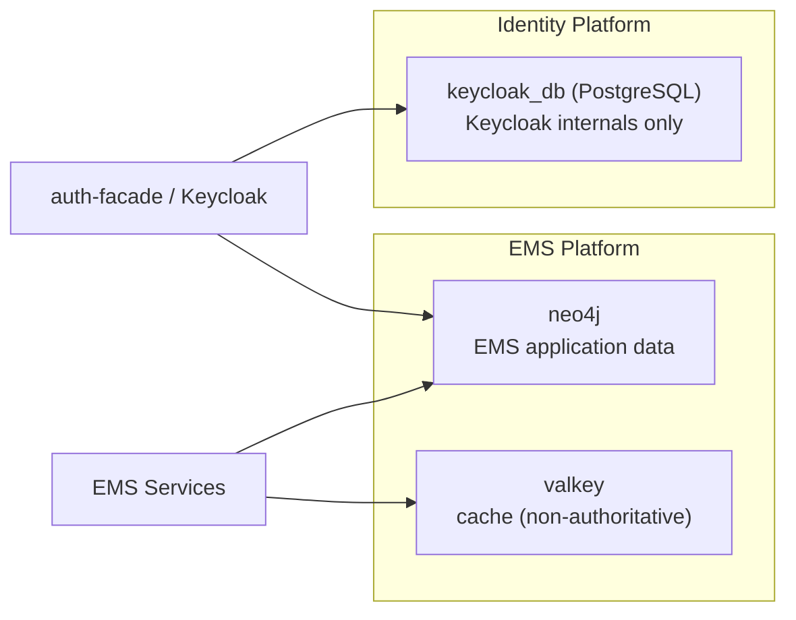

# Data Models

## Objective

This directory is organized by **database authority**: one canonical file per database.

## Authoritative Files (One File per Database)

| Database | Scope | Authoritative File |
|---|---|---|
| EMS application database (Neo4j) | All EMS domain data (tenant, auth graph, licensing, audit, AI, process metadata) | [neo4j-ems-db.md](./neo4j-ems-db.md) |
| Keycloak internal database (PostgreSQL) | Keycloak realms, users, sessions, provider internals | [keycloak-postgresql-db.md](./keycloak-postgresql-db.md) |

## Topology

## Legacy Split Views (Compatibility)

These files are retained for backward links and focused analysis, but are not the source of truth:

| Legacy File | Role |
|---|---|
| [master-graph.md](./master-graph.md) | Tenant and system graph-focused view |
| [tenant-graph.md](./tenant-graph.md) | Tenant operations-focused view |
| [neo4j-auth-graph-schema.md](./neo4j-auth-graph-schema.md) | Auth/RBAC-focused view |
| [graph-per-tenant-schema.md](./graph-per-tenant-schema.md) | Historical tenancy strategy notes |
| [provider-config-extensions.md](./provider-config-extensions.md) | Provider-specific config extension catalog |
| [keycloak-db.md](./keycloak-db.md) | Backward-compatible alias for Keycloak schema |

## Related Conceptual Models

- [domain-model.md](./domain-model.md) - BA business model
- [CANONICAL-DATA-MODEL.md](./CANONICAL-DATA-MODEL.md) - SA canonical model

---

**Last Updated:** 2026-02-27
