# EMS Business Domain Model v2.0

> **Document Type:** Business Domain Model
> **Author:** BA Agent
> **Created:** 2026-02-25
> **Updated:** 2026-02-27
> **Status:** VERIFIED (based on codebase analysis + ADR-014/ADR-015 alignment)
> **Next Step:** SA Agent transforms to Canonical Data Model

## Overview

EMSIST is a multi-tenant enterprise service management platform deployed **on-premise** at client sites. The platform enables organizations (tenants) to manage users, roles, permissions, licenses, and business processes while maintaining strict data isolation between tenants. License entitlements are delivered as cryptographically signed files, validated offline without internet connectivity.

### Key Business Capabilities

1. **Multi-Tenancy** - Complete tenant isolation with configurable branding
2. **Identity Management** - User authentication and authorization via graph-based RBAC
3. **On-Premise Cryptographic Licensing** - Offline license activation via signed files with hierarchical entitlements (application, tenant, user tier)
4. **AI Assistants** - Customizable AI agents with knowledge bases
5. **Process Management** - BPMN process modeling and execution
6. **Audit & Compliance** - Comprehensive audit trail and notifications

---

## Business Domains

### 1. Tenant Management Domain

The Tenant domain represents organizations using the EMS platform. Each tenant operates in complete isolation with its own configuration, branding, and users.

**Core Entities:**
- Tenant
- Tenant Domain
- Tenant Branding
- Tenant Session Configuration
- Tenant MFA Configuration
- Tenant Authentication Provider

### 2. Identity & Access Management (IAM) Domain

The IAM domain manages user identities, authentication, and authorization. It uses a graph-based model for efficient role resolution and permission inheritance.

**Core Entities:**
- User (Profile & Graph Node)
- User Device
- User Session
- Role (with inheritance)
- Group (with hierarchy)
- Identity Provider
- Provider Configuration
- Authentication Protocol

### 3. On-Premise Cryptographic Licensing Domain

The Licensing domain manages offline license activation, hierarchical entitlements, tier-based seat allocations, and feature gating for the on-premise deployment. Licenses are delivered as cryptographically signed files (`.lic`), imported by the master tenant superadmin, and validated locally without internet connectivity. This domain supersedes the previous SaaS subscription model per ADR-015.

**Core Entities:**
- License File (the signed artifact imported by the client admin)
- Application License (top-level entitlement for the entire installation)
- Tenant License (per-tenant entitlement carved from the application license)
- Tier Seat Allocation (number of seats per user tier within a tenant)
- User License Assignment (individual user's assigned tier/seat within a tenant)
- Revocation Entry (record of revoked license identifiers, from optional `.revoke` file)

**Supporting Concepts:**
- License State (runtime operational state: UNLICENSED, ACTIVE, GRACE, EXPIRED, TAMPERED)
- User Tier (business capability level: Tenant-Admin, Power User, Contributor, Viewer)
- Grace Period (degraded operation window after license expiry)

### 4. Operations Domain

The Operations domain handles cross-cutting operational concerns including audit logging and user notifications.

**Core Entities:**
- Audit Event
- Notification
- Notification Template
- Notification Preference

### 5. AI Services Domain

The AI domain enables tenants to create and manage AI assistants with custom knowledge bases for RAG (Retrieval-Augmented Generation).

**Core Entities:**
- Agent
- Agent Category
- Conversation
- Message
- Knowledge Source
- Knowledge Chunk

### 6. Process Management Domain

The Process domain supports BPMN process modeling and execution.

**Core Entities:**
- BPMN Element Type

---

## Entity Definitions

### Tenant Management Domain

#### Tenant

**Description:** An organization or business unit using the EMS platform. Tenants are the highest-level isolation boundary.

| Attribute | Required | Description |
|-----------|----------|-------------|
| id | Yes | Unique tenant identifier (e.g., "tenant-abc123") |
| uuid | Yes | UUID for external references |
| fullName | Yes | Full legal name of the organization |
| shortName | Yes | Short display name |
| slug | Yes | URL-safe identifier (unique) |
| description | No | Organization description |
| logoUrl | No | URL to organization logo |
| tenantType | Yes | Type of tenant (MASTER, DOMINANT, REGULAR) |
| tier | Yes | Subscription tier (FREE, STANDARD, PROFESSIONAL, ENTERPRISE) |
| status | Yes | Tenant status (ACTIVE, LOCKED, SUSPENDED, PENDING) |
| keycloakRealm | No | Associated Keycloak realm name |
| isProtected | Yes | System-protected tenant flag |
| createdAt | Yes | Creation timestamp |
| updatedAt | Yes | Last update timestamp |
| createdBy | No | User who created the tenant |

**Business Rules:**
- BR-T001: Tenant slug must be globally unique
- BR-T002: Tenant cannot be deleted if status is ACTIVE (must be SUSPENDED first)
- BR-T003: MASTER tenant type has platform-wide administrative privileges
- BR-T004: Protected tenants cannot be deleted or suspended
- BR-T005: Tenant features and seat limits are determined by its Tenant License (from the imported license file)

---

#### Tenant Domain

**Description:** A verified domain associated with a tenant for email-based user routing and SSO.

| Attribute | Required | Description |
|-----------|----------|-------------|
| id | Yes | Unique domain identifier |
| domain | Yes | Domain name (e.g., "acme.com") |
| isPrimary | Yes | Whether this is the primary domain |
| isVerified | Yes | Whether domain ownership is verified |
| verificationToken | No | Token for DNS verification |
| verificationMethod | No | Method used (DNS_TXT, DNS_CNAME, etc.) |
| sslStatus | No | SSL certificate status (PENDING, ACTIVE, EXPIRED) |
| sslCertificateId | No | External certificate ID |
| sslExpiresAt | No | SSL expiration timestamp |
| verifiedAt | No | When domain was verified |
| createdAt | Yes | Creation timestamp |

**Relationships:**
- BELONGS TO one Tenant

**Business Rules:**
- BR-TD001: Domain must be globally unique across all tenants
- BR-TD002: At least one domain must be primary per tenant
- BR-TD003: Domain must be verified before users can authenticate via it
- BR-TD004: SSL certificates must be renewed before expiration

---

#### Tenant Branding

**Description:** Visual customization settings for a tenant's user interface.

| Attribute | Required | Description |
|-----------|----------|-------------|
| tenantId | Yes | Owning tenant reference |
| primaryColor | No | Primary brand color (hex) |
| primaryColorDark | No | Primary color for dark mode |
| secondaryColor | No | Secondary brand color |
| logoUrl | No | Light mode logo URL |
| logoUrlDark | No | Dark mode logo URL |
| faviconUrl | No | Favicon URL |
| loginBackgroundUrl | No | Custom login page background |
| fontFamily | No | Custom font family |
| customCss | No | Additional custom CSS |
| updatedAt | Yes | Last update timestamp |

**Relationships:**
- BELONGS TO one Tenant (1:1)

**Business Rules:**
- BR-TB001: Each tenant can have only one branding configuration
- BR-TB002: Colors must be valid hex color codes

---

#### Tenant Session Configuration

**Description:** Session management policies for a tenant.

| Attribute | Required | Description |
|-----------|----------|-------------|
| tenantId | Yes | Owning tenant reference |
| accessTokenLifetime | Yes | Access token validity (minutes) |
| refreshTokenLifetime | Yes | Refresh token validity (minutes) |
| idleTimeout | Yes | Session idle timeout (minutes) |
| absoluteTimeout | Yes | Maximum session duration (minutes) |
| maxConcurrentSessions | Yes | Maximum simultaneous sessions per user |
| updatedAt | Yes | Last update timestamp |

**Relationships:**
- BELONGS TO one Tenant (1:1)

**Business Rules:**
- BR-TS001: accessTokenLifetime must be less than refreshTokenLifetime
- BR-TS002: idleTimeout must be less than absoluteTimeout
- BR-TS003: maxConcurrentSessions minimum is 1

---

#### Tenant MFA Configuration

**Description:** Multi-factor authentication policies for a tenant.

| Attribute | Required | Description |
|-----------|----------|-------------|
| tenantId | Yes | Owning tenant reference |
| enabled | Yes | Whether MFA is available |
| required | Yes | Whether MFA is mandatory |
| allowedMethods | Yes | List of allowed MFA methods |
| defaultMethod | No | Default MFA method (TOTP, EMAIL, SMS, etc.) |
| gracePeriodDays | Yes | Days before MFA enforcement |
| updatedAt | Yes | Last update timestamp |

**Relationships:**
- BELONGS TO one Tenant (1:1)

**Business Rules:**
- BR-TM001: If required is true, enabled must also be true
- BR-TM002: At least one method must be in allowedMethods
- BR-TM003: defaultMethod must be in allowedMethods

---

#### Tenant Authentication Provider

**Description:** External identity provider configuration for a tenant.

| Attribute | Required | Description |
|-----------|----------|-------------|
| id | Yes | Unique provider configuration identifier |
| type | Yes | Provider type (LOCAL, AZURE_AD, SAML, OIDC, LDAP, UAEPASS) |
| name | Yes | Internal name |
| displayName | No | User-facing name |
| icon | No | Provider icon identifier |
| isEnabled | Yes | Whether provider is active |
| isPrimary | Yes | Whether this is the default provider |
| sortOrder | No | Display order on login page |
| config | Yes | Provider-specific configuration (JSON) |
| createdAt | Yes | Creation timestamp |
| updatedAt | Yes | Last update timestamp |

**Relationships:**
- BELONGS TO one Tenant

**Business Rules:**
- BR-TP001: At least one authentication provider must be enabled per tenant
- BR-TP002: Only one provider can be primary at a time
- BR-TP003: LOCAL provider type uses Keycloak internal authentication

---

### Identity & Access Management Domain

#### User Profile

**Description:** Extended user profile information stored in PostgreSQL, complementing identity provider data.

| Attribute | Required | Description |
|-----------|----------|-------------|
| id | Yes | UUID identifier |
| keycloakId | Yes | Keycloak user ID (unique) |
| tenantId | Yes | Owning tenant reference |
| email | Yes | User email address |
| emailVerified | No | Whether email is verified |
| firstName | No | User first name |
| lastName | No | User last name |
| displayName | No | Preferred display name |
| jobTitle | No | Job title |
| department | No | Department name |
| phone | No | Office phone |
| mobile | No | Mobile phone |
| officeLocation | No | Office location |
| employeeId | No | Employee ID |
| employeeType | No | Employment type (FULL_TIME, CONTRACTOR, etc.) |
| managerId | No | Manager's user ID |
| avatarUrl | No | Profile picture URL |
| timezone | No | User timezone |
| locale | No | Preferred language |
| mfaEnabled | No | Whether user has MFA enabled |
| mfaMethods | No | Configured MFA methods |
| passwordLastChanged | No | Last password change timestamp |
| passwordExpiresAt | No | Password expiration timestamp |
| accountLocked | No | Whether account is locked |
| lockoutEnd | No | Lockout end timestamp |
| failedLoginAttempts | No | Failed login counter |
| lastLoginAt | No | Last successful login |
| lastLoginIp | No | Last login IP address |
| status | Yes | User status (ACTIVE, INACTIVE, SUSPENDED, PENDING_VERIFICATION, DELETED) |
| createdAt | Yes | Creation timestamp |
| updatedAt | Yes | Last update timestamp |

**Relationships:**
- BELONGS TO one Tenant
- HAS MANY User Devices
- REPORTS TO one User (manager, optional)

**Business Rules:**
- BR-UP001: Email must be unique within a tenant
- BR-UP002: keycloakId must be globally unique
- BR-UP003: User cannot have status ACTIVE if tenant status is SUSPENDED
- BR-UP004: Password must be changed if passwordExpiresAt is past
- BR-UP005: Account auto-locks after threshold failed login attempts

---

#### User Node (Graph)

**Description:** User representation in the Neo4j identity graph for role resolution.

| Attribute | Required | Description |
|-----------|----------|-------------|
| id | Yes | User identifier (matches keycloakId) |
| email | Yes | User email address |
| firstName | No | User first name |
| lastName | No | User last name |
| tenantId | Yes | Owning tenant reference |
| active | Yes | Whether user is active |
| emailVerified | Yes | Whether email is verified |
| externalId | No | External identity provider user ID |
| identityProvider | No | Source identity provider |
| createdAt | No | Creation timestamp |
| updatedAt | No | Last update timestamp |
| lastLoginAt | No | Last login timestamp |

**Relationships:**
- BELONGS TO one Tenant
- MEMBER OF many Groups
- HAS ROLE many Roles (direct)

**Business Rules:**
- BR-UN001: User can only belong to groups within same tenant
- BR-UN002: User inherits all roles from groups they belong to
- BR-UN003: Role resolution traverses group hierarchy and role inheritance

---

#### User Device

**Description:** Registered devices for a user, used for device trust and session management.

| Attribute | Required | Description |
|-----------|----------|-------------|
| id | Yes | UUID identifier |
| tenantId | Yes | Owning tenant reference |
| fingerprint | Yes | Device fingerprint (unique per user) |
| deviceName | No | User-assigned device name |
| deviceType | No | Type (DESKTOP, LAPTOP, TABLET, PHONE, OTHER) |
| osName | No | Operating system |
| osVersion | No | OS version |
| browserName | No | Browser name |
| browserVersion | No | Browser version |
| trustLevel | No | Trust level (UNKNOWN, LOW, MEDIUM, HIGH, TRUSTED) |
| isApproved | No | Whether device is approved |
| approvedBy | No | Approver user ID |
| approvedAt | No | Approval timestamp |
| firstSeenAt | No | First detection timestamp |
| lastSeenAt | No | Last activity timestamp |
| lastIpAddress | No | Last known IP address |
| lastLocation | No | Geolocation data (JSON) |
| loginCount | No | Total login count from device |
| createdAt | Yes | Creation timestamp |
| updatedAt | Yes | Last update timestamp |

**Relationships:**
- BELONGS TO one User Profile

**Business Rules:**
- BR-UD001: Fingerprint must be unique per user
- BR-UD002: New devices start with UNKNOWN trust level
- BR-UD003: Only approved devices can have HIGH or TRUSTED levels

---

#### User Session

**Description:** Active user session tracking for security and concurrent session management.

| Attribute | Required | Description |
|-----------|----------|-------------|
| id | Yes | UUID identifier |
| userId | Yes | User reference |
| tenantId | Yes | Owning tenant reference |
| deviceId | No | Associated device reference |
| sessionToken | Yes | Session token (unique) |
| refreshTokenId | No | Refresh token reference |
| ipAddress | No | Session IP address |
| userAgent | No | Browser user agent |
| location | No | Geolocation data (JSON) |
| createdAt | Yes | Session start timestamp |
| lastActivity | No | Last activity timestamp |
| expiresAt | Yes | Session expiration timestamp |
| isRemembered | No | Remember me flag |
| mfaVerified | No | Whether MFA was completed |
| status | Yes | Session status (ACTIVE, EXPIRED, REVOKED) |
| revokedAt | No | Revocation timestamp |
| revokedBy | No | Revoking user ID |
| revokeReason | No | Revocation reason |

**Relationships:**
- BELONGS TO one User
- USES one User Device (optional)

**Business Rules:**
- BR-US001: Session count per user cannot exceed tenant's maxConcurrentSessions
- BR-US002: Session must respect tenant idle and absolute timeouts
- BR-US003: Revoking a session invalidates associated tokens

---

#### Role Node (Graph)

**Description:** Role definition in the RBAC hierarchy with inheritance support.

| Attribute | Required | Description |
|-----------|----------|-------------|
| name | Yes | Role name (identifier) |
| displayName | No | User-friendly name |
| description | No | Role description |
| tenantId | No | Owning tenant (null = global role) |
| systemRole | Yes | Whether role is system-defined |
| createdAt | No | Creation timestamp |
| updatedAt | No | Last update timestamp |

**Relationships:**
- INHERITS FROM many Roles
- ASSIGNED TO many Users (direct)
- ASSIGNED TO many Groups

**Business Rules:**
- BR-RN001: System roles cannot be deleted or modified
- BR-RN002: Role inheritance must not create cycles
- BR-RN003: Effective permissions include inherited permissions transitively
- BR-RN004: Global roles (tenantId=null) are available to all tenants

---

#### Group Node (Graph)

**Description:** User grouping mechanism for role assignment and organization.

| Attribute | Required | Description |
|-----------|----------|-------------|
| id | Yes | UUID identifier |
| name | Yes | Group name |
| displayName | No | User-friendly name |
| description | No | Group description |
| tenantId | Yes | Owning tenant reference |
| systemGroup | Yes | Whether group is system-defined |
| createdAt | No | Creation timestamp |
| updatedAt | No | Last update timestamp |

**Relationships:**
- BELONGS TO one Tenant
- HAS ROLE many Roles
- CHILD OF many Groups (parent hierarchy)
- CONTAINS many Users

**Business Rules:**
- BR-GN001: Group name must be unique within tenant
- BR-GN002: System groups cannot be deleted
- BR-GN003: Users inherit all roles from groups and parent groups
- BR-GN004: Group hierarchy must not create cycles

---

#### Identity Provider Node (Graph)

**Description:** Identity provider configuration for federated authentication.

| Attribute | Required | Description |
|-----------|----------|-------------|
| name | Yes | Provider identifier (e.g., "KEYCLOAK", "AZURE_AD") |
| vendor | No | Provider vendor name |
| displayName | No | User-friendly name |
| iconUrl | No | Provider icon URL |
| description | No | Provider description |

**Relationships:**
- SUPPORTS many Protocols
- HAS many Configurations
- USED BY many Tenants

**Business Rules:**
- BR-IP001: Provider name must be globally unique
- BR-IP002: Provider must support at least one protocol

---

#### Authentication Protocol Node (Graph)

**Description:** Authentication protocol supported by identity providers.

| Attribute | Required | Description |
|-----------|----------|-------------|
| type | Yes | Protocol type (OIDC, SAML, LDAP, OAUTH2) |
| version | No | Protocol version |
| displayName | No | User-friendly name |
| description | No | Protocol description |

**Relationships:**
- SUPPORTED BY many Providers

**Business Rules:**
- BR-AP001: Protocol type must be one of: OIDC, SAML, LDAP, OAUTH2

---

#### Provider Configuration Node (Graph)

**Description:** Tenant-specific identity provider configuration.

| Attribute | Required | Description |
|-----------|----------|-------------|
| id | Yes | UUID identifier |
| tenantId | Yes | Owning tenant reference |
| providerName | Yes | Provider reference |
| displayName | No | User-friendly name |
| protocol | Yes | Protocol type used |
| enabled | Yes | Whether configuration is active |
| priority | No | Display priority |
| trustEmail | No | Trust provider email verification |
| storeToken | No | Store provider tokens |
| linkExistingAccounts | No | Link by email matching |
| createdAt | No | Creation timestamp |
| updatedAt | No | Last update timestamp |

**Relationships:**
- BELONGS TO one Tenant
- CONFIGURES one Provider
- USES one Protocol

**Business Rules:**
- BR-PC001: Each tenant can have multiple configurations per provider
- BR-PC002: Sensitive fields (secrets) must be encrypted

---

### On-Premise Cryptographic Licensing Domain

#### License File

**Description:** The cryptographically signed artifact (`.lic` file) delivered by the vendor and imported by the client's master tenant superadmin. The license file is the unit of delivery and is the single source of truth for all license entitlements. It contains the full license hierarchy in a self-describing, tamper-evident format. The file uses Ed25519 digital signatures for integrity verification.

| Attribute | Required | Description |
|-----------|----------|-------------|
| Format Marker | Yes | Fixed header identifying the file format and version (e.g., "EMSIST-LICENSE-V1") |
| Key Identifier (KID) | Yes | Identifies which vendor public key to use for signature verification |
| License Identifier | Yes | Globally unique identifier for this license, used for revocation checking |
| Issuer | Yes | Vendor legal name that generated the license |
| Issued At | Yes | Timestamp when the license file was generated by the vendor |
| Customer Identifier | Yes | Customer identifier in the vendor's CRM system |
| Customer Name | Yes | Legal name of the purchasing organization |
| Customer Country | No | Country of the customer (ISO 3166-1 alpha-2) |
| Payload | Yes | The complete license hierarchy (application license + all tenant licenses) |
| Signature | Yes | Ed25519 digital signature over the payload |
| Import Status | Yes | Current status of this file: ACTIVE or SUPERSEDED |
| Imported At | Yes | Timestamp when the file was imported into the system |
| Imported By | Yes | The superadmin who performed the import |
| Payload Checksum | No | SHA-256 checksum of the payload for belt-and-suspenders integrity |

**Relationships:**
- CONTAINS one Application License
- SUPERSEDES zero or one previous License File

**Business Rules:**
- BR-LF001: Only one license file may be ACTIVE per installation at any time (Source: ADR-015 Section 2.3)
- BR-LF002: The license file must pass Ed25519 signature verification using the embedded vendor public key before any entitlements are extracted (Source: ADR-015 Section 1.2)
- BR-LF003: The file must start with the fixed format marker "EMSIST-LICENSE-V1" (Source: ADR-015 Section 1.1)
- BR-LF004: Importing a new license file archives the previous one with status SUPERSEDED (Source: ADR-015 Section 2.3)
- BR-LF005: The system retains all imported license files (including superseded ones) for audit purposes (Source: REQ-LIC-001 BR-133)
- BR-LF006: The license file is not secret -- it can be transmitted over insecure channels. Its integrity is protected by the signature, not by confidentiality (Source: ADR-015 Section 2.2)
- BR-LF007: The Key Identifier (KID) in the header deterministically selects the public key for verification -- no trial-and-error key matching (Source: ADR-015 Section 5.2)
- BR-LF008: Only users with the SUPER_ADMIN role on the master tenant may import license files (Source: ADR-015 Section 2.3)

**Tenant Scope:** Global (managed by master tenant superadmin)

---

#### Application License

**Description:** The top-level entitlement for the entire EMSIST installation, extracted from the license file payload. There is exactly one application license per active license file. It defines the platform-wide constraints: which product version this license is valid for, the maximum number of tenants, the application-level expiry date, and the master list of features available to the installation.

| Attribute | Required | Description |
|-----------|----------|-------------|
| Product Identifier | Yes | Must match the running application's own product identifier ("EMSIST") |
| Minimum Version | Yes | Minimum application version this license is valid for (semantic versioning) |
| Maximum Version | Yes | Maximum application version this license is valid for (semantic versioning) |
| Instance Identifier | No | Locks the license to a specific installation (optional hardware/instance binding) |
| Maximum Tenants | Yes | Maximum number of tenants permitted under this license |
| Expiry Date | Yes | The date on which the application license expires |
| Application Feature Set | Yes | Master list of feature keys available to this installation |
| Grace Period Days | Yes | Number of days after expiry during which degraded operation is permitted |
| Degraded Features | Yes | Features that are disabled during the grace period |

**Relationships:**
- EXTRACTED FROM one License File
- AUTHORIZES many Tenant Licenses
- DEFINES one Grace Period configuration

**Business Rules:**
- BR-AL001: Exactly one application license may be active per installation (Source: REQ-LIC-001 BR-100)
- BR-AL002: The product identifier in the license must match the running application's product identifier. A mismatch means the license is for a different product (Source: ADR-015 Section 2.3, Check 5)
- BR-AL003: The running application version must fall within the minimum-maximum version range. A version outside this range means the license does not cover this release (Source: ADR-015 Section 2.3, Check 6)
- BR-AL004: If an instance identifier is present, it must match the installation's own instance identifier. A mismatch means the license is bound to a different installation (Source: ADR-015 Section 2.3, Check 7)
- BR-AL005: The expiry date must be in the future at import time (Source: ADR-015 Section 2.3, Check 8)
- BR-AL006: The number of tenant licenses in the file must not exceed the maximum tenants value (Source: ADR-015 Section 2.3, Check 11)
- BR-AL007: The application feature set defines the ceiling -- no tenant may have features not present in this set (Source: ADR-015 Section 1.3)
- BR-AL008: The grace period defaults to 30 days but is configurable per license file (Source: ADR-015 Section 3.5)
- BR-AL009: Degraded features are vendor-controlled and specified in the license file. Core features always remain during grace (Source: ADR-015 Section 3.5)

**Tenant Scope:** Global (not tenant-scoped)

---

#### Tenant License

**Description:** A per-tenant entitlement carved from the application license. Each tenant that operates under a license must have a corresponding tenant license entry. The tenant license specifies which features are enabled for that tenant (a subset of the application feature set) and the tenant-specific expiry date.

| Attribute | Required | Description |
|-----------|----------|-------------|
| Tenant Identifier | Yes | Which registered tenant this license activates |
| Tenant Display Name | Yes | Human-readable name for the licensed tenant |
| Expiry Date | Yes | Tenant-specific expiry date |
| Tenant Feature Set | Yes | Features enabled for this tenant (subset of application features) |

**Relationships:**
- BELONGS TO one Application License
- ACTIVATES one Tenant (in the Tenant Management domain)
- HAS MANY Tier Seat Allocations
- HAS MANY User License Assignments

**Business Rules:**
- BR-TL001: Each tenant identifier in the license file must correspond to a tenant registered in the tenant-service. Unknown tenant identifiers are rejected at import (Source: ADR-015 Section 2.3, Check 9)
- BR-TL002: The tenant expiry date must not exceed the application license expiry date (Source: ADR-015 Section 2.3, Check 10)
- BR-TL003: The tenant feature set must be a subset of the application feature set. A tenant cannot have a feature that the application license does not authorize (Source: ADR-015 Section 1.3)
- BR-TL004: When a tenant license expires, users of that tenant cannot start new sessions. Existing sessions may complete but no new logins are permitted (Source: REQ-LIC-001 BR-114)
- BR-TL005: A tenant cannot be activated (set to ACTIVE status) without a valid tenant license (Source: REQ-LIC-001 BR-110)
- BR-TL006: Each tenant must have at least one Tenant-Admin seat allocated (Source: REQ-LIC-001 BR-113)

**Tenant Scope:** Global (licenses are managed by the master tenant superadmin, not by individual tenants)

---

#### Tier Seat Allocation

**Description:** Defines the maximum number of seats available for a specific user tier within a tenant license. Each tenant license has exactly four tier seat allocations -- one per user tier (Tenant-Admin, Power User, Contributor, Viewer).

| Attribute | Required | Description |
|-----------|----------|-------------|
| User Tier | Yes | Which capability tier this allocation is for (Tenant-Admin, Power User, Contributor, or Viewer) |
| Maximum Seats | Yes | Maximum number of users that may be assigned to this tier. A value of -1 means unlimited |

**Relationships:**
- BELONGS TO one Tenant License
- FOR one User Tier

**Business Rules:**
- BR-TSA001: Each tenant license must have exactly four tier seat allocations (one per tier) (Source: ADR-015 Section 1.3)
- BR-TSA002: The Tenant-Admin tier must have a maximum seats value of at least 1 (Source: REQ-LIC-001 BR-113)
- BR-TSA003: A maximum seats value of -1 means unlimited seats for that tier (Source: ADR-015 Section 1.4)
- BR-TSA004: Maximum seats must be either -1 (unlimited) or a non-negative integer (Source: ADR-015 Section 1.4)

**Tenant Scope:** Global (part of the license file, managed by master tenant superadmin)

---

#### User License Assignment

**Description:** The assignment of an individual user to a specific capability tier within their tenant. Each user occupies exactly one seat at one tier at any given time. The tier assignment drives the user's RBAC role (see User Tier Mapping). This is the only licensing entity that is actively managed at runtime (all others are imported from the license file).

| Attribute | Required | Description |
|-----------|----------|-------------|
| User | Yes | The individual who holds this seat |
| Tenant | Yes | The tenant context for this assignment |
| Assigned Tier | Yes | The capability tier for this seat (Tenant-Admin, Power User, Contributor, or Viewer) |
| Assigned At | Yes | When the seat was allocated |
| Assigned By | Yes | The administrator who allocated the seat (must be a Tenant-Admin or Superadmin) |

**Relationships:**
- BELONGS TO one Tenant License
- ASSIGNED TO one User
- AT one User Tier (which maps to one RBAC Role)

**Business Rules:**
- BR-ULA001: A user can hold at most one seat tier per tenant at any given time. No dual-tier assignments (Source: REQ-LIC-001 BR-120)
- BR-ULA002: A seat assignment is rejected if the tier's current assigned count equals or exceeds its maximum seats (unless maximum is -1 for unlimited) (Source: REQ-LIC-001 BR-122)
- BR-ULA003: Revoking a seat does not delete the user. The user remains in the system but cannot access licensed features (Source: REQ-LIC-001 BR-123)
- BR-ULA004: Changing a user's tier revokes the old seat and assigns a new one in the target tier. The target tier must have availability (Source: REQ-LIC-001 BR-124)
- BR-ULA005: When a seat is assigned, the user's RBAC role is synchronized to match the tier's corresponding role (Source: REQ-LIC-001 BR-144)
- BR-ULA006: When a seat is revoked, the user's corresponding RBAC role is removed (Source: REQ-LIC-001 BR-143)
- BR-ULA007: The SUPER_ADMIN on the master tenant does NOT consume a seat in any tenant license (Source: REQ-LIC-001 BR-125, ADR-015 Section 3.6)
- BR-ULA008: Only users with Tenant-Admin or SUPER_ADMIN role may assign or revoke seats (Source: REQ-LIC-001 BR-120)

**Tenant Scope:** Tenant-Scoped (each assignment exists within the context of one tenant)

---

#### Revocation Entry

**Description:** A record of a revoked license identifier, imported from an optional `.revoke` file. Revocation entries allow the vendor to invalidate specific license files without requiring internet connectivity. The revocation list is a signed file containing license identifiers that are no longer valid.

| Attribute | Required | Description |
|-----------|----------|-------------|
| Revoked License Identifier | Yes | The license identifier that is no longer valid |
| Revocation Reason | No | Human-readable reason for revocation |
| Revoked At | Yes | When the revocation was issued by the vendor |
| Imported At | Yes | When the revocation entry was imported into the system |

**Relationships:**
- INVALIDATES zero or one License File (matched by license identifier)

**Business Rules:**
- BR-RE001: A revocation entry is verified using the same Ed25519 signature mechanism as license files (Source: ADR-015 Section 2.5)
- BR-RE002: If a revocation entry matches the currently active license file's identifier, the license transitions to EXPIRED state immediately (Source: ADR-015 Section 2.5)
- BR-RE003: Revocation entries are cumulative -- importing a new revocation list adds to the existing entries (Source: ADR-015 Section 2.5)
- BR-RE004: The primary revocation mechanism is expiry-based (licenses have fixed expiry dates). The revocation list is an optional supplementary mechanism (Source: ADR-015 Section 2.5)

**Tenant Scope:** Global

---

#### License State (Value Object)

**Description:** The runtime operational state of the license subsystem. This is not a persisted entity but rather a computed state derived from the active license file and current date. It governs what the system allows at any given moment.

| State | Condition | System Behavior |
|-------|-----------|-----------------|
| **UNLICENSED** | No license file has been imported | Only the master tenant is operational. All regular tenants are blocked. The admin UI shows an "Import License" prompt. (Source: ADR-015 Section 3.4) |
| **ACTIVE** | Current date is before the application expiry date | Full operation. All licensed features are available. All tenants with valid tenant licenses are operational. (Source: ADR-015 Section 3.4) |
| **GRACE** | Current date is past the application expiry date but within the grace period | Degraded operation. Core features remain available. Degraded features (specified in the license file) are disabled. A persistent banner warns: "License expired, renew within N days." (Source: ADR-015 Section 3.4) |
| **EXPIRED** | Current date is past the application expiry date plus the grace period | Read-only mode. Users can log in and view data. No create, edit, or delete operations. No new user registration. A persistent banner warns: "License expired. Contact vendor." (Source: ADR-015 Section 3.4) |
| **TAMPERED** | Signature verification fails on the stored license file | Emergency state. All tenants are blocked except the master tenant. An audit alert is generated. This should never occur unless the database was manually edited. (Source: ADR-015 Section 3.4) |

**Business Rules:**
- BR-LS001: The license state is computed at application startup and re-evaluated daily by a scheduled validator (Source: ADR-015 Section 3.2)
- BR-LS002: The license state transitions follow a strict order: UNLICENSED, then ACTIVE (after import), then GRACE (after expiry), then EXPIRED (after grace period) (Source: ADR-015 Section 3.4)
- BR-LS003: The TAMPERED state can be entered from any state if signature verification fails (Source: ADR-015 Section 3.4)
- BR-LS004: The master tenant is always exempt from license state restrictions -- it operates regardless of license state (Source: ADR-015 Section 3.6)
- BR-LS005: The license state is exposed via a health indicator for monitoring (Source: ADR-015 Section 3.2)

**Tenant Scope:** Global

---

#### User Tier (Value Object)

**Description:** The four capability tiers that a user may be assigned to within a tenant. Each tier maps to exactly one RBAC role. The tiers form a hierarchy where higher tiers inherit all capabilities of lower tiers.

| User Tier | RBAC Role | Hierarchy Level | Capabilities |
|-----------|-----------|-----------------|--------------|
| **Tenant-Admin** | ADMIN | 4 | Full tenant administration: user management, identity provider configuration, branding, license seat assignment within the tenant |
| **Power User** | MANAGER | 3 | Advanced features: workflow design, API access, integrations, report building |
| **Contributor** | USER | 2 | Standard productivity: use workflows, fill forms, collaborate, view reports |
| **Viewer** | VIEWER | 1 (lowest) | Read-only: view dashboards, reports, audit logs (no create/edit/delete) |

**Special case: SUPER_ADMIN**
- SUPER_ADMIN is reserved for the master tenant and is NOT a licensed tier (Source: ADR-015 Section 1.5, ADR-014 Section 2)
- The master tenant operates entirely outside the license model (Source: ADR-015 Section 3.6)

**Business Rules:**
- BR-UT001: The tier name is a business concept; the role name is a system concept. They are linked but not identical (Source: REQ-LIC-001 BR-140)
- BR-UT002: Role inheritance applies -- a Tenant-Admin inherits all capabilities of Power User, Contributor, and Viewer (Source: REQ-LIC-001 BR-142)
- BR-UT003: A user's effective role is determined by their seat tier, not by manual role assignment. License assignment drives role assignment (Source: REQ-LIC-001 BR-144)
- BR-UT004: SUPER_ADMIN is not assignable via the licensing system. It is a platform role that exists only in the master tenant (Source: REQ-LIC-001 BR-141)

---

### Operations Domain

#### Audit Event

**Description:** Immutable record of system events for compliance and security monitoring.

| Attribute | Required | Description |
|-----------|----------|-------------|
| id | Yes | UUID identifier |
| tenantId | Yes | Tenant context |
| userId | No | Acting user (if applicable) |
| username | No | Username at time of event |
| sessionId | No | Associated session |
| eventType | Yes | Event type code |
| eventCategory | No | Event category |
| severity | Yes | Severity level (INFO, WARN, ERROR, CRITICAL) |
| message | No | Human-readable description |
| resourceType | No | Target resource type |
| resourceId | No | Target resource ID |
| resourceName | No | Target resource name |
| action | No | Action performed (CREATE, READ, UPDATE, DELETE) |
| outcome | Yes | Result (SUCCESS, FAILURE) |
| failureReason | No | Error description if failed |
| oldValues | No | Previous state (JSON) |
| newValues | No | New state (JSON) |
| ipAddress | No | Client IP address |
| userAgent | No | Client user agent |
| requestId | No | Request correlation ID |
| correlationId | No | Business correlation ID |
| serviceName | No | Originating service |
| serviceVersion | No | Service version |
| metadata | No | Additional context (JSON) |
| timestamp | Yes | Event timestamp |
| expiresAt | No | Retention expiration |

**Relationships:**
- BELONGS TO one Tenant
- PERFORMED BY one User (optional)

**Business Rules:**
- BR-AE001: Audit events are immutable (no updates or deletes)
- BR-AE002: Events must be retained per compliance requirements
- BR-AE003: Sensitive data in oldValues/newValues must be masked

---

#### Notification

**Description:** A notification message sent to a user.

| Attribute | Required | Description |
|-----------|----------|-------------|
| id | Yes | UUID identifier |
| tenantId | Yes | Tenant context |
| userId | Yes | Recipient user |
| type | Yes | Delivery channel (EMAIL, PUSH, IN_APP, SMS) |
| category | Yes | Notification category (SYSTEM, MARKETING, TRANSACTIONAL, ALERT) |
| subject | Yes | Notification subject |
| body | Yes | Plain text body |
| bodyHtml | No | HTML body |
| templateId | No | Template reference |
| templateData | No | Template variables (JSON) |
| status | Yes | Delivery status (PENDING, SENT, DELIVERED, FAILED, READ) |
| recipientAddress | No | Email/phone/device token |
| sentAt | No | Send timestamp |
| deliveredAt | No | Delivery confirmation timestamp |
| readAt | No | Read timestamp |
| failedAt | No | Failure timestamp |
| failureReason | No | Error description |
| retryCount | No | Retry attempts |
| maxRetries | No | Maximum retries |
| priority | No | Priority level (LOW, NORMAL, HIGH, URGENT) |
| scheduledAt | No | Scheduled send time |
| actionUrl | No | Call-to-action URL |
| actionLabel | No | Call-to-action button text |
| metadata | No | Additional context (JSON) |
| correlationId | No | Business correlation ID |
| createdAt | Yes | Creation timestamp |
| updatedAt | Yes | Last update timestamp |
| expiresAt | No | Notification expiration |

**Relationships:**
- BELONGS TO one Tenant
- SENT TO one User
- USES one Notification Template (optional)

**Business Rules:**
- BR-NO001: Respect user notification preferences
- BR-NO002: Retry failed notifications up to maxRetries
- BR-NO003: SYSTEM notifications cannot be opted out

---

#### Notification Template

**Description:** Reusable notification content template.

| Attribute | Required | Description |
|-----------|----------|-------------|
| id | Yes | UUID identifier |
| tenantId | No | Owning tenant (null = system template) |
| code | Yes | Template code identifier |
| name | Yes | Template name |
| description | No | Template description |
| type | Yes | Notification type (EMAIL, PUSH, IN_APP, SMS) |
| category | Yes | Notification category |
| subjectTemplate | No | Subject with placeholders |
| bodyTemplate | Yes | Body with placeholders |
| bodyHtmlTemplate | No | HTML body with placeholders |
| variables | No | Expected variable names |
| isActive | No | Whether template is active |
| isSystem | No | System template flag |
| locale | No | Template language |
| createdAt | Yes | Creation timestamp |
| updatedAt | Yes | Last update timestamp |

**Relationships:**
- BELONGS TO one Tenant (optional, system templates have no tenant)

**Business Rules:**
- BR-NT001: Template code must be unique per tenant
- BR-NT002: System templates cannot be deleted
- BR-NT003: Tenant templates override system templates with same code

---

#### Notification Preference

**Description:** User preferences for notification delivery.

| Attribute | Required | Description |
|-----------|----------|-------------|
| id | Yes | UUID identifier |
| tenantId | Yes | Tenant context |
| userId | Yes | User reference |
| emailEnabled | No | Allow email notifications |
| pushEnabled | No | Allow push notifications |
| smsEnabled | No | Allow SMS notifications |
| inAppEnabled | No | Allow in-app notifications |
| systemNotifications | No | Receive system notifications |
| marketingNotifications | No | Receive marketing notifications |
| transactionalNotifications | No | Receive transactional notifications |
| alertNotifications | No | Receive alert notifications |
| quietHoursEnabled | No | Enable quiet hours |
| quietHoursStart | No | Quiet hours start (HH:mm) |
| quietHoursEnd | No | Quiet hours end (HH:mm) |
| timezone | No | User timezone for quiet hours |
| digestEnabled | No | Enable notification digest |
| digestFrequency | No | Digest frequency (DAILY, WEEKLY) |
| createdAt | Yes | Creation timestamp |
| updatedAt | Yes | Last update timestamp |

**Relationships:**
- BELONGS TO one User
- SCOPED TO one Tenant

**Business Rules:**
- BR-NP001: Each user has one preference record per tenant
- BR-NP002: quietHoursStart must be different from quietHoursEnd
- BR-NP003: systemNotifications cannot be disabled

---

### AI Services Domain

#### Agent

**Description:** A customizable AI assistant configured by the tenant.

| Attribute | Required | Description |
|-----------|----------|-------------|
| id | Yes | UUID identifier |
| tenantId | Yes | Owning tenant |
| ownerId | Yes | Creating user |
| name | Yes | Agent name |
| description | No | Agent description |
| avatarUrl | No | Agent avatar image |
| systemPrompt | Yes | System prompt defining agent behavior |
| greetingMessage | No | Initial greeting message |
| conversationStarters | No | Suggested conversation prompts |
| provider | Yes | LLM provider (OPENAI, ANTHROPIC, GEMINI, OLLAMA) |
| model | Yes | LLM model identifier |
| modelConfig | No | Model parameters (JSON) |
| ragEnabled | No | Whether RAG is enabled |
| isPublic | No | Visible to all tenant users |
| isSystem | No | System-defined agent |
| status | Yes | Agent status (ACTIVE, INACTIVE, DELETED) |
| usageCount | No | Total conversation count |
| createdAt | Yes | Creation timestamp |
| updatedAt | Yes | Last update timestamp |

**Relationships:**
- BELONGS TO one Tenant
- OWNED BY one User
- BELONGS TO one Agent Category (optional)
- HAS MANY Knowledge Sources

**Business Rules:**
- BR-AG001: systemPrompt is required for agent functionality
- BR-AG002: System agents cannot be deleted
- BR-AG003: ragEnabled requires at least one knowledge source
- BR-AG004: Public agents are visible to all users in tenant

---

#### Agent Category

**Description:** Classification category for organizing agents.

| Attribute | Required | Description |
|-----------|----------|-------------|
| id | Yes | UUID identifier |
| name | Yes | Category name (unique) |
| description | No | Category description |
| icon | No | Category icon identifier |
| displayOrder | No | Sort order |
| isActive | No | Whether category is visible |
| createdAt | Yes | Creation timestamp |
| updatedAt | Yes | Last update timestamp |

**Relationships:**
- CONTAINS many Agents

**Business Rules:**
- BR-AC001: Category name must be unique

---

#### Conversation

**Description:** A chat conversation between a user and an AI agent.

| Attribute | Required | Description |
|-----------|----------|-------------|
| id | Yes | UUID identifier |
| tenantId | Yes | Tenant context |
| userId | Yes | Participating user |
| title | No | Conversation title |
| messageCount | No | Total messages |
| totalTokens | No | Total tokens used |
| status | Yes | Status (ACTIVE, ARCHIVED, DELETED) |
| lastMessageAt | No | Last message timestamp |
| createdAt | Yes | Creation timestamp |
| updatedAt | Yes | Last update timestamp |

**Relationships:**
- BELONGS TO one Tenant
- WITH one Agent
- OWNED BY one User
- CONTAINS many Messages

**Business Rules:**
- BR-CV001: Conversations are isolated per user (not shared)
- BR-CV002: Archived conversations are read-only
- BR-CV003: totalTokens is used for usage tracking/billing

---

#### Message

**Description:** A single message within a conversation.

| Attribute | Required | Description |
|-----------|----------|-------------|
| id | Yes | UUID identifier |
| role | Yes | Message role (USER, ASSISTANT, SYSTEM) |
| content | Yes | Message content |
| tokenCount | No | Tokens in message |
| ragContext | No | RAG context used (JSON) |
| metadata | No | Additional metadata (JSON) |
| createdAt | Yes | Creation timestamp |

**Relationships:**
- BELONGS TO one Conversation

**Business Rules:**
- BR-MS001: Messages are immutable after creation
- BR-MS002: SYSTEM role messages are for internal context only

---

#### Knowledge Source

**Description:** A source of knowledge for RAG (documents, URLs, text).

| Attribute | Required | Description |
|-----------|----------|-------------|
| id | Yes | UUID identifier |
| tenantId | Yes | Tenant context |
| name | Yes | Source name |
| description | No | Source description |
| sourceType | Yes | Type (FILE, URL, TEXT) |
| filePath | No | File storage path |
| fileType | No | File type (PDF, TXT, MD, CSV, DOCX) |
| fileSize | No | File size in bytes |
| url | No | Source URL |
| status | Yes | Processing status (PENDING, PROCESSING, COMPLETED, FAILED) |
| chunkCount | No | Number of chunks created |
| errorMessage | No | Processing error description |
| processedAt | No | Processing completion timestamp |
| createdAt | Yes | Creation timestamp |
| updatedAt | Yes | Last update timestamp |

**Relationships:**
- BELONGS TO one Agent
- CONTAINS many Knowledge Chunks

**Business Rules:**
- BR-KS001: filePath required for FILE sourceType
- BR-KS002: url required for URL sourceType
- BR-KS003: Source must be processed before use in RAG

---

#### Knowledge Chunk

**Description:** A vector-embedded chunk of knowledge for semantic search.

| Attribute | Required | Description |
|-----------|----------|-------------|
| id | Yes | UUID identifier |
| agentId | Yes | Owning agent |
| content | Yes | Chunk text content |
| embedding | No | Vector embedding (1536 dimensions) |
| chunkIndex | Yes | Order within source |
| tokenCount | No | Tokens in chunk |
| metadata | No | Source metadata (JSON) |
| createdAt | Yes | Creation timestamp |

**Relationships:**
- BELONGS TO one Knowledge Source

**Business Rules:**
- BR-KC001: Embedding must be generated before use in search
- BR-KC002: Chunks should be appropriately sized for LLM context

---

### Process Management Domain

#### BPMN Element Type

**Description:** Definition of BPMN element styling and metadata for the process designer.

| Attribute | Required | Description |
|-----------|----------|-------------|
| id | Yes | UUID identifier |
| tenantId | No | Owning tenant (null = system default) |
| code | Yes | BPMN element type code (e.g., "bpmn:Task") |
| name | Yes | Display name |
| category | Yes | Element category (task, event, gateway, data, artifact, flow) |
| subCategory | No | Sub-category (e.g., "user", "service" for tasks) |
| strokeColor | Yes | Border color (hex) |
| fillColor | Yes | Background color (hex) |
| strokeWidth | Yes | Border width (pixels) |
| defaultWidth | No | Default element width |
| defaultHeight | No | Default element height |
| iconSvg | No | SVG icon content |
| sortOrder | No | Palette display order |
| isActive | Yes | Whether type is available |
| createdAt | Yes | Creation timestamp |
| updatedAt | Yes | Last update timestamp |

**Relationships:**
- SCOPED TO one Tenant (optional)

**Business Rules:**
- BR-BE001: code must be unique within tenant (and global scope)
- BR-BE002: Tenant types override system defaults
- BR-BE003: Inactive types are hidden from the palette

---

## On-Premise Licensing: Entity Relationships

The following diagram shows the relationships between all entities in the On-Premise Cryptographic Licensing domain.

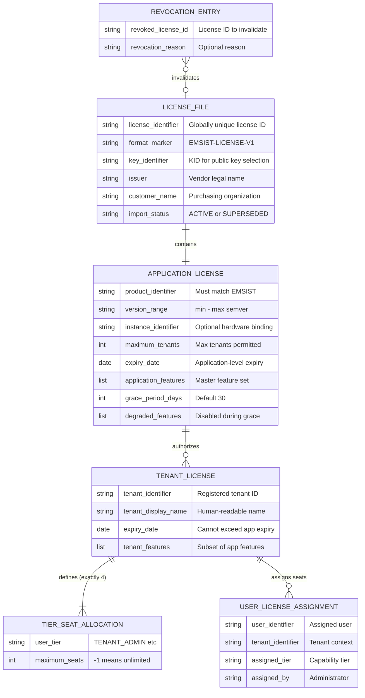

---

## On-Premise Licensing: Business Processes

### License Generation (Vendor Side -- Out of Scope for Code)

The vendor operates a License Generation Tool (not part of the EMSIST platform). This process is documented here for business context only.

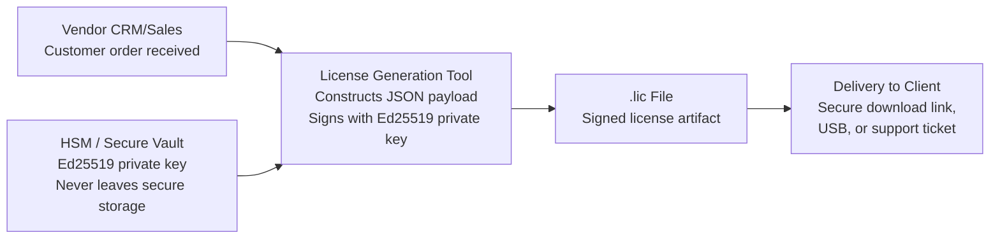

**Source:** ADR-015 Section 2.1

---

### License Import (Client Side)

The master tenant superadmin imports the license file into the running EMSIST installation.

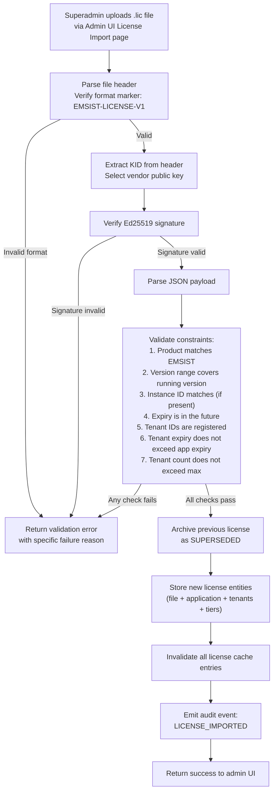

**Import Validation Checks (in order):**

| Step | Check | Failure Response |
|------|-------|-----------------|
| 1 | File starts with `EMSIST-LICENSE-V1` | Invalid license file format |
| 2 | Payload and signature can be extracted | Malformed license file |
| 3 | Ed25519 signature is valid | License signature verification failed |
| 4 | Format version is supported | Unsupported license format version |
| 5 | Product identifier matches this installation | License is for a different product |
| 6 | Version range includes running version | License not valid for this application version |
| 7 | Instance identifier matches (if present) | License is bound to a different instance |
| 8 | Expiry date is in the future | License has already expired |
| 9 | All tenant identifiers are registered | Unknown tenant ID |
| 10 | No tenant expiry exceeds application expiry | Tenant expiry exceeds application expiry |
| 11 | Tenant count does not exceed maximum tenants | License exceeds max tenant count |

**Source:** ADR-015 Section 2.3

---

### License Startup Validation

When the application starts, the license-service validates the stored license.

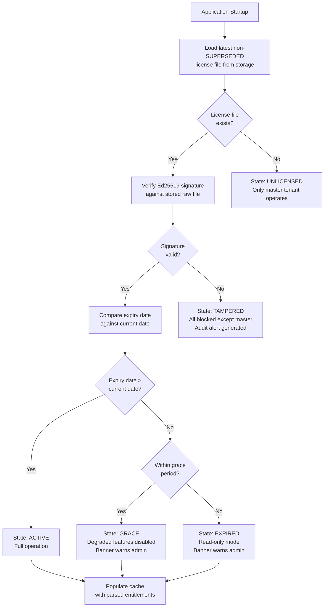

**Source:** ADR-015 Section 3.2

---

### License Renewal

Renewal is handled identically to initial import -- the vendor generates a new `.lic` file with updated expiry dates and/or entitlements, and the client admin imports it via the same UI.

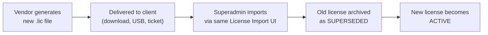

**Source:** ADR-015 Section 2.4

---

### License Revocation

True real-time revocation is not possible without internet connectivity. Revocation is achieved through the following mechanisms.

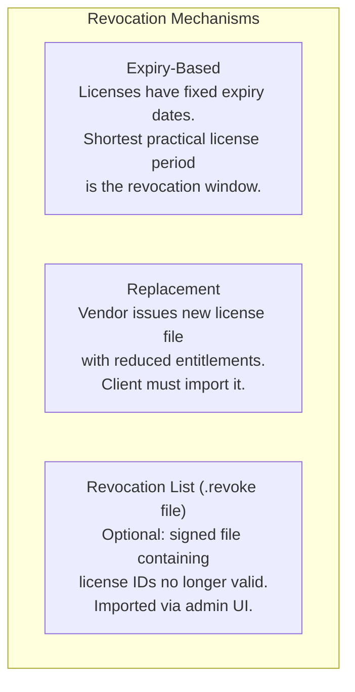

**Source:** ADR-015 Section 2.5

---

### Seat Assignment (Runtime)

Tenant-Admin assigns users to capability tiers within their tenant.

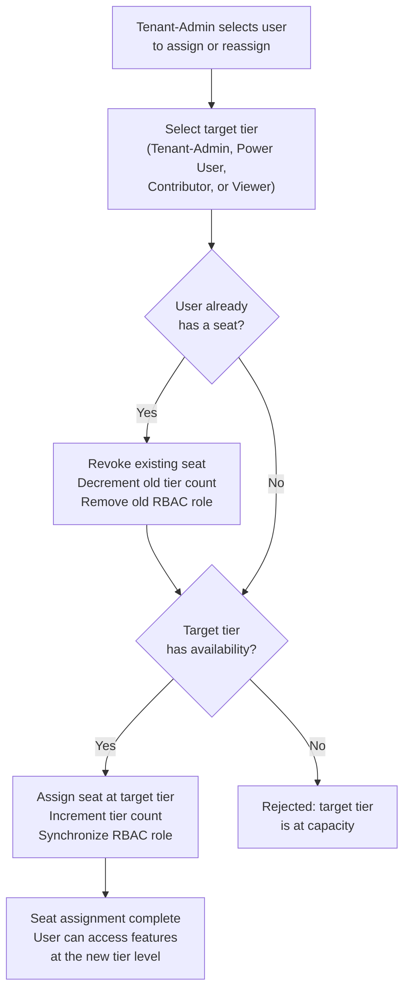

**Source:** REQ-LIC-001 BR-120 through BR-125

---

### Key Rotation

When the vendor rotates the signing key, the application must support verification of licenses signed with both old and new keys.

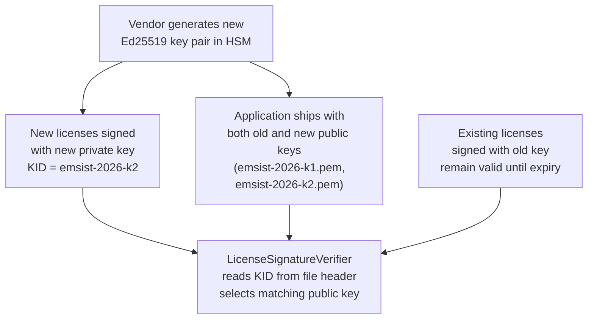

**Key Management Rules:**

| Key | Location | Access | Rotation Frequency |
|-----|----------|--------|--------------------|
| Ed25519 **private** key | Vendor HSM / hardware security module | License Generation Tool only. Never leaves HSM. Never in source control. | Every 2 years. Old key retained for existing licenses. |
| Ed25519 **public** key | Embedded in application as resource file | Read-only at runtime | Distributed with application updates. Multiple keys supported via KID. |

**Source:** ADR-015 Section 5.2

---

## On-Premise Licensing: State Transitions

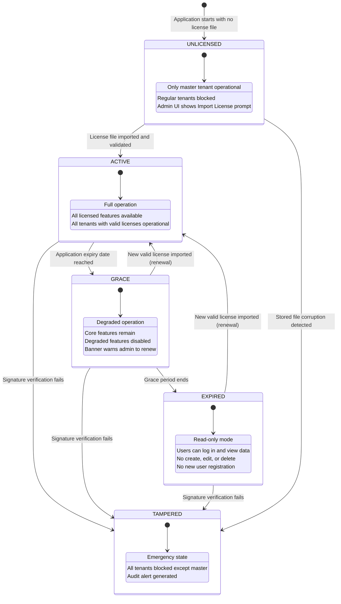

**Source:** ADR-015 Section 3.4

---

## On-Premise Licensing: Feature Gating Integration

The licensing domain integrates with the RBAC domain via the hybrid authorization model defined in ADR-014.

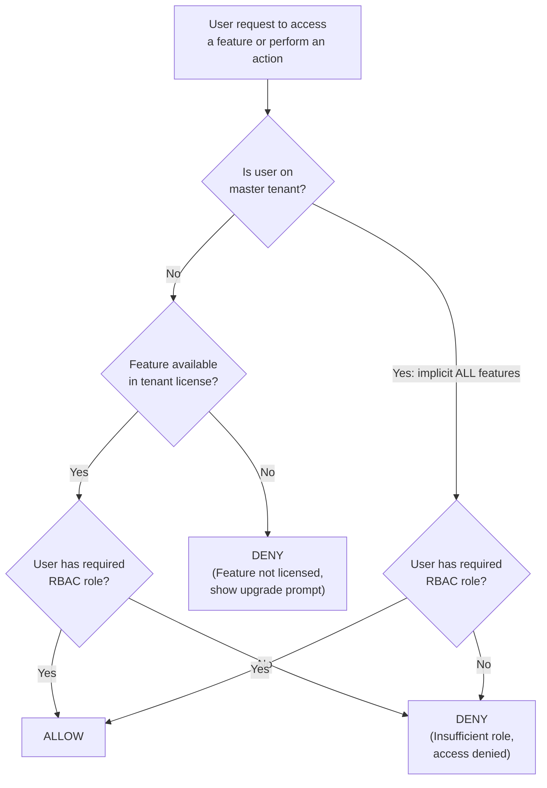

**Key principles (Source: ADR-014):**
- Licensing determines WHICH features/modules are available to a tenant
- RBAC determines WHAT operations a user can perform within those features
- The master tenant has implicit access to all features (no license required)
- The backend is the authoritative enforcement plane; the frontend is advisory only

---

## On-Premise Licensing: Feature Matrix

Features map to availability as follows (Source: ADR-014 Section 6):

| Feature Key | Description | Required License |
|-------------|-------------|-----------------|
| `basic_workflows` | Process Modeler page visible | Included in all tenant licenses |
| `basic_reports` | Reports section visible | Included in all tenant licenses |
| `email_notifications` | Notification preferences visible | Included in all tenant licenses |
| `advanced_workflows` | Advanced BPMN elements enabled | Per tenant license feature set |
| `advanced_reports` | Custom report builder enabled | Per tenant license feature set |
| `api_access` | API key management section visible | Per tenant license feature set |
| `webhooks` | Webhook configuration visible | Per tenant license feature set |
| `ai_persona` | AI Assistant page visible | Per tenant license feature set |
| `custom_branding` | Branding section in admin page | Per tenant license feature set |
| `sso_integration` | Identity provider management in admin page | Per tenant license feature set |
| `audit_logs` | Audit trail page visible | Per tenant license feature set |
| `priority_support` | Support ticket priority option | Per tenant license feature set |

**Note:** In the on-premise model, there are no predefined product tiers (Starter/Pro/Enterprise). The vendor configures the exact feature set per tenant in the license file. This provides maximum flexibility for enterprise sales negotiations.

---

## Relationship Diagram

Database-specific Mermaid ERDs are maintained in the physical model documents:

- EMS application database (Neo4j): [neo4j-ems-db.md](./neo4j-ems-db.md)
- Keycloak internal database (PostgreSQL): [keycloak-postgresql-db.md](./keycloak-postgresql-db.md)

Legacy split schema files remain available for compatibility, but the two files above are authoritative.

The diagram below is a cross-domain conceptual relationship view.

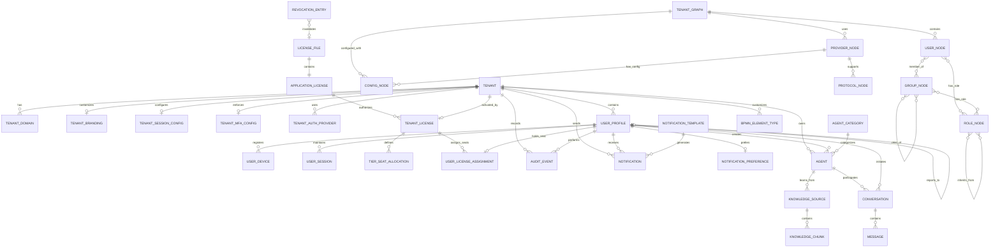

---

## Business Rules Summary

| ID | Rule | Entities Affected | Domain |
|----|------|-------------------|--------|
| BR-T001 | Tenant slug must be globally unique | Tenant | Tenant |
| BR-T002 | Tenant cannot be deleted if status is ACTIVE | Tenant | Tenant |
| BR-T003 | MASTER tenant type has platform-wide administrative privileges | Tenant | Tenant |
| BR-T004 | Protected tenants cannot be deleted or suspended | Tenant | Tenant |
| BR-T005 | Tenant features and seat limits determined by Tenant License from imported license file | Tenant, Tenant License | Tenant |
| BR-TD001 | Domain must be globally unique across all tenants | Tenant Domain | Tenant |
| BR-TD002 | At least one domain must be primary per tenant | Tenant Domain | Tenant |
| BR-TD003 | Domain must be verified before users can authenticate via it | Tenant Domain | Tenant |
| BR-TB001 | Each tenant can have only one branding configuration | Tenant Branding | Tenant |
| BR-TS001 | accessTokenLifetime must be less than refreshTokenLifetime | Tenant Session Config | Tenant |
| BR-TS002 | idleTimeout must be less than absoluteTimeout | Tenant Session Config | Tenant |
| BR-TM001 | If required is true, enabled must also be true | Tenant MFA Config | Tenant |
| BR-TM002 | At least one method must be in allowedMethods | Tenant MFA Config | Tenant |
| BR-TP001 | At least one authentication provider must be enabled per tenant | Tenant Auth Provider | Tenant |
| BR-TP002 | Only one provider can be primary at a time | Tenant Auth Provider | Tenant |
| BR-UP001 | Email must be unique within a tenant | User Profile | IAM |
| BR-UP002 | keycloakId must be globally unique | User Profile | IAM |
| BR-UP003 | User cannot have status ACTIVE if tenant status is SUSPENDED | User Profile, Tenant | IAM |
| BR-UP004 | Password must be changed if passwordExpiresAt is past | User Profile | IAM |
| BR-UP005 | Account auto-locks after threshold failed login attempts | User Profile | IAM |
| BR-UN001 | User can only belong to groups within same tenant | User Node, Group Node | IAM |
| BR-UN002 | User inherits all roles from groups they belong to | User Node, Group Node, Role Node | IAM |
| BR-UN003 | Role resolution traverses group hierarchy and role inheritance | User Node, Group Node, Role Node | IAM |
| BR-UD001 | Fingerprint must be unique per user | User Device | IAM |
| BR-US001 | Session count per user cannot exceed tenant's maxConcurrentSessions | User Session, Tenant Session Config | IAM |
| BR-US002 | Session must respect tenant idle and absolute timeouts | User Session, Tenant Session Config | IAM |
| BR-RN001 | System roles cannot be deleted or modified | Role Node | IAM |
| BR-RN002 | Role inheritance must not create cycles | Role Node | IAM |
| BR-RN003 | Effective permissions include inherited permissions transitively | Role Node | IAM |
| BR-GN001 | Group name must be unique within tenant | Group Node | IAM |
| BR-GN002 | System groups cannot be deleted | Group Node | IAM |
| BR-GN003 | Users inherit all roles from groups and parent groups | User Node, Group Node | IAM |
| BR-GN004 | Group hierarchy must not create cycles | Group Node | IAM |
| BR-LF001 | Only one license file may be ACTIVE per installation | License File | Licensing |
| BR-LF002 | License file must pass Ed25519 signature verification | License File | Licensing |
| BR-LF003 | File must start with "EMSIST-LICENSE-V1" format marker | License File | Licensing |
| BR-LF004 | Importing new license archives previous with SUPERSEDED status | License File | Licensing |
| BR-LF005 | All imported license files are retained for audit | License File | Licensing |
| BR-LF008 | Only SUPER_ADMIN on master tenant may import license files | License File | Licensing |
| BR-AL001 | Exactly one application license may be active per installation | Application License | Licensing |
| BR-AL002 | Product identifier must match running application | Application License | Licensing |
| BR-AL003 | Running version must fall within min-max version range | Application License | Licensing |
| BR-AL005 | Expiry date must be in the future at import time | Application License | Licensing |
| BR-AL006 | Tenant license count must not exceed maximum tenants | Application License | Licensing |
| BR-AL007 | Application feature set is the ceiling for all tenants | Application License | Licensing |
| BR-TL001 | Tenant identifiers must correspond to registered tenants | Tenant License | Licensing |
| BR-TL002 | Tenant expiry must not exceed application expiry | Tenant License, Application License | Licensing |
| BR-TL003 | Tenant features must be subset of application features | Tenant License, Application License | Licensing |
| BR-TL004 | Expired tenant license blocks new logins for that tenant | Tenant License | Licensing |
| BR-TL006 | Each tenant must have at least 1 Tenant-Admin seat | Tenant License, Tier Seat Allocation | Licensing |
| BR-TSA001 | Each tenant license has exactly four tier seat allocations | Tier Seat Allocation | Licensing |
| BR-TSA003 | Maximum seats of -1 means unlimited | Tier Seat Allocation | Licensing |
| BR-ULA001 | User can hold at most one seat tier per tenant | User License Assignment | Licensing |
| BR-ULA002 | Seat assignment rejected if tier is at capacity | User License Assignment, Tier Seat Allocation | Licensing |
| BR-ULA003 | Revoking seat does not delete user | User License Assignment | Licensing |
| BR-ULA005 | Seat assignment synchronizes RBAC role | User License Assignment, Role Node | Licensing |
| BR-ULA007 | SUPER_ADMIN does not consume seats | User License Assignment | Licensing |
| BR-LS001 | License state computed at startup and daily | License State | Licensing |
| BR-LS004 | Master tenant always exempt from license state | License State | Licensing |
| BR-UT002 | Role inheritance: higher tiers inherit lower tier capabilities | User Tier, Role Node | Licensing |
| BR-UT003 | Tier assignment drives role assignment (synchronized) | User Tier, User License Assignment | Licensing |
| BR-RE001 | Revocation entries verified via Ed25519 signature | Revocation Entry | Licensing |
| BR-RE002 | Matching revocation immediately expires active license | Revocation Entry, License File | Licensing |
| BR-AE001 | Audit events are immutable (no updates or deletes) | Audit Event | Operations |
| BR-AE002 | Events must be retained per compliance requirements | Audit Event | Operations |
| BR-NO001 | Respect user notification preferences | Notification, Notification Preference | Operations |
| BR-NO002 | Retry failed notifications up to maxRetries | Notification | Operations |
| BR-NO003 | SYSTEM notifications cannot be opted out | Notification, Notification Preference | Operations |
| BR-NT001 | Template code must be unique per tenant | Notification Template | Operations |
| BR-NT002 | System templates cannot be deleted | Notification Template | Operations |
| BR-NP001 | Each user has one preference record per tenant | Notification Preference | Operations |
| BR-AG001 | systemPrompt is required for agent functionality | Agent | AI |
| BR-AG002 | System agents cannot be deleted | Agent | AI |
| BR-AG003 | ragEnabled requires at least one knowledge source | Agent, Knowledge Source | AI |
| BR-CV001 | Conversations are isolated per user (not shared) | Conversation | AI |
| BR-CV002 | Archived conversations are read-only | Conversation | AI |
| BR-MS001 | Messages are immutable after creation | Message | AI |
| BR-KS001 | filePath required for FILE sourceType | Knowledge Source | AI |
| BR-KS002 | url required for URL sourceType | Knowledge Source | AI |
| BR-KS003 | Source must be processed before use in RAG | Knowledge Source | AI |
| BR-KC001 | Embedding must be generated before use in search | Knowledge Chunk | AI |
| BR-BE001 | code must be unique within tenant (and global scope) | BPMN Element Type | Process |
| BR-BE002 | Tenant types override system defaults | BPMN Element Type | Process |

---

## Glossary

| Term | Definition |
|------|------------|
| **Tenant** | An organization or business unit using the EMSIST platform |
| **Master Tenant** | The platform administration tenant used for initial setup and license management. Exempt from licensing. |
| **Seat** | A license allocation for one user at a specific capability tier |
| **User Tier** | Business capability level (Tenant-Admin, Power User, Contributor, Viewer) mapped to an RBAC role |
| **License File** | A cryptographically signed `.lic` file containing the full license hierarchy, delivered by the vendor |
| **Application License** | Top-level entitlement for the entire EMSIST installation, extracted from the license file |
| **Tenant License** | Per-tenant entitlement defining features and seat allocations, extracted from the license file |
| **Grace Period** | Time window after license expiry during which the system operates in degraded mode (default 30 days) |
| **Ed25519** | Elliptic curve digital signature algorithm (RFC 8032) used for license file integrity verification |
| **KID** | Key Identifier -- a tag in the license file header that selects which vendor public key to use for verification |
| **Role** | A named set of permissions that can be assigned to users or groups |
| **Group** | A collection of users that share common role assignments |
| **MFA** | Multi-Factor Authentication |
| **RBAC** | Role-Based Access Control |
| **RAG** | Retrieval-Augmented Generation (AI knowledge enhancement) |
| **OIDC** | OpenID Connect (authentication protocol) |
| **SAML** | Security Assertion Markup Language (enterprise SSO protocol) |
| **BPMN** | Business Process Model and Notation |
| **HSM** | Hardware Security Module -- secure hardware for cryptographic key storage (vendor side) |

---

## Document History

| Version | Date | Author | Changes |
|---------|------|--------|---------|
| 2.0 | 2026-02-27 | BA Agent | Replaced SaaS Licensing & Subscription domain with On-Premise Cryptographic Licensing domain per ADR-015. New entities: License File, Application License, Tenant License (restructured), Tier Seat Allocation, User License Assignment (restructured), Revocation Entry, License State, User Tier. Removed SaaS entities: License Product, License Feature. Updated all business rules, relationships, and glossary. |
| 1.0 | 2026-02-25 | BA Agent | Initial domain model based on codebase analysis |

---

## Next Steps

This business domain model should be transformed by the SA (Solution Architect) Agent into:

1. **Canonical Data Model** (`docs/data-models/CANONICAL-DATA-MODEL.md`)
   - Add technical data types (Java types, PostgreSQL column types)
   - Define primary/foreign keys and unique constraints
   - Specify indexes for performance
   - Map entities to the `license-service` service boundary (PostgreSQL per ADR-016)
   - Define API DTOs for license import, seat assignment, and feature gating

2. **Physical Schema** (by DBA Agent)
   - PostgreSQL tables for: `license_file`, `application_license`, `tenant_license`, `tier_seat_allocation`, `user_license_assignment`, `revocation_entry`
   - Flyway migration scripts under `/backend/license-service/src/main/resources/db/migration/`
   - Database constraints enforcing business rules (BR-TL002, BR-TSA002, BR-ULA001, etc.)
   - Index strategy for seat validation queries (high-frequency path)

3. **Implementation** (by DEV Agent)
   - JPA entity classes in `license-service` domain package
   - `LicenseImportController` and `LicenseImportService`
   - `LicenseSignatureVerifier` (Ed25519)
   - `LicenseStateHolder` and `LicenseScheduledValidator`
   - Extend `SeatValidationServiceImpl` for tier-based seat checks
   - Frontend License Import page in `/frontend/src/app/pages/administration/sections/license-manager/`
