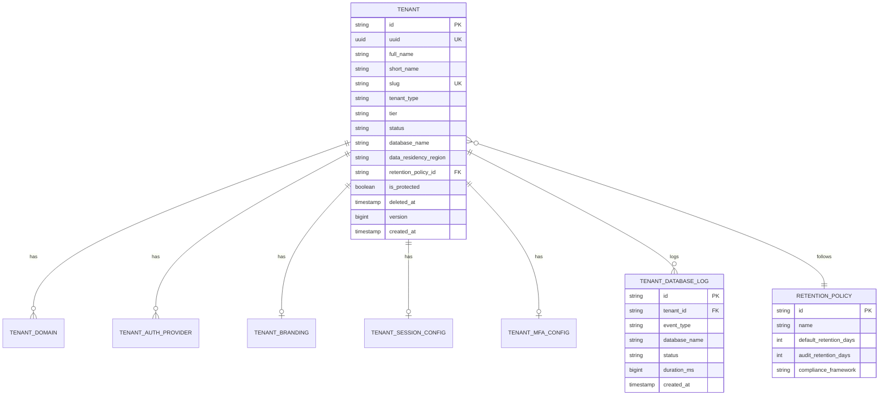
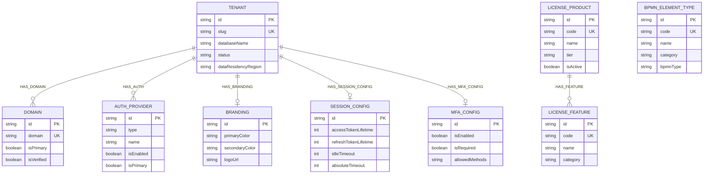
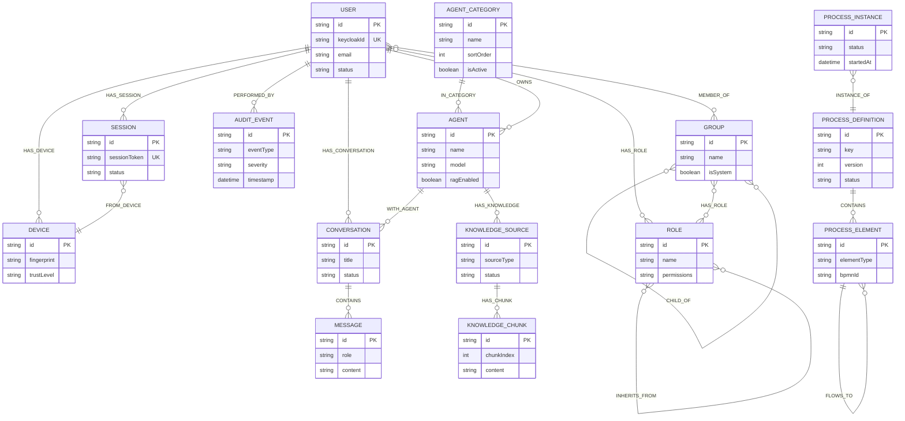

# Graph-per-Tenant Data Models

> Legacy strategy document. For the canonical per-database standard, use [neo4j-ems-db.md](./neo4j-ems-db.md) and [keycloak-postgresql-db.md](./keycloak-postgresql-db.md).

**Document Type:** Data Model Specification
**Version:** 1.0
**Date:** 2026-02-25
**Author:** SA Agent
**Traceability:** [Graph-per-Tenant LLD](/docs/lld/graph-per-tenant-lld.md)

---

## Overview

This document defines the data models for graph-per-tenant multi-tenancy, covering:
1. PostgreSQL tenant registry extensions
2. Neo4j master graph (system database)
3. Neo4j tenant graph template
4. Provisioning and audit schemas

---

## 1. PostgreSQL Tenant Registry

### 1.1 Enhanced Tenants Table

```sql
-- Tenant table with graph-per-tenant extensions
CREATE TABLE tenants (
    -- Identity
    id VARCHAR(50) PRIMARY KEY,
    uuid UUID NOT NULL UNIQUE,
    full_name VARCHAR(255) NOT NULL,
    short_name VARCHAR(100) NOT NULL,
    slug VARCHAR(100) NOT NULL UNIQUE,
    description TEXT,
    logo_url VARCHAR(500),

    -- Classification
    tenant_type VARCHAR(20) NOT NULL,  -- MASTER, DOMINANT, REGULAR
    tier VARCHAR(20) NOT NULL,          -- FREE, STANDARD, PROFESSIONAL, ENTERPRISE
    status VARCHAR(20) NOT NULL,        -- See TenantStatus enum

    -- Identity Provider
    keycloak_realm VARCHAR(100),

    -- Graph-per-Tenant Fields
    database_name VARCHAR(100),         -- Neo4j database name (tenant_{slug})
    data_residency_region VARCHAR(20) DEFAULT 'UAE',  -- UAE, EU, US, APAC
    retention_policy_id VARCHAR(50) REFERENCES retention_policies(id),

    -- Protection
    is_protected BOOLEAN NOT NULL DEFAULT FALSE,

    -- Deletion Tracking
    deleted_at TIMESTAMP,
    grace_period_expires_at TIMESTAMP,
    deletion_requested_by VARCHAR(50),
    deletion_confirmation_code VARCHAR(10),

    -- Backup Tracking
    last_backup_at TIMESTAMP,

    -- Audit
    version BIGINT NOT NULL DEFAULT 0,
    created_at TIMESTAMP NOT NULL DEFAULT CURRENT_TIMESTAMP,
    updated_at TIMESTAMP NOT NULL DEFAULT CURRENT_TIMESTAMP,
    created_by VARCHAR(50),

    -- Constraints
    CONSTRAINT chk_tenant_type CHECK (tenant_type IN ('MASTER', 'DOMINANT', 'REGULAR')),
    CONSTRAINT chk_tier CHECK (tier IN ('FREE', 'STANDARD', 'PROFESSIONAL', 'ENTERPRISE')),
    CONSTRAINT chk_status CHECK (status IN (
        'PENDING', 'PROVISIONING', 'PROVISIONING_FAILED', 'ACTIVE',
        'SUSPENDED', 'LOCKED', 'DELETION_PENDING', 'DELETION_FAILED',
        'RESTORING', 'DELETED'
    )),
    CONSTRAINT chk_region CHECK (data_residency_region IN ('UAE', 'EU', 'US', 'APAC'))
);

-- Indexes
CREATE INDEX idx_tenant_status ON tenants(status);
CREATE INDEX idx_tenant_slug ON tenants(slug);
CREATE INDEX idx_tenant_database_name ON tenants(database_name);
CREATE INDEX idx_tenant_data_residency ON tenants(data_residency_region);
CREATE INDEX idx_tenant_deleted_at ON tenants(deleted_at);
```

### 1.2 TenantStatus Enum

| Status | Description |
|--------|-------------|
| `PENDING` | Initial state, awaiting provisioning |
| `PROVISIONING` | Database creation in progress |
| `PROVISIONING_FAILED` | Database creation failed |
| `ACTIVE` | Fully operational |
| `SUSPENDED` | Temporarily disabled (billing, admin action) |
| `LOCKED` | Security lock (breach, compliance) |
| `DELETION_PENDING` | Grace period before deletion |
| `DELETION_FAILED` | Database deletion failed |
| `RESTORING` | Restore from backup in progress |
| `DELETED` | Soft-deleted, database dropped |

### 1.3 Retention Policies Table

```sql
CREATE TABLE retention_policies (
    id VARCHAR(50) PRIMARY KEY,
    name VARCHAR(100) NOT NULL,
    description TEXT,

    -- Retention periods (days)
    default_retention_days INTEGER NOT NULL,
    audit_retention_days INTEGER,
    conversation_retention_days INTEGER,
    notification_retention_days INTEGER,
    process_retention_days INTEGER,

    -- Compliance
    compliance_framework VARCHAR(50),  -- GDPR, SOC2, HIPAA, UAE_GOV

    -- Audit
    created_at TIMESTAMP DEFAULT CURRENT_TIMESTAMP,
    updated_at TIMESTAMP DEFAULT CURRENT_TIMESTAMP
);

-- Default policies
INSERT INTO retention_policies VALUES
    ('policy-1year', '1-Year Standard', 'Standard retention for most data', 365, 365, 365, 90, 365, 'DEFAULT'),
    ('policy-3year', '3-Year Business', 'Extended retention for business compliance', 1095, 2555, 365, 365, 1095, 'SOC2'),
    ('policy-7year', '7-Year Compliance', 'Full compliance retention', 2555, 2555, 2555, 365, 2555, 'GDPR'),
    ('policy-uae-gov', 'UAE Government', 'UAE government compliance', 2555, 2555, 2555, 730, 2555, 'UAE_GOV');
```

### 1.4 Database Provisioning Logs

```sql
CREATE TABLE tenant_database_logs (
    id VARCHAR(50) PRIMARY KEY,
    tenant_id VARCHAR(50) NOT NULL REFERENCES tenants(id),

    -- Event details
    event_type VARCHAR(50) NOT NULL,  -- See EventType enum
    database_name VARCHAR(100),
    status VARCHAR(20) NOT NULL,       -- PENDING, IN_PROGRESS, COMPLETED, FAILED

    -- Execution details
    message TEXT,
    requested_by VARCHAR(50),
    duration_ms BIGINT,

    -- Additional context
    metadata JSONB,

    -- Timestamp
    created_at TIMESTAMP DEFAULT CURRENT_TIMESTAMP
);

-- Event types
-- PROVISION_STARTED, PROVISION_COMPLETED, PROVISION_FAILED
-- SCHEMA_APPLIED, SEED_DATA_INSERTED
-- DELETE_STARTED, DELETE_COMPLETED, DELETE_FAILED
-- BACKUP_STARTED, BACKUP_COMPLETED, BACKUP_FAILED
-- RESTORE_STARTED, RESTORE_COMPLETED, RESTORE_FAILED
-- MIGRATION_STARTED, MIGRATION_COMPLETED, MIGRATION_FAILED

CREATE INDEX idx_db_log_tenant ON tenant_database_logs(tenant_id);
CREATE INDEX idx_db_log_type ON tenant_database_logs(event_type);
CREATE INDEX idx_db_log_created ON tenant_database_logs(created_at);
```

### 1.5 Entity Relationship Diagram



---

## 2. Neo4j Master Graph (system database)

The master graph contains system-wide data and tenant routing information.

### 2.0 Entity Relationship Diagram (Mermaid)



### 2.1 Node Labels

#### Tenant (Routing Reference)

```cypher
(:Tenant {
    id: String,            -- PK from PostgreSQL (tenant-abc123)
    slug: String,          -- URL-safe identifier (unique)
    databaseName: String,  -- Neo4j database name (tenant_{slug})
    status: String,        -- Current status
    dataResidencyRegion: String,  -- UAE, EU, US, APAC
    createdAt: DateTime,
    updatedAt: DateTime
})

-- Constraints
CREATE CONSTRAINT tenant_id FOR (t:Tenant) REQUIRE t.id IS UNIQUE;
CREATE CONSTRAINT tenant_slug FOR (t:Tenant) REQUIRE t.slug IS UNIQUE;

-- Indexes
CREATE INDEX tenant_status FOR (t:Tenant) ON (t.status);
CREATE INDEX tenant_region FOR (t:Tenant) ON (t.dataResidencyRegion);
```

#### LicenseProduct (Catalog)

```cypher
(:LicenseProduct {
    id: String,           -- Product ID
    code: String,         -- Product code (unique)
    name: String,         -- Display name
    description: String,
    tier: String,         -- FREE, STANDARD, PROFESSIONAL, ENTERPRISE
    baseSeats: Integer,   -- Default seat count
    pricePerSeat: Float,  -- Monthly price per seat
    isActive: Boolean,
    createdAt: DateTime
})

-- Constraints
CREATE CONSTRAINT license_product_code FOR (lp:LicenseProduct) REQUIRE lp.code IS UNIQUE;
```

#### LicenseFeature

```cypher
(:LicenseFeature {
    id: String,
    code: String,         -- Feature code (unique)
    name: String,
    description: String,
    category: String,     -- AI, PROCESS, ADMIN, ANALYTICS
    isActive: Boolean
})

-- Constraints
CREATE CONSTRAINT license_feature_code FOR (lf:LicenseFeature) REQUIRE lf.code IS UNIQUE;
```

#### BpmnElementType

```cypher
(:BpmnElementType {
    id: String,
    code: String,         -- Element code (unique)
    name: String,
    description: String,
    category: String,     -- EVENT, TASK, GATEWAY, SUBPROCESS, DATA, ARTIFACT
    bpmnType: String,     -- bpmn:UserTask, bpmn:ServiceTask, etc.
    icon: String,
    color: String,
    sortOrder: Integer,
    isActive: Boolean
})

-- Constraints
CREATE CONSTRAINT bpmn_element_code FOR (b:BpmnElementType) REQUIRE b.code IS UNIQUE;
```

### 2.2 Relationships

| Relationship | From | To | Properties |
|--------------|------|-----|------------|
| `HAS_FEATURE` | LicenseProduct | LicenseFeature | - |

### 2.3 Sample Data

```cypher
// License Products
CREATE (pro:LicenseProduct {
    id: 'prod-professional',
    code: 'EMS_PROFESSIONAL',
    name: 'EMS Professional',
    description: 'Full-featured enterprise plan',
    tier: 'PROFESSIONAL',
    baseSeats: 50,
    pricePerSeat: 25.00,
    isActive: true,
    createdAt: datetime()
})

CREATE (ent:LicenseProduct {
    id: 'prod-enterprise',
    code: 'EMS_ENTERPRISE',
    name: 'EMS Enterprise',
    description: 'Unlimited enterprise plan with premium support',
    tier: 'ENTERPRISE',
    baseSeats: 100,
    pricePerSeat: 45.00,
    isActive: true,
    createdAt: datetime()
})

// Features
CREATE (ai:LicenseFeature {id: 'feat-ai', code: 'AI_CHATBOT', name: 'AI Chatbot', category: 'AI'})
CREATE (rag:LicenseFeature {id: 'feat-rag', code: 'RAG_ENGINE', name: 'RAG Engine', category: 'AI'})
CREATE (bpmn:LicenseFeature {id: 'feat-bpmn', code: 'BPMN_DESIGNER', name: 'BPMN Designer', category: 'PROCESS'})
CREATE (audit:LicenseFeature {id: 'feat-audit', code: 'AUDIT_TRAIL', name: 'Audit Trail', category: 'ADMIN'})

// Product-Feature relationships
CREATE (pro)-[:HAS_FEATURE]->(ai)
CREATE (pro)-[:HAS_FEATURE]->(bpmn)
CREATE (pro)-[:HAS_FEATURE]->(audit)
CREATE (ent)-[:HAS_FEATURE]->(ai)
CREATE (ent)-[:HAS_FEATURE]->(rag)
CREATE (ent)-[:HAS_FEATURE]->(bpmn)
CREATE (ent)-[:HAS_FEATURE]->(audit)
```

---

## 3. Neo4j Tenant Graph Template (tenant_{slug} database)

Each tenant database contains the following schema, applied during provisioning.

### 3.0 Entity Relationship Diagram (Mermaid)



### 3.1 User Management

#### User

```cypher
(:User {
    id: String,              -- User ID (unique)
    keycloakId: String,      -- Keycloak subject ID (unique)
    email: String,           -- Email address (indexed)
    emailVerified: Boolean,
    firstName: String,
    lastName: String,
    displayName: String,
    jobTitle: String,
    department: String,
    phone: String,
    mobile: String,
    officeLocation: String,
    employeeId: String,
    employeeType: String,    -- FULL_TIME, CONTRACTOR, INTERN
    avatarUrl: String,
    timezone: String,
    locale: String,
    mfaEnabled: Boolean,
    mfaMethods: [String],
    passwordLastChanged: DateTime,
    passwordExpiresAt: DateTime,
    accountLocked: Boolean,
    lockoutEnd: DateTime,
    failedLoginAttempts: Integer,
    lastLoginAt: DateTime,
    lastLoginIp: String,
    status: String,          -- ACTIVE, INACTIVE, LOCKED
    createdAt: DateTime,
    updatedAt: DateTime
})

-- Constraints and indexes
CREATE CONSTRAINT user_id FOR (u:User) REQUIRE u.id IS UNIQUE;
CREATE CONSTRAINT user_keycloak FOR (u:User) REQUIRE u.keycloakId IS UNIQUE;
CREATE INDEX user_email FOR (u:User) ON (u.email);
CREATE INDEX user_status FOR (u:User) ON (u.status);
```

#### Device

```cypher
(:Device {
    id: String,
    fingerprint: String,
    deviceName: String,
    deviceType: String,      -- DESKTOP, MOBILE, TABLET, OTHER
    osName: String,
    osVersion: String,
    browserName: String,
    browserVersion: String,
    trustLevel: String,      -- UNKNOWN, UNTRUSTED, TRUSTED, VERIFIED
    isApproved: Boolean,
    approvedAt: DateTime,
    firstSeenAt: DateTime,
    lastSeenAt: DateTime,
    lastIpAddress: String,
    lastLocation: Map,       -- {city, country, lat, lng}
    loginCount: Integer,
    createdAt: DateTime,
    updatedAt: DateTime
})

CREATE CONSTRAINT device_id FOR (d:Device) REQUIRE d.id IS UNIQUE;
CREATE INDEX device_fingerprint FOR (d:Device) ON (d.fingerprint);
```

#### Session

```cypher
(:Session {
    id: String,
    sessionToken: String,
    refreshTokenId: String,
    ipAddress: String,
    userAgent: String,
    location: Map,
    createdAt: DateTime,
    lastActivity: DateTime,
    expiresAt: DateTime,
    isRemembered: Boolean,
    mfaVerified: Boolean,
    status: String,          -- ACTIVE, EXPIRED, REVOKED
    revokedAt: DateTime,
    revokeReason: String
})

CREATE CONSTRAINT session_id FOR (s:Session) REQUIRE s.id IS UNIQUE;
CREATE INDEX session_status FOR (s:Session) ON (s.status);
```

#### User Relationships

```cypher
(:User)-[:REPORTS_TO]->(:User)
(:User)-[:HAS_DEVICE]->(:Device)
(:User)-[:HAS_SESSION]->(:Session)
(:Session)-[:FROM_DEVICE]->(:Device)
```

### 3.2 RBAC (Role-Based Access Control)

#### Role

```cypher
(:Role {
    id: String,
    name: String,            -- Role name (indexed)
    description: String,
    permissions: [String],   -- Permission strings
    isSystem: Boolean,       -- System role (cannot be deleted)
    createdAt: DateTime,
    updatedAt: DateTime
})

CREATE CONSTRAINT role_id FOR (r:Role) REQUIRE r.id IS UNIQUE;
CREATE INDEX role_name FOR (r:Role) ON (r.name);
```

#### Group

```cypher
(:Group {
    id: String,
    name: String,            -- Group name (indexed)
    description: String,
    isActive: Boolean,
    createdAt: DateTime,
    updatedAt: DateTime
})

CREATE CONSTRAINT group_id FOR (g:Group) REQUIRE g.id IS UNIQUE;
CREATE INDEX group_name FOR (g:Group) ON (g.name);
```

#### RBAC Relationships

```cypher
(:User)-[:MEMBER_OF {since: DateTime, expiresAt: DateTime}]->(:Group)
(:User)-[:HAS_ROLE {assignedAt: DateTime, assignedBy: String}]->(:Role)
(:Group)-[:HAS_ROLE {assignedAt: DateTime, assignedBy: String}]->(:Role)
(:Role)-[:INHERITS_FROM]->(:Role)
```

### 3.3 Audit & Compliance

#### AuditEvent

```cypher
(:AuditEvent {
    id: String,
    eventType: String,       -- AUTH_LOGIN, DATA_READ, ADMIN_CREATE, etc.
    eventCategory: String,   -- AUTH, DATA, ADMIN
    severity: String,        -- INFO, WARNING, ERROR, CRITICAL
    message: String,
    resourceType: String,    -- User, Agent, Process, etc.
    resourceId: String,
    resourceName: String,
    action: String,          -- CREATE, READ, UPDATE, DELETE
    outcome: String,         -- SUCCESS, FAILURE
    failureReason: String,
    oldValues: Map,
    newValues: Map,
    ipAddress: String,
    userAgent: String,
    requestId: String,
    correlationId: String,
    serviceName: String,
    serviceVersion: String,
    metadata: Map,
    timestamp: DateTime,
    expiresAt: DateTime      -- For retention policy
})

CREATE CONSTRAINT audit_id FOR (a:AuditEvent) REQUIRE a.id IS UNIQUE;
CREATE INDEX audit_timestamp FOR (a:AuditEvent) ON (a.timestamp);
CREATE INDEX audit_type FOR (a:AuditEvent) ON (a.eventType);
CREATE INDEX audit_category FOR (a:AuditEvent) ON (a.eventCategory);
```

#### Audit Relationships

```cypher
(:AuditEvent)-[:PERFORMED_BY]->(:User)
(:AuditEvent)-[:AFFECTED {resourceType: String, resourceId: String}]->(anyNode)
```

### 3.4 AI Services

#### Agent

```cypher
(:Agent {
    id: String,
    name: String,
    description: String,
    avatarUrl: String,
    systemPrompt: String,
    greetingMessage: String,
    conversationStarters: [String],
    provider: String,        -- OPENAI, ANTHROPIC, GEMINI, OLLAMA
    model: String,           -- gpt-4, claude-3, etc.
    modelConfig: Map,        -- {temperature, maxTokens, etc.}
    ragEnabled: Boolean,
    isPublic: Boolean,
    isSystem: Boolean,
    status: String,          -- ACTIVE, INACTIVE, DELETED
    usageCount: Integer,
    createdAt: DateTime,
    updatedAt: DateTime
})

CREATE CONSTRAINT agent_id FOR (ag:Agent) REQUIRE ag.id IS UNIQUE;
CREATE INDEX agent_name FOR (ag:Agent) ON (ag.name);
CREATE INDEX agent_status FOR (ag:Agent) ON (ag.status);
```

#### AgentCategory

```cypher
(:AgentCategory {
    id: String,
    name: String,
    description: String,
    icon: String,
    sortOrder: Integer,
    isActive: Boolean,
    createdAt: DateTime
})

CREATE CONSTRAINT agent_category_id FOR (ac:AgentCategory) REQUIRE ac.id IS UNIQUE;
```

#### Conversation & Message

```cypher
(:Conversation {
    id: String,
    title: String,
    messageCount: Integer,
    totalTokens: Integer,
    status: String,          -- ACTIVE, ARCHIVED, DELETED
    lastMessageAt: DateTime,
    createdAt: DateTime,
    updatedAt: DateTime
})

(:Message {
    id: String,
    role: String,            -- USER, ASSISTANT, SYSTEM
    content: String,
    tokenCount: Integer,
    ragContext: Map,         -- {sources: [...], chunks: [...]}
    metadata: Map,
    createdAt: DateTime
})

CREATE CONSTRAINT conversation_id FOR (c:Conversation) REQUIRE c.id IS UNIQUE;
CREATE INDEX conversation_user FOR (c:Conversation) ON (c.userId);
CREATE CONSTRAINT message_id FOR (m:Message) REQUIRE m.id IS UNIQUE;
```

#### KnowledgeSource & Chunk (RAG)

```cypher
(:KnowledgeSource {
    id: String,
    name: String,
    description: String,
    sourceType: String,      -- FILE, URL, TEXT
    filePath: String,
    fileType: String,        -- PDF, TXT, MD, CSV, DOCX
    fileSize: Integer,
    url: String,
    status: String,          -- PENDING, PROCESSING, COMPLETED, FAILED
    chunkCount: Integer,
    errorMessage: String,
    processedAt: DateTime,
    createdAt: DateTime,
    updatedAt: DateTime
})

(:Chunk {
    id: String,
    content: String,
    embedding: [Float],      -- Vector embedding (1536 dimensions)
    chunkIndex: Integer,
    tokenCount: Integer,
    metadata: Map,
    createdAt: DateTime
})

CREATE CONSTRAINT knowledge_id FOR (ks:KnowledgeSource) REQUIRE ks.id IS UNIQUE;
CREATE CONSTRAINT chunk_id FOR (ch:Chunk) REQUIRE ch.id IS UNIQUE;

-- Vector index for similarity search
CREATE VECTOR INDEX chunk_embedding FOR (c:Chunk) ON (c.embedding)
OPTIONS {indexConfig: {`vector.dimensions`: 1536, `vector.similarity_function`: 'cosine'}};
```

#### AI Relationships

```cypher
(:Agent)-[:IN_CATEGORY]->(:AgentCategory)
(:Agent)-[:OWNED_BY]->(:User)
(:User)-[:HAS_CONVERSATION]->(:Conversation)
(:Conversation)-[:WITH_AGENT]->(:Agent)
(:Conversation)-[:CONTAINS {order: Integer}]->(:Message)
(:Agent)-[:HAS_KNOWLEDGE]->(:KnowledgeSource)
(:KnowledgeSource)-[:HAS_CHUNK]->(:Chunk)
(:Chunk)-[:SIMILAR_TO {score: Float}]->(:Chunk)
```

### 3.5 Process Management (BPMN)

#### ProcessDefinition

```cypher
(:ProcessDefinition {
    id: String,
    name: String,
    description: String,
    version: Integer,
    bpmnXml: String,
    status: String,          -- DRAFT, PUBLISHED, ARCHIVED
    createdAt: DateTime,
    updatedAt: DateTime
})

CREATE CONSTRAINT process_def_id FOR (pd:ProcessDefinition) REQUIRE pd.id IS UNIQUE;
CREATE INDEX process_def_name FOR (pd:ProcessDefinition) ON (pd.name);
```

#### ProcessElement

```cypher
(:ProcessElement {
    id: String,
    elementId: String,       -- BPMN element ID
    elementType: String,     -- bpmn:UserTask, bpmn:Gateway, etc.
    name: String,
    properties: Map,
    x: Float,
    y: Float
})

CREATE CONSTRAINT process_elem_id FOR (pe:ProcessElement) REQUIRE pe.id IS UNIQUE;
```

#### ProcessInstance

```cypher
(:ProcessInstance {
    id: String,
    status: String,          -- RUNNING, COMPLETED, CANCELLED, FAILED
    currentElement: String,
    variables: Map,
    startedAt: DateTime,
    completedAt: DateTime
})

CREATE CONSTRAINT process_inst_id FOR (pi:ProcessInstance) REQUIRE pi.id IS UNIQUE;
CREATE INDEX process_inst_status FOR (pi:ProcessInstance) ON (pi.status);
```

#### Process Relationships

```cypher
(:ProcessDefinition)-[:CONTAINS]->(:ProcessElement)
(:ProcessElement)-[:FLOWS_TO {condition: String}]->(:ProcessElement)
(:ProcessInstance)-[:INSTANCE_OF]->(:ProcessDefinition)
(:ProcessInstance)-[:STARTED_BY]->(:User)
```

### 3.6 Notifications

```cypher
(:Notification {
    id: String,
    type: String,            -- EMAIL, PUSH, IN_APP, SMS
    category: String,        -- SYSTEM, MARKETING, TRANSACTIONAL, ALERT
    subject: String,
    body: String,
    bodyHtml: String,
    status: String,          -- PENDING, SENT, DELIVERED, FAILED, READ
    recipientAddress: String,
    sentAt: DateTime,
    deliveredAt: DateTime,
    readAt: DateTime,
    failedAt: DateTime,
    failureReason: String,
    retryCount: Integer,
    priority: String,        -- LOW, NORMAL, HIGH, URGENT
    scheduledAt: DateTime,
    actionUrl: String,
    actionLabel: String,
    metadata: Map,
    createdAt: DateTime,
    updatedAt: DateTime,
    expiresAt: DateTime
})

CREATE CONSTRAINT notification_id FOR (n:Notification) REQUIRE n.id IS UNIQUE;
CREATE INDEX notification_status FOR (n:Notification) ON (n.status);
CREATE INDEX notification_type FOR (n:Notification) ON (n.type);

(:Notification)-[:SENT_TO]->(:User)
```

### 3.7 Licenses

```cypher
(:TenantLicense {
    id: String,
    productCode: String,
    totalSeats: Integer,
    assignedSeats: Integer,
    validFrom: Date,
    validUntil: Date,
    billingCycle: String,    -- MONTHLY, ANNUAL
    autoRenew: Boolean,
    status: String,          -- ACTIVE, EXPIRED, SUSPENDED, CANCELLED
    createdAt: DateTime,
    updatedAt: DateTime
})

CREATE CONSTRAINT tenant_license_id FOR (tl:TenantLicense) REQUIRE tl.id IS UNIQUE;

(:TenantLicense)-[:ASSIGNED_TO {
    assignedAt: DateTime,
    assignedBy: String,
    enabledFeatures: [String],
    disabledFeatures: [String]
}]->(:User)
```

### 3.8 Schema Version Tracking

```cypher
(:SchemaVersion {
    id: String,              -- Always 'current'
    version: String,         -- Semantic version (1.0.0)
    appliedAt: DateTime,
    migrations: [String]     -- List of applied migrations
})

CREATE CONSTRAINT schema_version_id FOR (sv:SchemaVersion) REQUIRE sv.id IS UNIQUE;
```

---

## 4. Seed Data Template

Applied to each new tenant database during provisioning.

```cypher
// Default Roles with Inheritance
CREATE (sa:Role {
    id: 'role-super-admin',
    name: 'SUPER_ADMIN',
    description: 'Full system access',
    permissions: ['*'],
    isSystem: true,
    createdAt: datetime()
})

CREATE (ta:Role {
    id: 'role-tenant-admin',
    name: 'TENANT_ADMIN',
    description: 'Full tenant access',
    permissions: ['tenant:*', 'user:*', 'license:*', 'audit:read'],
    isSystem: true,
    createdAt: datetime()
})

CREATE (m:Role {
    id: 'role-manager',
    name: 'MANAGER',
    description: 'Team management access',
    permissions: ['user:read', 'report:*', 'process:*'],
    isSystem: true,
    createdAt: datetime()
})

CREATE (u:Role {
    id: 'role-user',
    name: 'USER',
    description: 'Standard user access',
    permissions: ['self:*', 'dashboard:read', 'ai:use'],
    isSystem: true,
    createdAt: datetime()
})

// Role inheritance
CREATE (ta)-[:INHERITS_FROM]->(sa)
CREATE (m)-[:INHERITS_FROM]->(ta)
CREATE (u)-[:INHERITS_FROM]->(m)

// Default Agent Category
CREATE (ac:AgentCategory {
    id: 'category-general',
    name: 'General',
    description: 'General purpose AI assistants',
    icon: 'robot',
    sortOrder: 0,
    isActive: true,
    createdAt: datetime()
})

// Schema version
MERGE (sv:SchemaVersion {id: 'current'})
SET sv.version = '1.0.0',
    sv.appliedAt = datetime(),
    sv.migrations = []
```

---

## 5. Query Examples

### 5.1 Get Effective Roles (with Inheritance)

```cypher
// Get all roles for a user including inherited roles
MATCH (u:User {email: $email})-[:MEMBER_OF*0..]->(g:Group)-[:HAS_ROLE]->(r:Role)
WITH u, COLLECT(DISTINCT r) AS groupRoles
MATCH (u)-[:HAS_ROLE]->(dr:Role)
WITH groupRoles + COLLECT(dr) AS directAndGroupRoles
UNWIND directAndGroupRoles AS role
MATCH (role)-[:INHERITS_FROM*0..]->(inherited:Role)
RETURN COLLECT(DISTINCT inherited.name) AS effectiveRoles
```

### 5.2 Vector Similarity Search (RAG)

```cypher
// Find similar chunks to query embedding
CALL db.index.vector.queryNodes('chunk_embedding', 10, $queryEmbedding)
YIELD node AS chunk, score
MATCH (ks:KnowledgeSource)-[:HAS_CHUNK]->(chunk)
WHERE ks.status = 'COMPLETED'
RETURN chunk.content AS content, ks.name AS source, score
ORDER BY score DESC
```

### 5.3 User Session History

```cypher
// Get user's session history with devices
MATCH (u:User {id: $userId})-[:HAS_SESSION]->(s:Session)-[:FROM_DEVICE]->(d:Device)
RETURN s.createdAt, s.status, s.ipAddress, d.deviceName, d.trustLevel
ORDER BY s.createdAt DESC
LIMIT 20
```

---

## 6. References

- [Neo4j EMS Database (Canonical)](/docs/data-models/neo4j-ems-db.md)
- [Keycloak PostgreSQL Database (Canonical)](/docs/data-models/keycloak-postgresql-db.md)
- [Graph-per-Tenant LLD](/docs/lld/graph-per-tenant-lld.md)
- [ADR-003: Multi-Tenancy Strategy](/docs/adr/ADR-003-database-per-tenant.md)
- [ADR-010: Graph-per-Tenant Routing](/docs/adr/ADR-010-graph-per-tenant-routing.md)
- [Master Graph Schema](/docs/data-models/master-graph.md)
- [Tenant Graph Schema](/docs/data-models/tenant-graph.md)
